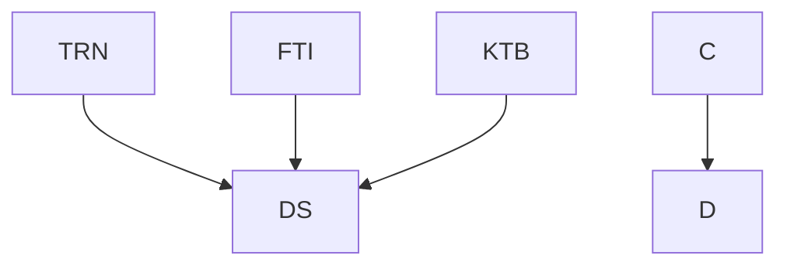

nice

DS      ... Dataset compiled from all data comming from resources {TRN,FTI,KTB} \
TRN     ... data from training xls\
FIT     ... data from garmin \
KTB     ... data z kalorickych tabulek \

Here is a simple flow chart:

Kokoko
pystik.info@gmail.com// pswd:skuko34T

pswd do express: lokpPIOH09243

[1] express aplikace je pro spravu hodinek, pokud chci pouzivat data z garminu, asi je budu muset vydolovat pres jine zarizreni a mozna i sparovat pres telefon.

[2] garminn connect je zrejme aplikace kde dostat vice dat.
jsou zde informace o trenincich .
data o trenincich ma stazeny pres express.
Historicka data o zdravotnich statistikach nejsou k dopoziic pro GC, jak udelat transfer a udelat jej vubec ?

[2] garming connect, https://connect.garmin.com/signin

data can be accessed by 4 ways
via standardard garmin connect web app
https://connect.garmin.com/modern/newsfeed
ask for them from 

via sdk 
https://developer.garmin.com/connect-iq/sdk/

https://towardsdatascience.com/accessing-and-cleaning-data-from-garmin-wearables-for-analysis-56c22b83d932
https://developer.garmin.com/fit/fitcsvtool/windows/
