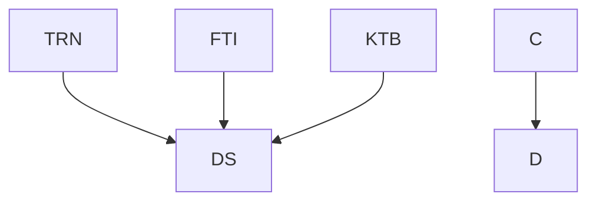

nice

DS      ... Dataset compiled from all data comming from resources {TRN,FTI,KTB}
TRN     ... data from training
FTI     ... data from garmin
KTB     ... data z kalorickych tabulek

Here is a simple flow chart:


```stl
solid cube_corner
  facet normal 0.0 -1.0 0.0
    outer loop
      vertex 0.0 0.0 0.0
      vertex 1.0 0.0 0.0
      vertex 0.0 0.0 1.0
    endloop
  endfacet
  facet normal 0.0 0.0 -1.0
    outer loop
      vertex 0.0 0.0 0.0
      vertex 0.0 1.0 0.0
      vertex 1.0 0.0 0.0
    endloop
  endfacet
  facet normal -1.0 0.0 0.0
    outer loop
      vertex 0.0 0.0 0.0
      vertex 0.0 0.0 1.0
      vertex 0.0 1.0 0.0
    endloop
  endfacet
  facet normal 0.577 0.577 0.577
    outer loop
      vertex 1.0 0.0 0.0
      vertex 0.0 1.0 0.0
      vertex 0.0 0.0 1.0
    endloop
  endfacet
endsolid
```

```stl
ISO-10303-21;
HEADER;
FILE_DESCRIPTION(('STEP AP214'),'1');
FILE_NAME('JV.stp','2023-04-24T12:23:28',(' '),(' '),'Spatial InterOp 3D',' ',' ');
FILE_SCHEMA(('AUTOMOTIVE_DESIGN { 1 0 10303 214 1 1 1 1 }'));
ENDSEC;
DATA;
#1=MECHANICAL_DESIGN_GEOMETRIC_PRESENTATION_REPRESENTATION(' ',(#10,#11,#12,#13,#14,#15,#16,#17,#18,#19,#20,#21),#6);
#2=PRODUCT_DEFINITION_CONTEXT('',#22,'design');
#3=APPLICATION_PROTOCOL_DEFINITION('INTERNATIONAL STANDARD','automotive_design',1994,#22);
#4=PRODUCT_CATEGORY_RELATIONSHIP('NONE','NONE',#23,#24);
#5=SHAPE_DEFINITION_REPRESENTATION(#25,#26);
#6= (GEOMETRIC_REPRESENTATION_CONTEXT(3)GLOBAL_UNCERTAINTY_ASSIGNED_CONTEXT((#29))GLOBAL_UNIT_ASSIGNED_CONTEXT((#31,#32,#33))REPRESENTATION_CONTEXT('NONE','WORKSPACE'));
#10=STYLED_ITEM('',(#35),#36);
#11=STYLED_ITEM('',(#37),#38);
#12=STYLED_ITEM('',(#39),#40);
#13=STYLED_ITEM('',(#41),#42);
#14=STYLED_ITEM('',(#43),#44);
#15=STYLED_ITEM('',(#45),#46);
#16=STYLED_ITEM('',(#47),#48);
#17=STYLED_ITEM('',(#49),#50);
#18=STYLED_ITEM('',(#51),#52);
#19=STYLED_ITEM('',(#53),#54);
#20=STYLED_ITEM('',(#55),#56);
#21=STYLED_ITEM('',(#57),#58);
#22=APPLICATION_CONTEXT(' ');
#23=PRODUCT_CATEGORY('part','NONE');
#24=PRODUCT_RELATED_PRODUCT_CATEGORY('detail',' ',(#59));
#25=PRODUCT_DEFINITION_SHAPE('NONE','NONE',#60);
#26=MANIFOLD_SURFACE_SHAPE_REPRESENTATION('1',(#61,#62),#6);
#29=UNCERTAINTY_MEASURE_WITH_UNIT(LENGTH_MEASURE(1.0E-06),#31,'','');
#31= (CONVERSION_BASED_UNIT('MILLIMETRE',#65)LENGTH_UNIT()NAMED_UNIT(#68));
#32= (NAMED_UNIT(#70)PLANE_ANGLE_UNIT()SI_UNIT($,.RADIAN.));
#33= (NAMED_UNIT(#70)SOLID_ANGLE_UNIT()SI_UNIT($,.STERADIAN.));
#35=PRESENTATION_STYLE_ASSIGNMENT((#76));
#36=FACE_SURFACE('',(#77),#78,.T.);
#37=PRESENTATION_STYLE_ASSIGNMENT((#79));
#38=FACE_SURFACE('',(#80),#81,.F.);
#39=PRESENTATION_STYLE_ASSIGNMENT((#82));
#40=FACE_SURFACE('',(#83),#84,.T.);
#41=PRESENTATION_STYLE_ASSIGNMENT((#85));
#42=FACE_SURFACE('',(#86),#87,.T.);
#43=PRESENTATION_STYLE_ASSIGNMENT((#88));
#44=FACE_SURFACE('',(#89),#90,.T.);
#45=PRESENTATION_STYLE_ASSIGNMENT((#91));
#46=FACE_SURFACE('',(#92),#93,.T.);
#47=PRESENTATION_STYLE_ASSIGNMENT((#94));
#48=FACE_SURFACE('',(#95),#96,.T.);
#49=PRESENTATION_STYLE_ASSIGNMENT((#97));
#50=FACE_SURFACE('',(#98),#99,.F.);
#51=PRESENTATION_STYLE_ASSIGNMENT((#100));
#52=FACE_SURFACE('',(#101),#102,.T.);
#53=PRESENTATION_STYLE_ASSIGNMENT((#103));
#54=FACE_SURFACE('',(#104),#105,.T.);
#55=PRESENTATION_STYLE_ASSIGNMENT((#106));
#56=FACE_SURFACE('',(#107),#108,.T.);
#57=PRESENTATION_STYLE_ASSIGNMENT((#109));
#58=FACE_SURFACE('',(#110),#111,.F.);
#59=PRODUCT('1','','PART--DESC',(#112));
#60=PRODUCT_DEFINITION('','NONE',#113,#2);
#61=SHELL_BASED_SURFACE_MODEL('1',(#114));
#62=AXIS2_PLACEMENT_3D('',#115,#116,#117);
#65=LENGTH_MEASURE_WITH_UNIT(LENGTH_MEASURE(1.0),#118);
#68=DIMENSIONAL_EXPONENTS(1.0,0.0,0.0,0.0,0.0,0.0,0.0);
#70=DIMENSIONAL_EXPONENTS(0.0,0.0,0.0,0.0,0.0,0.0,0.0);
#76=SURFACE_STYLE_USAGE(.BOTH.,#119);
#77=FACE_BOUND('',#120,.T.);
#78=B_SPLINE_SURFACE_WITH_KNOTS('',3,3,((#121,#122,#123,#124,#125,#126,#127,#128,#129,#130,#131,#132,#133,#134,#135,#136,#137,#138,#139,#140,#141,#142,#143,#144,#145,#146),(#147,#148,#149,#150,#151,#152,#153,#154,#155,#156,#157,#158,#159,#160,#161,#162,#163,#164,#165,#166,#167,#168,#169,#170,#171,#172),(#173,#174,#175,#176,#177,#178,#179,#180,#181,#182,#183,#184,#185,#186,#187,#188,#189,#190,#191,#192,#193,#194,#195,#196,#197,#198),(#199,#200,#201,#202,#203,#204,#205,#206,#207,#208,#209,#210,#211,#212,#213,#214,#215,#216,#217,#218,#219,#220,#221,#222,#223,#224),(#225,#226,#227,#228,#229,#230,#231,#232,#233,#234,#235,#236,#237,#238,#239,#240,#241,#242,#243,#244,#245,#246,#247,#248,#249,#250),(#251,#252,#253,#254,#255,#256,#257,#258,#259,#260,#261,#262,#263,#264,#265,#266,#267,#268,#269,#270,#271,#272,#273,#274,#275,#276),(#277,#278,#279,#280,#281,#282,#283,#284,#285,#286,#287,#288,#289,#290,#291,#292,#293,#294,#295,#296,#297,#298,#299,#300,#301,#302),(#303,#304,#305,#306,#307,#308,#309,#310,#311,#312,#313,#314,#315,#316,#317,#318,#319,#320,#321,#322,#323,#324,#325,#326,#327,#328),(#329,#330,#331,#332,#333,#334,#335,#336,#337,#338,#339,#340,#341,#342,#343,#344,#345,#346,#347,#348,#349,#350,#351,#352,#353,#354),(#355,#356,#357,#358,#359,#360,#361,#362,#363,#364,#365,#366,#367,#368,#369,#370,#371,#372,#373,#374,#375,#376,#377,#378,#379,#380),(#381,#382,#383,#384,#385,#386,#387,#388,#389,#390,#391,#392,#393,#394,#395,#396,#397,#398,#399,#400,#401,#402,#403,#404,#405,#406),(#407,#408,#409,#410,#411,#412,#413,#414,#415,#416,#417,#418,#419,#420,#421,#422,#423,#424,#425,#426,#427,#428,#429,#430,#431,#432),(#433,#434,#435,#436,#437,#438,#439,#440,#441,#442,#443,#444,#445,#446,#447,#448,#449,#450,#451,#452,#453,#454,#455,#456,#457,#458),(#459,#460,#461,#462,#463,#464,#465,#466,#467,#468,#469,#470,#471,#472,#473,#474,#475,#476,#477,#478,#479,#480,#481,#482,#483,#484),(#485,#486,#487,#488,#489,#490,#491,#492,#493,#494,#495,#496,#497,#498,#499,#500,#501,#502,#503,#504,#505,#506,#507,#508,#509,#510),(#511,#512,#513,#514,#515,#516,#517,#518,#519,#520,#521,#522,#523,#524,#525,#526,#527,#528,#529,#530,#531,#532,#533,#534,#535,#536),(#537,#538,#539,#540,#541,#542,#543,#544,#545,#546,#547,#548,#549,#550,#551,#552,#553,#554,#555,#556,#557,#558,#559,#560,#561,#562),(#563,#564,#565,#566,#567,#568,#569,#570,#571,#572,#573,#574,#575,#576,#577,#578,#579,#580,#581,#582,#583,#584,#585,#586,#587,#588),(#589,#590,#591,#592,#593,#594,#595,#596,#597,#598,#599,#600,#601,#602,#603,#604,#605,#606,#607,#608,#609,#610,#611,#612,#613,#614),(#615,#616,#617,#618,#619,#620,#621,#622,#623,#624,#625,#626,#627,#628,#629,#630,#631,#632,#633,#634,#635,#636,#637,#638,#639,#640),(#641,#642,#643,#644,#645,#646,#647,#648,#649,#650,#651,#652,#653,#654,#655,#656,#657,#658,#659,#660,#661,#662,#663,#664,#665,#666),(#667,#668,#669,#670,#671,#672,#673,#674,#675,#676,#677,#678,#679,#680,#681,#682,#683,#684,#685,#686,#687,#688,#689,#690,#691,#692),(#693,#694,#695,#696,#697,#698,#699,#700,#701,#702,#703,#704,#705,#706,#707,#708,#709,#710,#711,#712,#713,#714,#715,#716,#717,#718),(#719,#720,#721,#722,#723,#724,#725,#726,#727,#728,#729,#730,#731,#732,#733,#734,#735,#736,#737,#738,#739,#740,#741,#742,#743,#744),(#745,#746,#747,#748,#749,#750,#751,#752,#753,#754,#755,#756,#757,#758,#759,#760,#761,#762,#763,#764,#765,#766,#767,#768,#769,#770),(#771,#772,#773,#774,#775,#776,#777,#778,#779,#780,#781,#782,#783,#784,#785,#786,#787,#788,#789,#790,#791,#792,#793,#794,#795,#796),(#797,#798,#799,#800,#801,#802,#803,#804,#805,#806,#807,#808,#809,#810,#811,#812,#813,#814,#815,#816,#817,#818,#819,#820,#821,#822),(#823,#824,#825,#826,#827,#828,#829,#830,#831,#832,#833,#834,#835,#836,#837,#838,#839,#840,#841,#842,#843,#844,#845,#846,#847,#848),(#849,#850,#851,#852,#853,#854,#855,#856,#857,#858,#859,#860,#861,#862,#863,#864,#865,#866,#867,#868,#869,#870,#871,#872,#873,#874),(#875,#876,#877,#878,#879,#880,#881,#882,#883,#884,#885,#886,#887,#888,#889,#890,#891,#892,#893,#894,#895,#896,#897,#898,#899,#900),(#901,#902,#903,#904,#905,#906,#907,#908,#909,#910,#911,#912,#913,#914,#915,#916,#917,#918,#919,#920,#921,#922,#923,#924,#925,#926)),.UNSPECIFIED.,.F.,.F.,.F.,(4,3,1,1,1,1,1,1,1,1,1,1,1,1,1,1,1,1,1,1,1,1,1,3,4),(4,3,1,1,1,1,1,1,1,1,1,1,1,1,1,1,1,1,3,4),(-1.68279412275991,6.03565640223674,49.714817438,97.0870783684,144.4593392987,191.8316002291,239.2038611595,286.5761220898,333.9483830202,381.3206439506,428.6929048809,476.0651658113,523.4374267417,570.809687672,618.1819486024,665.5542095328,712.9264704631,760.2987313935,807.6709923239,855.0432532542,902.4155141846,949.787775115,997.1600360453,1011.97846219092,1019.84076881926),(-7.70086168700306,1.17000209858809,10.0868607687,23.3324641943,36.57806762,49.8236710457,63.0692744714,76.3148778971,89.5604813228,102.8060847485,116.0516881741,129.2972915998,142.5428950255,155.7884984512,169.0341018769,182.2797053026,195.5253087283,208.7709121539,213.36362768196,219.275846593191),.UNSPECIFIED.);
#79=SURFACE_STYLE_USAGE(.BOTH.,#927);
#80=FACE_BOUND('',#928,.T.);
#81=B_SPLINE_SURFACE_WITH_KNOTS('',3,3,((#929,#930,#931,#932,#933,#934,#935,#936,#937,#938,#939,#940,#941,#942,#943,#944,#945,#946,#947,#948,#949,#950,#951,#952,#953,#954,#955,#956,#957,#958,#959,#960),(#961,#962,#963,#964,#965,#966,#967,#968,#969,#970,#971,#972,#973,#974,#975,#976,#977,#978,#979,#980,#981,#982,#983,#984,#985,#986,#987,#988,#989,#990,#991,#992),(#993,#994,#995,#996,#997,#998,#999,#1000,#1001,#1002,#1003,#1004,#1005,#1006,#1007,#1008,#1009,#1010,#1011,#1012,#1013,#1014,#1015,#1016,#1017,#1018,#1019,#1020,#1021,#1022,#1023,#1024),(#1025,#1026,#1027,#1028,#1029,#1030,#1031,#1032,#1033,#1034,#1035,#1036,#1037,#1038,#1039,#1040,#1041,#1042,#1043,#1044,#1045,#1046,#1047,#1048,#1049,#1050,#1051,#1052,#1053,#1054,#1055,#1056),(#1057,#1058,#1059,#1060,#1061,#1062,#1063,#1064,#1065,#1066,#1067,#1068,#1069,#1070,#1071,#1072,#1073,#1074,#1075,#1076,#1077,#1078,#1079,#1080,#1081,#1082,#1083,#1084,#1085,#1086,#1087,#1088),(#1089,#1090,#1091,#1092,#1093,#1094,#1095,#1096,#1097,#1098,#1099,#1100,#1101,#1102,#1103,#1104,#1105,#1106,#1107,#1108,#1109,#1110,#1111,#1112,#1113,#1114,#1115,#1116,#1117,#1118,#1119,#1120),(#1121,#1122,#1123,#1124,#1125,#1126,#1127,#1128,#1129,#1130,#1131,#1132,#1133,#1134,#1135,#1136,#1137,#1138,#1139,#1140,#1141,#1142,#1143,#1144,#1145,#1146,#1147,#1148,#1149,#1150,#1151,#1152),(#1153,#1154,#1155,#1156,#1157,#1158,#1159,#1160,#1161,#1162,#1163,#1164,#1165,#1166,#1167,#1168,#1169,#1170,#1171,#1172,#1173,#1174,#1175,#1176,#1177,#1178,#1179,#1180,#1181,#1182,#1183,#1184),(#1185,#1186,#1187,#1188,#1189,#1190,#1191,#1192,#1193,#1194,#1195,#1196,#1197,#1198,#1199,#1200,#1201,#1202,#1203,#1204,#1205,#1206,#1207,#1208,#1209,#1210,#1211,#1212,#1213,#1214,#1215,#1216),(#1217,#1218,#1219,#1220,#1221,#1222,#1223,#1224,#1225,#1226,#1227,#1228,#1229,#1230,#1231,#1232,#1233,#1234,#1235,#1236,#1237,#1238,#1239,#1240,#1241,#1242,#1243,#1244,#1245,#1246,#1247,#1248),(#1249,#1250,#1251,#1252,#1253,#1254,#1255,#1256,#1257,#1258,#1259,#1260,#1261,#1262,#1263,#1264,#1265,#1266,#1267,#1268,#1269,#1270,#1271,#1272,#1273,#1274,#1275,#1276,#1277,#1278,#1279,#1280),(#1281,#1282,#1283,#1284,#1285,#1286,#1287,#1288,#1289,#1290,#1291,#1292,#1293,#1294,#1295,#1296,#1297,#1298,#1299,#1300,#1301,#1302,#1303,#1304,#1305,#1306,#1307,#1308,#1309,#1310,#1311,#1312),(#1313,#1314,#1315,#1316,#1317,#1318,#1319,#1320,#1321,#1322,#1323,#1324,#1325,#1326,#1327,#1328,#1329,#1330,#1331,#1332,#1333,#1334,#1335,#1336,#1337,#1338,#1339,#1340,#1341,#1342,#1343,#1344),(#1345,#1346,#1347,#1348,#1349,#1350,#1351,#1352,#1353,#1354,#1355,#1356,#1357,#1358,#1359,#1360,#1361,#1362,#1363,#1364,#1365,#1366,#1367,#1368,#1369,#1370,#1371,#1372,#1373,#1374,#1375,#1376),(#1377,#1378,#1379,#1380,#1381,#1382,#1383,#1384,#1385,#1386,#1387,#1388,#1389,#1390,#1391,#1392,#1393,#1394,#1395,#1396,#1397,#1398,#1399,#1400,#1401,#1402,#1403,#1404,#1405,#1406,#1407,#1408),(#1409,#1410,#1411,#1412,#1413,#1414,#1415,#1416,#1417,#1418,#1419,#1420,#1421,#1422,#1423,#1424,#1425,#1426,#1427,#1428,#1429,#1430,#1431,#1432,#1433,#1434,#1435,#1436,#1437,#1438,#1439,#1440),(#1441,#1442,#1443,#1444,#1445,#1446,#1447,#1448,#1449,#1450,#1451,#1452,#1453,#1454,#1455,#1456,#1457,#1458,#1459,#1460,#1461,#1462,#1463,#1464,#1465,#1466,#1467,#1468,#1469,#1470,#1471,#1472),(#1473,#1474,#1475,#1476,#1477,#1478,#1479,#1480,#1481,#1482,#1483,#1484,#1485,#1486,#1487,#1488,#1489,#1490,#1491,#1492,#1493,#1494,#1495,#1496,#1497,#1498,#1499,#1500,#1501,#1502,#1503,#1504),(#1505,#1506,#1507,#1508,#1509,#1510,#1511,#1512,#1513,#1514,#1515,#1516,#1517,#1518,#1519,#1520,#1521,#1522,#1523,#1524,#1525,#1526,#1527,#1528,#1529,#1530,#1531,#1532,#1533,#1534,#1535,#1536),(#1537,#1538,#1539,#1540,#1541,#1542,#1543,#1544,#1545,#1546,#1547,#1548,#1549,#1550,#1551,#1552,#1553,#1554,#1555,#1556,#1557,#1558,#1559,#1560,#1561,#1562,#1563,#1564,#1565,#1566,#1567,#1568),(#1569,#1570,#1571,#1572,#1573,#1574,#1575,#1576,#1577,#1578,#1579,#1580,#1581,#1582,#1583,#1584,#1585,#1586,#1587,#1588,#1589,#1590,#1591,#1592,#1593,#1594,#1595,#1596,#1597,#1598,#1599,#1600),(#1601,#1602,#1603,#1604,#1605,#1606,#1607,#1608,#1609,#1610,#1611,#1612,#1613,#1614,#1615,#1616,#1617,#1618,#1619,#1620,#1621,#1622,#1623,#1624,#1625,#1626,#1627,#1628,#1629,#1630,#1631,#1632),(#1633,#1634,#1635,#1636,#1637,#1638,#1639,#1640,#1641,#1642,#1643,#1644,#1645,#1646,#1647,#1648,#1649,#1650,#1651,#1652,#1653,#1654,#1655,#1656,#1657,#1658,#1659,#1660,#1661,#1662,#1663,#1664),(#1665,#1666,#1667,#1668,#1669,#1670,#1671,#1672,#1673,#1674,#1675,#1676,#1677,#1678,#1679,#1680,#1681,#1682,#1683,#1684,#1685,#1686,#1687,#1688,#1689,#1690,#1691,#1692,#1693,#1694,#1695,#1696),(#1697,#1698,#1699,#1700,#1701,#1702,#1703,#1704,#1705,#1706,#1707,#1708,#1709,#1710,#1711,#1712,#1713,#1714,#1715,#1716,#1717,#1718,#1719,#1720,#1721,#1722,#1723,#1724,#1725,#1726,#1727,#1728),(#1729,#1730,#1731,#1732,#1733,#1734,#1735,#1736,#1737,#1738,#1739,#1740,#1741,#1742,#1743,#1744,#1745,#1746,#1747,#1748,#1749,#1750,#1751,#1752,#1753,#1754,#1755,#1756,#1757,#1758,#1759,#1760),(#1761,#1762,#1763,#1764,#1765,#1766,#1767,#1768,#1769,#1770,#1771,#1772,#1773,#1774,#1775,#1776,#1777,#1778,#1779,#1780,#1781,#1782,#1783,#1784,#1785,#1786,#1787,#1788,#1789,#1790,#1791,#1792),(#1793,#1794,#1795,#1796,#1797,#1798,#1799,#1800,#1801,#1802,#1803,#1804,#1805,#1806,#1807,#1808,#1809,#1810,#1811,#1812,#1813,#1814,#1815,#1816,#1817,#1818,#1819,#1820,#1821,#1822,#1823,#1824),(#1825,#1826,#1827,#1828,#1829,#1830,#1831,#1832,#1833,#1834,#1835,#1836,#1837,#1838,#1839,#1840,#1841,#1842,#1843,#1844,#1845,#1846,#1847,#1848,#1849,#1850,#1851,#1852,#1853,#1854,#1855,#1856),(#1857,#1858,#1859,#1860,#1861,#1862,#1863,#1864,#1865,#1866,#1867,#1868,#1869,#1870,#1871,#1872,#1873,#1874,#1875,#1876,#1877,#1878,#1879,#1880,#1881,#1882,#1883,#1884,#1885,#1886,#1887,#1888),(#1889,#1890,#1891,#1892,#1893,#1894,#1895,#1896,#1897,#1898,#1899,#1900,#1901,#1902,#1903,#1904,#1905,#1906,#1907,#1908,#1909,#1910,#1911,#1912,#1913,#1914,#1915,#1916,#1917,#1918,#1919,#1920),(#1921,#1922,#1923,#1924,#1925,#1926,#1927,#1928,#1929,#1930,#1931,#1932,#1933,#1934,#1935,#1936,#1937,#1938,#1939,#1940,#1941,#1942,#1943,#1944,#1945,#1946,#1947,#1948,#1949,#1950,#1951,#1952),(#1953,#1954,#1955,#1956,#1957,#1958,#1959,#1960,#1961,#1962,#1963,#1964,#1965,#1966,#1967,#1968,#1969,#1970,#1971,#1972,#1973,#1974,#1975,#1976,#1977,#1978,#1979,#1980,#1981,#1982,#1983,#1984),(#1985,#1986,#1987,#1988,#1989,#1990,#1991,#1992,#1993,#1994,#1995,#1996,#1997,#1998,#1999,#2000,#2001,#2002,#2003,#2004,#2005,#2006,#2007,#2008,#2009,#2010,#2011,#2012,#2013,#2014,#2015,#2016),(#2017,#2018,#2019,#2020,#2021,#2022,#2023,#2024,#2025,#2026,#2027,#2028,#2029,#2030,#2031,#2032,#2033,#2034,#2035,#2036,#2037,#2038,#2039,#2040,#2041,#2042,#2043,#2044,#2045,#2046,#2047,#2048),(#2049,#2050,#2051,#2052,#2053,#2054,#2055,#2056,#2057,#2058,#2059,#2060,#2061,#2062,#2063,#2064,#2065,#2066,#2067,#2068,#2069,#2070,#2071,#2072,#2073,#2074,#2075,#2076,#2077,#2078,#2079,#2080),(#2081,#2082,#2083,#2084,#2085,#2086,#2087,#2088,#2089,#2090,#2091,#2092,#2093,#2094,#2095,#2096,#2097,#2098,#2099,#2100,#2101,#2102,#2103,#2104,#2105,#2106,#2107,#2108,#2109,#2110,#2111,#2112),(#2113,#2114,#2115,#2116,#2117,#2118,#2119,#2120,#2121,#2122,#2123,#2124,#2125,#2126,#2127,#2128,#2129,#2130,#2131,#2132,#2133,#2134,#2135,#2136,#2137,#2138,#2139,#2140,#2141,#2142,#2143,#2144),(#2145,#2146,#2147,#2148,#2149,#2150,#2151,#2152,#2153,#2154,#2155,#2156,#2157,#2158,#2159,#2160,#2161,#2162,#2163,#2164,#2165,#2166,#2167,#2168,#2169,#2170,#2171,#2172,#2173,#2174,#2175,#2176),(#2177,#2178,#2179,#2180,#2181,#2182,#2183,#2184,#2185,#2186,#2187,#2188,#2189,#2190,#2191,#2192,#2193,#2194,#2195,#2196,#2197,#2198,#2199,#2200,#2201,#2202,#2203,#2204,#2205,#2206,#2207,#2208),(#2209,#2210,#2211,#2212,#2213,#2214,#2215,#2216,#2217,#2218,#2219,#2220,#2221,#2222,#2223,#2224,#2225,#2226,#2227,#2228,#2229,#2230,#2231,#2232,#2233,#2234,#2235,#2236,#2237,#2238,#2239,#2240),(#2241,#2242,#2243,#2244,#2245,#2246,#2247,#2248,#2249,#2250,#2251,#2252,#2253,#2254,#2255,#2256,#2257,#2258,#2259,#2260,#2261,#2262,#2263,#2264,#2265,#2266,#2267,#2268,#2269,#2270,#2271,#2272),(#2273,#2274,#2275,#2276,#2277,#2278,#2279,#2280,#2281,#2282,#2283,#2284,#2285,#2286,#2287,#2288,#2289,#2290,#2291,#2292,#2293,#2294,#2295,#2296,#2297,#2298,#2299,#2300,#2301,#2302,#2303,#2304),(#2305,#2306,#2307,#2308,#2309,#2310,#2311,#2312,#2313,#2314,#2315,#2316,#2317,#2318,#2319,#2320,#2321,#2322,#2323,#2324,#2325,#2326,#2327,#2328,#2329,#2330,#2331,#2332,#2333,#2334,#2335,#2336)),.UNSPECIFIED.,.F.,.F.,.F.,(4,2,2,2,2,2,2,2,2,2,2,2,2,2,2,2,2,2,2,2,2,4),(4,2,2,2,2,2,2,2,2,2,2,2,2,2,2,4),(0.0,0.236015385498788,0.267312522039129,0.346400950979583,0.374449980611426,0.43207830572582,0.471246723468377,0.494033972514431,0.580816191071324,0.604931166570321,0.638791567585255,0.68215013674904,0.705138328049574,0.725594162466684,0.769452299898881,0.804476618032948,0.828833460028794,0.874038037167019,0.902217052936085,0.935577727736746,0.977230309227939,1.0),(0.0,0.0160424096910567,0.0880669516843433,0.136544884281026,0.176264842445092,0.259646097242959,0.269732694267308,0.381225455310265,0.496955892832536,0.512586236329759,0.629800211732437,0.643246276722488,0.756832546093898,0.770685147165561,0.885612938075243,1.0),.UNSPECIFIED.);
#82=SURFACE_STYLE_USAGE(.BOTH.,#2337);
#83=FACE_BOUND('',#2338,.T.);
#84=B_SPLINE_SURFACE_WITH_KNOTS('',3,3,((#2339,#2340,#2341,#2342),(#2343,#2344,#2345,#2346),(#2347,#2348,#2349,#2350),(#2351,#2352,#2353,#2354),(#2355,#2356,#2357,#2358),(#2359,#2360,#2361,#2362),(#2363,#2364,#2365,#2366),(#2367,#2368,#2369,#2370),(#2371,#2372,#2373,#2374),(#2375,#2376,#2377,#2378),(#2379,#2380,#2381,#2382),(#2383,#2384,#2385,#2386),(#2387,#2388,#2389,#2390),(#2391,#2392,#2393,#2394),(#2395,#2396,#2397,#2398),(#2399,#2400,#2401,#2402),(#2403,#2404,#2405,#2406),(#2407,#2408,#2409,#2410),(#2411,#2412,#2413,#2414),(#2415,#2416,#2417,#2418),(#2419,#2420,#2421,#2422),(#2423,#2424,#2425,#2426),(#2427,#2428,#2429,#2430),(#2431,#2432,#2433,#2434),(#2435,#2436,#2437,#2438),(#2439,#2440,#2441,#2442),(#2443,#2444,#2445,#2446),(#2447,#2448,#2449,#2450),(#2451,#2452,#2453,#2454),(#2455,#2456,#2457,#2458),(#2459,#2460,#2461,#2462),(#2463,#2464,#2465,#2466),(#2467,#2468,#2469,#2470),(#2471,#2472,#2473,#2474),(#2475,#2476,#2477,#2478),(#2479,#2480,#2481,#2482),(#2483,#2484,#2485,#2486),(#2487,#2488,#2489,#2490),(#2491,#2492,#2493,#2494),(#2495,#2496,#2497,#2498),(#2499,#2500,#2501,#2502),(#2503,#2504,#2505,#2506),(#2507,#2508,#2509,#2510),(#2511,#2512,#2513,#2514),(#2515,#2516,#2517,#2518),(#2519,#2520,#2521,#2522),(#2523,#2524,#2525,#2526),(#2527,#2528,#2529,#2530),(#2531,#2532,#2533,#2534),(#2535,#2536,#2537,#2538),(#2539,#2540,#2541,#2542),(#2543,#2544,#2545,#2546),(#2547,#2548,#2549,#2550),(#2551,#2552,#2553,#2554),(#2555,#2556,#2557,#2558),(#2559,#2560,#2561,#2562),(#2563,#2564,#2565,#2566),(#2567,#2568,#2569,#2570),(#2571,#2572,#2573,#2574),(#2575,#2576,#2577,#2578),(#2579,#2580,#2581,#2582),(#2583,#2584,#2585,#2586),(#2587,#2588,#2589,#2590),(#2591,#2592,#2593,#2594),(#2595,#2596,#2597,#2598),(#2599,#2600,#2601,#2602),(#2603,#2604,#2605,#2606),(#2607,#2608,#2609,#2610)),.UNSPECIFIED.,.F.,.F.,.F.,(4,1,1,2,2,2,2,2,2,2,2,2,2,2,2,2,2,2,2,2,2,2,2,2,2,2,2,2,2,2,2,2,2,2,4),(4,4),(0.00609417723922166,0.0155619008,0.0162147759,0.0276362709,0.0642891952,0.1260485235,0.1878078517,0.24956718,0.3113265082,0.3422061724,0.3730858365,0.4039655006,0.4348451647,0.4657248289,0.496604493,0.5274841571,0.5583638212,0.5892434854,0.6201231495,0.6818824777,0.7127621419,0.743641806,0.7745214701,0.7899613022,0.8054011342,0.8208409663,0.8362807984,0.8671604625,0.8980401266,0.9289197908,0.9443596228,0.9597994549,0.9752392869,0.990679119,0.994071146252892),(0.0,0.9940360354),.UNSPECIFIED.);
#85=SURFACE_STYLE_USAGE(.BOTH.,#2611);
#86=FACE_BOUND('',#2612,.T.);
#87=B_SPLINE_SURFACE_WITH_KNOTS('',3,3,((#2613,#2614,#2615,#2616,#2617,#2618,#2619,#2620,#2621,#2622,#2623,#2624,#2625,#2626,#2627,#2628,#2629,#2630,#2631,#2632,#2633,#2634,#2635),(#2636,#2637,#2638,#2639,#2640,#2641,#2642,#2643,#2644,#2645,#2646,#2647,#2648,#2649,#2650,#2651,#2652,#2653,#2654,#2655,#2656,#2657,#2658),(#2659,#2660,#2661,#2662,#2663,#2664,#2665,#2666,#2667,#2668,#2669,#2670,#2671,#2672,#2673,#2674,#2675,#2676,#2677,#2678,#2679,#2680,#2681),(#2682,#2683,#2684,#2685,#2686,#2687,#2688,#2689,#2690,#2691,#2692,#2693,#2694,#2695,#2696,#2697,#2698,#2699,#2700,#2701,#2702,#2703,#2704),(#2705,#2706,#2707,#2708,#2709,#2710,#2711,#2712,#2713,#2714,#2715,#2716,#2717,#2718,#2719,#2720,#2721,#2722,#2723,#2724,#2725,#2726,#2727),(#2728,#2729,#2730,#2731,#2732,#2733,#2734,#2735,#2736,#2737,#2738,#2739,#2740,#2741,#2742,#2743,#2744,#2745,#2746,#2747,#2748,#2749,#2750),(#2751,#2752,#2753,#2754,#2755,#2756,#2757,#2758,#2759,#2760,#2761,#2762,#2763,#2764,#2765,#2766,#2767,#2768,#2769,#2770,#2771,#2772,#2773),(#2774,#2775,#2776,#2777,#2778,#2779,#2780,#2781,#2782,#2783,#2784,#2785,#2786,#2787,#2788,#2789,#2790,#2791,#2792,#2793,#2794,#2795,#2796),(#2797,#2798,#2799,#2800,#2801,#2802,#2803,#2804,#2805,#2806,#2807,#2808,#2809,#2810,#2811,#2812,#2813,#2814,#2815,#2816,#2817,#2818,#2819),(#2820,#2821,#2822,#2823,#2824,#2825,#2826,#2827,#2828,#2829,#2830,#2831,#2832,#2833,#2834,#2835,#2836,#2837,#2838,#2839,#2840,#2841,#2842),(#2843,#2844,#2845,#2846,#2847,#2848,#2849,#2850,#2851,#2852,#2853,#2854,#2855,#2856,#2857,#2858,#2859,#2860,#2861,#2862,#2863,#2864,#2865),(#2866,#2867,#2868,#2869,#2870,#2871,#2872,#2873,#2874,#2875,#2876,#2877,#2878,#2879,#2880,#2881,#2882,#2883,#2884,#2885,#2886,#2887,#2888),(#2889,#2890,#2891,#2892,#2893,#2894,#2895,#2896,#2897,#2898,#2899,#2900,#2901,#2902,#2903,#2904,#2905,#2906,#2907,#2908,#2909,#2910,#2911),(#2912,#2913,#2914,#2915,#2916,#2917,#2918,#2919,#2920,#2921,#2922,#2923,#2924,#2925,#2926,#2927,#2928,#2929,#2930,#2931,#2932,#2933,#2934),(#2935,#2936,#2937,#2938,#2939,#2940,#2941,#2942,#2943,#2944,#2945,#2946,#2947,#2948,#2949,#2950,#2951,#2952,#2953,#2954,#2955,#2956,#2957),(#2958,#2959,#2960,#2961,#2962,#2963,#2964,#2965,#2966,#2967,#2968,#2969,#2970,#2971,#2972,#2973,#2974,#2975,#2976,#2977,#2978,#2979,#2980),(#2981,#2982,#2983,#2984,#2985,#2986,#2987,#2988,#2989,#2990,#2991,#2992,#2993,#2994,#2995,#2996,#2997,#2998,#2999,#3000,#3001,#3002,#3003),(#3004,#3005,#3006,#3007,#3008,#3009,#3010,#3011,#3012,#3013,#3014,#3015,#3016,#3017,#3018,#3019,#3020,#3021,#3022,#3023,#3024,#3025,#3026),(#3027,#3028,#3029,#3030,#3031,#3032,#3033,#3034,#3035,#3036,#3037,#3038,#3039,#3040,#3041,#3042,#3043,#3044,#3045,#3046,#3047,#3048,#3049),(#3050,#3051,#3052,#3053,#3054,#3055,#3056,#3057,#3058,#3059,#3060,#3061,#3062,#3063,#3064,#3065,#3066,#3067,#3068,#3069,#3070,#3071,#3072),(#3073,#3074,#3075,#3076,#3077,#3078,#3079,#3080,#3081,#3082,#3083,#3084,#3085,#3086,#3087,#3088,#3089,#3090,#3091,#3092,#3093,#3094,#3095),(#3096,#3097,#3098,#3099,#3100,#3101,#3102,#3103,#3104,#3105,#3106,#3107,#3108,#3109,#3110,#3111,#3112,#3113,#3114,#3115,#3116,#3117,#3118),(#3119,#3120,#3121,#3122,#3123,#3124,#3125,#3126,#3127,#3128,#3129,#3130,#3131,#3132,#3133,#3134,#3135,#3136,#3137,#3138,#3139,#3140,#3141),(#3142,#3143,#3144,#3145,#3146,#3147,#3148,#3149,#3150,#3151,#3152,#3153,#3154,#3155,#3156,#3157,#3158,#3159,#3160,#3161,#3162,#3163,#3164),(#3165,#3166,#3167,#3168,#3169,#3170,#3171,#3172,#3173,#3174,#3175,#3176,#3177,#3178,#3179,#3180,#3181,#3182,#3183,#3184,#3185,#3186,#3187),(#3188,#3189,#3190,#3191,#3192,#3193,#3194,#3195,#3196,#3197,#3198,#3199,#3200,#3201,#3202,#3203,#3204,#3205,#3206,#3207,#3208,#3209,#3210),(#3211,#3212,#3213,#3214,#3215,#3216,#3217,#3218,#3219,#3220,#3221,#3222,#3223,#3224,#3225,#3226,#3227,#3228,#3229,#3230,#3231,#3232,#3233),(#3234,#3235,#3236,#3237,#3238,#3239,#3240,#3241,#3242,#3243,#3244,#3245,#3246,#3247,#3248,#3249,#3250,#3251,#3252,#3253,#3254,#3255,#3256)),.UNSPECIFIED.,.F.,.F.,.F.,(4,1,1,1,1,1,1,1,1,1,1,1,1,1,1,1,1,1,1,2,1,3,4),(4,3,1,1,1,1,1,1,1,1,1,1,1,1,1,3,4),(0.0059288937460132,0.0715099525,0.1553634205,0.2392168885,0.3230703566,0.4069238246,0.4488505586,0.4907772926,0.5327040266,0.5746307606,0.6165574946,0.6584842286,0.7004109626,0.7423376966,0.7842644306,0.8261911646,0.8681178986,0.9100446326,0.9519713666,0.9938981007,0.9939031007,0.993927179284873,1.0120008395736),(-0.0131621474714399,0.00495766830403121,0.0514196869,0.1304272873,0.2094348878,0.2884424882,0.3674500887,0.4464576892,0.5254652896,0.6044728901,0.6814389486,0.7584050072,0.8353710657,0.9123371243,0.9893031828,0.994071146313459,0.994295686436873),.UNSPECIFIED.);
#88=SURFACE_STYLE_USAGE(.BOTH.,#3257);
#89=FACE_BOUND('',#3258,.T.);
#90=B_SPLINE_SURFACE_WITH_KNOTS('',3,3,((#3259,#3260,#3261,#3262,#3263,#3264),(#3265,#3266,#3267,#3268,#3269,#3270),(#3271,#3272,#3273,#3274,#3275,#3276),(#3277,#3278,#3279,#3280,#3281,#3282),(#3283,#3284,#3285,#3286,#3287,#3288)),.UNSPECIFIED.,.F.,.F.,.F.,(4,1,4),(4,1,1,4),(0.00592885374312523,0.1089552288,0.994071146255726),(0.0,0.2776377662,0.7203468609,1.0),.UNSPECIFIED.);
#91=SURFACE_STYLE_USAGE(.BOTH.,#3289);
#92=FACE_BOUND('',#3290,.T.);
#93=B_SPLINE_SURFACE_WITH_KNOTS('',3,3,((#3291,#3292,#3293,#3294,#3295,#3296,#3297,#3298,#3299,#3300,#3301,#3302,#3303,#3304,#3305,#3306,#3307,#3308,#3309,#3310,#3311,#3312,#3313,#3314,#3315),(#3316,#3317,#3318,#3319,#3320,#3321,#3322,#3323,#3324,#3325,#3326,#3327,#3328,#3329,#3330,#3331,#3332,#3333,#3334,#3335,#3336,#3337,#3338,#3339,#3340),(#3341,#3342,#3343,#3344,#3345,#3346,#3347,#3348,#3349,#3350,#3351,#3352,#3353,#3354,#3355,#3356,#3357,#3358,#3359,#3360,#3361,#3362,#3363,#3364,#3365),(#3366,#3367,#3368,#3369,#3370,#3371,#3372,#3373,#3374,#3375,#3376,#3377,#3378,#3379,#3380,#3381,#3382,#3383,#3384,#3385,#3386,#3387,#3388,#3389,#3390),(#3391,#3392,#3393,#3394,#3395,#3396,#3397,#3398,#3399,#3400,#3401,#3402,#3403,#3404,#3405,#3406,#3407,#3408,#3409,#3410,#3411,#3412,#3413,#3414,#3415),(#3416,#3417,#3418,#3419,#3420,#3421,#3422,#3423,#3424,#3425,#3426,#3427,#3428,#3429,#3430,#3431,#3432,#3433,#3434,#3435,#3436,#3437,#3438,#3439,#3440),(#3441,#3442,#3443,#3444,#3445,#3446,#3447,#3448,#3449,#3450,#3451,#3452,#3453,#3454,#3455,#3456,#3457,#3458,#3459,#3460,#3461,#3462,#3463,#3464,#3465),(#3466,#3467,#3468,#3469,#3470,#3471,#3472,#3473,#3474,#3475,#3476,#3477,#3478,#3479,#3480,#3481,#3482,#3483,#3484,#3485,#3486,#3487,#3488,#3489,#3490),(#3491,#3492,#3493,#3494,#3495,#3496,#3497,#3498,#3499,#3500,#3501,#3502,#3503,#3504,#3505,#3506,#3507,#3508,#3509,#3510,#3511,#3512,#3513,#3514,#3515),(#3516,#3517,#3518,#3519,#3520,#3521,#3522,#3523,#3524,#3525,#3526,#3527,#3528,#3529,#3530,#3531,#3532,#3533,#3534,#3535,#3536,#3537,#3538,#3539,#3540),(#3541,#3542,#3543,#3544,#3545,#3546,#3547,#3548,#3549,#3550,#3551,#3552,#3553,#3554,#3555,#3556,#3557,#3558,#3559,#3560,#3561,#3562,#3563,#3564,#3565),(#3566,#3567,#3568,#3569,#3570,#3571,#3572,#3573,#3574,#3575,#3576,#3577,#3578,#3579,#3580,#3581,#3582,#3583,#3584,#3585,#3586,#3587,#3588,#3589,#3590),(#3591,#3592,#3593,#3594,#3595,#3596,#3597,#3598,#3599,#3600,#3601,#3602,#3603,#3604,#3605,#3606,#3607,#3608,#3609,#3610,#3611,#3612,#3613,#3614,#3615),(#3616,#3617,#3618,#3619,#3620,#3621,#3622,#3623,#3624,#3625,#3626,#3627,#3628,#3629,#3630,#3631,#3632,#3633,#3634,#3635,#3636,#3637,#3638,#3639,#3640),(#3641,#3642,#3643,#3644,#3645,#3646,#3647,#3648,#3649,#3650,#3651,#3652,#3653,#3654,#3655,#3656,#3657,#3658,#3659,#3660,#3661,#3662,#3663,#3664,#3665),(#3666,#3667,#3668,#3669,#3670,#3671,#3672,#3673,#3674,#3675,#3676,#3677,#3678,#3679,#3680,#3681,#3682,#3683,#3684,#3685,#3686,#3687,#3688,#3689,#3690),(#3691,#3692,#3693,#3694,#3695,#3696,#3697,#3698,#3699,#3700,#3701,#3702,#3703,#3704,#3705,#3706,#3707,#3708,#3709,#3710,#3711,#3712,#3713,#3714,#3715),(#3716,#3717,#3718,#3719,#3720,#3721,#3722,#3723,#3724,#3725,#3726,#3727,#3728,#3729,#3730,#3731,#3732,#3733,#3734,#3735,#3736,#3737,#3738,#3739,#3740),(#3741,#3742,#3743,#3744,#3745,#3746,#3747,#3748,#3749,#3750,#3751,#3752,#3753,#3754,#3755,#3756,#3757,#3758,#3759,#3760,#3761,#3762,#3763,#3764,#3765),(#3766,#3767,#3768,#3769,#3770,#3771,#3772,#3773,#3774,#3775,#3776,#3777,#3778,#3779,#3780,#3781,#3782,#3783,#3784,#3785,#3786,#3787,#3788,#3789,#3790)),.UNSPECIFIED.,.F.,.F.,.F.,(4,1,1,1,1,1,1,1,1,1,1,1,1,1,1,1,1,4),(4,1,1,1,1,1,1,1,1,1,1,1,1,1,1,1,1,1,1,1,1,1,4),(1.17098016812315,10.0899065448,23.335506713,36.5811068811,49.8267070493,63.0723072175,76.3179073856,89.5635075538,102.8091077219,116.0547078901,129.3003080583,142.5459082264,155.7915083946,169.0371085627,182.2827087309,195.528308899,208.7739090672,213.366624315112),(6.03566577044143,49.7152227622,97.0875049492,144.4597871363,191.8320693234,239.2043515104,286.5766336975,333.9489158846,381.3211980716,428.6934802587,476.0657624457,523.4380446328,570.8103268199,618.1826090069,665.554891194,712.9271733811,760.2994555681,807.6717377552,855.0440199423,902.4163021293,949.7885843164,997.1608665035,1011.97995502327),.UNSPECIFIED.);
#94=SURFACE_STYLE_USAGE(.BOTH.,#3791);
#95=FACE_BOUND('',#3792,.T.);
#96=B_SPLINE_SURFACE_WITH_KNOTS('',3,3,((#3793,#3794,#3795,#3796,#3797,#3798,#3799),(#3800,#3801,#3802,#3803,#3804,#3805,#3806),(#3807,#3808,#3809,#3810,#3811,#3812,#3813),(#3814,#3815,#3816,#3817,#3818,#3819,#3820),(#3821,#3822,#3823,#3824,#3825,#3826,#3827),(#3828,#3829,#3830,#3831,#3832,#3833,#3834),(#3835,#3836,#3837,#3838,#3839,#3840,#3841),(#3842,#3843,#3844,#3845,#3846,#3847,#3848),(#3849,#3850,#3851,#3852,#3853,#3854,#3855),(#3856,#3857,#3858,#3859,#3860,#3861,#3862),(#3863,#3864,#3865,#3866,#3867,#3868,#3869),(#3870,#3871,#3872,#3873,#3874,#3875,#3876),(#3877,#3878,#3879,#3880,#3881,#3882,#3883),(#3884,#3885,#3886,#3887,#3888,#3889,#3890),(#3891,#3892,#3893,#3894,#3895,#3896,#3897),(#3898,#3899,#3900,#3901,#3902,#3903,#3904),(#3905,#3906,#3907,#3908,#3909,#3910,#3911),(#3912,#3913,#3914,#3915,#3916,#3917,#3918),(#3919,#3920,#3921,#3922,#3923,#3924,#3925),(#3926,#3927,#3928,#3929,#3930,#3931,#3932),(#3933,#3934,#3935,#3936,#3937,#3938,#3939),(#3940,#3941,#3942,#3943,#3944,#3945,#3946),(#3947,#3948,#3949,#3950,#3951,#3952,#3953),(#3954,#3955,#3956,#3957,#3958,#3959,#3960),(#3961,#3962,#3963,#3964,#3965,#3966,#3967),(#3968,#3969,#3970,#3971,#3972,#3973,#3974),(#3975,#3976,#3977,#3978,#3979,#3980,#3981),(#3982,#3983,#3984,#3985,#3986,#3987,#3988),(#3989,#3990,#3991,#3992,#3993,#3994,#3995),(#3996,#3997,#3998,#3999,#4000,#4001,#4002),(#4003,#4004,#4005,#4006,#4007,#4008,#4009),(#4010,#4011,#4012,#4013,#4014,#4015,#4016),(#4017,#4018,#4019,#4020,#4021,#4022,#4023),(#4024,#4025,#4026,#4027,#4028,#4029,#4030),(#4031,#4032,#4033,#4034,#4035,#4036,#4037),(#4038,#4039,#4040,#4041,#4042,#4043,#4044),(#4045,#4046,#4047,#4048,#4049,#4050,#4051),(#4052,#4053,#4054,#4055,#4056,#4057,#4058),(#4059,#4060,#4061,#4062,#4063,#4064,#4065),(#4066,#4067,#4068,#4069,#4070,#4071,#4072),(#4073,#4074,#4075,#4076,#4077,#4078,#4079),(#4080,#4081,#4082,#4083,#4084,#4085,#4086),(#4087,#4088,#4089,#4090,#4091,#4092,#4093),(#4094,#4095,#4096,#4097,#4098,#4099,#4100),(#4101,#4102,#4103,#4104,#4105,#4106,#4107),(#4108,#4109,#4110,#4111,#4112,#4113,#4114),(#4115,#4116,#4117,#4118,#4119,#4120,#4121),(#4122,#4123,#4124,#4125,#4126,#4127,#4128),(#4129,#4130,#4131,#4132,#4133,#4134,#4135),(#4136,#4137,#4138,#4139,#4140,#4141,#4142),(#4143,#4144,#4145,#4146,#4147,#4148,#4149),(#4150,#4151,#4152,#4153,#4154,#4155,#4156),(#4157,#4158,#4159,#4160,#4161,#4162,#4163),(#4164,#4165,#4166,#4167,#4168,#4169,#4170),(#4171,#4172,#4173,#4174,#4175,#4176,#4177),(#4178,#4179,#4180,#4181,#4182,#4183,#4184),(#4185,#4186,#4187,#4188,#4189,#4190,#4191),(#4192,#4193,#4194,#4195,#4196,#4197,#4198),(#4199,#4200,#4201,#4202,#4203,#4204,#4205),(#4206,#4207,#4208,#4209,#4210,#4211,#4212),(#4213,#4214,#4215,#4216,#4217,#4218,#4219),(#4220,#4221,#4222,#4223,#4224,#4225,#4226),(#4227,#4228,#4229,#4230,#4231,#4232,#4233),(#4234,#4235,#4236,#4237,#4238,#4239,#4240),(#4241,#4242,#4243,#4244,#4245,#4246,#4247),(#4248,#4249,#4250,#4251,#4252,#4253,#4254),(#4255,#4256,#4257,#4258,#4259,#4260,#4261),(#4262,#4263,#4264,#4265,#4266,#4267,#4268),(#4269,#4270,#4271,#4272,#4273,#4274,#4275),(#4276,#4277,#4278,#4279,#4280,#4281,#4282),(#4283,#4284,#4285,#4286,#4287,#4288,#4289),(#4290,#4291,#4292,#4293,#4294,#4295,#4296),(#4297,#4298,#4299,#4300,#4301,#4302,#4303),(#4304,#4305,#4306,#4307,#4308,#4309,#4310),(#4311,#4312,#4313,#4314,#4315,#4316,#4317),(#4318,#4319,#4320,#4321,#4322,#4323,#4324),(#4325,#4326,#4327,#4328,#4329,#4330,#4331),(#4332,#4333,#4334,#4335,#4336,#4337,#4338),(#4339,#4340,#4341,#4342,#4343,#4344,#4345),(#4346,#4347,#4348,#4349,#4350,#4351,#4352),(#4353,#4354,#4355,#4356,#4357,#4358,#4359),(#4360,#4361,#4362,#4363,#4364,#4365,#4366),(#4367,#4368,#4369,#4370,#4371,#4372,#4373),(#4374,#4375,#4376,#4377,#4378,#4379,#4380),(#4381,#4382,#4383,#4384,#4385,#4386,#4387),(#4388,#4389,#4390,#4391,#4392,#4393,#4394),(#4395,#4396,#4397,#4398,#4399,#4400,#4401),(#4402,#4403,#4404,#4405,#4406,#4407,#4408),(#4409,#4410,#4411,#4412,#4413,#4414,#4415),(#4416,#4417,#4418,#4419,#4420,#4421,#4422),(#4423,#4424,#4425,#4426,#4427,#4428,#4429),(#4430,#4431,#4432,#4433,#4434,#4435,#4436),(#4437,#4438,#4439,#4440,#4441,#4442,#4443),(#4444,#4445,#4446,#4447,#4448,#4449,#4450),(#4451,#4452,#4453,#4454,#4455,#4456,#4457),(#4458,#4459,#4460,#4461,#4462,#4463,#4464),(#4465,#4466,#4467,#4468,#4469,#4470,#4471),(#4472,#4473,#4474,#4475,#4476,#4477,#4478),(#4479,#4480,#4481,#4482,#4483,#4484,#4485),(#4486,#4487,#4488,#4489,#4490,#4491,#4492),(#4493,#4494,#4495,#4496,#4497,#4498,#4499),(#4500,#4501,#4502,#4503,#4504,#4505,#4506),(#4507,#4508,#4509,#4510,#4511,#4512,#4513),(#4514,#4515,#4516,#4517,#4518,#4519,#4520),(#4521,#4522,#4523,#4524,#4525,#4526,#4527),(#4528,#4529,#4530,#4531,#4532,#4533,#4534),(#4535,#4536,#4537,#4538,#4539,#4540,#4541),(#4542,#4543,#4544,#4545,#4546,#4547,#4548),(#4549,#4550,#4551,#4552,#4553,#4554,#4555),(#4556,#4557,#4558,#4559,#4560,#4561,#4562),(#4563,#4564,#4565,#4566,#4567,#4568,#4569),(#4570,#4571,#4572,#4573,#4574,#4575,#4576),(#4577,#4578,#4579,#4580,#4581,#4582,#4583),(#4584,#4585,#4586,#4587,#4588,#4589,#4590),(#4591,#4592,#4593,#4594,#4595,#4596,#4597),(#4598,#4599,#4600,#4601,#4602,#4603,#4604),(#4605,#4606,#4607,#4608,#4609,#4610,#4611),(#4612,#4613,#4614,#4615,#4616,#4617,#4618),(#4619,#4620,#4621,#4622,#4623,#4624,#4625),(#4626,#4627,#4628,#4629,#4630,#4631,#4632),(#4633,#4634,#4635,#4636,#4637,#4638,#4639),(#4640,#4641,#4642,#4643,#4644,#4645,#4646),(#4647,#4648,#4649,#4650,#4651,#4652,#4653),(#4654,#4655,#4656,#4657,#4658,#4659,#4660),(#4661,#4662,#4663,#4664,#4665,#4666,#4667),(#4668,#4669,#4670,#4671,#4672,#4673,#4674),(#4675,#4676,#4677,#4678,#4679,#4680,#4681),(#4682,#4683,#4684,#4685,#4686,#4687,#4688),(#4689,#4690,#4691,#4692,#4693,#4694,#4695),(#4696,#4697,#4698,#4699,#4700,#4701,#4702),(#4703,#4704,#4705,#4706,#4707,#4708,#4709),(#4710,#4711,#4712,#4713,#4714,#4715,#4716)),.UNSPECIFIED.,.F.,.F.,.F.,(4,3,2,2,2,2,2,2,2,2,2,2,2,2,2,2,2,2,2,2,2,2,2,2,2,2,2,2,2,2,2,2,2,2,2,2,2,2,2,2,2,2,2,2,2,2,2,2,2,2,2,2,2,2,2,2,2,2,2,2,2,2,2,3,4),(4,3,4),(-0.0126708660774802,0.0,0.001953125,0.00390625,0.005859375,0.0078125,0.01171875,0.015625,0.0234375,0.03125,0.0390625,0.046875,0.0625,0.078125,0.09375,0.109375,0.125,0.15625,0.171875,0.1875,0.203125,0.21875,0.234375,0.25,0.265625,0.28125,0.296875,0.3125,0.34375,0.375,0.40625,0.421875,0.4375,0.453125,0.46875,0.484375,0.5,0.515625,0.53125,0.546875,0.5625,0.578125,0.59375,0.609375,0.625,0.65625,0.6875,0.71875,0.75,0.78125,0.796875,0.8125,0.84375,0.875,0.890625,0.90625,0.921875,0.9375,0.953125,0.96875,0.984375,0.9921875,0.99609375,1.0,1.02883547554507),(0.0,1.0,1.02883547554507),.UNSPECIFIED.);
#97=SURFACE_STYLE_USAGE(.BOTH.,#4717);
#98=FACE_BOUND('',#4718,.T.);
#99=B_SPLINE_SURFACE_WITH_KNOTS('',3,3,((#4719,#4720,#4721,#4722,#4723,#4724,#4725,#4726,#4727,#4728,#4729,#4730,#4731,#4732,#4733,#4734,#4735,#4736,#4737,#4738,#4739,#4740,#4741,#4742,#4743,#4744,#4745,#4746,#4747,#4748,#4749,#4750,#4751,#4752,#4753,#4754),(#4755,#4756,#4757,#4758,#4759,#4760,#4761,#4762,#4763,#4764,#4765,#4766,#4767,#4768,#4769,#4770,#4771,#4772,#4773,#4774,#4775,#4776,#4777,#4778,#4779,#4780,#4781,#4782,#4783,#4784,#4785,#4786,#4787,#4788,#4789,#4790),(#4791,#4792,#4793,#4794,#4795,#4796,#4797,#4798,#4799,#4800,#4801,#4802,#4803,#4804,#4805,#4806,#4807,#4808,#4809,#4810,#4811,#4812,#4813,#4814,#4815,#4816,#4817,#4818,#4819,#4820,#4821,#4822,#4823,#4824,#4825,#4826),(#4827,#4828,#4829,#4830,#4831,#4832,#4833,#4834,#4835,#4836,#4837,#4838,#4839,#4840,#4841,#4842,#4843,#4844,#4845,#4846,#4847,#4848,#4849,#4850,#4851,#4852,#4853,#4854,#4855,#4856,#4857,#4858,#4859,#4860,#4861,#4862),(#4863,#4864,#4865,#4866,#4867,#4868,#4869,#4870,#4871,#4872,#4873,#4874,#4875,#4876,#4877,#4878,#4879,#4880,#4881,#4882,#4883,#4884,#4885,#4886,#4887,#4888,#4889,#4890,#4891,#4892,#4893,#4894,#4895,#4896,#4897,#4898),(#4899,#4900,#4901,#4902,#4903,#4904,#4905,#4906,#4907,#4908,#4909,#4910,#4911,#4912,#4913,#4914,#4915,#4916,#4917,#4918,#4919,#4920,#4921,#4922,#4923,#4924,#4925,#4926,#4927,#4928,#4929,#4930,#4931,#4932,#4933,#4934),(#4935,#4936,#4937,#4938,#4939,#4940,#4941,#4942,#4943,#4944,#4945,#4946,#4947,#4948,#4949,#4950,#4951,#4952,#4953,#4954,#4955,#4956,#4957,#4958,#4959,#4960,#4961,#4962,#4963,#4964,#4965,#4966,#4967,#4968,#4969,#4970),(#4971,#4972,#4973,#4974,#4975,#4976,#4977,#4978,#4979,#4980,#4981,#4982,#4983,#4984,#4985,#4986,#4987,#4988,#4989,#4990,#4991,#4992,#4993,#4994,#4995,#4996,#4997,#4998,#4999,#5000,#5001,#5002,#5003,#5004,#5005,#5006),(#5007,#5008,#5009,#5010,#5011,#5012,#5013,#5014,#5015,#5016,#5017,#5018,#5019,#5020,#5021,#5022,#5023,#5024,#5025,#5026,#5027,#5028,#5029,#5030,#5031,#5032,#5033,#5034,#5035,#5036,#5037,#5038,#5039,#5040,#5041,#5042),(#5043,#5044,#5045,#5046,#5047,#5048,#5049,#5050,#5051,#5052,#5053,#5054,#5055,#5056,#5057,#5058,#5059,#5060,#5061,#5062,#5063,#5064,#5065,#5066,#5067,#5068,#5069,#5070,#5071,#5072,#5073,#5074,#5075,#5076,#5077,#5078),(#5079,#5080,#5081,#5082,#5083,#5084,#5085,#5086,#5087,#5088,#5089,#5090,#5091,#5092,#5093,#5094,#5095,#5096,#5097,#5098,#5099,#5100,#5101,#5102,#5103,#5104,#5105,#5106,#5107,#5108,#5109,#5110,#5111,#5112,#5113,#5114),(#5115,#5116,#5117,#5118,#5119,#5120,#5121,#5122,#5123,#5124,#5125,#5126,#5127,#5128,#5129,#5130,#5131,#5132,#5133,#5134,#5135,#5136,#5137,#5138,#5139,#5140,#5141,#5142,#5143,#5144,#5145,#5146,#5147,#5148,#5149,#5150),(#5151,#5152,#5153,#5154,#5155,#5156,#5157,#5158,#5159,#5160,#5161,#5162,#5163,#5164,#5165,#5166,#5167,#5168,#5169,#5170,#5171,#5172,#5173,#5174,#5175,#5176,#5177,#5178,#5179,#5180,#5181,#5182,#5183,#5184,#5185,#5186),(#5187,#5188,#5189,#5190,#5191,#5192,#5193,#5194,#5195,#5196,#5197,#5198,#5199,#5200,#5201,#5202,#5203,#5204,#5205,#5206,#5207,#5208,#5209,#5210,#5211,#5212,#5213,#5214,#5215,#5216,#5217,#5218,#5219,#5220,#5221,#5222),(#5223,#5224,#5225,#5226,#5227,#5228,#5229,#5230,#5231,#5232,#5233,#5234,#5235,#5236,#5237,#5238,#5239,#5240,#5241,#5242,#5243,#5244,#5245,#5246,#5247,#5248,#5249,#5250,#5251,#5252,#5253,#5254,#5255,#5256,#5257,#5258),(#5259,#5260,#5261,#5262,#5263,#5264,#5265,#5266,#5267,#5268,#5269,#5270,#5271,#5272,#5273,#5274,#5275,#5276,#5277,#5278,#5279,#5280,#5281,#5282,#5283,#5284,#5285,#5286,#5287,#5288,#5289,#5290,#5291,#5292,#5293,#5294),(#5295,#5296,#5297,#5298,#5299,#5300,#5301,#5302,#5303,#5304,#5305,#5306,#5307,#5308,#5309,#5310,#5311,#5312,#5313,#5314,#5315,#5316,#5317,#5318,#5319,#5320,#5321,#5322,#5323,#5324,#5325,#5326,#5327,#5328,#5329,#5330),(#5331,#5332,#5333,#5334,#5335,#5336,#5337,#5338,#5339,#5340,#5341,#5342,#5343,#5344,#5345,#5346,#5347,#5348,#5349,#5350,#5351,#5352,#5353,#5354,#5355,#5356,#5357,#5358,#5359,#5360,#5361,#5362,#5363,#5364,#5365,#5366),(#5367,#5368,#5369,#5370,#5371,#5372,#5373,#5374,#5375,#5376,#5377,#5378,#5379,#5380,#5381,#5382,#5383,#5384,#5385,#5386,#5387,#5388,#5389,#5390,#5391,#5392,#5393,#5394,#5395,#5396,#5397,#5398,#5399,#5400,#5401,#5402),(#5403,#5404,#5405,#5406,#5407,#5408,#5409,#5410,#5411,#5412,#5413,#5414,#5415,#5416,#5417,#5418,#5419,#5420,#5421,#5422,#5423,#5424,#5425,#5426,#5427,#5428,#5429,#5430,#5431,#5432,#5433,#5434,#5435,#5436,#5437,#5438),(#5439,#5440,#5441,#5442,#5443,#5444,#5445,#5446,#5447,#5448,#5449,#5450,#5451,#5452,#5453,#5454,#5455,#5456,#5457,#5458,#5459,#5460,#5461,#5462,#5463,#5464,#5465,#5466,#5467,#5468,#5469,#5470,#5471,#5472,#5473,#5474),(#5475,#5476,#5477,#5478,#5479,#5480,#5481,#5482,#5483,#5484,#5485,#5486,#5487,#5488,#5489,#5490,#5491,#5492,#5493,#5494,#5495,#5496,#5497,#5498,#5499,#5500,#5501,#5502,#5503,#5504,#5505,#5506,#5507,#5508,#5509,#5510),(#5511,#5512,#5513,#5514,#5515,#5516,#5517,#5518,#5519,#5520,#5521,#5522,#5523,#5524,#5525,#5526,#5527,#5528,#5529,#5530,#5531,#5532,#5533,#5534,#5535,#5536,#5537,#5538,#5539,#5540,#5541,#5542,#5543,#5544,#5545,#5546),(#5547,#5548,#5549,#5550,#5551,#5552,#5553,#5554,#5555,#5556,#5557,#5558,#5559,#5560,#5561,#5562,#5563,#5564,#5565,#5566,#5567,#5568,#5569,#5570,#5571,#5572,#5573,#5574,#5575,#5576,#5577,#5578,#5579,#5580,#5581,#5582),(#5583,#5584,#5585,#5586,#5587,#5588,#5589,#5590,#5591,#5592,#5593,#5594,#5595,#5596,#5597,#5598,#5599,#5600,#5601,#5602,#5603,#5604,#5605,#5606,#5607,#5608,#5609,#5610,#5611,#5612,#5613,#5614,#5615,#5616,#5617,#5618),(#5619,#5620,#5621,#5622,#5623,#5624,#5625,#5626,#5627,#5628,#5629,#5630,#5631,#5632,#5633,#5634,#5635,#5636,#5637,#5638,#5639,#5640,#5641,#5642,#5643,#5644,#5645,#5646,#5647,#5648,#5649,#5650,#5651,#5652,#5653,#5654),(#5655,#5656,#5657,#5658,#5659,#5660,#5661,#5662,#5663,#5664,#5665,#5666,#5667,#5668,#5669,#5670,#5671,#5672,#5673,#5674,#5675,#5676,#5677,#5678,#5679,#5680,#5681,#5682,#5683,#5684,#5685,#5686,#5687,#5688,#5689,#5690),(#5691,#5692,#5693,#5694,#5695,#5696,#5697,#5698,#5699,#5700,#5701,#5702,#5703,#5704,#5705,#5706,#5707,#5708,#5709,#5710,#5711,#5712,#5713,#5714,#5715,#5716,#5717,#5718,#5719,#5720,#5721,#5722,#5723,#5724,#5725,#5726),(#5727,#5728,#5729,#5730,#5731,#5732,#5733,#5734,#5735,#5736,#5737,#5738,#5739,#5740,#5741,#5742,#5743,#5744,#5745,#5746,#5747,#5748,#5749,#5750,#5751,#5752,#5753,#5754,#5755,#5756,#5757,#5758,#5759,#5760,#5761,#5762),(#5763,#5764,#5765,#5766,#5767,#5768,#5769,#5770,#5771,#5772,#5773,#5774,#5775,#5776,#5777,#5778,#5779,#5780,#5781,#5782,#5783,#5784,#5785,#5786,#5787,#5788,#5789,#5790,#5791,#5792,#5793,#5794,#5795,#5796,#5797,#5798),(#5799,#5800,#5801,#5802,#5803,#5804,#5805,#5806,#5807,#5808,#5809,#5810,#5811,#5812,#5813,#5814,#5815,#5816,#5817,#5818,#5819,#5820,#5821,#5822,#5823,#5824,#5825,#5826,#5827,#5828,#5829,#5830,#5831,#5832,#5833,#5834),(#5835,#5836,#5837,#5838,#5839,#5840,#5841,#5842,#5843,#5844,#5845,#5846,#5847,#5848,#5849,#5850,#5851,#5852,#5853,#5854,#5855,#5856,#5857,#5858,#5859,#5860,#5861,#5862,#5863,#5864,#5865,#5866,#5867,#5868,#5869,#5870),(#5871,#5872,#5873,#5874,#5875,#5876,#5877,#5878,#5879,#5880,#5881,#5882,#5883,#5884,#5885,#5886,#5887,#5888,#5889,#5890,#5891,#5892,#5893,#5894,#5895,#5896,#5897,#5898,#5899,#5900,#5901,#5902,#5903,#5904,#5905,#5906),(#5907,#5908,#5909,#5910,#5911,#5912,#5913,#5914,#5915,#5916,#5917,#5918,#5919,#5920,#5921,#5922,#5923,#5924,#5925,#5926,#5927,#5928,#5929,#5930,#5931,#5932,#5933,#5934,#5935,#5936,#5937,#5938,#5939,#5940,#5941,#5942),(#5943,#5944,#5945,#5946,#5947,#5948,#5949,#5950,#5951,#5952,#5953,#5954,#5955,#5956,#5957,#5958,#5959,#5960,#5961,#5962,#5963,#5964,#5965,#5966,#5967,#5968,#5969,#5970,#5971,#5972,#5973,#5974,#5975,#5976,#5977,#5978),(#5979,#5980,#5981,#5982,#5983,#5984,#5985,#5986,#5987,#5988,#5989,#5990,#5991,#5992,#5993,#5994,#5995,#5996,#5997,#5998,#5999,#6000,#6001,#6002,#6003,#6004,#6005,#6006,#6007,#6008,#6009,#6010,#6011,#6012,#6013,#6014),(#6015,#6016,#6017,#6018,#6019,#6020,#6021,#6022,#6023,#6024,#6025,#6026,#6027,#6028,#6029,#6030,#6031,#6032,#6033,#6034,#6035,#6036,#6037,#6038,#6039,#6040,#6041,#6042,#6043,#6044,#6045,#6046,#6047,#6048,#6049,#6050),(#6051,#6052,#6053,#6054,#6055,#6056,#6057,#6058,#6059,#6060,#6061,#6062,#6063,#6064,#6065,#6066,#6067,#6068,#6069,#6070,#6071,#6072,#6073,#6074,#6075,#6076,#6077,#6078,#6079,#6080,#6081,#6082,#6083,#6084,#6085,#6086),(#6087,#6088,#6089,#6090,#6091,#6092,#6093,#6094,#6095,#6096,#6097,#6098,#6099,#6100,#6101,#6102,#6103,#6104,#6105,#6106,#6107,#6108,#6109,#6110,#6111,#6112,#6113,#6114,#6115,#6116,#6117,#6118,#6119,#6120,#6121,#6122),(#6123,#6124,#6125,#6126,#6127,#6128,#6129,#6130,#6131,#6132,#6133,#6134,#6135,#6136,#6137,#6138,#6139,#6140,#6141,#6142,#6143,#6144,#6145,#6146,#6147,#6148,#6149,#6150,#6151,#6152,#6153,#6154,#6155,#6156,#6157,#6158),(#6159,#6160,#6161,#6162,#6163,#6164,#6165,#6166,#6167,#6168,#6169,#6170,#6171,#6172,#6173,#6174,#6175,#6176,#6177,#6178,#6179,#6180,#6181,#6182,#6183,#6184,#6185,#6186,#6187,#6188,#6189,#6190,#6191,#6192,#6193,#6194),(#6195,#6196,#6197,#6198,#6199,#6200,#6201,#6202,#6203,#6204,#6205,#6206,#6207,#6208,#6209,#6210,#6211,#6212,#6213,#6214,#6215,#6216,#6217,#6218,#6219,#6220,#6221,#6222,#6223,#6224,#6225,#6226,#6227,#6228,#6229,#6230),(#6231,#6232,#6233,#6234,#6235,#6236,#6237,#6238,#6239,#6240,#6241,#6242,#6243,#6244,#6245,#6246,#6247,#6248,#6249,#6250,#6251,#6252,#6253,#6254,#6255,#6256,#6257,#6258,#6259,#6260,#6261,#6262,#6263,#6264,#6265,#6266),(#6267,#6268,#6269,#6270,#6271,#6272,#6273,#6274,#6275,#6276,#6277,#6278,#6279,#6280,#6281,#6282,#6283,#6284,#6285,#6286,#6287,#6288,#6289,#6290,#6291,#6292,#6293,#6294,#6295,#6296,#6297,#6298,#6299,#6300,#6301,#6302)),.UNSPECIFIED.,.F.,.F.,.F.,(4,2,2,2,2,2,2,2,2,2,2,2,2,2,2,2,2,2,2,2,2,4),(4,2,2,2,2,2,2,2,2,2,2,2,2,2,2,2,2,4),(0.0,0.235506629481442,0.267318371561401,0.346739696726601,0.374454207313403,0.43208601315946,0.466883799681149,0.494037479150583,0.580822571675406,0.604934111151191,0.638796963547581,0.682154760331975,0.705135539661654,0.725598039878321,0.769455556231406,0.804804540862612,0.828835925366685,0.874039849490994,0.903511072359275,0.935578647778547,0.977230631762458,1.0),(0.0,0.112618622807676,0.225561956096715,0.239253427258495,0.350431214112851,0.363701661573411,0.459428481640003,0.4920306656254,0.51428719180093,0.590041635240519,0.618584490438126,0.704280173973794,0.734322388395584,0.744384032982718,0.826437610291129,0.913272622659037,0.941536185321138,1.0),.UNSPECIFIED.);
#100=SURFACE_STYLE_USAGE(.BOTH.,#6303);
#101=FACE_BOUND('',#6304,.T.);
#102=B_SPLINE_SURFACE_WITH_KNOTS('',3,3,((#6305,#6306,#6307,#6308,#6309,#6310,#6311,#6312,#6313,#6314,#6315,#6316,#6317,#6318,#6319,#6320,#6321,#6322,#6323,#6324,#6325,#6326,#6327,#6328,#6329,#6330,#6331,#6332),(#6333,#6334,#6335,#6336,#6337,#6338,#6339,#6340,#6341,#6342,#6343,#6344,#6345,#6346,#6347,#6348,#6349,#6350,#6351,#6352,#6353,#6354,#6355,#6356,#6357,#6358,#6359,#6360),(#6361,#6362,#6363,#6364,#6365,#6366,#6367,#6368,#6369,#6370,#6371,#6372,#6373,#6374,#6375,#6376,#6377,#6378,#6379,#6380,#6381,#6382,#6383,#6384,#6385,#6386,#6387,#6388),(#6389,#6390,#6391,#6392,#6393,#6394,#6395,#6396,#6397,#6398,#6399,#6400,#6401,#6402,#6403,#6404,#6405,#6406,#6407,#6408,#6409,#6410,#6411,#6412,#6413,#6414,#6415,#6416),(#6417,#6418,#6419,#6420,#6421,#6422,#6423,#6424,#6425,#6426,#6427,#6428,#6429,#6430,#6431,#6432,#6433,#6434,#6435,#6436,#6437,#6438,#6439,#6440,#6441,#6442,#6443,#6444),(#6445,#6446,#6447,#6448,#6449,#6450,#6451,#6452,#6453,#6454,#6455,#6456,#6457,#6458,#6459,#6460,#6461,#6462,#6463,#6464,#6465,#6466,#6467,#6468,#6469,#6470,#6471,#6472),(#6473,#6474,#6475,#6476,#6477,#6478,#6479,#6480,#6481,#6482,#6483,#6484,#6485,#6486,#6487,#6488,#6489,#6490,#6491,#6492,#6493,#6494,#6495,#6496,#6497,#6498,#6499,#6500),(#6501,#6502,#6503,#6504,#6505,#6506,#6507,#6508,#6509,#6510,#6511,#6512,#6513,#6514,#6515,#6516,#6517,#6518,#6519,#6520,#6521,#6522,#6523,#6524,#6525,#6526,#6527,#6528),(#6529,#6530,#6531,#6532,#6533,#6534,#6535,#6536,#6537,#6538,#6539,#6540,#6541,#6542,#6543,#6544,#6545,#6546,#6547,#6548,#6549,#6550,#6551,#6552,#6553,#6554,#6555,#6556),(#6557,#6558,#6559,#6560,#6561,#6562,#6563,#6564,#6565,#6566,#6567,#6568,#6569,#6570,#6571,#6572,#6573,#6574,#6575,#6576,#6577,#6578,#6579,#6580,#6581,#6582,#6583,#6584),(#6585,#6586,#6587,#6588,#6589,#6590,#6591,#6592,#6593,#6594,#6595,#6596,#6597,#6598,#6599,#6600,#6601,#6602,#6603,#6604,#6605,#6606,#6607,#6608,#6609,#6610,#6611,#6612),(#6613,#6614,#6615,#6616,#6617,#6618,#6619,#6620,#6621,#6622,#6623,#6624,#6625,#6626,#6627,#6628,#6629,#6630,#6631,#6632,#6633,#6634,#6635,#6636,#6637,#6638,#6639,#6640),(#6641,#6642,#6643,#6644,#6645,#6646,#6647,#6648,#6649,#6650,#6651,#6652,#6653,#6654,#6655,#6656,#6657,#6658,#6659,#6660,#6661,#6662,#6663,#6664,#6665,#6666,#6667,#6668),(#6669,#6670,#6671,#6672,#6673,#6674,#6675,#6676,#6677,#6678,#6679,#6680,#6681,#6682,#6683,#6684,#6685,#6686,#6687,#6688,#6689,#6690,#6691,#6692,#6693,#6694,#6695,#6696),(#6697,#6698,#6699,#6700,#6701,#6702,#6703,#6704,#6705,#6706,#6707,#6708,#6709,#6710,#6711,#6712,#6713,#6714,#6715,#6716,#6717,#6718,#6719,#6720,#6721,#6722,#6723,#6724),(#6725,#6726,#6727,#6728,#6729,#6730,#6731,#6732,#6733,#6734,#6735,#6736,#6737,#6738,#6739,#6740,#6741,#6742,#6743,#6744,#6745,#6746,#6747,#6748,#6749,#6750,#6751,#6752),(#6753,#6754,#6755,#6756,#6757,#6758,#6759,#6760,#6761,#6762,#6763,#6764,#6765,#6766,#6767,#6768,#6769,#6770,#6771,#6772,#6773,#6774,#6775,#6776,#6777,#6778,#6779,#6780),(#6781,#6782,#6783,#6784,#6785,#6786,#6787,#6788,#6789,#6790,#6791,#6792,#6793,#6794,#6795,#6796,#6797,#6798,#6799,#6800,#6801,#6802,#6803,#6804,#6805,#6806,#6807,#6808),(#6809,#6810,#6811,#6812,#6813,#6814,#6815,#6816,#6817,#6818,#6819,#6820,#6821,#6822,#6823,#6824,#6825,#6826,#6827,#6828,#6829,#6830,#6831,#6832,#6833,#6834,#6835,#6836),(#6837,#6838,#6839,#6840,#6841,#6842,#6843,#6844,#6845,#6846,#6847,#6848,#6849,#6850,#6851,#6852,#6853,#6854,#6855,#6856,#6857,#6858,#6859,#6860,#6861,#6862,#6863,#6864),(#6865,#6866,#6867,#6868,#6869,#6870,#6871,#6872,#6873,#6874,#6875,#6876,#6877,#6878,#6879,#6880,#6881,#6882,#6883,#6884,#6885,#6886,#6887,#6888,#6889,#6890,#6891,#6892),(#6893,#6894,#6895,#6896,#6897,#6898,#6899,#6900,#6901,#6902,#6903,#6904,#6905,#6906,#6907,#6908,#6909,#6910,#6911,#6912,#6913,#6914,#6915,#6916,#6917,#6918,#6919,#6920),(#6921,#6922,#6923,#6924,#6925,#6926,#6927,#6928,#6929,#6930,#6931,#6932,#6933,#6934,#6935,#6936,#6937,#6938,#6939,#6940,#6941,#6942,#6943,#6944,#6945,#6946,#6947,#6948)),.UNSPECIFIED.,.F.,.F.,.F.,(4,3,1,1,1,1,1,1,1,1,1,1,1,1,1,3,4),(4,1,1,1,1,1,1,1,1,1,1,1,1,1,1,1,1,1,1,2,1,3,4),(-0.0131333735067602,0.00494716379053975,0.0514189429,0.1304266058,0.2094342686,0.2884419314,0.3674495942,0.446457257,0.5254649198,0.6044725826,0.6814387019,0.7584048212,0.8353709405,0.9123370598,0.9893031791,0.994071146332177,0.994295695757414),(0.00592887235321677,0.0715168104,0.1553699842,0.2392231579,0.3230763316,0.4069295054,0.4488560922,0.4907826791,0.532709266,0.5746358528,0.6165624397,0.6584890265,0.7004156134,0.7423422003,0.7842687871,0.826195374,0.8681219609,0.9100485477,0.9519751346,0.9939017215,0.9939067215,0.993930799981402,1.01196518196159),.UNSPECIFIED.);
#103=SURFACE_STYLE_USAGE(.BOTH.,#6949);
#104=FACE_BOUND('',#6950,.T.);
#105=B_SPLINE_SURFACE_WITH_KNOTS('',3,3,((#6951,#6952,#6953,#6954,#6955,#6956,#6957,#6958,#6959,#6960,#6961,#6962,#6963,#6964,#6965,#6966,#6967,#6968,#6969,#6970,#6971,#6972,#6973,#6974,#6975,#6976,#6977,#6978,#6979,#6980,#6981,#6982,#6983,#6984,#6985,#6986,#6987,#6988,#6989,#6990,#6991,#6992,#6993,#6994,#6995,#6996,#6997,#6998,#6999,#7000,#7001,#7002,#7003,#7004,#7005,#7006,#7007,#7008,#7009,#7010,#7011,#7012,#7013,#7014,#7015,#7016,#7017,#7018),(#7019,#7020,#7021,#7022,#7023,#7024,#7025,#7026,#7027,#7028,#7029,#7030,#7031,#7032,#7033,#7034,#7035,#7036,#7037,#7038,#7039,#7040,#7041,#7042,#7043,#7044,#7045,#7046,#7047,#7048,#7049,#7050,#7051,#7052,#7053,#7054,#7055,#7056,#7057,#7058,#7059,#7060,#7061,#7062,#7063,#7064,#7065,#7066,#7067,#7068,#7069,#7070,#7071,#7072,#7073,#7074,#7075,#7076,#7077,#7078,#7079,#7080,#7081,#7082,#7083,#7084,#7085,#7086),(#7087,#7088,#7089,#7090,#7091,#7092,#7093,#7094,#7095,#7096,#7097,#7098,#7099,#7100,#7101,#7102,#7103,#7104,#7105,#7106,#7107,#7108,#7109,#7110,#7111,#7112,#7113,#7114,#7115,#7116,#7117,#7118,#7119,#7120,#7121,#7122,#7123,#7124,#7125,#7126,#7127,#7128,#7129,#7130,#7131,#7132,#7133,#7134,#7135,#7136,#7137,#7138,#7139,#7140,#7141,#7142,#7143,#7144,#7145,#7146,#7147,#7148,#7149,#7150,#7151,#7152,#7153,#7154),(#7155,#7156,#7157,#7158,#7159,#7160,#7161,#7162,#7163,#7164,#7165,#7166,#7167,#7168,#7169,#7170,#7171,#7172,#7173,#7174,#7175,#7176,#7177,#7178,#7179,#7180,#7181,#7182,#7183,#7184,#7185,#7186,#7187,#7188,#7189,#7190,#7191,#7192,#7193,#7194,#7195,#7196,#7197,#7198,#7199,#7200,#7201,#7202,#7203,#7204,#7205,#7206,#7207,#7208,#7209,#7210,#7211,#7212,#7213,#7214,#7215,#7216,#7217,#7218,#7219,#7220,#7221,#7222)),.UNSPECIFIED.,.F.,.F.,.F.,(4,4),(4,1,1,2,2,2,2,2,2,2,2,2,2,2,2,2,2,2,2,2,2,2,2,2,2,2,2,2,2,2,2,2,2,2,4),(0.0,0.9940360354),(0.00612929106968311,0.0156159599,0.0162851063,0.0277112227,0.0643409614,0.1260968511,0.1878527409,0.2496086307,0.3113645204,0.3422424653,0.3731204102,0.4039983551,0.4348763,0.4657542448,0.4966321897,0.5275101346,0.5583880795,0.5892660244,0.6201439693,0.681899859,0.7127778039,0.7436557488,0.7745336937,0.7899726661,0.8054116386,0.820850611,0.8362895834,0.8671675283,0.8980454732,0.9289234181,0.9443623905,0.959801363,0.9752403354,0.9906793079,0.994071146279632),.UNSPECIFIED.);
#106=SURFACE_STYLE_USAGE(.BOTH.,#7223);
#107=FACE_BOUND('',#7224,.T.);
#108=B_SPLINE_SURFACE_WITH_KNOTS('',3,3,((#7225,#7226,#7227,#7228,#7229),(#7230,#7231,#7232,#7233,#7234),(#7235,#7236,#7237,#7238,#7239),(#7240,#7241,#7242,#7243,#7244),(#7245,#7246,#7247,#7248,#7249),(#7250,#7251,#7252,#7253,#7254)),.UNSPECIFIED.,.F.,.F.,.F.,(4,1,1,4),(4,1,4),(0.0,0.2776377662,0.7203468609,1.0),(0.00592885374298227,0.1089552288,0.994071188630454),.UNSPECIFIED.);
#109=SURFACE_STYLE_USAGE(.BOTH.,#7255);
#110=FACE_BOUND('',#7256,.T.);
#111=B_SPLINE_SURFACE_WITH_KNOTS('',3,3,((#7257,#7258,#7259,#7260,#7261,#7262,#7263,#7264,#7265,#7266,#7267,#7268,#7269,#7270,#7271,#7272),(#7273,#7274,#7275,#7276,#7277,#7278,#7279,#7280,#7281,#7282,#7283,#7284,#7285,#7286,#7287,#7288),(#7289,#7290,#7291,#7292,#7293,#7294,#7295,#7296,#7297,#7298,#7299,#7300,#7301,#7302,#7303,#7304),(#7305,#7306,#7307,#7308,#7309,#7310,#7311,#7312,#7313,#7314,#7315,#7316,#7317,#7318,#7319,#7320),(#7321,#7322,#7323,#7324,#7325,#7326,#7327,#7328,#7329,#7330,#7331,#7332,#7333,#7334,#7335,#7336),(#7337,#7338,#7339,#7340,#7341,#7342,#7343,#7344,#7345,#7346,#7347,#7348,#7349,#7350,#7351,#7352),(#7353,#7354,#7355,#7356,#7357,#7358,#7359,#7360,#7361,#7362,#7363,#7364,#7365,#7366,#7367,#7368),(#7369,#7370,#7371,#7372,#7373,#7374,#7375,#7376,#7377,#7378,#7379,#7380,#7381,#7382,#7383,#7384),(#7385,#7386,#7387,#7388,#7389,#7390,#7391,#7392,#7393,#7394,#7395,#7396,#7397,#7398,#7399,#7400),(#7401,#7402,#7403,#7404,#7405,#7406,#7407,#7408,#7409,#7410,#7411,#7412,#7413,#7414,#7415,#7416),(#7417,#7418,#7419,#7420,#7421,#7422,#7423,#7424,#7425,#7426,#7427,#7428,#7429,#7430,#7431,#7432),(#7433,#7434,#7435,#7436,#7437,#7438,#7439,#7440,#7441,#7442,#7443,#7444,#7445,#7446,#7447,#7448),(#7449,#7450,#7451,#7452,#7453,#7454,#7455,#7456,#7457,#7458,#7459,#7460,#7461,#7462,#7463,#7464),(#7465,#7466,#7467,#7468,#7469,#7470,#7471,#7472,#7473,#7474,#7475,#7476,#7477,#7478,#7479,#7480),(#7481,#7482,#7483,#7484,#7485,#7486,#7487,#7488,#7489,#7490,#7491,#7492,#7493,#7494,#7495,#7496),(#7497,#7498,#7499,#7500,#7501,#7502,#7503,#7504,#7505,#7506,#7507,#7508,#7509,#7510,#7511,#7512),(#7513,#7514,#7515,#7516,#7517,#7518,#7519,#7520,#7521,#7522,#7523,#7524,#7525,#7526,#7527,#7528),(#7529,#7530,#7531,#7532,#7533,#7534,#7535,#7536,#7537,#7538,#7539,#7540,#7541,#7542,#7543,#7544),(#7545,#7546,#7547,#7548,#7549,#7550,#7551,#7552,#7553,#7554,#7555,#7556,#7557,#7558,#7559,#7560),(#7561,#7562,#7563,#7564,#7565,#7566,#7567,#7568,#7569,#7570,#7571,#7572,#7573,#7574,#7575,#7576),(#7577,#7578,#7579,#7580,#7581,#7582,#7583,#7584,#7585,#7586,#7587,#7588,#7589,#7590,#7591,#7592),(#7593,#7594,#7595,#7596,#7597,#7598,#7599,#7600,#7601,#7602,#7603,#7604,#7605,#7606,#7607,#7608),(#7609,#7610,#7611,#7612,#7613,#7614,#7615,#7616,#7617,#7618,#7619,#7620,#7621,#7622,#7623,#7624),(#7625,#7626,#7627,#7628,#7629,#7630,#7631,#7632,#7633,#7634,#7635,#7636,#7637,#7638,#7639,#7640),(#7641,#7642,#7643,#7644,#7645,#7646,#7647,#7648,#7649,#7650,#7651,#7652,#7653,#7654,#7655,#7656),(#7657,#7658,#7659,#7660,#7661,#7662,#7663,#7664,#7665,#7666,#7667,#7668,#7669,#7670,#7671,#7672),(#7673,#7674,#7675,#7676,#7677,#7678,#7679,#7680,#7681,#7682,#7683,#7684,#7685,#7686,#7687,#7688),(#7689,#7690,#7691,#7692,#7693,#7694,#7695,#7696,#7697,#7698,#7699,#7700,#7701,#7702,#7703,#7704),(#7705,#7706,#7707,#7708,#7709,#7710,#7711,#7712,#7713,#7714,#7715,#7716,#7717,#7718,#7719,#7720),(#7721,#7722,#7723,#7724,#7725,#7726,#7727,#7728,#7729,#7730,#7731,#7732,#7733,#7734,#7735,#7736),(#7737,#7738,#7739,#7740,#7741,#7742,#7743,#7744,#7745,#7746,#7747,#7748,#7749,#7750,#7751,#7752),(#7753,#7754,#7755,#7756,#7757,#7758,#7759,#7760,#7761,#7762,#7763,#7764,#7765,#7766,#7767,#7768),(#7769,#7770,#7771,#7772,#7773,#7774,#7775,#7776,#7777,#7778,#7779,#7780,#7781,#7782,#7783,#7784),(#7785,#7786,#7787,#7788,#7789,#7790,#7791,#7792,#7793,#7794,#7795,#7796,#7797,#7798,#7799,#7800),(#7801,#7802,#7803,#7804,#7805,#7806,#7807,#7808,#7809,#7810,#7811,#7812,#7813,#7814,#7815,#7816),(#7817,#7818,#7819,#7820,#7821,#7822,#7823,#7824,#7825,#7826,#7827,#7828,#7829,#7830,#7831,#7832),(#7833,#7834,#7835,#7836,#7837,#7838,#7839,#7840,#7841,#7842,#7843,#7844,#7845,#7846,#7847,#7848),(#7849,#7850,#7851,#7852,#7853,#7854,#7855,#7856,#7857,#7858,#7859,#7860,#7861,#7862,#7863,#7864),(#7865,#7866,#7867,#7868,#7869,#7870,#7871,#7872,#7873,#7874,#7875,#7876,#7877,#7878,#7879,#7880),(#7881,#7882,#7883,#7884,#7885,#7886,#7887,#7888,#7889,#7890,#7891,#7892,#7893,#7894,#7895,#7896),(#7897,#7898,#7899,#7900,#7901,#7902,#7903,#7904,#7905,#7906,#7907,#7908,#7909,#7910,#7911,#7912),(#7913,#7914,#7915,#7916,#7917,#7918,#7919,#7920,#7921,#7922,#7923,#7924,#7925,#7926,#7927,#7928),(#7929,#7930,#7931,#7932,#7933,#7934,#7935,#7936,#7937,#7938,#7939,#7940,#7941,#7942,#7943,#7944),(#7945,#7946,#7947,#7948,#7949,#7950,#7951,#7952,#7953,#7954,#7955,#7956,#7957,#7958,#7959,#7960),(#7961,#7962,#7963,#7964,#7965,#7966,#7967,#7968,#7969,#7970,#7971,#7972,#7973,#7974,#7975,#7976),(#7977,#7978,#7979,#7980,#7981,#7982,#7983,#7984,#7985,#7986,#7987,#7988,#7989,#7990,#7991,#7992),(#7993,#7994,#7995,#7996,#7997,#7998,#7999,#8000,#8001,#8002,#8003,#8004,#8005,#8006,#8007,#8008),(#8009,#8010,#8011,#8012,#8013,#8014,#8015,#8016,#8017,#8018,#8019,#8020,#8021,#8022,#8023,#8024),(#8025,#8026,#8027,#8028,#8029,#8030,#8031,#8032,#8033,#8034,#8035,#8036,#8037,#8038,#8039,#8040),(#8041,#8042,#8043,#8044,#8045,#8046,#8047,#8048,#8049,#8050,#8051,#8052,#8053,#8054,#8055,#8056),(#8057,#8058,#8059,#8060,#8061,#8062,#8063,#8064,#8065,#8066,#8067,#8068,#8069,#8070,#8071,#8072),(#8073,#8074,#8075,#8076,#8077,#8078,#8079,#8080,#8081,#8082,#8083,#8084,#8085,#8086,#8087,#8088),(#8089,#8090,#8091,#8092,#8093,#8094,#8095,#8096,#8097,#8098,#8099,#8100,#8101,#8102,#8103,#8104),(#8105,#8106,#8107,#8108,#8109,#8110,#8111,#8112,#8113,#8114,#8115,#8116,#8117,#8118,#8119,#8120),(#8121,#8122,#8123,#8124,#8125,#8126,#8127,#8128,#8129,#8130,#8131,#8132,#8133,#8134,#8135,#8136),(#8137,#8138,#8139,#8140,#8141,#8142,#8143,#8144,#8145,#8146,#8147,#8148,#8149,#8150,#8151,#8152),(#8153,#8154,#8155,#8156,#8157,#8158,#8159,#8160,#8161,#8162,#8163,#8164,#8165,#8166,#8167,#8168),(#8169,#8170,#8171,#8172,#8173,#8174,#8175,#8176,#8177,#8178,#8179,#8180,#8181,#8182,#8183,#8184),(#8185,#8186,#8187,#8188,#8189,#8190,#8191,#8192,#8193,#8194,#8195,#8196,#8197,#8198,#8199,#8200),(#8201,#8202,#8203,#8204,#8205,#8206,#8207,#8208,#8209,#8210,#8211,#8212,#8213,#8214,#8215,#8216),(#8217,#8218,#8219,#8220,#8221,#8222,#8223,#8224,#8225,#8226,#8227,#8228,#8229,#8230,#8231,#8232),(#8233,#8234,#8235,#8236,#8237,#8238,#8239,#8240,#8241,#8242,#8243,#8244,#8245,#8246,#8247,#8248),(#8249,#8250,#8251,#8252,#8253,#8254,#8255,#8256,#8257,#8258,#8259,#8260,#8261,#8262,#8263,#8264),(#8265,#8266,#8267,#8268,#8269,#8270,#8271,#8272,#8273,#8274,#8275,#8276,#8277,#8278,#8279,#8280),(#8281,#8282,#8283,#8284,#8285,#8286,#8287,#8288,#8289,#8290,#8291,#8292,#8293,#8294,#8295,#8296),(#8297,#8298,#8299,#8300,#8301,#8302,#8303,#8304,#8305,#8306,#8307,#8308,#8309,#8310,#8311,#8312),(#8313,#8314,#8315,#8316,#8317,#8318,#8319,#8320,#8321,#8322,#8323,#8324,#8325,#8326,#8327,#8328),(#8329,#8330,#8331,#8332,#8333,#8334,#8335,#8336,#8337,#8338,#8339,#8340,#8341,#8342,#8343,#8344),(#8345,#8346,#8347,#8348,#8349,#8350,#8351,#8352,#8353,#8354,#8355,#8356,#8357,#8358,#8359,#8360),(#8361,#8362,#8363,#8364,#8365,#8366,#8367,#8368,#8369,#8370,#8371,#8372,#8373,#8374,#8375,#8376),(#8377,#8378,#8379,#8380,#8381,#8382,#8383,#8384,#8385,#8386,#8387,#8388,#8389,#8390,#8391,#8392),(#8393,#8394,#8395,#8396,#8397,#8398,#8399,#8400,#8401,#8402,#8403,#8404,#8405,#8406,#8407,#8408),(#8409,#8410,#8411,#8412,#8413,#8414,#8415,#8416,#8417,#8418,#8419,#8420,#8421,#8422,#8423,#8424),(#8425,#8426,#8427,#8428,#8429,#8430,#8431,#8432,#8433,#8434,#8435,#8436,#8437,#8438,#8439,#8440),(#8441,#8442,#8443,#8444,#8445,#8446,#8447,#8448,#8449,#8450,#8451,#8452,#8453,#8454,#8455,#8456),(#8457,#8458,#8459,#8460,#8461,#8462,#8463,#8464,#8465,#8466,#8467,#8468,#8469,#8470,#8471,#8472),(#8473,#8474,#8475,#8476,#8477,#8478,#8479,#8480,#8481,#8482,#8483,#8484,#8485,#8486,#8487,#8488),(#8489,#8490,#8491,#8492,#8493,#8494,#8495,#8496,#8497,#8498,#8499,#8500,#8501,#8502,#8503,#8504),(#8505,#8506,#8507,#8508,#8509,#8510,#8511,#8512,#8513,#8514,#8515,#8516,#8517,#8518,#8519,#8520),(#8521,#8522,#8523,#8524,#8525,#8526,#8527,#8528,#8529,#8530,#8531,#8532,#8533,#8534,#8535,#8536)),.UNSPECIFIED.,.F.,.F.,.F.,(4,2,2,2,2,2,2,2,2,2,2,2,2,2,2,2,2,2,2,2,2,2,2,2,2,2,2,2,2,2,2,2,2,2,2,2,2,2,2,4),(4,2,2,2,2,2,2,4),(0.0,0.0231968491390151,0.0373250859935621,0.0513763347635334,0.0766710521498017,0.0998157110430388,0.128865926812897,0.165459655143525,0.213822539399839,0.228164952874964,0.247388138451988,0.270499814278583,0.290385990476878,0.30879313217795,0.323164748324202,0.353496570958027,0.376498866660245,0.39840123460497,0.41421055870998,0.4422074225489,0.491693723218541,0.537038891340613,0.557126192069083,0.576663461458556,0.599239564746887,0.62098491659678,0.643382429768189,0.670533045857947,0.716154289561666,0.739031505670967,0.752594211894023,0.764405214668354,0.80971941653876,0.821436251093401,0.845808161833489,0.880091453225963,0.912128799558196,0.941622748309347,0.969389926009938,1.0),(0.0,0.166666790469163,0.33333340541925,0.497739701418023,0.550004971679965,0.66666639915156,0.833333029472107,1.0),.UNSPECIFIED.);
#112=PRODUCT_CONTEXT('',#22,'mechanical');
#113=PRODUCT_DEFINITION_FORMATION_WITH_SPECIFIED_SOURCE(' ','NONE',#59,.NOT_KNOWN.);
#114=CLOSED_SHELL('',(#36,#38,#40,#42,#44,#46,#48,#50,#52,#54,#56,#58));
#115=CARTESIAN_POINT('',(0.0,0.0,0.0));
#116=DIRECTION('',(0.0,0.0,1.0));
#117=DIRECTION('',(1.0,0.0,0.0));
#118= (NAMED_UNIT(#68)LENGTH_UNIT()SI_UNIT(.MILLI.,.METRE.));
#119=SURFACE_SIDE_STYLE('',(#8538));
#120=EDGE_LOOP('',(#8539,#8540,#8541,#8542,#8543,#8544,#8545,#8546,#8547,#8548,#8549,#8550));
#121=CARTESIAN_POINT('',(-0.0751064004416577,-0.0188816565896695,1.00230671097374));
#122=CARTESIAN_POINT('',(-0.0753269695392028,-0.0159284685880543,1.00201157327124));
#123=CARTESIAN_POINT('',(-0.0755475386367479,-0.0129752805864391,1.00171643556875));
#124=CARTESIAN_POINT('',(-0.075768107734293,-0.0100220925848239,1.00142129786625));
#125=CARTESIAN_POINT('',(-0.0759898204690774,-0.0070535924845918,1.00112462989287));
#126=CARTESIAN_POINT('',(-0.0763733481640449,0.000350855103031126,1.00043878083631));
#127=CARTESIAN_POINT('',(-0.0757400793335609,0.0122748610853027,0.999738550458107));
#128=CARTESIAN_POINT('',(-0.0736213896637293,0.0255487722907201,0.999427770628289));
#129=CARTESIAN_POINT('',(-0.0701450117381344,0.0385735103995732,0.99959701448754));
#130=CARTESIAN_POINT('',(-0.0654136484792764,0.051220243755018,1.00023461958557));
#131=CARTESIAN_POINT('',(-0.0595161765598486,0.0634121916404541,1.00132492344271));
#132=CARTESIAN_POINT('',(-0.0525585684463716,0.075106424023634,1.00284022142556));
#133=CARTESIAN_POINT('',(-0.0446406299522892,0.0862487710780426,1.00475126889846));
#134=CARTESIAN_POINT('',(-0.0358712133223456,0.0967976691580953,1.00704230909477));
#135=CARTESIAN_POINT('',(-0.0263212044911003,0.106660515736854,1.00968358664111));
#136=CARTESIAN_POINT('',(-0.0159917209947098,0.115658480252896,1.01265112898292));
#137=CARTESIAN_POINT('',(-0.00490260916060495,0.123627890511351,1.01592000418475));
#138=CARTESIAN_POINT('',(0.00694824347267253,0.130399658906187,1.01946545150195));
#139=CARTESIAN_POINT('',(0.0194828816607308,0.135810614359721,1.02325968541045));
#140=CARTESIAN_POINT('',(0.0323828430441038,0.13970120363963,1.02726751464865));
#141=CARTESIAN_POINT('',(0.042540063218333,0.141444042909327,1.08829487066626));
#142=CARTESIAN_POINT('',(0.0483015492793887,0.141877172453612,1.09566665187999));
#143=CARTESIAN_POINT('',(0.049779032451813,0.141952580219476,1.09677200456002));
#144=CARTESIAN_POINT('',(0.0516810017550852,0.142049652902657,1.09819492896684));
#145=CARTESIAN_POINT('',(0.0535829710583575,0.142146725585838,1.09961785337367));
#146=CARTESIAN_POINT('',(0.0554849403616298,0.142243798269019,1.10104077778049));
#147=CARTESIAN_POINT('',(-0.0754106027566883,-0.018918049122307,1.00754204556275));
#148=CARTESIAN_POINT('',(-0.0756328106870067,-0.0159578284729641,1.00723842302467));
#149=CARTESIAN_POINT('',(-0.0758550186173251,-0.0129976078236212,1.00693480048659));
#150=CARTESIAN_POINT('',(-0.0760772265476434,-0.0100373871742783,1.0066311779485));
#151=CARTESIAN_POINT('',(-0.0763005866124485,-0.0070618179624714,1.00632598114619));
#152=CARTESIAN_POINT('',(-0.0766872784461831,0.000360101040915467,1.00562062244398));
#153=CARTESIAN_POINT('',(-0.0760530453801691,0.0123112009776272,1.00490215089693));
#154=CARTESIAN_POINT('',(-0.0739290887500274,0.0256144950498628,1.00458634362637));
#155=CARTESIAN_POINT('',(-0.0704457068684941,0.0386676432333509,1.00476611718));
#156=CARTESIAN_POINT('',(-0.065708861699645,0.0513420350020682,1.00542937091686));
#157=CARTESIAN_POINT('',(-0.0598083426902469,0.063560800059807,1.00655996079516));
#158=CARTESIAN_POINT('',(-0.0528489240554954,0.0752805774150538,1.00812938657952));
#159=CARTESIAN_POINT('',(-0.0449295406416248,0.0864469266441548,1.01010946669278));
#160=CARTESIAN_POINT('',(-0.0361583975796841,0.0970176421765752,1.01247986022651));
#161=CARTESIAN_POINT('',(-0.0266060638849091,0.106900927841907,1.0152120739891));
#162=CARTESIAN_POINT('',(-0.0162751451350629,0.115921270549598,1.01828120794409));
#163=CARTESIAN_POINT('',(-0.00518658922486624,0.123917894081974,1.0216614114895));
#164=CARTESIAN_POINT('',(0.0066601038999624,0.130724723620632,1.0253269587172));
#165=CARTESIAN_POINT('',(0.0191870933287382,0.136181656477396,1.02924917491629));
#166=CARTESIAN_POINT('',(0.0320813036352541,0.140132584674864,1.03339227211677));
#167=CARTESIAN_POINT('',(0.0422390301191906,0.141936345429026,1.09385814735477));
#168=CARTESIAN_POINT('',(0.0480043384170901,0.142410969405469,1.10123201905544));
#169=CARTESIAN_POINT('',(0.0494830526938267,0.142497485624218,1.10234727920612));
#170=CARTESIAN_POINT('',(0.051386606802026,0.14260885825801,1.10378295753489));
#171=CARTESIAN_POINT('',(0.0532901609102253,0.142720230891802,1.10521863586366));
#172=CARTESIAN_POINT('',(0.0551937150184246,0.142831603525594,1.10665431419242));
#173=CARTESIAN_POINT('',(-0.0757148050717189,-0.0189544416549444,1.01277738015176));
#174=CARTESIAN_POINT('',(-0.0759386518348106,-0.0159871883578738,1.01246527277809));
#175=CARTESIAN_POINT('',(-0.0761624985979022,-0.0130199350608032,1.01215316540443));
#176=CARTESIAN_POINT('',(-0.0763863453609938,-0.0100526817637326,1.01184105803076));
#177=CARTESIAN_POINT('',(-0.0766113527558196,-0.007070043440351,1.01152733239951));
#178=CARTESIAN_POINT('',(-0.0770012087283212,0.000369346978799809,1.01080246405165));
#179=CARTESIAN_POINT('',(-0.0763660114267772,0.0123475408699518,1.01006575133576));
#180=CARTESIAN_POINT('',(-0.0742367878363255,0.0256802178090055,1.00974491662445));
#181=CARTESIAN_POINT('',(-0.0707464019988538,0.0387617760671286,1.00993521987246));
#182=CARTESIAN_POINT('',(-0.0660040749200136,0.0514638262491184,1.01062412224815));
#183=CARTESIAN_POINT('',(-0.0601005088206452,0.06370940847916,1.01179499814761));
#184=CARTESIAN_POINT('',(-0.0531392796646194,0.0754547308064736,1.01341855173348));
#185=CARTESIAN_POINT('',(-0.0452184513309603,0.086645082210267,1.0154676644871));
#186=CARTESIAN_POINT('',(-0.0364455818370225,0.0972376151950552,1.01791741135825));
#187=CARTESIAN_POINT('',(-0.0268909232787179,0.107141339946961,1.02074056133709));
#188=CARTESIAN_POINT('',(-0.016558569275416,0.116184060846299,1.02391128690525));
#189=CARTESIAN_POINT('',(-0.00547056928912753,0.124207897652598,1.02740281879424));
#190=CARTESIAN_POINT('',(0.00637196432725227,0.131049788335076,1.03118846593244));
#191=CARTESIAN_POINT('',(0.0188913049967455,0.136552698595071,1.03523866442214));
#192=CARTESIAN_POINT('',(0.0317797642264044,0.140563965710098,1.03951702958489));
#193=CARTESIAN_POINT('',(0.0419379970200482,0.142428647948726,1.09942142404329));
#194=CARTESIAN_POINT('',(0.0477071275547915,0.142944766357325,1.10679738623089));
#195=CARTESIAN_POINT('',(0.0491870729358405,0.14304239102896,1.10792255385223));
#196=CARTESIAN_POINT('',(0.0510922118489668,0.143168063613363,1.10937098610294));
#197=CARTESIAN_POINT('',(0.0529973507620931,0.143293736197766,1.11081941835365));
#198=CARTESIAN_POINT('',(0.0549024896752194,0.143419408782169,1.11226785060436));
#199=CARTESIAN_POINT('',(-0.0760190073867495,-0.0189908341875819,1.01801271474077));
#200=CARTESIAN_POINT('',(-0.0762444929826145,-0.0160165482427836,1.01769212253152));
#201=CARTESIAN_POINT('',(-0.0764699785784794,-0.0130422622979853,1.01737153032226));
#202=CARTESIAN_POINT('',(-0.0766954641743443,-0.010067976353187,1.01705093811301));
#203=CARTESIAN_POINT('',(-0.0769221188991907,-0.0070782689182306,1.01672868365282));
#204=CARTESIAN_POINT('',(-0.0773151390104594,0.00037859291668415,1.01598430565932));
#205=CARTESIAN_POINT('',(-0.0766789774733854,0.0123838807622763,1.01522935177459));
#206=CARTESIAN_POINT('',(-0.0745444869226236,0.0257459405681481,1.01490348962253));
#207=CARTESIAN_POINT('',(-0.0710470971292135,0.0388559089009064,1.01510432256492));
#208=CARTESIAN_POINT('',(-0.0662992881403821,0.0515856174961687,1.01581887357944));
#209=CARTESIAN_POINT('',(-0.0603926749510434,0.0638580168985129,1.01703003550006));
#210=CARTESIAN_POINT('',(-0.0534296352737433,0.0756288841978934,1.01870771688744));
#211=CARTESIAN_POINT('',(-0.0455073620202959,0.0868432377763792,1.02082586228143));
#212=CARTESIAN_POINT('',(-0.036732766094361,0.0974575882135351,1.02335496248999));
#213=CARTESIAN_POINT('',(-0.0271757826725266,0.107381752052015,1.02626904868508));
#214=CARTESIAN_POINT('',(-0.0168419934157691,0.116446851143001,1.02954136586641));
#215=CARTESIAN_POINT('',(-0.00575454935338883,0.124497901223221,1.03314422609899));
#216=CARTESIAN_POINT('',(0.00608382475454213,0.13137485304952,1.03704997314768));
#217=CARTESIAN_POINT('',(0.0185955166647528,0.136923740712746,1.04122815392799));
#218=CARTESIAN_POINT('',(0.0314782248175547,0.140995346745332,1.04564178705302));
#219=CARTESIAN_POINT('',(0.0416369639209059,0.142920950468425,1.1049847007318));
#220=CARTESIAN_POINT('',(0.0474099166924929,0.143478563309182,1.11236275340634));
#221=CARTESIAN_POINT('',(0.0488910931778542,0.143587296433701,1.11349782849833));
#222=CARTESIAN_POINT('',(0.0507978168959075,0.143727268968716,1.11495901467099));
#223=CARTESIAN_POINT('',(0.0527045406139608,0.14386724150373,1.11642020084364));
#224=CARTESIAN_POINT('',(0.0546112643320141,0.144007214038744,1.11788138701629));
#225=CARTESIAN_POINT('',(-0.077740506003945,-0.0191967816492419,1.04763977808059));
#226=CARTESIAN_POINT('',(-0.0779752658499179,-0.0161826975413782,1.04727116969262));
#227=CARTESIAN_POINT('',(-0.0782100256958907,-0.0131686134335144,1.04690256130465));
#228=CARTESIAN_POINT('',(-0.0784447855418635,-0.0101545293256506,1.04653395291668));
#229=CARTESIAN_POINT('',(-0.0786807626032357,-0.00712481737659482,1.04616343331683));
#230=CARTESIAN_POINT('',(-0.0790916887600635,0.000430916217645774,1.04530864910236));
#231=CARTESIAN_POINT('',(-0.0784500705579691,0.0125895303293397,1.04445046738082));
#232=CARTESIAN_POINT('',(-0.0762857739720703,0.0261178694897641,1.04409615464877));
#233=CARTESIAN_POINT('',(-0.0727487483841013,0.0393886120894562,1.04435657574491));
#234=CARTESIAN_POINT('',(-0.0679699169473694,0.0522748412562259,1.0452162739003));
#235=CARTESIAN_POINT('',(-0.0620460600984292,0.0646990005984361,1.0466554167609));
#236=CARTESIAN_POINT('',(-0.0550727745757945,0.0766144283824566,1.04863941052937));
#237=CARTESIAN_POINT('',(-0.0471423244371141,0.0879646116653893,1.05114821565555));
#238=CARTESIAN_POINT('',(-0.0383579585319621,0.0987024283361207,1.05412638102204));
#239=CARTESIAN_POINT('',(-0.0287878185720156,0.108742258155873,1.05755508056091));
#240=CARTESIAN_POINT('',(-0.0184459071323645,0.117933996736677,1.06140231059778));
#241=CARTESIAN_POINT('',(-0.00736160907575723,0.126139048318896,1.06563518441032));
#242=CARTESIAN_POINT('',(0.00445322613161615,0.133214413200002,1.07022058384704));
#243=CARTESIAN_POINT('',(0.0169216332675908,0.13902348966579,1.07512302386345));
#244=CARTESIAN_POINT('',(0.029771795741522,0.143436557146921,1.08030214626485));
#245=CARTESIAN_POINT('',(0.0399334000809937,0.145706919098609,1.13646760751176));
#246=CARTESIAN_POINT('',(0.0457279831134829,0.146499351347535,1.14385749037362));
#247=CARTESIAN_POINT('',(0.0472161264898462,0.146670947853878,1.14504863241903));
#248=CARTESIAN_POINT('',(0.0491318187112789,0.146891844642215,1.14658199377874));
#249=CARTESIAN_POINT('',(0.0510475109327116,0.147112741430553,1.14811535513844));
#250=CARTESIAN_POINT('',(0.0529632031541442,0.147333638218891,1.14964871649814));
#251=CARTESIAN_POINT('',(-0.0809412298401974,-0.0195885687261685,1.13477824516863));
#252=CARTESIAN_POINT('',(-0.0811865541638573,-0.0164986545678142,1.13434196297348));
#253=CARTESIAN_POINT('',(-0.0814318784875172,-0.0134087404094598,1.13390568077833));
#254=CARTESIAN_POINT('',(-0.0816772028111771,-0.0103188262511055,1.13346939858318));
#255=CARTESIAN_POINT('',(-0.0819237991264051,-0.00721289107739933,1.13303085429161));
#256=CARTESIAN_POINT('',(-0.0823503837759974,0.000531184602809284,1.1320245941378));
#257=CARTESIAN_POINT('',(-0.0816659025199959,0.0129818554256736,1.13105852432658));
#258=CARTESIAN_POINT('',(-0.0794085974337661,0.0268277506700327,1.13074220218047));
#259=CARTESIAN_POINT('',(-0.0757634714554121,0.0404071367143602,1.13120019969566));
#260=CARTESIAN_POINT('',(-0.0709006454336042,0.0535963002402314,1.13241196323888));
#261=CARTESIAN_POINT('',(-0.0649280355559085,0.0663173044067197,1.13435254235147));
#262=CARTESIAN_POINT('',(-0.0579271204841011,0.0785192247765778,1.13697927483626));
#263=CARTESIAN_POINT('',(-0.0499545019675269,0.0901429920711019,1.14053480797977));
#264=CARTESIAN_POINT('',(-0.0411609800354602,0.101135057096341,1.14437134373804));
#265=CARTESIAN_POINT('',(-0.0315813155331583,0.111418765313246,1.14877153955704));
#266=CARTESIAN_POINT('',(-0.0212450402139932,0.120879778219418,1.15369417276552));
#267=CARTESIAN_POINT('',(-0.0101928548388287,0.129410766753597,1.1590972549654));
#268=CARTESIAN_POINT('',(0.00154657688851037,0.136901247127938,1.16493807861204));
#269=CARTESIAN_POINT('',(0.0138980633052173,0.143247697366863,1.17117241361587));
#270=CARTESIAN_POINT('',(0.0266482784849208,0.148357452941136,1.1777543222774));
#271=CARTESIAN_POINT('',(0.0367832888968238,0.151324146000378,1.1831374116808));
#272=CARTESIAN_POINT('',(0.042599882033501,0.152587949327801,1.18630498864898));
#273=CARTESIAN_POINT('',(0.0440963080054046,0.152885572305393,1.18712511521336));
#274=CARTESIAN_POINT('',(0.0460226624413134,0.153268703415036,1.18818086703468));
#275=CARTESIAN_POINT('',(0.0479490168772223,0.153651834524678,1.18923661885599));
#276=CARTESIAN_POINT('',(0.0498753713131311,0.154034965634321,1.19029237067731));
#277=CARTESIAN_POINT('',(-0.0848699779650719,-0.0200477405819123,1.17581857337934));
#278=CARTESIAN_POINT('',(-0.0850106372316367,-0.0168657622138438,1.1754671852094));
#279=CARTESIAN_POINT('',(-0.0851512964982014,-0.0136837838457753,1.17511579703946));
#280=CARTESIAN_POINT('',(-0.0852919557647661,-0.0105018054777069,1.17476440886952));
#281=CARTESIAN_POINT('',(-0.0854333443409988,-0.00730332874700719,1.17441119877348));
#282=CARTESIAN_POINT('',(-0.0856122730381552,0.000669302409356739,1.17363088562047));
#283=CARTESIAN_POINT('',(-0.0846307619532909,0.0134749222988999,1.17313212664297));
#284=CARTESIAN_POINT('',(-0.0821386480136909,0.0277108983810999,1.17347079129657));
#285=CARTESIAN_POINT('',(-0.0783406047443909,0.0416767726405999,1.17472087310957));
#286=CARTESIAN_POINT('',(-0.0733827723813909,0.0552560711170999,1.17686672832067));
#287=CARTESIAN_POINT('',(-0.0673591822342909,0.0683728956885999,1.17988273591007));
#288=CARTESIAN_POINT('',(-0.0603449194395909,0.0809728428903999,1.18371727423447));
#289=CARTESIAN_POINT('',(-0.0513170585754909,0.0929956011724999,1.19913841113987));
#290=CARTESIAN_POINT('',(-0.0427396921301909,0.1043818185488,1.20267336172137));
#291=CARTESIAN_POINT('',(-0.0334186426217909,0.1150670808603,1.20666827828197));
#292=CARTESIAN_POINT('',(-0.0233981502310909,0.1249806083428,1.21108787854477));
#293=CARTESIAN_POINT('',(-0.0127292716054909,0.1340533512303,1.21589664470337));
#294=CARTESIAN_POINT('',(-0.00145736862829091,0.1422146027548,1.22105798622197));
#295=CARTESIAN_POINT('',(0.0103480487580091,0.1494010545162,1.22653566969707));
#296=CARTESIAN_POINT('',(0.0225475947662091,0.1555644259568,1.23229693825677));
#297=CARTESIAN_POINT('',(0.032297249767943,0.159554316492359,1.23699800203782));
#298=CARTESIAN_POINT('',(0.0379320691888508,0.16149831695568,1.23976232468996));
#299=CARTESIAN_POINT('',(0.0393845238531862,0.161977092039574,1.24047796643669));
#300=CARTESIAN_POINT('',(0.0412542738696469,0.162593420895113,1.24139921458343));
#301=CARTESIAN_POINT('',(0.0431240238861076,0.163209749750652,1.24232046273016));
#302=CARTESIAN_POINT('',(0.0449937739025683,0.163826078606191,1.2432417108769));
#303=CARTESIAN_POINT('',(-0.0826674077932141,-0.0202761042615522,1.22329323102155));
#304=CARTESIAN_POINT('',(-0.0830923886510055,-0.0170379607169129,1.22309624239033));
#305=CARTESIAN_POINT('',(-0.0835173695087969,-0.0137998171722736,1.22289925375911));
#306=CARTESIAN_POINT('',(-0.0839423503665884,-0.0105616736276343,1.22270226512789));
#307=CARTESIAN_POINT('',(-0.0843695347240558,-0.00730674050736884,1.22250425512271));
#308=CARTESIAN_POINT('',(-0.0851618795692506,0.000804484543470218,1.22208659961742));
#309=CARTESIAN_POINT('',(-0.0845340484574909,0.0138216213602999,1.22198453627707));
#310=CARTESIAN_POINT('',(-0.0819852956425909,0.0282924956944999,1.22253541955767));
#311=CARTESIAN_POINT('',(-0.0779229746822909,0.0424996876830999,1.22375105175867));
#312=CARTESIAN_POINT('',(-0.0728161652667909,0.0563380475199999,1.22560787308367));
#313=CARTESIAN_POINT('',(-0.0668737122979909,0.0697372309140999,1.22808255494077));
#314=CARTESIAN_POINT('',(-0.0601013578911909,0.0826426101725999,1.23113917791457));
#315=CARTESIAN_POINT('',(-0.0525479912504909,0.0949956704906999,1.23474488455807));
#316=CARTESIAN_POINT('',(-0.0442490483482909,0.106735594585,1.23886663548627));
#317=CARTESIAN_POINT('',(-0.0352495867081909,0.1178092652095,1.24346992121827));
#318=CARTESIAN_POINT('',(-0.0256063334234909,0.1281792535833,1.24851636327577));
#319=CARTESIAN_POINT('',(-0.0153758494672909,0.1378061084897,1.25396736973017));
#320=CARTESIAN_POINT('',(-0.00461464968709091,0.1466498506909,1.25978316635797));
#321=CARTESIAN_POINT('',(0.00661335585170909,0.1546778034172,1.26592450766697));
#322=CARTESIAN_POINT('',(0.0182245142331091,0.1618743235585,1.27235621981527));
#323=CARTESIAN_POINT('',(0.0275424626650999,0.166845638118669,1.27758508129354));
#324=CARTESIAN_POINT('',(0.0329570121221647,0.169431956734184,1.28065282997933));
#325=CARTESIAN_POINT('',(0.0343547519561069,0.170081201537469,1.28144661150339));
#326=CARTESIAN_POINT('',(0.0361540673782629,0.170916976664526,1.28246844926131));
#327=CARTESIAN_POINT('',(0.0379533828004188,0.171752751791583,1.28349028701923));
#328=CARTESIAN_POINT('',(0.0397526982225748,0.172588526918641,1.28451212477715));
#329=CARTESIAN_POINT('',(-0.0787764576679309,-0.0202764111505877,1.24313641720884));
#330=CARTESIAN_POINT('',(-0.0790099451877215,-0.01699502144345,1.24345050941052));
#331=CARTESIAN_POINT('',(-0.0792434327075121,-0.0137136317363124,1.2437646016122));
#332=CARTESIAN_POINT('',(-0.0794769202273027,-0.0104322420291748,1.24407869381389));
#333=CARTESIAN_POINT('',(-0.0797116183655595,-0.00713383851771153,1.24439441456437));
#334=CARTESIAN_POINT('',(-0.0800863631877874,0.00108497901327158,1.24522846638741));
#335=CARTESIAN_POINT('',(-0.0792006791765909,0.0142745733849999,1.24694769727177));
#336=CARTESIAN_POINT('',(-0.0767084196921909,0.0289506816807999,1.24937245198557));
#337=CARTESIAN_POINT('',(-0.0729302236448909,0.0433852679829999,1.25233414405777));
#338=CARTESIAN_POINT('',(-0.0681752016888909,0.0574852666496999,1.25587211734157));
#339=CARTESIAN_POINT('',(-0.0625930161666909,0.0711882535211999,1.25999049412177));
#340=CARTESIAN_POINT('',(-0.0562169875466909,0.0844431932544999,1.26464902346037));
#341=CARTESIAN_POINT('',(-0.0491048475941909,0.0971966036367999,1.26981725343897));
#342=CARTESIAN_POINT('',(-0.0413071945071909,0.1093908547709,1.27546276403287));
#343=CARTESIAN_POINT('',(-0.0344604229048909,0.1209833182805,1.28155180488177));
#344=CARTESIAN_POINT('',(-0.0254570851113909,0.1319595219777,1.28804609934207));
#345=CARTESIAN_POINT('',(-0.0159375930233909,0.1423007920235,1.29490734672867));
#346=CARTESIAN_POINT('',(-0.00596201983879091,0.1519886856649,1.30209598802907));
#347=CARTESIAN_POINT('',(0.00441254493670909,0.1610113619315,1.30957332371497));
#348=CARTESIAN_POINT('',(0.0151413654543091,0.1693736324778,1.31730545638487));
#349=CARTESIAN_POINT('',(0.0237729075790451,0.175405069664581,1.32352489918322));
#350=CARTESIAN_POINT('',(0.0288064220982929,0.178665123321518,1.32715093081874));
#351=CARTESIAN_POINT('',(0.0301070642153381,0.179492004131223,1.32808782503481));
#352=CARTESIAN_POINT('',(0.0317813854037846,0.180556450716386,1.32929389226632));
#353=CARTESIAN_POINT('',(0.0334557065922311,0.18162089730155,1.33049995949784));
#354=CARTESIAN_POINT('',(0.0351300277806776,0.182685343886713,1.33170602672936));
#355=CARTESIAN_POINT('',(-0.0904462228942924,-0.0203158555807063,1.28115517181473));
#356=CARTESIAN_POINT('',(-0.0910312014991475,-0.0171126664421275,1.28142054554113));
#357=CARTESIAN_POINT('',(-0.0916161801040027,-0.0139094773035487,1.28168591926752));
#358=CARTESIAN_POINT('',(-0.0922011587088579,-0.0107062881649699,1.28195129299391));
#359=CARTESIAN_POINT('',(-0.0927891703918921,-0.00748649068721607,1.2822180426668));
#360=CARTESIAN_POINT('',(-0.094366305856096,0.00053829125279985,1.28283866220569));
#361=CARTESIAN_POINT('',(-0.0928284692715909,0.0134332103637999,1.28359451904367));
#362=CARTESIAN_POINT('',(-0.0902508625218909,0.0278086467752999,1.28439101028387));
#363=CARTESIAN_POINT('',(-0.0862711514565909,0.0419820255671999,1.28533369517887));
#364=CARTESIAN_POINT('',(-0.0804670460069909,0.0558687690486999,1.28667098061637));
#365=CARTESIAN_POINT('',(-0.0736060746478909,0.0694141809774999,1.28849367252167));
#366=CARTESIAN_POINT('',(-0.0661135349875909,0.0825741936121999,1.29300519388587));
#367=CARTESIAN_POINT('',(-0.0577220993341909,0.0953027152860999,1.29862155587957));
#368=CARTESIAN_POINT('',(-0.0495531680663909,0.1075490755648,1.30459916942737));
#369=CARTESIAN_POINT('',(-0.0402352828267909,0.119279925127,1.30989605274197));
#370=CARTESIAN_POINT('',(-0.0308220132890909,0.1304938915155,1.31538431932447));
#371=CARTESIAN_POINT('',(-0.0199033376720909,0.1411846450653,1.32122281419397));
#372=CARTESIAN_POINT('',(-0.00789888494389091,0.1513465192799,1.32544370936167));
#373=CARTESIAN_POINT('',(0.00530613508230909,0.1617367559378,1.32987440852227));
#374=CARTESIAN_POINT('',(0.0161936066219091,0.170096490411,1.33448548254827));
#375=CARTESIAN_POINT('',(0.024932372175738,0.176838031186837,1.33820924901202));
#376=CARTESIAN_POINT('',(0.0300274002298121,0.180555954086846,1.34038298347042));
#377=CARTESIAN_POINT('',(0.0313439999765912,0.18150389715755,1.34094474449687));
#378=CARTESIAN_POINT('',(0.0330388634781235,0.182724187618638,1.34166790144919));
#379=CARTESIAN_POINT('',(0.0347337269796557,0.183944478079726,1.34239105840152));
#380=CARTESIAN_POINT('',(0.036428590481188,0.185164768540814,1.34311421535384));
#381=CARTESIAN_POINT('',(-0.0721882247155427,-0.0195891285549066,1.33693557666845));
#382=CARTESIAN_POINT('',(-0.0724605488006942,-0.0164390663093675,1.33706070307543));
#383=CARTESIAN_POINT('',(-0.0727328728858458,-0.0132890040638284,1.3371858294824));
#384=CARTESIAN_POINT('',(-0.0730051969709973,-0.0101389418182894,1.33731095588938));
#385=CARTESIAN_POINT('',(-0.0732789330398239,-0.00697254669325644,1.3374367310691));
#386=CARTESIAN_POINT('',(-0.0736836528281486,0.000917268091789172,1.33771299701276));
#387=CARTESIAN_POINT('',(-0.0724259211714909,0.0135883158849999,1.33794626152797));
#388=CARTESIAN_POINT('',(-0.0692499083523909,0.0277242825868999,1.33813923764497));
#389=CARTESIAN_POINT('',(-0.0647170652855909,0.0416879490523999,1.33841635672347));
#390=CARTESIAN_POINT('',(-0.0593863724321909,0.0554143609566999,1.33897006613197));
#391=CARTESIAN_POINT('',(-0.0535007146957909,0.0688619676893999,1.33986909165707));
#392=CARTESIAN_POINT('',(-0.0470478139080909,0.0819941730666999,1.34106915783737));
#393=CARTESIAN_POINT('',(-0.0400699710322909,0.0947736765875999,1.34255030037037));
#394=CARTESIAN_POINT('',(-0.0325930616065909,0.1071585896993,1.34428632984687));
#395=CARTESIAN_POINT('',(-0.0246539979022909,0.1191238354264,1.34625166324607));
#396=CARTESIAN_POINT('',(-0.0163021835172909,0.1306750152351,1.34841787039557));
#397=CARTESIAN_POINT('',(-0.00758526320219091,0.1418128719536,1.35075660942967));
#398=CARTESIAN_POINT('',(0.00144518635350909,0.152539012779,1.35323862726327));
#399=CARTESIAN_POINT('',(0.0107474450410091,0.1628589975727,1.35583589604607));
#400=CARTESIAN_POINT('',(0.0203121441329091,0.1727890150646,1.35852496183477));
#401=CARTESIAN_POINT('',(0.0279867339080401,0.180265759885328,1.36068117031052));
#402=CARTESIAN_POINT('',(0.0324633475347416,0.184445935807257,1.36193181299918));
#403=CARTESIAN_POINT('',(0.0336203258968685,0.185515409491545,1.36225448918325));
#404=CARTESIAN_POINT('',(0.0351097082264857,0.186892146740494,1.36266987137402));
#405=CARTESIAN_POINT('',(0.036599090556103,0.188268883989444,1.3630852535648));
#406=CARTESIAN_POINT('',(0.0380884728857203,0.189645621238393,1.36350063575557));
#407=CARTESIAN_POINT('',(-0.0547779983586179,-0.0186666251107739,1.37710308278323));
#408=CARTESIAN_POINT('',(-0.054972047125901,-0.015585562490937,1.37720642886175));
#409=CARTESIAN_POINT('',(-0.0551660958931842,-0.0125044998711001,1.37730977494027));
#410=CARTESIAN_POINT('',(-0.0553601446604673,-0.00942343725126313,1.37741312101879));
#411=CARTESIAN_POINT('',(-0.0555551995587044,-0.00632639951075861,1.37751700294039));
#412=CARTESIAN_POINT('',(-0.0556836177857242,0.0013899383097406,1.37771336985065));
#413=CARTESIAN_POINT('',(-0.0548820551922909,0.0137836991999999,1.37763338117287));
#414=CARTESIAN_POINT('',(-0.0519291010188909,0.0276280397292999,1.37727486114207));
#415=CARTESIAN_POINT('',(-0.0477548161358909,0.0413359074599999,1.37681524198147));
#416=CARTESIAN_POINT('',(-0.0429169481975909,0.0548593398363999,1.37647136172967));
#417=CARTESIAN_POINT('',(-0.0376543700723909,0.0681691893545999,1.37632365094127));
#418=CARTESIAN_POINT('',(-0.0319455052917909,0.0812373045110999,1.37633211992207));
#419=CARTESIAN_POINT('',(-0.0258245762007909,0.0940356722813999,1.37648256506867));
#420=CARTESIAN_POINT('',(-0.0193090868995909,0.1065322599094,1.37675397953417));
#421=CARTESIAN_POINT('',(-0.0124276718331909,0.1187093169246,1.37712643770537));
#422=CARTESIAN_POINT('',(-0.00482549706879091,0.1305749843305,1.37757801826647));
#423=CARTESIAN_POINT('',(0.00266682977820909,0.1421332298692,1.37808697049747));
#424=CARTESIAN_POINT('',(0.0104024094466091,0.1533889095813,1.37863083822187));
#425=CARTESIAN_POINT('',(0.0183479557286091,0.1643493965641,1.37918858571257));
#426=CARTESIAN_POINT('',(0.0265006005079091,0.175028908221,1.37974357297137));
#427=CARTESIAN_POINT('',(0.0330329133013804,0.183175318885909,1.38016235716845));
#428=CARTESIAN_POINT('',(0.0368411889124705,0.187772370799219,1.38039112232629));
#429=CARTESIAN_POINT('',(0.0378253359723957,0.188951186987343,1.38044920300039));
#430=CARTESIAN_POINT('',(0.0390922319566066,0.190468681227452,1.38052397045718));
#431=CARTESIAN_POINT('',(0.0403591279408175,0.191986175467561,1.38059873791398));
#432=CARTESIAN_POINT('',(0.0416260239250284,0.19350366970767,1.38067350537077));
#433=CARTESIAN_POINT('',(-0.0297230513316561,-0.0174651226953376,1.41363904151204));
#434=CARTESIAN_POINT('',(-0.029885896907086,-0.0144477707171107,1.41368677928904));
#435=CARTESIAN_POINT('',(-0.0300487424825158,-0.0114304187388839,1.41373451706605));
#436=CARTESIAN_POINT('',(-0.0302115880579457,-0.00841306676065711,1.41378225484306));
#437=CARTESIAN_POINT('',(-0.0303752779776939,-0.00538006999753094,1.41383024013752));
#438=CARTESIAN_POINT('',(-0.0305734333875495,0.00217576854015818,1.41388326577999));
#439=CARTESIAN_POINT('',(-0.0294611746113909,0.0143111627554999,1.41352988512617));
#440=CARTESIAN_POINT('',(-0.0269250795408909,0.0278830037148999,1.41278280644667));
#441=CARTESIAN_POINT('',(-0.0234373989458909,0.0413521898539999,1.41182622710477));
#442=CARTESIAN_POINT('',(-0.0194535595675909,0.0546880225242999,1.41084642958867));
#443=CARTESIAN_POINT('',(-0.0151672093323909,0.0678737942284999,1.40991303871457));
#444=CARTESIAN_POINT('',(-0.0105573600878909,0.0808896571475999,1.40899536110967));
#445=CARTESIAN_POINT('',(-0.00564904656679091,0.0937167040550999,1.40808407685317));
#446=CARTESIAN_POINT('',(-0.000453500491790905,0.1063328609853,1.40716408320847));
#447=CARTESIAN_POINT('',(0.00500874377580909,0.1187265357927,1.40622134642527));
#448=CARTESIAN_POINT('',(0.0107068490248091,0.1309050182165,1.40524067999767));
#449=CARTESIAN_POINT('',(0.0166116180737091,0.142872497559,1.40420713396997));
#450=CARTESIAN_POINT('',(0.0226909948840091,0.1546339215364,1.40310526622147));
#451=CARTESIAN_POINT('',(0.0289203673136091,0.1661954846793,1.40192119996977));
#452=CARTESIAN_POINT('',(0.0352990828063091,0.1775667273752,1.40064516884247));
#453=CARTESIAN_POINT('',(0.0404013970321676,0.186321308406291,1.39956780268933));
#454=CARTESIAN_POINT('',(0.0433731547561783,0.191292599974069,1.39891484398714));
#455=CARTESIAN_POINT('',(0.0441409617492809,0.192569308699129,1.39874451956518));
#456=CARTESIAN_POINT('',(0.0451293624018058,0.194212820347591,1.39852526033556));
#457=CARTESIAN_POINT('',(0.0461177630543307,0.195856331996052,1.39830600110593));
#458=CARTESIAN_POINT('',(0.0471061637068557,0.197499843644514,1.39808674187631));
#459=CARTESIAN_POINT('',(0.00015836264691119,-0.0160075832186047,1.44343307289771));
#460=CARTESIAN_POINT('',(0.000172678787829309,-0.0130488317874789,1.44367371123835));
#461=CARTESIAN_POINT('',(0.000186994928747429,-0.0100900803563532,1.44391434957899));
#462=CARTESIAN_POINT('',(0.000201311069665549,-0.00713132892522742,1.44415498791963));
#463=CARTESIAN_POINT('',(0.000215701438896066,-0.00415723654944401,1.44439687395531));
#464=CARTESIAN_POINT('',(0.000377088536470769,0.00325172631402539,1.44487504512208));
#465=CARTESIAN_POINT('',(0.00149430274180909,0.0151555696207999,1.44480620312947));
#466=CARTESIAN_POINT('',(0.00352264691370909,0.0284873315432999,1.44400847900547));
#467=CARTESIAN_POINT('',(0.00612516169620909,0.0417495293135999,1.44271436723387));
#468=CARTESIAN_POINT('',(0.00903136080940909,0.0549251177298999,1.44122600258017));
#469=CARTESIAN_POINT('',(0.0121266913735091,0.0680078122672999,1.43966325922177));
#470=CARTESIAN_POINT('',(0.0154237257883091,0.0809854297025999,1.43799208766287));
#471=CARTESIAN_POINT('',(0.0189077481766091,0.0938471825989999,1.43621119073037));
#472=CARTESIAN_POINT('',(0.0225723893678091,0.1065801790268,1.43431031301157));
#473=CARTESIAN_POINT('',(0.0264050653656091,0.1191775534332,1.43228132093887));
#474=CARTESIAN_POINT('',(0.0303858299864091,0.1316432303773,1.43011531227947));
#475=CARTESIAN_POINT('',(0.0344959253301091,0.1439793146057,1.42780376401207));
#476=CARTESIAN_POINT('',(0.0387147445031091,0.1561884040171,1.42533784140527));
#477=CARTESIAN_POINT('',(0.0430263801368091,0.168273424889,1.42271032914417));
#478=CARTESIAN_POINT('',(0.0474300037238091,0.1802380375321,1.41991766403307));
#479=CARTESIAN_POINT('',(0.0509437101710209,0.189506753754802,1.41760199274457));
#480=CARTESIAN_POINT('',(0.0529867473378376,0.19479112526071,1.41621980145097));
#481=CARTESIAN_POINT('',(0.0535143898397365,0.196149526198157,1.4158606094063));
#482=CARTESIAN_POINT('',(0.0541936258949716,0.197898200519991,1.41539822021926));
#483=CARTESIAN_POINT('',(0.0548728619502066,0.199646874841825,1.41493583103223));
#484=CARTESIAN_POINT('',(0.0555520980054416,0.201395549163659,1.4144734418452));
#485=CARTESIAN_POINT('',(0.0343186343292851,-0.0145508162119453,1.4702419523478));
#486=CARTESIAN_POINT('',(0.0346829727830631,-0.0116158576426523,1.47037658433432));
#487=CARTESIAN_POINT('',(0.035047311236841,-0.00868089907335936,1.47051121632085));
#488=CARTESIAN_POINT('',(0.035411649690619,-0.00574594050406637,1.47064584830738));
#489=CARTESIAN_POINT('',(0.0357778772169284,-0.0027957643546447,1.47078117835249));
#490=CARTESIAN_POINT('',(0.0366861114380864,0.00454882303178696,1.47100617757494));
#491=CARTESIAN_POINT('',(0.0381288198670091,0.0163216137167999,1.47060235936447));
#492=CARTESIAN_POINT('',(0.0397625245520091,0.0294962698664999,1.46945976989787));
#493=CARTESIAN_POINT('',(0.0414380436139091,0.0426110820278999,1.46780659201327));
#494=CARTESIAN_POINT('',(0.0431921075283091,0.0556721935621999,1.46588722393047));
#495=CARTESIAN_POINT('',(0.0450396029597091,0.0686866764234999,1.46379931456997));
#496=CARTESIAN_POINT('',(0.0469731542296091,0.0816472692231999,1.46151912755007));
#497=CARTESIAN_POINT('',(0.0489901000526091,0.0945497516668999,1.45904865503557));
#498=CARTESIAN_POINT('',(0.0510870273632091,0.1073884861471,1.45638274173927));
#499=CARTESIAN_POINT('',(0.0532587293084091,0.1201595507688,1.45351799697497));
#500=CARTESIAN_POINT('',(0.0554959869363091,0.1328618382024,1.45045077884777));
#501=CARTESIAN_POINT('',(0.0577902519629091,0.1454937261849,1.44717785028587));
#502=CARTESIAN_POINT('',(0.0601321640271091,0.1580536996094,1.44369584158947));
#503=CARTESIAN_POINT('',(0.0625142298672091,0.1705402220247,1.44000290214727));
#504=CARTESIAN_POINT('',(0.0649349280595091,0.1829514491231,1.43610014960157));
#505=CARTESIAN_POINT('',(0.0668566279493878,0.19260039628245,1.43288516119914));
#506=CARTESIAN_POINT('',(0.0679699185270817,0.198113491812463,1.43097611301852));
#507=CARTESIAN_POINT('',(0.0682571868261618,0.199531401638773,1.43048063509764));
#508=CARTESIAN_POINT('',(0.0686269883216043,0.201356681963303,1.42984280462108));
#509=CARTESIAN_POINT('',(0.0689967898170468,0.203181962287832,1.42920497414453));
#510=CARTESIAN_POINT('',(0.0693665913124893,0.205007242612362,1.42856714366797));
#511=CARTESIAN_POINT('',(0.080667071735278,-0.0125426953627485,1.48458401479495));
#512=CARTESIAN_POINT('',(0.0809389916663057,-0.00965337704910636,1.48465572917102));
#513=CARTESIAN_POINT('',(0.0812109115973333,-0.00676405873546425,1.48472744354708));
#514=CARTESIAN_POINT('',(0.0814828315283609,-0.00387474042182215,1.48479915792314));
#515=CARTESIAN_POINT('',(0.0817561613475492,-0.000970441169976979,1.48487124413385));
#516=CARTESIAN_POINT('',(0.0823984220197047,0.00626113510142499,1.48493029821912));
#517=CARTESIAN_POINT('',(0.0831727528275091,0.0178633722359999,1.48420044083777));
#518=CARTESIAN_POINT('',(0.0838254246888091,0.0308635409516999,1.48263297143897));
#519=CARTESIAN_POINT('',(0.0843342728884091,0.0438246653434999,1.48050563532117));
#520=CARTESIAN_POINT('',(0.0847980807951091,0.0567559975207999,1.47807570660437));
#521=CARTESIAN_POINT('',(0.0852583895735091,0.0696679189031999,1.47544747164187));
#522=CARTESIAN_POINT('',(0.0857072054314091,0.0825567245357999,1.47259969930697));
#523=CARTESIAN_POINT('',(0.0861471314558091,0.0954215433379999,1.46953776409257));
#524=CARTESIAN_POINT('',(0.0865778984286091,0.1082610225706,1.46625966217057));
#525=CARTESIAN_POINT('',(0.0870000912720091,0.1210719082713,1.46276526609577));
#526=CARTESIAN_POINT('',(0.0874142820329091,0.1338473271825,1.45905429117387));
#527=CARTESIAN_POINT('',(0.0878210561331091,0.1465809924259,1.45512687785847));
#528=CARTESIAN_POINT('',(0.0882210816465091,0.1592662394247,1.45098316112677));
#529=CARTESIAN_POINT('',(0.0886147195867091,0.1718968484107,1.44662448501697));
#530=CARTESIAN_POINT('',(0.0890013283376091,0.1844675997602,1.44205416443667));
#531=CARTESIAN_POINT('',(0.089297926427305,0.194250572674331,1.4383173437701));
#532=CARTESIAN_POINT('',(0.0894656566329246,0.19984312265035,1.43610971021281));
#533=CARTESIAN_POINT('',(0.0895086841581711,0.201281625936768,1.43553742569377));
#534=CARTESIAN_POINT('',(0.0895640736433052,0.203133416295187,1.43480072181228));
#535=CARTESIAN_POINT('',(0.0896194631284392,0.204985206653607,1.4340640179308));
#536=CARTESIAN_POINT('',(0.0896748526135732,0.206836997012026,1.43332731404931));
#537=CARTESIAN_POINT('',(0.12902498206143,-0.0106731797450014,1.47579255417116));
#538=CARTESIAN_POINT('',(0.129178922022905,-0.0078015483139045,1.4757251008341));
#539=CARTESIAN_POINT('',(0.129332861984381,-0.00492991688280763,1.47565764749705));
#540=CARTESIAN_POINT('',(0.129486801945857,-0.00205828545171076,1.47559019415999));
#541=CARTESIAN_POINT('',(0.129641540076589,0.00082823521218822,1.47552239108152));
#542=CARTESIAN_POINT('',(0.129949897217758,0.00801207890203996,1.4752575853691));
#543=CARTESIAN_POINT('',(0.129922934174009,0.0195149445113999,1.47417634667417));
#544=CARTESIAN_POINT('',(0.129432871760609,0.0323857194777999,1.47237023636197));
#545=CARTESIAN_POINT('',(0.128614217561609,0.0452072180721999,1.47012419711687));
#546=CARTESIAN_POINT('',(0.127644446436909,0.0579984915790999,1.46764471974197));
#547=CARTESIAN_POINT('',(0.126597883828809,0.0707736880014999,1.46501577458667));
#548=CARTESIAN_POINT('',(0.125462791399709,0.0835278313028999,1.46222137571197));
#549=CARTESIAN_POINT('',(0.124245892995509,0.0962597411830999,1.45926673061217));
#550=CARTESIAN_POINT('',(0.122948442145609,0.1089679230197,1.45615124550107));
#551=CARTESIAN_POINT('',(0.121575121337809,0.1216471023247,1.45287561526517));
#552=CARTESIAN_POINT('',(0.120134117364009,0.134284909863,1.44944002189617));
#553=CARTESIAN_POINT('',(0.118633120229209,0.1468702453198,1.44584503003267));
#554=CARTESIAN_POINT('',(0.117080371749309,0.1593910671457,1.44209124681777));
#555=CARTESIAN_POINT('',(0.115483118070009,0.1718373058376,1.43817994622147));
#556=CARTESIAN_POINT('',(0.113845290897009,0.1842043197182,1.43411313466577));
#557=CARTESIAN_POINT('',(0.112536035297422,0.193812862070085,1.43081281949391));
#558=CARTESIAN_POINT('',(0.111774915279774,0.199299372522408,1.42887222255456));
#559=CARTESIAN_POINT('',(0.111578374032983,0.200710206544936,1.42836970902149));
#560=CARTESIAN_POINT('',(0.111325365792212,0.202526378162281,1.42772282157653));
#561=CARTESIAN_POINT('',(0.111072357551442,0.204342549779626,1.42707593413157));
#562=CARTESIAN_POINT('',(0.110819349310672,0.206158721396971,1.42642904668661));
#563=CARTESIAN_POINT('',(0.159423198238751,-0.00943011434514691,1.44371227476466));
#564=CARTESIAN_POINT('',(0.159591210329434,-0.00657439138309562,1.44347856292828));
#565=CARTESIAN_POINT('',(0.159759222420117,-0.00371866842104433,1.44324485109189));
#566=CARTESIAN_POINT('',(0.159927234510801,-0.000862945458993043,1.44301113925551));
#567=CARTESIAN_POINT('',(0.160096117733867,0.00200758425142431,1.4427762156376));
#568=CARTESIAN_POINT('',(0.160394777303116,0.00915047915311466,1.44215624794288));
#569=CARTESIAN_POINT('',(0.160047054472209,0.0205785724581999,1.44092308570057));
#570=CARTESIAN_POINT('',(0.158926797515109,0.0333535725105999,1.43932813926647));
#571=CARTESIAN_POINT('',(0.157283433058009,0.0460662466071999,1.43758147231587));
#572=CARTESIAN_POINT('',(0.155396272525009,0.0587349509914999,1.43576035286157));
#573=CARTESIAN_POINT('',(0.153381848431909,0.0713714665476999,1.43389564308377));
#574=CARTESIAN_POINT('',(0.151221353070709,0.0839671780779999,1.43198120661307));
#575=CARTESIAN_POINT('',(0.148925019837909,0.0965174563298999,1.43001872972987));
#576=CARTESIAN_POINT('',(0.146494400310709,0.1090173641467,1.42800790968297));
#577=CARTESIAN_POINT('',(0.143936744724509,0.1214576040491,1.42594832169037));
#578=CARTESIAN_POINT('',(0.141265341662909,0.1338207675371,1.42383828333507));
#579=CARTESIAN_POINT('',(0.138492679022409,0.1460910184735,1.42167640805787));
#580=CARTESIAN_POINT('',(0.135631912624209,0.1582510541234,1.41946132589807));
#581=CARTESIAN_POINT('',(0.132695589443209,0.1702875312943,1.41719165594237));
#582=CARTESIAN_POINT('',(0.129693994499609,0.1821982702828,1.41486545080177));
#583=CARTESIAN_POINT('',(0.12730353502825,0.191415093516714,1.41300054242313));
#584=CARTESIAN_POINT('',(0.125918218958546,0.196663595054602,1.41191175727592));
#585=CARTESIAN_POINT('',(0.125560775854167,0.198012341596631,1.41163027264027));
#586=CARTESIAN_POINT('',(0.125100638084151,0.199748587781165,1.41126791647516));
#587=CARTESIAN_POINT('',(0.124640500314135,0.2014848339657,1.41090556031006));
#588=CARTESIAN_POINT('',(0.124180362544119,0.203221080150234,1.41054320414496));
#589=CARTESIAN_POINT('',(0.174741926875275,-0.00883545393842251,1.40304594815049));
#590=CARTESIAN_POINT('',(0.174784115662626,-0.00598684029200256,1.40275055152811));
#591=CARTESIAN_POINT('',(0.174826304449977,-0.00313822664558261,1.40245515490572));
#592=CARTESIAN_POINT('',(0.174868493237328,-0.000289612999162666,1.40215975828333));
#593=CARTESIAN_POINT('',(0.174910900770954,0.00257377053425793,1.40186283004758));
#594=CARTESIAN_POINT('',(0.174911917267263,0.00969971354455005,1.40113503678953));
#595=CARTESIAN_POINT('',(0.174197760181409,0.0211036870649999,1.40005392665077));
#596=CARTESIAN_POINT('',(0.172747379780609,0.0338468406832999,1.39894272879167));
#597=CARTESIAN_POINT('',(0.170812502483509,0.0465154405618999,1.39793428870207));
#598=CARTESIAN_POINT('',(0.168616539375509,0.0591196025166999,1.39702264921837));
#599=CARTESIAN_POINT('',(0.166252541548209,0.0716647092410999,1.39620446637207));
#600=CARTESIAN_POINT('',(0.163706935297809,0.0841374482351999,1.39547834442127));
#601=CARTESIAN_POINT('',(0.160989051777209,0.0965280785113999,1.39484249802797));
#602=CARTESIAN_POINT('',(0.158100961691309,0.1088264742176,1.39429561880977));
#603=CARTESIAN_POINT('',(0.155050831589209,0.121018471608,1.39383515285097));
#604=CARTESIAN_POINT('',(0.151854501396509,0.1330825016673,1.39345625588577));
#605=CARTESIAN_POINT('',(0.148526828479509,0.1449985680023,1.39315430979757));
#606=CARTESIAN_POINT('',(0.145083250993709,0.1567448464956,1.39292463599857));
#607=CARTESIAN_POINT('',(0.141539503829009,0.1683052142455,1.39276184610537));
#608=CARTESIAN_POINT('',(0.137911752292109,0.1796796532468,1.39265875792177));
#609=CARTESIAN_POINT('',(0.135021163725212,0.188431417134145,1.39261908817757));
#610=CARTESIAN_POINT('',(0.133346531232613,0.193395491612412,1.39261033353948));
#611=CARTESIAN_POINT('',(0.132914489422848,0.194669929931574,1.39260890755792));
#612=CARTESIAN_POINT('',(0.13235832047606,0.196310518878507,1.39260707188682));
#613=CARTESIAN_POINT('',(0.131802151529273,0.19795110782544,1.39260523621573));
#614=CARTESIAN_POINT('',(0.131245982582486,0.199591696772374,1.39260340054463));
#615=CARTESIAN_POINT('',(0.180082179445712,-0.00862929842419892,1.35991673856828));
#616=CARTESIAN_POINT('',(0.18009932845125,-0.00577717236782328,1.35968184746852));
#617=CARTESIAN_POINT('',(0.180116477456788,-0.00292504631144764,1.35944695636876));
#618=CARTESIAN_POINT('',(0.180133626462326,-7.29202550719939E-05,1.359212065269));
#619=CARTESIAN_POINT('',(0.180150864384405,0.00279399389993444,1.3589759562733));
#620=CARTESIAN_POINT('',(0.180102821984463,0.00993028937111174,1.35841522902646));
#621=CARTESIAN_POINT('',(0.179398070050809,0.0213581487653999,1.35772309571287));
#622=CARTESIAN_POINT('',(0.178023795809809,0.0341249930719999,1.35719756041237));
#623=CARTESIAN_POINT('',(0.176197900178909,0.0468038571881999,1.35693038150247));
#624=CARTESIAN_POINT('',(0.174101513254209,0.0593933296904999,1.35691876602907));
#625=CARTESIAN_POINT('',(0.171809910987009,0.0718904956106999,1.35716086669017));
#626=CARTESIAN_POINT('',(0.169312990524809,0.0842765912829999,1.35765194141907));
#627=CARTESIAN_POINT('',(0.166618987933909,0.0965357856472999,1.35838803256787));
#628=CARTESIAN_POINT('',(0.163730026163209,0.1086516915218,1.35936562518767));
#629=CARTESIAN_POINT('',(0.160654184773309,0.1206047895233,1.36057949698057));
#630=CARTESIAN_POINT('',(0.157407662019909,0.1323699592871,1.36202087384427));
#631=CARTESIAN_POINT('',(0.154005684176409,0.1439234307117,1.36368116900757));
#632=CARTESIAN_POINT('',(0.150463856109209,0.1552394627099,1.36555162548737));
#633=CARTESIAN_POINT('',(0.146799115879509,0.1662991447207,1.36762205591957));
#634=CARTESIAN_POINT('',(0.143031897589309,0.1771026921398,1.36987926267827));
#635=CARTESIAN_POINT('',(0.140020819644312,0.18535331467069,1.37177993913448));
#636=CARTESIAN_POINT('',(0.138273785206223,0.190008124037606,1.37292011669833));
#637=CARTESIAN_POINT('',(0.137822923537019,0.191201593012079,1.37321666085707));
#638=CARTESIAN_POINT('',(0.137242527718744,0.192737949835778,1.37359840319939));
#639=CARTESIAN_POINT('',(0.136662131900468,0.194274306659477,1.37398014554171));
#640=CARTESIAN_POINT('',(0.136081736082192,0.195810663483176,1.37436188788403));
#641=CARTESIAN_POINT('',(0.179511356806215,-0.00865957142479176,1.31801379423092));
#642=CARTESIAN_POINT('',(0.179494862485927,-0.00580787250961996,1.31779469002477));
#643=CARTESIAN_POINT('',(0.179478368165639,-0.00295617359444816,1.31757558581861));
#644=CARTESIAN_POINT('',(0.17946187384535,-0.000104474679276363,1.31735648161246));
#645=CARTESIAN_POINT('',(0.179445294003023,0.0027620101198253,1.31713624136443));
#646=CARTESIAN_POINT('',(0.179337910919915,0.00989862428024071,1.31663236414751));
#647=CARTESIAN_POINT('',(0.178702197942909,0.0213330796020999,1.31616317252327));
#648=CARTESIAN_POINT('',(0.177537470229909,0.0341031480567999,1.31604448572827));
#649=CARTESIAN_POINT('',(0.176000854382809,0.0467710379818999,1.31634283109187));
#650=CARTESIAN_POINT('',(0.174204854732109,0.0593241570418999,1.31705246973117));
#651=CARTESIAN_POINT('',(0.172195952688009,0.0717514389076999,1.31817025630777));
#652=CARTESIAN_POINT('',(0.169969250743309,0.0840286681395999,1.31968842594057));
#653=CARTESIAN_POINT('',(0.167530862351609,0.0961339734375999,1.32160050148187));
#654=CARTESIAN_POINT('',(0.164882836587709,0.1080446726463,1.32390056915497));
#655=CARTESIAN_POINT('',(0.162032133612809,0.1197361817451,1.32658057299247));
#656=CARTESIAN_POINT('',(0.158993080812309,0.1311807142755,1.32962780036817));
#657=CARTESIAN_POINT('',(0.155779203433809,0.1423514342321,1.33302966946627));
#658=CARTESIAN_POINT('',(0.152404207782009,0.1532197254416,1.33677332230287));
#659=CARTESIAN_POINT('',(0.148883839586409,0.163763718956,1.34084380347557));
#660=CARTESIAN_POINT('',(0.145239329570392,0.173979966747694,1.34522205129317));
#661=CARTESIAN_POINT('',(0.142307840783465,0.181712957329049,1.34887130527853));
#662=CARTESIAN_POINT('',(0.140600164492348,0.186046466421433,1.3510485772236));
#663=CARTESIAN_POINT('',(0.140159047687746,0.187155687641354,1.35161418736598));
#664=CARTESIAN_POINT('',(0.139591196468071,0.18858359203323,1.35234229929882));
#665=CARTESIAN_POINT('',(0.139023345248396,0.190011496425106,1.35307041123167));
#666=CARTESIAN_POINT('',(0.138455494028721,0.191439400816982,1.35379852316451));
#667=CARTESIAN_POINT('',(0.170846970008125,-0.00901948469217563,1.26975396338711));
#668=CARTESIAN_POINT('',(0.170828597312454,-0.0061619788307566,1.26973596162153));
#669=CARTESIAN_POINT('',(0.170810224616782,-0.00330447296933758,1.26971795985596));
#670=CARTESIAN_POINT('',(0.170791851921111,-0.000446967107918553,1.26969995809038));
#671=CARTESIAN_POINT('',(0.17077338396414,0.00242535474609038,1.26968186298676));
#672=CARTESIAN_POINT('',(0.170700607782569,0.00957848251746427,1.26969562265707));
#673=CARTESIAN_POINT('',(0.170381607512909,0.0210499213558999,1.27016624589747));
#674=CARTESIAN_POINT('',(0.169786499282909,0.0338622645014999,1.27123258905807));
#675=CARTESIAN_POINT('',(0.168954094719409,0.0465630257893999,1.27284818995227));
#676=CARTESIAN_POINT('',(0.167892470709909,0.0591280072835999,1.27500712647567));
#677=CARTESIAN_POINT('',(0.166604845922609,0.0715383604742999,1.27770663933077));
#678=CARTESIAN_POINT('',(0.165094805962909,0.0837654011737999,1.28093617431837));
#679=CARTESIAN_POINT('',(0.163365768837109,0.0957820827792999,1.28468725043837));
#680=CARTESIAN_POINT('',(0.161420407372409,0.1075603419325,1.28895198188927));
#681=CARTESIAN_POINT('',(0.159263935325409,0.119071445997,1.29371985264647));
#682=CARTESIAN_POINT('',(0.156906421062409,0.1302859038005,1.29897449111027));
#683=CARTESIAN_POINT('',(0.154357534089305,0.141174651970299,1.30469965214057));
#684=CARTESIAN_POINT('',(0.151627008681409,0.1517074734988,1.31087868324257));
#685=CARTESIAN_POINT('',(0.148726587485409,0.1618590518815,1.31749234498577));
#686=CARTESIAN_POINT('',(0.145673104358409,0.1716163922357,1.32451660349837));
#687=CARTESIAN_POINT('',(0.1431782167158,0.178932251989685,1.33031165623352));
#688=CARTESIAN_POINT('',(0.141709498855062,0.183000461782299,1.3337489237492));
#689=CARTESIAN_POINT('',(0.141329160397739,0.18403971881568,1.3346406802974));
#690=CARTESIAN_POINT('',(0.140839549359061,0.185377558063255,1.33578864164973));
#691=CARTESIAN_POINT('',(0.140349938320382,0.186715397310829,1.33693660300205));
#692=CARTESIAN_POINT('',(0.139860327281703,0.188053236558404,1.33808456435438));
#693=CARTESIAN_POINT('',(0.160464327918963,-0.00930665549414347,1.22852266527634));
#694=CARTESIAN_POINT('',(0.160438775094183,-0.00648892935233141,1.22857768686191));
#695=CARTESIAN_POINT('',(0.160413222269404,-0.00367120321051935,1.22863270844748));
#696=CARTESIAN_POINT('',(0.160387669444625,-0.000853477068707289,1.22868773003305));
#697=CARTESIAN_POINT('',(0.160361984130016,0.00197885881028891,1.22874303690216));
#698=CARTESIAN_POINT('',(0.160305700789789,0.00903412247873748,1.22894906663742));
#699=CARTESIAN_POINT('',(0.160243424856309,0.0203582690637999,1.22980040769337));
#700=CARTESIAN_POINT('',(0.160129039141609,0.0330089743822999,1.23137957355817));
#701=CARTESIAN_POINT('',(0.159903026009509,0.0455449554421999,1.23359434959177));
#702=CARTESIAN_POINT('',(0.159485362150409,0.0579336452232999,1.23643751371347));
#703=CARTESIAN_POINT('',(0.158841788500709,0.0701507427300999,1.23990587985467));
#704=CARTESIAN_POINT('',(0.157980934683609,0.0821648289133999,1.24398715338407));
#705=CARTESIAN_POINT('',(0.156902045237309,0.0939455569772999,1.24867146726337));
#706=CARTESIAN_POINT('',(0.155606446966509,0.1054614210386,1.25394958992507));
#707=CARTESIAN_POINT('',(0.154095569329009,0.1166812351605,1.25980943318147));
#708=CARTESIAN_POINT('',(0.152372817916809,0.1275750721711,1.26623245818897));
#709=CARTESIAN_POINT('',(0.150441553255009,0.1381128021301,1.27320022100657));
#710=CARTESIAN_POINT('',(0.148305409140609,0.1482644169667,1.28069379951587));
#711=CARTESIAN_POINT('',(0.145968556840609,0.1580002169525,1.28869136289917));
#712=CARTESIAN_POINT('',(0.143435312118109,0.1672883417117,1.29716582565727));
#713=CARTESIAN_POINT('',(0.141304779260775,0.174182928522252,1.30414439601625));
#714=CARTESIAN_POINT('',(0.140024420512271,0.177982317313713,1.30827937537265));
#715=CARTESIAN_POINT('',(0.139691221590801,0.17895058354749,1.30935189831239));
#716=CARTESIAN_POINT('',(0.139262293443024,0.180197036088142,1.31073256087866));
#717=CARTESIAN_POINT('',(0.138833365295247,0.181443488628793,1.31211322344493));
#718=CARTESIAN_POINT('',(0.138404437147469,0.182689941169445,1.31349388601119));
#719=CARTESIAN_POINT('',(0.154128737669784,-0.00914806566278062,1.20597194140494));
#720=CARTESIAN_POINT('',(0.154063157764459,-0.00646611744202439,1.20570742138163));
#721=CARTESIAN_POINT('',(0.153997577859135,-0.00378416922126817,1.20544290135832));
#722=CARTESIAN_POINT('',(0.15393199795381,-0.00110222100051195,1.20517838133501));
#723=CARTESIAN_POINT('',(0.153866078020699,0.00159363295723741,1.20491248979161));
#724=CARTESIAN_POINT('',(0.153719563048147,0.00830950195798455,1.20431855155436));
#725=CARTESIAN_POINT('',(0.153581509970109,0.0190921689015999,1.20388603902647));
#726=CARTESIAN_POINT('',(0.153447464977109,0.0311390159838999,1.20402905637317));
#727=CARTESIAN_POINT('',(0.153253621327409,0.0430752048240999,1.20481685984417));
#728=CARTESIAN_POINT('',(0.152901434387609,0.0548669281689999,1.20624418468457));
#729=CARTESIAN_POINT('',(0.152345910407209,0.0664888281971999,1.20830762944597));
#730=CARTESIAN_POINT('',(0.151590893387209,0.0779092310553999,1.21099430364827));
#731=CARTESIAN_POINT('',(0.150629460660309,0.0890973975287999,1.21429385952117));
#732=CARTESIAN_POINT('',(0.149457414291609,0.1000213442037,1.21819649119187));
#733=CARTESIAN_POINT('',(0.148069051040309,0.110649972573,1.22268992602477));
#734=CARTESIAN_POINT('',(0.146458152698909,0.1209546783752,1.22775608757397));
#735=CARTESIAN_POINT('',(0.144618582613509,0.130905894771,1.23337686931117));
#736=CARTESIAN_POINT('',(0.142545236281909,0.1404763864432,1.23953375196687));
#737=CARTESIAN_POINT('',(0.140229867571409,0.1496306438483,1.24620516754637));
#738=CARTESIAN_POINT('',(0.137652471957009,0.1583043333736,1.25336394691267));
#739=CARTESIAN_POINT('',(0.135419263335445,0.164670916306217,1.25932140842419));
#740=CARTESIAN_POINT('',(0.134045570191499,0.168139011993014,1.26287358200104));
#741=CARTESIAN_POINT('',(0.133686072309253,0.169020055891008,1.2637962508763));
#742=CARTESIAN_POINT('',(0.133223289416435,0.170154226810917,1.26498400577638));
#743=CARTESIAN_POINT('',(0.132760506523617,0.171288397730826,1.26617176067645));
#744=CARTESIAN_POINT('',(0.132297723630799,0.172422568650736,1.26735951557653));
#745=CARTESIAN_POINT('',(0.146113460717166,-0.0088698858164841,1.1714022360168));
#746=CARTESIAN_POINT('',(0.146001838309767,-0.00637105719815581,1.1708094640123));
#747=CARTESIAN_POINT('',(0.145890215902369,-0.00387222857982753,1.17021669200781));
#748=CARTESIAN_POINT('',(0.14577859349497,-0.00137339996149925,1.16962392000331));
#749=CARTESIAN_POINT('',(0.145666392332236,0.00113838492991756,1.16902807451234));
#750=CARTESIAN_POINT('',(0.14540915603894,0.00739581298010494,1.16760980556934));
#751=CARTESIAN_POINT('',(0.145130224534809,0.0174440427069999,1.16585355969547));
#752=CARTESIAN_POINT('',(0.144888531515009,0.0286742897416999,1.16456295240507));
#753=CARTESIAN_POINT('',(0.144643685875409,0.0398071653377999,1.16401537659887));
#754=CARTESIAN_POINT('',(0.144303301920309,0.0508131260850999,1.16425665504187));
#755=CARTESIAN_POINT('',(0.143820994555109,0.0616697136680999,1.16530300656257));
#756=CARTESIAN_POINT('',(0.143191439502309,0.0723477949363999,1.16713304532447));
#757=CARTESIAN_POINT('',(0.142400074296409,0.0828193005782999,1.16973408996997));
#758=CARTESIAN_POINT('',(0.141435145035309,0.0930549349659999,1.17309261500867));
#759=CARTESIAN_POINT('',(0.140281064846509,0.1030264068489,1.17719264216777));
#760=CARTESIAN_POINT('',(0.138917567142009,0.1127083609302,1.18201124701227));
#761=CARTESIAN_POINT('',(0.137324678831809,0.1220735833732,1.18752538803977));
#762=CARTESIAN_POINT('',(0.135484662148009,0.1311003644731,1.19371166205267));
#763=CARTESIAN_POINT('',(0.133572488726909,0.1397460220911,1.20252546915957));
#764=CARTESIAN_POINT('',(0.130913668446809,0.1478998271076,1.20787161659547));
#765=CARTESIAN_POINT('',(0.128523635960756,0.153819862655234,1.21237718053557));
#766=CARTESIAN_POINT('',(0.127011940586401,0.157002351975568,1.21508359664008));
#767=CARTESIAN_POINT('',(0.1266137333208,0.157807797475842,1.21578775259626));
#768=CARTESIAN_POINT('',(0.12610111970215,0.15884465031151,1.21669421504428));
#769=CARTESIAN_POINT('',(0.125588506083499,0.159881503147178,1.2176006774923));
#770=CARTESIAN_POINT('',(0.125075892464848,0.160918355982846,1.21850713994032));
#771=CARTESIAN_POINT('',(0.137955810885023,-0.00863730315713722,1.13385770726432));
#772=CARTESIAN_POINT('',(0.137853063532022,-0.00630582155262127,1.13347240053573));
#773=CARTESIAN_POINT('',(0.137750316179021,-0.00397433994810533,1.13308709380714));
#774=CARTESIAN_POINT('',(0.13764756882602,-0.00164285834358939,1.13270178707855));
#775=CARTESIAN_POINT('',(0.137544288734297,0.00070071185001482,1.13231448255821));
#776=CARTESIAN_POINT('',(0.137308824439409,0.00653895515871031,1.13137289732314));
#777=CARTESIAN_POINT('',(0.137064905167406,0.0159150461582714,1.13008280605879));
#778=CARTESIAN_POINT('',(0.136871436163916,0.0264002170254593,1.12902258532447));
#779=CARTESIAN_POINT('',(0.136691284790169,0.036805059319261,1.12846206867016));
#780=CARTESIAN_POINT('',(0.136441498646878,0.0471067722132661,1.12851984821665));
#781=CARTESIAN_POINT('',(0.136077588517592,0.0572878606091698,1.12924281886837));
#782=CARTESIAN_POINT('',(0.135588998330899,0.0673233436923919,1.13060649103651));
#783=CARTESIAN_POINT('',(0.134957233380955,0.0771895332807545,1.13260218269754));
#784=CARTESIAN_POINT('',(0.134167060214455,0.0868616165113415,1.13521822149986));
#785=CARTESIAN_POINT('',(0.133195728912081,0.0963155710961792,1.13844142930547));
#786=CARTESIAN_POINT('',(0.132009321528306,0.105530120503775,1.14225257063246));
#787=CARTESIAN_POINT('',(0.130574868979406,0.114481319480545,1.14663237063208));
#788=CARTESIAN_POINT('',(0.128862790025483,0.123153928129588,1.15156132197375));
#789=CARTESIAN_POINT('',(0.126874488093064,0.131498741417568,1.15747028139378));
#790=CARTESIAN_POINT('',(0.124373262519589,0.139358495903067,1.1629397772493));
#791=CARTESIAN_POINT('',(0.122022662953987,0.145022630584745,1.16755026660498));
#792=CARTESIAN_POINT('',(0.120488657005829,0.148034451969592,1.17031883986259));
#793=CARTESIAN_POINT('',(0.120081705546366,0.148794234286077,1.17103909393853));
#794=CARTESIAN_POINT('',(0.11955783549609,0.149772304744066,1.17196627955294));
#795=CARTESIAN_POINT('',(0.119033965445814,0.150750375202055,1.17289346516734));
#796=CARTESIAN_POINT('',(0.118510095395537,0.151728445660043,1.17382065078175));
#797=CARTESIAN_POINT('',(0.133403127687328,-0.00844366175549518,1.03566186659125));
#798=CARTESIAN_POINT('',(0.133316597402077,-0.006226269951166,1.03534239271751));
#799=CARTESIAN_POINT('',(0.133230067116825,-0.00400887814683683,1.03502291884378));
#800=CARTESIAN_POINT('',(0.133143536831574,-0.00179148634250765,1.03470344497005));
#801=CARTESIAN_POINT('',(0.133056557892101,0.000437402502294973,1.03438231464388));
#802=CARTESIAN_POINT('',(0.132852750402709,0.00598949065653013,1.03359755822103));
#803=CARTESIAN_POINT('',(0.132615298393063,0.014904689643526,1.03249402301532));
#804=CARTESIAN_POINT('',(0.132400054155222,0.0248775032245304,1.0315558712939));
#805=CARTESIAN_POINT('',(0.132188826395475,0.0347810621164497,1.03102049856426));
#806=CARTESIAN_POINT('',(0.131924310292536,0.0445982473392158,1.03099859794632));
#807=CARTESIAN_POINT('',(0.131570786218683,0.0543154892430199,1.03153404240363));
#808=CARTESIAN_POINT('',(0.131111483125711,0.0639107141163274,1.03260518643484));
#809=CARTESIAN_POINT('',(0.130523543816197,0.0733632788244946,1.03420492467308));
#810=CARTESIAN_POINT('',(0.129792757678778,0.0826520264878106,1.03632295422566));
#811=CARTESIAN_POINT('',(0.12888472967873,0.0917553948441154,1.0389484195553));
#812=CARTESIAN_POINT('',(0.127760498999205,0.100655418853351,1.11972981941983));
#813=CARTESIAN_POINT('',(0.126377652904872,0.109330474435479,1.1233200542257));
#814=CARTESIAN_POINT('',(0.124698827472798,0.117769829979376,1.12736772818119));
#815=CARTESIAN_POINT('',(0.122683256221315,0.125920244317691,1.13200868668877));
#816=CARTESIAN_POINT('',(0.120162172865166,0.133594133632379,1.13673806162088));
#817=CARTESIAN_POINT('',(0.117737776106238,0.139099219855962,1.14072464449299));
#818=CARTESIAN_POINT('',(0.116130752982473,0.142005531078828,1.14311791361191));
#819=CARTESIAN_POINT('',(0.115702962657082,0.142737105608027,1.14374048061689));
#820=CARTESIAN_POINT('',(0.115152266661137,0.14367886408187,1.14454191332002));
#821=CARTESIAN_POINT('',(0.114601570665193,0.144620622555714,1.14534334602315));
#822=CARTESIAN_POINT('',(0.114050874669248,0.145562381029557,1.14614477872627));
#823=CARTESIAN_POINT('',(0.132317443135184,-0.00839402812005611,1.02117539326747));
#824=CARTESIAN_POINT('',(0.132234533257409,-0.00620500634456548,1.02087022025123));
#825=CARTESIAN_POINT('',(0.132151623379634,-0.00401598456907486,1.02056504723499));
#826=CARTESIAN_POINT('',(0.132068713501859,-0.00182696279358423,1.02025987421874));
#827=CARTESIAN_POINT('',(0.131985373741454,0.000373408925520753,1.01995311889913));
#828=CARTESIAN_POINT('',(0.131789508454258,0.00585436632997869,1.01920277686234));
#829=CARTESIAN_POINT('',(0.131553699540428,0.0146549744812015,1.018142764282));
#830=CARTESIAN_POINT('',(0.131332368290807,0.024500361888788,1.0172354149386));
#831=CARTESIAN_POINT('',(0.131112043146285,0.0342792140188734,1.01670899047023));
#832=CARTESIAN_POINT('',(0.130841819013859,0.0439758316873447,1.01667034084701));
#833=CARTESIAN_POINT('',(0.130488259092428,0.0535776299498466,1.01716180972723));
#834=CARTESIAN_POINT('',(0.130033240634773,0.0630632690649411,1.01816262722081));
#835=CARTESIAN_POINT('',(0.129454529546378,0.0724130238674893,1.01966594276667));
#836=CARTESIAN_POINT('',(0.128732670017461,0.0816061011607862,1.02166219451373));
#837=CARTESIAN_POINT('',(0.127838352323326,0.0906223280002639,1.02414058215819));
#838=CARTESIAN_POINT('',(0.126726577612778,0.0994441008678745,1.08142758026169));
#839=CARTESIAN_POINT('',(0.125353689847586,0.108050486457939,1.08482260974488));
#840=CARTESIAN_POINT('',(0.123680403977116,0.116431876487854,1.12164542949608));
#841=CARTESIAN_POINT('',(0.121658071290714,0.124534049831188,1.12599704421693));
#842=CARTESIAN_POINT('',(0.119127004120209,0.1321619736661,1.13051606453487));
#843=CARTESIAN_POINT('',(0.116680374716531,0.137627888575149,1.13432520567011));
#844=CARTESIAN_POINT('',(0.115053016074953,0.140508278780287,1.1366117245));
#845=CARTESIAN_POINT('',(0.114619486377673,0.141232926885819,1.13720650555751));
#846=CARTESIAN_POINT('',(0.114061402068036,0.142165768950026,1.13797216931238));
#847=CARTESIAN_POINT('',(0.113503317758399,0.143098611014233,1.13873783306725));
#848=CARTESIAN_POINT('',(0.112945233448761,0.144031453078439,1.13950349682212));
#849=CARTESIAN_POINT('',(0.131741404575708,-0.008367693686354,1.01348921295955));
#850=CARTESIAN_POINT('',(0.13166041560056,-0.00619372437754179,1.01319162764024));
#851=CARTESIAN_POINT('',(0.131579426625411,-0.0040197550687296,1.01289404232093));
#852=CARTESIAN_POINT('',(0.131498437650263,-0.0018457857599174,1.01259645700162));
#853=CARTESIAN_POINT('',(0.131417028752246,0.000339455446392869,1.01229732872069));
#854=CARTESIAN_POINT('',(0.131225377409793,0.00578267255643919,1.01156524614364));
#855=CARTESIAN_POINT('',(0.130990440283764,0.0145224815189498,1.01052832563952));
#856=CARTESIAN_POINT('',(0.13076587940958,0.024300259611077,1.00963731930976));
#857=CARTESIAN_POINT('',(0.130540727407744,0.0340129452812071,1.0091156425773));
#858=CARTESIAN_POINT('',(0.130267474729802,0.0436455926553988,1.0090681063278));
#859=CARTESIAN_POINT('',(0.129913895788493,0.0531861392507337,1.00953624280633));
#860=CARTESIAN_POINT('',(0.129461150657055,0.062613634752957,1.01049974670146));
#861=CARTESIAN_POINT('',(0.128887335844645,0.0719088410498499,1.01195190264602));
#862=CARTESIAN_POINT('',(0.128170212563187,0.0810511579063133,1.01388354196812));
#863=CARTESIAN_POINT('',(0.12728316923328,0.0900211495168523,1.0162838936695));
#864=CARTESIAN_POINT('',(0.126178003365431,0.0988014041784517,1.06110531756968));
#865=CARTESIAN_POINT('',(0.124810399254282,0.10737135509398,1.064396775723));
#866=CARTESIAN_POINT('',(0.123140052544252,0.115721989992389,1.11860931308));
#867=CARTESIAN_POINT('',(0.121114132400313,0.123798567804129,1.12280740882723));
#868=CARTESIAN_POINT('',(0.118577768053912,0.131402103442025,1.12721481995936));
#869=CARTESIAN_POINT('',(0.116119342534475,0.136847234977529,1.13092981470346));
#870=CARTESIAN_POINT('',(0.114481194347846,0.139713872103394,1.13315969435341));
#871=CARTESIAN_POINT('',(0.114044619475511,0.140434845212258,1.13373973284401));
#872=CARTESIAN_POINT('',(0.113482615101277,0.141362956440282,1.13448641844045));
#873=CARTESIAN_POINT('',(0.112920610727043,0.142291067668306,1.13523310403689));
#874=CARTESIAN_POINT('',(0.112358606352808,0.14321917889633,1.13597978963334));
#875=CARTESIAN_POINT('',(0.131165366016233,-0.00834135925265188,1.00580303265163));
#876=CARTESIAN_POINT('',(0.131086297943711,-0.00618244241051811,1.00551303502925));
#877=CARTESIAN_POINT('',(0.131007229871188,-0.00402352556838434,1.00522303740688));
#878=CARTESIAN_POINT('',(0.130928161798666,-0.00186460872625056,1.0049330397845));
#879=CARTESIAN_POINT('',(0.130848683763038,0.000305501967264985,1.00464153854224));
#880=CARTESIAN_POINT('',(0.130661246365329,0.00571097878289969,1.00392771542494));
#881=CARTESIAN_POINT('',(0.1304271810271,0.014389988556698,1.00291388699703));
#882=CARTESIAN_POINT('',(0.130199390528353,0.0241001573333661,1.00203922368093));
#883=CARTESIAN_POINT('',(0.129969411669203,0.0337466765435408,1.00152229468437));
#884=CARTESIAN_POINT('',(0.129693130445745,0.0433153536234528,1.0014658718086));
#885=CARTESIAN_POINT('',(0.129339532484558,0.0527946485516207,1.00191067588543));
#886=CARTESIAN_POINT('',(0.128889060679336,0.062164000440973,1.00283686618211));
#887=CARTESIAN_POINT('',(0.128320142142911,0.0714046582322105,1.00423786252538));
#888=CARTESIAN_POINT('',(0.127607755108913,0.0804962146518404,1.0061048894225));
#889=CARTESIAN_POINT('',(0.126727986143234,0.0894199710334407,1.00842720518081));
#890=CARTESIAN_POINT('',(0.125629429118085,0.0981587074890288,1.04078305487767));
#891=CARTESIAN_POINT('',(0.124267108660978,0.10669222373002,1.04397094170112));
#892=CARTESIAN_POINT('',(0.122599701111389,0.115012103496925,1.11557319666391));
#893=CARTESIAN_POINT('',(0.120570193509911,0.123063085777071,1.11961777343754));
#894=CARTESIAN_POINT('',(0.118028531987615,0.130642233217949,1.12391357538385));
#895=CARTESIAN_POINT('',(0.115558310352419,0.13606658137991,1.12753442373682));
#896=CARTESIAN_POINT('',(0.113909372620738,0.138919465426502,1.12970766420681));
#897=CARTESIAN_POINT('',(0.113469752573349,0.139636763538697,1.1302729601305));
#898=CARTESIAN_POINT('',(0.112903828134518,0.140560143930538,1.13100066756852));
#899=CARTESIAN_POINT('',(0.112337903695686,0.141483524322379,1.13172837500654));
#900=CARTESIAN_POINT('',(0.111771979256855,0.14240690471422,1.13245608244455));
#901=CARTESIAN_POINT('',(0.130589327456757,-0.00831502481894977,0.99811685234371));
#902=CARTESIAN_POINT('',(0.130512180286862,-0.00617116044349442,0.997834442418266));
#903=CARTESIAN_POINT('',(0.130435033116966,-0.00402729606803908,0.997552032492823));
#904=CARTESIAN_POINT('',(0.13035788594707,-0.00188343169258373,0.99726962256738));
#905=CARTESIAN_POINT('',(0.130280338773831,0.000271548488137101,0.996985748363799));
#906=CARTESIAN_POINT('',(0.130097115320865,0.00563928500936019,0.996290184706237));
#907=CARTESIAN_POINT('',(0.129863921770436,0.0142574955944462,0.995299448354546));
#908=CARTESIAN_POINT('',(0.129632901647126,0.0239000550556551,0.994441128052092));
#909=CARTESIAN_POINT('',(0.129398095930662,0.0334804078058745,0.993928946791446));
#910=CARTESIAN_POINT('',(0.129118786161687,0.042985114591507,0.993863637289391));
#911=CARTESIAN_POINT('',(0.128765169180623,0.0524031578525078,0.994285108964526));
#912=CARTESIAN_POINT('',(0.128316970701618,0.061714366128989,0.995173985662759));
#913=CARTESIAN_POINT('',(0.127752948441178,0.0709004754145711,0.996523822404729));
#914=CARTESIAN_POINT('',(0.12704529765464,0.0799412713973674,0.998326236876885));
#915=CARTESIAN_POINT('',(0.126172803053188,0.088818792550029,1.00057051669212));
#916=CARTESIAN_POINT('',(0.125080854870738,0.097516010799606,1.02046079218565));
#917=CARTESIAN_POINT('',(0.123723818067674,0.10601309236606,1.02354510767925));
#918=CARTESIAN_POINT('',(0.122059349678526,0.11430221700146,1.11253708024782));
#919=CARTESIAN_POINT('',(0.12002625461951,0.122327603750012,1.11642813804785));
#920=CARTESIAN_POINT('',(0.117479295921318,0.129882362993874,1.12061233080835));
#921=CARTESIAN_POINT('',(0.114997278170363,0.135285927782291,1.12413903277017));
#922=CARTESIAN_POINT('',(0.113337550893631,0.138125058749609,1.12625563406021));
#923=CARTESIAN_POINT('',(0.112894885671187,0.138838681865137,1.12680618741699));
#924=CARTESIAN_POINT('',(0.112325041167759,0.139757331420794,1.12751491669658));
#925=CARTESIAN_POINT('',(0.11175519666433,0.140675980976452,1.12822364597618));
#926=CARTESIAN_POINT('',(0.111185352160902,0.14159463053211,1.12893237525577));
#927=SURFACE_SIDE_STYLE('',(#8551));
#928=EDGE_LOOP('',(#8552,#8553,#8554,#8555,#8556,#8557,#8558));
#929=CARTESIAN_POINT('',(0.129514757321153,0.0790155131013862,1.02929606408264));
#930=CARTESIAN_POINT('',(0.129488208958672,0.0793315161120893,1.02936096078496));
#931=CARTESIAN_POINT('',(0.1294599524558,0.0796473764907171,1.02942594224242));
#932=CARTESIAN_POINT('',(0.129295280727206,0.0813803815324066,1.02978307317745));
#933=CARTESIAN_POINT('',(0.129125503286545,0.0827942038662092,1.03007664408697));
#934=CARTESIAN_POINT('',(0.128778051675974,0.0851490932651146,1.03056865452279));
#935=CARTESIAN_POINT('',(0.128621108941704,0.0860936074261349,1.03076681750997));
#936=CARTESIAN_POINT('',(0.128302989774707,0.087805198659701,1.03112718781572));
#937=CARTESIAN_POINT('',(0.128147699178021,0.0885735050157787,1.03128942322192));
#938=CARTESIAN_POINT('',(0.127628036768111,0.0909452795749323,1.03179149089689));
#939=CARTESIAN_POINT('',(0.1272216102491,0.092538513698385,1.03213053410665));
#940=CARTESIAN_POINT('',(0.126700917554548,0.094303449323043,1.03250737116774));
#941=CARTESIAN_POINT('',(0.126643874331828,0.094493636568622,1.03254799515938));
#942=CARTESIAN_POINT('',(0.125945904334045,0.0967826087532995,1.03303710339228));
#943=CARTESIAN_POINT('',(0.125198440697265,0.0988469725420181,1.033480054405));
#944=CARTESIAN_POINT('',(0.123446788140988,0.102941441936366,1.03435913264452));
#945=CARTESIAN_POINT('',(0.122433023651739,0.104967537513239,1.03479428747234));
#946=CARTESIAN_POINT('',(0.121140650835,0.107172434212524,1.03526506506777));
#947=CARTESIAN_POINT('',(0.120984602605631,0.107433262681682,1.03532071028101));
#948=CARTESIAN_POINT('',(0.119639079702478,0.10963659916764,1.03579033718496));
#949=CARTESIAN_POINT('',(0.118324240834347,0.111491056665122,1.0361826260016));
#950=CARTESIAN_POINT('',(0.116726495890695,0.113427353164018,1.03658697889172));
#951=CARTESIAN_POINT('',(0.116560521018368,0.113625073957523,1.03662820369014));
#952=CARTESIAN_POINT('',(0.114977975080884,0.11547812513908,1.03701393360966));
#953=CARTESIAN_POINT('',(0.113452348847906,0.117022546662626,1.03733052722039));
#954=CARTESIAN_POINT('',(0.111626928940239,0.118612343843045,1.03765010574603));
#955=CARTESIAN_POINT('',(0.111427014352946,0.118783261854391,1.03768437347923));
#956=CARTESIAN_POINT('',(0.109554957153894,0.120354369492834,1.03799852604734));
#957=CARTESIAN_POINT('',(0.107784024773594,0.121622770691572,1.03824576589779));
#958=CARTESIAN_POINT('',(0.104097894110128,0.123874604133992,1.03867209466676));
#959=CARTESIAN_POINT('',(0.102175872816951,0.12487011517514,1.03885373954676));
#960=CARTESIAN_POINT('',(0.100196567877253,0.125723833078468,1.03900248739623));
#961=CARTESIAN_POINT('',(0.131375264125481,0.0795678669455246,1.05796028795192));
#962=CARTESIAN_POINT('',(0.131345126331965,0.0798865277427223,1.05800236622101));
#963=CARTESIAN_POINT('',(0.131313542731452,0.0802045357478277,1.05804391419124));
#964=CARTESIAN_POINT('',(0.131131876926885,0.081946810310341,1.05826935929407));
#965=CARTESIAN_POINT('',(0.130952865986595,0.0833589600974656,1.05844405341511));
#966=CARTESIAN_POINT('',(0.130593091910692,0.0857033038132885,1.05872762325551));
#967=CARTESIAN_POINT('',(0.130432038285017,0.0866414776508038,1.05883934482572));
#968=CARTESIAN_POINT('',(0.130106428497724,0.0883402816283355,1.05904077848346));
#969=CARTESIAN_POINT('',(0.129947760250987,0.0891023672451575,1.05913082040128));
#970=CARTESIAN_POINT('',(0.129416162909906,0.0914558334826319,1.05941007752052));
#971=CARTESIAN_POINT('',(0.128999566736614,0.0930380475595527,1.05959952983267));
#972=CARTESIAN_POINT('',(0.128460272323864,0.094800218268447,1.05981968251576));
#973=CARTESIAN_POINT('',(0.12840112767784,0.0949902323067112,1.05984354152085));
#974=CARTESIAN_POINT('',(0.127676602245204,0.0972787785043851,1.06013248443075));
#975=CARTESIAN_POINT('',(0.126900652434088,0.0993526543846064,1.06037329556244));
#976=CARTESIAN_POINT('',(0.125090659399299,0.103472569030483,1.06083151304384));
#977=CARTESIAN_POINT('',(0.124047029757778,0.105514828081158,1.06104760879635));
#978=CARTESIAN_POINT('',(0.122725656994097,0.107732910772445,1.06128244735341));
#979=CARTESIAN_POINT('',(0.12256623684609,0.107995225284508,1.06131022286115));
#980=CARTESIAN_POINT('',(0.121192818180494,0.11021032473332,1.06154504979286));
#981=CARTESIAN_POINT('',(0.119858411782159,0.112069423698371,1.061743850321));
#982=CARTESIAN_POINT('',(0.118249652618671,0.113995522890905,1.06196618652971));
#983=CARTESIAN_POINT('',(0.118082671757222,0.11419201283396,1.06198907765962));
#984=CARTESIAN_POINT('',(0.116491892160074,0.116031606330946,1.06220558982906));
#985=CARTESIAN_POINT('',(0.114958648875023,0.117555046616829,1.06241531242579));
#986=CARTESIAN_POINT('',(0.113128036458672,0.11912008011213,1.0626419283838));
#987=CARTESIAN_POINT('',(0.112927601902059,0.119288290090221,1.06266644825154));
#988=CARTESIAN_POINT('',(0.111051178807556,0.120834204255205,1.06289295598751));
#989=CARTESIAN_POINT('',(0.109279815161726,0.122079986461437,1.06308401302973));
#990=CARTESIAN_POINT('',(0.105606442232692,0.124302657806898,1.0633999966547));
#991=CARTESIAN_POINT('',(0.103697545866419,0.125291550608122,1.06352747093641));
#992=CARTESIAN_POINT('',(0.101741439922644,0.126154603438329,1.06360206310871));
#993=CARTESIAN_POINT('',(0.132477907170515,0.079492266238393,1.08670958498251));
#994=CARTESIAN_POINT('',(0.132440132016032,0.0798079598015998,1.08672828464721));
#995=CARTESIAN_POINT('',(0.132400347160573,0.0801236932132429,1.08674616101953));
#996=CARTESIAN_POINT('',(0.132170977243082,0.0818567710085119,1.08684013773927));
#997=CARTESIAN_POINT('',(0.131943107971817,0.0832734819546727,1.08690173284727));
#998=CARTESIAN_POINT('',(0.131496472019801,0.085631503078163,1.08698915521904));
#999=CARTESIAN_POINT('',(0.131299087469109,0.0865768127798741,1.0870200932289));
#1000=CARTESIAN_POINT('',(0.130908574090129,0.0882869880478647,1.08707185583464));
#1001=CARTESIAN_POINT('',(0.130721117372396,0.0890536000840827,1.0870934975542));
#1002=CARTESIAN_POINT('',(0.130105121144614,0.0914149566831362,1.08715834692315));
#1003=CARTESIAN_POINT('',(0.12963821328082,0.0929937304413475,1.08719908838403));
#1004=CARTESIAN_POINT('',(0.129061551457222,0.0947291389601961,1.08725184092968));
#1005=CARTESIAN_POINT('',(0.128998622964707,0.094915966129303,1.08725762595829));
#1006=CARTESIAN_POINT('',(0.128231705944078,0.0971622507137839,1.08732866785594));
#1007=CARTESIAN_POINT('',(0.127432425497317,0.0992447190281135,1.08736196513431));
#1008=CARTESIAN_POINT('',(0.125590747939458,0.103425254513516,1.08740233925507));
#1009=CARTESIAN_POINT('',(0.124539383249344,0.105521418866973,1.08740857380133));
#1010=CARTESIAN_POINT('',(0.123210518897258,0.107788278532955,1.08741636490639));
#1011=CARTESIAN_POINT('',(0.123050227771725,0.108056197571045,1.08741730323497));
#1012=CARTESIAN_POINT('',(0.121669417623619,0.110316528281396,1.08742570207845));
#1013=CARTESIAN_POINT('',(0.120328581336351,0.112199713394441,1.08743580387017));
#1014=CARTESIAN_POINT('',(0.118703530349113,0.114098415473479,1.0874705269937));
#1015=CARTESIAN_POINT('',(0.118534764734723,0.114291445348069,1.0874743790027));
#1016=CARTESIAN_POINT('',(0.116925979593553,0.116091826449711,1.08751367850352));
#1017=CARTESIAN_POINT('',(0.115381989157364,0.117648578457334,1.08762490030032));
#1018=CARTESIAN_POINT('',(0.113544878623558,0.119282628569695,1.08777795509587));
#1019=CARTESIAN_POINT('',(0.113343809526559,0.119458759809397,1.08779496855033));
#1020=CARTESIAN_POINT('',(0.111462130366717,0.121081530423742,1.08795578831261));
#1021=CARTESIAN_POINT('',(0.109690823971001,0.122419901438933,1.0881185938038));
#1022=CARTESIAN_POINT('',(0.106023484689905,0.124792004212414,1.08838131627234));
#1023=CARTESIAN_POINT('',(0.104121377923324,0.125836699471014,1.0884835213763));
#1024=CARTESIAN_POINT('',(0.102174203194818,0.12669649312797,1.08850451796367));
#1025=CARTESIAN_POINT('',(0.134998577607891,0.0815860525638343,1.11905846486471));
#1026=CARTESIAN_POINT('',(0.134951728674706,0.0818918007480079,1.11905205648591));
#1027=CARTESIAN_POINT('',(0.134905349847122,0.0821984862242661,1.11904411970133));
#1028=CARTESIAN_POINT('',(0.134651848945934,0.0838861534340266,1.11899285804297));
#1029=CARTESIAN_POINT('',(0.134448560654506,0.0852813691120474,1.11892269989555));
#1030=CARTESIAN_POINT('',(0.134074489572705,0.0876111387545019,1.11877724270116));
#1031=CARTESIAN_POINT('',(0.133914809728172,0.0885471654898596,1.11871112521303));
#1032=CARTESIAN_POINT('',(0.133594149712213,0.0902382929058013,1.11858311856606));
#1033=CARTESIAN_POINT('',(0.13343861486509,0.0909955299444908,1.11852262298717));
#1034=CARTESIAN_POINT('',(0.132909614319908,0.0933197876204591,1.11833201020573));
#1035=CARTESIAN_POINT('',(0.132484653703863,0.0948619095028475,1.11819837242452));
#1036=CARTESIAN_POINT('',(0.13189090268051,0.0965266426261881,1.11806482165745));
#1037=CARTESIAN_POINT('',(0.131825293421179,0.0967054568696748,1.11805062170805));
#1038=CARTESIAN_POINT('',(0.131015127736851,0.098850190343122,1.11788242548741));
#1039=CARTESIAN_POINT('',(0.130199992619172,0.100877766771881,1.11768277133404));
#1040=CARTESIAN_POINT('',(0.128349382369776,0.104985792298049,1.11725152203084));
#1041=CARTESIAN_POINT('',(0.12730585221726,0.107066193834788,1.11701961892717));
#1042=CARTESIAN_POINT('',(0.125986693408476,0.109307189976605,1.11677091165956));
#1043=CARTESIAN_POINT('',(0.125827569781645,0.109571903560439,1.11674155070963));
#1044=CARTESIAN_POINT('',(0.124456529943652,0.111803317003665,1.11649452350693));
#1045=CARTESIAN_POINT('',(0.12312333406735,0.113650021979565,1.11629320245052));
#1046=CARTESIAN_POINT('',(0.121490973772724,0.115467292191848,1.11612311813585));
#1047=CARTESIAN_POINT('',(0.121321268432271,0.115651460327602,1.11610625740301));
#1048=CARTESIAN_POINT('',(0.119701639054095,0.117363200542363,1.11595349948407));
#1049=CARTESIAN_POINT('',(0.118140679187686,0.118824595571369,1.115904972888));
#1050=CARTESIAN_POINT('',(0.11628544751163,0.120350772773477,1.11589839165834));
#1051=CARTESIAN_POINT('',(0.116082417952976,0.120515166005125,1.11589831216543));
#1052=CARTESIAN_POINT('',(0.114182709368708,0.122028954956182,1.11590273026414));
#1053=CARTESIAN_POINT('',(0.112396745294125,0.123271383925166,1.11594456098573));
#1054=CARTESIAN_POINT('',(0.108715621457184,0.12548606379151,1.11601187657992));
#1055=CARTESIAN_POINT('',(0.106815582556083,0.126467300253149,1.11603906413808));
#1056=CARTESIAN_POINT('',(0.104885825378816,0.127295394317653,1.11601003943469));
#1057=CARTESIAN_POINT('',(0.135311886773565,0.0818645991482068,1.1228434533766));
#1058=CARTESIAN_POINT('',(0.135263968898521,0.0821690806892159,1.12283412661174));
#1059=CARTESIAN_POINT('',(0.135216867788378,0.082474608261728,1.12282318003777));
#1060=CARTESIAN_POINT('',(0.134961087449933,0.0841564352078856,1.12275493912213));
#1061=CARTESIAN_POINT('',(0.134762125056516,0.0855487703848072,1.12266921844007));
#1062=CARTESIAN_POINT('',(0.1343996430574,0.0878746594148806,1.1224961595086));
#1063=CARTESIAN_POINT('',(0.134245803655753,0.0888093784829389,1.12241851448667));
#1064=CARTESIAN_POINT('',(0.13393591325988,0.0904978684509646,1.12226916009583));
#1065=CARTESIAN_POINT('',(0.133785281606772,0.0912538223651665,1.1221989120658));
#1066=CARTESIAN_POINT('',(0.133269763276679,0.0935731334854875,1.12197801523551));
#1067=CARTESIAN_POINT('',(0.132851497161924,0.0951105154233587,1.1218237731451));
#1068=CARTESIAN_POINT('',(0.132256192841044,0.0967663606265846,1.1216684394844));
#1069=CARTESIAN_POINT('',(0.132190297757061,0.0969441691006548,1.12165190601409));
#1070=CARTESIAN_POINT('',(0.131375142458114,0.0990761793997732,1.12145581696971));
#1071=CARTESIAN_POINT('',(0.130558308989985,0.101096326257151,1.12122891646335));
#1072=CARTESIAN_POINT('',(0.12870705370226,0.105193672045792,1.12074246148929));
#1073=CARTESIAN_POINT('',(0.12766468679811,0.107271036447693,1.12048266154868));
#1074=CARTESIAN_POINT('',(0.126346935123471,0.109507746210451,1.12020392495016));
#1075=CARTESIAN_POINT('',(0.126187980273945,0.109771936295467,1.12017101704576));
#1076=CARTESIAN_POINT('',(0.124818354800548,0.111998720728576,1.11989409211341));
#1077=CARTESIAN_POINT('',(0.123486277311868,0.113840165343575,1.11966804745328));
#1078=CARTESIAN_POINT('',(0.121853232556249,0.115647119082423,1.11947410221032));
#1079=CARTESIAN_POINT('',(0.121683433896208,0.115830172946556,1.11945482956298));
#1080=CARTESIAN_POINT('',(0.120062683120884,0.117530848345774,1.11927971979827));
#1081=CARTESIAN_POINT('',(0.118499741741946,0.118979549579264,1.11921190345249));
#1082=CARTESIAN_POINT('',(0.116642343342657,0.120491029726231,1.11918569450338));
#1083=CARTESIAN_POINT('',(0.116439078663521,0.120653819297138,1.11918350815055));
#1084=CARTESIAN_POINT('',(0.114537202116761,0.122152683116228,1.11916860610282));
#1085=CARTESIAN_POINT('',(0.112749433050382,0.123381701965313,1.11919517505314));
#1086=CARTESIAN_POINT('',(0.109066595524128,0.125574362072661,1.11923796203729));
#1087=CARTESIAN_POINT('',(0.107166792331219,0.126546746750134,1.11925581024581));
#1088=CARTESIAN_POINT('',(0.105239187781248,0.127370694558433,1.11922109485054));
#1089=CARTESIAN_POINT('',(0.136508624855101,0.0829803277777822,1.1361796443757));
#1090=CARTESIAN_POINT('',(0.136456943818965,0.0832799797219878,1.13616011403));
#1091=CARTESIAN_POINT('',(0.136407326639329,0.0835810570009416,1.13613861490113));
#1092=CARTESIAN_POINT('',(0.136143798383481,0.0852402529425618,1.13601070506787));
#1093=CARTESIAN_POINT('',(0.135960769587883,0.0866206887158991,1.13586979993929));
#1094=CARTESIAN_POINT('',(0.135640613695498,0.0889299043897303,1.13559857901803));
#1095=CARTESIAN_POINT('',(0.135508044116731,0.0898587893797229,1.13547986458375));
#1096=CARTESIAN_POINT('',(0.135237378566495,0.0915357364611788,1.13525446765921));
#1097=CARTESIAN_POINT('',(0.135104606612111,0.0922861492813563,1.13514948546139));
#1098=CARTESIAN_POINT('',(0.134638288876616,0.0945848651259769,1.13482087788896));
#1099=CARTESIAN_POINT('',(0.134244600662576,0.0961033935524793,1.13459356303034));
#1100=CARTESIAN_POINT('',(0.133644297411554,0.0977255754166845,1.13436168760867));
#1101=CARTESIAN_POINT('',(0.133577438096615,0.0978995876758387,1.13433696434454));
#1102=CARTESIAN_POINT('',(0.132745110064643,0.0999837375801814,1.13404311142044));
#1103=CARTESIAN_POINT('',(0.131922704464649,0.101973747171882,1.13372059961083));
#1104=CARTESIAN_POINT('',(0.13007006852287,0.1060245733578,1.13304040689311));
#1105=CARTESIAN_POINT('',(0.129032282699585,0.10808627857182,1.13268270429319));
#1106=CARTESIAN_POINT('',(0.127720078233249,0.110302673864759,1.13229861168112));
#1107=CARTESIAN_POINT('',(0.12756178883986,0.110564405993314,1.13225326001743));
#1108=CARTESIAN_POINT('',(0.126197754029587,0.112769740231712,1.13187145006373));
#1109=CARTESIAN_POINT('',(0.124870190715204,0.114588602704871,1.13155870663122));
#1110=CARTESIAN_POINT('',(0.12323541316914,0.116356203933594,1.13128121160428));
#1111=CARTESIAN_POINT('',(0.123065356023034,0.116535040497531,1.13125349524291));
#1112=CARTESIAN_POINT('',(0.121441322659342,0.118194158816752,1.13100015264213));
#1113=CARTESIAN_POINT('',(0.119874183242489,0.119597530828809,1.13087341875485));
#1114=CARTESIAN_POINT('',(0.118013170217014,0.121057318465801,1.13079171104028));
#1115=CARTESIAN_POINT('',(0.117809525900379,0.121214477785155,1.13078363242814));
#1116=CARTESIAN_POINT('',(0.115904269426531,0.122661018736543,1.13071523118909));
#1117=CARTESIAN_POINT('',(0.114114581804588,0.123843601755161,1.13070355098695));
#1118=CARTESIAN_POINT('',(0.110432936754119,0.125959362157068,1.1306846106264));
#1119=CARTESIAN_POINT('',(0.108536774233358,0.126900415313027,1.13067875086307));
#1120=CARTESIAN_POINT('',(0.1066173322564,0.127708105690338,1.13062445766965));
#1121=CARTESIAN_POINT('',(0.13757018764619,0.084018848520029,1.14608825418694));
#1122=CARTESIAN_POINT('',(0.1375158231046,0.0843143845414757,1.14606157549702));
#1123=CARTESIAN_POINT('',(0.137464324280975,0.084611617649382,1.14603129249198));
#1124=CARTESIAN_POINT('',(0.137194370072564,0.0862509983583134,1.14584721483508));
#1125=CARTESIAN_POINT('',(0.13702042129788,0.087619958581284,1.14563119265601));
#1126=CARTESIAN_POINT('',(0.13672567233679,0.0899122454087611,1.14521389204342));
#1127=CARTESIAN_POINT('',(0.136606089684808,0.0908349329306021,1.14503088586681));
#1128=CARTESIAN_POINT('',(0.136359494913565,0.0924999060702405,1.14468784908851));
#1129=CARTESIAN_POINT('',(0.136237726774826,0.0932446685818587,1.14452963996588));
#1130=CARTESIAN_POINT('',(0.135801706460428,0.0955233737882163,1.14404409024829));
#1131=CARTESIAN_POINT('',(0.135423126777949,0.0970247663798665,1.14372185468617));
#1132=CARTESIAN_POINT('',(0.134819152077491,0.0986186908916071,1.14342622674917));
#1133=CARTESIAN_POINT('',(0.134751627650993,0.0987895357284782,1.14339518048905));
#1134=CARTESIAN_POINT('',(0.133907766594646,0.100833989455293,1.14303239503422));
#1135=CARTESIAN_POINT('',(0.133082140788625,0.102795284282291,1.14264226330588));
#1136=CARTESIAN_POINT('',(0.131230178787608,0.106796749880597,1.14182502890053));
#1137=CARTESIAN_POINT('',(0.13019657008993,0.108838276263813,1.14139807107799));
#1138=CARTESIAN_POINT('',(0.128889426612031,0.111030706205626,1.14093950619342));
#1139=CARTESIAN_POINT('',(0.128731744418255,0.111289569727083,1.14088535941524));
#1140=CARTESIAN_POINT('',(0.127372833238022,0.1134702566793,1.14042942693103));
#1141=CARTESIAN_POINT('',(0.126049554948472,0.115265643794198,1.14005547622272));
#1142=CARTESIAN_POINT('',(0.124414773626673,0.116999679321555,1.13971922132498));
#1143=CARTESIAN_POINT('',(0.12424465942642,0.117174974211737,1.1396855696165));
#1144=CARTESIAN_POINT('',(0.122619491943255,0.118799734962579,1.13937726609563));
#1145=CARTESIAN_POINT('',(0.121056916005043,0.12017873072088,1.13921254429247));
#1146=CARTESIAN_POINT('',(0.119204456914929,0.121615678593329,1.13909714256403));
#1147=CARTESIAN_POINT('',(0.119001786986622,0.121770414853081,1.13908551966124));
#1148=CARTESIAN_POINT('',(0.117105951920343,0.123194943616174,1.13898521360543));
#1149=CARTESIAN_POINT('',(0.11532735400993,0.12436177745866,1.13895281934679));
#1150=CARTESIAN_POINT('',(0.111666622627999,0.126448994250336,1.13890059692631));
#1151=CARTESIAN_POINT('',(0.10978070900999,0.12737663812155,1.13888200919485));
#1152=CARTESIAN_POINT('',(0.107868147711449,0.128169722924037,1.13881458228743));
#1153=CARTESIAN_POINT('',(0.139512660148714,0.0858942537226838,1.15887474005043));
#1154=CARTESIAN_POINT('',(0.139454864865013,0.0861833163074927,1.1588386878772));
#1155=CARTESIAN_POINT('',(0.139399605198574,0.0864741631915474,1.15879880458827));
#1156=CARTESIAN_POINT('',(0.139107444330438,0.0880788696996703,1.1585608787359));
#1157=CARTESIAN_POINT('',(0.138909605448062,0.0894208832141546,1.15829661031347));
#1158=CARTESIAN_POINT('',(0.138572195212502,0.0916678044277508,1.15779425903301));
#1159=CARTESIAN_POINT('',(0.13843472081416,0.092572162633784,1.15757586515731));
#1160=CARTESIAN_POINT('',(0.138156502217954,0.0942028468000806,1.1571671518883));
#1161=CARTESIAN_POINT('',(0.138020834489938,0.094931819713115,1.15697888767276));
#1162=CARTESIAN_POINT('',(0.137544890876293,0.0971597636881482,1.15639949530668));
#1163=CARTESIAN_POINT('',(0.137143753170309,0.0986241390852423,1.15601267884563));
#1164=CARTESIAN_POINT('',(0.13652637531518,0.100172000579366,1.15564680669676));
#1165=CARTESIAN_POINT('',(0.136457559777024,0.100337815022014,1.15560820819122));
#1166=CARTESIAN_POINT('',(0.135600141277362,0.10232088804535,1.1551547946479));
#1167=CARTESIAN_POINT('',(0.134770399846663,0.104231245048159,1.15467667826068));
#1168=CARTESIAN_POINT('',(0.132918563960441,0.108137326945773,1.15368198256149));
#1169=CARTESIAN_POINT('',(0.131889531371026,0.110134889384482,1.15316580529127));
#1170=CARTESIAN_POINT('',(0.130588534225461,0.112277526744685,1.15261116589132));
#1171=CARTESIAN_POINT('',(0.130431598489709,0.112530467349584,1.15254567049657));
#1172=CARTESIAN_POINT('',(0.129079076093197,0.114660737322232,1.15199406339607));
#1173=CARTESIAN_POINT('',(0.12776174226418,0.116411176852785,1.15154089793747));
#1174=CARTESIAN_POINT('',(0.126129127222539,0.118091203668336,1.15112772631841));
#1175=CARTESIAN_POINT('',(0.12595918298266,0.118260894296239,1.1510862933069));
#1176=CARTESIAN_POINT('',(0.124335056684842,0.119832226340678,1.15070581159401));
#1177=CARTESIAN_POINT('',(0.122789419319702,0.121193776271155,1.15046528467006));
#1178=CARTESIAN_POINT('',(0.120964077185516,0.12262629419242,1.15026601844294));
#1179=CARTESIAN_POINT('',(0.120764461128623,0.122780749456155,1.15024529506343));
#1180=CARTESIAN_POINT('',(0.118897844000603,0.124204244641164,1.15006073838512));
#1181=CARTESIAN_POINT('',(0.117151441045184,0.125381969294704,1.1499557939447));
#1182=CARTESIAN_POINT('',(0.113547166059855,0.127479586489784,1.14978843027103));
#1183=CARTESIAN_POINT('',(0.111686120655416,0.128405975500087,1.14972694606778));
#1184=CARTESIAN_POINT('',(0.109785334759119,0.129174649794117,1.14964237030243));
#1185=CARTESIAN_POINT('',(0.140062357510028,0.0864285115398099,1.16212762932566));
#1186=CARTESIAN_POINT('',(0.140003683029742,0.0867157959928744,1.16208915192385));
#1187=CARTESIAN_POINT('',(0.139947346352409,0.0870048623309301,1.16204709457909));
#1188=CARTESIAN_POINT('',(0.139648325768414,0.0885997724782887,1.16179843600357));
#1189=CARTESIAN_POINT('',(0.139441399182473,0.0899336945341343,1.16152980396459));
#1190=CARTESIAN_POINT('',(0.139086780553489,0.0921667023959491,1.16102265553511));
#1191=CARTESIAN_POINT('',(0.13894184050099,0.0930653608847256,1.16080300987456));
#1192=CARTESIAN_POINT('',(0.138650308331086,0.0946854290458008,1.16039161858794));
#1193=CARTESIAN_POINT('',(0.138508744093548,0.0954095301452158,1.16020200048176));
#1194=CARTESIAN_POINT('',(0.138016006075118,0.0976220372314709,1.15961642261792));
#1195=CARTESIAN_POINT('',(0.137605597040444,0.0990754658278999,1.15922257996968));
#1196=CARTESIAN_POINT('',(0.136984069357149,0.100610550979569,1.15884070204651));
#1197=CARTESIAN_POINT('',(0.136914887530297,0.100774980099933,1.1588002701777));
#1198=CARTESIAN_POINT('',(0.136054111446575,0.102741277174199,1.15832338531573));
#1199=CARTESIAN_POINT('',(0.135223314821731,0.104637181041611,1.15782256998974));
#1200=CARTESIAN_POINT('',(0.13337143715875,0.108515644535381,1.15678217389336));
#1201=CARTESIAN_POINT('',(0.132343500960078,0.110500153900504,1.15624306542838));
#1202=CARTESIAN_POINT('',(0.131044045925603,0.112628147299801,1.15566371985435));
#1203=CARTESIAN_POINT('',(0.130887298417654,0.112879348227197,1.15559530586681));
#1204=CARTESIAN_POINT('',(0.129536396279103,0.114994838538414,1.15501909042921));
#1205=CARTESIAN_POINT('',(0.128220630937631,0.11673229050553,1.15454552973003));
#1206=CARTESIAN_POINT('',(0.126588784485441,0.118397384910573,1.15411247006563));
#1207=CARTESIAN_POINT('',(0.126418907690104,0.118565533440589,1.15406902392821));
#1208=CARTESIAN_POINT('',(0.124795293301814,0.120122238256257,1.15366985688483));
#1209=CARTESIAN_POINT('',(0.123254299308484,0.12147876749032,1.15341972167522));
#1210=CARTESIAN_POINT('',(0.12143629016224,0.122909681849678,1.15321406630161));
#1211=CARTESIAN_POINT('',(0.121237499011713,0.123064016167425,1.15319270659852));
#1212=CARTESIAN_POINT('',(0.119378767297765,0.124486807252913,1.15300272120604));
#1213=CARTESIAN_POINT('',(0.11764100374078,0.125667047893812,1.1528965454489));
#1214=CARTESIAN_POINT('',(0.114051938495909,0.127766696603942,1.15272705812345));
#1215=CARTESIAN_POINT('',(0.112197622454563,0.128692400812166,1.15266463648431));
#1216=CARTESIAN_POINT('',(0.11030014730393,0.129454254902693,1.15257563075914));
#1217=CARTESIAN_POINT('',(0.141815478298485,0.0881980472656013,1.17194264736541));
#1218=CARTESIAN_POINT('',(0.141754195092465,0.0884796447210336,1.17189685897719));
#1219=CARTESIAN_POINT('',(0.1416944390739,0.0887629434591926,1.17184860407924));
#1220=CARTESIAN_POINT('',(0.141372755984884,0.0903257701710363,1.17157126986158));
#1221=CARTESIAN_POINT('',(0.141133008507898,0.091631907244389,1.17129881865523));
#1222=CARTESIAN_POINT('',(0.14071495045492,0.0938164035535311,1.17079699373923));
#1223=CARTESIAN_POINT('',(0.140542179403429,0.0946949955484303,1.17058266203099));
#1224=CARTESIAN_POINT('',(0.140200884368602,0.0962778028141845,1.17017965484419));
#1225=CARTESIAN_POINT('',(0.140037230893234,0.0969848455129473,1.16999333872644));
#1226=CARTESIAN_POINT('',(0.139481768609981,0.0991438554903088,1.16940991543497));
#1227=CARTESIAN_POINT('',(0.139037027345201,0.100560122835781,1.16900602129824));
#1228=CARTESIAN_POINT('',(0.138401891497474,0.102053999889294,1.16857838136936));
#1229=CARTESIAN_POINT('',(0.138331566026769,0.10221398799392,1.1685325608705));
#1230=CARTESIAN_POINT('',(0.137461222671163,0.104126856238925,1.16798488708834));
#1231=CARTESIAN_POINT('',(0.136627183507569,0.105974963222452,1.16741600556581));
#1232=CARTESIAN_POINT('',(0.134774623736551,0.109760310058017,1.16623891730677));
#1233=CARTESIAN_POINT('',(0.133749481799051,0.111699791618582,1.16563140877531));
#1234=CARTESIAN_POINT('',(0.132454299742142,0.113777690531494,1.16497830612964));
#1235=CARTESIAN_POINT('',(0.132298078219654,0.114022947163915,1.16490117799851));
#1236=CARTESIAN_POINT('',(0.130951744599717,0.116088025157043,1.16425147429779));
#1237=CARTESIAN_POINT('',(0.129640669446135,0.117781756771735,1.16371691230205));
#1238=CARTESIAN_POINT('',(0.1280118338577,0.119398692116646,1.16322398396368));
#1239=CARTESIAN_POINT('',(0.127842240477907,0.119561891310078,1.16317447255516));
#1240=CARTESIAN_POINT('',(0.126221014101478,0.121071895255137,1.1627189554583));
#1241=CARTESIAN_POINT('',(0.124692637736588,0.122405248704558,1.16243097597718));
#1242=CARTESIAN_POINT('',(0.12289433769605,0.12382006055791,1.1621924859488));
#1243=CARTESIAN_POINT('',(0.122697761509044,0.123972775601333,1.16216768461544));
#1244=CARTESIAN_POINT('',(0.120860192950069,0.125381565610673,1.16194682182482));
#1245=CARTESIAN_POINT('',(0.119145543035695,0.126557202973488,1.1618213917515));
#1246=CARTESIAN_POINT('',(0.115598117512362,0.128643152183433,1.16162097149967));
#1247=CARTESIAN_POINT('',(0.113762802958215,0.129559129770607,1.16154670371447));
#1248=CARTESIAN_POINT('',(0.111876243000999,0.130298777221038,1.16144429166568));
#1249=CARTESIAN_POINT('',(0.143066387423448,0.089575625787168,1.17872804361802));
#1250=CARTESIAN_POINT('',(0.143003455710078,0.0898530448391748,1.17867747177674));
#1251=CARTESIAN_POINT('',(0.142941328946453,0.0901320197563753,1.1786244192183));
#1252=CARTESIAN_POINT('',(0.142603158048978,0.0916703848554727,1.17832065350659));
#1253=CARTESIAN_POINT('',(0.142337174636291,0.0929538536680604,1.17802624081118));
#1254=CARTESIAN_POINT('',(0.141867426893005,0.0950979664007426,1.17748664113293));
#1255=CARTESIAN_POINT('',(0.141671750230623,0.0959596452824394,1.17725683380632));
#1256=CARTESIAN_POINT('',(0.141289414170099,0.0975111720551121,1.17682498127979));
#1257=CARTESIAN_POINT('',(0.141107511100583,0.09820393943338,1.1766254200213));
#1258=CARTESIAN_POINT('',(0.140500393347788,0.100318782739594,1.17599998691764));
#1259=CARTESIAN_POINT('',(0.140027635941208,0.101705221506884,1.17556625718875));
#1260=CARTESIAN_POINT('',(0.139382821725885,0.103168436204147,1.17510340403839));
#1261=CARTESIAN_POINT('',(0.139311735528206,0.103325151667767,1.1750537604746));
#1262=CARTESIAN_POINT('',(0.138435908715247,0.105199062045956,1.17445972405146));
#1263=CARTESIAN_POINT('',(0.137599663789509,0.107009976138139,1.17384681353934));
#1264=CARTESIAN_POINT('',(0.135745884737142,0.110720589253688,1.17258179424897));
#1265=CARTESIAN_POINT('',(0.134721859514287,0.112622656222129,1.1719305512032));
#1266=CARTESIAN_POINT('',(0.133428950782891,0.114659446227386,1.17123020032072));
#1267=CARTESIAN_POINT('',(0.133273015824866,0.114899833258242,1.1711474884686));
#1268=CARTESIAN_POINT('',(0.131929232730346,0.116923722232055,1.1704506758214));
#1269=CARTESIAN_POINT('',(0.13062117550528,0.118582449644176,1.16987687570436));
#1270=CARTESIAN_POINT('',(0.128995282087598,0.120163471908995,1.16934489527384));
#1271=CARTESIAN_POINT('',(0.128825986333497,0.120323011902445,1.16929142023637));
#1272=CARTESIAN_POINT('',(0.127207505388715,0.121798810767887,1.16879900333952));
#1273=CARTESIAN_POINT('',(0.125685313064758,0.123105676476026,1.16847373979243));
#1274=CARTESIAN_POINT('',(0.123896339906279,0.124494074120747,1.16819462226748));
#1275=CARTESIAN_POINT('',(0.12370080853385,0.124643961626048,1.1681654206161));
#1276=CARTESIAN_POINT('',(0.121873207675769,0.126026851225623,1.16790388798508));
#1277=CARTESIAN_POINT('',(0.120169333945348,0.127182296258781,1.16774393987477));
#1278=CARTESIAN_POINT('',(0.116642872272968,0.12923134363562,1.16748868359807));
#1279=CARTESIAN_POINT('',(0.114818050399649,0.130130161937002,1.16739394368462));
#1280=CARTESIAN_POINT('',(0.112939940995577,0.130852974052017,1.16728268734505));
#1281=CARTESIAN_POINT('',(0.144991859648616,0.0921935860035169,1.19004047417796));
#1282=CARTESIAN_POINT('',(0.14492642715337,0.0924633888063522,1.18998213617385));
#1283=CARTESIAN_POINT('',(0.144861103892499,0.0927344978178573,1.18992136485912));
#1284=CARTESIAN_POINT('',(0.144502053946696,0.0942284358536339,1.18957541433162));
#1285=CARTESIAN_POINT('',(0.144206765072949,0.095470996581386,1.18924719391098));
#1286=CARTESIAN_POINT('',(0.143680950587934,0.0975424246695192,1.18865018961327));
#1287=CARTESIAN_POINT('',(0.143460812673198,0.0983737117571927,1.18839706125968));
#1288=CARTESIAN_POINT('',(0.143034930424704,0.0998690492662021,1.18792165170648));
#1289=CARTESIAN_POINT('',(0.142833769520031,0.100536181028594,1.18770205816012));
#1290=CARTESIAN_POINT('',(0.142172192186826,0.10257167033426,1.18701258047126));
#1291=CARTESIAN_POINT('',(0.141669974574759,0.103904463693957,1.1865326588608));
#1292=CARTESIAN_POINT('',(0.141014153756026,0.105312176955206,1.18601320153752));
#1293=CARTESIAN_POINT('',(0.140942167338354,0.105462963575182,1.1859573866437));
#1294=CARTESIAN_POINT('',(0.140059218707521,0.10726622787847,1.18528817496116));
#1295=CARTESIAN_POINT('',(0.139218774304605,0.109005094273172,1.18460541517748));
#1296=CARTESIAN_POINT('',(0.137360012934504,0.112566712998347,1.18320220976071));
#1297=CARTESIAN_POINT('',(0.13633535003939,0.114391889769774,1.18248294847879));
#1298=CARTESIAN_POINT('',(0.13504407346948,0.116345060669462,1.18170884963706));
#1299=CARTESIAN_POINT('',(0.134888370422841,0.116575556826531,1.18161741788325));
#1300=CARTESIAN_POINT('',(0.133546876453404,0.118515971828366,1.18084697819711));
#1301=CARTESIAN_POINT('',(0.132242954548404,0.120104991796186,1.18021146295354));
#1302=CARTESIAN_POINT('',(0.130623761646197,0.121619184505894,1.17961650220313));
#1303=CARTESIAN_POINT('',(0.130455179844072,0.121771975357891,1.179556614321));
#1304=CARTESIAN_POINT('',(0.128843668914375,0.123185304229724,1.17900428384828));
#1305=CARTESIAN_POINT('',(0.127329673801832,0.124430291795444,1.17862760640519));
#1306=CARTESIAN_POINT('',(0.125552173347987,0.125749669457696,1.17829642187813));
#1307=CARTESIAN_POINT('',(0.125357918123489,0.125892059674053,1.17826163490297));
#1308=CARTESIAN_POINT('',(0.123542441806566,0.127205405113328,1.17794891687438));
#1309=CARTESIAN_POINT('',(0.121851312674706,0.128300035291247,1.17774878534423));
#1310=CARTESIAN_POINT('',(0.118352661470105,0.13024331976055,1.17742924786088));
#1311=CARTESIAN_POINT('',(0.116543383341895,0.131096415231574,1.17731019293069));
#1312=CARTESIAN_POINT('',(0.11468183699645,0.131787463572989,1.17718409965125));
#1313=CARTESIAN_POINT('',(0.14574109077168,0.0933399306880916,1.19460246249166));
#1314=CARTESIAN_POINT('',(0.145674720099361,0.0936064871679371,1.19454105577824));
#1315=CARTESIAN_POINT('',(0.145608254343215,0.0938742354445238,1.19447722700259));
#1316=CARTESIAN_POINT('',(0.145241957854781,0.095349154859234,1.19411453042368));
#1317=CARTESIAN_POINT('',(0.144937164755353,0.0965740712663795,1.19377275547514));
#1318=CARTESIAN_POINT('',(0.144393505572377,0.0986140918010543,1.19315265560754));
#1319=CARTESIAN_POINT('',(0.144165662386341,0.0994322318024897,1.19289012307631));
#1320=CARTESIAN_POINT('',(0.143726133648365,0.100903279090958,1.1923971617628));
#1321=CARTESIAN_POINT('',(0.143518964324275,0.101559334754693,1.19216950051191));
#1322=CARTESIAN_POINT('',(0.142840430862909,0.103560596777505,1.19145429114768));
#1323=CARTESIAN_POINT('',(0.142329095432645,0.104870335864673,1.19095589540115));
#1324=CARTESIAN_POINT('',(0.141669805570078,0.106254406988502,1.19041403848963));
#1325=CARTESIAN_POINT('',(0.14159753298336,0.106402671041924,1.19035578430935));
#1326=CARTESIAN_POINT('',(0.140712276957877,0.108175915911638,1.18965689550426));
#1327=CARTESIAN_POINT('',(0.139869995864924,0.109882994841904,1.18894700081724));
#1328=CARTESIAN_POINT('',(0.138008407448565,0.113377869615346,1.18749049518366));
#1329=CARTESIAN_POINT('',(0.136982792658818,0.115168069981111,1.18674520776491));
#1330=CARTESIAN_POINT('',(0.135691572649734,0.117083397627044,1.18594281162808));
#1331=CARTESIAN_POINT('',(0.135535894543488,0.1173094207528,1.18584803269536));
#1332=CARTESIAN_POINT('',(0.134194775691345,0.119212128155267,1.18504931353286));
#1333=CARTESIAN_POINT('',(0.132892268547487,0.120769940176587,1.184389978867));
#1334=CARTESIAN_POINT('',(0.131276270276449,0.12225530087005,1.18377025250822));
#1335=CARTESIAN_POINT('',(0.131108036218312,0.122405194899272,1.18370783701328));
#1336=CARTESIAN_POINT('',(0.129499994352802,0.123791865823615,1.1831318309619));
#1337=CARTESIAN_POINT('',(0.127988679414912,0.125006940702115,1.18273544063479));
#1338=CARTESIAN_POINT('',(0.126214615281927,0.126291468912854,1.18238458921656));
#1339=CARTESIAN_POINT('',(0.126020738841261,0.126430053838849,1.18234769688904));
#1340=CARTESIAN_POINT('',(0.124208842201026,0.127707946477003,1.18201571998125));
#1341=CARTESIAN_POINT('',(0.122521336681933,0.128770409342586,1.18180073352214));
#1342=CARTESIAN_POINT('',(0.119031807840208,0.130658602643965,1.18145733535985));
#1343=CARTESIAN_POINT('',(0.117228212239729,0.131488455126065,1.18132919137307));
#1344=CARTESIAN_POINT('',(0.115374019579583,0.132165691661898,1.18119709949391));
#1345=CARTESIAN_POINT('',(0.146873552046609,0.0953034138067041,1.2017862975347));
#1346=CARTESIAN_POINT('',(0.146805840612899,0.0955645738619886,1.20172016640467));
#1347=CARTESIAN_POINT('',(0.146737783245228,0.0958267114154337,1.20165163422821));
#1348=CARTESIAN_POINT('',(0.146361557394585,0.0972697674518948,1.20126319477926));
#1349=CARTESIAN_POINT('',(0.146044268479616,0.098464724193359,1.200900650013));
#1350=CARTESIAN_POINT('',(0.145477470463529,0.100451221785686,1.20024520898442));
#1351=CARTESIAN_POINT('',(0.145239713858512,0.101246908163792,1.19996829895445));
#1352=CARTESIAN_POINT('',(0.144782719809866,0.102676505349337,1.19944850505161));
#1353=CARTESIAN_POINT('',(0.144567895527077,0.103313672768909,1.19920851060152));
#1354=CARTESIAN_POINT('',(0.143867846448322,0.105256719310709,1.19845394573105));
#1355=CARTESIAN_POINT('',(0.143345077334937,0.106527466886918,1.19792726819584));
#1356=CARTESIAN_POINT('',(0.14268162101828,0.107872155515366,1.1973510220324));
#1357=CARTESIAN_POINT('',(0.142609011814004,0.108016226140775,1.19728902172263));
#1358=CARTESIAN_POINT('',(0.141721159518116,0.109739680422713,1.19654454089705));
#1359=CARTESIAN_POINT('',(0.140875611524123,0.111391995812574,1.19579385215053));
#1360=CARTESIAN_POINT('',(0.139007748821241,0.114770186398418,1.19425799021112));
#1361=CARTESIAN_POINT('',(0.13797914675448,0.116498356084886,1.19347438011385));
#1362=CARTESIAN_POINT('',(0.136686693305968,0.118346877821821,1.19263015020909));
#1363=CARTESIAN_POINT('',(0.136530903009822,0.118565009769729,1.19253042011492));
#1364=CARTESIAN_POINT('',(0.135189156309222,0.12040126322254,1.19168983347445));
#1365=CARTESIAN_POINT('',(0.13388825656109,0.121904529412493,1.19099499304086));
#1366=CARTESIAN_POINT('',(0.132278137668001,0.123341280226005,1.19033739874567));
#1367=CARTESIAN_POINT('',(0.132110556741028,0.123486315713462,1.19027110635106));
#1368=CARTESIAN_POINT('',(0.130509159822004,0.124828541211283,1.18965866266893));
#1369=CARTESIAN_POINT('',(0.129002181370686,0.125991862859206,1.18923067605995));
#1370=CARTESIAN_POINT('',(0.127233287001087,0.127215357601199,1.18884759357107));
#1371=CARTESIAN_POINT('',(0.127039975888852,0.12734726872814,1.18880724033089));
#1372=CARTESIAN_POINT('',(0.125233391605261,0.128562908694605,1.18844351644906));
#1373=CARTESIAN_POINT('',(0.123551043227145,0.129568325369996,1.18820337900909));
#1374=CARTESIAN_POINT('',(0.12007556278147,0.131359021204393,1.18781946626952));
#1375=CARTESIAN_POINT('',(0.118281133196692,0.132147926151361,1.18767582802392));
#1376=CARTESIAN_POINT('',(0.116439752728399,0.132801711287714,1.18753417532108));
#1377=CARTESIAN_POINT('',(0.147278714045072,0.0960575741496587,1.2044211813044));
#1378=CARTESIAN_POINT('',(0.147210540127061,0.0963166934557351,1.2043533402676));
#1379=CARTESIAN_POINT('',(0.147141943876462,0.0965767046540313,1.20428310811446));
#1380=CARTESIAN_POINT('',(0.146762398033202,0.0980076639944383,1.20388537560568));
#1381=CARTESIAN_POINT('',(0.146441066292465,0.0991911718795423,1.20351537475675));
#1382=CARTESIAN_POINT('',(0.145866867859958,0.101157180496469,1.202847274006));
#1383=CARTESIAN_POINT('',(0.145625961659223,0.101944262467693,1.20256522100712));
#1384=CARTESIAN_POINT('',(0.145163443374011,0.103357982203815,1.20203582699007));
#1385=CARTESIAN_POINT('',(0.14494620724802,0.10398791687335,1.20179141932879));
#1386=CARTESIAN_POINT('',(0.144239402466334,0.105908699800271,1.20102275587336));
#1387=CARTESIAN_POINT('',(0.143713079625696,0.107164576825202,1.20048592475441));
#1388=CARTESIAN_POINT('',(0.143048376230595,0.108494358081333,1.19989726384242));
#1389=CARTESIAN_POINT('',(0.142975668200521,0.108636843002917,1.19983391033056));
#1390=CARTESIAN_POINT('',(0.142087086425269,0.110341490791455,1.19907294977789));
#1391=CARTESIAN_POINT('',(0.141240265962547,0.111972710565722,1.19830770931617));
#1392=CARTESIAN_POINT('',(0.139369728420887,0.115305623505081,1.19674371171725));
#1393=CARTESIAN_POINT('',(0.138339722867269,0.117009554063347,1.19594660985444));
#1394=CARTESIAN_POINT('',(0.137046544884757,0.118832028826635,1.19508761424806));
#1395=CARTESIAN_POINT('',(0.136890682301285,0.119047085064837,1.19498613595209));
#1396=CARTESIAN_POINT('',(0.135548455143057,0.120857450026192,1.19413075815481));
#1397=CARTESIAN_POINT('',(0.134248019929736,0.122339552628025,1.19342331966098));
#1398=CARTESIAN_POINT('',(0.132640242019158,0.123757783486785,1.1927520761738));
#1399=CARTESIAN_POINT('',(0.132472923463964,0.123900972940926,1.19268438375425));
#1400=CARTESIAN_POINT('',(0.130874218264609,0.125226363892295,1.19205875484705));
#1401=CARTESIAN_POINT('',(0.129369072492252,0.126369853328279,1.19162070763232));
#1402=CARTESIAN_POINT('',(0.127602354527478,0.127569868354009,1.19122805291429));
#1403=CARTESIAN_POINT('',(0.127409281347214,0.127699210907054,1.19118668188975));
#1404=CARTESIAN_POINT('',(0.125604930860872,0.128890882173123,1.19081370382388));
#1405=CARTESIAN_POINT('',(0.12392473637197,0.129874264863254,1.19056685106413));
#1406=CARTESIAN_POINT('',(0.120454940687089,0.131627305872283,1.19017199986477));
#1407=CARTESIAN_POINT('',(0.11866414036906,0.132400409807714,1.19002409634536));
#1408=CARTESIAN_POINT('',(0.116827724774193,0.133045226271488,1.18987891169048));
#1409=CARTESIAN_POINT('',(0.149171160758136,0.0998333476367591,1.21705497006729));
#1410=CARTESIAN_POINT('',(0.149100926305797,0.100082384434531,1.21697904816902));
#1411=CARTESIAN_POINT('',(0.149029950823832,0.100331876830577,1.21690078526269));
#1412=CARTESIAN_POINT('',(0.148635839637367,0.101702934036868,1.21645916778269));
#1413=CARTESIAN_POINT('',(0.148297075186828,0.10282953037196,1.21605401499675));
#1414=CARTESIAN_POINT('',(0.147691211234358,0.104693593647974,1.21532627628377));
#1415=CARTESIAN_POINT('',(0.14743688892304,0.105437839228284,1.21502000801927));
#1416=CARTESIAN_POINT('',(0.146950936989235,0.10677253700045,1.21444541724586));
#1417=CARTESIAN_POINT('',(0.146723507235268,0.107366482589296,1.21418023411888));
#1418=CARTESIAN_POINT('',(0.145988277305651,0.109176572229559,1.21334518894651));
#1419=CARTESIAN_POINT('',(0.145447202696851,0.110358640737814,1.21276053476354));
#1420=CARTESIAN_POINT('',(0.144777748468979,0.111614749707445,1.21211332326096));
#1421=CARTESIAN_POINT('',(0.144704681739027,0.111749402724705,1.2120435868319));
#1422=CARTESIAN_POINT('',(0.143813763032445,0.113361224724598,1.21120488087284));
#1423=CARTESIAN_POINT('',(0.14296085512503,0.11488697197527,1.21037183837955));
#1424=CARTESIAN_POINT('',(0.141076690121854,0.117992390304429,1.20867749452257));
#1425=CARTESIAN_POINT('',(0.140039107381254,0.119573960821819,1.20781830654787));
#1426=CARTESIAN_POINT('',(0.138741785202214,0.121265120297737,1.206891189049));
#1427=CARTESIAN_POINT('',(0.13858550096728,0.121464673304616,1.20678164249136));
#1428=CARTESIAN_POINT('',(0.137240386944715,0.123144585944827,1.20585796377076));
#1429=CARTESIAN_POINT('',(0.135942026021451,0.124520306248806,1.20509210516342));
#1430=CARTESIAN_POINT('',(0.13434652481153,0.125846500333516,1.20435661418669));
#1431=CARTESIAN_POINT('',(0.13418058699539,0.125980531643378,1.20428232020048));
#1432=CARTESIAN_POINT('',(0.132596094445064,0.127222574045473,1.20359440060898));
#1433=CARTESIAN_POINT('',(0.131103343375864,0.128271067736711,1.20312570264861));
#1434=CARTESIAN_POINT('',(0.129352115455731,0.129359665902637,1.20271358959927));
#1435=CARTESIAN_POINT('',(0.129160745932988,0.129476833157603,1.20267030127603));
#1436=CARTESIAN_POINT('',(0.127372437039365,0.130554990321436,1.2022811393087));
#1437=CARTESIAN_POINT('',(0.125708058732334,0.131434757149387,1.2020320164643));
#1438=CARTESIAN_POINT('',(0.122274789457094,0.133009739685705,1.20163170381476));
#1439=CARTESIAN_POINT('',(0.120505165365367,0.133707564150205,1.20148047079114));
#1440=CARTESIAN_POINT('',(0.118693926747817,0.134307552880539,1.20131818057687));
#1441=CARTESIAN_POINT('',(0.150512186519117,0.103277081121916,1.22695199071058));
#1442=CARTESIAN_POINT('',(0.150440812511248,0.103517318361526,1.22687009383374));
#1443=CARTESIAN_POINT('',(0.15036855555868,0.10375758315149,1.22678590847196));
#1444=CARTESIAN_POINT('',(0.149966751820262,0.105075873984254,1.22631200331712));
#1445=CARTESIAN_POINT('',(0.149619282827209,0.106151568846284,1.22588126930618));
#1446=CARTESIAN_POINT('',(0.148998144071919,0.107924103198811,1.2251103370985));
#1447=CARTESIAN_POINT('',(0.148737483825745,0.108629801325315,1.22478658590569));
#1448=CARTESIAN_POINT('',(0.148240733981845,0.109893462202804,1.22417937019973));
#1449=CARTESIAN_POINT('',(0.148008711853239,0.110455081975117,1.22389919269569));
#1450=CARTESIAN_POINT('',(0.147261092248737,0.112166042743307,1.22301615661423));
#1451=CARTESIAN_POINT('',(0.146714245144938,0.113282445973666,1.22239681758426));
#1452=CARTESIAN_POINT('',(0.146044529483056,0.114474138321826,1.22170672355015));
#1453=CARTESIAN_POINT('',(0.145971515694048,0.114601959888922,1.22163230727303));
#1454=CARTESIAN_POINT('',(0.145082277216981,0.116133030214674,1.22073653464296));
#1455=CARTESIAN_POINT('',(0.14422465005546,0.117563055141343,1.21985633483137));
#1456=CARTESIAN_POINT('',(0.142327405977665,0.120458759549732,1.21807366768886));
#1457=CARTESIAN_POINT('',(0.141281338322531,0.12192587929007,1.21717372162842));
#1458=CARTESIAN_POINT('',(0.139978757932537,0.123494703576584,1.21620133626868));
#1459=CARTESIAN_POINT('',(0.139821918194283,0.123679821905497,1.21608641913663));
#1460=CARTESIAN_POINT('',(0.13847279378784,0.125238387790523,1.21511715963633));
#1461=CARTESIAN_POINT('',(0.137175605882013,0.126515904734386,1.21431153958152));
#1462=CARTESIAN_POINT('',(0.135592908358659,0.127760193991905,1.2135293350776));
#1463=CARTESIAN_POINT('',(0.135428423676242,0.127886121853041,1.21345020545572));
#1464=CARTESIAN_POINT('',(0.133859018321596,0.12905490493743,1.21271629410763));
#1465=CARTESIAN_POINT('',(0.132379389341346,0.130033447459013,1.21218895842869));
#1466=CARTESIAN_POINT('',(0.13064411484853,0.131044676342479,1.21170724840581));
#1467=CARTESIAN_POINT('',(0.13045449500995,0.131153448184408,1.21165634433741));
#1468=CARTESIAN_POINT('',(0.128682613977703,0.132153784163951,1.21119615027464));
#1469=CARTESIAN_POINT('',(0.127034090595144,0.132965853138754,1.21088193473476));
#1470=CARTESIAN_POINT('',(0.123636756617417,0.134420425041481,1.2103768625401));
#1471=CARTESIAN_POINT('',(0.121887534640901,0.135064977237749,1.21018574488561));
#1472=CARTESIAN_POINT('',(0.120100170354494,0.135624324089602,1.21000953665707));
#1473=CARTESIAN_POINT('',(0.151920123238772,0.108181920854592,1.23941110814112));
#1474=CARTESIAN_POINT('',(0.151848155697271,0.108409861245471,1.23932223191389));
#1475=CARTESIAN_POINT('',(0.151775170473425,0.108637333491479,1.23923117676473));
#1476=CARTESIAN_POINT('',(0.151368751183245,0.109882946386461,1.2387200569249));
#1477=CARTESIAN_POINT('',(0.15101524152264,0.110890201925835,1.23826071641014));
#1478=CARTESIAN_POINT('',(0.150383551690941,0.112540595481122,1.23744211617726));
#1479=CARTESIAN_POINT('',(0.150118526116389,0.113195087232529,1.23709924090467));
#1480=CARTESIAN_POINT('',(0.149614705341269,0.114364329248472,1.23645634105898));
#1481=CARTESIAN_POINT('',(0.149379820255134,0.114882963582919,1.23615976438109));
#1482=CARTESIAN_POINT('',(0.148625335023073,0.116461614554833,1.23522395995272));
#1483=CARTESIAN_POINT('',(0.148076690532358,0.117489672492694,1.23456609769531));
#1484=CARTESIAN_POINT('',(0.147411451668869,0.118592156424222,1.23382700753483));
#1485=CARTESIAN_POINT('',(0.147339005832827,0.118710479379102,1.23374722802021));
#1486=CARTESIAN_POINT('',(0.14645770012426,0.120128765073349,1.23278584488758));
#1487=CARTESIAN_POINT('',(0.145599549174551,0.121429026170838,1.231853599552));
#1488=CARTESIAN_POINT('',(0.143697103058567,0.124042290963646,1.22997529634454));
#1489=CARTESIAN_POINT('',(0.142646206484098,0.125356148724811,1.22903226863879));
#1490=CARTESIAN_POINT('',(0.141343648860996,0.126760407046099,1.22801147190767));
#1491=CARTESIAN_POINT('',(0.141186900170461,0.12692609502902,1.22789080202711));
#1492=CARTESIAN_POINT('',(0.139839443312197,0.128321174891793,1.22687260579507));
#1493=CARTESIAN_POINT('',(0.138549647937304,0.129465421847773,1.22602354996266));
#1494=CARTESIAN_POINT('',(0.136989601037483,0.130594986626593,1.22518760479907));
#1495=CARTESIAN_POINT('',(0.136827617223964,0.130709507621527,1.22510288178317));
#1496=CARTESIAN_POINT('',(0.135283542603238,0.131774571487471,1.22431546545571));
#1497=CARTESIAN_POINT('',(0.13382749374116,0.132662899144801,1.22371917145963));
#1498=CARTESIAN_POINT('',(0.132120859834552,0.133577858943181,1.22315501171604));
#1499=CARTESIAN_POINT('',(0.131934381414679,0.13367623180561,1.22309507792692));
#1500=CARTESIAN_POINT('',(0.130191976400298,0.134580533206452,1.22255059143937));
#1501=CARTESIAN_POINT('',(0.12857176643607,0.135311706080511,1.22215859534876));
#1502=CARTESIAN_POINT('',(0.125235919577175,0.136618285229482,1.22152684198555));
#1503=CARTESIAN_POINT('',(0.123520190737319,0.137195185783336,1.22128658968296));
#1504=CARTESIAN_POINT('',(0.121769677371951,0.137695261852761,1.22109141619714));
#1505=CARTESIAN_POINT('',(0.152207426213643,0.109279036178169,1.24210946294612));
#1506=CARTESIAN_POINT('',(0.15213538173438,0.109504239004547,1.24201910867152));
#1507=CARTESIAN_POINT('',(0.152062294453847,0.109728868723384,1.241926600304));
#1508=CARTESIAN_POINT('',(0.151655200673674,0.110958357576776,1.24140761631402));
#1509=CARTESIAN_POINT('',(0.151300720307599,0.111950518580476,1.24094226105319));
#1510=CARTESIAN_POINT('',(0.150667353765161,0.113574024226217,1.2401136634494));
#1511=CARTESIAN_POINT('',(0.150401639343779,0.114217256369032,1.23976678415157));
#1512=CARTESIAN_POINT('',(0.149896750500683,0.115365734031549,1.23911641550054));
#1513=CARTESIAN_POINT('',(0.149661452742209,0.115874914068533,1.23881640729183));
#1514=CARTESIAN_POINT('',(0.148906096065761,0.117424437436814,1.23786955415445));
#1515=CARTESIAN_POINT('',(0.148357440514518,0.118433008017259,1.23720361652278));
#1516=CARTESIAN_POINT('',(0.147693475464469,0.119515674915911,1.23645421160499));
#1517=CARTESIAN_POINT('',(0.147621183901894,0.119631885799513,1.23637330250435));
#1518=CARTESIAN_POINT('',(0.146741952802826,0.121025066378887,1.23539809408552));
#1519=CARTESIAN_POINT('',(0.14588402004035,0.122296660796191,1.23445502736127));
#1520=CARTESIAN_POINT('',(0.14398113639851,0.124847636695597,1.23255696789871));
#1521=CARTESIAN_POINT('',(0.14292955188156,0.126127744828394,1.23160511523151));
#1522=CARTESIAN_POINT('',(0.141627405349313,0.127495721182099,1.23057436075296));
#1523=CARTESIAN_POINT('',(0.141470724706416,0.127657124610986,1.23045250692319));
#1524=CARTESIAN_POINT('',(0.140124039679823,0.129016146236092,1.229424231143));
#1525=CARTESIAN_POINT('',(0.138836207109355,0.130130943967008,1.22856617520861));
#1526=CARTESIAN_POINT('',(0.13728146550443,0.131234953797986,1.22771890360643));
#1527=CARTESIAN_POINT('',(0.137120064414263,0.131346930793621,1.22763299968994));
#1528=CARTESIAN_POINT('',(0.135581863692288,0.132388830098375,1.22683426677953));
#1529=CARTESIAN_POINT('',(0.134131592351369,0.13325710997586,1.22622664951663));
#1530=CARTESIAN_POINT('',(0.132432049734847,0.134150711067214,1.22565001686172));
#1531=CARTESIAN_POINT('',(0.132246350057928,0.134246777246641,1.22558873031875));
#1532=CARTESIAN_POINT('',(0.130511257067125,0.135129779754721,1.22503172001802));
#1533=CARTESIAN_POINT('',(0.128898108058503,0.135843034422297,1.22462893655676));
#1534=CARTESIAN_POINT('',(0.125577230787491,0.137116736490597,1.22397921673779));
#1535=CARTESIAN_POINT('',(0.123869475322404,0.137678565840777,1.2237317485497));
#1536=CARTESIAN_POINT('',(0.122127358561403,0.138165310029565,1.22353237971832));
#1537=CARTESIAN_POINT('',(0.152847636885288,0.111987922821045,1.24857009025594));
#1538=CARTESIAN_POINT('',(0.152775542182208,0.112206390884425,1.24847628240384));
#1539=CARTESIAN_POINT('',(0.152702353975667,0.112424043474419,1.24838037774504));
#1540=CARTESIAN_POINT('',(0.152294477933479,0.113614029039564,1.24784301147706));
#1541=CARTESIAN_POINT('',(0.151938520652781,0.114569471900952,1.24736358527153));
#1542=CARTESIAN_POINT('',(0.151302656180756,0.116127719718713,1.24651160726402));
#1543=CARTESIAN_POINT('',(0.15103592943536,0.116743662199166,1.24615536596797));
#1544=CARTESIAN_POINT('',(0.150529632483884,0.117841803850083,1.24548754810166));
#1545=CARTESIAN_POINT('',(0.150293860604314,0.118328061598462,1.24517952790004));
#1546=CARTESIAN_POINT('',(0.149537944703685,0.119806881422839,1.24420690221792));
#1547=CARTESIAN_POINT('',(0.148990204010078,0.120768031904926,1.24352216131698));
#1548=CARTESIAN_POINT('',(0.148330061323975,0.121802062944769,1.24274878766872));
#1549=CARTESIAN_POINT('',(0.14825821880485,0.121913084332243,1.24266525427102));
#1550=CARTESIAN_POINT('',(0.147384867207399,0.123244501155253,1.24165793323869));
#1551=CARTESIAN_POINT('',(0.146528470505633,0.124446429325059,1.24069003521129));
#1552=CARTESIAN_POINT('',(0.144626774144441,0.126846510129501,1.23874690006429));
#1553=CARTESIAN_POINT('',(0.143574769831786,0.128045093236592,1.23777506253659));
#1554=CARTESIAN_POINT('',(0.142274954790069,0.12932526920809,1.23672166632553));
#1555=CARTESIAN_POINT('',(0.142118596643128,0.129476301563014,1.23659711897877));
#1556=CARTESIAN_POINT('',(0.140775107052993,0.130748010623533,1.23554589436679));
#1557=CARTESIAN_POINT('',(0.139493104629652,0.131791290618217,1.23466723055193));
#1558=CARTESIAN_POINT('',(0.137952124710849,0.132832461767115,1.23379361797206));
#1559=CARTESIAN_POINT('',(0.137792225472334,0.132938171366272,1.23370496348666));
#1560=CARTESIAN_POINT('',(0.136269072060806,0.133922878487734,1.23287982934605));
#1561=CARTESIAN_POINT('',(0.134832827818313,0.134740669529103,1.23224380031539));
#1562=CARTESIAN_POINT('',(0.133150212332815,0.135579990060097,1.23163495454999));
#1563=CARTESIAN_POINT('',(0.132966368061359,0.135670187249768,1.23157016195122));
#1564=CARTESIAN_POINT('',(0.13124867223767,0.136498943980933,1.2309805916318));
#1565=CARTESIAN_POINT('',(0.129652145820151,0.137166154229682,1.23054901073868));
#1566=CARTESIAN_POINT('',(0.126367142525229,0.138355690207506,1.22985136771241));
#1567=CARTESIAN_POINT('',(0.124678776212261,0.138879145766699,1.22958468504977));
#1568=CARTESIAN_POINT('',(0.122957820415142,0.139332741732974,1.22937503017081));
#1569=CARTESIAN_POINT('',(0.153180088632404,0.113628742660913,1.25232174174191));
#1570=CARTESIAN_POINT('',(0.153108075096493,0.113843151565532,1.25222599870364));
#1571=CARTESIAN_POINT('',(0.153034946554333,0.114056610776215,1.25212818995871));
#1572=CARTESIAN_POINT('',(0.152627303631167,0.115222909634242,1.25158051339308));
#1573=CARTESIAN_POINT('',(0.15227119073166,0.116156533254029,1.25109317820663));
#1574=CARTESIAN_POINT('',(0.151635133808321,0.11767611504058,1.25022806028974));
#1575=CARTESIAN_POINT('',(0.151368347970281,0.118275916816632,1.24986655795855));
#1576=CARTESIAN_POINT('',(0.150862187286284,0.119344279461489,1.2491889466703));
#1577=CARTESIAN_POINT('',(0.150626566729716,0.119816973612763,1.24887643413836));
#1578=CARTESIAN_POINT('',(0.149871593405204,0.12125389419304,1.24788938135319));
#1579=CARTESIAN_POINT('',(0.149325164278732,0.12218685497301,1.24719414740515));
#1580=CARTESIAN_POINT('',(0.148667878429862,0.123191659793793,1.24640745217587));
#1581=CARTESIAN_POINT('',(0.148596362328916,0.123299558233075,1.24632246083858));
#1582=CARTESIAN_POINT('',(0.14772717605493,0.12459374742397,1.24529730715019));
#1583=CARTESIAN_POINT('',(0.146872506136149,0.125754373623041,1.24431587802624));
#1584=CARTESIAN_POINT('',(0.144973339856151,0.128065385213549,1.24234840195664));
#1585=CARTESIAN_POINT('',(0.143922102673423,0.12921603641001,1.24136590231982));
#1586=CARTESIAN_POINT('',(0.14262475109279,0.13044446176215,1.24030034678117));
#1587=CARTESIAN_POINT('',(0.14246871163921,0.130589379090419,1.24017435165008));
#1588=CARTESIAN_POINT('',(0.14112818736505,0.131809581397662,1.23911077663824));
#1589=CARTESIAN_POINT('',(0.13985050156625,0.132810502508157,1.23822092117254));
#1590=CARTESIAN_POINT('',(0.138318385068895,0.133813823539197,1.23733265341116));
#1591=CARTESIAN_POINT('',(0.138159445741857,0.133915748592295,1.237242465008));
#1592=CARTESIAN_POINT('',(0.136645839852417,0.134865821211468,1.23640257163305));
#1593=CARTESIAN_POINT('',(0.135218040441309,0.135652544798237,1.23575050932831));
#1594=CARTESIAN_POINT('',(0.133545425633328,0.136458217058808,1.23512337251515));
#1595=CARTESIAN_POINT('',(0.133362675236984,0.136544772669302,1.23505658765458));
#1596=CARTESIAN_POINT('',(0.13165521968147,0.137339843748299,1.23444850204519));
#1597=CARTESIAN_POINT('',(0.130068357206898,0.137978253722198,1.23400044433286));
#1598=CARTESIAN_POINT('',(0.126804598106657,0.139115257106852,1.23327517581581));
#1599=CARTESIAN_POINT('',(0.125127878325596,0.139614848838776,1.2329972977864));
#1600=CARTESIAN_POINT('',(0.123420080702578,0.140048185246303,1.23278147141341));
#1601=CARTESIAN_POINT('',(0.153830804653948,0.117495134111745,1.26082446466277));
#1602=CARTESIAN_POINT('',(0.153759252958201,0.117699998057116,1.26072450703854));
#1603=CARTESIAN_POINT('',(0.153686552436221,0.11790364459753,1.26062254647008));
#1604=CARTESIAN_POINT('',(0.153281116508527,0.119014740065547,1.26005236516993));
#1605=CARTESIAN_POINT('',(0.152926285441837,0.119898313274698,1.25954767981506));
#1606=CARTESIAN_POINT('',(0.152292675216773,0.121329649576708,1.25865371405417));
#1607=CARTESIAN_POINT('',(0.152026955373139,0.121892729235147,1.25828065529943));
#1608=CARTESIAN_POINT('',(0.151523265331831,0.122893304766894,1.25758156787181));
#1609=CARTESIAN_POINT('',(0.151288953457437,0.123335110420589,1.25725921708583));
#1610=CARTESIAN_POINT('',(0.150538997676232,0.124676349109234,1.25624065122528));
#1611=CARTESIAN_POINT('',(0.149997333967801,0.1255445604053,1.25552261174904));
#1612=CARTESIAN_POINT('',(0.149348070384893,0.126480970030245,1.25470718419692));
#1613=CARTESIAN_POINT('',(0.14927745503729,0.126581542283932,1.25461905087826));
#1614=CARTESIAN_POINT('',(0.148419570788389,0.127788162873774,1.2535554981339));
#1615=CARTESIAN_POINT('',(0.147571284595104,0.128854076451106,1.25254540265406));
#1616=CARTESIAN_POINT('',(0.145683560395338,0.130962332690175,1.25052672587995));
#1617=CARTESIAN_POINT('',(0.144637324617604,0.132004611047855,1.249522012291));
#1618=CARTESIAN_POINT('',(0.143349055522781,0.13311558152157,1.24843096205078));
#1619=CARTESIAN_POINT('',(0.143194151459111,0.133246612415746,1.24830192875323));
#1620=CARTESIAN_POINT('',(0.141863820168194,0.134349760722671,1.24721240703548));
#1621=CARTESIAN_POINT('',(0.140598725123205,0.135253821442874,1.24629884336842));
#1622=CARTESIAN_POINT('',(0.139088950323012,0.136168361790981,1.24537888084009));
#1623=CARTESIAN_POINT('',(0.138932408134769,0.136261377035308,1.24528536851766));
#1624=CARTESIAN_POINT('',(0.137442429339876,0.137129567301513,1.24441342780151));
#1625=CARTESIAN_POINT('',(0.136035751020106,0.137843029199699,1.24372593589614));
#1626=CARTESIAN_POINT('',(0.13438812861193,0.138569380849765,1.24305799861014));
#1627=CARTESIAN_POINT('',(0.13420811174562,0.138647352384013,1.24298676478929));
#1628=CARTESIAN_POINT('',(0.132526241673552,0.139363019285049,1.24233728804175));
#1629=CARTESIAN_POINT('',(0.130963493459272,0.139933540050182,1.24185206667234));
#1630=CARTESIAN_POINT('',(0.127752346869631,0.140946382917909,1.24106398993988));
#1631=CARTESIAN_POINT('',(0.126104244331188,0.141389449166359,1.24076037316065));
#1632=CARTESIAN_POINT('',(0.124428416032295,0.141774450630658,1.2405300238024));
#1633=CARTESIAN_POINT('',(0.154119680066633,0.119753748162163,1.26555952673117));
#1634=CARTESIAN_POINT('',(0.154048586671456,0.119953045517851,1.2654573454233));
#1635=CARTESIAN_POINT('',(0.153976333745051,0.120151009384032,1.2653531946293));
#1636=CARTESIAN_POINT('',(0.153573314219139,0.1212303241549,1.26477114382944));
#1637=CARTESIAN_POINT('',(0.153220310111234,0.122085758443203,1.2642573168593));
#1638=CARTESIAN_POINT('',(0.152590000922238,0.123467865241908,1.26334818363438));
#1639=CARTESIAN_POINT('',(0.152325675213474,0.124010557278331,1.26296905754088));
#1640=CARTESIAN_POINT('',(0.151824802657567,0.124973466384773,1.26225871681314));
#1641=CARTESIAN_POINT('',(0.15159186335683,0.125398096997075,1.26193121885014));
#1642=CARTESIAN_POINT('',(0.150846631823623,0.126685904477975,1.26089619508386));
#1643=CARTESIAN_POINT('',(0.150308836588596,0.127517633962595,1.26016628621498));
#1644=CARTESIAN_POINT('',(0.149665142490043,0.128414432083706,1.25933593891891));
#1645=CARTESIAN_POINT('',(0.149595144286148,0.128510746424562,1.25924617446848));
#1646=CARTESIAN_POINT('',(0.148744902487849,0.129666276908638,1.25816269165682));
#1647=CARTESIAN_POINT('',(0.147901959622887,0.130678632840449,1.25713807581361));
#1648=CARTESIAN_POINT('',(0.146024739448027,0.132673305367716,1.25509374847777));
#1649=CARTESIAN_POINT('',(0.144983650757518,0.133655404948961,1.25407807275459));
#1650=CARTESIAN_POINT('',(0.143702973127572,0.134700828565033,1.25297431434364));
#1651=CARTESIAN_POINT('',(0.143549000448999,0.134824104527568,1.25284376462236));
#1652=CARTESIAN_POINT('',(0.142226859710788,0.135861819454007,1.25174126922865));
#1653=CARTESIAN_POINT('',(0.140970809664427,0.136711305244836,1.25081569820978));
#1654=CARTESIAN_POINT('',(0.139475110314364,0.137574224025244,1.24987918044813));
#1655=CARTESIAN_POINT('',(0.139320063718535,0.137662035708533,1.24978392699013));
#1656=CARTESIAN_POINT('',(0.137844684526876,0.138482165196697,1.24889515013394));
#1657=CARTESIAN_POINT('',(0.136451108386518,0.139152753547973,1.24818859855502));
#1658=CARTESIAN_POINT('',(0.134818943155985,0.139832703486333,1.24749843598434));
#1659=CARTESIAN_POINT('',(0.134640616395386,0.139905653678863,1.2474247751126));
#1660=CARTESIAN_POINT('',(0.132974559876487,0.140574872867864,1.24675268636921));
#1661=CARTESIAN_POINT('',(0.131426675060484,0.141105680057511,1.24624692599007));
#1662=CARTESIAN_POINT('',(0.128247798374198,0.142045664660645,1.24542377130582));
#1663=CARTESIAN_POINT('',(0.126617145698831,0.142455476372591,1.24510557160129));
#1664=CARTESIAN_POINT('',(0.12496067890465,0.142811804174582,1.2448667448496));
#1665=CARTESIAN_POINT('',(0.154420686959796,0.123335124328897,1.27273850108974));
#1666=CARTESIAN_POINT('',(0.154350634177907,0.123525585093511,1.27263315245487));
#1667=CARTESIAN_POINT('',(0.154279434200813,0.123714602073303,1.27252588434324));
#1668=CARTESIAN_POINT('',(0.153882270260687,0.124744231372966,1.27192695291867));
#1669=CARTESIAN_POINT('',(0.15353433172777,0.125556936933338,1.27140017341134));
#1670=CARTESIAN_POINT('',(0.152913166408129,0.126865019105163,1.27046963071596));
#1671=CARTESIAN_POINT('',(0.152652700317974,0.127377244209462,1.27008196239141));
#1672=CARTESIAN_POINT('',(0.152159244936352,0.128283800578969,1.26935581781221));
#1673=CARTESIAN_POINT('',(0.151929791794728,0.128682712129088,1.2690211056649));
#1674=CARTESIAN_POINT('',(0.151195876894164,0.129890060998133,1.26796305645049));
#1675=CARTESIAN_POINT('',(0.150666475030437,0.13066622417692,1.26721660079223));
#1676=CARTESIAN_POINT('',(0.150033195906915,0.131500630344064,1.2663654640986));
#1677=CARTESIAN_POINT('',(0.149964334785004,0.131590210303242,1.26627342691186));
#1678=CARTESIAN_POINT('',(0.149127961179527,0.132664572260989,1.26516217475746));
#1679=CARTESIAN_POINT('',(0.148296654207317,0.133595643522261,1.26411771069486));
#1680=CARTESIAN_POINT('',(0.146443805391791,0.135420480267165,1.26203854792709));
#1681=CARTESIAN_POINT('',(0.145415477993067,0.136313882605645,1.26100811302159));
#1682=CARTESIAN_POINT('',(0.144151548116306,0.13726195123011,1.25988708394136));
#1683=CARTESIAN_POINT('',(0.143999604569589,0.137373696508308,1.25975447086208));
#1684=CARTESIAN_POINT('',(0.142695052544816,0.138313971752935,1.25863429575718));
#1685=CARTESIAN_POINT('',(0.141456791350361,0.139081199058238,1.25769218315802));
#1686=CARTESIAN_POINT('',(0.139985314063574,0.139862642283791,1.25673232013647));
#1687=CARTESIAN_POINT('',(0.139832811960589,0.139942190039587,1.2566346063058));
#1688=CARTESIAN_POINT('',(0.138381985273967,0.140685462890818,1.25572198804863));
#1689=CARTESIAN_POINT('',(0.137010461225747,0.14128936968335,1.25498744943517));
#1690=CARTESIAN_POINT('',(0.135404221211836,0.141897928256957,1.25426408982677));
#1691=CARTESIAN_POINT('',(0.135228728113126,0.141963163564186,1.25418679660876));
#1692=CARTESIAN_POINT('',(0.133589174798671,0.142561100024402,1.25348080368958));
#1693=CARTESIAN_POINT('',(0.13206612726442,0.143031548805061,1.25294378066923));
#1694=CARTESIAN_POINT('',(0.128941005061748,0.14385967783545,1.25206662847448));
#1695=CARTESIAN_POINT('',(0.127339294398262,0.1442178881233,1.2517256414938));
#1696=CARTESIAN_POINT('',(0.125714809482742,0.144527878132286,1.25147324333376));
#1697=CARTESIAN_POINT('',(0.154499171244851,0.124598917369279,1.27521412380291));
#1698=CARTESIAN_POINT('',(0.154429541355641,0.124786257844013,1.27510772096527));
#1699=CARTESIAN_POINT('',(0.15435877348021,0.124972129093663,1.27499941420619));
#1700=CARTESIAN_POINT('',(0.153964031335324,0.125984353474983,1.2743948533386));
#1701=CARTESIAN_POINT('',(0.153618256027464,0.126782325239665,1.27386373553241));
#1702=CARTESIAN_POINT('',(0.153000991840439,0.128065021357673,1.27292601904217));
#1703=CARTESIAN_POINT('',(0.152742171493384,0.128566834558266,1.27253548760578));
#1704=CARTESIAN_POINT('',(0.152251840875666,0.129454120138307,1.27180405549681));
#1705=CARTESIAN_POINT('',(0.152023843161867,0.129844232055359,1.27146693312135));
#1706=CARTESIAN_POINT('',(0.15129458031962,0.131023965916672,1.27040121159558));
#1707=CARTESIAN_POINT('',(0.15076853043958,0.131780936212487,1.26964927088934));
#1708=CARTESIAN_POINT('',(0.15013920523037,0.132593400543022,1.26879129487711));
#1709=CARTESIAN_POINT('',(0.150070773362345,0.132680607070702,1.26869851060859));
#1710=CARTESIAN_POINT('',(0.149239604218417,0.133726295844664,1.26757813781044));
#1711=CARTESIAN_POINT('',(0.148412964299393,0.134629326096024,1.26652723204192));
#1712=CARTESIAN_POINT('',(0.14657008377864,0.136396046620227,1.26443681006574));
#1713=CARTESIAN_POINT('',(0.14554707513457,0.137259339201775,1.26340163131135));
#1714=CARTESIAN_POINT('',(0.14428989047498,0.138174216797598,1.26227501763247));
#1715=CARTESIAN_POINT('',(0.144138760904641,0.138282028579652,1.2621417368331));
#1716=CARTESIAN_POINT('',(0.142841231570744,0.139189035987194,1.26101583489916));
#1717=CARTESIAN_POINT('',(0.141609859076622,0.13992799197007,1.26006832730629));
#1718=CARTESIAN_POINT('',(0.140147267396105,0.140680748657588,1.25910074055057));
#1719=CARTESIAN_POINT('',(0.139995693940448,0.140757377697621,1.25900221169068));
#1720=CARTESIAN_POINT('',(0.138553780758524,0.141473411935088,1.25808168563648));
#1721=CARTESIAN_POINT('',(0.137190286129364,0.142054013964045,1.25733766318501));
#1722=CARTESIAN_POINT('',(0.135593477978947,0.142637761012388,1.25660294566215));
#1723=CARTESIAN_POINT('',(0.135419015715753,0.142700317007742,1.25652440832632));
#1724=CARTESIAN_POINT('',(0.133789102718028,0.143273512182313,1.25580679095179));
#1725=CARTESIAN_POINT('',(0.13227508174411,0.143723118341732,1.25525896090892));
#1726=CARTESIAN_POINT('',(0.129169445597838,0.144512415766668,1.25436303168079));
#1727=CARTESIAN_POINT('',(0.127578195467783,0.144852612661347,1.25401405925671));
#1728=CARTESIAN_POINT('',(0.125965224454361,0.145146095076029,1.25375684868849));
#1729=CARTESIAN_POINT('',(0.154594921035129,0.127028466099865,1.27986960850563));
#1730=CARTESIAN_POINT('',(0.154526214565228,0.127209798763823,1.2797612981821));
#1731=CARTESIAN_POINT('',(0.154456397635766,0.127389642681301,1.2796511087507));
#1732=CARTESIAN_POINT('',(0.154067018265815,0.128368659932583,1.27903632812699));
#1733=CARTESIAN_POINT('',(0.153726151815346,0.129139035639597,1.2784972760288));
#1734=CARTESIAN_POINT('',(0.153117736054126,0.130374494429786,1.27754642049267));
#1735=CARTESIAN_POINT('',(0.152862647502258,0.130857015204777,1.27715063996443));
#1736=CARTESIAN_POINT('',(0.152379339988963,0.131708564783587,1.27640953463164));
#1737=CARTESIAN_POINT('',(0.152154591365042,0.132082348114493,1.27606801040592));
#1738=CARTESIAN_POINT('',(0.15143559105595,0.133210644218886,1.27498832733096));
#1739=CARTESIAN_POINT('',(0.150916766618858,0.133931591068732,1.27422647604019));
#1740=CARTESIAN_POINT('',(0.150295599409839,0.134702001023721,1.27335628564183));
#1741=CARTESIAN_POINT('',(0.150228048677272,0.134784647404708,1.27326216883188));
#1742=CARTESIAN_POINT('',(0.149407504815582,0.135775100302378,1.27212554896179));
#1743=CARTESIAN_POINT('',(0.14859102504305,0.136625600625156,1.27106328366859));
#1744=CARTESIAN_POINT('',(0.146770235771157,0.138284530270312,1.2689530524728));
#1745=CARTESIAN_POINT('',(0.145759210863049,0.139092533986548,1.26790955103236));
#1746=CARTESIAN_POINT('',(0.144516793438444,0.139946139567376,1.26677308387122));
#1747=CARTESIAN_POINT('',(0.144367439712234,0.140046684570373,1.26663862409009));
#1748=CARTESIAN_POINT('',(0.143085168788892,0.140892168883911,1.26550260178865));
#1749=CARTESIAN_POINT('',(0.141868353042132,0.141578416675435,1.26454550258134));
#1750=CARTESIAN_POINT('',(0.140423547848814,0.14227613969038,1.26356402495144));
#1751=CARTESIAN_POINT('',(0.140273823193279,0.14234714920765,1.26346402883466));
#1752=CARTESIAN_POINT('',(0.138849554969587,0.14301053284977,1.26252925253804));
#1753=CARTESIAN_POINT('',(0.137502073405587,0.143547001455743,1.26176762529659));
#1754=CARTESIAN_POINT('',(0.135924086783831,0.144084164682632,1.26101157058645));
#1755=CARTESIAN_POINT('',(0.135751681762128,0.144141695886257,1.26093069288222));
#1756=CARTESIAN_POINT('',(0.134141008186481,0.144668533954019,1.26019118111839));
#1757=CARTESIAN_POINT('',(0.132645003549593,0.145079403561414,1.25962279592276));
#1758=CARTESIAN_POINT('',(0.129578093003505,0.145795981739535,1.25869095636323));
#1759=CARTESIAN_POINT('',(0.128007539067717,0.146102174430278,1.25832660474995));
#1760=CARTESIAN_POINT('',(0.126417181301798,0.14636358430122,1.25806007196678));
#1761=CARTESIAN_POINT('',(0.154617981627649,0.128189685743587,1.28205200339042));
#1762=CARTESIAN_POINT('',(0.154549837136867,0.128368294876898,1.28194278713282));
#1763=CARTESIAN_POINT('',(0.154480581743438,0.128545388060613,1.28183170518866));
#1764=CARTESIAN_POINT('',(0.15409428825406,0.129509162038777,1.28121208958029));
#1765=CARTESIAN_POINT('',(0.153755957453739,0.130266547047699,1.28066932031427));
#1766=CARTESIAN_POINT('',(0.153151961383746,0.131479576032834,1.27971239237945));
#1767=CARTESIAN_POINT('',(0.152898698709012,0.131952884838577,1.27931420880535));
#1768=CARTESIAN_POINT('',(0.152418859049155,0.132787397128329,1.27856871837457));
#1769=CARTESIAN_POINT('',(0.15219572604333,0.133153405297086,1.27822521446662));
#1770=CARTESIAN_POINT('',(0.151481955382242,0.134257348464839,1.27713930072873));
#1771=CARTESIAN_POINT('',(0.150966991279186,0.134961433891633,1.2763730955695));
#1772=CARTESIAN_POINT('',(0.15035065068895,0.135712791257822,1.27549756453217));
#1773=CARTESIAN_POINT('',(0.1502836273388,0.135793379603423,1.275402865377));
#1774=CARTESIAN_POINT('',(0.14946952157931,0.136759007051062,1.2742591478066));
#1775=CARTESIAN_POINT('',(0.148658559027348,0.137585151042577,1.27319200391488));
#1776=CARTESIAN_POINT('',(0.14684900659659,0.139193568958799,1.27107323500843));
#1777=CARTESIAN_POINT('',(0.145843757619712,0.139975308919917,1.27002609357985));
#1778=CARTESIAN_POINT('',(0.144608610853781,0.140799941900206,1.26888524505331));
#1779=CARTESIAN_POINT('',(0.144460133705269,0.140897052984578,1.26875025994644));
#1780=CARTESIAN_POINT('',(0.143185422456674,0.141713493057436,1.26760971942703));
#1781=CARTESIAN_POINT('',(0.141976001394927,0.142375045317767,1.26664828000477));
#1782=CARTESIAN_POINT('',(0.140540925146065,0.143047701207446,1.2656603403076));
#1783=CARTESIAN_POINT('',(0.140392219223734,0.143116160151002,1.26555966001821));
#1784=CARTESIAN_POINT('',(0.138977749855505,0.143755739701688,1.26461822330009));
#1785=CARTESIAN_POINT('',(0.137638308692893,0.144271564718107,1.26384883212042));
#1786=CARTESIAN_POINT('',(0.136069389606206,0.144786632523417,1.26308331816455));
#1787=CARTESIAN_POINT('',(0.135897970865228,0.144841776098292,1.26300140230688));
#1788=CARTESIAN_POINT('',(0.134296485060323,0.145346554278576,1.26225216624288));
#1789=CARTESIAN_POINT('',(0.132808818161021,0.145738748094524,1.2616745618991));
#1790=CARTESIAN_POINT('',(0.12976031419259,0.146420569031314,1.26072566838613));
#1791=CARTESIAN_POINT('',(0.128199820663002,0.146710667951286,1.26035347583127));
#1792=CARTESIAN_POINT('',(0.126621098876563,0.146957436806035,1.2600810571715));
#1793=CARTESIAN_POINT('',(0.154616459919291,0.131894207209932,1.28888098344758));
#1794=CARTESIAN_POINT('',(0.154550430251711,0.132064539174053,1.28876890375952));
#1795=CARTESIAN_POINT('',(0.154483259957441,0.132233229863905,1.28865500273521));
#1796=CARTESIAN_POINT('',(0.154108288723227,0.133150237249469,1.28802013002796));
#1797=CARTESIAN_POINT('',(0.153778761472545,0.133867024837765,1.28746568524296));
#1798=CARTESIAN_POINT('',(0.153189810408927,0.1350095239077,1.28648988562823));
#1799=CARTESIAN_POINT('',(0.15294268482007,0.135453751449574,1.28608429021015));
#1800=CARTESIAN_POINT('',(0.152474561498458,0.136234537633253,1.28532540107941));
#1801=CARTESIAN_POINT('',(0.152256908285838,0.136576048690182,1.28497589476273));
#1802=CARTESIAN_POINT('',(0.151561124938753,0.137603576143461,1.28387125060136));
#1803=CARTESIAN_POINT('',(0.151059782419693,0.138255186854086,1.28309218731549));
#1804=CARTESIAN_POINT('',(0.150461322672602,0.138948707867374,1.28220104822405));
#1805=CARTESIAN_POINT('',(0.150396263021794,0.139023067695704,1.28210464911127));
#1806=CARTESIAN_POINT('',(0.14960625668138,0.139913809125717,1.28094023357543));
#1807=CARTESIAN_POINT('',(0.148814917612041,0.140664778515695,1.27985898061322));
#1808=CARTESIAN_POINT('',(0.147043803119103,0.142116167764085,1.27771528596017));
#1809=CARTESIAN_POINT('',(0.14605764064396,0.142815468535223,1.27665727280659));
#1810=CARTESIAN_POINT('',(0.144846761610251,0.143549447437029,1.27550317667742));
#1811=CARTESIAN_POINT('',(0.144701213707185,0.143635818687816,1.27536660078406));
#1812=CARTESIAN_POINT('',(0.14345181145153,0.144361482891959,1.2742123619564));
#1813=CARTESIAN_POINT('',(0.142267452569032,0.144946258282668,1.27323765678167));
#1814=CARTESIAN_POINT('',(0.140866642961884,0.14554254114812,1.27222967340728));
#1815=CARTESIAN_POINT('',(0.14072153808167,0.145603249360892,1.27212686840937));
#1816=CARTESIAN_POINT('',(0.139341837185038,0.146170700526915,1.27116472284615));
#1817=CARTESIAN_POINT('',(0.138029324879821,0.146622031309392,1.27037259817964));
#1818=CARTESIAN_POINT('',(0.136489948935583,0.147067251175687,1.26957927013037));
#1819=CARTESIAN_POINT('',(0.136321732786513,0.147114835661889,1.2694943002144));
#1820=CARTESIAN_POINT('',(0.134749998695678,0.147549688782033,1.26871642331289));
#1821=CARTESIAN_POINT('',(0.133288720010987,0.147882051156478,1.26811141989453));
#1822=CARTESIAN_POINT('',(0.130299425378159,0.148453373756561,1.26710900799485));
#1823=CARTESIAN_POINT('',(0.128771721507086,0.148692760896932,1.26671069172502));
#1824=CARTESIAN_POINT('',(0.127232201119858,0.148894887367585,1.26641564928717));
#1825=CARTESIAN_POINT('',(0.154507085410684,0.134498806416759,1.29349039794971));
#1826=CARTESIAN_POINT('',(0.154443006642453,0.134663911619265,1.2933763434479));
#1827=CARTESIAN_POINT('',(0.154377725923735,0.13482723197595,1.29326050072864));
#1828=CARTESIAN_POINT('',(0.154012848358511,0.135714042661896,1.29261513934789));
#1829=CARTESIAN_POINT('',(0.153690549787522,0.136403506881255,1.29205274209743));
#1830=CARTESIAN_POINT('',(0.153113559397142,0.137497899151921,1.29106437991841));
#1831=CARTESIAN_POINT('',(0.152871207989452,0.137922123901427,1.29065393281553));
#1832=CARTESIAN_POINT('',(0.152412280611265,0.138666041683702,1.28988646159377));
#1833=CARTESIAN_POINT('',(0.152198957096504,0.138990773304228,1.28953318062071));
#1834=CARTESIAN_POINT('',(0.151517720616432,0.139966415257527,1.28841700349158));
#1835=CARTESIAN_POINT('',(0.151027849260273,0.140583030972739,1.28763037764756));
#1836=CARTESIAN_POINT('',(0.150445541836373,0.141240132092282,1.28673032276264));
#1837=CARTESIAN_POINT('',(0.150382268252998,0.141310598361457,1.28663295575213));
#1838=CARTESIAN_POINT('',(0.149614336668883,0.142154901487965,1.2854567904273));
#1839=CARTESIAN_POINT('',(0.148839709125756,0.142856657270906,1.28436771406793));
#1840=CARTESIAN_POINT('',(0.147099352811458,0.144203568346693,1.2822098262469));
#1841=CARTESIAN_POINT('',(0.146127561417165,0.144846848130565,1.2811452374011));
#1842=CARTESIAN_POINT('',(0.144935291103831,0.14551964530984,1.27998287964093));
#1843=CARTESIAN_POINT('',(0.144791994105914,0.145598775320511,1.27984530803151));
#1844=CARTESIAN_POINT('',(0.143562104485287,0.146263326006831,1.27868247030511));
#1845=CARTESIAN_POINT('',(0.142397487420722,0.146797011714994,1.27769927508772));
#1846=CARTESIAN_POINT('',(0.141025423843083,0.147344779014345,1.27667802294555));
#1847=CARTESIAN_POINT('',(0.140883356720672,0.147400594102331,1.27657380757413));
#1848=CARTESIAN_POINT('',(0.139533156381875,0.147922824348402,1.27559787876428));
#1849=CARTESIAN_POINT('',(0.138241396987225,0.148330734742292,1.27479284791377));
#1850=CARTESIAN_POINT('',(0.136723645452414,0.148727709027152,1.27398359071504));
#1851=CARTESIAN_POINT('',(0.136557758058435,0.148770055564997,1.2738968699982));
#1852=CARTESIAN_POINT('',(0.135007540453776,0.149156330294614,1.27310252517009));
#1853=CARTESIAN_POINT('',(0.13356447166418,0.149446194497404,1.27248141098598));
#1854=CARTESIAN_POINT('',(0.130617448297001,0.149940272751734,1.27144305011367));
#1855=CARTESIAN_POINT('',(0.129113777031298,0.150144873988074,1.27102491490555));
#1856=CARTESIAN_POINT('',(0.127604816485108,0.150318588808045,1.27070842301429));
#1857=CARTESIAN_POINT('',(0.154091002883812,0.139321567134719,1.30168358097697));
#1858=CARTESIAN_POINT('',(0.154031055157924,0.139477767684497,1.3015659874604));
#1859=CARTESIAN_POINT('',(0.153969790578588,0.139631912316378,1.30144664998404));
#1860=CARTESIAN_POINT('',(0.153626438912804,0.140467004134657,1.30078234647539));
#1861=CARTESIAN_POINT('',(0.153319830277593,0.141109222841382,1.30020534787602));
#1862=CARTESIAN_POINT('',(0.152768919947294,0.142120169585293,1.29919405914926));
#1863=CARTESIAN_POINT('',(0.152537010929516,0.14250962902373,1.29877479837083));
#1864=CARTESIAN_POINT('',(0.152098124581632,0.143189505820688,1.2979919885718));
#1865=CARTESIAN_POINT('',(0.151894211528281,0.143485104884453,1.29763205679862));
#1866=CARTESIAN_POINT('',(0.151244401013913,0.144370854978359,1.29649602049974));
#1867=CARTESIAN_POINT('',(0.150779063456663,0.144927103386635,1.29569704704516));
#1868=CARTESIAN_POINT('',(0.150230654353568,0.145522482100729,1.29478344415595));
#1869=CARTESIAN_POINT('',(0.150171122399191,0.145586365315975,1.29468461887839));
#1870=CARTESIAN_POINT('',(0.149449349469826,0.146352358965228,1.29349090315415));
#1871=CARTESIAN_POINT('',(0.148710603295975,0.146970506144245,1.29238957549096));
#1872=CARTESIAN_POINT('',(0.147036456538244,0.148139956990728,1.29020798031722));
#1873=CARTESIAN_POINT('',(0.146095803303029,0.148687691551885,1.28913133352043));
#1874=CARTESIAN_POINT('',(0.144943012425076,0.149256236290739,1.28795387899205));
#1875=CARTESIAN_POINT('',(0.144804478950446,0.149323028944215,1.28781448871887));
#1876=CARTESIAN_POINT('',(0.143615767383531,0.149883479222171,1.2866359777767));
#1877=CARTESIAN_POINT('',(0.142492059276542,0.150330277885868,1.28563751884465));
#1878=CARTESIAN_POINT('',(0.141178106115271,0.150795960128315,1.28459326638103));
#1879=CARTESIAN_POINT('',(0.141042166678047,0.150843502244753,1.2844866134496));
#1880=CARTESIAN_POINT('',(0.139751346182014,0.151289335850531,1.2834869354908));
#1881=CARTESIAN_POINT('',(0.138500065265034,0.151620649906197,1.28266227569576));
#1882=CARTESIAN_POINT('',(0.137023654661457,0.151931391691674,1.2818284031906));
#1883=CARTESIAN_POINT('',(0.136862207448007,0.15196436111801,1.28173897219815));
#1884=CARTESIAN_POINT('',(0.135352921738908,0.152263562408688,1.28091904315893));
#1885=CARTESIAN_POINT('',(0.133943796736685,0.152476453609523,1.28027223379163));
#1886=CARTESIAN_POINT('',(0.131076357342409,0.152832154978867,1.27916995222504));
#1887=CARTESIAN_POINT('',(0.129618268497562,0.152975270772425,1.27871365430738));
#1888=CARTESIAN_POINT('',(0.128168391374072,0.153101210545907,1.27835106116007));
#1889=CARTESIAN_POINT('',(0.153828494454383,0.141511878782142,1.30528679410469));
#1890=CARTESIAN_POINT('',(0.153770601551223,0.141664301516014,1.30516763379898));
#1891=CARTESIAN_POINT('',(0.153711339079336,0.141814543546938,1.30504674424103));
#1892=CARTESIAN_POINT('',(0.153378739879782,0.142627592367255,1.3043740078755));
#1893=CARTESIAN_POINT('',(0.153080049296901,0.143249510028944,1.30379043316673));
#1894=CARTESIAN_POINT('',(0.152542334756047,0.144224505083994,1.30276887422471));
#1895=CARTESIAN_POINT('',(0.152315718554404,0.144598961278628,1.30234568146296));
#1896=CARTESIAN_POINT('',(0.151886969093402,0.145251214211233,1.30155611805754));
#1897=CARTESIAN_POINT('',(0.151687808544579,0.145534251995123,1.30119329235906));
#1898=CARTESIAN_POINT('',(0.151053813477,0.146381312647134,1.30004878019069));
#1899=CARTESIAN_POINT('',(0.150600750623981,0.146911674282435,1.29924478423));
#1900=CARTESIAN_POINT('',(0.150069110784785,0.147480989672284,1.29832605146772));
#1901=CARTESIAN_POINT('',(0.150011427768114,0.147542098881699,1.29822667909667));
#1902=CARTESIAN_POINT('',(0.149312438504122,0.148275171240474,1.29702644116999));
#1903=CARTESIAN_POINT('',(0.148591690400363,0.148857937988758,1.29592031731483));
#1904=CARTESIAN_POINT('',(0.146950805750219,0.14995230933617,1.29372883629399));
#1905=CARTESIAN_POINT('',(0.146025856524748,0.150459474833543,1.29264675044184));
#1906=CARTESIAN_POINT('',(0.144892728353114,0.150983788227062,1.2914625053095));
#1907=CARTESIAN_POINT('',(0.144756563761813,0.151045347070838,1.29132229729868));
#1908=CARTESIAN_POINT('',(0.143588294842925,0.151561643738429,1.29013675061347));
#1909=CARTESIAN_POINT('',(0.142484667594537,0.151971641044613,1.28913151449859));
#1910=CARTESIAN_POINT('',(0.141198788435667,0.152402712373614,1.28807735584619));
#1911=CARTESIAN_POINT('',(0.141065805198104,0.152446768391981,1.28796965573964));
#1912=CARTESIAN_POINT('',(0.139803590889927,0.152860431898526,1.28695980217213));
#1913=CARTESIAN_POINT('',(0.13857154459696,0.153158289828694,1.2861274840433));
#1914=CARTESIAN_POINT('',(0.137114577850448,0.153430968903213,1.28528378587417));
#1915=CARTESIAN_POINT('',(0.136955216089741,0.153459794076962,1.28519327036283));
#1916=CARTESIAN_POINT('',(0.13546513165829,0.153720475637742,1.28436306289311));
#1917=CARTESIAN_POINT('',(0.13407175285449,0.153899038106071,1.28370563381567));
#1918=CARTESIAN_POINT('',(0.131241307956591,0.154193555436294,1.28257464181603));
#1919=CARTESIAN_POINT('',(0.129804440121063,0.154309776203026,1.28210029030257));
#1920=CARTESIAN_POINT('',(0.128382256929665,0.154415682737596,1.28171456055106));
#1921=CARTESIAN_POINT('',(0.153241330795109,0.145307548056949,1.31133098657404));
#1922=CARTESIAN_POINT('',(0.153187155167705,0.145453741476408,1.31120920289557));
#1923=CARTESIAN_POINT('',(0.153131545650941,0.145597577298158,1.31108569838908));
#1924=CARTESIAN_POINT('',(0.152818717444456,0.146374576385728,1.31039867988749));
#1925=CARTESIAN_POINT('',(0.152535158559415,0.146963772610447,1.30980369136974));
#1926=CARTESIAN_POINT('',(0.152022986079935,0.147881061581865,1.30876423663892));
#1927=CARTESIAN_POINT('',(0.151806703101069,0.14823149725439,1.30833417219035));
#1928=CARTESIAN_POINT('',(0.151397634225503,0.148839494667274,1.30753290084656));
#1929=CARTESIAN_POINT('',(0.15120766209402,0.149102397746428,1.30716509538499));
#1930=CARTESIAN_POINT('',(0.150603885167492,0.149887281441193,1.30600624536849));
#1931=CARTESIAN_POINT('',(0.150173798647331,0.150375804919437,1.30519412799695));
#1932=CARTESIAN_POINT('',(0.14967237432036,0.150902401019634,1.3042679135886));
#1933=CARTESIAN_POINT('',(0.149618010216468,0.150958954824237,1.30416775495157));
#1934=CARTESIAN_POINT('',(0.148959758502378,0.151637851488278,1.30295829067135));
#1935=CARTESIAN_POINT('',(0.148272941136338,0.152164157943994,1.30184444963599));
#1936=CARTESIAN_POINT('',(0.146696279949021,0.153140262670071,1.29963575275302));
#1937=CARTESIAN_POINT('',(0.145802494109827,0.153584094968294,1.29854347086558));
#1938=CARTESIAN_POINT('',(0.144707410864038,0.154039106551466,1.29734678796534));
#1939=CARTESIAN_POINT('',(0.14457581560077,0.154092460836911,1.29720508644323));
#1940=CARTESIAN_POINT('',(0.143446825747052,0.154539489230181,1.29600674484533));
#1941=CARTESIAN_POINT('',(0.142380787707083,0.15489139474609,1.29498954426189));
#1942=CARTESIAN_POINT('',(0.141144789235999,0.155266298612591,1.29391917993985));
#1943=CARTESIAN_POINT('',(0.14101703330605,0.155304675842449,1.29380977829773));
#1944=CARTESIAN_POINT('',(0.139805152874476,0.155665710636359,1.29278350583123));
#1945=CARTESIAN_POINT('',(0.138606114581644,0.155908134404032,1.29193907261752));
#1946=CARTESIAN_POINT('',(0.137182032787726,0.156117628076949,1.29107928627978));
#1947=CARTESIAN_POINT('',(0.137026191050278,0.156139572128339,1.29098698868031));
#1948=CARTESIAN_POINT('',(0.135568463519046,0.15633628942172,1.29013982313029));
#1949=CARTESIAN_POINT('',(0.134201222396854,0.156457800993924,1.28946437664234));
#1950=CARTESIAN_POINT('',(0.131433086947305,0.156651236108364,1.28828292184851));
#1951=CARTESIAN_POINT('',(0.130032341135307,0.15672335568938,1.28777619646567));
#1952=CARTESIAN_POINT('',(0.128658260248882,0.156797138855752,1.2873483057977));
#1953=CARTESIAN_POINT('',(0.152959958572385,0.146887850090329,1.31379173197949));
#1954=CARTESIAN_POINT('',(0.15290737428783,0.147031538499222,1.31366888166552));
#1955=CARTESIAN_POINT('',(0.152853336953836,0.147172806150932,1.31354430921514));
#1956=CARTESIAN_POINT('',(0.152549058720051,0.147935390624826,1.31285143626192));
#1957=CARTESIAN_POINT('',(0.152272195501281,0.148511636593516,1.31225168919017));
#1958=CARTESIAN_POINT('',(0.151771408155986,0.149406154866315,1.31120475311814));
#1959=CARTESIAN_POINT('',(0.151559753415544,0.149747129356131,1.310771810118));
#1960=CARTESIAN_POINT('',(0.151159472078233,0.150337687040308,1.30996566043629));
#1961=CARTESIAN_POINT('',(0.150973592997707,0.15059265260325,1.30959579035129));
#1962=CARTESIAN_POINT('',(0.150383186381505,0.151352979045913,1.3084310653462));
#1963=CARTESIAN_POINT('',(0.149963144326342,0.151824911125758,1.30761572741703));
#1964=CARTESIAN_POINT('',(0.149474623286655,0.152334400333454,1.30668679059231));
#1965=CARTESIAN_POINT('',(0.149421673093236,0.152389127554078,1.30658634972803));
#1966=CARTESIAN_POINT('',(0.148780732760607,0.153046270332837,1.30537362345164));
#1967=CARTESIAN_POINT('',(0.148108794491484,0.153550402322332,1.3042567481424));
#1968=CARTESIAN_POINT('',(0.146560672543229,0.154480510783419,1.30204089684588));
#1969=CARTESIAN_POINT('',(0.145680939141254,0.154899879543636,1.30094417924072));
#1970=CARTESIAN_POINT('',(0.14460277956683,0.155328048207468,1.29974215517079));
#1971=CARTESIAN_POINT('',(0.144473213436397,0.155378223358758,1.29959981333335));
#1972=CARTESIAN_POINT('',(0.143361629163088,0.155798395934368,1.29839599990921));
#1973=CARTESIAN_POINT('',(0.142312003619053,0.156127673884442,1.29737377291141));
#1974=CARTESIAN_POINT('',(0.141097112852453,0.156480250121327,1.29629693307252));
#1975=CARTESIAN_POINT('',(0.140971562269659,0.156516363804108,1.29618685475832));
#1976=CARTESIAN_POINT('',(0.139780850882791,0.156856357235505,1.29515408526186));
#1977=CARTESIAN_POINT('',(0.138595773439848,0.157076456678938,1.29430508021438));
#1978=CARTESIAN_POINT('',(0.137185629038844,0.157260487834896,1.29343908642967));
#1979=CARTESIAN_POINT('',(0.137031279599034,0.157279658715996,1.29334609969313));
#1980=CARTESIAN_POINT('',(0.135587272188548,0.157450597746431,1.29249235653245));
#1981=CARTESIAN_POINT('',(0.134231133030408,0.157549117320979,1.29180977821777));
#1982=CARTESIAN_POINT('',(0.131489290013752,0.157701974170984,1.29060752842687));
#1983=CARTESIAN_POINT('',(0.130103714338474,0.157756478266783,1.29008717216711));
#1984=CARTESIAN_POINT('',(0.128749691785945,0.157817610426548,1.28964115095834));
#1985=CARTESIAN_POINT('',(0.152036943158713,0.151464965540528,1.32076103751149));
#1986=CARTESIAN_POINT('',(0.151989014206187,0.151601573522307,1.32063518216903));
#1987=CARTESIAN_POINT('',(0.15193961050002,0.151735611368714,1.32050759358861));
#1988=CARTESIAN_POINT('',(0.151660697860826,0.152457752990658,1.31979815362218));
#1989=CARTESIAN_POINT('',(0.151404316569775,0.152998155073504,1.31918482066743));
#1990=CARTESIAN_POINT('',(0.150938691034696,0.153829897779559,1.31811653176171));
#1991=CARTESIAN_POINT('',(0.150741419577004,0.154144853118418,1.31767537499327));
#1992=CARTESIAN_POINT('',(0.150368341415023,0.154687410373434,1.31685537674132));
#1993=CARTESIAN_POINT('',(0.150195095489315,0.154920514650267,1.31647967393275));
#1994=CARTESIAN_POINT('',(0.149645598670412,0.155613018570378,1.31529851161767));
#1995=CARTESIAN_POINT('',(0.149255806102943,0.15603885779184,1.31447441278966));
#1996=CARTESIAN_POINT('',(0.148804927551348,0.156500082208256,1.31353860485531));
#1997=CARTESIAN_POINT('',(0.148756088271216,0.15654964547252,1.3134374609228));
#1998=CARTESIAN_POINT('',(0.148165303109745,0.157145150121392,1.31221672820846));
#1999=CARTESIAN_POINT('',(0.147537995039865,0.157588268132736,1.31109171804339));
#2000=CARTESIAN_POINT('',(0.146076774408533,0.158393396639711,1.30885583893629));
#2001=CARTESIAN_POINT('',(0.145240508945403,0.158746980936437,1.30774627902845));
#2002=CARTESIAN_POINT('',(0.144214012685926,0.159102714759241,1.30652889205393));
#2003=CARTESIAN_POINT('',(0.144090630573886,0.159144306916898,1.30638471000223));
#2004=CARTESIAN_POINT('',(0.1430319782612,0.159491919579344,1.30516519336059));
#2005=CARTESIAN_POINT('',(0.142031520246409,0.159759692465632,1.30412868847217));
#2006=CARTESIAN_POINT('',(0.140877719644103,0.160049970535745,1.30303403235962));
#2007=CARTESIAN_POINT('',(0.140758529874634,0.160079747056123,1.30292209820402));
#2008=CARTESIAN_POINT('',(0.139628656472276,0.160360609122089,1.30187156972015));
#2009=CARTESIAN_POINT('',(0.138485363469278,0.160519714762679,1.30100979216938));
#2010=CARTESIAN_POINT('',(0.137117807831855,0.160634988208199,1.30012595013193));
#2011=CARTESIAN_POINT('',(0.13696803144202,0.160646681150211,1.30003097636993));
#2012=CARTESIAN_POINT('',(0.135566162201374,0.160748195786619,1.29915821871205));
#2013=CARTESIAN_POINT('',(0.134244823267199,0.160785441407241,1.29845467118309));
#2014=CARTESIAN_POINT('',(0.131583025702512,0.160830009595199,1.29719115562155));
#2015=CARTESIAN_POINT('',(0.130242642845526,0.160837420643463,1.29663059833163));
#2016=CARTESIAN_POINT('',(0.128946089998692,0.160863833266833,1.29613130651859));
#2017=CARTESIAN_POINT('',(0.151291934564121,0.154516066133845,1.32521966755295));
#2018=CARTESIAN_POINT('',(0.151247164240307,0.154648161786203,1.32509190908791));
#2019=CARTESIAN_POINT('',(0.151200948901054,0.154777629004694,1.32496240106188));
#2020=CARTESIAN_POINT('',(0.15093970440248,0.155474376618045,1.32424237706093));
#2021=CARTESIAN_POINT('',(0.150698378503147,0.155992898109597,1.32362021446041));
#2022=CARTESIAN_POINT('',(0.150259018478065,0.156786643840579,1.32253805293662));
#2023=CARTESIAN_POINT('',(0.150072602181607,0.157085933624076,1.32209156132475));
#2024=CARTESIAN_POINT('',(0.149719928670453,0.157599540197937,1.32126265396982));
#2025=CARTESIAN_POINT('',(0.149556114005045,0.15781944077158,1.32088323289423));
#2026=CARTESIAN_POINT('',(0.149036724283434,0.158470738660732,1.31969178713403));
#2027=CARTESIAN_POINT('',(0.148668600602925,0.158868224782335,1.31886251475373));
#2028=CARTESIAN_POINT('',(0.148243167190112,0.159298807170594,1.3179233302234));
#2029=CARTESIAN_POINT('',(0.148197088887618,0.159345078665007,1.31782185348097));
#2030=CARTESIAN_POINT('',(0.147639759581757,0.159901117985779,1.31659749724349));
#2031=CARTESIAN_POINT('',(0.147044031238045,0.160307379067805,1.31546784046362));
#2032=CARTESIAN_POINT('',(0.14564579033168,0.161038990359588,1.31321943327583));
#2033=CARTESIAN_POINT('',(0.1448417948293,0.16135474988175,1.31210131696799));
#2034=CARTESIAN_POINT('',(0.143852888680127,0.161668512002692,1.3108738143436));
#2035=CARTESIAN_POINT('',(0.143733994349977,0.1617051254682,1.31072842245152));
#2036=CARTESIAN_POINT('',(0.142713626748601,0.162010578644572,1.30949860863068));
#2037=CARTESIAN_POINT('',(0.141747887640994,0.162242144232237,1.30845291786349));
#2038=CARTESIAN_POINT('',(0.140634761103562,0.162493708604083,1.30734750065148));
#2039=CARTESIAN_POINT('',(0.140519780292269,0.162519520546639,1.30723445295913));
#2040=CARTESIAN_POINT('',(0.139429901672692,0.162763115396266,1.30617334389822));
#2041=CARTESIAN_POINT('',(0.138315771770965,0.16288603988344,1.30530353049063));
#2042=CARTESIAN_POINT('',(0.136978794969544,0.162961597717594,1.30440782459786));
#2043=CARTESIAN_POINT('',(0.136832314488875,0.162968985442552,1.30431152328715));
#2044=CARTESIAN_POINT('',(0.135460904662247,0.163030647794716,1.30342600401397));
#2045=CARTESIAN_POINT('',(0.134165389894137,0.163033584934008,1.30270796688838));
#2046=CARTESIAN_POINT('',(0.131560763994589,0.163017288906542,1.30140215720464));
#2047=CARTESIAN_POINT('',(0.130251700373682,0.162998099896187,1.30081386117441));
#2048=CARTESIAN_POINT('',(0.128992716836318,0.163003651572739,1.30027815305485));
#2049=CARTESIAN_POINT('',(0.14984929081864,0.159587853940012,1.33232024707018));
#2050=CARTESIAN_POINT('',(0.149809575233719,0.159712516469175,1.33218953185845));
#2051=CARTESIAN_POINT('',(0.149768522959999,0.159834516390031,1.3320570568378));
#2052=CARTESIAN_POINT('',(0.149536176257065,0.160490069147259,1.33132074944154));
#2053=CARTESIAN_POINT('',(0.149320518730134,0.160974157610974,1.3306852837873));
#2054=CARTESIAN_POINT('',(0.148926414721765,0.161708652383769,1.32958258268711));
#2055=CARTESIAN_POINT('',(0.148758825992026,0.161983655891081,1.32912829676896));
#2056=CARTESIAN_POINT('',(0.148441343641213,0.162452257222925,1.32828655241299));
#2057=CARTESIAN_POINT('',(0.148293723494519,0.162651587293113,1.32790184583564));
#2058=CARTESIAN_POINT('',(0.147825424737411,0.163238198886886,1.32669601844771));
#2059=CARTESIAN_POINT('',(0.147493231573125,0.163590484316147,1.32585989152374));
#2060=CARTESIAN_POINT('',(0.147107893553294,0.163970208365108,1.32491674159218));
#2061=CARTESIAN_POINT('',(0.147066139755468,0.16401098911364,1.32481488538237));
#2062=CARTESIAN_POINT('',(0.14656087544284,0.16450084387942,1.32358654778102));
#2063=CARTESIAN_POINT('',(0.146018380026155,0.164849971290949,1.32245096183911));
#2064=CARTESIAN_POINT('',(0.144729750547563,0.165471748230669,1.32018546291732));
#2065=CARTESIAN_POINT('',(0.143983608291675,0.165733155910542,1.31905512629016));
#2066=CARTESIAN_POINT('',(0.143060661736505,0.165985930996988,1.31781309132647));
#2067=CARTESIAN_POINT('',(0.142949619817051,0.166015299047873,1.31766596007452));
#2068=CARTESIAN_POINT('',(0.141995989813253,0.166259245510879,1.31642133802636));
#2069=CARTESIAN_POINT('',(0.141089122859196,0.166436971037375,1.31536240894526));
#2070=CARTESIAN_POINT('',(0.140039821003262,0.166626510328618,1.31424153009556));
#2071=CARTESIAN_POINT('',(0.139931386982612,0.166645915566013,1.31412688299379));
#2072=CARTESIAN_POINT('',(0.138903133630869,0.166828723314246,1.31305058296594));
#2073=CARTESIAN_POINT('',(0.137843334086343,0.166902213024025,1.31216500730735));
#2074=CARTESIAN_POINT('',(0.136567930287829,0.166927889506419,1.31124502821198));
#2075=CARTESIAN_POINT('',(0.136428151543349,0.166929929487566,1.31114600076122));
#2076=CARTESIAN_POINT('',(0.135119148482906,0.166942567851507,1.31023426019508));
#2077=CARTESIAN_POINT('',(0.133880069459782,0.166906857082546,1.309486338078));
#2078=CARTESIAN_POINT('',(0.131390184760022,0.166819954932549,1.30810187245576));
#2079=CARTESIAN_POINT('',(0.130139413901662,0.166768763724896,1.30746489937329));
#2080=CARTESIAN_POINT('',(0.128939048786293,0.166742888074825,1.30687042354466));
#2081=CARTESIAN_POINT('',(0.149239776738462,0.16156385588507,1.33501387983761));
#2082=CARTESIAN_POINT('',(0.14920198471011,0.161685638281482,1.33488206101549));
#2083=CARTESIAN_POINT('',(0.149162910899112,0.161804759336024,1.33474848253569));
#2084=CARTESIAN_POINT('',(0.148941701525476,0.16244449948087,1.33400613945173));
#2085=CARTESIAN_POINT('',(0.148736166577419,0.16291562382629,1.33336581734537));
#2086=CARTESIAN_POINT('',(0.148360008083399,0.163627943938433,1.33225571418185));
#2087=CARTESIAN_POINT('',(0.148199910488734,0.163893893455882,1.33179864761388));
#2088=CARTESIAN_POINT('',(0.1478963869454,0.16434568595473,1.33095237213611));
#2089=CARTESIAN_POINT('',(0.147755174977911,0.164537322085439,1.33056581969562));
#2090=CARTESIAN_POINT('',(0.147306963184271,0.165099617561598,1.32935503476909));
#2091=CARTESIAN_POINT('',(0.146988714352589,0.165434741367822,1.3285166514708));
#2092=CARTESIAN_POINT('',(0.146618475325169,0.165794668494847,1.32757234312444));
#2093=CARTESIAN_POINT('',(0.146578343980838,0.165833305598099,1.32747037977029));
#2094=CARTESIAN_POINT('',(0.146092534769873,0.166297238796535,1.32624096836966));
#2095=CARTESIAN_POINT('',(0.145570955110347,0.166625078180238,1.32510349047368));
#2096=CARTESIAN_POINT('',(0.144326190896473,0.167206970417836,1.32283220102107));
#2097=CARTESIAN_POINT('',(0.143603579511727,0.167449204808382,1.32169756867517));
#2098=CARTESIAN_POINT('',(0.14270714968407,0.167680281836748,1.32045040267404));
#2099=CARTESIAN_POINT('',(0.142599259589211,0.167707069109528,1.32030265695617));
#2100=CARTESIAN_POINT('',(0.141672361149862,0.16792906620166,1.31905280253002));
#2101=CARTESIAN_POINT('',(0.140788706380359,0.168087305768586,1.31798918869703));
#2102=CARTESIAN_POINT('',(0.139763386300195,0.168253225688578,1.31686285277626));
#2103=CARTESIAN_POINT('',(0.139657397839959,0.168270177853623,1.31674764133868));
#2104=CARTESIAN_POINT('',(0.138652018210493,0.168429574471076,1.315665983233));
#2105=CARTESIAN_POINT('',(0.137614730480921,0.168486153270842,1.3147737522072));
#2106=CARTESIAN_POINT('',(0.136365790720569,0.168495932147874,1.31384332504972));
#2107=CARTESIAN_POINT('',(0.1362289048292,0.168496284965662,1.31374312226441));
#2108=CARTESIAN_POINT('',(0.134946929461739,0.168493596947289,1.31282007316282));
#2109=CARTESIAN_POINT('',(0.133732954447225,0.168446855673238,1.31205923570363));
#2110=CARTESIAN_POINT('',(0.131292314435723,0.168339164458019,1.31064230519138));
#2111=CARTESIAN_POINT('',(0.13006568724651,0.168278203964216,1.30998581569299));
#2112=CARTESIAN_POINT('',(0.128887263990922,0.168240843839504,1.30936885690358));
#2113=CARTESIAN_POINT('',(0.147797482893769,0.165942982572695,1.34081734935955));
#2114=CARTESIAN_POINT('',(0.147763759301643,0.16605833645152,1.34068320671822));
#2115=CARTESIAN_POINT('',(0.147728866755674,0.166171049863268,1.34054732263286));
#2116=CARTESIAN_POINT('',(0.147531176924492,0.166775680929899,1.33979245688701));
#2117=CARTESIAN_POINT('',(0.147346954219962,0.167218335927299,1.33914238496241));
#2118=CARTESIAN_POINT('',(0.147008465472081,0.167882108088733,1.33801775530398));
#2119=CARTESIAN_POINT('',(0.146864063874324,0.168128274764408,1.3375553310762));
#2120=CARTESIAN_POINT('',(0.1465897260257,0.168543276705095,1.33670045844143));
#2121=CARTESIAN_POINT('',(0.146461890271231,0.168718049647835,1.33631045863057));
#2122=CARTESIAN_POINT('',(0.146055527476187,0.169226854754942,1.33509055605283));
#2123=CARTESIAN_POINT('',(0.145766217118697,0.169523957525637,1.33424825775754));
#2124=CARTESIAN_POINT('',(0.145427158677456,0.169839232249627,1.33330212513473));
#2125=CARTESIAN_POINT('',(0.145390375742147,0.169873024244141,1.33319999832749));
#2126=CARTESIAN_POINT('',(0.144944691851244,0.170278238214329,1.33196901951503));
#2127=CARTESIAN_POINT('',(0.144469081580909,0.170560364034425,1.33082845151665));
#2128=CARTESIAN_POINT('',(0.143322886066087,0.171059048387603,1.32854704318853));
#2129=CARTESIAN_POINT('',(0.142654147405543,0.171262721975345,1.32740457794551));
#2130=CARTESIAN_POINT('',(0.14181766423788,0.171449714396738,1.32614789906971));
#2131=CARTESIAN_POINT('',(0.141716887230726,0.17147125103415,1.32599901177528));
#2132=CARTESIAN_POINT('',(0.140850177599983,0.171648491023999,1.32473941746839));
#2133=CARTESIAN_POINT('',(0.14001786351031,0.171766330538339,1.3236669573924));
#2134=CARTESIAN_POINT('',(0.139042526720385,0.171880419117535,1.32252997829414));
#2135=CARTESIAN_POINT('',(0.138941596376988,0.171891957095606,1.32241366238327));
#2136=CARTESIAN_POINT('',(0.137983126160667,0.171999368168433,1.32132147962998));
#2137=CARTESIAN_POINT('',(0.136997933748848,0.172019118996687,1.32041590116736));
#2138=CARTESIAN_POINT('',(0.135812419460021,0.171994817520464,1.31946409831148));
#2139=CARTESIAN_POINT('',(0.135682494329597,0.171991562039741,1.31936148691163));
#2140=CARTESIAN_POINT('',(0.134465750992215,0.171956169400848,1.31841522489276));
#2141=CARTESIAN_POINT('',(0.133313829547194,0.171886448377944,1.31762760199653));
#2142=CARTESIAN_POINT('',(0.130991273215567,0.171735790098608,1.31614263564631));
#2143=CARTESIAN_POINT('',(0.129820701093138,0.171654818567633,1.31544496772072));
#2144=CARTESIAN_POINT('',(0.128688067049854,0.171593546177986,1.31478015651591));
#2145=CARTESIAN_POINT('',(0.146945240663201,0.168357693531401,1.34391288240318));
#2146=CARTESIAN_POINT('',(0.146913637606857,0.168469473531235,1.34377753542908));
#2147=CARTESIAN_POINT('',(0.146880920760899,0.168578635506954,1.34364046905421));
#2148=CARTESIAN_POINT('',(0.146695450427365,0.169163859043777,1.3428792445857));
#2149=CARTESIAN_POINT('',(0.146522233162553,0.169590966920371,1.3422244548631));
#2150=CARTESIAN_POINT('',(0.146203108025642,0.170228316014403,1.34109304057119));
#2151=CARTESIAN_POINT('',(0.146066752070765,0.1704637393642,1.34062818846802));
#2152=CARTESIAN_POINT('',(0.145807334986686,0.170858721605678,1.33976952052876));
#2153=CARTESIAN_POINT('',(0.145686323331198,0.171024303900038,1.33937804091534));
#2154=CARTESIAN_POINT('',(0.145301266276997,0.171503834685549,1.33815433294675));
#2155=CARTESIAN_POINT('',(0.145026626032529,0.171779962872522,1.33731058390286));
#2156=CARTESIAN_POINT('',(0.144703309052011,0.172070117832708,1.33636392004374));
#2157=CARTESIAN_POINT('',(0.144668215668438,0.172101178077786,1.33626175017218));
#2158=CARTESIAN_POINT('',(0.144242767597115,0.172473206476828,1.33503042074258));
#2159=CARTESIAN_POINT('',(0.143792173503381,0.172730938426436,1.33388886915824));
#2160=CARTESIAN_POINT('',(0.142700930633368,0.173186697946442,1.33160366294681));
#2161=CARTESIAN_POINT('',(0.142062818343224,0.173371382681443,1.33045798876191));
#2162=CARTESIAN_POINT('',(0.141259968341429,0.173536386449655,1.3291972825904));
#2163=CARTESIAN_POINT('',(0.141163174862898,0.17355529969735,1.3290479100773));
#2164=CARTESIAN_POINT('',(0.140330089896477,0.17371011435587,1.32778416026431));
#2165=CARTESIAN_POINT('',(0.139525907725469,0.173807294791835,1.32670782254832));
#2166=CARTESIAN_POINT('',(0.138576108118847,0.173893095239102,1.32556589796055));
#2167=CARTESIAN_POINT('',(0.138477737022318,0.173901660010531,1.32544906577851));
#2168=CARTESIAN_POINT('',(0.13754274273054,0.173980338831196,1.32435193284429));
#2169=CARTESIAN_POINT('',(0.136587452112264,0.173980390629957,1.32343983752389));
#2170=CARTESIAN_POINT('',(0.135439596890462,0.173938328123717,1.32247730624072));
#2171=CARTESIAN_POINT('',(0.135313820009007,0.173933199692665,1.32237348325281));
#2172=CARTESIAN_POINT('',(0.134136061115097,0.173880895172309,1.32141551921787));
#2173=CARTESIAN_POINT('',(0.133022031663957,0.173799777539675,1.32061421191044));
#2174=CARTESIAN_POINT('',(0.130769642107525,0.173627938534359,1.31909408219927));
#2175=CARTESIAN_POINT('',(0.129631369360327,0.173537170522641,1.31837497394676));
#2176=CARTESIAN_POINT('',(0.128522191134378,0.17346368520903,1.31768502272887));
#2177=CARTESIAN_POINT('',(0.144905594333373,0.173858832797338,1.35078045455557));
#2178=CARTESIAN_POINT('',(0.144878407274956,0.17396223622106,1.35064255313879));
#2179=CARTESIAN_POINT('',(0.144850224206307,0.174063091228377,1.35050300924545));
#2180=CARTESIAN_POINT('',(0.144690225831101,0.17460300022519,1.34972861043288));
#2181=CARTESIAN_POINT('',(0.144539980974797,0.17499410432033,1.34906461037352));
#2182=CARTESIAN_POINT('',(0.144261134787082,0.175570378923496,1.34792053128976));
#2183=CARTESIAN_POINT('',(0.144141479126564,0.175781001691639,1.34745133002067));
#2184=CARTESIAN_POINT('',(0.143912893463681,0.176129673543067,1.34658609825353));
#2185=CARTESIAN_POINT('',(0.143805932215059,0.176273961155326,1.3461921602421));
#2186=CARTESIAN_POINT('',(0.143464513097694,0.176685416940735,1.34496237016664));
#2187=CARTESIAN_POINT('',(0.143219593656719,0.176912438866906,1.3441167182322));
#2188=CARTESIAN_POINT('',(0.14292759214174,0.177142750366568,1.34316962730929));
#2189=CARTESIAN_POINT('',(0.142895852036302,0.177167290058621,1.3430674335642));
#2190=CARTESIAN_POINT('',(0.142510466259108,0.177459942117204,1.3418360687776));
#2191=CARTESIAN_POINT('',(0.142109814855651,0.177657593509057,1.34069468198023));
#2192=CARTESIAN_POINT('',(0.141128647370411,0.178005553497464,1.33840753044674));
#2193=CARTESIAN_POINT('',(0.140552004421511,0.178141719094584,1.33725904074621));
#2194=CARTESIAN_POINT('',(0.139816502881929,0.178251391438725,1.33599393264277));
#2195=CARTESIAN_POINT('',(0.139727683629273,0.178263716724943,1.33584401728658));
#2196=CARTESIAN_POINT('',(0.138961880974978,0.17836236332664,1.33457550769233));
#2197=CARTESIAN_POINT('',(0.138213807089446,0.178408781086055,1.3334939994706));
#2198=CARTESIAN_POINT('',(0.137314374747833,0.178428019041445,1.33234332389156));
#2199=CARTESIAN_POINT('',(0.137221043080388,0.178429616126576,1.33222555592395));
#2200=CARTESIAN_POINT('',(0.136332190036776,0.178441241686539,1.33111922789842));
#2201=CARTESIAN_POINT('',(0.135441302016248,0.178397395667486,1.330191359433));
#2202=CARTESIAN_POINT('',(0.134376293635684,0.178317187803753,1.32920257988565));
#2203=CARTESIAN_POINT('',(0.13425966300224,0.178308060456296,1.32909579013389));
#2204=CARTESIAN_POINT('',(0.13316801020492,0.178219846566662,1.32810918805117));
#2205=CARTESIAN_POINT('',(0.132138786490398,0.178116048580758,1.32727450341576));
#2206=CARTESIAN_POINT('',(0.130041685308731,0.17790220940019,1.32567312919745));
#2207=CARTESIAN_POINT('',(0.128973958824356,0.177792096725158,1.32490622579983));
#2208=CARTESIAN_POINT('',(0.127912928792354,0.177692655480091,1.32416336629373));
#2209=CARTESIAN_POINT('',(0.143686893270347,0.176962787175367,1.35452946713757));
#2210=CARTESIAN_POINT('',(0.143661914148544,0.177061303264931,1.35439025377968));
#2211=CARTESIAN_POINT('',(0.143636002347046,0.177157323758541,1.35424945940089));
#2212=CARTESIAN_POINT('',(0.143488781728794,0.177670918518696,1.35346852190984));
#2213=CARTESIAN_POINT('',(0.143350122451133,0.178041329671289,1.3528003708543));
#2214=CARTESIAN_POINT('',(0.143091507192825,0.17858258990167,1.35165104304995));
#2215=CARTESIAN_POINT('',(0.14298021845815,0.178779018334287,1.35118019064435));
#2216=CARTESIAN_POINT('',(0.142766972673338,0.179101119087102,1.35031266961745));
#2217=CARTESIAN_POINT('',(0.142666963217123,0.179233164931074,1.34991796433423));
#2218=CARTESIAN_POINT('',(0.142346947904694,0.179605313204563,1.34868649942278));
#2219=CARTESIAN_POINT('',(0.142116338509216,0.179803748397237,1.34784072612756));
#2220=CARTESIAN_POINT('',(0.141838912908723,0.179998507308224,1.34689392853977));
#2221=CARTESIAN_POINT('',(0.141808726630243,0.180019164581247,1.34679177203056));
#2222=CARTESIAN_POINT('',(0.141441815439769,0.180264443548558,1.34556090967078));
#2223=CARTESIAN_POINT('',(0.14106452224757,0.180425108049321,1.34442126195358));
#2224=CARTESIAN_POINT('',(0.140135123306691,0.180705388441791,1.3421376021525));
#2225=CARTESIAN_POINT('',(0.139587484070064,0.180810576073497,1.34099059957327));
#2226=CARTESIAN_POINT('',(0.138883639394511,0.180885441298253,1.33972627358521));
#2227=CARTESIAN_POINT('',(0.138798566403111,0.180893630648249,1.33957643686892));
#2228=CARTESIAN_POINT('',(0.138064351309565,0.180957106304569,1.33830846245903));
#2229=CARTESIAN_POINT('',(0.137342476476779,0.18097234883439,1.33722654342858));
#2230=CARTESIAN_POINT('',(0.136466120659641,0.180952577827246,1.33607265123183));
#2231=CARTESIAN_POINT('',(0.136375091407569,0.180950110267695,1.33595451969416));
#2232=CARTESIAN_POINT('',(0.135507251896611,0.180922806544623,1.33484442787161));
#2233=CARTESIAN_POINT('',(0.134650314773845,0.180854944218022,1.33390696946019));
#2234=CARTESIAN_POINT('',(0.133630274905071,0.180754925619743,1.33290205726024));
#2235=CARTESIAN_POINT('',(0.133518623690054,0.180743739533849,1.33279344256833));
#2236=CARTESIAN_POINT('',(0.132473958973808,0.180637191815333,1.33178923591571));
#2237=CARTESIAN_POINT('',(0.131491820741638,0.180522989229023,1.33093411334585));
#2238=CARTESIAN_POINT('',(0.129479649629961,0.1802899607636,1.32928596372835));
#2239=CARTESIAN_POINT('',(0.128449809364884,0.180171051952579,1.32849275240485));
#2240=CARTESIAN_POINT('',(0.127412329989199,0.18005824189192,1.32772302447906));
#2241=CARTESIAN_POINT('',(0.141692165645529,0.181803405081025,1.36025305219971));
#2242=CARTESIAN_POINT('',(0.141670008184903,0.181893808983896,1.36011201316745));
#2243=CARTESIAN_POINT('',(0.141647104790055,0.181981846489592,1.35996952794278));
#2244=CARTESIAN_POINT('',(0.14151729774845,0.182452190339462,1.35918000039461));
#2245=CARTESIAN_POINT('',(0.141396178858903,0.18278933229235,1.35850736474884));
#2246=CARTESIAN_POINT('',(0.141168940614797,0.183274685005993,1.35735346414674));
#2247=CARTESIAN_POINT('',(0.14107082347151,0.183448554117708,1.35688156650206));
#2248=CARTESIAN_POINT('',(0.140881426159471,0.183728273620715,1.3560131331133));
#2249=CARTESIAN_POINT('',(0.140792114456446,0.183840739356988,1.35561838196072));
#2250=CARTESIAN_POINT('',(0.140504081337038,0.184149537515509,1.35438747977628));
#2251=CARTESIAN_POINT('',(0.140293478758938,0.184301256182954,1.35354310111685));
#2252=CARTESIAN_POINT('',(0.140032861775213,0.184435921698828,1.35259730343124));
#2253=CARTESIAN_POINT('',(0.140004416049446,0.184449993160609,1.3524952474504));
#2254=CARTESIAN_POINT('',(0.139657528930797,0.184614608820962,1.35126547536975));
#2255=CARTESIAN_POINT('',(0.139300875370792,0.184704268710913,1.35013217811635));
#2256=CARTESIAN_POINT('',(0.138414479513734,0.184846037949123,1.34786477486756));
#2257=CARTESIAN_POINT('',(0.137889605541848,0.18488346828026,1.34672758259837));
#2258=CARTESIAN_POINT('',(0.137211364047049,0.18488450840911,1.34547231002873));
#2259=CARTESIAN_POINT('',(0.137129333544289,0.184883963008506,1.34532351721724));
#2260=CARTESIAN_POINT('',(0.136420921160499,0.184873619700346,1.34406406126178));
#2261=CARTESIAN_POINT('',(0.135721442351874,0.184826486338924,1.34298731572732));
#2262=CARTESIAN_POINT('',(0.134868464366812,0.184739823570196,1.34183168325841));
#2263=CARTESIAN_POINT('',(0.134779822142661,0.184730503403997,1.34171328402028));
#2264=CARTESIAN_POINT('',(0.133934341591059,0.184638747263967,1.34059976437123));
#2265=CARTESIAN_POINT('',(0.133114055009713,0.184527638894612,1.33964640552323));
#2266=CARTESIAN_POINT('',(0.132143125538198,0.184389578031923,1.33861463639873));
#2267=CARTESIAN_POINT('',(0.132036918691327,0.184374395746207,1.33850298274344));
#2268=CARTESIAN_POINT('',(0.131043692822343,0.184231904248532,1.33746949314929));
#2269=CARTESIAN_POINT('',(0.130113563984481,0.184094555670818,1.33658060566229));
#2270=CARTESIAN_POINT('',(0.128197104039487,0.183821767748958,1.33486016941297));
#2271=CARTESIAN_POINT('',(0.12721100280592,0.183686211833646,1.33402846062136));
#2272=CARTESIAN_POINT('',(0.12620298679771,0.183554097091315,1.33322349475255));
#2273=CARTESIAN_POINT('',(0.140980479684737,0.183527209147864,1.36226220803411));
#2274=CARTESIAN_POINT('',(0.140959204898842,0.183614638967069,1.36212056303648));
#2275=CARTESIAN_POINT('',(0.140937215845426,0.183699738794351,1.36197752488858));
#2276=CARTESIAN_POINT('',(0.140812577893514,0.184154112419041,1.36118523177595));
#2277=CARTESIAN_POINT('',(0.140696236056941,0.184478768132146,1.36051132484347));
#2278=CARTESIAN_POINT('',(0.140477244411527,0.184942997978797,1.35935636535595));
#2279=CARTESIAN_POINT('',(0.140382513475325,0.185108306205561,1.35888433111361));
#2280=CARTESIAN_POINT('',(0.140199189393087,0.185371945999198,1.35801597689884));
#2281=CARTESIAN_POINT('',(0.140112580522227,0.185476984074581,1.35762138231297));
#2282=CARTESIAN_POINT('',(0.139832625653472,0.185761820516973,1.35639115398189));
#2283=CARTESIAN_POINT('',(0.139627072604129,0.185895967114299,1.35554750208916));
#2284=CARTESIAN_POINT('',(0.13937092522968,0.186008276432632,1.35460214714353));
#2285=CARTESIAN_POINT('',(0.139342946296548,0.186019900623253,1.35450013408155));
#2286=CARTESIAN_POINT('',(0.139001484644515,0.186154577795916,1.35327080786766));
#2287=CARTESIAN_POINT('',(0.138649133822328,0.186216475242919,1.35214046257437));
#2288=CARTESIAN_POINT('',(0.137770776174107,0.18630275074902,1.34988090300931));
#2289=CARTESIAN_POINT('',(0.137249680010456,0.18631239795216,1.34874862945952));
#2290=CARTESIAN_POINT('',(0.136575974837307,0.186283482232369,1.3474980725276));
#2291=CARTESIAN_POINT('',(0.136494488058327,0.186279397831571,1.3473498269024));
#2292=CARTESIAN_POINT('',(0.135790741769635,0.186239210763267,1.34609486792571));
#2293=CARTESIAN_POINT('',(0.135095676947194,0.186167295134334,1.34502107344857));
#2294=CARTESIAN_POINT('',(0.134248582614712,0.186055722651806,1.34386545091786));
#2295=CARTESIAN_POINT('',(0.134160557238726,0.186043871109932,1.34374701398838));
#2296=CARTESIAN_POINT('',(0.133321019813135,0.185928514985367,1.34263274524428));
#2297=CARTESIAN_POINT('',(0.132510675883807,0.185800899524085,1.34167358377797));
#2298=CARTESIAN_POINT('',(0.131553235987271,0.185647896599943,1.34063199030692));
#2299=CARTESIAN_POINT('',(0.131448526430776,0.185631137564787,1.34051922479733));
#2300=CARTESIAN_POINT('',(0.130469465098322,0.185474405235016,1.33947502702016));
#2301=CARTESIAN_POINT('',(0.129553789761963,0.185327437272182,1.33857383070763));
#2302=CARTESIAN_POINT('',(0.127664417577662,0.185038529574527,1.33682792191207));
#2303=CARTESIAN_POINT('',(0.12669095871322,0.184896458152495,1.33598305390869));
#2304=CARTESIAN_POINT('',(0.12569201132857,0.184757785424024,1.33516685416346));
#2305=CARTESIAN_POINT('',(0.140256190890279,0.18525708706683,1.3642599335641));
#2306=CARTESIAN_POINT('',(0.140235661374138,0.185341416065975,1.3641177260068));
#2307=CARTESIAN_POINT('',(0.140214454399614,0.185423455506723,1.36397418564924));
#2308=CARTESIAN_POINT('',(0.140094282268126,0.185861203514991,1.36317943956862));
#2309=CARTESIAN_POINT('',(0.139982226113417,0.186172903931727,1.36250464265316));
#2310=CARTESIAN_POINT('',(0.139770648704999,0.186615231047829,1.36134930804212));
#2311=CARTESIAN_POINT('',(0.139678966564417,0.1867716662307,1.36087742450263));
#2312=CARTESIAN_POINT('',(0.1395010390006,0.187018619355425,1.36000964335579));
#2313=CARTESIAN_POINT('',(0.139416805002061,0.187115942007734,1.3596154171382));
#2314=CARTESIAN_POINT('',(0.139143785120599,0.187375840677028,1.35838643816121));
#2315=CARTESIAN_POINT('',(0.138942324702204,0.18749163720789,1.35754378563762));
#2316=CARTESIAN_POINT('',(0.138689239237249,0.187580388721978,1.35659893930036));
#2317=CARTESIAN_POINT('',(0.138661570811979,0.187589431662789,1.35649697314011));
#2318=CARTESIAN_POINT('',(0.138323595653747,0.187692499688554,1.35526810110336));
#2319=CARTESIAN_POINT('',(0.137971635611915,0.187723103061073,1.354141533202));
#2320=CARTESIAN_POINT('',(0.137091772885892,0.18774505044481,1.3518923164309));
#2321=CARTESIAN_POINT('',(0.136568693387765,0.187721642675175,1.35076670879432));
#2322=CARTESIAN_POINT('',(0.135893485040677,0.187657463410342,1.34952268562005));
#2323=CARTESIAN_POINT('',(0.135811831423183,0.187649219325287,1.34937520084132));
#2324=CARTESIAN_POINT('',(0.135106808595597,0.187574034367432,1.34812651906494));
#2325=CARTESIAN_POINT('',(0.134411553331138,0.187473592969476,1.34705701044457));
#2326=CARTESIAN_POINT('',(0.133567462377031,0.18733548550393,1.34590209634923));
#2327=CARTESIAN_POINT('',(0.133479784036183,0.187320965410455,1.34578368428836));
#2328=CARTESIAN_POINT('',(0.132643911674676,0.187181018764103,1.3446691624803));
#2329=CARTESIAN_POINT('',(0.131839238800388,0.187034777721348,1.34370412546496));
#2330=CARTESIAN_POINT('',(0.130889612434897,0.186864034986007,1.34265256162711));
#2331=CARTESIAN_POINT('',(0.130785771442475,0.186845389489065,1.34253866755451));
#2332=CARTESIAN_POINT('',(0.129814944937528,0.186671499574137,1.34148360626762));
#2333=CARTESIAN_POINT('',(0.128907805061571,0.186512032157692,1.34056996181869));
#2334=CARTESIAN_POINT('',(0.127035555791635,0.186202663555686,1.33879917467218));
#2335=CARTESIAN_POINT('',(0.126070683947585,0.186052609608553,1.33794187664549));
#2336=CARTESIAN_POINT('',(0.125079245104573,0.185907618480125,1.33711592112289));
#2337=SURFACE_SIDE_STYLE('',(#8559));
#2338=EDGE_LOOP('',(#8560,#8561,#8562,#8563,#8564,#8565));
#2339=CARTESIAN_POINT('',(-0.0505764209820888,0.0802850942025468,1.02613396072565));
#2340=CARTESIAN_POINT('',(-0.035550796580313,0.101468928262133,1.02534354918982));
#2341=CARTESIAN_POINT('',(-0.0128771849676106,0.124921683212785,1.03742732721391));
#2342=CARTESIAN_POINT('',(0.010901657111862,0.131788641646938,1.0384143247722));
#2343=CARTESIAN_POINT('',(-0.0506054938522764,0.0803693017349979,1.02734035165478));
#2344=CARTESIAN_POINT('',(-0.0355921210908772,0.101532596649998,1.02650749720417));
#2345=CARTESIAN_POINT('',(-0.0129111444127375,0.124951807290254,1.03850352300709));
#2346=CARTESIAN_POINT('',(0.0108525901291317,0.13181286349526,1.03948102001897));
#2347=CARTESIAN_POINT('',(-0.0506354243274683,0.0804586230370672,1.02863000906006));
#2348=CARTESIAN_POINT('',(-0.0356350857279222,0.101599023221008,1.02775272713955));
#2349=CARTESIAN_POINT('',(-0.0129458966096611,0.124983791309426,1.03965256225902));
#2350=CARTESIAN_POINT('',(0.0107979415524031,0.131837544031343,1.04062119282418));
#2351=CARTESIAN_POINT('',(-0.0506960250881909,0.0806478647278999,1.03137522561487));
#2352=CARTESIAN_POINT('',(-0.0357233167778909,0.10173746832,1.03040526332057));
#2353=CARTESIAN_POINT('',(-0.0130155090380909,0.1250518112042,1.04209596223037));
#2354=CARTESIAN_POINT('',(0.0106833267959021,0.131889566739077,1.04304818727354));
#2355=CARTESIAN_POINT('',(-0.0507278856822909,0.0807533831812999,1.03291400742717));
#2356=CARTESIAN_POINT('',(-0.0357705952210909,0.1018131319857,1.03189334671157));
#2357=CARTESIAN_POINT('',(-0.0130516593229909,0.1250899020949,1.04346393286507));
#2358=CARTESIAN_POINT('',(0.0106201923105744,0.131918388598519,1.04440858019689));
#2359=CARTESIAN_POINT('',(-0.0508595145973909,0.0811579154229999,1.03904164861067));
#2360=CARTESIAN_POINT('',(-0.0359613470447909,0.1020961036868,1.03782293775117));
#2361=CARTESIAN_POINT('',(-0.0131879101795909,0.1252417847757,1.04890667768327));
#2362=CARTESIAN_POINT('',(0.0103669756588609,0.132031045878823,1.04982498145503));
#2363=CARTESIAN_POINT('',(-0.0509228841440909,0.0814924802593999,1.04371251799317));
#2364=CARTESIAN_POINT('',(-0.0360724587895909,0.1023205501255,1.04235267677167));
#2365=CARTESIAN_POINT('',(-0.0132703910761909,0.1253576428835,1.05304701652557));
#2366=CARTESIAN_POINT('',(0.0101871945961066,0.132116214836028,1.05395518781233));
#2367=CARTESIAN_POINT('',(-0.0510114460425909,0.0824627516491999,1.05624942843277));
#2368=CARTESIAN_POINT('',(-0.0362961803264909,0.1029530123132,1.05452073906007));
#2369=CARTESIAN_POINT('',(-0.0134516541589909,0.1256745596924,1.06418425625067));
#2370=CARTESIAN_POINT('',(0.00970108940867211,0.13233966694159,1.06504537830084));
#2371=CARTESIAN_POINT('',(-0.0509788217418909,0.0831476865523999,1.06411232041777));
#2372=CARTESIAN_POINT('',(-0.0363557201070909,0.1033812988985,1.06217053284287));
#2373=CARTESIAN_POINT('',(-0.0135195140620909,0.1258781126667,1.07115524529277));
#2374=CARTESIAN_POINT('',(0.00940445078329684,0.132476902738468,1.07200606898886));
#2375=CARTESIAN_POINT('',(-0.0507568544247909,0.0846770181089999,1.07981821586317));
#2376=CARTESIAN_POINT('',(-0.0363393363712909,0.1043145702332,1.07746811619457));
#2377=CARTESIAN_POINT('',(-0.0135952014742909,0.1263060547574,1.08506884973377));
#2378=CARTESIAN_POINT('',(0.00879999697373857,0.132759281576241,1.0859247918382));
#2379=CARTESIAN_POINT('',(-0.0505665737121909,0.0855213717469999,1.08766215228787));
#2380=CARTESIAN_POINT('',(-0.0362616705909909,0.1048197538893,1.08511681045117));
#2381=CARTESIAN_POINT('',(-0.0136040627784909,0.1265294837076,1.09204076259167));
#2382=CARTESIAN_POINT('',(0.00849326656109203,0.132903164472529,1.09288477819479));
#2383=CARTESIAN_POINT('',(-0.0500308768184909,0.0873789444396999,1.10332575182737));
#2384=CARTESIAN_POINT('',(-0.0359879618920909,0.1059226424041,1.10041267537027));
#2385=CARTESIAN_POINT('',(-0.0135921058882909,0.1270113004328,1.10586127092037));
#2386=CARTESIAN_POINT('',(0.00783004586023606,0.133221547797363,1.10680031386877));
#2387=CARTESIAN_POINT('',(-0.0496846084627909,0.0883921079301999,1.11114506962477));
#2388=CARTESIAN_POINT('',(-0.0357909347392909,0.1065192391432,1.10805924141147));
#2389=CARTESIAN_POINT('',(-0.0135718829149909,0.127263901311,1.11274828973147));
#2390=CARTESIAN_POINT('',(0.0074725777491405,0.133395017153764,1.11375751792656));
#2391=CARTESIAN_POINT('',(-0.0488389094565909,0.0905983927722999,1.12674914208217));
#2392=CARTESIAN_POINT('',(-0.0353137642456909,0.1078291924409,1.12335253357807));
#2393=CARTESIAN_POINT('',(-0.0136093384219909,0.1278508960965,1.12641893860857));
#2394=CARTESIAN_POINT('',(0.00658107630240111,0.133844705421117,1.12765683290324));
#2395=CARTESIAN_POINT('',(-0.0483436000923909,0.0917913264915999,1.13453440702857));
#2396=CARTESIAN_POINT('',(-0.0350337620817909,0.1085389461727,1.13100006315607));
#2397=CARTESIAN_POINT('',(-0.0136563983481909,0.128171173517,1.13316109985467));
#2398=CARTESIAN_POINT('',(0.00605209210792513,0.134114927358247,1.13460173701586));
#2399=CARTESIAN_POINT('',(-0.0474875168443909,0.0937269449329999,1.14618149059407));
#2400=CARTESIAN_POINT('',(-0.0345764819057909,0.1097007332761,1.14246503231787));
#2401=CARTESIAN_POINT('',(-0.0138983096116909,0.1287536451915,1.14322539042347));
#2402=CARTESIAN_POINT('',(0.00496683923928763,0.134716203258552,1.14497836852637));
#2403=CARTESIAN_POINT('',(-0.0471835415903909,0.0943961681718999,1.15005698250637));
#2404=CARTESIAN_POINT('',(-0.0344169568521909,0.1101041829171,1.14628542027357));
#2405=CARTESIAN_POINT('',(-0.0140142520445909,0.1289688921344,1.14657644755407));
#2406=CARTESIAN_POINT('',(0.00454876032639022,0.134956462841742,1.14843011941233));
#2407=CARTESIAN_POINT('',(-0.0465386417256909,0.0957857403204999,1.15779903385267));
#2408=CARTESIAN_POINT('',(-0.0340741448206909,0.1109599976031,1.15392602873937));
#2409=CARTESIAN_POINT('',(-0.0143276738734909,0.1295875998919,1.15366094892507));
#2410=CARTESIAN_POINT('',(0.00371128979207446,0.135466331913805,1.15533042976223));
#2411=CARTESIAN_POINT('',(-0.0461980812112909,0.0965054333972999,1.16166244364157));
#2412=CARTESIAN_POINT('',(-0.0338899288642909,0.1114131214998,1.15774285526547));
#2413=CARTESIAN_POINT('',(-0.0144641704639909,0.1299081192589,1.15719430062757));
#2414=CARTESIAN_POINT('',(0.00331208781479859,0.135723020040689,1.15878226965674));
#2415=CARTESIAN_POINT('',(-0.0454813245704909,0.0979992654658999,1.16937955789187));
#2416=CARTESIAN_POINT('',(-0.0334921989555909,0.1123753810197,1.16537648142347));
#2417=CARTESIAN_POINT('',(-0.0146904182473909,0.1305574172261,1.16431775307137));
#2418=CARTESIAN_POINT('',(0.00256392094292025,0.136239195226381,1.16568890702889));
#2419=CARTESIAN_POINT('',(-0.0451059399686909,0.0987721129079999,1.17322847084077));
#2420=CARTESIAN_POINT('',(-0.0332791046786909,0.1128837860516,1.16918881262997));
#2421=CARTESIAN_POINT('',(-0.0147798901813909,0.1308893036904,1.16789843416967));
#2422=CARTESIAN_POINT('',(0.0022157889607368,0.136498186472241,1.16914496872536));
#2423=CARTESIAN_POINT('',(-0.0443234054575909,0.1003735049257,1.18091648727597));
#2424=CARTESIAN_POINT('',(-0.0328205706376909,0.1139578476717,1.17681019737137));
#2425=CARTESIAN_POINT('',(-0.0149014616185909,0.1315598609185,1.17507616671067));
#2426=CARTESIAN_POINT('',(0.00158040436860895,0.137015401596251,1.17606456626722));
#2427=CARTESIAN_POINT('',(-0.0439167050633909,0.1012015259022,1.18475276563017));
#2428=CARTESIAN_POINT('',(-0.0325754885344909,0.1145224972462,1.18061689880277));
#2429=CARTESIAN_POINT('',(-0.0149314781654909,0.1318999506617,1.17864740623687));
#2430=CARTESIAN_POINT('',(0.00129367707332014,0.137273360553776,1.17952991656061));
#2431=CARTESIAN_POINT('',(-0.0430706651501909,0.1029180521812,1.19240892147467));
#2432=CARTESIAN_POINT('',(-0.0320495602821909,0.1157063930652,1.18821900627507));
#2433=CARTESIAN_POINT('',(-0.0149225867713909,0.1325705711997,1.18575780569307));
#2434=CARTESIAN_POINT('',(0.00078358015810865,0.137786515407623,1.18645816034931));
#2435=CARTESIAN_POINT('',(-0.0426314764187909,0.1038065344607,1.19622741662297));
#2436=CARTESIAN_POINT('',(-0.0317656330299909,0.1163238554394,1.19201575593307));
#2437=CARTESIAN_POINT('',(-0.0148875280548909,0.1328979920684,1.18930280753007));
#2438=CARTESIAN_POINT('',(0.000554719057706146,0.138043939429983,1.18992397981201));
#2439=CARTESIAN_POINT('',(-0.0417183932385909,0.1056428853518,1.20384705591207));
#2440=CARTESIAN_POINT('',(-0.0311692272073909,0.1176112845868,1.19958739041537));
#2441=CARTESIAN_POINT('',(-0.0147828619890909,0.1335570952085,1.19634905796247));
#2442=CARTESIAN_POINT('',(0.000119087133981978,0.138578971890356,1.19685738659604));
#2443=CARTESIAN_POINT('',(-0.0412430920855909,0.1065921401013,1.20764886110037));
#2444=CARTESIAN_POINT('',(-0.0308612619304909,0.118285169525,1.20336125309847));
#2445=CARTESIAN_POINT('',(-0.0147112482759909,0.1338867751125,1.19984773328277));
#2446=CARTESIAN_POINT('',(-8.77373639398213E-05,0.138856124499629,1.20032420542134));
#2447=CARTESIAN_POINT('',(-0.0402347797938909,0.1085562114624,1.21522315945387));
#2448=CARTESIAN_POINT('',(-0.0302134205714909,0.1196981385838,1.21087387928567));
#2449=CARTESIAN_POINT('',(-0.0145542793838909,0.1345708799651,1.20683094102207));
#2450=CARTESIAN_POINT('',(-0.000507448528063804,0.139457269307995,1.20725152422909));
#2451=CARTESIAN_POINT('',(-0.0397006700411909,0.1095723907678,1.21900022313377));
#2452=CARTESIAN_POINT('',(-0.0298736491691909,0.1204391082368,1.21461638628717));
#2453=CARTESIAN_POINT('',(-0.0144675575916909,0.1349085673047,1.21031068760367));
#2454=CARTESIAN_POINT('',(-0.000726622848218714,0.139784303515491,1.2107146867919));
#2455=CARTESIAN_POINT('',(-0.0385556955295909,0.11166945712,1.22651936150777));
#2456=CARTESIAN_POINT('',(-0.0291540849948909,0.1219882606353,1.22206472262437));
#2457=CARTESIAN_POINT('',(-0.0143108266974909,0.1356813252141,1.21725896238837));
#2458=CARTESIAN_POINT('',(-0.00120158538681743,0.140535796451449,1.21762582781388));
#2459=CARTESIAN_POINT('',(-0.0379425932561909,0.1127528200535,1.23026476172437));
#2460=CARTESIAN_POINT('',(-0.0287716795819909,0.1228008667355,1.22577370061127));
#2461=CARTESIAN_POINT('',(-0.0142395394047909,0.1361189752908,1.22079747377177));
#2462=CARTESIAN_POINT('',(-0.00145045410618357,0.140958055224078,1.22107513203786));
#2463=CARTESIAN_POINT('',(-0.0366186639403909,0.1149908787469,1.23771477647667));
#2464=CARTESIAN_POINT('',(-0.0279269487968909,0.124505880541,1.23315711850497));
#2465=CARTESIAN_POINT('',(-0.0140588694108909,0.1371262872484,1.22792236112837));
#2466=CARTESIAN_POINT('',(-0.00190017243163263,0.141891289586896,1.22796589359906));
#2467=CARTESIAN_POINT('',(-0.0359082341456909,0.1161453087164,1.24142095031857));
#2468=CARTESIAN_POINT('',(-0.0274681480280909,0.1254008050178,1.23682994115087));
#2469=CARTESIAN_POINT('',(-0.0139502126931909,0.1377159356775,1.23154092862267));
#2470=CARTESIAN_POINT('',(-0.0020915675071232,0.14239817458543,1.23140839848068));
#2471=CARTESIAN_POINT('',(-0.0343792047142909,0.118530034939,1.24878579798057));
#2472=CARTESIAN_POINT('',(-0.0264138071642909,0.1272523536516,1.24415417716037));
#2473=CARTESIAN_POINT('',(-0.0136000790178909,0.138938117162,1.23871675241617));
#2474=CARTESIAN_POINT('',(-0.0023404904011417,0.143445305235726,1.23829161993067));
#2475=CARTESIAN_POINT('',(-0.0335672819174909,0.1197604551806,1.25244632295467));
#2476=CARTESIAN_POINT('',(-0.0258115766413909,0.1282020094599,1.24781609257587));
#2477=CARTESIAN_POINT('',(-0.0133710967379909,0.1395805523084,1.24229188660147));
#2478=CARTESIAN_POINT('',(-0.0024088555220023,0.143993080754134,1.24173212320874));
#2479=CARTESIAN_POINT('',(-0.0310106024273909,0.123575273531,1.26335580011397));
#2480=CARTESIAN_POINT('',(-0.0238397171109909,0.1311515995891,1.25875277250947));
#2481=CARTESIAN_POINT('',(-0.0125288237673909,0.1416051208341,1.25296308463887));
#2482=CARTESIAN_POINT('',(-0.00244625331568067,0.145711390859435,1.25204198537808));
#2483=CARTESIAN_POINT('',(-0.0291540514706909,0.126283905437,1.27053669169727));
#2484=CARTESIAN_POINT('',(-0.0223097884959909,0.133247905101,1.26597528101267));
#2485=CARTESIAN_POINT('',(-0.0117769381340909,0.1431148049116,1.26000557097247));
#2486=CARTESIAN_POINT('',(-0.00224894284428442,0.146959392148826,1.25889830119079));
#2487=CARTESIAN_POINT('',(-0.0260702757694909,0.1306288659351,1.28110660698647));
#2488=CARTESIAN_POINT('',(-0.0197580257154909,0.1366866614461,1.27662452013297));
#2489=CARTESIAN_POINT('',(-0.0103299257357909,0.1455343779406,1.27044066781957));
#2490=CARTESIAN_POINT('',(-0.00165365595700875,0.149017108911431,1.26912852653286));
#2491=CARTESIAN_POINT('',(-0.0249922715155909,0.1321243692149,1.28459572171007));
#2492=CARTESIAN_POINT('',(-0.0188616764164909,0.1378808912283,1.28014474016847));
#2493=CARTESIAN_POINT('',(-0.00979478874569091,0.1463660815918,1.27390592072157));
#2494=CARTESIAN_POINT('',(-0.00140727578837069,0.149732320058171,1.27252850209478));
#2495=CARTESIAN_POINT('',(-0.0226931361035909,0.135211980129,1.29148488140947));
#2496=CARTESIAN_POINT('',(-0.0169510437384909,0.1403496186024,1.28708812877607));
#2497=CARTESIAN_POINT('',(-0.00860763998369091,0.1480623799045,1.28075505593797));
#2498=CARTESIAN_POINT('',(-0.000818847932483447,0.151229792074422,1.2793089619435));
#2499=CARTESIAN_POINT('',(-0.0214647224709909,0.136803213936,1.29488182690087));
#2500=CARTESIAN_POINT('',(-0.0159690982125909,0.1416368397461,1.29049162319987));
#2501=CARTESIAN_POINT('',(-0.00795887200469091,0.1489272097082,1.28416774750757));
#2502=CARTESIAN_POINT('',(-0.000490386265587405,0.152005456701413,1.28268589805728));
#2503=CARTESIAN_POINT('',(-0.0187251832241909,0.140065149796,1.30152547561877));
#2504=CARTESIAN_POINT('',(-0.0137992338575909,0.1443170408513,1.29715763667527));
#2505=CARTESIAN_POINT('',(-0.00646616584909091,0.1507668747197,1.29109408417997));
#2506=CARTESIAN_POINT('',(0.000306399910039766,0.153646115323775,1.28941301894775));
#2507=CARTESIAN_POINT('',(-0.0172152974822909,0.1417334383275,1.30477068100377));
#2508=CARTESIAN_POINT('',(-0.0126127584991909,0.1457097747618,1.30042543935787));
#2509=CARTESIAN_POINT('',(-0.00561683362989091,0.1517336977651,1.29454090402647));
#2510=CARTESIAN_POINT('',(0.000787624540595504,0.154514889503948,1.29275753675996));
#2511=CARTESIAN_POINT('',(-0.0146867693945909,0.1442800653439,1.30948003789677));
#2512=CARTESIAN_POINT('',(-0.0105804958524909,0.1478812872103,1.30520194399187));
#2513=CARTESIAN_POINT('',(-0.0040588471914909,0.153364666619,1.29973153369967));
#2514=CARTESIAN_POINT('',(0.00176672543493121,0.15594565372149,1.29768490550539));
#2515=CARTESIAN_POINT('',(-0.0138034063125909,0.1451341213886,1.31102449667327));
#2516=CARTESIAN_POINT('',(-0.00986398884619091,0.1486169790653,1.30677191892947));
#2517=CARTESIAN_POINT('',(-0.00349159997659091,0.1539384580237,1.30146006066247));
#2518=CARTESIAN_POINT('',(0.00213841148770315,0.156446060015777,1.29931575761588));
#2519=CARTESIAN_POINT('',(-0.0119527322868909,0.1468519764348,1.31405451958007));
#2520=CARTESIAN_POINT('',(-0.00833779406569091,0.1501160583427,1.30986141779487));
#2521=CARTESIAN_POINT('',(-0.00224849180519091,0.1551538423785,1.30487311001727));
#2522=CARTESIAN_POINT('',(0.0029921444931395,0.157500006563953,1.3025214852869));
#2523=CARTESIAN_POINT('',(-0.0109852233542909,0.1477160996258,1.31554100062137));
#2524=CARTESIAN_POINT('',(-0.00752772557249091,0.150879834052,1.31138117812267));
#2525=CARTESIAN_POINT('',(-0.00157015919889091,0.1557979570665,1.30656432598207));
#2526=CARTESIAN_POINT('',(0.00347630282483733,0.158055877726072,1.30410281661451));
#2527=CARTESIAN_POINT('',(-0.00897142689669091,0.1494542549453,1.31845373299297));
#2528=CARTESIAN_POINT('',(-0.00580841516039091,0.1524374877963,1.31436347104977));
#2529=CARTESIAN_POINT('',(-9.36743891909089E-05,0.15716114122,1.30986109198717));
#2530=CARTESIAN_POINT('',(0.00457978265311013,0.159233511871156,1.30718997692811));
#2531=CARTESIAN_POINT('',(-0.00792483930769091,0.1503286107108,1.31988035811347));
#2532=CARTESIAN_POINT('',(-0.00489847941559091,0.1532318966176,1.31582594115847));
#2533=CARTESIAN_POINT('',(0.000715462469109092,0.1578915919613,1.31149497055577));
#2534=CARTESIAN_POINT('',(0.00520019863996937,0.159856506870806,1.30869814952184));
#2535=CARTESIAN_POINT('',(-0.00576658061759091,0.1520867395034,1.32267732654737));
#2536=CARTESIAN_POINT('',(-0.00298190178189091,0.1548537004413,1.31868476684627));
#2537=CARTESIAN_POINT('',(0.00245861754410909,0.1594330086902,1.31463445439057));
#2538=CARTESIAN_POINT('',(0.00659508802237124,0.161175760769453,1.31160530645842));
#2539=CARTESIAN_POINT('',(-0.00465535640079091,0.1529703434135,1.32404784374577));
#2540=CARTESIAN_POINT('',(-0.00197689884149091,0.1556796924751,1.32007987459437));
#2541=CARTESIAN_POINT('',(0.00339580789000909,0.1602466924853,1.31614107906357));
#2542=CARTESIAN_POINT('',(0.0073720353690058,0.161872907326981,1.31300232533714));
#2543=CARTESIAN_POINT('',(-0.00124566288469091,0.1556427689909,1.32808052119007));
#2544=CARTESIAN_POINT('',(0.00115893102350909,0.158205850383,1.32416762073437));
#2545=CARTESIAN_POINT('',(0.00631868061760909,0.1627463752473,1.32041624216897));
#2546=CARTESIAN_POINT('',(0.00989568158174197,0.164050246882527,1.31702778094224));
#2547=CARTESIAN_POINT('',(0.00112392701720909,0.1574518375181,1.33066775411007));
#2548=CARTESIAN_POINT('',(0.00340826464990909,0.1599433036016,1.32676936784917));
#2549=CARTESIAN_POINT('',(0.00839222538620909,0.164474156198,1.32296026957927));
#2550=CARTESIAN_POINT('',(0.0118120109237071,0.165602917416205,1.31950209227605));
#2551=CARTESIAN_POINT('',(0.00593566619910909,0.1611749399701,1.33569218319067));
#2552=CARTESIAN_POINT('',(0.00802700418510909,0.1635121375262,1.33182140118737));
#2553=CARTESIAN_POINT('',(0.0125489277865091,0.1678541679553,1.32771323698607));
#2554=CARTESIAN_POINT('',(0.0157966143380607,0.168760818682132,1.32426218316466));
#2555=CARTESIAN_POINT('',(0.00837685628890909,0.1630920067552,1.33813103418367));
#2556=CARTESIAN_POINT('',(0.0103924263828091,0.1653499300665,1.33428214547937));
#2557=CARTESIAN_POINT('',(0.0146613751557091,0.169526948616,1.32999609564507));
#2558=CARTESIAN_POINT('',(0.0178439248384858,0.170367392962655,1.32658217857903));
#2559=CARTESIAN_POINT('',(0.0132796935247091,0.1670668248829,1.34286670476117));
#2560=CARTESIAN_POINT('',(0.0151517782364091,0.1691260806065,1.33906707501857));
#2561=CARTESIAN_POINT('',(0.0189514342149091,0.1728701207099,1.33448291303637));
#2562=CARTESIAN_POINT('',(0.0219849011200157,0.173607591546451,1.33115314527311));
#2563=CARTESIAN_POINT('',(0.0157454912167091,0.1691244789686,1.34516102733957));
#2564=CARTESIAN_POINT('',(0.0175503313341091,0.171070279493,1.34139434506387));
#2565=CARTESIAN_POINT('',(0.0211342396919091,0.1745360467453,1.33668720663007));
#2566=CARTESIAN_POINT('',(0.0240824431704928,0.175238241743353,1.33340664372293));
#2567=CARTESIAN_POINT('',(0.0194712376066091,0.1723252256708,1.34846284123877));
#2568=CARTESIAN_POINT('',(0.0211711547714091,0.174086640669,1.34475974214777));
#2569=CARTESIAN_POINT('',(0.0244448130316091,0.1771015300794,1.33992410081367));
#2570=CARTESIAN_POINT('',(0.0272608590547733,0.177722686492848,1.33672834415848));
#2571=CARTESIAN_POINT('',(0.0207178272664091,0.1734105777409,1.34954013379787));
#2572=CARTESIAN_POINT('',(0.0223818215851091,0.1751069697656,1.34585997687217));
#2573=CARTESIAN_POINT('',(0.0255531760387091,0.177968728086,1.34098913763187));
#2574=CARTESIAN_POINT('',(0.0283255354456129,0.178559058680956,1.33782473949988));
#2575=CARTESIAN_POINT('',(0.0232250856549091,0.1756175354791,1.35164029120807));
#2576=CARTESIAN_POINT('',(0.0248161491753091,0.1771775734704,1.34801233647107));
#2577=CARTESIAN_POINT('',(0.0277837334927091,0.1797311938422,1.34308687782067));
#2578=CARTESIAN_POINT('',(0.0304762843481205,0.180231996540773,1.33999612459071));
#2579=CARTESIAN_POINT('',(0.0244861316440091,0.1767393037847,1.35266346357247));
#2580=CARTESIAN_POINT('',(0.0260401493483091,0.1782281384169,1.34906422199257));
#2581=CARTESIAN_POINT('',(0.0289073755375091,0.1806281710276,1.34412133557697));
#2582=CARTESIAN_POINT('',(0.0315621766247741,0.181068135466631,1.34107043255624));
#2583=CARTESIAN_POINT('',(0.0270255524295091,0.1790158280828,1.35464645214187));
#2584=CARTESIAN_POINT('',(0.0285035517378091,0.1803559972192,1.35111478874757));
#2585=CARTESIAN_POINT('',(0.0311711821196091,0.1824408057121,1.34614414843117));
#2586=CARTESIAN_POINT('',(0.033768785067035,0.182721547504905,1.34320094873913));
#2587=CARTESIAN_POINT('',(0.0283051493554091,0.1801716744504,1.35560709005967));
#2588=CARTESIAN_POINT('',(0.0297444383800091,0.1814346195683,1.35211356818847));
#2589=CARTESIAN_POINT('',(0.0323281527210091,0.183383667571,1.34714670600547));
#2590=CARTESIAN_POINT('',(0.034888033783894,0.183542135057095,1.34425321725705));
#2591=CARTESIAN_POINT('',(0.0308841354851091,0.1825125100414,1.35745684420957));
#2592=CARTESIAN_POINT('',(0.0322442214794091,0.1836153718065,1.35405352656347));
#2593=CARTESIAN_POINT('',(0.0347156153667091,0.185106638052,1.34912104202767));
#2594=CARTESIAN_POINT('',(0.0372186089217417,0.185031374484554,1.3463770843304));
#2595=CARTESIAN_POINT('',(0.0321878290881091,0.1837013764733,1.35834882963637));
#2596=CARTESIAN_POINT('',(0.0335050196027091,0.1847204798676,1.35500244098147));
#2597=CARTESIAN_POINT('',(0.0359468271416091,0.1858748917323,1.35008532948737));
#2598=CARTESIAN_POINT('',(0.0384278356405135,0.18569318148489,1.34744465338766));
#2599=CARTESIAN_POINT('',(0.0337853930610469,0.18516379436639,1.35938548818805));
#2600=CARTESIAN_POINT('',(0.0350452527011451,0.18607787995424,1.35612831373266));
#2601=CARTESIAN_POINT('',(0.0374826797616016,0.186625467268231,1.35131427615348));
#2602=CARTESIAN_POINT('',(0.0399196072275139,0.186337260212271,1.34881473463882));
#2603=CARTESIAN_POINT('',(0.0340730582590085,0.185427141050271,1.35957244671852));
#2604=CARTESIAN_POINT('',(0.035322682165237,0.186322377218325,1.35633110789047));
#2605=CARTESIAN_POINT('',(0.0377593202063059,0.186760662238979,1.35153563616407));
#2606=CARTESIAN_POINT('',(0.0401883107411137,0.186453270381692,1.34906151390015));
#2607=CARTESIAN_POINT('',(0.0343608004007778,0.185690544143783,1.35975920714285));
#2608=CARTESIAN_POINT('',(0.0356001116294156,0.186566874482488,1.35653390204834));
#2609=CARTESIAN_POINT('',(0.0380359606510965,0.186895857209768,1.35175699617474));
#2610=CARTESIAN_POINT('',(0.0404570116947232,0.186569282594153,1.34930829498862));
#2611=SURFACE_SIDE_STYLE('',(#8566));
#2612=EDGE_LOOP('',(#8567,#8568,#8569,#8570,#8571));
#2613=CARTESIAN_POINT('',(0.00316833461062325,0.129060074081961,1.03967851772196));
#2614=CARTESIAN_POINT('',(0.00375404746912257,0.129296292280236,1.03959173362553));
#2615=CARTESIAN_POINT('',(0.00433976032762189,0.129532510478511,1.03950494952911));
#2616=CARTESIAN_POINT('',(0.0049254731861212,0.129768728676786,1.03941816543268));
#2617=CARTESIAN_POINT('',(0.00642733181761635,0.130374428781961,1.03919563754653));
#2618=CARTESIAN_POINT('',(0.0105758659459815,0.13182528033223,1.03863820902546));
#2619=CARTESIAN_POINT('',(0.0176651018228934,0.133505563804143,1.03788789206822));
#2620=CARTESIAN_POINT('',(0.0261854473909891,0.134723098306848,1.03718383225742));
#2621=CARTESIAN_POINT('',(0.0348907345583074,0.135340728750221,1.03662819497776));
#2622=CARTESIAN_POINT('',(0.0436610988097173,0.135493591495521,1.03620206124873));
#2623=CARTESIAN_POINT('',(0.0524522466347492,0.135209574108622,1.03590717765988));
#2624=CARTESIAN_POINT('',(0.0612198845228888,0.134516564155647,1.03574529080073));
#2625=CARTESIAN_POINT('',(0.0698407003663839,0.133461161512497,1.0357151023651));
#2626=CARTESIAN_POINT('',(0.0782698815649236,0.132090795125439,1.03581116538467));
#2627=CARTESIAN_POINT('',(0.0864046759689514,0.130317800289899,1.03601133590032));
#2628=CARTESIAN_POINT('',(0.0942126461021496,0.128032615097273,1.03629815489587));
#2629=CARTESIAN_POINT('',(0.101605565495073,0.125146132916162,1.03664473436812));
#2630=CARTESIAN_POINT('',(0.106340928893225,0.122687680988953,1.03690553787679));
#2631=CARTESIAN_POINT('',(0.108631034452332,0.121293995342729,1.03706480825795));
#2632=CARTESIAN_POINT('',(0.108764110970421,0.121212261213109,1.03707418799875));
#2633=CARTESIAN_POINT('',(0.108770378010366,0.121208412066299,1.03707462972364));
#2634=CARTESIAN_POINT('',(0.108776645050311,0.121204562919488,1.03707507144853));
#2635=CARTESIAN_POINT('',(0.108782912090256,0.121200713772677,1.03707551317342));
#2636=CARTESIAN_POINT('',(0.00211642279199591,0.129598716203087,1.06320901625912));
#2637=CARTESIAN_POINT('',(0.00271439118579285,0.129839808619357,1.06310351291379));
#2638=CARTESIAN_POINT('',(0.00331235957958978,0.130080901035627,1.06299800956846));
#2639=CARTESIAN_POINT('',(0.00391032797338672,0.130321993451897,1.06289250622313));
#2640=CARTESIAN_POINT('',(0.00544361169860011,0.130940191808153,1.06262197927885));
#2641=CARTESIAN_POINT('',(0.00968372742369003,0.132411113044765,1.06194266007507));
#2642=CARTESIAN_POINT('',(0.0169422389266807,0.134084790327458,1.06102221758748));
#2643=CARTESIAN_POINT('',(0.0256718255608066,0.135272204029878,1.06015408563764));
#2644=CARTESIAN_POINT('',(0.0345914453591497,0.135852715522537,1.05946527479224));
#2645=CARTESIAN_POINT('',(0.0435728999583621,0.135977861690773,1.05893433533054));
#2646=CARTESIAN_POINT('',(0.0525716983510243,0.135674672220682,1.05856442643113));
#2647=CARTESIAN_POINT('',(0.0615433495295239,0.134970176798443,1.0583587072727));
#2648=CARTESIAN_POINT('',(0.0703621201831051,0.13391130681732,1.05831701109559));
#2649=CARTESIAN_POINT('',(0.0789826471763684,0.132545544565538,1.05843392734462));
#2650=CARTESIAN_POINT('',(0.0873008386375932,0.130785502245917,1.0586861402499));
#2651=CARTESIAN_POINT('',(0.0952844452375261,0.128522180493009,1.05905618579821));
#2652=CARTESIAN_POINT('',(0.102844171275593,0.125667220463833,1.05951697592517));
#2653=CARTESIAN_POINT('',(0.107687379820389,0.123237586783257,1.059877436652));
#2654=CARTESIAN_POINT('',(0.110029465843413,0.121859293164033,1.06009370745372));
#2655=CARTESIAN_POINT('',(0.110165562205232,0.121778458523828,1.06010643159659));
#2656=CARTESIAN_POINT('',(0.11017197146021,0.121774651737128,1.0601070308211));
#2657=CARTESIAN_POINT('',(0.110178380715187,0.121770844950428,1.06010763004561));
#2658=CARTESIAN_POINT('',(0.110184789970164,0.121767038163728,1.06010822927012));
#2659=CARTESIAN_POINT('',(-0.000128399724590935,0.130821784395696,1.1291810949955));
#2660=CARTESIAN_POINT('',(0.000496024844914115,0.131073126164331,1.12903182818127));
#2661=CARTESIAN_POINT('',(0.00112044941441916,0.131324467932965,1.12888256136703));
#2662=CARTESIAN_POINT('',(0.00174487398392421,0.1315758097016,1.12873329455279));
#2663=CARTESIAN_POINT('',(0.00334599544782989,0.132220288987315,1.12835055128516));
#2664=CARTESIAN_POINT('',(0.00778566091409033,0.1337290824736,1.1273869222581));
#2665=CARTESIAN_POINT('',(0.0154165082236978,0.135373748972582,1.12607050109864));
#2666=CARTESIAN_POINT('',(0.0246062228500684,0.136481219218435,1.12481989577981));
#2667=CARTESIAN_POINT('',(0.0339963236931019,0.136970450030283,1.12382012125609));
#2668=CARTESIAN_POINT('',(0.0434393587109846,0.137030467509374,1.12304389151708));
#2669=CARTESIAN_POINT('',(0.0528903990775036,0.13668573002063,1.12249785812471));
#2670=CARTESIAN_POINT('',(0.0623045159663455,0.135960695928773,1.12218867264072));
#2671=CARTESIAN_POINT('',(0.071550531552236,0.134902662685659,1.12211893033893));
#2672=CARTESIAN_POINT('',(0.0805817463684898,0.133558834883468,1.12228341409659));
#2673=CARTESIAN_POINT('',(0.089291278221091,0.13184254865924,1.12265592326415));
#2674=CARTESIAN_POINT('',(0.0976472950161782,0.129646364581905,1.12321882483744));
#2675=CARTESIAN_POINT('',(0.105558230158857,0.126883824274967,1.1239443375459));
#2676=CARTESIAN_POINT('',(0.110626697769104,0.124536395160972,1.12453566502324));
#2677=CARTESIAN_POINT('',(0.113077057504596,0.123202592892137,1.12488373323682));
#2678=CARTESIAN_POINT('',(0.113219443041008,0.123124360397408,1.12490418956193));
#2679=CARTESIAN_POINT('',(0.113226148475273,0.123120676154865,1.12490515292202));
#2680=CARTESIAN_POINT('',(0.113232853909538,0.123116991912321,1.12490611628211));
#2681=CARTESIAN_POINT('',(0.113239559343803,0.123113307669778,1.1249070796422));
#2682=CARTESIAN_POINT('',(-0.00306281097415984,0.132757472830454,1.15480816112276));
#2683=CARTESIAN_POINT('',(-0.00240312232023229,0.133023422707517,1.15458661376906));
#2684=CARTESIAN_POINT('',(-0.00174343366630475,0.13328937258458,1.15436506641535));
#2685=CARTESIAN_POINT('',(-0.00108374501237721,0.133555322461643,1.15414351906165));
#2686=CARTESIAN_POINT('',(0.000607799034545324,0.13423725920354,1.15357543727786));
#2687=CARTESIAN_POINT('',(0.00531930617054837,0.135792937141674,1.15214339982029));
#2688=CARTESIAN_POINT('',(0.0134729329494091,0.1373688544581,1.15017659035677));
#2689=CARTESIAN_POINT('',(0.0233134268797091,0.1383340791322,1.14829597595957));
#2690=CARTESIAN_POINT('',(0.0333693858329091,0.1386732909304,1.14678209982337));
#2691=CARTESIAN_POINT('',(0.0434617914112091,0.1386346549361,1.14559815478817));
#2692=CARTESIAN_POINT('',(0.0535450200226091,0.1382372502516,1.14475687070327));
#2693=CARTESIAN_POINT('',(0.0635734480750091,0.137500155979,1.14427097741797));
#2694=CARTESIAN_POINT('',(0.0734076969910091,0.1364703127443,1.14414782186767));
#2695=CARTESIAN_POINT('',(0.0829986970733091,0.1351936048091,1.14438267066367));
#2696=CARTESIAN_POINT('',(0.0922357202965091,0.1335846381312,1.14494432519687));
#2697=CARTESIAN_POINT('',(0.101087282975909,0.1315390262959,1.14581453262947));
#2698=CARTESIAN_POINT('',(0.109457878239909,0.128973324728,1.14696400190287));
#2699=CARTESIAN_POINT('',(0.114814904659138,0.126795057240905,1.14792585986875));
#2700=CARTESIAN_POINT('',(0.117402403189126,0.125553589489364,1.14848530920002));
#2701=CARTESIAN_POINT('',(0.117552748841519,0.125480760236326,1.14851816615603));
#2702=CARTESIAN_POINT('',(0.117559829145563,0.125477330451384,1.14851971350532));
#2703=CARTESIAN_POINT('',(0.117566909449606,0.125473900666441,1.14852126085461));
#2704=CARTESIAN_POINT('',(0.11757398975365,0.125470470881499,1.1485228082039));
#2705=CARTESIAN_POINT('',(-0.00549258304529141,0.134938640487855,1.1826946830946));
#2706=CARTESIAN_POINT('',(-0.00480335229939647,0.135220676806335,1.18239079426053));
#2707=CARTESIAN_POINT('',(-0.00411412155350153,0.135502713124814,1.18208690542646));
#2708=CARTESIAN_POINT('',(-0.00342489080760659,0.135784749443294,1.18178301659239));
#2709=CARTESIAN_POINT('',(-0.00165759625398128,0.13650793431649,1.18100379847922));
#2710=CARTESIAN_POINT('',(0.0032891042489281,0.138121719012383,1.17903635260694));
#2711=CARTESIAN_POINT('',(0.0119184802693091,0.1396391298865,1.17632243624787));
#2712=CARTESIAN_POINT('',(0.0223656384898091,0.1404674176161,1.17371743646587));
#2713=CARTESIAN_POINT('',(0.0330485627793091,0.1406621528172,1.17161078714687));
#2714=CARTESIAN_POINT('',(0.0437515605474091,0.1405367081952,1.16995425218737));
#2715=CARTESIAN_POINT('',(0.0544280466663091,0.1401043714622,1.16876708265247));
#2716=CARTESIAN_POINT('',(0.0650314360081091,0.1393784303304,1.16806852960767));
#2717=CARTESIAN_POINT('',(0.0754139320746091,0.1384050239323,1.16787126548327));
#2718=CARTESIAN_POINT('',(0.0855235766956091,0.1372283649396,1.16817097170687));
#2719=CARTESIAN_POINT('',(0.0952454574750091,0.1357643019868,1.16893087943257));
#2720=CARTESIAN_POINT('',(0.104547694217109,0.1339119134372,1.17013195322557));
#2721=CARTESIAN_POINT('',(0.113329858877909,0.1315905800546,1.17174322528017));
#2722=CARTESIAN_POINT('',(0.118939503977281,0.129617365429951,1.17311133010805));
#2723=CARTESIAN_POINT('',(0.121645807397123,0.128487908080471,1.17390299930946));
#2724=CARTESIAN_POINT('',(0.121803044434303,0.128421633965989,1.17394948081138));
#2725=CARTESIAN_POINT('',(0.121810449277825,0.128418512885511,1.17395166978832));
#2726=CARTESIAN_POINT('',(0.121817854121346,0.128415391805032,1.17395385876526));
#2727=CARTESIAN_POINT('',(0.121825258964868,0.128412270724554,1.1739560477422));
#2728=CARTESIAN_POINT('',(-0.00651961601200322,0.137408793874358,1.21372198873997));
#2729=CARTESIAN_POINT('',(-0.00580489341198617,0.137703159643756,1.21342657914129));
#2730=CARTESIAN_POINT('',(-0.00509017081196912,0.137997525413153,1.21313116954261));
#2731=CARTESIAN_POINT('',(-0.00437544821195207,0.13829189118255,1.21283575994393));
#2732=CARTESIAN_POINT('',(-0.0025427885897773,0.139046690680582,1.21207828390568));
#2733=CARTESIAN_POINT('',(0.00260749529679889,0.140696954362959,1.21014664989116));
#2734=CARTESIAN_POINT('',(0.0116480644103091,0.1421360394718,1.20741704729907));
#2735=CARTESIAN_POINT('',(0.0226169290020091,0.1428123854341,1.20472762422567));
#2736=CARTESIAN_POINT('',(0.0338324820547091,0.1428535798073,1.20248085636427));
#2737=CARTESIAN_POINT('',(0.0450434195515091,0.142635700555,1.20064047933267));
#2738=CARTESIAN_POINT('',(0.0562014382717091,0.1421666196982,1.19922601839677));
#2739=CARTESIAN_POINT('',(0.0672582349946091,0.1414542092575,1.19825699882237));
#2740=CARTESIAN_POINT('',(0.0774292495464091,0.1405435587069,1.19157032034527));
#2741=CARTESIAN_POINT('',(0.0879587898514091,0.139476906776,1.19192921916437));
#2742=CARTESIAN_POINT('',(0.0986059714108091,0.1381713936487,1.19809633879517));
#2743=CARTESIAN_POINT('',(0.108203467570909,0.1365298087244,1.19890816795947));
#2744=CARTESIAN_POINT('',(0.117235421714009,0.1344744644358,1.20012122335367));
#2745=CARTESIAN_POINT('',(0.122983137002375,0.132724012303073,1.20121672900184));
#2746=CARTESIAN_POINT('',(0.125748868011134,0.13171696496422,1.20186469252236));
#2747=CARTESIAN_POINT('',(0.12590953147646,0.131657857106576,1.20190277895389));
#2748=CARTESIAN_POINT('',(0.125917097682499,0.131655073510265,1.20190457257752));
#2749=CARTESIAN_POINT('',(0.125924663888539,0.131652289913953,1.20190636620116));
#2750=CARTESIAN_POINT('',(0.125932230094579,0.131649506317642,1.20190815982479));
#2751=CARTESIAN_POINT('',(-0.00710555722808935,0.139867660616678,1.2302804768942));
#2752=CARTESIAN_POINT('',(-0.00639073275321738,0.140165576972986,1.22993510471719));
#2753=CARTESIAN_POINT('',(-0.0056759082783454,0.140463493329294,1.22958973254018));
#2754=CARTESIAN_POINT('',(-0.00496108380347342,0.140761409685602,1.22924436036317));
#2755=CARTESIAN_POINT('',(-0.00312816295836665,0.141525313439278,1.22835877252334));
#2756=CARTESIAN_POINT('',(0.00204995147008585,0.143166099664315,1.22609824775117));
#2757=CARTESIAN_POINT('',(0.0112238393328091,0.1444957029913,1.22290431566587));
#2758=CARTESIAN_POINT('',(0.0224138720645091,0.1450069418846,1.21976466881417));
#2759=CARTESIAN_POINT('',(0.0338862691669091,0.1448902928583,1.21714789930297));
#2760=CARTESIAN_POINT('',(0.0453576881306091,0.1445695730405,1.21500998042217));
#2761=CARTESIAN_POINT('',(0.0567788004710091,0.1440486349455,1.21337438300767));
#2762=CARTESIAN_POINT('',(0.0681002777035091,0.1433313310878,1.21226457789517));
#2763=CARTESIAN_POINT('',(0.0791612071370091,0.14246181536,1.21170146651947));
#2764=CARTESIAN_POINT('',(0.0899036350531091,0.141480372842,1.21168436608797));
#2765=CARTESIAN_POINT('',(0.100206172750609,0.1403054080303,1.21218310184157));
#2766=CARTESIAN_POINT('',(0.110034796937209,0.1388430793013,1.21318385478157));
#2767=CARTESIAN_POINT('',(0.119282289957909,0.1370185291261,1.21466490744857));
#2768=CARTESIAN_POINT('',(0.125165129310908,0.135464074538526,1.2159980501621));
#2769=CARTESIAN_POINT('',(0.127995179146438,0.134565766052523,1.21678227422195));
#2770=CARTESIAN_POINT('',(0.128159576384865,0.134513027523337,1.21682835645723));
#2771=CARTESIAN_POINT('',(0.128167318427374,0.13451054388104,1.21683052663131));
#2772=CARTESIAN_POINT('',(0.128175060469884,0.134508060238743,1.21683269680538));
#2773=CARTESIAN_POINT('',(0.128182802512393,0.134505576596447,1.21683486697945));
#2774=CARTESIAN_POINT('',(-0.0071068300106512,0.142034242647666,1.24355613570848));
#2775=CARTESIAN_POINT('',(-0.0063970275691444,0.142331690734719,1.24316974203972));
#2776=CARTESIAN_POINT('',(-0.00568722512763761,0.142629138821772,1.24278334837096));
#2777=CARTESIAN_POINT('',(-0.00497742268613082,0.142926586908824,1.2423969547022));
#2778=CARTESIAN_POINT('',(-0.00315737911364614,0.143689289947488,1.2414061813938));
#2779=CARTESIAN_POINT('',(0.00200747498948585,0.145305587055861,1.23887725488556));
#2780=CARTESIAN_POINT('',(0.0112339250480091,0.1465311446517,1.23530724592797));
#2781=CARTESIAN_POINT('',(0.0225391469077091,0.1468990399357,1.23180087405727));
#2782=CARTESIAN_POINT('',(0.0341566112054091,0.1466509024653,1.22888095131197));
#2783=CARTESIAN_POINT('',(0.0457780749041091,0.1462460813427,1.22649766896787));
#2784=CARTESIAN_POINT('',(0.0573536707090091,0.1456852836229,1.22467804231937));
#2785=CARTESIAN_POINT('',(0.0688335313254091,0.1449692163607,1.22344908666057));
#2786=CARTESIAN_POINT('',(0.0800529880061091,0.1441409244597,1.22283471591857));
#2787=CARTESIAN_POINT('',(0.0909517339409091,0.1432387573443,1.22283471938577));
#2788=CARTESIAN_POINT('',(0.101405433977309,0.1421823520764,1.22341604764537));
#2789=CARTESIAN_POINT('',(0.111378463006309,0.1408809659917,1.22456422863037));
#2790=CARTESIAN_POINT('',(0.120760948968709,0.1392621941236,1.22625642680607));
#2791=CARTESIAN_POINT('',(0.126728277803696,0.137881676289645,1.22777771885047));
#2792=CARTESIAN_POINT('',(0.129597860766043,0.137079862735204,1.22867013195835));
#2793=CARTESIAN_POINT('',(0.129764550299269,0.137032776374009,1.22872256370463));
#2794=CARTESIAN_POINT('',(0.12977240029398,0.137030558912126,1.22872503289945));
#2795=CARTESIAN_POINT('',(0.129780250288691,0.137028341450242,1.22872750209426));
#2796=CARTESIAN_POINT('',(0.129788100283402,0.137026123988358,1.22872997128908));
#2797=CARTESIAN_POINT('',(-0.00693995791255231,0.143749994626202,1.25353977367529));
#2798=CARTESIAN_POINT('',(-0.00623546720572005,0.144045720570428,1.25312185863586));
#2799=CARTESIAN_POINT('',(-0.00553097649888779,0.144341446514654,1.25270394359642));
#2800=CARTESIAN_POINT('',(-0.00482648579205554,0.14463717245888,1.25228602855698));
#2801=CARTESIAN_POINT('',(-0.00302006233129181,0.145395459656178,1.25121442956423));
#2802=CARTESIAN_POINT('',(0.00212505574660668,0.146985911031879,1.24848060734196));
#2803=CARTESIAN_POINT('',(0.0113751419968091,0.1481270392439,1.24462452698617));
#2804=CARTESIAN_POINT('',(0.0227463903590091,0.1483845546315,1.24083722928237));
#2805=CARTESIAN_POINT('',(0.0344513323655091,0.1480382511396,1.23768375649847));
#2806=CARTESIAN_POINT('',(0.0461636916441091,0.1475728130523,1.23511036890677));
#2807=CARTESIAN_POINT('',(0.0578333541931091,0.1469865258069,1.23314693417157));
#2808=CARTESIAN_POINT('',(0.0694102060105091,0.1462776748403,1.23182331995687));
#2809=CARTESIAN_POINT('',(0.0807270527777091,0.1454882134201,1.23116580385697));
#2810=CARTESIAN_POINT('',(0.0917219212470091,0.1446548031541,1.23117457420857));
#2811=CARTESIAN_POINT('',(0.102268328371609,0.1436981434293,1.23181432515487));
#2812=CARTESIAN_POINT('',(0.112329330735209,0.142530079637,1.23306997705867));
#2813=CARTESIAN_POINT('',(0.121793073091809,0.1410801733342,1.23491781678527));
#2814=CARTESIAN_POINT('',(0.127810271031811,0.139841500650692,1.2365785890769));
#2815=CARTESIAN_POINT('',(0.130702341559005,0.139118250199952,1.23755145644104));
#2816=CARTESIAN_POINT('',(0.130870331702719,0.139075765245003,1.23760861076355));
#2817=CARTESIAN_POINT('',(0.130878242947739,0.139073764479477,1.23761130236104));
#2818=CARTESIAN_POINT('',(0.130886154192759,0.139071763713951,1.23761399395853));
#2819=CARTESIAN_POINT('',(0.130894065437779,0.139069762948425,1.23761668555603));
#2820=CARTESIAN_POINT('',(-0.00667148822903483,0.145548755874873,1.26356299160098));
#2821=CARTESIAN_POINT('',(-0.00597284964217332,0.145841721947915,1.26311259763265));
#2822=CARTESIAN_POINT('',(-0.00527421105531181,0.146134688020957,1.26266220366432));
#2823=CARTESIAN_POINT('',(-0.0045755724684503,0.146427654093999,1.26221180969599));
#2824=CARTESIAN_POINT('',(-0.00278415475113761,0.14717886455344,1.26105692969106));
#2825=CARTESIAN_POINT('',(0.00233982619344398,0.148735880393005,1.25811360669772));
#2826=CARTESIAN_POINT('',(0.0116089313816091,0.1497877051079,1.25396541698347));
#2827=CARTESIAN_POINT('',(0.0230363482513091,0.1499347251972,1.24988870230727));
#2828=CARTESIAN_POINT('',(0.0348163266137091,0.1494937631687,1.24649288521547));
#2829=CARTESIAN_POINT('',(0.0466054757488091,0.1489735405707,1.24372089206777));
#2830=CARTESIAN_POINT('',(0.0583536090488091,0.148369761103,1.24160563694917));
#2831=CARTESIAN_POINT('',(0.0700105399057091,0.1476781284654,1.24018003394437));
#2832=CARTESIAN_POINT('',(0.0814068358601091,0.1469391641371,1.23947285253387));
#2833=CARTESIAN_POINT('',(0.0924790202975091,0.1461875574202,1.23948472697857));
#2834=CARTESIAN_POINT('',(0.103098569637009,0.1453452351482,1.24017797129447));
#2835=CARTESIAN_POINT('',(0.113227133530509,0.1443269554231,1.24153674937527));
#2836=CARTESIAN_POINT('',(0.122750874737109,0.1430644068471,1.24353642164587));
#2837=CARTESIAN_POINT('',(0.128802750654112,0.141981795125755,1.24533439084306));
#2838=CARTESIAN_POINT('',(0.131708945152891,0.141344739664136,1.24638674709622));
#2839=CARTESIAN_POINT('',(0.131877746071789,0.141307302341796,1.24644856843891));
#2840=CARTESIAN_POINT('',(0.131885695499056,0.141305539286992,1.24645147982275));
#2841=CARTESIAN_POINT('',(0.131893644926322,0.141303776232188,1.24645439120659));
#2842=CARTESIAN_POINT('',(0.131901594353589,0.141302013177384,1.24645730259043));
#2843=CARTESIAN_POINT('',(-0.00609150235518193,0.14752735400775,1.27351703658004));
#2844=CARTESIAN_POINT('',(-0.00540145329862639,0.147815083140066,1.27303534999313));
#2845=CARTESIAN_POINT('',(-0.00471140424207085,0.148102812272382,1.27255366340622));
#2846=CARTESIAN_POINT('',(-0.00402135518551531,0.148390541404698,1.27207197681931));
#2847=CARTESIAN_POINT('',(-0.00225196235641075,0.149128323535704,1.2708368576859));
#2848=CARTESIAN_POINT('',(0.00283209272081036,0.150636569779517,1.26769200505065));
#2849=CARTESIAN_POINT('',(0.0120850947565091,0.1515834109661,1.26326217088257));
#2850=CARTESIAN_POINT('',(0.0235268970706091,0.1516095098543,1.25890433497927));
#2851=CARTESIAN_POINT('',(0.0353404335594091,0.1510692379202,1.25527174734637));
#2852=CARTESIAN_POINT('',(0.0471661742941091,0.1504933345823,1.25230491228977));
#2853=CARTESIAN_POINT('',(0.0589538829339091,0.1498746940088,1.25003984581057));
#2854=CARTESIAN_POINT('',(0.0706533231376091,0.1492062103678,1.24851256390987));
#2855=CARTESIAN_POINT('',(0.0820932419525091,0.1485266739545,1.24775439903077));
#2856=CARTESIAN_POINT('',(0.0932087197441091,0.1478684945,1.24776653825897));
#2857=CARTESIAN_POINT('',(0.103869249505509,0.1471550097513,1.24850884165467));
#2858=CARTESIAN_POINT('',(0.114034878406009,0.1463042603678,1.24996457118037));
#2859=CARTESIAN_POINT('',(0.123590021288909,0.1452503852966,1.25210798337647));
#2860=CARTESIAN_POINT('',(0.129658386219504,0.144341160805923,1.25403614713558));
#2861=CARTESIAN_POINT('',(0.132569389827812,0.143799890248537,1.25516404524656));
#2862=CARTESIAN_POINT('',(0.13273845822179,0.143768062234774,1.25523030222464));
#2863=CARTESIAN_POINT('',(0.132746420245397,0.143766563341983,1.2552334224981));
#2864=CARTESIAN_POINT('',(0.132754382269003,0.143765064449192,1.25523654277157));
#2865=CARTESIAN_POINT('',(0.13276234429261,0.143763565556401,1.25523966304503));
#2866=CARTESIAN_POINT('',(-0.0049882022023585,0.149781057160426,1.28329308603592));
#2867=CARTESIAN_POINT('',(-0.00431156857079678,0.150059545866857,1.28278343742257));
#2868=CARTESIAN_POINT('',(-0.00363493493923507,0.150338034573287,1.28227378880923));
#2869=CARTESIAN_POINT('',(-0.00295830130767336,0.150616523279718,1.28176414019589));
#2870=CARTESIAN_POINT('',(-0.00122330770940313,0.151330611525276,1.28045732208891));
#2871=CARTESIAN_POINT('',(0.00378305948849347,0.152768352994791,1.27713158671189));
#2872=CARTESIAN_POINT('',(0.0129534336757091,0.153584425541,1.27244704364617));
#2873=CARTESIAN_POINT('',(0.0243359133029091,0.1534688668247,1.26783316914627));
#2874=CARTESIAN_POINT('',(0.0361124928122091,0.1528164747615,1.26398375277427));
#2875=CARTESIAN_POINT('',(0.0479085343562091,0.1521772657717,1.26083810341137));
#2876=CARTESIAN_POINT('',(0.0596736235060091,0.1515410290221,1.25843525591437));
#2877=CARTESIAN_POINT('',(0.0713573458327091,0.1508975536795,1.25681424514007));
#2878=CARTESIAN_POINT('',(0.0827871757538091,0.1502836402157,1.25600898042917));
#2879=CARTESIAN_POINT('',(0.0938967082387091,0.1497290887509,1.25602136861307));
#2880=CARTESIAN_POINT('',(0.104553459709409,0.1491588497564,1.25680879182587));
#2881=CARTESIAN_POINT('',(0.114715572375909,0.1484946614889,1.25835346807447));
#2882=CARTESIAN_POINT('',(0.124266180131909,0.1476735993167,1.26062824396577));
#2883=CARTESIAN_POINT('',(0.130329847276907,0.146958198781985,1.2626748809408));
#2884=CARTESIAN_POINT('',(0.133235393863795,0.146524261073811,1.26387139221451));
#2885=CARTESIAN_POINT('',(0.133404132993132,0.146498719504815,1.26394167760071));
#2886=CARTESIAN_POINT('',(0.133412079510512,0.146497516662755,1.26394498758604));
#2887=CARTESIAN_POINT('',(0.133420026027892,0.146496313820695,1.26394829757137));
#2888=CARTESIAN_POINT('',(0.133427972545272,0.146495110978635,1.2639516075567));
#2889=CARTESIAN_POINT('',(-0.00315283490863231,0.152409501999317,1.292781744));
#2890=CARTESIAN_POINT('',(-0.00249714544978478,0.152673988978266,1.29224955600336));
#2891=CARTESIAN_POINT('',(-0.00184145599093726,0.152938475957215,1.29171736800671));
#2892=CARTESIAN_POINT('',(-0.00118576653208973,0.153202962936163,1.29118518001006));
#2893=CARTESIAN_POINT('',(0.000495522958247947,0.153881148580354,1.28982056742772));
#2894=CARTESIAN_POINT('',(0.0053658696706489,0.155221442132394,1.28634757053175));
#2895=CARTESIAN_POINT('',(0.0143602951300091,0.1558643852792,1.28145204762837));
#2896=CARTESIAN_POINT('',(0.0255801724265091,0.1555735057756,1.27662413164347));
#2897=CARTESIAN_POINT('',(0.0372210687295091,0.1547874609215,1.27259228262957));
#2898=CARTESIAN_POINT('',(0.0488953030109091,0.1540704048233,1.26929613927137));
#2899=CARTESIAN_POINT('',(0.0605522784229091,0.1534084706406,1.26677756241887));
#2900=CARTESIAN_POINT('',(0.0721413981177091,0.1527877915325,1.26507841292207));
#2901=CARTESIAN_POINT('',(0.0834895419631091,0.1522429602643,1.26423513381027));
#2902=CARTESIAN_POINT('',(0.0945286744329091,0.1518008145301,1.26425057860407));
#2903=CARTESIAN_POINT('',(0.105124291980909,0.1513881376815,1.26507967739867));
#2904=CARTESIAN_POINT('',(0.115232222454009,0.1509308258042,1.26670346565807));
#2905=CARTESIAN_POINT('',(0.124735016905309,0.1503694748636,1.26909299627567));
#2906=CARTESIAN_POINT('',(0.130769798031466,0.149871312104015,1.2712417710157));
#2907=CARTESIAN_POINT('',(0.133658638781667,0.149558078531995,1.27249705765834));
#2908=CARTESIAN_POINT('',(0.133826396535192,0.14953960791224,1.27257079267067));
#2909=CARTESIAN_POINT('',(0.133834296836143,0.149538738065978,1.27257426511099));
#2910=CARTESIAN_POINT('',(0.133842197137094,0.149537868219716,1.27257773755132));
#2911=CARTESIAN_POINT('',(0.133850097438045,0.149536998373454,1.27258120999164));
#2912=CARTESIAN_POINT('',(-0.00038155207451383,0.155519628250474,1.30187329769898));
#2913=CARTESIAN_POINT('',(0.000242673311409968,0.155765012240202,1.30132606979099));
#2914=CARTESIAN_POINT('',(0.000866898697333766,0.156010396229931,1.300778841883));
#2915=CARTESIAN_POINT('',(0.00149112408325756,0.156255780219659,1.30023161397501));
#2916=CARTESIAN_POINT('',(0.00309173480956133,0.156884982836021,1.29882843672683));
#2917=CARTESIAN_POINT('',(0.00775124896690349,0.158089480191314,1.29525506940137));
#2918=CARTESIAN_POINT('',(0.0164520261104091,0.1584969266277,1.29020919518307));
#2919=CARTESIAN_POINT('',(0.0273764499198091,0.1579841363745,1.28522614930647));
#2920=CARTESIAN_POINT('',(0.0387547256691091,0.1570341836291,1.28106071804247));
#2921=CARTESIAN_POINT('',(0.0501892273344091,0.1562178224217,1.27765469370867));
#2922=CARTESIAN_POINT('',(0.0616292953422091,0.1555167233618,1.27505246048277));
#2923=CARTESIAN_POINT('',(0.0730242701192091,0.1549125570587,1.27329840254237));
#2924=CARTESIAN_POINT('',(0.0842012452794091,0.154437531444,1.27243139625577));
#2925=CARTESIAN_POINT('',(0.0950903069785091,0.1541151461951,1.27245552879517));
#2926=CARTESIAN_POINT('',(0.105554838052009,0.1538742560446,1.27332335396357));
#2927=CARTESIAN_POINT('',(0.115547835654309,0.1536454203317,1.27501458953167));
#2928=CARTESIAN_POINT('',(0.124952197248309,0.1533734378934,1.27749803316777));
#2929=CARTESIAN_POINT('',(0.130930902688234,0.153118903821986,1.27972799611745));
#2930=CARTESIAN_POINT('',(0.133790806102153,0.152941569015025,1.28102931123608));
#2931=CARTESIAN_POINT('',(0.133956874974666,0.152931061197134,1.28110574554751));
#2932=CARTESIAN_POINT('',(0.133964695740287,0.152930566347138,1.2811093451073));
#2933=CARTESIAN_POINT('',(0.133972516505908,0.152930071497142,1.28111294466708));
#2934=CARTESIAN_POINT('',(0.13398033727153,0.152929576647146,1.28111654422687));
#2935=CARTESIAN_POINT('',(0.00323437512517607,0.159079437329177,1.31051625884915));
#2936=CARTESIAN_POINT('',(0.00381714458785005,0.159303176558571,1.30996044301131));
#2937=CARTESIAN_POINT('',(0.00439991405052404,0.159526915787966,1.30940462717347));
#2938=CARTESIAN_POINT('',(0.00498268351319802,0.159750655017361,1.30884881133563));
#2939=CARTESIAN_POINT('',(0.00647699482118467,0.16032435711045,1.30742361330307));
#2940=CARTESIAN_POINT('',(0.0108637990427911,0.16136107955126,1.3037893497779));
#2941=CARTESIAN_POINT('',(0.0191692555984091,0.1614995878808,1.29864531322657));
#2942=CARTESIAN_POINT('',(0.0296768527838091,0.1607519466956,1.29355865676977));
#2943=CARTESIAN_POINT('',(0.0406748028183091,0.1596351262173,1.28930317498637));
#2944=CARTESIAN_POINT('',(0.0517599262103091,0.1587177646285,1.28582470525577));
#2945=CARTESIAN_POINT('',(0.0628816713151091,0.157976696567,1.28317003321377));
#2946=CARTESIAN_POINT('',(0.0739894864881091,0.1573887566704,1.28138594449647));
#2947=CARTESIAN_POINT('',(0.0849114173875091,0.1569834638848,1.28051371327307));
#2948=CARTESIAN_POINT('',(0.0955754294707091,0.1567806778345,1.28055896780047));
#2949=CARTESIAN_POINT('',(0.105842875369709,0.1567119629528,1.28147181002697));
#2950=CARTESIAN_POINT('',(0.115663596975709,0.156713176021,1.28323049325737));
#2951=CARTESIAN_POINT('',(0.124922001420209,0.1567341764925,1.28580117220297));
#2952=CARTESIAN_POINT('',(0.130819515124221,0.156727748248742,1.28810287722847));
#2953=CARTESIAN_POINT('',(0.13363919436761,0.156689047507035,1.28944391952307));
#2954=CARTESIAN_POINT('',(0.133802921507646,0.156686663497476,1.28952268060655));
#2955=CARTESIAN_POINT('',(0.133810631992872,0.156686551226105,1.28952638974219));
#2956=CARTESIAN_POINT('',(0.133818342478098,0.156686438954734,1.28953009887783));
#2957=CARTESIAN_POINT('',(0.133826052963324,0.156686326683363,1.28953380801347));
#2958=CARTESIAN_POINT('',(0.00760939677763154,0.163042614227853,1.31865845799994));
#2959=CARTESIAN_POINT('',(0.00814157542406339,0.163243885813541,1.31809941998574));
#2960=CARTESIAN_POINT('',(0.00867375407049523,0.163445157399229,1.31754038197154));
#2961=CARTESIAN_POINT('',(0.00920593271692708,0.163646428984918,1.31698134395734));
#2962=CARTESIAN_POINT('',(0.0105705213238579,0.164162520554113,1.31554788376473));
#2963=CARTESIAN_POINT('',(0.0146308323253643,0.1650178100229,1.3118853616034));
#2964=CARTESIAN_POINT('',(0.0224526125754091,0.164889907333,1.30668722867527));
#2965=CARTESIAN_POINT('',(0.0324334880195091,0.1639281248132,1.30154108866827));
#2966=CARTESIAN_POINT('',(0.0429426393647091,0.1626687720189,1.29723376943477));
#2967=CARTESIAN_POINT('',(0.0535770185224091,0.1616684775054,1.29371711244537));
#2968=CARTESIAN_POINT('',(0.0642864033926091,0.1608992996374,1.29104036372017));
#2969=CARTESIAN_POINT('',(0.0750205718755091,0.16033329678,1.28925276927947));
#2970=CARTESIAN_POINT('',(0.0856091899725091,0.1599968677167,1.28839803036967));
#2971=CARTESIAN_POINT('',(0.0959778655044091,0.1599060035367,1.28848364423397));
#2972=CARTESIAN_POINT('',(0.105986181380709,0.159996016513,1.28945703409547));
#2973=CARTESIAN_POINT('',(0.115580691416809,0.1602088238216,1.29129483039737));
#2974=CARTESIAN_POINT('',(0.124648709680309,0.1605003787473,1.29396023094227));
#2975=CARTESIAN_POINT('',(0.130441989216342,0.160724619696835,1.29633573533127));
#2976=CARTESIAN_POINT('',(0.133211102120641,0.160814828991949,1.29771664909436));
#2977=CARTESIAN_POINT('',(0.133371889257585,0.160819998931358,1.29779774226106));
#2978=CARTESIAN_POINT('',(0.133379461287755,0.160820242401936,1.29780156122268));
#2979=CARTESIAN_POINT('',(0.133387033317925,0.160820485872515,1.2978053801843));
#2980=CARTESIAN_POINT('',(0.133394605348095,0.160820729343093,1.29780919914592));
#2981=CARTESIAN_POINT('',(0.0126700393188473,0.167342593013668,1.32624575530909));
#2982=CARTESIAN_POINT('',(0.0131448822848659,0.167520300622009,1.32568746306058));
#2983=CARTESIAN_POINT('',(0.0136197252508845,0.167698008230349,1.32512917081208));
#2984=CARTESIAN_POINT('',(0.0140945682169032,0.16787571583869,1.32457087856357));
#2985=CARTESIAN_POINT('',(0.0153121392447052,0.168331385714458,1.32313933062989));
#2986=CARTESIAN_POINT('',(0.0189980270446888,0.169019189115451,1.31947413945438));
#2987=CARTESIAN_POINT('',(0.0262495054000091,0.1686793951305,1.31426035779967));
#2988=CARTESIAN_POINT('',(0.0356006869660091,0.1675622404305,1.30909250504297));
#2989=CARTESIAN_POINT('',(0.0455201305803091,0.1662131997741,1.30476652371267));
#2990=CARTESIAN_POINT('',(0.0556101231544091,0.1651682071139,1.30124285381007));
#2991=CARTESIAN_POINT('',(0.0658204886258091,0.1643954419543,1.29857353510987));
#2992=CARTESIAN_POINT('',(0.0761010509323091,0.1638630837998,1.29681060738667));
#2993=CARTESIAN_POINT('',(0.0862836947193091,0.1635938530698,1.29600029305307));
#2994=CARTESIAN_POINT('',(0.0962914386748091,0.1635997173904,1.29615230670957));
#2995=CARTESIAN_POINT('',(0.105982533531909,0.1638211748324,1.29721101467567));
#2996=CARTESIAN_POINT('',(0.115300303976509,0.164207094683,1.29915125451397));
#2997=CARTESIAN_POINT('',(0.124137153342509,0.1647210548309,1.30193281986597));
#2998=CARTESIAN_POINT('',(0.129806366142834,0.16513727869259,1.3043952573384));
#2999=CARTESIAN_POINT('',(0.13251725849631,0.165335089212918,1.30582210766859));
#3000=CARTESIAN_POINT('',(0.13267466767732,0.165346565267897,1.30590588439594));
#3001=CARTESIAN_POINT('',(0.132682080627698,0.165347105715573,1.30590982973584));
#3002=CARTESIAN_POINT('',(0.132689493578076,0.165347646163249,1.30591377507574));
#3003=CARTESIAN_POINT('',(0.132696906528455,0.165348186610926,1.30591772041565));
#3004=CARTESIAN_POINT('',(0.018348532152146,0.17190524336714,1.33322141045929));
#3005=CARTESIAN_POINT('',(0.0187619577026335,0.172057814074558,1.33266632587672));
#3006=CARTESIAN_POINT('',(0.0191753832531211,0.172210384781976,1.33211124129414));
#3007=CARTESIAN_POINT('',(0.0195888088036087,0.172362955489393,1.33155615671157));
#3008=CARTESIAN_POINT('',(0.0206488960502354,0.17275417045168,1.33013283373096));
#3009=CARTESIAN_POINT('',(0.0239129552672718,0.173324570861809,1.32648609494615));
#3010=CARTESIAN_POINT('',(0.0305073424308091,0.1728795614195,1.32129011687087));
#3011=CARTESIAN_POINT('',(0.0391327809622091,0.1717038632505,1.31613196593517));
#3012=CARTESIAN_POINT('',(0.0483691717371091,0.170346488223,1.31181546014537));
#3013=CARTESIAN_POINT('',(0.0578288589901091,0.1693151995158,1.30831286788277));
#3014=CARTESIAN_POINT('',(0.0674609240659091,0.1685760328988,1.30567963049077));
#3015=CARTESIAN_POINT('',(0.0772144483095091,0.1680950241421,1.30397118931327));
#3016=CARTESIAN_POINT('',(0.0869240633127091,0.167890530074,1.30323644683087));
#3017=CARTESIAN_POINT('',(0.0965099725769091,0.1679704134842,1.30348770384137));
#3018=CARTESIAN_POINT('',(0.105829709270109,0.1682821960179,1.30466574027407));
#3019=CARTESIAN_POINT('',(0.114823619653609,0.168782719555,1.30674341916927));
#3020=CARTESIAN_POINT('',(0.123392163720809,0.1694452149168,1.30967654945437));
#3021=CARTESIAN_POINT('',(0.128920687082417,0.169993485762538,1.31225013016211));
#3022=CARTESIAN_POINT('',(0.131568392629828,0.170266003912771,1.3137349029644));
#3023=CARTESIAN_POINT('',(0.131722146466565,0.17028186038115,1.31382206081597));
#3024=CARTESIAN_POINT('',(0.131729387273962,0.170282607117856,1.31382616538487));
#3025=CARTESIAN_POINT('',(0.131736628081359,0.170283353854562,1.31383026995377));
#3026=CARTESIAN_POINT('',(0.131743868888756,0.170284100591268,1.31383437452266));
#3027=CARTESIAN_POINT('',(0.0244809044697083,0.176686886991905,1.3397178768107));
#3028=CARTESIAN_POINT('',(0.0248370686525933,0.176804173149963,1.33917097606583));
#3029=CARTESIAN_POINT('',(0.0251932328354784,0.17692145930802,1.33862407532096));
#3030=CARTESIAN_POINT('',(0.0255493970183635,0.177038745466078,1.33807717457608));
#3031=CARTESIAN_POINT('',(0.0264626572354362,0.177339485370073,1.33667483622489));
#3032=CARTESIAN_POINT('',(0.0292907635961399,0.177786337444868,1.33307132685099));
#3033=CARTESIAN_POINT('',(0.0351988448086091,0.1772498580251,1.32793341076787));
#3034=CARTESIAN_POINT('',(0.0430215969491091,0.1760931917555,1.32280582119537));
#3035=CARTESIAN_POINT('',(0.0514787418689091,0.1748276957065,1.31850777869217));
#3036=CARTESIAN_POINT('',(0.0602233724657091,0.1738850042342,1.31503755533327));
#3037=CARTESIAN_POINT('',(0.0692003103003091,0.1732308848628,1.31245445935677));
#3038=CARTESIAN_POINT('',(0.0783543769336091,0.1728311051167,1.31081779900047));
#3039=CARTESIAN_POINT('',(0.0875211524781091,0.1726992305018,1.31017953833197));
#3040=CARTESIAN_POINT('',(0.0966156323482091,0.1728393266581,1.31055499704887));
#3041=CARTESIAN_POINT('',(0.105492262484609,0.1732081072631,1.31188103669757));
#3042=CARTESIAN_POINT('',(0.114085419203809,0.1737717747545,1.31412856157337));
#3043=CARTESIAN_POINT('',(0.122302471764909,0.1745152345938,1.31724919955877));
#3044=CARTESIAN_POINT('',(0.127628016819453,0.175139426152256,1.3199609228535));
#3045=CARTESIAN_POINT('',(0.130191539477165,0.17545981777187,1.32151452140503));
#3046=CARTESIAN_POINT('',(0.130340453663783,0.175478497396284,1.32160568543256));
#3047=CARTESIAN_POINT('',(0.130347466555083,0.175479377085308,1.32160997866633));
#3048=CARTESIAN_POINT('',(0.130354479446383,0.175480256774333,1.32161427190011));
#3049=CARTESIAN_POINT('',(0.130361492337683,0.175481136463357,1.32161856513388));
#3050=CARTESIAN_POINT('',(0.0308198099316181,0.181761542484754,1.34583878589287));
#3051=CARTESIAN_POINT('',(0.0311271173592385,0.181830411773933,1.34530620676365));
#3052=CARTESIAN_POINT('',(0.031434424786859,0.181899281063112,1.34477362763442));
#3053=CARTESIAN_POINT('',(0.0317417322144795,0.181968150352291,1.3442410485052));
#3054=CARTESIAN_POINT('',(0.0325297161318497,0.182144741893516,1.34287543299826));
#3055=CARTESIAN_POINT('',(0.0350189618183865,0.182295274589176,1.3393707692928));
#3056=CARTESIAN_POINT('',(0.0402967336742091,0.1815497367727,1.33434714437007));
#3057=CARTESIAN_POINT('',(0.0472589618677091,0.1804704244281,1.32926042067417));
#3058=CARTESIAN_POINT('',(0.0548378200093091,0.1794158805657,1.32497067931227));
#3059=CARTESIAN_POINT('',(0.0627838100175091,0.1786531707924,1.32152731683187));
#3060=CARTESIAN_POINT('',(0.0710312479167091,0.1781498102382,1.31899383120147));
#3061=CARTESIAN_POINT('',(0.0795144497310091,0.177873314033,1.31743372038947));
#3062=CARTESIAN_POINT('',(0.0880658189410091,0.1778322861256,1.31690261418567));
#3063=CARTESIAN_POINT('',(0.0965905831264091,0.1780276917523,1.31741934775187));
#3064=CARTESIAN_POINT('',(0.104934747065009,0.1784279357616,1.31891672975307));
#3065=CARTESIAN_POINT('',(0.113020483382909,0.1790103365982,1.32136391893607));
#3066=CARTESIAN_POINT('',(0.120756808424409,0.1797734894512,1.32470855003037));
#3067=CARTESIAN_POINT('',(0.125771420138395,0.180421285107336,1.32758820446364));
#3068=CARTESIAN_POINT('',(0.128213733994129,0.18076877547049,1.32922044941396));
#3069=CARTESIAN_POINT('',(0.128355719485479,0.180789090254536,1.32931617155635));
#3070=CARTESIAN_POINT('',(0.128362406080219,0.180790046948962,1.32932067944774));
#3071=CARTESIAN_POINT('',(0.12836909267496,0.180791003643388,1.32932518733913));
#3072=CARTESIAN_POINT('',(0.1283757792697,0.180791960337815,1.32932969523052));
#3073=CARTESIAN_POINT('',(0.0350784931995997,0.185285479465081,1.34975919637888));
#3074=CARTESIAN_POINT('',(0.0353812309436958,0.185282807045026,1.34925013133427));
#3075=CARTESIAN_POINT('',(0.035683968687792,0.185280134624972,1.34874106628966));
#3076=CARTESIAN_POINT('',(0.0359867064318882,0.185277462204918,1.34823200124504));
#3077=CARTESIAN_POINT('',(0.0367629729718018,0.185270609705324,1.34692667949882));
#3078=CARTESIAN_POINT('',(0.0392677684270454,0.184870724188483,1.34360270428991));
#3079=CARTESIAN_POINT('',(0.0440790172863091,0.1840254659559,1.33863799204937));
#3080=CARTESIAN_POINT('',(0.0503575747101091,0.1831418690136,1.33353742493037));
#3081=CARTESIAN_POINT('',(0.0572478932101091,0.1823689995422,1.32921676988687));
#3082=CARTESIAN_POINT('',(0.0645948153938091,0.1818145560731,1.32577080764307));
#3083=CARTESIAN_POINT('',(0.0723079743071091,0.1814650176905,1.32326031407967));
#3084=CARTESIAN_POINT('',(0.0802970029958091,0.1813068634783,1.32174606507747));
#3085=CARTESIAN_POINT('',(0.0883878859314091,0.1813454478538,1.32128668540927));
#3086=CARTESIAN_POINT('',(0.0964748544080091,0.1815803929887,1.32190372749717));
#3087=CARTESIAN_POINT('',(0.104392726955509,0.1819897843918,1.32352734008267));
#3088=CARTESIAN_POINT('',(0.112049223092109,0.1825597664683,1.32612579195697));
#3089=CARTESIAN_POINT('',(0.119313464625709,0.1832864469693,1.32965328850377));
#3090=CARTESIAN_POINT('',(0.123946738565727,0.183890932500903,1.33268486655495));
#3091=CARTESIAN_POINT('',(0.12620636570587,0.184221849931868,1.33439221793702));
#3092=CARTESIAN_POINT('',(0.126337752097101,0.184241221640981,1.33449230723216));
#3093=CARTESIAN_POINT('',(0.126343939543044,0.184242133922701,1.33449702078809));
#3094=CARTESIAN_POINT('',(0.126350126988988,0.184243046204421,1.33450173434401));
#3095=CARTESIAN_POINT('',(0.126356314434932,0.184243958486141,1.33450644789994));
#3096=CARTESIAN_POINT('',(0.037436707902635,0.186712491956385,1.35181595691083));
#3097=CARTESIAN_POINT('',(0.0377618714134827,0.186639100650217,1.35133020571134));
#3098=CARTESIAN_POINT('',(0.0380870349243303,0.18656570934405,1.35084445451185));
#3099=CARTESIAN_POINT('',(0.0384121984351779,0.186492318037882,1.35035870331236));
#3100=CARTESIAN_POINT('',(0.0392459681199771,0.186304131343591,1.34911316188174));
#3101=CARTESIAN_POINT('',(0.0416353475546518,0.18581086955254,1.34582263543985));
#3102=CARTESIAN_POINT('',(0.046094513859308,0.185079764248839,1.34082944988954));
#3103=CARTESIAN_POINT('',(0.0519858352471283,0.184356396835837,1.33569969648953));
#3104=CARTESIAN_POINT('',(0.0584968379551698,0.183775061663862,1.3313470505936));
#3105=CARTESIAN_POINT('',(0.065524798465923,0.183353675721332,1.32789045169597));
#3106=CARTESIAN_POINT('',(0.0729592072491581,0.183096765687769,1.32538650270955));
#3107=CARTESIAN_POINT('',(0.0806895547743455,0.183008858242694,1.32389180654686));
#3108=CARTESIAN_POINT('',(0.0885371523499507,0.183093740310297,1.32346666056623));
#3109=CARTESIAN_POINT('',(0.0963892500549234,0.183350608290009,1.3241340800426));
#3110=CARTESIAN_POINT('',(0.104073185322207,0.183762915410883,1.32582292701745));
#3111=CARTESIAN_POINT('',(0.111487330302608,0.184321634703993,1.32850112660208));
#3112=CARTESIAN_POINT('',(0.118461235550393,0.185015486511452,1.33213075550879));
#3113=CARTESIAN_POINT('',(0.122834777697895,0.185577508258328,1.33525332622328));
#3114=CARTESIAN_POINT('',(0.12495827580965,0.18588627965617,1.33700793743112));
#3115=CARTESIAN_POINT('',(0.125081708432491,0.18590435677401,1.33711078580836));
#3116=CARTESIAN_POINT('',(0.125087521307587,0.185905208088886,1.33711562929914));
#3117=CARTESIAN_POINT('',(0.125093334182683,0.185906059403763,1.33712047278992));
#3118=CARTESIAN_POINT('',(0.125099147057779,0.18590691071864,1.3371253162807));
#3119=CARTESIAN_POINT('',(0.0374383432642193,0.186713481553051,1.35181738322166));
#3120=CARTESIAN_POINT('',(0.0377635223267624,0.186640041205144,1.35133164818972));
#3121=CARTESIAN_POINT('',(0.0380887013893055,0.186566600857237,1.35084591315779));
#3122=CARTESIAN_POINT('',(0.0384138804518487,0.186493160509331,1.35036017812586));
#3123=CARTESIAN_POINT('',(0.0392476900136076,0.186304848064414,1.34911467815135));
#3124=CARTESIAN_POINT('',(0.0416369894102244,0.185811521519305,1.34582417490533));
#3125=CARTESIAN_POINT('',(0.0460959115546332,0.185080495377741,1.3408309696095));
#3126=CARTESIAN_POINT('',(0.0519869644041666,0.184357239079819,1.33570119596955));
#3127=CARTESIAN_POINT('',(0.0584977040664076,0.183776036731982,1.33134852788879));
#3128=CARTESIAN_POINT('',(0.0655254433853985,0.183354743061444,1.32789192161491));
#3129=CARTESIAN_POINT('',(0.0729596588625474,0.183097897263272,1.32538797716699));
#3130=CARTESIAN_POINT('',(0.0806898269989638,0.183010038532533,1.32389329456369));
#3131=CARTESIAN_POINT('',(0.0885372558623944,0.183094952706401,1.32346817232325));
#3132=CARTESIAN_POINT('',(0.096389190690494,0.183351835889046,1.32413562673505));
#3133=CARTESIAN_POINT('',(0.104072963728257,0.183764145031896,1.32582451894828));
#3134=CARTESIAN_POINT('',(0.111486940644329,0.184322856514554,1.32850277383591));
#3135=CARTESIAN_POINT('',(0.118460644551325,0.185016685556153,1.33213247356879));
#3136=CARTESIAN_POINT('',(0.122834006581473,0.185578677855481,1.33525510738437));
#3137=CARTESIAN_POINT('',(0.124957410291228,0.185887433895615,1.33700975136569));
#3138=CARTESIAN_POINT('',(0.125080837398334,0.185905510115688,1.33711260165628));
#3139=CARTESIAN_POINT('',(0.125086650013675,0.185906361388286,1.33711744523717));
#3140=CARTESIAN_POINT('',(0.125092462629015,0.185907212660884,1.33712228881805));
#3141=CARTESIAN_POINT('',(0.125098275244356,0.185908063933482,1.33712713239894));
#3142=CARTESIAN_POINT('',(0.0374399786258035,0.186714471149716,1.35181880953248));
#3143=CARTESIAN_POINT('',(0.0377651732400422,0.186640981760071,1.3513330906681));
#3144=CARTESIAN_POINT('',(0.0380903678542808,0.186567492370425,1.35084737180373));
#3145=CARTESIAN_POINT('',(0.0384155624685194,0.18649400298078,1.35036165293935));
#3146=CARTESIAN_POINT('',(0.0392494119072381,0.186305564785237,1.34911619442096));
#3147=CARTESIAN_POINT('',(0.0416386312657971,0.18581217348607,1.3458257143708));
#3148=CARTESIAN_POINT('',(0.0460973092499584,0.185081226506642,1.34083248932947));
#3149=CARTESIAN_POINT('',(0.0519880935612049,0.184358081323801,1.33570269544958));
#3150=CARTESIAN_POINT('',(0.0584985701776453,0.183777011800102,1.33135000518397));
#3151=CARTESIAN_POINT('',(0.065526088304874,0.183355810401556,1.32789339153385));
#3152=CARTESIAN_POINT('',(0.0729601104759367,0.183099028838775,1.32538945162442));
#3153=CARTESIAN_POINT('',(0.0806900992235821,0.183011218822372,1.32389478258052));
#3154=CARTESIAN_POINT('',(0.0885373593748382,0.183096165102505,1.32346968408026));
#3155=CARTESIAN_POINT('',(0.0963891313260646,0.183353063488082,1.3241371734275));
#3156=CARTESIAN_POINT('',(0.104072742134307,0.183765374652909,1.32582611087911));
#3157=CARTESIAN_POINT('',(0.11148655098605,0.184324078325114,1.32850442106973));
#3158=CARTESIAN_POINT('',(0.118460053552257,0.185017884600854,1.3321341916288));
#3159=CARTESIAN_POINT('',(0.12283323546505,0.185579847452633,1.33525688854546));
#3160=CARTESIAN_POINT('',(0.124956544772806,0.185888588135059,1.33701156530026));
#3161=CARTESIAN_POINT('',(0.125079966364177,0.185906663457367,1.3371144175042));
#3162=CARTESIAN_POINT('',(0.125085778719762,0.185907514687686,1.3371192611752));
#3163=CARTESIAN_POINT('',(0.125091591075348,0.185908365918005,1.33712410484619));
#3164=CARTESIAN_POINT('',(0.125097403430933,0.185909217148324,1.33712894851718));
#3165=CARTESIAN_POINT('',(0.0374413327904878,0.186715290587367,1.35181999059224));
#3166=CARTESIAN_POINT('',(0.0377665402823414,0.186641760588605,1.35133428511544));
#3167=CARTESIAN_POINT('',(0.038091747774195,0.186568230589842,1.35084857963864));
#3168=CARTESIAN_POINT('',(0.0384169552660486,0.186494700591079,1.35036287416184));
#3169=CARTESIAN_POINT('',(0.0392508377249698,0.186306158267459,1.34911744997128));
#3170=CARTESIAN_POINT('',(0.0416399908078425,0.185812713348555,1.34582698912851));
#3171=CARTESIAN_POINT('',(0.0460984666145847,0.185081831919505,1.34083374773686));
#3172=CARTESIAN_POINT('',(0.051989028562124,0.184358778745745,1.33570393709725));
#3173=CARTESIAN_POINT('',(0.0584992873629223,0.183777819207361,1.33135122846144));
#3174=CARTESIAN_POINT('',(0.0655266223318356,0.183356694214836,1.32789460870339));
#3175=CARTESIAN_POINT('',(0.072960484435377,0.183099965842309,1.32539067255208));
#3176=CARTESIAN_POINT('',(0.080690324639764,0.183012196163918,1.32389601473606));
#3177=CARTESIAN_POINT('',(0.0885374450885403,0.183097169029712,1.32347093589392));
#3178=CARTESIAN_POINT('',(0.0963890821692209,0.18335408000411,1.32413845416951));
#3179=CARTESIAN_POINT('',(0.104072558642959,0.183766392843239,1.32582742908086));
#3180=CARTESIAN_POINT('',(0.111486228328673,0.184325090047982,1.32850578506525));
#3181=CARTESIAN_POINT('',(0.118459564174206,0.185018877472402,1.33213561427209));
#3182=CARTESIAN_POINT('',(0.122832596940435,0.185580815940076,1.33525836343974));
#3183=CARTESIAN_POINT('',(0.124955828078412,0.185889543905519,1.33701306733269));
#3184=CARTESIAN_POINT('',(0.125079245102466,0.18590761848443,1.33711592112099));
#3185=CARTESIAN_POINT('',(0.125085057242961,0.18590846967974,1.3371207648666));
#3186=CARTESIAN_POINT('',(0.125090869383455,0.185909320875049,1.3371256086122));
#3187=CARTESIAN_POINT('',(0.12509668152395,0.185910172070359,1.33713045235781));
#3188=CARTESIAN_POINT('',(0.038457784239266,0.187330369829782,1.35270650750625));
#3189=CARTESIAN_POINT('',(0.0387926578157145,0.187226358164514,1.35223085089888));
#3190=CARTESIAN_POINT('',(0.039127531392163,0.187122346499245,1.35175519429151));
#3191=CARTESIAN_POINT('',(0.0394624049686118,0.187018334833976,1.35127953768413));
#3192=CARTESIAN_POINT('',(0.0403210727679443,0.18675163278878,1.35005988035369));
#3193=CARTESIAN_POINT('',(0.0426604785651571,0.186217940283789,1.3467838367934));
#3194=CARTESIAN_POINT('',(0.0469671976964256,0.185536261715633,1.34177832267018));
#3195=CARTESIAN_POINT('',(0.0526908509105047,0.184882271607504,1.33663593198948));
#3196=CARTESIAN_POINT('',(0.0590376148073875,0.184383868299474,1.33226943446978));
#3197=CARTESIAN_POINT('',(0.0659274690568314,0.184020094537786,1.3288082300394));
#3198=CARTESIAN_POINT('',(0.073241182654206,0.183803291376216,1.32630711476966));
#3199=CARTESIAN_POINT('',(0.0808595245955124,0.183745799868828,1.3248208847325));
#3200=CARTESIAN_POINT('',(0.0886017827704331,0.183850728235524,1.32441056149384));
#3201=CARTESIAN_POINT('',(0.0963521844819834,0.18411708852248,1.32509979372532));
#3202=CARTESIAN_POINT('',(0.103934827945412,0.18453065811159,1.32681688634369));
#3203=CARTESIAN_POINT('',(0.111244038022982,0.185084500765685,1.32952961565061));
#3204=CARTESIAN_POINT('',(0.118092231429863,0.18576413817504,1.33320346654265));
#3205=CARTESIAN_POINT('',(0.122353313085295,0.186307773654796,1.33636543589851));
#3206=CARTESIAN_POINT('',(0.124417869095854,0.186606956107879,1.33814050999717));
#3207=CARTESIAN_POINT('',(0.124537857840279,0.186624472684498,1.3382445530213));
#3208=CARTESIAN_POINT('',(0.124543508531062,0.186625297601523,1.33824945277219));
#3209=CARTESIAN_POINT('',(0.124549159221846,0.186626122518548,1.33825435252308));
#3210=CARTESIAN_POINT('',(0.124554809912629,0.186626947435572,1.33825925227397));
#3211=CARTESIAN_POINT('',(0.0394742356880443,0.187945449072197,1.35359302442025));
#3212=CARTESIAN_POINT('',(0.0398187753490875,0.187810955740423,1.35312741668232));
#3213=CARTESIAN_POINT('',(0.0401633150101311,0.187676462408648,1.35266180894438));
#3214=CARTESIAN_POINT('',(0.040507854671175,0.187541969076873,1.35219620120643));
#3215=CARTESIAN_POINT('',(0.0413913078109188,0.187197107310102,1.3510023107361));
#3216=CARTESIAN_POINT('',(0.0436809663224717,0.186623167219023,1.34774068445829));
#3217=CARTESIAN_POINT('',(0.0478359287782664,0.185990691511761,1.34272289760351));
#3218=CARTESIAN_POINT('',(0.0533926732588854,0.185405764469263,1.33756792688171));
#3219=CARTESIAN_POINT('',(0.0595759422518527,0.184989917391587,1.33318764047813));
#3220=CARTESIAN_POINT('',(0.0663283157818272,0.184683494860737,1.32972185137541));
#3221=CARTESIAN_POINT('',(0.073521880873035,0.184506616910122,1.32722355698724));
#3222=CARTESIAN_POINT('',(0.0810287245512608,0.184479403573738,1.32574575472894));
#3223=CARTESIAN_POINT('',(0.0886661204523258,0.184604287441335,1.32535018709375));
#3224=CARTESIAN_POINT('',(0.0963152867947459,0.18488009704085,1.32606113328114));
#3225=CARTESIAN_POINT('',(0.103797097247865,0.185294923379942,1.32780634360652));
#3226=CARTESIAN_POINT('',(0.11100184771729,0.185843911483389,1.33055344623598));
#3227=CARTESIAN_POINT('',(0.11772489868552,0.186509398877678,1.33427131881321));
#3228=CARTESIAN_POINT('',(0.121874029230154,0.187034731369516,1.33747250835728));
#3229=CARTESIAN_POINT('',(0.123879910113296,0.187324368310238,1.33926795266166));
#3230=CARTESIAN_POINT('',(0.123996470578091,0.187341326884566,1.33937318492161));
#3231=CARTESIAN_POINT('',(0.124001959819164,0.187342125523306,1.33937814067779));
#3232=CARTESIAN_POINT('',(0.124007449060236,0.187342924162046,1.33938309643396));
#3233=CARTESIAN_POINT('',(0.124012938301309,0.187343722800786,1.33938805219014));
#3234=CARTESIAN_POINT('',(0.0404906871368225,0.188560528314612,1.35447954133426));
#3235=CARTESIAN_POINT('',(0.0408448928824605,0.188395553316331,1.35402398246576));
#3236=CARTESIAN_POINT('',(0.0411990986280991,0.188230578318051,1.35356842359725));
#3237=CARTESIAN_POINT('',(0.0415533043737382,0.18806560331977,1.35311286472872));
#3238=CARTESIAN_POINT('',(0.0424615428538933,0.187642581831423,1.35194474111851));
#3239=CARTESIAN_POINT('',(0.0447014540797863,0.187028394154257,1.34869753212318));
#3240=CARTESIAN_POINT('',(0.0487046598601072,0.186445121307888,1.34366747253683));
#3241=CARTESIAN_POINT('',(0.0540944956072661,0.185929257331022,1.33849992177394));
#3242=CARTESIAN_POINT('',(0.0601142696963179,0.1855959664837,1.33410584648648));
#3243=CARTESIAN_POINT('',(0.066729162506823,0.185346895183687,1.33063547271142));
#3244=CARTESIAN_POINT('',(0.0738025790918641,0.185209942444029,1.32813999920482));
#3245=CARTESIAN_POINT('',(0.0811979245070091,0.185213007278649,1.32667062472537));
#3246=CARTESIAN_POINT('',(0.0887304581342186,0.185357846647146,1.32628981269367));
#3247=CARTESIAN_POINT('',(0.0962783891075084,0.18564310555922,1.32702247283695));
#3248=CARTESIAN_POINT('',(0.103659366550318,0.186059188648293,1.32879580086935));
#3249=CARTESIAN_POINT('',(0.110759657411599,0.186603322201092,1.33157727682134));
#3250=CARTESIAN_POINT('',(0.117357565941177,0.187254659580316,1.33533917108377));
#3251=CARTESIAN_POINT('',(0.121394745375014,0.187761689084236,1.33857958081605));
#3252=CARTESIAN_POINT('',(0.123341951130739,0.188041780512597,1.34039539532614));
#3253=CARTESIAN_POINT('',(0.123455083315904,0.188058181084634,1.34050181682192));
#3254=CARTESIAN_POINT('',(0.123460411107265,0.188058953445089,1.34050682858338));
#3255=CARTESIAN_POINT('',(0.123465738898627,0.188059725805544,1.34051184034484));
#3256=CARTESIAN_POINT('',(0.123471066689989,0.188060498165999,1.34051685210631));
#3257=SURFACE_SIDE_STYLE('',(#8572));
#3258=EDGE_LOOP('',(#8573,#8574));
#3259=CARTESIAN_POINT('',(0.153963891944535,0.146611862589704,1.33766898629303));
#3260=CARTESIAN_POINT('',(0.153271666381998,0.148903328844327,1.33841894510871));
#3261=CARTESIAN_POINT('',(0.151449598358618,0.154797176618266,1.34041938057776));
#3262=CARTESIAN_POINT('',(0.148832301650248,0.162785360686706,1.34338763031464));
#3263=CARTESIAN_POINT('',(0.146887120925345,0.168413664668784,1.34566213115343));
#3264=CARTESIAN_POINT('',(0.146126754967688,0.170571163522947,1.34656136468924));
#3265=CARTESIAN_POINT('',(0.153984110111091,0.146561166678764,1.33673041830277));
#3266=CARTESIAN_POINT('',(0.153294345704573,0.148849955753791,1.3374945425142));
#3267=CARTESIAN_POINT('',(0.15147854268294,0.154736517877267,1.33953240445979));
#3268=CARTESIAN_POINT('',(0.1488694797652,0.162713325466911,1.34255497940429));
#3269=CARTESIAN_POINT('',(0.146929892369442,0.168332410020506,1.34487035954607));
#3270=CARTESIAN_POINT('',(0.146171637055173,0.170486182979616,1.34578565570164));
#3271=CARTESIAN_POINT('',(0.154131405826483,0.146080180813765,1.32776122734295));
#3272=CARTESIAN_POINT('',(0.153466694189564,0.14834360406959,1.32866275996987));
#3273=CARTESIAN_POINT('',(0.151714734987558,0.154161123377906,1.33106354937851));
#3274=CARTESIAN_POINT('',(0.149189839657722,0.162030071034667,1.33461250379964));
#3275=CARTESIAN_POINT('',(0.14730760600068,0.167561666365486,1.33732370536238));
#3276=CARTESIAN_POINT('',(0.146571019606659,0.169680067373738,1.33839449259279));
#3277=CARTESIAN_POINT('',(0.153839909836978,0.145662844048309,1.31916000848004));
#3278=CARTESIAN_POINT('',(0.153214763557635,0.147904269365231,1.32021611783258));
#3279=CARTESIAN_POINT('',(0.151564294479879,0.153661763737124,1.323023900102));
#3280=CARTESIAN_POINT('',(0.149175644316591,0.161436350443858,1.32715870913724));
#3281=CARTESIAN_POINT('',(0.147387914987733,0.166890538049426,1.33030752275108));
#3282=CARTESIAN_POINT('',(0.146687281175145,0.168977488785511,1.33154981013709));
#3283=CARTESIAN_POINT('',(0.153275946578463,0.145111747789309,1.31115331749739));
#3284=CARTESIAN_POINT('',(0.152687121082385,0.147332914534868,1.31232736515795));
#3285=CARTESIAN_POINT('',(0.151129777056415,0.15303562235305,1.3154457422701));
#3286=CARTESIAN_POINT('',(0.148865843615315,0.16072573706214,1.3200278875078));
#3287=CARTESIAN_POINT('',(0.147164013307856,0.166111233144429,1.32351101388729));
#3288=CARTESIAN_POINT('',(0.146495930831776,0.168170316824182,1.32488434267306));
#3289=SURFACE_SIDE_STYLE('',(#8575));
#3290=EDGE_LOOP('',(#8576,#8577,#8578,#8579,#8580,#8581,#8582,#8583,#8584,#8585,#8586));
#3291=CARTESIAN_POINT('',(-0.0766952611025783,0.0100700561456374,1.01705040042598));
#3292=CARTESIAN_POINT('',(-0.078444594474023,0.010156637856693,1.04653349226322));
#3293=CARTESIAN_POINT('',(-0.0816770212411127,0.0103209887250654,1.13346959171522));
#3294=CARTESIAN_POINT('',(-0.0852918572905266,0.0105040328953431,1.17476465485141));
#3295=CARTESIAN_POINT('',(-0.0839420528578925,0.0105639403616609,1.22270240302689));
#3296=CARTESIAN_POINT('',(-0.0794767567699583,0.0104345390360386,1.24407847394916));
#3297=CARTESIAN_POINT('',(-0.0922007492250941,0.0107085304304655,1.28195110722671));
#3298=CARTESIAN_POINT('',(-0.0730050063232626,0.0101411468945276,1.33731086829716));
#3299=CARTESIAN_POINT('',(-0.0553600088010224,0.00942559402707246,1.37741304867142));
#3300=CARTESIAN_POINT('',(-0.0302114740506998,0.00841517893840437,1.41378222142183));
#3301=CARTESIAN_POINT('',(0.000201301056345472,0.00713340008200825,1.44415481946226));
#3302=CARTESIAN_POINT('',(0.0354113946497007,0.00574799500594364,1.47064575405628));
#3303=CARTESIAN_POINT('',(0.0814826411790487,0.00387676297492179,1.48479910771449));
#3304=CARTESIAN_POINT('',(0.129486694181253,0.00206029562405521,1.47559024137181));
#3305=CARTESIAN_POINT('',(0.159927116892676,0.00086494449530567,1.44301130285397));
#3306=CARTESIAN_POINT('',(0.174868463697885,0.000291607058787359,1.4021599650648));
#3307=CARTESIAN_POINT('',(0.180133614451924,7.49167733828468E-05,1.359212229697));
#3308=CARTESIAN_POINT('',(0.179461885387242,0.000106470898463319,1.31735663499058));
#3309=CARTESIAN_POINT('',(0.170791864780413,0.000448967391895702,1.26969997069563));
#3310=CARTESIAN_POINT('',(0.16038768733233,0.000855449506294696,1.2286876915218));
#3311=CARTESIAN_POINT('',(0.153932043861577,0.00110409839218534,1.20517856650628));
#3312=CARTESIAN_POINT('',(0.145778671633265,0.0013751491674946,1.16962433495417));
#3313=CARTESIAN_POINT('',(0.137647592088219,0.00164449201693734,1.13270183582216));
#3314=CARTESIAN_POINT('',(0.13314278913174,0.00179306468178893,1.0347016336518));
#3315=CARTESIAN_POINT('',(0.132068628988197,0.00182849983504778,1.0202581704738));
#3316=CARTESIAN_POINT('',(-0.0769220000120479,0.00707966060607378,1.01672806183954));
#3317=CARTESIAN_POINT('',(-0.0786806590280288,0.00712622800843606,1.04616287486249));
#3318=CARTESIAN_POINT('',(-0.0819237098936617,0.00721433737268377,1.13303092975008));
#3319=CARTESIAN_POINT('',(-0.0854333109113747,0.00730481798093361,1.17441134453485));
#3320=CARTESIAN_POINT('',(-0.0843693867090164,0.00730825562984807,1.2225043331411));
#3321=CARTESIAN_POINT('',(-0.0797115483576923,0.00713537373770819,1.24439425877113));
#3322=CARTESIAN_POINT('',(-0.0927888757713415,0.0074879896626505,1.28221792673792));
#3323=CARTESIAN_POINT('',(-0.0732788574304157,0.00697402045774512,1.33743667946333));
#3324=CARTESIAN_POINT('',(-0.0555551755655888,0.00632784087088693,1.3775169662582));
#3325=CARTESIAN_POINT('',(-0.0303752409557954,0.00538148137748944,1.41383023023029));
#3326=CARTESIAN_POINT('',(0.000215671297593314,0.00415862049396376,1.44439678463161));
#3327=CARTESIAN_POINT('',(0.0357777075648339,0.00279713627441108,1.47078113632002));
#3328=CARTESIAN_POINT('',(0.0817560413762194,0.000971791979998657,1.48487123309842));
#3329=CARTESIAN_POINT('',(0.129641482474645,-0.000826893318280252,1.47552244054188));
#3330=CARTESIAN_POINT('',(0.160096061941741,-0.00200625000632398,1.44277633144208));
#3331=CARTESIAN_POINT('',(0.174910900577097,-0.00257243945571463,1.40186296599496));
#3332=CARTESIAN_POINT('',(0.180150873354947,-0.00279266088769385,1.35897606101449));
#3333=CARTESIAN_POINT('',(0.179445314058953,-0.00276067704805344,1.31713633548717));
#3334=CARTESIAN_POINT('',(0.170773397557092,-0.00242401858977255,1.26968186041904));
#3335=CARTESIAN_POINT('',(0.160361994643517,-0.00197754093436851,1.2287429984201));
#3336=CARTESIAN_POINT('',(0.153866105389182,-0.00159237847800052,1.20491260073815));
#3337=CARTESIAN_POINT('',(0.14566644038297,-0.0011372160843559,1.1690283394383));
#3338=CARTESIAN_POINT('',(0.13754428410814,-0.000699618686421667,1.13231443871306));
#3339=CARTESIAN_POINT('',(0.133056501327042,-0.000436359858123768,1.03438039607314));
#3340=CARTESIAN_POINT('',(0.131984596326728,-0.000372358900242092,1.01995139257491));
#3341=CARTESIAN_POINT('',(-0.0773152087094538,-0.000377889371824876,1.01598358786668));
#3342=CARTESIAN_POINT('',(-0.0790916993287377,-0.000430204615305248,1.04530798239769));
#3343=CARTESIAN_POINT('',(-0.0823504149209709,-0.000530456380603262,1.13202453749065));
#3344=CARTESIAN_POINT('',(-0.0856123304157003,-0.000668553812849344,1.1736309147771));
#3345=CARTESIAN_POINT('',(-0.085161916271297,-0.000803723582068866,1.22208660558382));
#3346=CARTESIAN_POINT('',(-0.08008641496352,-0.00108420797023286,1.24522836588385));
#3347=CARTESIAN_POINT('',(-0.0943663957555544,-0.000537537436011929,1.28283861801942));
#3348=CARTESIAN_POINT('',(-0.0736837263531629,-0.000916527362131409,1.33771298337647));
#3349=CARTESIAN_POINT('',(-0.0556836646438426,-0.00138921378979088,1.37771337452656));
#3350=CARTESIAN_POINT('',(-0.0305734984085115,-0.00217505912399698,1.41388328643806));
#3351=CARTESIAN_POINT('',(0.000377023225831506,-0.00325103043390117,1.44487504914651));
#3352=CARTESIAN_POINT('',(0.03668602709965,-0.00454813481285584,1.47100620118157));
#3353=CARTESIAN_POINT('',(0.082398376753578,-0.00626045685284018,1.48493034088539));
#3354=CARTESIAN_POINT('',(0.129949898793946,-0.00801140646252921,1.47525764857668));
#3355=CARTESIAN_POINT('',(0.160394797630414,-0.00914981108467614,1.44215632003157));
#3356=CARTESIAN_POINT('',(0.174911959015841,-0.00969904688606145,1.40113509998956));
#3357=CARTESIAN_POINT('',(0.180102863183118,-0.00992962131640803,1.35841526948748));
#3358=CARTESIAN_POINT('',(0.179337948082679,-0.00989795583989053,1.31663239157581));
#3359=CARTESIAN_POINT('',(0.170700626430798,-0.00957781191510318,1.26969559514522));
#3360=CARTESIAN_POINT('',(0.160305704430348,-0.00903346048685539,1.22894901686936));
#3361=CARTESIAN_POINT('',(0.153719571118513,-0.0083088716201215,1.20431857683843));
#3362=CARTESIAN_POINT('',(0.145409172344903,-0.00739522557636169,1.16760990823674));
#3363=CARTESIAN_POINT('',(0.137308790218838,-0.00653840191910927,1.13137275586498));
#3364=CARTESIAN_POINT('',(0.132852670316073,-0.00598895790161133,1.03359556088059));
#3365=CARTESIAN_POINT('',(0.131789381091863,-0.00585383392301332,1.01920092794666));
#3366=CARTESIAN_POINT('',(-0.0766789316921145,-0.0123838754464158,1.01522859643661));
#3367=CARTESIAN_POINT('',(-0.0784500439730351,-0.0125895270859867,1.04444975140014));
#3368=CARTESIAN_POINT('',(-0.0816658944589225,-0.012981854085088,1.13105840993384));
#3369=CARTESIAN_POINT('',(-0.0846307619532909,-0.0134749222989001,1.17313212664297));
#3370=CARTESIAN_POINT('',(-0.0845340484574909,-0.0138216213603001,1.22198453627707));
#3371=CARTESIAN_POINT('',(-0.0792006791765909,-0.0142745733850001,1.24694769727177));
#3372=CARTESIAN_POINT('',(-0.0928284692715909,-0.0134332103638001,1.28359451904367));
#3373=CARTESIAN_POINT('',(-0.0724259211714909,-0.0135883158850001,1.33794626152797));
#3374=CARTESIAN_POINT('',(-0.0548820551922909,-0.0137836992000001,1.37763338117287));
#3375=CARTESIAN_POINT('',(-0.0294611746113909,-0.0143111627555001,1.41352988512617));
#3376=CARTESIAN_POINT('',(0.00149430274180909,-0.0151555696208001,1.44480620312947));
#3377=CARTESIAN_POINT('',(0.0381288198670091,-0.0163216137168001,1.47060235936447));
#3378=CARTESIAN_POINT('',(0.0831727528275091,-0.0178633722360001,1.48420044083777));
#3379=CARTESIAN_POINT('',(0.129922934174009,-0.0195149445114001,1.47417634667417));
#3380=CARTESIAN_POINT('',(0.160047054472209,-0.0205785724582001,1.44092308570057));
#3381=CARTESIAN_POINT('',(0.174197760181409,-0.0211036870650001,1.40005392665077));
#3382=CARTESIAN_POINT('',(0.179398070050809,-0.0213581487654001,1.35772309571287));
#3383=CARTESIAN_POINT('',(0.178702197942909,-0.0213330796021001,1.31616317252327));
#3384=CARTESIAN_POINT('',(0.170381607512909,-0.0210499213559001,1.27016624589747));
#3385=CARTESIAN_POINT('',(0.160243424856309,-0.0203582690638001,1.22980040769337));
#3386=CARTESIAN_POINT('',(0.153581509970109,-0.0190921689016001,1.20388603902647));
#3387=CARTESIAN_POINT('',(0.145130224534809,-0.0174440427070001,1.16585355969547));
#3388=CARTESIAN_POINT('',(0.137064856897211,-0.0159150370073115,1.13008259197398));
#3389=CARTESIAN_POINT('',(0.132615204561755,-0.0149046683375271,1.03249196509824));
#3390=CARTESIAN_POINT('',(0.131553558611145,-0.0146549413309925,1.0181408591777));
#3391=CARTESIAN_POINT('',(-0.0745444419117692,-0.0257459309541144,1.01490273501996));
#3392=CARTESIAN_POINT('',(-0.0762857481559678,-0.0261178636212359,1.04409543835402));
#3393=CARTESIAN_POINT('',(-0.0794085900111079,-0.0268277482688673,1.1307420860069));
#3394=CARTESIAN_POINT('',(-0.0821386480136909,-0.0277108983811001,1.17347079129657));
#3395=CARTESIAN_POINT('',(-0.0819852956425909,-0.0282924956945001,1.22253541955767));
#3396=CARTESIAN_POINT('',(-0.0767084196921909,-0.0289506816808001,1.24937245198557));
#3397=CARTESIAN_POINT('',(-0.0902508625218909,-0.0278086467753001,1.28439101028387));
#3398=CARTESIAN_POINT('',(-0.0692499083523909,-0.0277242825869001,1.33813923764497));
#3399=CARTESIAN_POINT('',(-0.0519291010188909,-0.0276280397293001,1.37727486114207));
#3400=CARTESIAN_POINT('',(-0.0269250795408909,-0.0278830037149001,1.41278280644667));
#3401=CARTESIAN_POINT('',(0.00352264691370909,-0.0284873315433001,1.44400847900547));
#3402=CARTESIAN_POINT('',(0.0397625245520091,-0.0294962698665001,1.46945976989787));
#3403=CARTESIAN_POINT('',(0.0838254246888091,-0.0308635409517001,1.48263297143897));
#3404=CARTESIAN_POINT('',(0.129432871760609,-0.0323857194778001,1.47237023636197));
#3405=CARTESIAN_POINT('',(0.158926797515109,-0.0333535725106001,1.43932813926647));
#3406=CARTESIAN_POINT('',(0.172747379780609,-0.0338468406833001,1.39894272879167));
#3407=CARTESIAN_POINT('',(0.178023795809809,-0.0341249930720001,1.35719756041237));
#3408=CARTESIAN_POINT('',(0.177537470229909,-0.0341031480568001,1.31604448572827));
#3409=CARTESIAN_POINT('',(0.169786499282909,-0.0338622645015001,1.27123258905807));
#3410=CARTESIAN_POINT('',(0.160129039141609,-0.0330089743823001,1.23137957355817));
#3411=CARTESIAN_POINT('',(0.153447464977109,-0.0311390159839001,1.20402905637317));
#3412=CARTESIAN_POINT('',(0.144888531515009,-0.0286742897417001,1.16456295240507));
#3413=CARTESIAN_POINT('',(0.136871388182245,-0.0264002034153747,1.12902237261852));
#3414=CARTESIAN_POINT('',(0.132399959864786,-0.0248774711141687,1.03155381595093));
#3415=CARTESIAN_POINT('',(0.131332226553529,-0.02450031182247,1.01723351392335));
#3416=CARTESIAN_POINT('',(-0.0710470531429607,-0.038855895130933,1.01510356642208));
#3417=CARTESIAN_POINT('',(-0.0727487234616387,-0.0393886036694245,1.04435585781685));
#3418=CARTESIAN_POINT('',(-0.0757634644485164,-0.0404071332623828,1.13120008136852));
#3419=CARTESIAN_POINT('',(-0.0783406047443909,-0.0416767726406001,1.17472087310957));
#3420=CARTESIAN_POINT('',(-0.0779229746822909,-0.0424996876831001,1.22375105175867));
#3421=CARTESIAN_POINT('',(-0.0729302236448909,-0.0433852679830001,1.25233414405777));
#3422=CARTESIAN_POINT('',(-0.0862711514565909,-0.0419820255672001,1.28533369517887));
#3423=CARTESIAN_POINT('',(-0.0647170652855909,-0.0416879490524001,1.33841635672347));
#3424=CARTESIAN_POINT('',(-0.0477548161358909,-0.0413359074600001,1.37681524198147));
#3425=CARTESIAN_POINT('',(-0.0234373989458909,-0.0413521898540001,1.41182622710477));
#3426=CARTESIAN_POINT('',(0.00612516169620909,-0.0417495293136001,1.44271436723387));
#3427=CARTESIAN_POINT('',(0.0414380436139091,-0.0426110820279001,1.46780659201327));
#3428=CARTESIAN_POINT('',(0.0843342728884091,-0.0438246653435001,1.48050563532117));
#3429=CARTESIAN_POINT('',(0.128614217561609,-0.0452072180722001,1.47012419711687));
#3430=CARTESIAN_POINT('',(0.157283433058009,-0.0460662466072001,1.43758147231587));
#3431=CARTESIAN_POINT('',(0.170812502483509,-0.0465154405619001,1.39793428870207));
#3432=CARTESIAN_POINT('',(0.176197900178909,-0.0468038571882001,1.35693038150247));
#3433=CARTESIAN_POINT('',(0.176000854382809,-0.0467710379819001,1.31634283109187));
#3434=CARTESIAN_POINT('',(0.168954094719409,-0.0465630257894001,1.27284818995227));
#3435=CARTESIAN_POINT('',(0.159903026009509,-0.0455449554422001,1.23359434959177));
#3436=CARTESIAN_POINT('',(0.153253621327409,-0.0430752048241001,1.20481685984417));
#3437=CARTESIAN_POINT('',(0.144643685875409,-0.0398071653378001,1.16401537659887));
#3438=CARTESIAN_POINT('',(0.136691237195771,-0.0368050413519495,1.12846185588673));
#3439=CARTESIAN_POINT('',(0.132188731449653,-0.0347810194352791,1.03101844375154));
#3440=CARTESIAN_POINT('',(0.13111190020126,-0.0342791473974986,1.01670709064293));
#3441=CARTESIAN_POINT('',(-0.066299244955937,-0.0515855996803202,1.01581811368465));
#3442=CARTESIAN_POINT('',(-0.0679698927192818,-0.0522748303318879,1.04521555306169));
#3443=CARTESIAN_POINT('',(-0.0709006386850187,-0.053596295727527,1.13241184237206));
#3444=CARTESIAN_POINT('',(-0.0733827723813909,-0.0552560711171001,1.17686672832067));
#3445=CARTESIAN_POINT('',(-0.0728161652667909,-0.0563380475200001,1.22560787308367));
#3446=CARTESIAN_POINT('',(-0.0681752016888909,-0.0574852666497001,1.25587211734157));
#3447=CARTESIAN_POINT('',(-0.0804670460069909,-0.0558687690487001,1.28667098061637));
#3448=CARTESIAN_POINT('',(-0.0593863724321909,-0.0554143609567001,1.33897006613197));
#3449=CARTESIAN_POINT('',(-0.0429169481975909,-0.0548593398364001,1.37647136172967));
#3450=CARTESIAN_POINT('',(-0.0194535595675909,-0.0546880225243001,1.41084642958867));
#3451=CARTESIAN_POINT('',(0.00903136080940909,-0.0549251177299001,1.44122600258017));
#3452=CARTESIAN_POINT('',(0.0431921075283091,-0.0556721935622001,1.46588722393047));
#3453=CARTESIAN_POINT('',(0.0847980807951091,-0.0567559975208001,1.47807570660437));
#3454=CARTESIAN_POINT('',(0.127644446436909,-0.0579984915791001,1.46764471974197));
#3455=CARTESIAN_POINT('',(0.155396272525009,-0.0587349509915001,1.43576035286157));
#3456=CARTESIAN_POINT('',(0.168616539375509,-0.0591196025167001,1.39702264921837));
#3457=CARTESIAN_POINT('',(0.174101513254209,-0.0593933296905001,1.35691876602907));
#3458=CARTESIAN_POINT('',(0.174204854732109,-0.0593241570419001,1.31705246973117));
#3459=CARTESIAN_POINT('',(0.167892470709909,-0.0591280072836001,1.27500712647567));
#3460=CARTESIAN_POINT('',(0.159485362150409,-0.0579336452233001,1.23643751371347));
#3461=CARTESIAN_POINT('',(0.152901434387609,-0.0548669281690001,1.20624418468457));
#3462=CARTESIAN_POINT('',(0.144303301920309,-0.0508131260851001,1.16425665504187));
#3463=CARTESIAN_POINT('',(0.136441451594706,-0.0471067500310284,1.12851963433504));
#3464=CARTESIAN_POINT('',(0.131924215036087,-0.044598194440494,1.0309965414533));
#3465=CARTESIAN_POINT('',(0.130841675311069,-0.0439757490603369,1.01666843879621));
#3466=CARTESIAN_POINT('',(-0.0603926322124082,-0.0638579951597865,1.0170292697122));
#3467=CARTESIAN_POINT('',(-0.0620460362734855,-0.0646989872201397,1.04665469177706));
#3468=CARTESIAN_POINT('',(-0.0649280289459317,-0.0663172988178303,1.1343524185607));
#3469=CARTESIAN_POINT('',(-0.0673591822342909,-0.0683728956886001,1.17988273591007));
#3470=CARTESIAN_POINT('',(-0.0668737122979909,-0.0697372309141001,1.22808255494077));
#3471=CARTESIAN_POINT('',(-0.0625930161666909,-0.0711882535212001,1.25999049412177));
#3472=CARTESIAN_POINT('',(-0.0736060746478909,-0.0694141809775001,1.28849367252167));
#3473=CARTESIAN_POINT('',(-0.0535007146957909,-0.0688619676894001,1.33986909165707));
#3474=CARTESIAN_POINT('',(-0.0376543700723909,-0.0681691893546001,1.37632365094127));
#3475=CARTESIAN_POINT('',(-0.0151672093323909,-0.0678737942285001,1.40991303871457));
#3476=CARTESIAN_POINT('',(0.0121266913735091,-0.0680078122673001,1.43966325922177));
#3477=CARTESIAN_POINT('',(0.0450396029597091,-0.0686866764235001,1.46379931456997));
#3478=CARTESIAN_POINT('',(0.0852583895735091,-0.0696679189032001,1.47544747164187));
#3479=CARTESIAN_POINT('',(0.126597883828809,-0.0707736880015001,1.46501577458667));
#3480=CARTESIAN_POINT('',(0.153381848431909,-0.0713714665477001,1.43389564308377));
#3481=CARTESIAN_POINT('',(0.166252541548209,-0.0716647092411001,1.39620446637207));
#3482=CARTESIAN_POINT('',(0.171809910987009,-0.0718904956107001,1.35716086669017));
#3483=CARTESIAN_POINT('',(0.172195952688009,-0.0717514389077001,1.31817025630777));
#3484=CARTESIAN_POINT('',(0.166604845922609,-0.0715383604743001,1.27770663933077));
#3485=CARTESIAN_POINT('',(0.158841788500709,-0.0701507427301001,1.23990587985467));
#3486=CARTESIAN_POINT('',(0.152345910407209,-0.0664888281972001,1.20830762944597));
#3487=CARTESIAN_POINT('',(0.143820994555109,-0.0616697136681001,1.16530300656257));
#3488=CARTESIAN_POINT('',(0.136077542173973,-0.0572878343842108,1.12924260305126));
#3489=CARTESIAN_POINT('',(0.131570691181281,-0.0543154265629671,1.03153198195613));
#3490=CARTESIAN_POINT('',(0.130488115384872,-0.0535775319974919,1.0171599018386));
#3491=CARTESIAN_POINT('',(-0.0534295926847999,-0.07562885864174,1.01870694319002));
#3492=CARTESIAN_POINT('',(-0.0550727509792234,-0.0766144126357273,1.04863868023205));
#3493=CARTESIAN_POINT('',(-0.0579271139104151,-0.0785192181055043,1.13697914776162));
#3494=CARTESIAN_POINT('',(-0.0603449194395909,-0.0809728428904001,1.18371727423447));
#3495=CARTESIAN_POINT('',(-0.0601013578911909,-0.0826426101726001,1.23113917791457));
#3496=CARTESIAN_POINT('',(-0.0562169875466909,-0.0844431932545001,1.26464902346037));
#3497=CARTESIAN_POINT('',(-0.0661135349875909,-0.0825741936122001,1.29300519388587));
#3498=CARTESIAN_POINT('',(-0.0470478139080909,-0.0819941730667001,1.34106915783737));
#3499=CARTESIAN_POINT('',(-0.0319455052917909,-0.0812373045111001,1.37633211992207));
#3500=CARTESIAN_POINT('',(-0.0105573600878909,-0.0808896571476001,1.40899536110967));
#3501=CARTESIAN_POINT('',(0.0154237257883091,-0.0809854297026001,1.43799208766287));
#3502=CARTESIAN_POINT('',(0.0469731542296091,-0.0816472692232001,1.46151912755007));
#3503=CARTESIAN_POINT('',(0.0857072054314091,-0.0825567245358001,1.47259969930697));
#3504=CARTESIAN_POINT('',(0.125462791399709,-0.0835278313029001,1.46222137571197));
#3505=CARTESIAN_POINT('',(0.151221353070709,-0.0839671780780001,1.43198120661307));
#3506=CARTESIAN_POINT('',(0.163706935297809,-0.0841374482352001,1.39547834442127));
#3507=CARTESIAN_POINT('',(0.169312990524809,-0.0842765912830001,1.35765194141907));
#3508=CARTESIAN_POINT('',(0.169969250743309,-0.0840286681396001,1.31968842594057));
#3509=CARTESIAN_POINT('',(0.165094805962909,-0.0837654011738001,1.28093617431837));
#3510=CARTESIAN_POINT('',(0.157980934683609,-0.0821648289134001,1.24398715338407));
#3511=CARTESIAN_POINT('',(0.151590893387209,-0.0779092310554001,1.21099430364827));
#3512=CARTESIAN_POINT('',(0.143191439502309,-0.0723477949364001,1.16713304532447));
#3513=CARTESIAN_POINT('',(0.135588952830877,-0.0673233136214451,1.13060627242825));
#3514=CARTESIAN_POINT('',(0.131111388705899,-0.0639106421521966,1.0326031198186));
#3515=CARTESIAN_POINT('',(0.130033097496028,-0.0630631565647791,1.01816070999616));
#3516=CARTESIAN_POINT('',(-0.0455073197578236,-0.0868432087898512,1.02082507847744));
#3517=CARTESIAN_POINT('',(-0.0471423011890887,-0.0879645936570207,1.05114747670512));
#3518=CARTESIAN_POINT('',(-0.0499544982629098,-0.090142984315223,1.14053464864407));
#3519=CARTESIAN_POINT('',(-0.0513170585754909,-0.0929956011725001,1.19913841113987));
#3520=CARTESIAN_POINT('',(-0.0525479912504909,-0.0949956704907001,1.23474488455807));
#3521=CARTESIAN_POINT('',(-0.0491048475941909,-0.0971966036368001,1.26981725343897));
#3522=CARTESIAN_POINT('',(-0.0577220993341909,-0.0953027152861001,1.29862155587957));
#3523=CARTESIAN_POINT('',(-0.0400699710322909,-0.0947736765876001,1.34255030037037));
#3524=CARTESIAN_POINT('',(-0.0258245762007909,-0.0940356722814001,1.37648256506867));
#3525=CARTESIAN_POINT('',(-0.00564904656679091,-0.0937167040551001,1.40808407685317));
#3526=CARTESIAN_POINT('',(0.0189077481766091,-0.0938471825990001,1.43621119073037));
#3527=CARTESIAN_POINT('',(0.0489901000526091,-0.0945497516669001,1.45904865503557));
#3528=CARTESIAN_POINT('',(0.0861471314558091,-0.0954215433380001,1.46953776409257));
#3529=CARTESIAN_POINT('',(0.124245892995509,-0.0962597411831001,1.45926673061217));
#3530=CARTESIAN_POINT('',(0.148925019837909,-0.0965174563299001,1.43001872972987));
#3531=CARTESIAN_POINT('',(0.160989051777209,-0.0965280785114001,1.39484249802797));
#3532=CARTESIAN_POINT('',(0.166618987933909,-0.0965357856473001,1.35838803256787));
#3533=CARTESIAN_POINT('',(0.167530862351609,-0.0961339734376001,1.32160050148187));
#3534=CARTESIAN_POINT('',(0.163365768837109,-0.0957820827793001,1.28468725043837));
#3535=CARTESIAN_POINT('',(0.156902045237309,-0.0939455569773001,1.24867146726337));
#3536=CARTESIAN_POINT('',(0.150629460660309,-0.0890973975288001,1.21429385952117));
#3537=CARTESIAN_POINT('',(0.142400074296409,-0.0828193005783001,1.16973408996997));
#3538=CARTESIAN_POINT('',(0.13495718883613,-0.0771894995871183,1.1326019604663));
#3539=CARTESIAN_POINT('',(0.13052345123408,-0.0733631982280619,1.03420284964344));
#3540=CARTESIAN_POINT('',(0.129454387469259,-0.07241289770313,1.01966401275268));
#3541=CARTESIAN_POINT('',(-0.0367327240844418,-0.0974575560354809,1.02335416707809));
#3542=CARTESIAN_POINT('',(-0.0383579353596879,-0.0987024082257846,1.05412563497555));
#3543=CARTESIAN_POINT('',(-0.041160975743144,-0.101135048268812,1.14437118522231));
#3544=CARTESIAN_POINT('',(-0.0427396921301909,-0.1043818185488,1.20267336172137));
#3545=CARTESIAN_POINT('',(-0.0442490483482909,-0.106735594585,1.23886663548627));
#3546=CARTESIAN_POINT('',(-0.0413071945071909,-0.1093908547709,1.27546276403287));
#3547=CARTESIAN_POINT('',(-0.0495531680663909,-0.1075490755648,1.30459916942737));
#3548=CARTESIAN_POINT('',(-0.0325930616065909,-0.1071585896993,1.34428632984687));
#3549=CARTESIAN_POINT('',(-0.0193090868995909,-0.1065322599094,1.37675397953417));
#3550=CARTESIAN_POINT('',(-0.000453500491790905,-0.1063328609853,1.40716408320847));
#3551=CARTESIAN_POINT('',(0.0225723893678091,-0.1065801790268,1.43431031301157));
#3552=CARTESIAN_POINT('',(0.0510870273632091,-0.1073884861471,1.45638274173927));
#3553=CARTESIAN_POINT('',(0.0865778984286091,-0.1082610225706,1.46625966217057));
#3554=CARTESIAN_POINT('',(0.122948442145609,-0.1089679230197,1.45615124550107));
#3555=CARTESIAN_POINT('',(0.146494400310709,-0.1090173641467,1.42800790968297));
#3556=CARTESIAN_POINT('',(0.158100961691309,-0.1088264742176,1.39429561880977));
#3557=CARTESIAN_POINT('',(0.163730026163209,-0.1086516915218,1.35936562518767));
#3558=CARTESIAN_POINT('',(0.164882836587709,-0.1080446726463,1.32390056915497));
#3559=CARTESIAN_POINT('',(0.161420407372409,-0.1075603419325,1.28895198188927));
#3560=CARTESIAN_POINT('',(0.155606446966509,-0.1054614210386,1.25394958992507));
#3561=CARTESIAN_POINT('',(0.149457414291609,-0.1000213442037,1.21819649119187));
#3562=CARTESIAN_POINT('',(0.141435145035309,-0.0930549349660001,1.17309261500867));
#3563=CARTESIAN_POINT('',(0.134167016715635,-0.0868615794448996,1.13521799482489));
#3564=CARTESIAN_POINT('',(0.12979266485651,-0.0826519376606929,1.03632086879852));
#3565=CARTESIAN_POINT('',(0.128732529403808,-0.0816059623232134,1.02166024831485));
#3566=CARTESIAN_POINT('',(-0.0271757410027122,-0.107381716884116,1.02626823997085));
#3567=CARTESIAN_POINT('',(-0.0287877954784689,-0.108742236029457,1.05755432648309));
#3568=CARTESIAN_POINT('',(-0.031581310537701,-0.111418755393943,1.14877138214322));
#3569=CARTESIAN_POINT('',(-0.0334186426217909,-0.1150670808603,1.20666827828197));
#3570=CARTESIAN_POINT('',(-0.0352495867081909,-0.1178092652095,1.24346992121827));
#3571=CARTESIAN_POINT('',(-0.0344604229048909,-0.1209833182805,1.28155180488177));
#3572=CARTESIAN_POINT('',(-0.0402352828267909,-0.119279925127,1.30989605274197));
#3573=CARTESIAN_POINT('',(-0.0246539979022909,-0.1191238354264,1.34625166324607));
#3574=CARTESIAN_POINT('',(-0.0124276718331909,-0.1187093169246,1.37712643770537));
#3575=CARTESIAN_POINT('',(0.00500874377580909,-0.1187265357927,1.40622134642527));
#3576=CARTESIAN_POINT('',(0.0264050653656091,-0.1191775534332,1.43228132093887));
#3577=CARTESIAN_POINT('',(0.0532587293084091,-0.1201595507688,1.45351799697497));
#3578=CARTESIAN_POINT('',(0.0870000912720091,-0.1210719082713,1.46276526609577));
#3579=CARTESIAN_POINT('',(0.121575121337809,-0.1216471023247,1.45287561526517));
#3580=CARTESIAN_POINT('',(0.143936744724509,-0.1214576040491,1.42594832169037));
#3581=CARTESIAN_POINT('',(0.155050831589209,-0.121018471608,1.39383515285097));
#3582=CARTESIAN_POINT('',(0.160654184773309,-0.1206047895233,1.36057949698057));
#3583=CARTESIAN_POINT('',(0.162032133612809,-0.1197361817451,1.32658057299247));
#3584=CARTESIAN_POINT('',(0.159263935325409,-0.119071445997,1.29371985264647));
#3585=CARTESIAN_POINT('',(0.154095569329009,-0.1166812351605,1.25980943318147));
#3586=CARTESIAN_POINT('',(0.148069051040309,-0.110649972573,1.22268992602477));
#3587=CARTESIAN_POINT('',(0.140281064846509,-0.1030264068489,1.17719264216777));
#3588=CARTESIAN_POINT('',(0.133195686507029,-0.0963155309324098,1.1384411973829));
#3589=CARTESIAN_POINT('',(0.128884638770359,-0.0917552986810918,1.03894632148273));
#3590=CARTESIAN_POINT('',(0.1278382134147,-0.0906221775832417,1.02413861644222));
#3591=CARTESIAN_POINT('',(-0.0168419519559003,-0.116446812701488,1.02954054229112));
#3592=CARTESIAN_POINT('',(-0.0184458839922551,-0.117933972384186,1.06140154762979));
#3593=CARTESIAN_POINT('',(-0.0212450343599626,-0.120879767069786,1.15369401671938));
#3594=CARTESIAN_POINT('',(-0.0233981502310909,-0.1249806083428,1.21108787854477));
#3595=CARTESIAN_POINT('',(-0.0256063334234909,-0.1281792535833,1.24851636327577));
#3596=CARTESIAN_POINT('',(-0.0254570851113909,-0.1319595219777,1.28804609934207));
#3597=CARTESIAN_POINT('',(-0.0308220132890909,-0.1304938915155,1.31538431932447));
#3598=CARTESIAN_POINT('',(-0.0163021835172909,-0.1306750152351,1.34841787039557));
#3599=CARTESIAN_POINT('',(-0.00482549706879091,-0.1305749843305,1.37757801826647));
#3600=CARTESIAN_POINT('',(0.0107068490248091,-0.1309050182165,1.40524067999767));
#3601=CARTESIAN_POINT('',(0.0303858299864091,-0.1316432303773,1.43011531227947));
#3602=CARTESIAN_POINT('',(0.0554959869363091,-0.1328618382024,1.45045077884777));
#3603=CARTESIAN_POINT('',(0.0874142820329091,-0.1338473271825,1.45905429117387));
#3604=CARTESIAN_POINT('',(0.120134117364009,-0.134284909863,1.44944002189617));
#3605=CARTESIAN_POINT('',(0.141265341662909,-0.1338207675371,1.42383828333507));
#3606=CARTESIAN_POINT('',(0.151854501396509,-0.1330825016673,1.39345625588577));
#3607=CARTESIAN_POINT('',(0.157407662019909,-0.1323699592871,1.36202087384427));
#3608=CARTESIAN_POINT('',(0.158993080812309,-0.1311807142755,1.32962780036817));
#3609=CARTESIAN_POINT('',(0.156906421062409,-0.1302859038005,1.29897449111027));
#3610=CARTESIAN_POINT('',(0.152372817916809,-0.1275750721711,1.26623245818897));
#3611=CARTESIAN_POINT('',(0.146458152698909,-0.1209546783752,1.22775608757397));
#3612=CARTESIAN_POINT('',(0.138917567142009,-0.1127083609302,1.18201124701227));
#3613=CARTESIAN_POINT('',(0.132009280183092,-0.105530077542576,1.14225233268028));
#3614=CARTESIAN_POINT('',(0.127760409401861,-0.100655316057695,1.11972934447012));
#3615=CARTESIAN_POINT('',(0.126726440357623,-0.0994439400628099,1.08142249537393));
#3616=CARTESIAN_POINT('',(-0.00575450781222125,-0.124497858800956,1.03314338623838));
#3617=CARTESIAN_POINT('',(-0.00736158567013015,-0.126139021271914,1.06563441176819));
#3618=CARTESIAN_POINT('',(-0.0101928479426361,-0.129410754131004,1.15909710053513));
#3619=CARTESIAN_POINT('',(-0.0127292716054909,-0.1340533512303,1.21589664470337));
#3620=CARTESIAN_POINT('',(-0.0153758494672909,-0.1378061084897,1.25396736973017));
#3621=CARTESIAN_POINT('',(-0.0159375930233909,-0.1423007920235,1.29490734672867));
#3622=CARTESIAN_POINT('',(-0.0199033376720909,-0.1411846450653,1.32122281419397));
#3623=CARTESIAN_POINT('',(-0.00758526320219091,-0.1418128719536,1.35075660942967));
#3624=CARTESIAN_POINT('',(0.00266682977820909,-0.1421332298692,1.37808697049747));
#3625=CARTESIAN_POINT('',(0.0166116180737091,-0.142872497559,1.40420713396997));
#3626=CARTESIAN_POINT('',(0.0344959253301091,-0.1439793146057,1.42780376401207));
#3627=CARTESIAN_POINT('',(0.0577902519629091,-0.1454937261849,1.44717785028587));
#3628=CARTESIAN_POINT('',(0.0878210561331091,-0.1465809924259,1.45512687785847));
#3629=CARTESIAN_POINT('',(0.118633120229209,-0.1468702453198,1.44584503003267));
#3630=CARTESIAN_POINT('',(0.138492679022409,-0.1460910184735,1.42167640805787));
#3631=CARTESIAN_POINT('',(0.148526828479509,-0.1449985680023,1.39315430979757));
#3632=CARTESIAN_POINT('',(0.154005684176409,-0.1439234307117,1.36368116900757));
#3633=CARTESIAN_POINT('',(0.155779203433809,-0.1423514342321,1.33302966946627));
#3634=CARTESIAN_POINT('',(0.154357534089305,-0.141174651970299,1.30469965214057));
#3635=CARTESIAN_POINT('',(0.150441553255009,-0.1381128021301,1.27320022100657));
#3636=CARTESIAN_POINT('',(0.144618582613509,-0.130905894771,1.23337686931117));
#3637=CARTESIAN_POINT('',(0.137324678831809,-0.1220735833732,1.18752538803977));
#3638=CARTESIAN_POINT('',(0.13057482858233,-0.114481274041519,1.14663212589095));
#3639=CARTESIAN_POINT('',(0.12637756439577,-0.109330365816694,1.12331956262605));
#3640=CARTESIAN_POINT('',(0.125353553914395,-0.108050316536797,1.08481749894322));
#3641=CARTESIAN_POINT('',(0.00608386690415335,-0.131374805498408,1.03704911571864));
#3642=CARTESIAN_POINT('',(0.00445325016060438,-0.133214382721275,1.07021980082652));
#3643=CARTESIAN_POINT('',(0.00154658505585382,-0.136901232681604,1.16493792602919));
#3644=CARTESIAN_POINT('',(-0.00145736862829091,-0.1422146027548,1.22105798622197));
#3645=CARTESIAN_POINT('',(-0.00461464968709091,-0.1466498506909,1.25978316635797));
#3646=CARTESIAN_POINT('',(-0.00596201983879091,-0.1519886856649,1.30209598802907));
#3647=CARTESIAN_POINT('',(-0.00789888494389091,-0.1513465192799,1.32544370936167));
#3648=CARTESIAN_POINT('',(0.00144518635350909,-0.152539012779,1.35323862726327));
#3649=CARTESIAN_POINT('',(0.0104024094466091,-0.1533889095813,1.37863083822187));
#3650=CARTESIAN_POINT('',(0.0226909948840091,-0.1546339215364,1.40310526622147));
#3651=CARTESIAN_POINT('',(0.0387147445031091,-0.1561884040171,1.42533784140527));
#3652=CARTESIAN_POINT('',(0.0601321640271091,-0.1580536996094,1.44369584158947));
#3653=CARTESIAN_POINT('',(0.0882210816465091,-0.1592662394247,1.45098316112677));
#3654=CARTESIAN_POINT('',(0.117080371749309,-0.1593910671457,1.44209124681777));
#3655=CARTESIAN_POINT('',(0.135631912624209,-0.1582510541234,1.41946132589807));
#3656=CARTESIAN_POINT('',(0.145083250993709,-0.1567448464956,1.39292463599857));
#3657=CARTESIAN_POINT('',(0.150463856109209,-0.1552394627099,1.36555162548737));
#3658=CARTESIAN_POINT('',(0.152404207782009,-0.1532197254416,1.33677332230287));
#3659=CARTESIAN_POINT('',(0.151627008681409,-0.1517074734988,1.31087868324257));
#3660=CARTESIAN_POINT('',(0.148305409140609,-0.1482644169667,1.28069379951587));
#3661=CARTESIAN_POINT('',(0.142545236281909,-0.1404763864432,1.23953375196687));
#3662=CARTESIAN_POINT('',(0.135484662148009,-0.1311003644731,1.19371166205267));
#3663=CARTESIAN_POINT('',(0.128862750394228,-0.123153880570888,1.15156106970764));
#3664=CARTESIAN_POINT('',(0.124698739664964,-0.11776971644185,1.12736721799751));
#3665=CARTESIAN_POINT('',(0.123680268779305,-0.116431698871708,1.12164466985041));
#3666=CARTESIAN_POINT('',(0.0185955599332361,-0.136923686435981,1.0412272777775));
#3667=CARTESIAN_POINT('',(0.016921658263145,-0.139023454744674,1.07512222983227));
#3668=CARTESIAN_POINT('',(0.0138980729572525,-0.143247680636673,1.17117226309027));
#3669=CARTESIAN_POINT('',(0.0103480487580091,-0.1494010545162,1.22653566969707));
#3670=CARTESIAN_POINT('',(0.00661335585170909,-0.1546778034172,1.26592450766697));
#3671=CARTESIAN_POINT('',(0.00441254493670909,-0.1610113619315,1.30957332371497));
#3672=CARTESIAN_POINT('',(0.00530613508230909,-0.1617367559378,1.32987440852227));
#3673=CARTESIAN_POINT('',(0.0107474450410091,-0.1628589975727,1.35583589604607));
#3674=CARTESIAN_POINT('',(0.0183479557286091,-0.1643493965641,1.37918858571257));
#3675=CARTESIAN_POINT('',(0.0289203673136091,-0.1661954846793,1.40192119996977));
#3676=CARTESIAN_POINT('',(0.0430263801368091,-0.168273424889,1.42271032914417));
#3677=CARTESIAN_POINT('',(0.0625142298672091,-0.1705402220247,1.44000290214727));
#3678=CARTESIAN_POINT('',(0.0886147195867091,-0.1718968484107,1.44662448501697));
#3679=CARTESIAN_POINT('',(0.115483118070009,-0.1718373058376,1.43817994622147));
#3680=CARTESIAN_POINT('',(0.132695589443209,-0.1702875312943,1.41719165594237));
#3681=CARTESIAN_POINT('',(0.141539503829009,-0.1683052142455,1.39276184610537));
#3682=CARTESIAN_POINT('',(0.146799115879509,-0.1662991447207,1.36762205591957));
#3683=CARTESIAN_POINT('',(0.148883839586409,-0.163763718956,1.34084380347557));
#3684=CARTESIAN_POINT('',(0.148726587485409,-0.1618590518815,1.31749234498577));
#3685=CARTESIAN_POINT('',(0.145968556840609,-0.1580002169525,1.28869136289917));
#3686=CARTESIAN_POINT('',(0.140229867571409,-0.1496306438483,1.24620516754637));
#3687=CARTESIAN_POINT('',(0.133572488726909,-0.1397460220911,1.20252546915957));
#3688=CARTESIAN_POINT('',(0.126874448006084,-0.131498692058313,1.15747001174241));
#3689=CARTESIAN_POINT('',(0.122683167838414,-0.125920126680688,1.13200814976605));
#3690=CARTESIAN_POINT('',(0.121657935195302,-0.124533865810887,1.1259962461604));
#3691=CARTESIAN_POINT('',(0.0314782689272961,-0.140995283642061,1.04564089111525));
#3692=CARTESIAN_POINT('',(0.0297718215633356,-0.143436516466363,1.08030134063695));
#3693=CARTESIAN_POINT('',(0.026648289634155,-0.148357433346299,1.17775417398301));
#3694=CARTESIAN_POINT('',(0.0225475947662091,-0.1555644259568,1.23229693825677));
#3695=CARTESIAN_POINT('',(0.0182245142331091,-0.1618743235585,1.27235621981527));
#3696=CARTESIAN_POINT('',(0.0151413654543091,-0.1693736324778,1.31730545638487));
#3697=CARTESIAN_POINT('',(0.0161936066219091,-0.170096490411,1.33448548254827));
#3698=CARTESIAN_POINT('',(0.0203121441329091,-0.1727890150646,1.35852496183477));
#3699=CARTESIAN_POINT('',(0.0265006005079091,-0.175028908221,1.37974357297137));
#3700=CARTESIAN_POINT('',(0.0352990828063091,-0.1775667273752,1.40064516884247));
#3701=CARTESIAN_POINT('',(0.0474300037238091,-0.1802380375321,1.41991766403307));
#3702=CARTESIAN_POINT('',(0.0649349280595091,-0.1829514491231,1.43610014960157));
#3703=CARTESIAN_POINT('',(0.0890013283376091,-0.1844675997602,1.44205416443667));
#3704=CARTESIAN_POINT('',(0.113845290897009,-0.1842043197182,1.43411313466577));
#3705=CARTESIAN_POINT('',(0.129693994499609,-0.1821982702828,1.41486545080177));
#3706=CARTESIAN_POINT('',(0.137911752292109,-0.1796796532468,1.39265875792177));
#3707=CARTESIAN_POINT('',(0.143031897589309,-0.1771026921398,1.36987926267827));
#3708=CARTESIAN_POINT('',(0.145239346048735,-0.173979972412434,1.34522205162445));
#3709=CARTESIAN_POINT('',(0.145673104358409,-0.1716163922357,1.32451660349837));
#3710=CARTESIAN_POINT('',(0.143435312118109,-0.1672883417117,1.29716582565727));
#3711=CARTESIAN_POINT('',(0.137652471957009,-0.1583043333736,1.25336394691267));
#3712=CARTESIAN_POINT('',(0.130913668446809,-0.1478998271076,1.20787161659547));
#3713=CARTESIAN_POINT('',(0.12437322337584,-0.139358444783955,1.16293950833619));
#3714=CARTESIAN_POINT('',(0.120162084063529,-0.133594012075979,1.13673750909074));
#3715=CARTESIAN_POINT('',(0.11912686669939,-0.132161783543806,1.13051523855317));
#3716=CARTESIAN_POINT('',(0.0416370082342452,-0.142920878506115,1.10498388854527));
#3717=CARTESIAN_POINT('',(0.0399334264003138,-0.145706872723587,1.13646722323196));
#3718=CARTESIAN_POINT('',(0.0367833013707243,-0.151324123704755,1.18313726538783));
#3719=CARTESIAN_POINT('',(0.0322972500343483,-0.159554316601366,1.23699800216631));
#3720=CARTESIAN_POINT('',(0.0275424629197066,-0.166845638254476,1.27758508143645));
#3721=CARTESIAN_POINT('',(0.0237729078149602,-0.175405069829406,1.32352489935322));
#3722=CARTESIAN_POINT('',(0.0249323724144743,-0.17683803137104,1.33820924911381));
#3723=CARTESIAN_POINT('',(0.0279867341178111,-0.180265760089708,1.36068117036942));
#3724=CARTESIAN_POINT('',(0.0330329134798408,-0.183175319108515,1.38016235717985));
#3725=CARTESIAN_POINT('',(0.0404013971716314,-0.186321308645507,1.39956780265983));
#3726=CARTESIAN_POINT('',(0.0509437102670272,-0.189506754008058,1.41760199268129));
#3727=CARTESIAN_POINT('',(0.066856628001832,-0.192600396546106,1.43288516111128));
#3728=CARTESIAN_POINT('',(0.0892979264354335,-0.19425057294166,1.438317343668));
#3729=CARTESIAN_POINT('',(0.112536035261705,-0.193812862332572,1.43081281940372));
#3730=CARTESIAN_POINT('',(0.127303534962968,-0.191415093768602,1.41300054237212));
#3731=CARTESIAN_POINT('',(0.135021163646279,-0.188431417373234,1.39261908817649));
#3732=CARTESIAN_POINT('',(0.140020819561964,-0.185353314896094,1.37177993918644));
#3733=CARTESIAN_POINT('',(0.142307831079559,-0.18171295423191,1.34887130518469));
#3734=CARTESIAN_POINT('',(0.143178216647643,-0.178932252189668,1.33031165639194));
#3735=CARTESIAN_POINT('',(0.141304779202569,-0.174182928710623,1.3041443962069));
#3736=CARTESIAN_POINT('',(0.135419263274389,-0.16467091648018,1.25932140858696));
#3737=CARTESIAN_POINT('',(0.128523635895438,-0.153819862816974,1.21237718065866));
#3738=CARTESIAN_POINT('',(0.12202262398206,-0.14502257808887,1.16754999844581));
#3739=CARTESIAN_POINT('',(0.117737685682175,-0.139099095095991,1.14072407891512));
#3740=CARTESIAN_POINT('',(0.116680234277449,-0.137627693402134,1.13432435623663));
#3741=CARTESIAN_POINT('',(0.0474099607188171,-0.143478485277475,1.11236193999461));
#3742=CARTESIAN_POINT('',(0.0457280095249486,-0.146499301089159,1.14385714016825));
#3743=CARTESIAN_POINT('',(0.042599895278613,-0.152587925221979,1.18630484360704));
#3744=CARTESIAN_POINT('',(0.0379320697254905,-0.161498317140887,1.23976232495326));
#3745=CARTESIAN_POINT('',(0.0329570126378227,-0.169431956980491,1.28065283027146));
#3746=CARTESIAN_POINT('',(0.0288064225776852,-0.178665123631977,1.32715093116403));
#3747=CARTESIAN_POINT('',(0.0300274007150622,-0.180555954440972,1.34038298367743));
#3748=CARTESIAN_POINT('',(0.0324633479610899,-0.184445936205325,1.36193181311829));
#3749=CARTESIAN_POINT('',(0.0368411892751386,-0.187772371236996,1.38039112234814));
#3750=CARTESIAN_POINT('',(0.0433731550392228,-0.191292600447568,1.39891484392496));
#3751=CARTESIAN_POINT('',(0.0529867475323861,-0.194791125763944,1.41621980131938));
#3752=CARTESIAN_POINT('',(0.0679699186330846,-0.198113492337435,1.43097611283666));
#3753=CARTESIAN_POINT('',(0.0894656566489585,-0.199843123182954,1.4361097100026));
#3754=CARTESIAN_POINT('',(0.111774915207261,-0.199299373044912,1.42887222236976));
#3755=CARTESIAN_POINT('',(0.125918218826568,-0.196663595554427,1.41191175717226));
#3756=CARTESIAN_POINT('',(0.133346531073142,-0.193395492085152,1.39261033353865));
#3757=CARTESIAN_POINT('',(0.138273785039802,-0.190008124480848,1.37292011680694));
#3758=CARTESIAN_POINT('',(0.140600164329675,-0.186046466834115,1.35104857743099));
#3759=CARTESIAN_POINT('',(0.141709498715152,-0.183000462169776,1.33374892407653));
#3760=CARTESIAN_POINT('',(0.140024420390361,-0.17798231767548,1.30827937576642));
#3761=CARTESIAN_POINT('',(0.13404557006074,-0.16813901232324,1.26287358233932));
#3762=CARTESIAN_POINT('',(0.127011940442484,-0.157002352278623,1.2150835968978));
#3763=CARTESIAN_POINT('',(0.120488617818524,-0.148034398584278,1.1703185722131));
#3764=CARTESIAN_POINT('',(0.116130660931856,-0.142005404220292,1.14311734023871));
#3765=CARTESIAN_POINT('',(0.11505287284815,-0.14050808029118,1.13661086100879));
#3766=CARTESIAN_POINT('',(0.0488911372961338,-0.143587216784283,1.11349701356441));
#3767=CARTESIAN_POINT('',(0.047216153106682,-0.146670896573422,1.14504828523791));
#3768=CARTESIAN_POINT('',(0.0440963216463867,-0.152885547751804,1.18712497060884));
#3769=CARTESIAN_POINT('',(0.0393845246590486,-0.161977092305244,1.24047796683376));
#3770=CARTESIAN_POINT('',(0.0343547527315974,-0.170081201897712,1.2814466119438));
#3771=CARTESIAN_POINT('',(0.0301070649369885,-0.179492004589986,1.32808782555457));
#3772=CARTESIAN_POINT('',(0.0313440007070947,-0.181503897683538,1.34094474480854));
#3773=CARTESIAN_POINT('',(0.0336203265387789,-0.185515410084878,1.36225448936229));
#3774=CARTESIAN_POINT('',(0.0378253365184442,-0.188951187641389,1.38044920303264));
#3775=CARTESIAN_POINT('',(0.0441409621753003,-0.192569309407513,1.39874451947072));
#3776=CARTESIAN_POINT('',(0.0535143901325103,-0.196149526951826,1.41586060920701));
#3777=CARTESIAN_POINT('',(0.0682571869855227,-0.199531402425424,1.43048063482269));
#3778=CARTESIAN_POINT('',(0.0895086841820987,-0.201281626734865,1.43553742537624));
#3779=CARTESIAN_POINT('',(0.111578373923925,-0.200710207327678,1.4283697087427));
#3780=CARTESIAN_POINT('',(0.125560775655845,-0.198012342344958,1.41163027248415));
#3781=CARTESIAN_POINT('',(0.132914489183118,-0.194669930638618,1.39260890755717));
#3782=CARTESIAN_POINT('',(0.137822923286842,-0.191201593674235,1.37321666102158));
#3783=CARTESIAN_POINT('',(0.140159047442975,-0.187155688256768,1.3516141876798));
#3784=CARTESIAN_POINT('',(0.14132916018669,-0.18403971939232,1.33464068079213));
#3785=CARTESIAN_POINT('',(0.139691221405938,-0.178950584084712,1.30935189890748));
#3786=CARTESIAN_POINT('',(0.133686072109838,-0.169020056379814,1.26379625138821));
#3787=CARTESIAN_POINT('',(0.126613733099858,-0.15780779792271,1.21578775298694));
#3788=CARTESIAN_POINT('',(0.120081666226994,-0.148794180762221,1.1710388265213));
#3789=CARTESIAN_POINT('',(0.115702870082705,-0.142736978283785,1.14373990530117));
#3790=CARTESIAN_POINT('',(0.114619342303388,-0.141232727604943,1.13720563848986));
#3791=SURFACE_SIDE_STYLE('',(#8587));
#3792=EDGE_LOOP('',(#8588,#8589,#8590,#8591));
#3793=CARTESIAN_POINT('',(-0.0539100976535899,0.00443915028466993,1.37786982467805));
#3794=CARTESIAN_POINT('',(-0.0365534017742594,0.00391489092668905,1.40424418069934));
#3795=CARTESIAN_POINT('',(-0.0192031112042829,0.00339054796775294,1.43062178402801));
#3796=CARTESIAN_POINT('',(-0.00185435168999129,0.00286628860977206,1.45700073428206));
#3797=CARTESIAN_POINT('',(-0.00135409195927957,0.00285117134187573,1.45776138385701));
#3798=CARTESIAN_POINT('',(-0.000853832228567839,0.0028360540739794,1.45852203343197));
#3799=CARTESIAN_POINT('',(-0.000353572497856112,0.00282093680608306,1.45928268300693));
#3800=CARTESIAN_POINT('',(-0.053877906375171,0.00295943352311329,1.3778879707464));
#3801=CARTESIAN_POINT('',(-0.0365320307679699,0.00260992728445937,1.40425837939372));
#3802=CARTESIAN_POINT('',(-0.0191902931307189,0.00226036531183529,1.43063074229156));
#3803=CARTESIAN_POINT('',(-0.0018498377169055,0.00191085907318138,1.45700428860077));
#3804=CARTESIAN_POINT('',(-0.00134981743888004,0.00190078089458382,1.45776478235041));
#3805=CARTESIAN_POINT('',(-0.000849797160854575,0.00189070271598626,1.45852527610005));
#3806=CARTESIAN_POINT('',(-0.000349776882829111,0.00188062453738871,1.45928576984968));
#3807=CARTESIAN_POINT('',(-0.0538457150967521,0.00147971676155664,1.37790611681475));
#3808=CARTESIAN_POINT('',(-0.0365106597616804,0.00130496364222968,1.40427257808809));
#3809=CARTESIAN_POINT('',(-0.0191774750571549,0.00113018265591765,1.43063970055512));
#3810=CARTESIAN_POINT('',(-0.00184532374381971,0.000955429536590688,1.45700784291949));
#3811=CARTESIAN_POINT('',(-0.00134554291848051,0.00095039044729191,1.45776818084381));
#3812=CARTESIAN_POINT('',(-0.00084576209314131,0.000945351357993132,1.45852851876813));
#3813=CARTESIAN_POINT('',(-0.000345981267802111,0.000940312268694354,1.45928885669244));
#3814=CARTESIAN_POINT('',(-0.0538135238183332,0.0,1.3779242628831));
#3815=CARTESIAN_POINT('',(-0.0364892887553909,0.0,1.40428677678247));
#3816=CARTESIAN_POINT('',(-0.0191646569835909,0.0,1.43064865881867));
#3817=CARTESIAN_POINT('',(-0.00184080977073391,0.0,1.45701139723821));
#3818=CARTESIAN_POINT('',(-0.00134126839808098,0.0,1.4577715793372));
#3819=CARTESIAN_POINT('',(-0.000841727025428045,0.0,1.4585317614362));
#3820=CARTESIAN_POINT('',(-0.00034218565277511,0.0,1.4592919435352));
#3821=CARTESIAN_POINT('',(-0.0538085617588909,-0.000228087944600078,1.37792705997207));
#3822=CARTESIAN_POINT('',(-0.0364859945648909,-0.000201150978800078,1.40428896541147));
#3823=CARTESIAN_POINT('',(-0.0191626811675909,-0.000174209717500078,1.43065003967207));
#3824=CARTESIAN_POINT('',(-0.00184011397349091,-0.000147272751700078,1.45701194511147));
#3825=CARTESIAN_POINT('',(-0.00134060951078754,-0.000146496011481494,1.45777210319109));
#3826=CARTESIAN_POINT('',(-0.00084110504808417,-0.000145719271262909,1.45853226127071));
#3827=CARTESIAN_POINT('',(-0.0003416005853808,-0.000144942531044325,1.45929241935033));
#3828=CARTESIAN_POINT('',(-0.0538039491950909,-0.000456171427700078,1.37793005637757));
#3829=CARTESIAN_POINT('',(-0.0364827003742909,-0.000402297496200078,1.40429115403997));
#3830=CARTESIAN_POINT('',(-0.0191607053530909,-0.000348419269100078,1.43065142052677));
#3831=CARTESIAN_POINT('',(-0.00183945653229091,-0.000294545337600078,1.45701251818917));
#3832=CARTESIAN_POINT('',(-0.00133999008550859,-0.000292991857165793,1.45777265297616));
#3833=CARTESIAN_POINT('',(-0.000840523638726273,-0.000291438376731508,1.45853278776314));
#3834=CARTESIAN_POINT('',(-0.000341057191943954,-0.000289884896297222,1.45929292255013));
#3835=CARTESIAN_POINT('',(-0.0537857308753909,-0.000911010267400078,1.37794944644597));
#3836=CARTESIAN_POINT('',(-0.0364691777915909,-0.000803685073500078,1.40430523270917));
#3837=CARTESIAN_POINT('',(-0.0191518785187909,-0.000696355584100078,1.43066018780927));
#3838=CARTESIAN_POINT('',(-0.0018353254348909,-0.000589030390200078,1.45701597407237));
#3839=CARTESIAN_POINT('',(-0.00133599439191513,-0.000585935617196004,1.45777595570263));
#3840=CARTESIAN_POINT('',(-0.000836663348939354,-0.00058284084419193,1.45853593733289));
#3841=CARTESIAN_POINT('',(-0.000337332305963581,-0.000579746071187857,1.45929591896315));
#3842=CARTESIAN_POINT('',(-0.0537712830847909,-0.00113775236270008,1.37796710364257));
#3843=CARTESIAN_POINT('',(-0.0364583616978909,-0.00100391737670008,1.40431798544307));
#3844=CARTESIAN_POINT('',(-0.0191446941305909,-0.000870078095200078,1.43066803608987));
#3845=CARTESIAN_POINT('',(-0.00183177274379091,-0.000736243109200078,1.45701891789027));
#3846=CARTESIAN_POINT('',(-0.00133254642252805,-0.0007323839137342,1.45777875809802));
#3847=CARTESIAN_POINT('',(-0.000833320101265193,-0.000728524718268321,1.45853859830576));
#3848=CARTESIAN_POINT('',(-0.000334093780002334,-0.000724665522802443,1.45929843851351));
#3849=CARTESIAN_POINT('',(-0.0537299188769909,-0.00158866719980008,1.37802093275307));
#3850=CARTESIAN_POINT('',(-0.0364276523426909,-0.00140262544970008,1.40435651488227));
#3851=CARTESIAN_POINT('',(-0.0191246396507909,-0.00121657940430008,1.43069126588287));
#3852=CARTESIAN_POINT('',(-0.00182237311649091,-0.00103053765420008,1.45702684801207));
#3853=CARTESIAN_POINT('',(-0.00132345403296675,-0.00102517305186471,1.45778624704652));
#3854=CARTESIAN_POINT('',(-0.000824534949442593,-0.00101980844952934,1.45854564608097));
#3855=CARTESIAN_POINT('',(-0.000325615865918435,-0.00101444384719397,1.45930504511543));
#3856=CARTESIAN_POINT('',(-0.0537036702030909,-0.00181284888040008,1.37805610267427));
#3857=CARTESIAN_POINT('',(-0.0364082138215909,-0.00160110735040008,1.40438161471377));
#3858=CARTESIAN_POINT('',(-0.0191120112969909,-0.00138936152520008,1.43070629564057));
#3859=CARTESIAN_POINT('',(-0.00181655491549091,-0.00117761999520008,1.45703180768017));
#3860=CARTESIAN_POINT('',(-0.00131783220596127,-0.00117151432748989,1.4577909163388));
#3861=CARTESIAN_POINT('',(-0.000819109496431639,-0.0011654086597797,1.45855002499743));
#3862=CARTESIAN_POINT('',(-0.000320386786902003,-0.00115930299206951,1.45930913365606));
#3863=CARTESIAN_POINT('',(-0.0536431902299909,-0.00225753361830008,1.37813812797257));
#3864=CARTESIAN_POINT('',(-0.0363632004141909,-0.00199554513210008,1.40444042131587));
#3865=CARTESIAN_POINT('',(-0.0190824644894909,-0.00173355235090008,1.43074188358387));
#3866=CARTESIAN_POINT('',(-0.00180247467359091,-0.00147156386480008,1.45704417692707));
#3867=CARTESIAN_POINT('',(-0.0013041979498354,-0.00146400930221605,1.45780261606355));
#3868=CARTESIAN_POINT('',(-0.000805921226079889,-0.00145645473963203,1.45856105520002));
#3869=CARTESIAN_POINT('',(-0.000307644502324378,-0.001448900177048,1.4593194943365));
#3870=CARTESIAN_POINT('',(-0.0536088616699909,-0.00247805415420008,1.37818512925197));
#3871=CARTESIAN_POINT('',(-0.0363375586933909,-0.00219151252470008,1.40447422817627));
#3872=CARTESIAN_POINT('',(-0.0190655096278909,-0.00190496660030008,1.43076249604727));
#3873=CARTESIAN_POINT('',(-0.00179420665139091,-0.00161842497090008,1.45705159497157));
#3874=CARTESIAN_POINT('',(-0.00129618041678048,-0.00161016240675287,1.4578096536407));
#3875=CARTESIAN_POINT('',(-0.000798154182170054,-0.00160189984260566,1.45856771230984));
#3876=CARTESIAN_POINT('',(-0.000300127947559626,-0.00159363727845845,1.45932577097897));
#3877=CARTESIAN_POINT('',(-0.0534939444078909,-0.00313324875440008,1.37834344900007));
#3878=CARTESIAN_POINT('',(-0.0362514872853909,-0.00277502672010008,1.40458843374117));
#3879=CARTESIAN_POINT('',(-0.0190082841422909,-0.00241680039120008,1.43083258750387));
#3880=CARTESIAN_POINT('',(-0.0017658270197909,-0.00205857835690008,1.45707757224487));
#3881=CARTESIAN_POINT('',(-0.00126863256909807,-0.00204824885419032,1.45783435886055));
#3882=CARTESIAN_POINT('',(-0.000771438118405231,-0.00203791935148055,1.45859114547623));
#3883=CARTESIAN_POINT('',(-0.000274243667712396,-0.00202758984877079,1.45934793209191));
#3884=CARTESIAN_POINT('',(-0.0534010370270909,-0.00356136289270008,1.37847265694307));
#3885=CARTESIAN_POINT('',(-0.0361816526685909,-0.00315805642520008,1.40468199934097));
#3886=CARTESIAN_POINT('',(-0.0189615223465909,-0.00275474566340008,1.43089051082297));
#3887=CARTESIAN_POINT('',(-0.00174213798809091,-0.00235143919590008,1.45709985322087));
#3888=CARTESIAN_POINT('',(-0.00124560885152016,-0.00233980966211931,1.45785561207264));
#3889=CARTESIAN_POINT('',(-0.0007490797149494,-0.00232818012833855,1.4586113709244));
#3890=CARTESIAN_POINT('',(-0.000252550578378645,-0.00231655059455778,1.45936712977617));
#3891=CARTESIAN_POINT('',(-0.0531892507534909,-0.00439782980930008,1.37876776042237));
#3892=CARTESIAN_POINT('',(-0.0360215801511909,-0.00391031974120008,1.40489691821247));
#3893=CARTESIAN_POINT('',(-0.0188531637215909,-0.00342280537970008,1.43102524523617));
#3894=CARTESIAN_POINT('',(-0.00168549311939091,-0.00293529531150008,1.45715440302617));
#3895=CARTESIAN_POINT('',(-0.00119045517357529,-0.00292123772685052,1.45790784971664));
#3896=CARTESIAN_POINT('',(-0.000695417227759665,-0.00290718014220096,1.4586612964071));
#3897=CARTESIAN_POINT('',(-0.000200379281944043,-0.0028931225575514,1.45941474309757));
#3898=CARTESIAN_POINT('',(-0.0530705491165909,-0.00480618757170008,1.37893338953237));
#3899=CARTESIAN_POINT('',(-0.0359314603185909,-0.00427955695340008,1.40501809563807));
#3900=CARTESIAN_POINT('',(-0.0187916257726909,-0.00375292204220008,1.43110197106447));
#3901=CARTESIAN_POINT('',(-0.00165253697459091,-0.00322629142400008,1.45718667717017));
#3902=CARTESIAN_POINT('',(-0.00115832319868845,-0.00321110577968769,1.45793884207518));
#3903=CARTESIAN_POINT('',(-0.000664109422785985,-0.00319592013537529,1.45869100698019));
#3904=CARTESIAN_POINT('',(-0.000169895646883522,-0.0031807344910629,1.4594431718852));
#3905=CARTESIAN_POINT('',(-0.0526834413615909,-0.00600208979720008,1.37947248471307));
#3906=CARTESIAN_POINT('',(-0.0356359221354909,-0.00536658865070008,1.40541512433857));
#3907=CARTESIAN_POINT('',(-0.0185876574328909,-0.00473108321270008,1.43135693358257));
#3908=CARTESIAN_POINT('',(-0.00154013820679091,-0.00409558206610008,1.45729957320817));
#3909=CARTESIAN_POINT('',(-0.00104856488304253,-0.00407725708832843,1.45804764155867));
#3910=CARTESIAN_POINT('',(-0.000556991559294142,-0.00405893211055678,1.45879570990917));
#3911=CARTESIAN_POINT('',(-6.54182355457584E-05,-0.00404060713278513,1.45954377825967));
#3912=CARTESIAN_POINT('',(-0.0523839540136909,-0.00676058837830008,1.37988829384967));
#3913=CARTESIAN_POINT('',(-0.0354052775965909,-0.00606378608530008,1.40572454114717));
#3914=CARTESIAN_POINT('',(-0.0184258559285909,-0.00536697950220008,1.43155995831057));
#3915=CARTESIAN_POINT('',(-0.00144717951149091,-0.00467017720930008,1.45739620560807));
#3916=CARTESIAN_POINT('',(-0.0009575913028779,-0.00465008458382341,1.45814120608519));
#3917=CARTESIAN_POINT('',(-0.00046800309426489,-0.00462999195834674,1.45888620656232));
#3918=CARTESIAN_POINT('',(2.15851143481205E-05,-0.00460989933287007,1.45963120703944));
#3919=CARTESIAN_POINT('',(-0.0517325550207909,-0.00821037317000008,1.38078380643537));
#3920=CARTESIAN_POINT('',(-0.0348983022375909,-0.00740846168420008,1.40639939025607));
#3921=CARTESIAN_POINT('',(-0.0180633047422909,-0.00660654591120008,1.43201414453357));
#3922=CARTESIAN_POINT('',(-0.00122905195919091,-0.00580463442530008,1.45762972835417));
#3923=CARTESIAN_POINT('',(-0.000743628274744238,-0.0057815109262591,1.458368365895));
#3924=CARTESIAN_POINT('',(-0.000258204590297565,-0.00575838742721811,1.45910700343583));
#3925=CARTESIAN_POINT('',(0.000227219094149108,-0.00573526392817713,1.45984564097667));
#3926=CARTESIAN_POINT('',(-0.0513799764154909,-0.00890189183810008,1.38126457326837));
#3927=CARTESIAN_POINT('',(-0.0346215291408909,-0.00805610577620008,1.40676552374957));
#3928=CARTESIAN_POINT('',(-0.0178623374672909,-0.00721031542890008,1.43226564503107));
#3929=CARTESIAN_POINT('',(-0.0011038901926909,-0.00636452936700008,1.45776659551217));
#3930=CARTESIAN_POINT('',(-0.000620652396130761,-0.0063401407236958,1.45850192754614));
#3931=CARTESIAN_POINT('',(-0.000137414599570622,-0.00631575208039152,1.45923725958012));
#3932=CARTESIAN_POINT('',(0.000345823196989517,-0.00629136343708723,1.45997259161409));
#3933=CARTESIAN_POINT('',(-0.0506374003750909,-0.0102329982762001,1.38226564288527));
#3934=CARTESIAN_POINT('',(-0.0340337350624909,-0.00931097859360008,1.40753621330777));
#3935=CARTESIAN_POINT('',(-0.0174293260636909,-0.00838895462990008,1.43280595531207));
#3936=CARTESIAN_POINT('',(-0.000825660751090908,-0.00746693494730008,1.45807652573467));
#3937=CARTESIAN_POINT('',(-0.000346886166010839,-0.00744034807129039,1.4588052146501));
#3938=CARTESIAN_POINT('',(0.000131888419069231,-0.0074137611952807,1.45953390356553));
#3939=CARTESIAN_POINT('',(0.0006106630041493,-0.00738717431927101,1.46026259248096));
#3940=CARTESIAN_POINT('',(-0.0502472035141909,-0.0108724977606001,1.38278626888097));
#3941=CARTESIAN_POINT('',(-0.0337225810728909,-0.00991815703830008,1.40794097490267));
#3942=CARTESIAN_POINT('',(-0.0171972153445909,-0.00896381203710008,1.43309485294427));
#3943=CARTESIAN_POINT('',(-0.000672592903290905,-0.00800947131480008,1.45824955896597));
#3944=CARTESIAN_POINT('',(-0.000196097556993219,-0.00798195244624053,1.4589749068763));
#3945=CARTESIAN_POINT('',(0.000280397789304467,-0.00795443357768098,1.45970025478663));
#3946=CARTESIAN_POINT('',(0.000756893135602152,-0.00792691470912143,1.46042560269697));
#3947=CARTESIAN_POINT('',(-0.0494382637432909,-0.0121105529246001,1.38385274045987));
#3948=CARTESIAN_POINT('',(-0.0330733435188909,-0.0110991351207001,1.40877742871887));
#3949=CARTESIAN_POINT('',(-0.0167076808911909,-0.0100877130430001,1.43370128996687));
#3950=CARTESIAN_POINT('',(-0.000342760666790909,-0.00907629523910008,1.45862597822597));
#3951=CARTESIAN_POINT('',(0.000129129590136863,-0.00904713052574987,1.45934469346473));
#3952=CARTESIAN_POINT('',(0.000601019847064635,-0.00901796581239966,1.4600634087035));
#3953=CARTESIAN_POINT('',(0.00107291010399241,-0.00898880109904945,1.46078212394226));
#3954=CARTESIAN_POINT('',(-0.0490193501375909,-0.0127089423031001,1.38439887239057));
#3955=CARTESIAN_POINT('',(-0.0327351415430909,-0.0116728316224001,1.40920932522157));
#3956=CARTESIAN_POINT('',(-0.0164501910292909,-0.0106367166707001,1.43401895157267));
#3957=CARTESIAN_POINT('',(-0.00016598243469091,-0.00960060599010008,1.45882940440377));
#3958=CARTESIAN_POINT('',(0.000303580464009561,-0.00957072924590765,1.45954482560964));
#3959=CARTESIAN_POINT('',(0.000773143362710031,-0.00954085250171522,1.46026024681552));
#3960=CARTESIAN_POINT('',(0.0012427062614105,-0.00951097575752279,1.46097566802139));
#3961=CARTESIAN_POINT('',(-0.0477278353489909,-0.0144535805879001,1.38606258779657));
#3962=CARTESIAN_POINT('',(-0.0316873259025909,-0.0133511177134001,1.41053495055817));
#3963=CARTESIAN_POINT('',(-0.0156460761144909,-0.0122486505768001,1.43500648856987));
#3964=CARTESIAN_POINT('',(0.00039443333180909,-0.0111461877023001,1.45947885133147));
#3965=CARTESIAN_POINT('',(0.000856969049678401,-0.0111143976610431,1.46018452354941));
#3966=CARTESIAN_POINT('',(0.00131950476754771,-0.0110826076197861,1.46089019576735));
#3967=CARTESIAN_POINT('',(0.00178204048541702,-0.0110508175785291,1.4615958679853));
#3968=CARTESIAN_POINT('',(-0.0468204292711909,-0.0155487997397001,1.38720568844787));
#3969=CARTESIAN_POINT('',(-0.0309444610588909,-0.0144125950250001,1.41145874380207));
#3970=CARTESIAN_POINT('',(-0.0150677537230909,-0.0132763860552001,1.43571097574247));
#3971=CARTESIAN_POINT('',(0.000808214489109091,-0.0121401813405001,1.45996403109657));
#3972=CARTESIAN_POINT('',(0.00126600558224636,-0.0121074183372352,1.46066337948113));
#3973=CARTESIAN_POINT('',(0.00172379667538362,-0.0120746553339702,1.46136272786568));
#3974=CARTESIAN_POINT('',(0.00218158776852088,-0.0120418923307053,1.46206207625024));
#3975=CARTESIAN_POINT('',(-0.0449388760971909,-0.0176380995418001,1.38952758438227));
#3976=CARTESIAN_POINT('',(-0.0293951815716909,-0.0164460836649001,1.41335334771827));
#3977=CARTESIAN_POINT('',(-0.0138507506809909,-0.0152540635486001,1.43717829066587));
#3978=CARTESIAN_POINT('',(0.00169294384460909,-0.0140620476718001,1.46100405400197));
#3979=CARTESIAN_POINT('',(0.00214115366798213,-0.0140276753271353,1.46169108121799));
#3980=CARTESIAN_POINT('',(0.00258936349135517,-0.0139933029824705,1.46237810843401));
#3981=CARTESIAN_POINT('',(0.0030375733147282,-0.0139589306378057,1.46306513565003));
#3982=CARTESIAN_POINT('',(-0.0439643423962909,-0.0186319428403001,1.39070696072187));
#3983=CARTESIAN_POINT('',(-0.0285884702051909,-0.0174179479434001,1.41432461884017));
#3984=CARTESIAN_POINT('',(-0.0132118631890909,-0.0162039488158001,1.43794145825917));
#3985=CARTESIAN_POINT('',(0.00216400900190909,-0.0149899539189001,1.46155911637747));
#3986=CARTESIAN_POINT('',(0.00260737958845685,-0.0149549477987387,1.46224014278057));
#3987=CARTESIAN_POINT('',(0.00305075017500461,-0.0149199416785773,1.46292116918367));
#3988=CARTESIAN_POINT('',(0.00349412076155238,-0.0148849355584159,1.46360219558678));
#3989=CARTESIAN_POINT('',(-0.0419631699123909,-0.0205385577565001,1.39308584136637));
#3990=CARTESIAN_POINT('',(-0.0269260451489909,-0.0192886252727001,1.41629763950987));
#3991=CARTESIAN_POINT('',(-0.0118881889510909,-0.0180386885775001,1.43950862267287));
#3992=CARTESIAN_POINT('',(0.00314893581220909,-0.0167887560936001,1.46272042081637));
#3993=CARTESIAN_POINT('',(0.00358253845558945,-0.0167527136960276,1.46338974405409));
#3994=CARTESIAN_POINT('',(0.00401614109896982,-0.0167166712984551,1.46405906729182));
#3995=CARTESIAN_POINT('',(0.00444974374235018,-0.0166806289008826,1.46472839052954));
#3996=CARTESIAN_POINT('',(-0.0409363760543909,-0.0214510059216001,1.39428561044907));
#3997=CARTESIAN_POINT('',(-0.0260702028793909,-0.0201872208259001,1.41729958759177));
#3998=CARTESIAN_POINT('',(-0.0112033001200909,-0.0189234315294001,1.44031275178337));
#3999=CARTESIAN_POINT('',(0.00366287305490909,-0.0176596464336001,1.46332672892607));
#4000=CARTESIAN_POINT('',(0.00409154622794564,-0.0176232045893759,1.46399034790116));
#4001=CARTESIAN_POINT('',(0.00452021940098218,-0.0175867627451518,1.46465396687626));
#4002=CARTESIAN_POINT('',(0.00494889257401873,-0.0175503209009276,1.46531758585135));
#4003=CARTESIAN_POINT('',(-0.0388384290664909,-0.0232000945589001,1.39670126502997));
#4004=CARTESIAN_POINT('',(-0.0243179191327909,-0.0219177485316001,1.41932643558607));
#4005=CARTESIAN_POINT('',(-0.00979668361439091,-0.0206353983263001,1.44195079757787));
#4006=CARTESIAN_POINT('',(0.00472382631930909,-0.0193530522990001,1.46457596813397));
#4007=CARTESIAN_POINT('',(0.0051425321284043,-0.0193160752414896,1.46522837568624));
#4008=CARTESIAN_POINT('',(0.00556123793749951,-0.019279098183979,1.46588078323852));
#4009=CARTESIAN_POINT('',(0.00597994374659472,-0.0192421211264685,1.46653319079079));
#4010=CARTESIAN_POINT('',(-0.0377672801793909,-0.0240370033529001,1.39791700769107));
#4011=CARTESIAN_POINT('',(-0.0234214617704909,-0.0227498558531001,1.42035126436417));
#4012=CARTESIAN_POINT('',(-0.00907491992629091,-0.0214627041876001,1.44278471483027));
#4013=CARTESIAN_POINT('',(0.00527089848260909,-0.0201755566879001,1.46521897150337));
#4014=CARTESIAN_POINT('',(0.005684566978513,-0.0201384411776496,1.46586587396304));
#4015=CARTESIAN_POINT('',(0.0060982354744169,-0.0201013256673991,1.46651277642271));
#4016=CARTESIAN_POINT('',(0.00651190397032081,-0.0200642101571486,1.46715967888238));
#4017=CARTESIAN_POINT('',(-0.0355887895223909,-0.0256544347798001,1.40035297858417));
#4018=CARTESIAN_POINT('',(-0.0215955108803909,-0.0243628246356001,1.42241290053017));
#4019=CARTESIAN_POINT('',(-0.00760151338879091,-0.0230712103518001,1.44447202129877));
#4020=CARTESIAN_POINT('',(0.00639176525320909,-0.0217796002077001,1.46653194324477));
#4021=CARTESIAN_POINT('',(0.00679526809728589,-0.0217423560149761,1.46716805158457));
#4022=CARTESIAN_POINT('',(0.00719877094136268,-0.0217051118222522,1.46780415992437));
#4023=CARTESIAN_POINT('',(0.00760227378543948,-0.0216678676295282,1.46844026826417));
#4024=CARTESIAN_POINT('',(-0.0344814119748909,-0.0264350966220001,1.40157317056537));
#4025=CARTESIAN_POINT('',(-0.0206659741652909,-0.0251437462857001,1.42344973666737));
#4026=CARTESIAN_POINT('',(-0.0068498199425909,-0.0238523918237001,1.44532550426437));
#4027=CARTESIAN_POINT('',(0.00696561786700909,-0.0225610414874001,1.46720207036637));
#4028=CARTESIAN_POINT('',(0.0073639925861123,-0.0225238047863576,1.46783289155321));
#4029=CARTESIAN_POINT('',(0.00776236730521551,-0.0224865680853151,1.46846371274006));
#4030=CARTESIAN_POINT('',(0.00816074202431872,-0.0224493313842726,1.4690945339269));
#4031=CARTESIAN_POINT('',(-0.0311145226851909,-0.0287310819115001,1.40522084401097));
#4032=CARTESIAN_POINT('',(-0.0178365812802909,-0.0274377758338001,1.42656234548527));
#4033=CARTESIAN_POINT('',(-0.00455793118589091,-0.0261444656745001,1.44790305692537));
#4034=CARTESIAN_POINT('',(0.00872001021900909,-0.0248511595968001,1.46924455839967));
#4035=CARTESIAN_POINT('',(0.00910288597367901,-0.0248138665010243,1.46985995074353));
#4036=CARTESIAN_POINT('',(0.00948576172834893,-0.0247765734052485,1.47047534308738));
#4037=CARTESIAN_POINT('',(0.00986863748301885,-0.0247392803094727,1.47109073543124));
#4038=CARTESIAN_POINT('',(-0.0288098879594909,-0.0301989777558001,1.40763631197767));
#4039=CARTESIAN_POINT('',(-0.0158959190043909,-0.0289012358820001,1.42864079508427));
#4040=CARTESIAN_POINT('',(-0.00298124706029091,-0.0276034899591001,1.44964449440927));
#4041=CARTESIAN_POINT('',(0.00993272189470909,-0.0263057480853001,1.47064897751597));
#4042=CARTESIAN_POINT('',(0.0103051023307008,-0.0262683270812343,1.47125465177493));
#4043=CARTESIAN_POINT('',(0.0106774827666926,-0.0262309060771685,1.47186032603389));
#4044=CARTESIAN_POINT('',(0.0110498632026843,-0.0261934850731028,1.47246600029285));
#4045=CARTESIAN_POINT('',(-0.0252968757175909,-0.0324886213134001,1.41114779648537));
#4046=CARTESIAN_POINT('',(-0.0129296494087909,-0.0311302602002001,1.43169228399227));
#4047=CARTESIAN_POINT('',(-0.000561729420490906,-0.0297718950909001,1.45223599792797));
#4048=CARTESIAN_POINT('',(0.0118054968884091,-0.0284135339777001,1.47278048543477));
#4049=CARTESIAN_POINT('',(0.0121621117401998,-0.028374364989039,1.47337289550186));
#4050=CARTESIAN_POINT('',(0.0125187265919905,-0.028335196000378,1.47396530556895));
#4051=CARTESIAN_POINT('',(0.0128753414437811,-0.0282960270117169,1.47455771563604));
#4052=CARTESIAN_POINT('',(-0.0241165574395909,-0.0332663300470001,1.41229972561727));
#4053=CARTESIAN_POINT('',(-0.0119316356536909,-0.0318787890290001,1.43269847841577));
#4054=CARTESIAN_POINT('',(0.00025397658210909,-0.0304912440332001,1.45309646118517));
#4055=CARTESIAN_POINT('',(0.0124388983680091,-0.0291037030152001,1.47349521398357));
#4056=CARTESIAN_POINT('',(0.0127902563821851,-0.0290636926101078,1.47408342172104));
#4057=CARTESIAN_POINT('',(0.013141614396361,-0.0290236822050154,1.47467162945851));
#4058=CARTESIAN_POINT('',(0.013492972410537,-0.0289836717999231,1.47525983719597));
#4059=CARTESIAN_POINT('',(-0.0217449534913909,-0.0348847951113001,1.41454768130117));
#4060=CARTESIAN_POINT('',(-0.00992260472219091,-0.0334105605180001,1.43467539555897));
#4061=CARTESIAN_POINT('',(0.00190042779650909,-0.0319363219852001,1.45480234713697));
#4062=CARTESIAN_POINT('',(0.0137227765657091,-0.0304620873919001,1.47493006139477));
#4063=CARTESIAN_POINT('',(0.0140636796145287,-0.0304195771363373,1.47551045360703));
#4064=CARTESIAN_POINT('',(0.0144045826633483,-0.0303770668807745,1.47609084581929));
#4065=CARTESIAN_POINT('',(0.0147454857121679,-0.0303345566252117,1.47667123803155));
#4066=CARTESIAN_POINT('',(-0.0205537523298909,-0.0357256351931001,1.41564357835637));
#4067=CARTESIAN_POINT('',(-0.00891172234129091,-0.0341937200802001,1.43564623664827));
#4068=CARTESIAN_POINT('',(0.00273098792580909,-0.0326618010477001,1.45564813606727));
#4069=CARTESIAN_POINT('',(0.0143730179143091,-0.0311298859348001,1.47565079435917));
#4070=CARTESIAN_POINT('',(0.0147087213853375,-0.0310857124340249,1.47622758052318));
#4071=CARTESIAN_POINT('',(0.0150444248563659,-0.0310415389332498,1.4768043666872));
#4072=CARTESIAN_POINT('',(0.0153801283273943,-0.0309973654324746,1.47738115285121));
#4073=CARTESIAN_POINT('',(-0.0181726341003909,-0.0375080037690001,1.41775415695307));
#4074=CARTESIAN_POINT('',(-0.00688537865189091,-0.0358206069074001,1.43753480502507));
#4075=CARTESIAN_POINT('',(0.00440254990340909,-0.0341332061671001,1.45731470208987));
#4076=CARTESIAN_POINT('',(0.0156898053519091,-0.0324458093055001,1.47709535016187));
#4077=CARTESIAN_POINT('',(0.0160152787303653,-0.0323971524145626,1.47766573455562));
#4078=CARTESIAN_POINT('',(0.0163407521088215,-0.0323484955236251,1.47823611894936));
#4079=CARTESIAN_POINT('',(0.0166662254872778,-0.0322998386326876,1.47880650334311));
#4080=CARTESIAN_POINT('',(-0.0169828442007909,-0.0384493039726001,1.41876882848667));
#4081=CARTESIAN_POINT('',(-0.00586995485109091,-0.0366642484303001,1.43845242211637));
#4082=CARTESIAN_POINT('',(0.00524360390450909,-0.0348791890302001,1.45813526879817));
#4083=CARTESIAN_POINT('',(0.0163564932542091,-0.0330941334879001,1.47781886242787));
#4084=CARTESIAN_POINT('',(0.0166769387032875,-0.0330426605624635,1.47838644821062));
#4085=CARTESIAN_POINT('',(0.0169973841523659,-0.0329911876370269,1.47895403399337));
#4086=CARTESIAN_POINT('',(0.0173178296014443,-0.0329397147115903,1.47952161977612));
#4087=CARTESIAN_POINT('',(-0.0146225487723909,-0.0404555361005001,1.42069319435797));
#4088=CARTESIAN_POINT('',(-0.00384661162149091,-0.0384280127052001,1.44021792889547));
#4089=CARTESIAN_POINT('',(0.00692998731530909,-0.0364004854955001,1.45974192484237));
#4090=CARTESIAN_POINT('',(0.0177059244662091,-0.0343729621001001,1.47926665937987));
#4091=CARTESIAN_POINT('',(0.0180166537383991,-0.034314497498815,1.47982966438515));
#4092=CARTESIAN_POINT('',(0.0183273830105892,-0.0342560328975299,1.48039266939043));
#4093=CARTESIAN_POINT('',(0.0186381122827792,-0.0341975682962447,1.48095567439571));
#4094=CARTESIAN_POINT('',(-0.0134517592894909,-0.0415194090458001,1.42160361702327));
#4095=CARTESIAN_POINT('',(-0.00283854005529091,-0.0393473671799001,1.44106639429287));
#4096=CARTESIAN_POINT('',(0.00777533704580909,-0.0371753215221001,1.46052843727047));
#4097=CARTESIAN_POINT('',(0.0183885562801091,-0.0350032796561001,1.47999121454007));
#4098=CARTESIAN_POINT('',(0.0186945935037943,-0.0349406477959902,1.48055243297807));
#4099=CARTESIAN_POINT('',(0.0190006307274794,-0.0348780159358803,1.48111365141606));
#4100=CARTESIAN_POINT('',(0.0193066679511646,-0.0348153840757703,1.48167486985406));
#4101=CARTESIAN_POINT('',(-0.0111318914647909,-0.0437382096263001,1.42333451551737));
#4102=CARTESIAN_POINT('',(-0.000832940115190908,-0.0412392089660001,1.44270607722847));
#4103=CARTESIAN_POINT('',(0.00946666105600909,-0.0387402045596001,1.46207691347147));
#4104=CARTESIAN_POINT('',(0.0197656124056091,-0.0362412038993001,1.48144847518247));
#4105=CARTESIAN_POINT('',(0.0200625875653904,-0.0361691440268729,1.48200706337646));
#4106=CARTESIAN_POINT('',(0.0203595627251717,-0.0360970841544457,1.48256565157045));
#4107=CARTESIAN_POINT('',(0.020656537884953,-0.0360250242820185,1.48312423976443));
#4108=CARTESIAN_POINT('',(-0.00998272981259091,-0.0448932788468001,1.42415500067387));
#4109=CARTESIAN_POINT('',(0.000164386110909092,-0.0422113645444001,1.44349791169167));
#4110=CARTESIAN_POINT('',(0.0103121477299091,-0.0395294465196001,1.46284010176677));
#4111=CARTESIAN_POINT('',(0.0204592636534091,-0.0368475322172001,1.48218301278457));
#4112=CARTESIAN_POINT('',(0.0207518605664742,-0.0367701979429193,1.48274077482219));
#4113=CARTESIAN_POINT('',(0.0210444574795393,-0.0366928636686384,1.48329853685982));
#4114=CARTESIAN_POINT('',(0.0213370543926044,-0.0366155293943576,1.48385629889744));
#4115=CARTESIAN_POINT('',(-0.00770446698209091,-0.0472717272882001,1.42572021725997));
#4116=CARTESIAN_POINT('',(0.00214778148420909,-0.0441907340467001,1.44503745753177));
#4117=CARTESIAN_POINT('',(0.0120006671985091,-0.0411097371309001,1.46435398612597));
#4118=CARTESIAN_POINT('',(0.0218529156648091,-0.0380287438894001,1.48367122639777));
#4119=CARTESIAN_POINT('',(0.0221370099345231,-0.0379399019841303,1.48422824820723));
#4120=CARTESIAN_POINT('',(0.0224211042042371,-0.0378510600788605,1.48478527001668));
#4121=CARTESIAN_POINT('',(0.0227051984739511,-0.0377622181735907,1.48534229182614));
#4122=CARTESIAN_POINT('',(-0.00657530747589091,-0.0484951339175001,1.42646499466437));
#4123=CARTESIAN_POINT('',(0.00313414185430909,-0.0451983487418001,1.44578463112607));
#4124=CARTESIAN_POINT('',(0.0128442241110091,-0.0419015599164001,1.46510356065007));
#4125=CARTESIAN_POINT('',(0.0225536734412091,-0.0386047747408001,1.48442319711187));
#4126=CARTESIAN_POINT('',(0.0228336500299262,-0.0385097103724917,1.4849802880166));
#4127=CARTESIAN_POINT('',(0.0231136266186433,-0.0384146460041834,1.48553737892134));
#4128=CARTESIAN_POINT('',(0.0233936032073605,-0.038319581635875,1.48609446982607));
#4129=CARTESIAN_POINT('',(-0.00433227480909091,-0.0509888586408001,1.42789552050047));
#4130=CARTESIAN_POINT('',(0.00509958766700909,-0.0472353601637001,1.44724396002007));
#4131=CARTESIAN_POINT('',(0.0145320742430091,-0.0434818580872001,1.46659170228307));
#4132=CARTESIAN_POINT('',(0.0239639367191091,-0.0397283596100001,1.48594014180277));
#4133=CARTESIAN_POINT('',(0.0242359089588832,-0.0396201256964523,1.48649806325738));
#4134=CARTESIAN_POINT('',(0.0245078811986573,-0.0395118917829046,1.48705598471198));
#4135=CARTESIAN_POINT('',(0.0247798534384313,-0.0394036578693568,1.48761390616659));
#4136=CARTESIAN_POINT('',(-0.00321836131699091,-0.0522592268831001,1.42858128635137));
#4137=CARTESIAN_POINT('',(0.00607866170910909,-0.0482647359896001,1.44795620771257));
#4138=CARTESIAN_POINT('',(0.0153763043297091,-0.0442702415223001,1.46733043675847));
#4139=CARTESIAN_POINT('',(0.0246733273558091,-0.0402757506288001,1.48670535811967));
#4140=CARTESIAN_POINT('',(0.0249414114359202,-0.0401605675843256,1.48726404319077));
#4141=CARTESIAN_POINT('',(0.0252094955160313,-0.040045384539851,1.48782272826187));
#4142=CARTESIAN_POINT('',(0.0254775795961424,-0.0399302014953765,1.48838141333297));
#4143=CARTESIAN_POINT('',(-0.000998891143490908,-0.0548283359773001,1.42991125317007));
#4144=CARTESIAN_POINT('',(0.00803411010780909,-0.0503326562310001,1.44935707223267));
#4145=CARTESIAN_POINT('',(0.0170677217705091,-0.0458369729634001,1.46880220905187));
#4146=CARTESIAN_POINT('',(0.0261007230218091,-0.0413412932171001,1.48824802811447));
#4147=CARTESIAN_POINT('',(0.0263611939084896,-0.0412116581537172,1.4888087575545));
#4148=CARTESIAN_POINT('',(0.0266216647951701,-0.0410820230903343,1.48936948699454));
#4149=CARTESIAN_POINT('',(0.0268821356818505,-0.0409523880269514,1.48993021643457));
#4150=CARTESIAN_POINT('',(0.000106685588309091,-0.0561271366898001,1.43055540470667));
#4151=CARTESIAN_POINT('',(0.00901049834560909,-0.0513712406046001,1.45004565442997));
#4152=CARTESIAN_POINT('',(0.0179149168366091,-0.0466153410248001,1.46953522704027));
#4153=CARTESIAN_POINT('',(0.0268187295939091,-0.0418594449396001,1.48902547676357));
#4154=CARTESIAN_POINT('',(0.0270754752689301,-0.0417223064143404,1.48958748738283));
#4155=CARTESIAN_POINT('',(0.0273322209439512,-0.0415851678890807,1.4901494980021));
#4156=CARTESIAN_POINT('',(0.0275889666189722,-0.041448029363821,1.49071150862136));
#4157=CARTESIAN_POINT('',(0.00231747298430909,-0.0587378815350001,1.43181672437947));
#4158=CARTESIAN_POINT('',(0.0109659730560091,-0.0534473045390001,1.45140842289377));
#4159=CARTESIAN_POINT('',(0.0196150693451091,-0.0481567241025001,1.47099945473257));
#4160=CARTESIAN_POINT('',(0.0282635694167091,-0.0428661471065001,1.49059115324687));
#4161=CARTESIAN_POINT('',(0.0285129530290253,-0.0427135908029126,1.49115608919027));
#4162=CARTESIAN_POINT('',(0.0287623366413415,-0.0425610344993251,1.49172102513366));
#4163=CARTESIAN_POINT('',(0.0290117202536577,-0.0424084781957376,1.49228596107706));
#4164=CARTESIAN_POINT('',(0.00342253812300909,-0.0600501247718001,1.43243357933117));
#4165=CARTESIAN_POINT('',(0.0119449848374091,-0.0544850090819001,1.45208237790297));
#4166=CARTESIAN_POINT('',(0.0204680229306091,-0.0489198899793001,1.47173051510617));
#4167=CARTESIAN_POINT('',(0.0289904696449091,-0.0433547742895001,1.49137931367797));
#4168=CARTESIAN_POINT('',(0.0292362184487235,-0.0431943015321214,1.49194589612868));
#4169=CARTESIAN_POINT('',(0.0294819672525379,-0.0430338287747426,1.49251247857938));
#4170=CARTESIAN_POINT('',(0.0297277160563523,-0.0428733560173639,1.49307906103009));
#4171=CARTESIAN_POINT('',(0.00564195285260909,-0.0626727822612001,1.43365430696807));
#4172=CARTESIAN_POINT('',(0.0139125597032091,-0.0565495084535001,1.45342437686407));
#4173=CARTESIAN_POINT('',(0.0221837481059091,-0.0504262312890001,1.47319379616937));
#4174=CARTESIAN_POINT('',(0.0304543549565091,-0.0443029574813001,1.49296386606527));
#4175=CARTESIAN_POINT('',(0.0306928418380925,-0.0441263899691624,1.49353394543228));
#4176=CARTESIAN_POINT('',(0.0309313287196759,-0.0439498224570247,1.49410402479929));
#4177=CARTESIAN_POINT('',(0.0311698156012593,-0.0437732549448869,1.49467410416629));
#4178=CARTESIAN_POINT('',(0.00675629817020909,-0.0639832023519001,1.43425817891117));
#4179=CARTESIAN_POINT('',(0.0149011035982091,-0.0575762850143001,1.45409243605777));
#4180=CARTESIAN_POINT('',(0.0230464855903091,-0.0511693643483001,1.47392604808457));
#4181=CARTESIAN_POINT('',(0.0311912910183091,-0.0447624470107001,1.49376030523117));
#4182=CARTESIAN_POINT('',(0.0314261503560476,-0.0445777005024924,1.49433223546808));
#4183=CARTESIAN_POINT('',(0.0316610096937861,-0.0443929539942848,1.49490416570498));
#4184=CARTESIAN_POINT('',(0.0318958690315245,-0.0442082074860771,1.49547609594189));
#4185=CARTESIAN_POINT('',(0.0101180847951091,-0.0679049877039001,1.43605559115747));
#4186=CARTESIAN_POINT('',(0.0178845825965091,-0.0606355909513001,1.45609030544197));
#4187=CARTESIAN_POINT('',(0.0256516417910091,-0.0533661909569001,1.47612439124587));
#4188=CARTESIAN_POINT('',(0.0334181395923091,-0.0460967942043001,1.49615910553037));
#4189=CARTESIAN_POINT('',(0.0336420902497294,-0.0458871776920131,1.49673681604417));
#4190=CARTESIAN_POINT('',(0.0338660409071496,-0.045677561179726,1.49731452655798));
#4191=CARTESIAN_POINT('',(0.0340899915645699,-0.045467944667439,1.49789223707178));
#4192=CARTESIAN_POINT('',(0.0123842142655091,-0.0705069623084001,1.43723483249107));
#4193=CARTESIAN_POINT('',(0.0198971712440091,-0.0626470828587001,1.45741395836407));
#4194=CARTESIAN_POINT('',(0.0274106792259091,-0.0547872002264001,1.47759246715207));
#4195=CARTESIAN_POINT('',(0.0349236362045091,-0.0469273207767001,1.49777159302497));
#4196=CARTESIAN_POINT('',(0.0351402758917367,-0.046700677415041,1.4983534677156));
#4197=CARTESIAN_POINT('',(0.0353569155789643,-0.046474034053382,1.49893534240623));
#4198=CARTESIAN_POINT('',(0.0355735552661919,-0.0462473906917229,1.49951721709686));
#4199=CARTESIAN_POINT('',(0.0169853621259091,-0.0756590853068001,1.43957262091207));
#4200=CARTESIAN_POINT('',(0.0239872495026091,-0.0665969612857001,1.46004797038687));
#4201=CARTESIAN_POINT('',(0.0309896666433091,-0.0575348342030001,1.48052272607187));
#4202=CARTESIAN_POINT('',(0.0379915540201091,-0.0484727101819001,1.50099807554657));
#4203=CARTESIAN_POINT('',(0.0381934567723322,-0.0482113995263032,1.50158849198562));
#4204=CARTESIAN_POINT('',(0.0383953595245553,-0.0479500888707064,1.50217890842468));
#4205=CARTESIAN_POINT('',(0.0385972622767783,-0.0476887782151095,1.50276932486373));
#4206=CARTESIAN_POINT('',(0.0193203834879091,-0.0782092831769001,1.44073100125797));
#4207=CARTESIAN_POINT('',(0.0260645365110091,-0.0685352440647001,1.46135846561227));
#4208=CARTESIAN_POINT('',(0.0328092084485091,-0.0588612019528001,1.48198534807637));
#4209=CARTESIAN_POINT('',(0.0395533614716091,-0.0491871628406001,1.50261281243067));
#4210=CARTESIAN_POINT('',(0.0397478323311789,-0.0489082073223582,1.50320761517462));
#4211=CARTESIAN_POINT('',(0.0399423031907488,-0.0486292518041162,1.50380241791856));
#4212=CARTESIAN_POINT('',(0.0401367740503186,-0.0483502962858743,1.50439722066251));
#4213=CARTESIAN_POINT('',(0.0240788101499091,-0.0832363558178001,1.44302608581107));
#4214=CARTESIAN_POINT('',(0.0303034661042091,-0.0723236969587001,1.46395580822517));
#4215=CARTESIAN_POINT('',(0.0365286189059091,-0.0614110352257001,1.48488497295207));
#4216=CARTESIAN_POINT('',(0.0427532748602091,-0.0504983763665001,1.50581469536627));
#4217=CARTESIAN_POINT('',(0.0429327657747558,-0.0501837046588339,1.50641821386511));
#4218=CARTESIAN_POINT('',(0.0431122566893025,-0.0498690329511677,1.50702173236395));
#4219=CARTESIAN_POINT('',(0.0432917476038493,-0.0495543612435015,1.50762525086279));
#4220=CARTESIAN_POINT('',(0.0265022851736091,-0.0857131453488001,1.44416275819577));
#4221=CARTESIAN_POINT('',(0.0324651901854091,-0.0741738969088001,1.46524262302257));
#4222=CARTESIAN_POINT('',(0.0384285808272091,-0.0626346456590001,1.48632194246517));
#4223=CARTESIAN_POINT('',(0.0443914858389091,-0.0510953972190001,1.50740180729197));
#4224=CARTESIAN_POINT('',(0.0445634290405516,-0.0507626575027999,1.50800965521868));
#4225=CARTESIAN_POINT('',(0.0447353722421941,-0.0504299177865998,1.50861750314538));
#4226=CARTESIAN_POINT('',(0.0449073154438365,-0.0500971780703996,1.50922535107209));
#4227=CARTESIAN_POINT('',(0.0302248360989091,-0.0893490754877001,1.44584848806267));
#4228=CARTESIAN_POINT('',(0.0357933075315091,-0.0768659057696001,1.46714102531787));
#4229=CARTESIAN_POINT('',(0.0413622475612091,-0.0643827333388001,1.48843303587027));
#4230=CARTESIAN_POINT('',(0.0469307189938091,-0.0518995636207001,1.50972557312547));
#4231=CARTESIAN_POINT('',(0.0470912885156273,-0.0515396054855688,1.51033955356278));
#4232=CARTESIAN_POINT('',(0.0472518580374455,-0.0511796473504375,1.5109535340001));
#4233=CARTESIAN_POINT('',(0.0474124275592636,-0.0508196892153063,1.51156751443741));
#4234=CARTESIAN_POINT('',(0.0314803074456091,-0.0905477313643001,1.44640722126797));
#4235=CARTESIAN_POINT('',(0.0369170411733091,-0.0777492804440001,1.46776844926877));
#4236=CARTESIAN_POINT('',(0.0423542377861091,-0.0649508268435001,1.48912915683187));
#4237=CARTESIAN_POINT('',(0.0477909715139091,-0.0521523759233001,1.51049038483267));
#4238=CARTESIAN_POINT('',(0.0479477423163622,-0.0517833265047758,1.5111063460003));
#4239=CARTESIAN_POINT('',(0.0481045131188152,-0.0514142770862516,1.51172230716793));
#4240=CARTESIAN_POINT('',(0.0482612839212683,-0.0510452276677273,1.51233826833556));
#4241=CARTESIAN_POINT('',(0.0340279843792091,-0.0929074581074001,1.44752008970197));
#4242=CARTESIAN_POINT('',(0.0391997676594091,-0.0794802694341001,1.46901109363287));
#4243=CARTESIAN_POINT('',(0.0443720023429091,-0.0660530781462001,1.49050158971907));
#4244=CARTESIAN_POINT('',(0.0495437856230091,-0.0526258894730001,1.51199259365007));
#4245=CARTESIAN_POINT('',(0.0496929164533068,-0.0522387101023749,1.51261229696836));
#4246=CARTESIAN_POINT('',(0.0498420472836046,-0.0518515307317498,1.51323200028665));
#4247=CARTESIAN_POINT('',(0.0499911781139023,-0.0514643513611246,1.51385170360494));
#4248=CARTESIAN_POINT('',(0.0353201906027091,-0.0940685289825001,1.44807422739257));
#4249=CARTESIAN_POINT('',(0.0403587764647091,-0.0803278889314001,1.46962629401077));
#4250=CARTESIAN_POINT('',(0.0453978079606091,-0.0665872462986001,1.49117785911237));
#4251=CARTESIAN_POINT('',(0.0504363938226091,-0.0528466062475001,1.51272992573057));
#4252=CARTESIAN_POINT('',(0.0505816838420146,-0.0524503883573329,1.51335138982048));
#4253=CARTESIAN_POINT('',(0.05072697386142,-0.0520541704671658,1.5139728539104));
#4254=CARTESIAN_POINT('',(0.0508722638808255,-0.0516579525769986,1.51459431800031));
#4255=CARTESIAN_POINT('',(0.0379488268710091,-0.0963421423507001,1.44917965032897));
#4256=CARTESIAN_POINT('',(0.0427203123205091,-0.0819800632954001,1.47084020449517));
#4257=CARTESIAN_POINT('',(0.0474922318187091,-0.0676179817243001,1.49250026985117));
#4258=CARTESIAN_POINT('',(0.0522637172683091,-0.0532559026690001,1.51416082401737));
#4259=CARTESIAN_POINT('',(0.0524013053203047,-0.0528417652896246,1.51478541639732));
#4260=CARTESIAN_POINT('',(0.0525388933723003,-0.0524276279102491,1.51541000877727));
#4261=CARTESIAN_POINT('',(0.0526764814242959,-0.0520134905308735,1.51603460115723));
#4262=CARTESIAN_POINT('',(0.0392852352416091,-0.0974546845504001,1.44973085173287));
#4263=CARTESIAN_POINT('',(0.0439227989557091,-0.0827846046558001,1.47143884663697));
#4264=CARTESIAN_POINT('',(0.0485607909030091,-0.0681145222785001,1.49314635910917));
#4265=CARTESIAN_POINT('',(0.0531983546172091,-0.0534444423839001,1.51485435401327));
#4266=CARTESIAN_POINT('',(0.0533320809722786,-0.0530214236538551,1.51548031436946));
#4267=CARTESIAN_POINT('',(0.0534658073273482,-0.0525984049238101,1.51610627472565));
#4268=CARTESIAN_POINT('',(0.0535995336824177,-0.0521753861937651,1.51673223508184));
#4269=CARTESIAN_POINT('',(0.0420081144610091,-0.0996202748522001,1.45082576137827));
#4270=CARTESIAN_POINT('',(0.0463774257920091,-0.0843427836159001,1.47261068728427));
#4271=CARTESIAN_POINT('',(0.0507471536907091,-0.0690652899635001,1.49439514355327));
#4272=CARTESIAN_POINT('',(0.0551164650218091,-0.0537877987272001,1.51618006945927));
#4273=CARTESIAN_POINT('',(0.0552424561918458,-0.0533472650022657,1.51680824815748));
#4274=CARTESIAN_POINT('',(0.0553684473618826,-0.0529067312773313,1.5174364268557));
#4275=CARTESIAN_POINT('',(0.0554944385319193,-0.0524661975523969,1.51806460555391));
#4276=CARTESIAN_POINT('',(0.0433945857746091,-0.1006733227137,1.45136947088587));
#4277=CARTESIAN_POINT('',(0.0476295548868091,-0.0850964133741001,1.47318388933617));
#4278=CARTESIAN_POINT('',(0.0518649347165091,-0.0695195016519001,1.49499784456557));
#4279=CARTESIAN_POINT('',(0.0560999038286091,-0.0539425923123001,1.51681226301577));
#4280=CARTESIAN_POINT('',(0.0562220211768752,-0.0534934247239702,1.51744129214552));
#4281=CARTESIAN_POINT('',(0.0563441385251413,-0.0530442571356404,1.51807032127527));
#4282=CARTESIAN_POINT('',(0.0564662558734074,-0.0525950895473105,1.51869935040502));
#4283=CARTESIAN_POINT('',(0.0462234710055091,-0.1027089601832,1.45244491858467));
#4284=CARTESIAN_POINT('',(0.0501882899527091,-0.0865441276630001,1.47429635395647));
#4285=CARTESIAN_POINT('',(0.0541535078945091,-0.0703792928270001,1.49614733896527));
#4286=CARTESIAN_POINT('',(0.0581183268417091,-0.0542144603069001,1.51799877433707));
#4287=CARTESIAN_POINT('',(0.0582326542815017,-0.0537483396740765,1.51862887086736));
#4288=CARTESIAN_POINT('',(0.0583469817212944,-0.053282219041253,1.51925896739765));
#4289=CARTESIAN_POINT('',(0.058461309161087,-0.0528160984084294,1.51988906392793));
#4290=CARTESIAN_POINT('',(0.0476658635268091,-0.1036915608667,1.45297659849837));
#4291=CARTESIAN_POINT('',(0.0514948411455091,-0.0872382098835001,1.47483558688417));
#4292=CARTESIAN_POINT('',(0.0553242118857091,-0.0707848566179001,1.49669413134837));
#4293=CARTESIAN_POINT('',(0.0591531895044091,-0.0543315056347001,1.51855311973427));
#4294=CARTESIAN_POINT('',(0.0592635998948958,-0.0538570654347895,1.51918343405931));
#4295=CARTESIAN_POINT('',(0.0593740102853824,-0.0533826252348789,1.51981374838435));
#4296=CARTESIAN_POINT('',(0.0594844206758691,-0.0529081850349684,1.5204440627094));
#4297=CARTESIAN_POINT('',(0.0506103297936091,-0.1055764483641,1.45401767589157));
#4298=CARTESIAN_POINT('',(0.0541640837300091,-0.0885585287610001,1.47586810580807));
#4299=CARTESIAN_POINT('',(0.0577182190304091,-0.0715406069425001,1.49771810469857));
#4300=CARTESIAN_POINT('',(0.0612719729668091,-0.0545226873393001,1.51956853461517));
#4301=CARTESIAN_POINT('',(0.0613744471515354,-0.054031967534754,1.52019860215268));
#4302=CARTESIAN_POINT('',(0.0614769213362616,-0.0535412477302079,1.52082866969019));
#4303=CARTESIAN_POINT('',(0.0615793955209879,-0.0530505279256618,1.5214587372277));
#4304=CARTESIAN_POINT('',(0.0521124037061091,-0.1064787359361,1.45452707331427));
#4305=CARTESIAN_POINT('',(0.0555267674551091,-0.0891847699768001,1.47636137600957));
#4306=CARTESIAN_POINT('',(0.0589415066835091,-0.0718908018357001,1.49819525413277));
#4307=CARTESIAN_POINT('',(0.0623558704324091,-0.0545968358764001,1.52002955682797));
#4308=CARTESIAN_POINT('',(0.0624543252347925,-0.0540981561439034,1.52065915932938));
#4309=CARTESIAN_POINT('',(0.0625527800371759,-0.0535994764114066,1.52128876183079));
#4310=CARTESIAN_POINT('',(0.0626512348395593,-0.0531007966789099,1.5219183643322));
#4311=CARTESIAN_POINT('',(0.0551800134960091,-0.1081931163946,1.45551339139107));
#4312=CARTESIAN_POINT('',(0.0583091028005091,-0.0903615032528001,1.47728871224347));
#4313=CARTESIAN_POINT('',(0.0614385558154091,-0.0725298879964001,1.49906362143207));
#4314=CARTESIAN_POINT('',(0.0645676451199091,-0.0546982748547001,1.52083894228457));
#4315=CARTESIAN_POINT('',(0.0646578738980274,-0.0541840918100234,1.5214668440165));
#4316=CARTESIAN_POINT('',(0.0647481026761456,-0.0536699087653467,1.52209474574843));
#4317=CARTESIAN_POINT('',(0.0648383314542639,-0.05315572572067,1.52272264748036));
#4318=CARTESIAN_POINT('',(0.0567455337526091,-0.1090051383915,1.45599031735167));
#4319=CARTESIAN_POINT('',(0.0597286991139091,-0.0909119474536001,1.47772283610897));
#4320=CARTESIAN_POINT('',(0.0627122223013091,-0.0728187544347001,1.49945494965657));
#4321=CARTESIAN_POINT('',(0.0656953876627091,-0.0547255634968001,1.52118746841387));
#4322=CARTESIAN_POINT('',(0.0657814086545347,-0.0542038377319779,1.52181413592703));
#4323=CARTESIAN_POINT('',(0.0658674296463602,-0.0536821119671558,1.52244080344019));
#4324=CARTESIAN_POINT('',(0.0659534506381858,-0.0531603862023336,1.52306747095335));
#4325=CARTESIAN_POINT('',(0.0599407702143091,-0.110515280235,1.45690253319947));
#4326=CARTESIAN_POINT('',(0.0626210878163091,-0.0919199514068001,1.47852244835457));
#4327=CARTESIAN_POINT('',(0.0653017514867091,-0.0733246205646001,1.50014197119557));
#4328=CARTESIAN_POINT('',(0.0679820690886091,-0.0547292917364001,1.52176188635067));
#4329=CARTESIAN_POINT('',(0.0680593573212717,-0.0541930865867219,1.52238530688541));
#4330=CARTESIAN_POINT('',(0.0681366455539343,-0.0536568814370438,1.52300872742015));
#4331=CARTESIAN_POINT('',(0.068213933786597,-0.0531206762873656,1.52363214795489));
#4332=CARTESIAN_POINT('',(0.0615704864196091,-0.1112134000816,1.45733782308657));
#4333=CARTESIAN_POINT('',(0.0640938679311091,-0.0923775262938001,1.47888793973077));
#4334=CARTESIAN_POINT('',(0.0666175896381091,-0.0735416505253001,1.50043767050227));
#4335=CARTESIAN_POINT('',(0.0691409711496091,-0.0547057767375001,1.52198778714657));
#4336=CARTESIAN_POINT('',(0.0692137340554748,-0.0541626353595219,1.52260919500806));
#4337=CARTESIAN_POINT('',(0.0692864969613406,-0.0536194939815437,1.52323060286955));
#4338=CARTESIAN_POINT('',(0.0693592598672063,-0.0530763526035655,1.52385201073104));
#4339=CARTESIAN_POINT('',(0.0648948800041091,-0.1124721719387,1.45815759686927));
#4340=CARTESIAN_POINT('',(0.0670880515032091,-0.0931838684894001,1.47954103250577));
#4341=CARTESIAN_POINT('',(0.0692815514747091,-0.0738955631264001,1.50092409512727));
#4342=CARTESIAN_POINT('',(0.0714747229738091,-0.0546072596771001,1.52230753076377));
#4343=CARTESIAN_POINT('',(0.0715379641169375,-0.0540510722746818,1.52292413229914));
#4344=CARTESIAN_POINT('',(0.071601205260066,-0.0534948848722636,1.5235407338345));
#4345=CARTESIAN_POINT('',(0.0716644464031944,-0.0529386974698453,1.52415733536987));
#4346=CARTESIAN_POINT('',(0.0665895649553091,-0.113032855073,1.45854208064997));
#4347=CARTESIAN_POINT('',(0.0686094533759091,-0.0935326597306001,1.47982868125577));
#4348=CARTESIAN_POINT('',(0.0706296644189091,-0.0740324625077001,1.50111491526287));
#4349=CARTESIAN_POINT('',(0.0726495528395091,-0.0545322671652001,1.52240151586877));
#4350=CARTESIAN_POINT('',(0.0727077972826651,-0.0539699697592773,1.52301532511998));
#4351=CARTESIAN_POINT('',(0.0727660417258211,-0.0534076723533545,1.52362913437119));
#4352=CARTESIAN_POINT('',(0.0728242861689771,-0.0528453749474316,1.5242429436224));
#4353=CARTESIAN_POINT('',(0.0700407584738091,-0.1139771454939,1.45925113153857));
#4354=CARTESIAN_POINT('',(0.0716930077891091,-0.0940951381224001,1.48032206716247));
#4355=CARTESIAN_POINT('',(0.0733455680612091,-0.0742131289369001,1.50139264898227));
#4356=CARTESIAN_POINT('',(0.0749978173765091,-0.0543311215653001,1.52246358460607));
#4357=CARTESIAN_POINT('',(0.0750454607712348,-0.0537578144279494,1.52307117505496));
#4358=CARTESIAN_POINT('',(0.0750931041659605,-0.0531845072905986,1.52367876550385));
#4359=CARTESIAN_POINT('',(0.0751407475606862,-0.0526112001532478,1.52428635595275));
#4360=CARTESIAN_POINT('',(0.0717975213640091,-0.1143608481601,1.45957572259717));
#4361=CARTESIAN_POINT('',(0.0732553339023091,-0.0943088920833001,1.48052782477177));
#4362=CARTESIAN_POINT('',(0.0747134515820091,-0.0742569342257001,1.50147957952077));
#4363=CARTESIAN_POINT('',(0.0761712641204091,-0.0542049781488001,1.52243168169547));
#4364=CARTESIAN_POINT('',(0.0762133008382094,-0.0536267704597138,1.52303584552535));
#4365=CARTESIAN_POINT('',(0.0762553375560098,-0.0530485627706274,1.52364000935522));
#4366=CARTESIAN_POINT('',(0.0762973742738101,-0.0524703550815411,1.5242441731851));
#4367=CARTESIAN_POINT('',(0.0753584226888091,-0.1149072654449,1.46015481403217));
#4368=CARTESIAN_POINT('',(0.0764063214700091,-0.0945729122135001,1.48085370034907));
#4369=CARTESIAN_POINT('',(0.0774545138073091,-0.0742385572674001,1.50155225194677));
#4370=CARTESIAN_POINT('',(0.0785024125885091,-0.0539042040360001,1.52225113826367));
#4371=CARTESIAN_POINT('',(0.0785326292481881,-0.0533178532906712,1.52284800049387));
#4372=CARTESIAN_POINT('',(0.0785628459078671,-0.0527315025453422,1.52344486272407));
#4373=CARTESIAN_POINT('',(0.0785930625675461,-0.0521451518000133,1.52404172495427));
#4374=CARTESIAN_POINT('',(0.0771627552853091,-0.115070051843,1.46040926277297));
#4375=CARTESIAN_POINT('',(0.0779951104012091,-0.0946232262381001,1.48097378080957));
#4376=CARTESIAN_POINT('',(0.0788277533038091,-0.0741763989513001,1.50153797045497));
#4377=CARTESIAN_POINT('',(0.0796601084197091,-0.0537295733463001,1.52210248849147));
#4378=CARTESIAN_POINT('',(0.0796841097752985,-0.0531399794065927,1.52269547614841));
#4379=CARTESIAN_POINT('',(0.0797081111308878,-0.0525503854668854,1.52328846380535));
#4380=CARTESIAN_POINT('',(0.0797321124864772,-0.051960791527178,1.52388145146228));
#4381=CARTESIAN_POINT('',(0.0807864261452091,-0.1151240894928,1.46084206223117));
#4382=CARTESIAN_POINT('',(0.0811740826468091,-0.0945275568996001,1.48112962696227));
#4383=CARTESIAN_POINT('',(0.0815620154532091,-0.0739310226900001,1.50141687589517));
#4384=CARTESIAN_POINT('',(0.0819496719547091,-0.0533344900968001,1.52170444062627));
#4385=CARTESIAN_POINT('',(0.081960850214278,-0.0527405792848956,1.52228944220294));
#4386=CARTESIAN_POINT('',(0.0819720284738469,-0.052146668472991,1.52287444377962));
#4387=CARTESIAN_POINT('',(0.0819832067334158,-0.0515527576610865,1.52345944535629));
#4388=CARTESIAN_POINT('',(0.0826064223247091,-0.1150150941637,1.46102019231907));
#4389=CARTESIAN_POINT('',(0.0827647096995091,-0.0943814082086001,1.48116524695197));
#4390=CARTESIAN_POINT('',(0.0829232676672091,-0.0737477206697001,1.50130999205177));
#4391=CARTESIAN_POINT('',(0.0830815550421091,-0.0531140347146001,1.52145504668467));
#4392=CARTESIAN_POINT('',(0.0830861193338371,-0.0525190525678371,1.52203593891489));
#4393=CARTESIAN_POINT('',(0.0830906836255651,-0.0519240704210741,1.52261683114511));
#4394=CARTESIAN_POINT('',(0.0830952479172932,-0.051329088274311,1.52319772337533));
#4395=CARTESIAN_POINT('',(0.0862061137104091,-0.1144831664327,1.46130199203787));
#4396=CARTESIAN_POINT('',(0.0859084724415091,-0.0938651874142001,1.48115896034327));
#4397=CARTESIAN_POINT('',(0.0856110904102091,-0.0732472068767001,1.50101563156977));
#4398=CARTESIAN_POINT('',(0.0853134491413091,-0.0526292278582001,1.52087259987517));
#4399=CARTESIAN_POINT('',(0.0853048665137785,-0.0520346986284233,1.52144518499914));
#4400=CARTESIAN_POINT('',(0.085296283886248,-0.0514401693986465,1.52201777012311));
#4401=CARTESIAN_POINT('',(0.0852877012587174,-0.0508456401688697,1.52259035524708));
#4402=CARTESIAN_POINT('',(0.0879855372446091,-0.1140583483921,1.46140561726357));
#4403=CARTESIAN_POINT('',(0.0874614094168091,-0.0934938563795001,1.48111701976987));
#4404=CARTESIAN_POINT('',(0.0869375351834091,-0.0729293628801001,1.50082813138677));
#4405=CARTESIAN_POINT('',(0.0864134073556091,-0.0523648708675001,1.52053953389307));
#4406=CARTESIAN_POINT('',(0.0863982938804481,-0.0517718839609739,1.521107921558));
#4407=CARTESIAN_POINT('',(0.0863831804052871,-0.0511788970544477,1.52167630922293));
#4408=CARTESIAN_POINT('',(0.086368066930126,-0.0505859101479215,1.52224469688786));
#4409=CARTESIAN_POINT('',(0.0914575140041091,-0.1129401054932,1.46154331909607));
#4410=CARTESIAN_POINT('',(0.0904982856006091,-0.0925582983655001,1.48096496895097));
#4411=CARTESIAN_POINT('',(0.0895392995856091,-0.0721764898149001,1.50038634020687));
#4412=CARTESIAN_POINT('',(0.0885800711821091,-0.0517946826872001,1.51980799006177));
#4413=CARTESIAN_POINT('',(0.0885524113749378,-0.0512069635862049,1.52036802257121));
#4414=CARTESIAN_POINT('',(0.0885247515677666,-0.0506192444852097,1.52092805508064));
#4415=CARTESIAN_POINT('',(0.0884970917605953,-0.0500315253842145,1.52148808759008));
#4416=CARTESIAN_POINT('',(0.0931491309307091,-0.1122462631373,1.46157730704967));
#4417=CARTESIAN_POINT('',(0.0919816008611091,-0.0919937926593001,1.48085480230577));
#4418=CARTESIAN_POINT('',(0.0908143076175091,-0.0717413207900001,1.50013202506397));
#4419=CARTESIAN_POINT('',(0.0896467775480091,-0.0514888503120001,1.51940952032007));
#4420=CARTESIAN_POINT('',(0.0896131112632419,-0.0509048606948044,1.5199653960631));
#4421=CARTESIAN_POINT('',(0.0895794449784747,-0.0503208710776087,1.52052127180613));
#4422=CARTESIAN_POINT('',(0.0895457786937075,-0.049736881460413,1.52107714754915));
#4423=CARTESIAN_POINT('',(0.0980784505753091,-0.1098654028539,1.46158766838967));
#4424=CARTESIAN_POINT('',(0.0963175034744091,-0.0900818346839001,1.48043590348087));
#4425=CARTESIAN_POINT('',(0.0945567766493091,-0.0702982652170001,1.49928388422637));
#4426=CARTESIAN_POINT('',(0.0927958295484091,-0.0505146970470001,1.51813211931767));
#4427=CARTESIAN_POINT('',(0.0927450518013449,-0.0499442284508398,1.51867561713971));
#4428=CARTESIAN_POINT('',(0.0926942740542808,-0.0493737598546794,1.51921911496176));
#4429=CARTESIAN_POINT('',(0.0926434963072166,-0.0488032912585191,1.5197626127838));
#4430=CARTESIAN_POINT('',(0.101169660788809,-0.107882449796,1.46147253962887));
#4431=CARTESIAN_POINT('',(0.0990552534368091,-0.0885183036711001,1.48003909309337));
#4432=CARTESIAN_POINT('',(0.0969410555110091,-0.0691541563112001,1.49860540411177));
#4433=CARTESIAN_POINT('',(0.0948266481590091,-0.0497900101863001,1.51717195757627));
#4434=CARTESIAN_POINT('',(0.0947656782175182,-0.0492316358242643,1.51770733297465));
#4435=CARTESIAN_POINT('',(0.0947047082760273,-0.0486732614622285,1.51824270837303));
#4436=CARTESIAN_POINT('',(0.0946437383345363,-0.0481148871001927,1.51877808377142));
#4437=CARTESIAN_POINT('',(0.106977856300809,-0.10346657752,1.46106247368547));
#4438=CARTESIAN_POINT('',(0.104235305405909,-0.0850498997070001,1.47907083118527));
#4439=CARTESIAN_POINT('',(0.101492942697809,-0.0666332207801001,1.49707896953427));
#4440=CARTESIAN_POINT('',(0.0987503918029091,-0.0482165429671001,1.51508732703417));
#4441=CARTESIAN_POINT('',(0.0986713090436481,-0.0476854893044018,1.51560660658647));
#4442=CARTESIAN_POINT('',(0.0985922262843871,-0.0471544356417036,1.51612588613876));
#4443=CARTESIAN_POINT('',(0.0985131435251261,-0.0466233819790053,1.51664516569106));
#4444=CARTESIAN_POINT('',(0.109694090011909,-0.1010367070534,1.46076786229357));
#4445=CARTESIAN_POINT('',(0.106677255300709,-0.0831469906315001,1.47849943854877));
#4446=CARTESIAN_POINT('',(0.103660598386609,-0.0652572731550001,1.49623080704857));
#4447=CARTESIAN_POINT('',(0.100643763675509,-0.0473675567331001,1.51396238330377));
#4448=CARTESIAN_POINT('',(0.100556771811974,-0.0468516982527081,1.51447368173725));
#4449=CARTESIAN_POINT('',(0.100469779948438,-0.0463358397723161,1.51498498017073));
#4450=CARTESIAN_POINT('',(0.100382788084903,-0.0458199812919241,1.51549627860422));
#4451=CARTESIAN_POINT('',(0.114813126935009,-0.0958891188176001,1.46004450753197));
#4452=CARTESIAN_POINT('',(0.111307994702609,-0.0791133567654001,1.47722733487167));
#4453=CARTESIAN_POINT('',(0.107803020039209,-0.0623375937740001,1.49440997664197));
#4454=CARTESIAN_POINT('',(0.104297887806909,-0.0455618317219001,1.51159280398167));
#4455=CARTESIAN_POINT('',(0.104196815652142,-0.0450780946454968,1.51208827897922));
#4456=CARTESIAN_POINT('',(0.104095743497376,-0.0445943575690935,1.51258375397677));
#4457=CARTESIAN_POINT('',(0.103994671342609,-0.0441106204926902,1.51307922897432));
#4458=CARTESIAN_POINT('',(0.117216980550209,-0.0931733133349001,1.45961553274437));
#4459=CARTESIAN_POINT('',(0.113497463805509,-0.0769839436778001,1.47652652595997));
#4460=CARTESIAN_POINT('',(0.109778094791509,-0.0607945731374001,1.49343734439637));
#4461=CARTESIAN_POINT('',(0.106058578046809,-0.0446052034803001,1.51034833761197));
#4462=CARTESIAN_POINT('',(0.105951324012678,-0.0441383753074626,1.51083597414328));
#4463=CARTESIAN_POINT('',(0.105844069978546,-0.0436715471346252,1.51132361067459));
#4464=CARTESIAN_POINT('',(0.105736815944415,-0.0432047189617877,1.5118112472059));
#4465=CARTESIAN_POINT('',(0.121726812906909,-0.0875177605772001,1.45868040830327));
#4466=CARTESIAN_POINT('',(0.117636489433009,-0.0725429237562001,1.47504488856817));
#4467=CARTESIAN_POINT('',(0.113546294657109,-0.0575680861606001,1.49140921492887));
#4468=CARTESIAN_POINT('',(0.109455971183109,-0.0425932493396001,1.50777369519387));
#4469=CARTESIAN_POINT('',(0.109338024760603,-0.0421614427986567,1.50824557276436));
#4470=CARTESIAN_POINT('',(0.109220078338097,-0.0417296362577133,1.50871745033485));
#4471=CARTESIAN_POINT('',(0.109102131915591,-0.0412978297167699,1.50918932790534));
#4472=CARTESIAN_POINT('',(0.123830188787309,-0.0845768930005001,1.45817392067907));
#4473=CARTESIAN_POINT('',(0.119584314261609,-0.0702306014944001,1.47426385482347));
#4474=CARTESIAN_POINT('',(0.115338559239509,-0.0558843092660001,1.49035364514827));
#4475=CARTESIAN_POINT('',(0.111092684713909,-0.0415380177599001,1.50644357929277));
#4476=CARTESIAN_POINT('',(0.110970252902859,-0.0411243356220135,1.50690754019532));
#4477=CARTESIAN_POINT('',(0.110847821091808,-0.0407106534841268,1.50737150109786));
#4478=CARTESIAN_POINT('',(0.110725389280758,-0.0402969713462402,1.50783546200041));
#4479=CARTESIAN_POINT('',(0.127764743818909,-0.0785226281198001,1.45714331120897));
#4480=CARTESIAN_POINT('',(0.123259910738309,-0.0654589064090001,1.47267127909847));
#4481=CARTESIAN_POINT('',(0.118755179507809,-0.0523951840765001,1.48819912253047));
#4482=CARTESIAN_POINT('',(0.114250346427209,-0.0393314623657001,1.50372709041997));
#4483=CARTESIAN_POINT('',(0.114120447423079,-0.0389547637377807,1.50417484675831));
#4484=CARTESIAN_POINT('',(0.113990548418948,-0.0385780651098613,1.50462260309665));
#4485=CARTESIAN_POINT('',(0.113860649414818,-0.0382013664819418,1.505070359435));
#4486=CARTESIAN_POINT('',(0.129596798908209,-0.0754092585501001,1.45662018424167));
#4487=CARTESIAN_POINT('',(0.124988276586009,-0.0629995928535001,1.47186039704707));
#4488=CARTESIAN_POINT('',(0.120379847654809,-0.0505899265835001,1.48710049467277));
#4489=CARTESIAN_POINT('',(0.115771325332609,-0.0381802608869001,1.50234070747817));
#4490=CARTESIAN_POINT('',(0.115638436399888,-0.0378224222751833,1.50278016626182));
#4491=CARTESIAN_POINT('',(0.115505547467168,-0.0374645836634664,1.50321962504547));
#4492=CARTESIAN_POINT('',(0.115372658534447,-0.0371067450517496,1.50365908382913));
#4493=CARTESIAN_POINT('',(0.132188073059809,-0.0706558536275001,1.45583707719627));
#4494=CARTESIAN_POINT('',(0.127448917158009,-0.0592296967543001,1.47063851363897));
#4495=CARTESIAN_POINT('',(0.122709842579409,-0.0478035393765001,1.48543984813787));
#4496=CARTESIAN_POINT('',(0.117970686677609,-0.0363773825033001,1.50024128458057));
#4497=CARTESIAN_POINT('',(0.117834030863498,-0.0360479038362088,1.50066809103915));
#4498=CARTESIAN_POINT('',(0.117697375049388,-0.0357184251691174,1.50109489749772));
#4499=CARTESIAN_POINT('',(0.117560719235277,-0.0353889465020261,1.5015217039563));
#4500=CARTESIAN_POINT('',(0.133025591499209,-0.0690575063890001,1.45557652933747));
#4501=CARTESIAN_POINT('',(0.128247073978709,-0.0579596083697001,1.47023042453967));
#4502=CARTESIAN_POINT('',(0.123468633862309,-0.0468617098682001,1.48488422209647));
#4503=CARTESIAN_POINT('',(0.118690116341909,-0.0357638118488001,1.49953811729857));
#4504=CARTESIAN_POINT('',(0.118552325516808,-0.03544379868186,1.49996066933531));
#4505=CARTESIAN_POINT('',(0.118414534691707,-0.0351237855149198,1.50038322137205));
#4506=CARTESIAN_POINT('',(0.118276743866605,-0.0348037723479797,1.50080577340879));
#4507=CARTESIAN_POINT('',(0.134659156053709,-0.0658403734572001,1.45505151759017));
#4508=CARTESIAN_POINT('',(0.129806939648909,-0.0553963779946001,1.46941122466547));
#4509=CARTESIAN_POINT('',(0.124954793028209,-0.0449523820932001,1.48377084245287));
#4510=CARTESIAN_POINT('',(0.120102576623409,-0.0345083866305001,1.49813054952807));
#4511=CARTESIAN_POINT('',(0.119962660655929,-0.0342072290547425,1.49854461851027));
#4512=CARTESIAN_POINT('',(0.119822744688449,-0.033906071478985,1.49895868749247));
#4513=CARTESIAN_POINT('',(0.119682828720969,-0.0336049139032275,1.49937275647467));
#4514=CARTESIAN_POINT('',(0.135455538367509,-0.0642218046710001,1.45478667606617));
#4515=CARTESIAN_POINT('',(0.130568825233009,-0.0541035249333001,1.46899969696417));
#4516=CARTESIAN_POINT('',(0.125682178181709,-0.0439852447780001,1.48321263263337));
#4517=CARTESIAN_POINT('',(0.120795465047209,-0.0338669650403001,1.49742565353137));
#4518=CARTESIAN_POINT('',(0.120654554350123,-0.0335751996323654,1.4978354927479));
#4519=CARTESIAN_POINT('',(0.120513643653038,-0.0332834342244308,1.49824533196442));
#4520=CARTESIAN_POINT('',(0.120372732955952,-0.0329916688164961,1.49865517118095));
#4521=CARTESIAN_POINT('',(0.137784582139109,-0.0593367474835001,1.45399461211747));
#4522=CARTESIAN_POINT('',(0.132801326363509,-0.0501906909902001,1.46776773426437));
#4523=CARTESIAN_POINT('',(0.127818125913709,-0.0410446341405001,1.48154078298137));
#4524=CARTESIAN_POINT('',(0.122834870138109,-0.0318985776472001,1.49531390512837));
#4525=CARTESIAN_POINT('',(0.122691175588057,-0.0316348467588537,1.49571105965522));
#4526=CARTESIAN_POINT('',(0.122547481038005,-0.0313711158705073,1.49610821418207));
#4527=CARTESIAN_POINT('',(0.122403786487953,-0.0311073849821609,1.49650536870892));
#4528=CARTESIAN_POINT('',(0.139257344124109,-0.0560409256039001,1.45347002656487));
#4529=CARTESIAN_POINT('',(0.134219391400209,-0.0475354915249001,1.46695138522127));
#4530=CARTESIAN_POINT('',(0.129181487290009,-0.0390300571277001,1.48043267780947));
#4531=CARTESIAN_POINT('',(0.124143534566109,-0.0305246230487001,1.49391403646597));
#4532=CARTESIAN_POINT('',(0.123998262803542,-0.0302793648123149,1.49430277785382));
#4533=CARTESIAN_POINT('',(0.123852991040974,-0.0300341065759296,1.49469151924168));
#4534=CARTESIAN_POINT('',(0.123707719278407,-0.0297888483395444,1.49508026062953));
#4535=CARTESIAN_POINT('',(0.142028668164209,-0.0493684216018001,1.45247568903487));
#4536=CARTESIAN_POINT('',(0.136904149013809,-0.0421176583186001,1.46537865659467));
#4537=CARTESIAN_POINT('',(0.131779666064309,-0.0348668947882001,1.47828157170027));
#4538=CARTESIAN_POINT('',(0.126655146913909,-0.0276161315051001,1.49118453926007));
#4539=CARTESIAN_POINT('',(0.126507378967267,-0.0274070522977671,1.4915566024656));
#4540=CARTESIAN_POINT('',(0.126359611020626,-0.0271979730904342,1.49192866567113));
#4541=CARTESIAN_POINT('',(0.126211843073984,-0.0269888938831013,1.49230072887666));
#4542=CARTESIAN_POINT('',(0.143327232837009,-0.0459916136835001,1.45200646169177));
#4543=CARTESIAN_POINT('',(0.138170956992409,-0.0393544962720001,1.46462267666637));
#4544=CARTESIAN_POINT('',(0.133014711648309,-0.0327173786457001,1.47723884543927));
#4545=CARTESIAN_POINT('',(0.127858435803709,-0.0260802612342001,1.48985506041387));
#4546=CARTESIAN_POINT('',(0.127709752137688,-0.025888876797391,1.49021885497224));
#4547=CARTESIAN_POINT('',(0.127561068471668,-0.0256974923605819,1.49058264953061));
#4548=CARTESIAN_POINT('',(0.127412384805647,-0.0255061079237728,1.49094644408898));
#4549=CARTESIAN_POINT('',(0.145132927764609,-0.0408699695771001,1.45135304808127));
#4550=CARTESIAN_POINT('',(0.139942671511409,-0.0351256623116001,1.46355225906577));
#4551=CARTESIAN_POINT('',(0.134752438035209,-0.0293813548754001,1.47575143231937));
#4552=CARTESIAN_POINT('',(0.129562181782009,-0.0236370476100001,1.48795064330387));
#4553=CARTESIAN_POINT('',(0.129412518274747,-0.0234714077783253,1.48830241335388));
#4554=CARTESIAN_POINT('',(0.129262854767485,-0.0233057679466504,1.4886541834039));
#4555=CARTESIAN_POINT('',(0.129113191260224,-0.0231401281149756,1.48900595345391));
#4556=CARTESIAN_POINT('',(0.145711157468809,-0.0391533451422001,1.45114375201037));
#4557=CARTESIAN_POINT('',(0.140511853607409,-0.0337020371397001,1.46320611094127));
#4558=CARTESIAN_POINT('',(0.135312570086409,-0.0282507289803001,1.47526843481367));
#4559=CARTESIAN_POINT('',(0.130113266225009,-0.0227994209778001,1.48733079374447));
#4560=CARTESIAN_POINT('',(0.129963341825662,-0.0226422299192053,1.48767861760044));
#4561=CARTESIAN_POINT('',(0.129813417426315,-0.0224850388606106,1.4880264414564));
#4562=CARTESIAN_POINT('',(0.129663493026969,-0.0223278478020158,1.48837426531237));
#4563=CARTESIAN_POINT('',(0.146817358320609,-0.0357022407463001,1.45073897300217));
#4564=CARTESIAN_POINT('',(0.141603725727509,-0.0308263176003001,1.46253518702217));
#4565=CARTESIAN_POINT('',(0.136390108889209,-0.0259503943236001,1.47433137101337));
#4566=CARTESIAN_POINT('',(0.131176476296209,-0.0210744711775001,1.48612758503347));
#4567=CARTESIAN_POINT('',(0.131026138721073,-0.0209338716148611,1.48646773447437));
#4568=CARTESIAN_POINT('',(0.130875801145936,-0.020793272052222,1.48680788391527));
#4569=CARTESIAN_POINT('',(0.1307254635708,-0.020652672489583,1.48714803335617));
#4570=CARTESIAN_POINT('',(0.147345328185309,-0.0339677610760001,1.45054348417087));
#4571=CARTESIAN_POINT('',(0.142126435860609,-0.0293742335415001,1.46221035710827));
#4572=CARTESIAN_POINT('',(0.136907557141409,-0.0247807058885001,1.47387720237407));
#4573=CARTESIAN_POINT('',(0.131688664816609,-0.0201871783540001,1.48554407531147));
#4574=CARTESIAN_POINT('',(0.131538175574605,-0.0200547218031134,1.48588049514074));
#4575=CARTESIAN_POINT('',(0.131387686332601,-0.0199222652522267,1.48621691497002));
#4576=CARTESIAN_POINT('',(0.131237197090597,-0.01978980870134,1.48655333479929));
#4577=CARTESIAN_POINT('',(0.148348077609609,-0.0304819125058001,1.45016306804847));
#4578=CARTESIAN_POINT('',(0.143121072082209,-0.0264408850893001,1.46158341535177));
#4579=CARTESIAN_POINT('',(0.137894076160709,-0.0223998575771001,1.47300373937027));
#4580=CARTESIAN_POINT('',(0.132667070633309,-0.0183588301606001,1.48442408667367));
#4581=CARTESIAN_POINT('',(0.13251634744325,-0.0182423052133546,1.48475339781905));
#4582=CARTESIAN_POINT('',(0.13236562425319,-0.0181257802661092,1.48508270896444));
#4583=CARTESIAN_POINT('',(0.132214901063131,-0.0180092553188637,1.48541202010982));
#4584=CARTESIAN_POINT('',(0.148822977207609,-0.0287305664168001,1.44997794192917));
#4585=CARTESIAN_POINT('',(0.143593090425209,-0.0249596237191001,1.46128117052317));
#4586=CARTESIAN_POINT('',(0.138363211398309,-0.0211886809364001,1.47258437786177));
#4587=CARTESIAN_POINT('',(0.133133324616009,-0.0174177382387001,1.48388760645577));
#4588=CARTESIAN_POINT('',(0.132982518343594,-0.0173090013127587,1.48421354042747));
#4589=CARTESIAN_POINT('',(0.13283171207118,-0.0172002643868173,1.48453947439918));
#4590=CARTESIAN_POINT('',(0.132680905798765,-0.0170915274608759,1.48486540837088));
#4591=CARTESIAN_POINT('',(0.149710496568309,-0.0252107800746001,1.44962521523857));
#4592=CARTESIAN_POINT('',(0.144477194094809,-0.0219669517636001,1.46070793606527));
#4593=CARTESIAN_POINT('',(0.139243895986109,-0.0187231233869001,1.47179063935527));
#4594=CARTESIAN_POINT('',(0.134010593512609,-0.0154792950759001,1.48287336018187));
#4595=CARTESIAN_POINT('',(0.133859688747114,-0.0153857577439658,1.48319293570724));
#4596=CARTESIAN_POINT('',(0.13370878398162,-0.0152922204120316,1.48351251123261));
#4597=CARTESIAN_POINT('',(0.133557879216125,-0.0151986830800973,1.48383208675797));
#4598=CARTESIAN_POINT('',(0.150123111257609,-0.0234423388572001,1.44945762307087));
#4599=CARTESIAN_POINT('',(0.144889306279209,-0.0204555193029001,1.46043690242287));
#4600=CARTESIAN_POINT('',(0.139655504125609,-0.0174686996915001,1.47141616592737));
#4601=CARTESIAN_POINT('',(0.134421699147209,-0.0144818801372001,1.48239544527937));
#4602=CARTESIAN_POINT('',(0.134270779891747,-0.0143957537749845,1.48271203802063));
#4603=CARTESIAN_POINT('',(0.134119860636284,-0.014309627412769,1.48302863076188));
#4604=CARTESIAN_POINT('',(0.133968941380822,-0.0142235010505534,1.48334522350314));
#4605=CARTESIAN_POINT('',(0.150876690176909,-0.0198881039076001,1.44914739388637));
#4606=CARTESIAN_POINT('',(0.145643282421509,-0.0174021973943001,1.45993647299237));
#4607=CARTESIAN_POINT('',(0.140409874732609,-0.0149162908398001,1.47072553927617));
#4608=CARTESIAN_POINT('',(0.135176466977109,-0.0124303843265001,1.48151461838217));
#4609=CARTESIAN_POINT('',(0.135025559175758,-0.0123587020300285,1.48182572660888));
#4610=CARTESIAN_POINT('',(0.134874651374407,-0.0122870197335569,1.4821368348356));
#4611=CARTESIAN_POINT('',(0.134723743573056,-0.0122153374370853,1.48244794306231));
#4612=CARTESIAN_POINT('',(0.151217670162709,-0.0181022881014001,1.44900481796167));
#4613=CARTESIAN_POINT('',(0.145985184615009,-0.0158602075876001,1.45970709519727));
#4614=CARTESIAN_POINT('',(0.140752697915609,-0.0136181270395001,1.47040936094697));
#4615=CARTESIAN_POINT('',(0.135520212368009,-0.0113760465257001,1.48111163818247));
#4616=CARTESIAN_POINT('',(0.135369331158961,-0.0113113950678743,1.48142024343597));
#4617=CARTESIAN_POINT('',(0.135218449949913,-0.0112467436100486,1.48172884868947));
#4618=CARTESIAN_POINT('',(0.135067568740866,-0.0111820921522228,1.48203745394297));
#4619=CARTESIAN_POINT('',(0.151817469909009,-0.0145146577156001,1.44874757775247));
#4620=CARTESIAN_POINT('',(0.146587049382309,-0.0127474912194001,1.45929793349307));
#4621=CARTESIAN_POINT('',(0.141356625600509,-0.0109803247009001,1.46984828005457));
#4622=CARTESIAN_POINT('',(0.136126205073709,-0.00921315820470008,1.48039863579507));
#4623=CARTESIAN_POINT('',(0.135975383410518,-0.00916220111841483,1.48070286032002));
#4624=CARTESIAN_POINT('',(0.135824561747327,-0.00911124403212958,1.48100708484496));
#4625=CARTESIAN_POINT('',(0.135673740084136,-0.00906028694584433,1.48131130936991));
#4626=CARTESIAN_POINT('',(0.152076290723309,-0.0127128095508001,1.44863294666117));
#4627=CARTESIAN_POINT('',(0.146847003429009,-0.0111767107338001,1.45911814678017));
#4628=CARTESIAN_POINT('',(0.141617711994709,-0.00964061189960008,1.46960333869077));
#4629=CARTESIAN_POINT('',(0.136388424700409,-0.00810451308260008,1.48008853880977));
#4630=CARTESIAN_POINT('',(0.136237635714516,-0.00806021894272766,1.48039088454139));
#4631=CARTESIAN_POINT('',(0.136086846728623,-0.00801592480285524,1.480693230273));
#4632=CARTESIAN_POINT('',(0.13593605774273,-0.00797163066298282,1.48099557600462));
#4633=CARTESIAN_POINT('',(0.152501122832709,-0.00909688111050008,1.44843200145087));
#4634=CARTESIAN_POINT('',(0.147272501861409,-0.00801219133300008,1.45881561350307));
#4635=CARTESIAN_POINT('',(0.142043875325009,-0.00692750154640008,1.46919921890987));
#4636=CARTESIAN_POINT('',(0.136815254353709,-0.00584281176900008,1.47958283096197));
#4637=CARTESIAN_POINT('',(0.136664484581557,-0.00581153422344987,1.47988224735337));
#4638=CARTESIAN_POINT('',(0.136513714809404,-0.00578025667789966,1.48018166374477));
#4639=CARTESIAN_POINT('',(0.136362945037252,-0.00574897913234945,1.48048108013616));
#4640=CARTESIAN_POINT('',(0.152666529763009,-0.00728264067080008,1.44834425562657));
#4641=CARTESIAN_POINT('',(0.147437589971309,-0.00641830613960008,1.45869197392647));
#4642=CARTESIAN_POINT('',(0.142208644074409,-0.00555397160230008,1.46903968617357));
#4643=CARTESIAN_POINT('',(0.136979704282709,-0.00468963707100008,1.47938740447347));
#4644=CARTESIAN_POINT('',(0.136828925317219,-0.00466471357376002,1.47968578585145));
#4645=CARTESIAN_POINT('',(0.136678146351729,-0.00463979007651995,1.47998416722944));
#4646=CARTESIAN_POINT('',(0.136527367386238,-0.00461486657927989,1.48028254860742));
#4647=CARTESIAN_POINT('',(0.152835401571809,-0.00455505207110008,1.44824352201857));
#4648=CARTESIAN_POINT('',(0.147604400270509,-0.00401681618340008,1.45856068155607));
#4649=CARTESIAN_POINT('',(0.142373392320809,-0.00347858029280008,1.46887783563637));
#4650=CARTESIAN_POINT('',(0.137142391019509,-0.00294034440520008,1.47919499517387));
#4651=CARTESIAN_POINT('',(0.136991552609409,-0.00292482411742571,1.47949249537541));
#4652=CARTESIAN_POINT('',(0.136840714199309,-0.00290930382965134,1.47978999557695));
#4653=CARTESIAN_POINT('',(0.136689875789209,-0.00289378354187697,1.48008749577848));
#4654=CARTESIAN_POINT('',(0.152878238664809,-0.00364483407290008,1.44821588232267));
#4655=CARTESIAN_POINT('',(0.147646274418709,-0.00321458332370008,1.45852659499647));
#4656=CARTESIAN_POINT('',(0.142414303387709,-0.00278433257240008,1.46883730236267));
#4657=CARTESIAN_POINT('',(0.137182339141609,-0.00235408182320008,1.47914801503647));
#4658=CARTESIAN_POINT('',(0.137031472964538,-0.00234167533824327,1.47944532933963));
#4659=CARTESIAN_POINT('',(0.136880606787467,-0.00232926885328647,1.47974264364279));
#4660=CARTESIAN_POINT('',(0.136729740610396,-0.00231686236832966,1.48003995794594));
#4661=CARTESIAN_POINT('',(0.152922295073609,-0.00227851365480008,1.44818702106877));
#4662=CARTESIAN_POINT('',(0.147688539195609,-0.00200978932650008,1.45849248805407));
#4663=CARTESIAN_POINT('',(0.142454776396009,-0.00174106499670008,1.46879794988187));
#4664=CARTESIAN_POINT('',(0.137221020518009,-0.00147234066840008,1.47910341686727));
#4665=CARTESIAN_POINT('',(0.13707010267838,-0.00146459187460302,1.47940057990851));
#4666=CARTESIAN_POINT('',(0.136919184838751,-0.00145684308080596,1.47969774294975));
#4667=CARTESIAN_POINT('',(0.136768266999122,-0.0014490942870089,1.47999490599098));
#4668=CARTESIAN_POINT('',(0.152933860598109,-0.00182291648870008,1.44817927305607));
#4669=CARTESIAN_POINT('',(0.147699441377809,-0.00160795590800008,1.45848371328197));
#4670=CARTESIAN_POINT('',(0.142465015201409,-0.00139299532620008,1.46878814838787));
#4671=CARTESIAN_POINT('',(0.137230595981109,-0.00117803474550008,1.47909258861367));
#4672=CARTESIAN_POINT('',(0.137079659013689,-0.00117183625493215,1.47938972204781));
#4673=CARTESIAN_POINT('',(0.13692872204627,-0.00116563776436422,1.47968685548194));
#4674=CARTESIAN_POINT('',(0.13677778507885,-0.00115943927379629,1.47998398891608));
#4675=CARTESIAN_POINT('',(0.152948028834209,-0.000911546892900078,1.44817029892577));
#4676=CARTESIAN_POINT('',(0.147712156451609,-0.000804081065300078,1.45847434818737));
#4677=CARTESIAN_POINT('',(0.142476277067209,-0.000696615236600078,1.46877839237927));
#4678=CARTESIAN_POINT('',(0.137240404684609,-0.000589149409000078,1.47908244164077));
#4679=CARTESIAN_POINT('',(0.137089425814563,-0.000586050580756387,1.47937956380127));
#4680=CARTESIAN_POINT('',(0.136938446944518,-0.000582951752512696,1.47967668596176));
#4681=CARTESIAN_POINT('',(0.136787468074472,-0.000579852924269005,1.47997380812226));
#4682=CARTESIAN_POINT('',(0.152950287308409,-0.000455773425700078,1.44816934719867));
#4683=CARTESIAN_POINT('',(0.147713663362409,-0.000402040456100078,1.45847403567647));
#4684=CARTESIAN_POINT('',(0.142477032403209,-0.000348307485600078,1.46877871909717));
#4685=CARTESIAN_POINT('',(0.137240408457309,-0.000294574516000078,1.47908340757497));
#4686=CARTESIAN_POINT('',(0.137089407915578,-0.000293025100269213,1.47938054816757));
#4687=CARTESIAN_POINT('',(0.136938407373848,-0.000291475684538348,1.47967768876017));
#4688=CARTESIAN_POINT('',(0.136787406832117,-0.000289926268807483,1.47997482935277));
#4689=CARTESIAN_POINT('',(0.15295252696818,4.02697309990697E-20,1.44816841374494));
#4690=CARTESIAN_POINT('',(0.147715153108109,-9.00078159700934E-13,1.45847373813377));
#4691=CARTESIAN_POINT('',(0.142477774762809,-7.8159700933611E-17,1.46877905875027));
#4692=CARTESIAN_POINT('',(0.137240403430861,-6.22422974890662E-18,1.47908438442395));
#4693=CARTESIAN_POINT('',(0.137089381337898,-4.1499362287367E-18,1.47938154339039));
#4694=CARTESIAN_POINT('',(0.136938359244936,-2.07564270856679E-18,1.47967870235684));
#4695=CARTESIAN_POINT('',(0.136787337151973,-1.34918839687621E-21,1.47997586132329));
#4696=CARTESIAN_POINT('',(0.15296905987175,0.00336446552854251,1.44816152309987));
#4697=CARTESIAN_POINT('',(0.147726150234689,0.00296781509389672,1.45847154170875));
#4698=CARTESIAN_POINT('',(0.142483254773585,0.00257116466769528,1.46878156602929));
#4699=CARTESIAN_POINT('',(0.137240366326218,0.00217451424059444,1.47909159540756));
#4700=CARTESIAN_POINT('',(0.137089185144609,0.00216307663690383,1.47938889000757));
#4701=CARTESIAN_POINT('',(0.136938003962999,0.00215163903321322,1.47968618460757));
#4702=CARTESIAN_POINT('',(0.13678682278139,0.00214020142952261,1.47998347920758));
#4703=CARTESIAN_POINT('',(0.152985592775319,0.00672893105708501,1.4481546324548));
#4704=CARTESIAN_POINT('',(0.147737147361268,0.00593563018869351,1.45846934528372));
#4705=CARTESIAN_POINT('',(0.14248873478436,0.00514232933539063,1.4687840733083));
#4706=CARTESIAN_POINT('',(0.137240329221575,0.00434902848118889,1.47909880639117));
#4707=CARTESIAN_POINT('',(0.137088988951319,0.00432615327380767,1.47939623662474));
#4708=CARTESIAN_POINT('',(0.136937648681063,0.00430327806642645,1.4796936668583));
#4709=CARTESIAN_POINT('',(0.136786308410807,0.00428040285904523,1.47999109709187));
#4710=CARTESIAN_POINT('',(0.153002125678889,0.0100933965856275,1.44814774180973));
#4711=CARTESIAN_POINT('',(0.147748144487848,0.00890344528349031,1.4584671488587));
#4712=CARTESIAN_POINT('',(0.142494214795136,0.00771349400308599,1.46878658058732));
#4713=CARTESIAN_POINT('',(0.137240292116932,0.00652354272178333,1.47910601737479));
#4714=CARTESIAN_POINT('',(0.137088792758029,0.0064892299107115,1.47940358324191));
#4715=CARTESIAN_POINT('',(0.136937293399126,0.00645491709963967,1.47970114910904));
#4716=CARTESIAN_POINT('',(0.136785794040223,0.00642060428856784,1.47999871497616));
#4717=SURFACE_SIDE_STYLE('',(#8592));
#4718=EDGE_LOOP('',(#8593,#8594,#8595,#8596,#8597,#8598,#8599));
#4719=CARTESIAN_POINT('',(0.100196305945772,-0.125723747014882,1.0389980239978));
#4720=CARTESIAN_POINT('',(0.10214335989892,-0.124883949147615,1.03885200193991));
#4721=CARTESIAN_POINT('',(0.104032920765869,-0.123909502522156,1.038674685676));
#4722=CARTESIAN_POINT('',(0.107665486582023,-0.12169877509111,1.03825708745719));
#4723=CARTESIAN_POINT('',(0.109407728820607,-0.120461476765766,1.0380165439184));
#4724=CARTESIAN_POINT('',(0.111254103467879,-0.118930116167068,1.03771115687547));
#4725=CARTESIAN_POINT('',(0.111452330809327,-0.118762661293781,1.03767767219608));
#4726=CARTESIAN_POINT('',(0.11324719467959,-0.117218272206879,1.03736803006422));
#4727=CARTESIAN_POINT('',(0.114750442932645,-0.115717115729915,1.03706105540017));
#4728=CARTESIAN_POINT('',(0.116315190139456,-0.113911415798552,1.03668597744864));
#4729=CARTESIAN_POINT('',(0.116480560643777,-0.113717302480365,1.03664558918566));
#4730=CARTESIAN_POINT('',(0.117826481794063,-0.112110682448864,1.03631077517179));
#4731=CARTESIAN_POINT('',(0.118930289479363,-0.110627554519549,1.0359984030603));
#4732=CARTESIAN_POINT('',(0.120297284350437,-0.108546778439638,1.03555681975109));
#4733=CARTESIAN_POINT('',(0.120634859839666,-0.108010690768871,1.03544278724705));
#4734=CARTESIAN_POINT('',(0.121186253160829,-0.107097154875496,1.03524810459296));
#4735=CARTESIAN_POINT('',(0.121405346558536,-0.106723351589754,1.0351683448116));
#4736=CARTESIAN_POINT('',(0.122349762725468,-0.105064085279539,1.03481393972493));
#4737=CARTESIAN_POINT('',(0.12302643126933,-0.103746682726998,1.03453160409351));
#4738=CARTESIAN_POINT('',(0.123885562185068,-0.101894351330219,1.03413437981761));
#4739=CARTESIAN_POINT('',(0.124113216200795,-0.101383452862313,1.03402479520789));
#4740=CARTESIAN_POINT('',(0.124994773160887,-0.0993242293317655,1.03358311687104));
#4741=CARTESIAN_POINT('',(0.125589336975743,-0.0977470274946627,1.03324485107947));
#4742=CARTESIAN_POINT('',(0.12630639220055,-0.0955852249886577,1.0327823019152));
#4743=CARTESIAN_POINT('',(0.126484699477024,-0.0950212155504648,1.03266172260198));
#4744=CARTESIAN_POINT('',(0.126712458512246,-0.0942650657550902,1.03250024284106));
#4745=CARTESIAN_POINT('',(0.126768738370699,-0.0940750833094555,1.03245968591023));
#4746=CARTESIAN_POINT('',(0.127276155776827,-0.0923333823847923,1.0320880197204));
#4747=CARTESIAN_POINT('',(0.127671331003673,-0.0907644858118952,1.03175429739163));
#4748=CARTESIAN_POINT('',(0.128377433102407,-0.0875069603837,1.03106503175218));
#4749=CARTESIAN_POINT('',(0.128681109292471,-0.0858191686602841,1.03070987080206));
#4750=CARTESIAN_POINT('',(0.129010243996748,-0.0835710234877711,1.03024042593826));
#4751=CARTESIAN_POINT('',(0.129085511978987,-0.0830172659790487,1.03012508603343));
#4752=CARTESIAN_POINT('',(0.129298782538712,-0.0813164835962519,1.02977180628977));
#4753=CARTESIAN_POINT('',(0.129418132739786,-0.0801671026988959,1.02953441321002));
#4754=CARTESIAN_POINT('',(0.129514892887925,-0.079015558219157,1.02929815977829));
#4755=CARTESIAN_POINT('',(0.101749527640049,-0.126148614987884,1.06354448882461));
#4756=CARTESIAN_POINT('',(0.103672296719164,-0.125301044564235,1.06347152576016));
#4757=CARTESIAN_POINT('',(0.105547206863463,-0.124334526652281,1.06334656946693));
#4758=CARTESIAN_POINT('',(0.109163570592832,-0.122154979481928,1.06303465244604));
#4759=CARTESIAN_POINT('',(0.110904299358132,-0.120940976817803,1.06284743247075));
#4760=CARTESIAN_POINT('',(0.112752901084873,-0.119435232285135,1.06262615643489));
#4761=CARTESIAN_POINT('',(0.112951420643339,-0.119270540363124,1.06260208444267));
#4762=CARTESIAN_POINT('',(0.114749368295235,-0.117751157684172,1.06238154142219));
#4763=CARTESIAN_POINT('',(0.11625838933231,-0.116270875293027,1.06217741749875));
#4764=CARTESIAN_POINT('',(0.117829677577544,-0.1144783019399,1.06196652278826));
#4765=CARTESIAN_POINT('',(0.117995881286722,-0.11428540760248,1.06194404416562));
#4766=CARTESIAN_POINT('',(0.119349705811589,-0.11268740396434,1.06175944772172));
#4767=CARTESIAN_POINT('',(0.120467168884035,-0.111203000931192,1.06159874575193));
#4768=CARTESIAN_POINT('',(0.121858113089736,-0.109114111058708,1.06137553589776));
#4769=CARTESIAN_POINT('',(0.122202261220483,-0.108575407932342,1.06131828353835));
#4770=CARTESIAN_POINT('',(0.122765369243546,-0.107656808880141,1.06122076789855));
#4771=CARTESIAN_POINT('',(0.122989396813361,-0.107280768030629,1.06118087939503));
#4772=CARTESIAN_POINT('',(0.123956201970162,-0.105611065483825,1.06100356561728));
#4773=CARTESIAN_POINT('',(0.124651912725614,-0.104284063657314,1.06086208039629));
#4774=CARTESIAN_POINT('',(0.1255379435768,-0.102419179354582,1.06065843584061));
#4775=CARTESIAN_POINT('',(0.12577302967342,-0.101904913939377,1.06060179273814));
#4776=CARTESIAN_POINT('',(0.126684348553737,-0.0998329196956608,1.06037096083189));
#4777=CARTESIAN_POINT('',(0.127301274486369,-0.098247725737135,1.0601885093299));
#4778=CARTESIAN_POINT('',(0.128046153468876,-0.096081212522713,1.05992497037907));
#4779=CARTESIAN_POINT('',(0.12823146661371,-0.0955165338765332,1.05985500847827));
#4780=CARTESIAN_POINT('',(0.128468185710466,-0.0947603974280991,1.05975935918666));
#4781=CARTESIAN_POINT('',(0.128526606755809,-0.0945705593030338,1.0597354767591));
#4782=CARTESIAN_POINT('',(0.129052722916813,-0.0928313509183329,1.05951777747844));
#4783=CARTESIAN_POINT('',(0.129457987547361,-0.091273183121999,1.05933072355856));
#4784=CARTESIAN_POINT('',(0.130180334889239,-0.0880407018699166,1.05894598386513));
#4785=CARTESIAN_POINT('',(0.130489903441685,-0.0863673981150888,1.05874883443331));
#4786=CARTESIAN_POINT('',(0.130830452785496,-0.0841294861177956,1.0584777999644));
#4787=CARTESIAN_POINT('',(0.130908811827947,-0.0835775244923216,1.05841029992559));
#4788=CARTESIAN_POINT('',(0.131132999416312,-0.0818791661940352,1.05820007956564));
#4789=CARTESIAN_POINT('',(0.131261705753708,-0.0807271153712376,1.05805391152409));
#4790=CARTESIAN_POINT('',(0.131371399655841,-0.0795660397107721,1.05790069151706));
#4791=CARTESIAN_POINT('',(0.102175432971349,-0.126694462337069,1.08839386347778));
#4792=CARTESIAN_POINT('',(0.104089046708851,-0.1258506698239,1.08837347461599));
#4793=CARTESIAN_POINT('',(0.105958307823328,-0.124828330064325,1.08827205030605));
#4794=CARTESIAN_POINT('',(0.109570587668013,-0.122500416010804,1.08800911628301));
#4795=CARTESIAN_POINT('',(0.111312942239978,-0.121193793137349,1.08784735626192));
#4796=CARTESIAN_POINT('',(0.11316809602543,-0.119610664959035,1.08768805704498));
#4797=CARTESIAN_POINT('',(0.11336738539837,-0.119437953368134,1.0876711239187));
#4798=CARTESIAN_POINT('',(0.115172920741347,-0.117849287460814,1.08752014748179));
#4799=CARTESIAN_POINT('',(0.116692882370994,-0.116335437912367,1.08741025393127));
#4800=CARTESIAN_POINT('',(0.118280919008898,-0.114580995592503,1.0873710715923));
#4801=CARTESIAN_POINT('',(0.118448798051427,-0.114391521728518,1.08736717559326));
#4802=CARTESIAN_POINT('',(0.119815569920766,-0.112816646639757,1.08733733321078));
#4803=CARTESIAN_POINT('',(0.120939242393142,-0.111320469343143,1.08732587894785));
#4804=CARTESIAN_POINT('',(0.122337320372715,-0.109196989371586,1.08731450649887));
#4805=CARTESIAN_POINT('',(0.122683173716502,-0.108647810915181,1.08731207366911));
#4806=CARTESIAN_POINT('',(0.123249249243219,-0.107709854503032,1.08730815990101));
#4807=CARTESIAN_POINT('',(0.123474508788424,-0.107325482490426,1.08730662471796));
#4808=CARTESIAN_POINT('',(0.124447094559182,-0.105617978513065,1.0872996699514));
#4809=CARTESIAN_POINT('',(0.125148161603615,-0.104258865734139,1.08729371583385));
#4810=CARTESIAN_POINT('',(0.126045444740948,-0.102358097517537,1.08727945205159));
#4811=CARTESIAN_POINT('',(0.12628400852363,-0.101834872240293,1.08727492521209));
#4812=CARTESIAN_POINT('',(0.127211250542866,-0.0997323515456942,1.08725342339092));
#4813=CARTESIAN_POINT('',(0.127844666518694,-0.0981361798667524,1.08722958569485));
#4814=CARTESIAN_POINT('',(0.128622284445736,-0.0959858907466571,1.08717629459543));
#4815=CARTESIAN_POINT('',(0.12881704830669,-0.0954282481737818,1.08716054618054));
#4816=CARTESIAN_POINT('',(0.129067840668076,-0.0946859090001968,1.08713652882196));
#4817=CARTESIAN_POINT('',(0.129130068101917,-0.0944992136594538,1.08713061243998));
#4818=CARTESIAN_POINT('',(0.129693382060278,-0.0927860492413142,1.08707729572323));
#4819=CARTESIAN_POINT('',(0.130148850709662,-0.0912312628573244,1.08703594953259));
#4820=CARTESIAN_POINT('',(0.130988371686175,-0.0879886349740867,1.08694420235673));
#4821=CARTESIAN_POINT('',(0.131365819745448,-0.0863005827081336,1.08689391815166));
#4822=CARTESIAN_POINT('',(0.131790112220515,-0.0840500237389956,1.08680955635974));
#4823=CARTESIAN_POINT('',(0.131888501978188,-0.0834956005187209,1.08678727463542));
#4824=CARTESIAN_POINT('',(0.132171323218406,-0.0817929078136768,1.08671356426213));
#4825=CARTESIAN_POINT('',(0.132335580195018,-0.0806425010927508,1.08665630743685));
#4826=CARTESIAN_POINT('',(0.132472982894484,-0.0794923083770335,1.08658812963804));
#4827=CARTESIAN_POINT('',(0.104873744016529,-0.127293021693954,1.11590355378475));
#4828=CARTESIAN_POINT('',(0.106770447918462,-0.126480444870002,1.11593220367823));
#4829=CARTESIAN_POINT('',(0.108639069494888,-0.125520751985928,1.11590387659342));
#4830=CARTESIAN_POINT('',(0.112266628886275,-0.123350105962247,1.11583138401213));
#4831=CARTESIAN_POINT('',(0.114025010488391,-0.12213824164227,1.11578710062252));
#4832=CARTESIAN_POINT('',(0.11589922621946,-0.120662105886757,1.11577969819015));
#4833=CARTESIAN_POINT('',(0.116100589990166,-0.120500971898627,1.11577945215224));
#4834=CARTESIAN_POINT('',(0.117925043424038,-0.119017756288301,1.11578300051136));
#4835=CARTESIAN_POINT('',(0.11946197386931,-0.117597125824441,1.11582765523879));
#4836=CARTESIAN_POINT('',(0.121060082229008,-0.115929076849786,1.11597492693569));
#4837=CARTESIAN_POINT('',(0.121228840262123,-0.115748328751359,1.11599128462879));
#4838=CARTESIAN_POINT('',(0.122601383819295,-0.114241367470851,1.11613068275809));
#4839=CARTESIAN_POINT('',(0.1237209361641,-0.112780093005063,1.11628595508638));
#4840=CARTESIAN_POINT('',(0.125110403877905,-0.110690453737083,1.11651332589025));
#4841=CARTESIAN_POINT('',(0.125453796424561,-0.110148660661576,1.11657284067738));
#4842=CARTESIAN_POINT('',(0.126015720558881,-0.10922195648933,1.11667485926384));
#4843=CARTESIAN_POINT('',(0.126239294175737,-0.108841826621078,1.11671677418339));
#4844=CARTESIAN_POINT('',(0.127204822343458,-0.107152402568618,1.11690294314167));
#4845=CARTESIAN_POINT('',(0.127901328798632,-0.105805736754398,1.11705096225775));
#4846=CARTESIAN_POINT('',(0.128797868168022,-0.103930275466997,1.11725145922215));
#4847=CARTESIAN_POINT('',(0.129036796788692,-0.103414821249075,1.11730599408815));
#4848=CARTESIAN_POINT('',(0.129968439033998,-0.101348347981355,1.11752142606533));
#4849=CARTESIAN_POINT('',(0.13061182488483,-0.099790215322394,1.11767642681035));
#4850=CARTESIAN_POINT('',(0.131418872080938,-0.0977169157170586,1.11785708387043));
#4851=CARTESIAN_POINT('',(0.131622727743143,-0.0971815872165438,1.11790137224102));
#4852=CARTESIAN_POINT('',(0.131887894529128,-0.0964725997162088,1.11795619728464));
#4853=CARTESIAN_POINT('',(0.131952806174624,-0.096293854041249,1.11797019765904));
#4854=CARTESIAN_POINT('',(0.132532921687577,-0.0946498901496516,1.11810030894908));
#4855=CARTESIAN_POINT('',(0.132946891211423,-0.0931307483822031,1.11823025144124));
#4856=CARTESIAN_POINT('',(0.133666121712482,-0.0899388073039581,1.1184885071955));
#4857=CARTESIAN_POINT('',(0.133962902575624,-0.0882641375166029,1.11861676307312));
#4858=CARTESIAN_POINT('',(0.134317268478881,-0.0860402488298489,1.11875457483753));
#4859=CARTESIAN_POINT('',(0.134401390781167,-0.085493228272224,1.11878572003921));
#4860=CARTESIAN_POINT('',(0.134654453293141,-0.083817445759792,1.11887132762675));
#4861=CARTESIAN_POINT('',(0.13481815983484,-0.0826911458234013,1.1189150464873));
#4862=CARTESIAN_POINT('',(0.134988629289808,-0.0815772163743487,1.11893841510016));
#4863=CARTESIAN_POINT('',(0.105231958108075,-0.127369380807249,1.11916711545123));
#4864=CARTESIAN_POINT('',(0.107126544913581,-0.126560951601287,1.11920143012601));
#4865=CARTESIAN_POINT('',(0.10899511021899,-0.125610189672749,1.11918243585958));
#4866=CARTESIAN_POINT('',(0.112624609728732,-0.123461999654032,1.11913447048883));
#4867=CARTESIAN_POINT('',(0.114385001043908,-0.122263679180436,1.11910539898426));
#4868=CARTESIAN_POINT('',(0.116261554977495,-0.120802525271474,1.11911720444122));
#4869=CARTESIAN_POINT('',(0.116463172557118,-0.120643008419466,1.11911906330594));
#4870=CARTESIAN_POINT('',(0.118289933918342,-0.119174479230861,1.11914204837952));
#4871=CARTESIAN_POINT('',(0.119828885752046,-0.117766517270245,1.11920575103548));
#4872=CARTESIAN_POINT('',(0.121428048986974,-0.116109442387278,1.11937507548202));
#4873=CARTESIAN_POINT('',(0.1215968952565,-0.115929810531716,1.11939383002261));
#4874=CARTESIAN_POINT('',(0.122969983351702,-0.11443160081972,1.11955326643306));
#4875=CARTESIAN_POINT('',(0.124088870376998,-0.11297525546654,1.11972834167919));
#4876=CARTESIAN_POINT('',(0.125477053107271,-0.110890817874317,1.11998410538173));
#4877=CARTESIAN_POINT('',(0.125820084422506,-0.110350213371039,1.12005099021933));
#4878=CARTESIAN_POINT('',(0.126381397681777,-0.109425382035173,1.12016561454359));
#4879=CARTESIAN_POINT('',(0.126604722777328,-0.109045977077062,1.12021270069301));
#4880=CARTESIAN_POINT('',(0.12756919971476,-0.107359684409092,1.12042185643483));
#4881=CARTESIAN_POINT('',(0.128264998599734,-0.106015285360256,1.12058820791291));
#4882=CARTESIAN_POINT('',(0.129161239916291,-0.104143896667851,1.12081426744395));
#4883=CARTESIAN_POINT('',(0.129400156394994,-0.103629655485403,1.12087583158272));
#4884=CARTESIAN_POINT('',(0.130332110073818,-0.101568607873325,1.12111945707657));
#4885=CARTESIAN_POINT('',(0.130976546254641,-0.100015813424324,1.12129572586905));
#4886=CARTESIAN_POINT('',(0.131786973974069,-0.0979526171877326,1.1215041508947));
#4887=CARTESIAN_POINT('',(0.13199188567067,-0.097420174418394,1.12155556013947));
#4888=CARTESIAN_POINT('',(0.132258737342458,-0.0967154402465697,1.12161972805044));
#4889=CARTESIAN_POINT('',(0.13232393850903,-0.0965377102341787,1.12163609223876));
#4890=CARTESIAN_POINT('',(0.132905581318305,-0.0949026041903905,1.12178800433589));
#4891=CARTESIAN_POINT('',(0.1333127510317,-0.0933881523883019,1.12193852658847));
#4892=CARTESIAN_POINT('',(0.134012871155463,-0.0902030788216586,1.12223897695328));
#4893=CARTESIAN_POINT('',(0.134297062648747,-0.0885303826581833,1.12238883501249));
#4894=CARTESIAN_POINT('',(0.134639976172959,-0.0863102186051971,1.12255342540397));
#4895=CARTESIAN_POINT('',(0.134721698060957,-0.0857642184496496,1.12259100147036));
#4896=CARTESIAN_POINT('',(0.134969389340567,-0.0840920860675471,1.12269574092562));
#4897=CARTESIAN_POINT('',(0.135132251154856,-0.0829689848001537,1.122751521301));
#4898=CARTESIAN_POINT('',(0.135306681622041,-0.0818597551465347,1.12278570412778));
#4899=CARTESIAN_POINT('',(0.10661990310337,-0.127709696018401,1.13065837831718));
#4900=CARTESIAN_POINT('',(0.10850654104578,-0.126917387800398,1.13071199838867));
#4901=CARTESIAN_POINT('',(0.110372012880735,-0.125997919384557,1.13071613049904));
#4902=CARTESIAN_POINT('',(0.114000797575071,-0.123927404685738,1.13072845462789));
#4903=CARTESIAN_POINT('',(0.115763609854625,-0.122775529398435,1.13073658892377));
#4904=CARTESIAN_POINT('',(0.117643928055381,-0.121366398754371,1.13080054291167));
#4905=CARTESIAN_POINT('',(0.117845966004353,-0.121212505871668,1.13080817663508));
#4906=CARTESIAN_POINT('',(0.119676651871393,-0.119795147664197,1.13088510936446));
#4907=CARTESIAN_POINT('',(0.121219811091851,-0.118432023272235,1.1310061341468));
#4908=CARTESIAN_POINT('',(0.122822004540852,-0.1168158554462,1.13125196415581));
#4909=CARTESIAN_POINT('',(0.122991089614861,-0.116640415729887,1.13127903577568));
#4910=CARTESIAN_POINT('',(0.124365512950527,-0.115175324696194,1.13150801953473));
#4911=CARTESIAN_POINT('',(0.125481598500106,-0.113739325529525,1.13175191202606));
#4912=CARTESIAN_POINT('',(0.126864683112864,-0.111677860838606,1.13210639920536));
#4913=CARTESIAN_POINT('',(0.127206300329295,-0.111142680065713,1.13219891422691));
#4914=CARTESIAN_POINT('',(0.127765227897826,-0.110226587603,1.13235738057948));
#4915=CARTESIAN_POINT('',(0.127987583940398,-0.109850621823051,1.13242245313884));
#4916=CARTESIAN_POINT('',(0.128947949778693,-0.108179306454938,1.1327115649573));
#4917=CARTESIAN_POINT('',(0.129640951362398,-0.106846066091857,1.13294169384202));
#4918=CARTESIAN_POINT('',(0.130535719354516,-0.104993231179354,1.13325668762738));
#4919=CARTESIAN_POINT('',(0.130774476787568,-0.104484397859657,1.13334270754832));
#4920=CARTESIAN_POINT('',(0.131707057669519,-0.102446886043477,1.13368442139347));
#4921=CARTESIAN_POINT('',(0.132354831523587,-0.100915946112764,1.13393468093579));
#4922=CARTESIAN_POINT('',(0.133176645049206,-0.0988915995479098,1.13423964206403));
#4923=CARTESIAN_POINT('',(0.133385138103554,-0.0983700898844731,1.13431580087103));
#4924=CARTESIAN_POINT('',(0.133657735021397,-0.0976812377821255,1.13441242980204));
#4925=CARTESIAN_POINT('',(0.133723902655486,-0.0975073134722614,1.13443701822884));
#4926=CARTESIAN_POINT('',(0.13431038837148,-0.0959055160145521,1.13466487525763));
#4927=CARTESIAN_POINT('',(0.134692775923498,-0.0944096006130313,1.13488777402058));
#4928=CARTESIAN_POINT('',(0.135323676871305,-0.0912529286980163,1.13533705871008));
#4929=CARTESIAN_POINT('',(0.135562439008703,-0.0895893806724617,1.1355633555345));
#4930=CARTESIAN_POINT('',(0.135863838971742,-0.0873851320673813,1.13582239366817));
#4931=CARTESIAN_POINT('',(0.13593683814192,-0.0868434044776851,1.13588262515643));
#4932=CARTESIAN_POINT('',(0.136164885899138,-0.0851861695998207,1.13605462933653));
#4933=CARTESIAN_POINT('',(0.136324419134656,-0.0840756542144983,1.13615262173843));
#4934=CARTESIAN_POINT('',(0.136512675406899,-0.0829842074147363,1.13622428235938));
#4935=CARTESIAN_POINT('',(0.107877525042575,-0.128175379074523,1.13887497309826));
#4936=CARTESIAN_POINT('',(0.109757513750585,-0.127397466345447,1.13894148233925));
#4937=CARTESIAN_POINT('',(0.111612982955587,-0.126490949510602,1.13895867646405));
#4938=CARTESIAN_POINT('',(0.115220740217451,-0.124448540814209,1.1390053295959));
#4939=CARTESIAN_POINT('',(0.116972544850764,-0.123311841400712,1.13903475624029));
#4940=CARTESIAN_POINT('',(0.118843465317015,-0.121923947761455,1.13913084304811));
#4941=CARTESIAN_POINT('',(0.119044525510826,-0.121772406315614,1.13914205910776));
#4942=CARTESIAN_POINT('',(0.1208666927137,-0.120377048259418,1.13925270040519));
#4943=CARTESIAN_POINT('',(0.122405193407068,-0.119037635098263,1.1394112627239));
#4944=CARTESIAN_POINT('',(0.124008377029891,-0.117455194133499,1.13971064133947));
#4945=CARTESIAN_POINT('',(0.124177508074855,-0.117283262959427,1.1397435377578));
#4946=CARTESIAN_POINT('',(0.125551866906832,-0.115846307469382,1.14002125400883));
#4947=CARTESIAN_POINT('',(0.126665089714816,-0.114430381839617,1.14031352190327));
#4948=CARTESIAN_POINT('',(0.128043427375889,-0.112393850053941,1.14073750540343));
#4949=CARTESIAN_POINT('',(0.128383757871985,-0.111864802022772,1.14084807018119));
#4950=CARTESIAN_POINT('',(0.12894052305962,-0.110958854046843,1.14103741915373));
#4951=CARTESIAN_POINT('',(0.129162002995327,-0.110586956324957,1.14111516354612));
#4952=CARTESIAN_POINT('',(0.130118631377574,-0.108933516131427,1.14146061367084));
#4953=CARTESIAN_POINT('',(0.130809038215947,-0.107614006427599,1.14173570083172));
#4954=CARTESIAN_POINT('',(0.131701959121878,-0.105782109165636,1.14211339287881));
#4955=CARTESIAN_POINT('',(0.131940388181903,-0.105279216465551,1.14221665471752));
#4956=CARTESIAN_POINT('',(0.132872567658987,-0.103266646737415,1.1426275222359));
#4957=CARTESIAN_POINT('',(0.133522112157821,-0.101756996132152,1.14292994118129));
#4958=CARTESIAN_POINT('',(0.134351271563928,-0.099766667476915,1.14330283507476));
#4959=CARTESIAN_POINT('',(0.134562122278854,-0.0992544666352228,1.14339639895632));
#4960=CARTESIAN_POINT('',(0.134838560854418,-0.0985787546398875,1.14351583581176));
#4961=CARTESIAN_POINT('',(0.134905393397273,-0.0984079979450766,1.14354677229795));
#4962=CARTESIAN_POINT('',(0.135495447638648,-0.0968340936806939,1.14383802232263));
#4963=CARTESIAN_POINT('',(0.135862715914189,-0.0953549875037393,1.14415571266016));
#4964=CARTESIAN_POINT('',(0.13645128706807,-0.0922258034213444,1.14482383063598));
#4965=CARTESIAN_POINT('',(0.136662237439184,-0.0905724072276377,1.14517554336927));
#4966=CARTESIAN_POINT('',(0.136938897830025,-0.088384270951059,1.14557640754223));
#4967=CARTESIAN_POINT('',(0.137006773296377,-0.0878467586342489,1.14566952378542));
#4968=CARTESIAN_POINT('',(0.13722368124629,-0.086203726466148,1.14593311268298));
#4969=CARTESIAN_POINT('',(0.1373820810613,-0.0851045923197625,1.1460798517236));
#4970=CARTESIAN_POINT('',(0.137580165779206,-0.0840282482904643,1.14617767421766));
#4971=CARTESIAN_POINT('',(0.109796124226419,-0.129181802409608,1.14971165083971));
#4972=CARTESIAN_POINT('',(0.111664750125712,-0.128427830020947,1.14979491460534));
#4973=CARTESIAN_POINT('',(0.11349577476977,-0.127521823249082,1.14985347370196));
#4974=CARTESIAN_POINT('',(0.117047131574995,-0.125468316413196,1.15001115367826));
#4975=CARTESIAN_POINT('',(0.118766985966082,-0.124319994445191,1.15011032589168));
#4976=CARTESIAN_POINT('',(0.120608855050828,-0.122932098651152,1.15028753291077));
#4977=CARTESIAN_POINT('',(0.120806862648871,-0.122780727756334,1.15030755771582));
#4978=CARTESIAN_POINT('',(0.122602152361552,-0.121388778980891,1.1504986934851));
#4979=CARTESIAN_POINT('',(0.124123743104051,-0.120065958737025,1.15073009638845));
#4980=CARTESIAN_POINT('',(0.125725743995036,-0.118535780961358,1.15109948206004));
#4981=CARTESIAN_POINT('',(0.125894692789923,-0.118369378116585,1.15113998103406));
#4982=CARTESIAN_POINT('',(0.127267144459078,-0.116977475439738,1.15148120923325));
#4983=CARTESIAN_POINT('',(0.128376086048382,-0.1155984450478,1.15183593616036));
#4984=CARTESIAN_POINT('',(0.129748218331013,-0.113611011243938,1.15234935170112));
#4985=CARTESIAN_POINT('',(0.130086929197756,-0.113094364035151,1.15248311949295));
#4986=CARTESIAN_POINT('',(0.130641042798597,-0.11220925776743,1.15271214606338));
#4987=CARTESIAN_POINT('',(0.130861467959935,-0.111845809897751,1.15280616512067));
#4988=CARTESIAN_POINT('',(0.131813665719359,-0.11022968164367,1.15322396308707));
#4989=CARTESIAN_POINT('',(0.132501180086486,-0.108939302101542,1.15355676249741));
#4990=CARTESIAN_POINT('',(0.133392214428616,-0.107149541882682,1.15401512394931));
#4991=CARTESIAN_POINT('',(0.133630342229238,-0.10665839150134,1.15414058858996));
#4992=CARTESIAN_POINT('',(0.134562386738126,-0.104693899506959,1.15464061516499));
#4993=CARTESIAN_POINT('',(0.135214263010102,-0.103222686045319,1.15501052329038));
#4994=CARTESIAN_POINT('',(0.136052174242454,-0.101288064687105,1.15547188243206));
#4995=CARTESIAN_POINT('',(0.136265806549002,-0.100790668717146,1.1555881655285));
#4996=CARTESIAN_POINT('',(0.136546738492658,-0.100135203707498,1.15573745828286));
#4997=CARTESIAN_POINT('',(0.136614873499321,-0.099969463997942,1.15577590845091));
#4998=CARTESIAN_POINT('',(0.137218348648175,-0.0984409394415956,1.15613611721127));
#4999=CARTESIAN_POINT('',(0.137608443493363,-0.0969982538696983,1.15651646680225));
#5000=CARTESIAN_POINT('',(0.13825322535405,-0.0939389909259851,1.15731116447057));
#5001=CARTESIAN_POINT('',(0.13849816796266,-0.0923186491731168,1.1577266470037));
#5002=CARTESIAN_POINT('',(0.138816530619092,-0.0901739201067888,1.15820732698233));
#5003=CARTESIAN_POINT('',(0.138894354401032,-0.0896470972713591,1.15831967859568));
#5004=CARTESIAN_POINT('',(0.139140161352776,-0.088037017858208,1.15864086920564));
#5005=CARTESIAN_POINT('',(0.139315754137458,-0.0869603618500177,1.15882446603339));
#5006=CARTESIAN_POINT('',(0.139526347794486,-0.0859076695913921,1.1589564425632));
#5007=CARTESIAN_POINT('',(0.110304887662912,-0.129457983644467,1.15260967235228));
#5008=CARTESIAN_POINT('',(0.112170358124288,-0.128710612431841,1.15269721318825));
#5009=CARTESIAN_POINT('',(0.113994855234222,-0.127805097920074,1.15275652868341));
#5010=CARTESIAN_POINT('',(0.11753122393311,-0.125749437450684,1.15291591265466));
#5011=CARTESIAN_POINT('',(0.119242619254207,-0.124598465870733,1.15301603364474));
#5012=CARTESIAN_POINT('',(0.121076754218241,-0.123211019010816,1.15319823436041));
#5013=CARTESIAN_POINT('',(0.121273948462869,-0.123059741478503,1.15321885056494));
#5014=CARTESIAN_POINT('',(0.123062069010396,-0.121669130383955,1.15341590398));
#5015=CARTESIAN_POINT('',(0.124579090765866,-0.120351056312061,1.15365637380456));
#5016=CARTESIAN_POINT('',(0.126180558362607,-0.118835009146622,1.1540436682137));
#5017=CARTESIAN_POINT('',(0.126349437970628,-0.118670108201963,1.1540861108564));
#5018=CARTESIAN_POINT('',(0.127721232109247,-0.117290500795599,1.15444356775231));
#5019=CARTESIAN_POINT('',(0.128829028850244,-0.115921900478486,1.15481419945257));
#5020=CARTESIAN_POINT('',(0.130199574699344,-0.113948562935632,1.15535036026928));
#5021=CARTESIAN_POINT('',(0.130537877329353,-0.113435496092441,1.1554900269728));
#5022=CARTESIAN_POINT('',(0.131091329413299,-0.112556427031186,1.1557291387022));
#5023=CARTESIAN_POINT('',(0.131311493379806,-0.112195432279008,1.15582729385239));
#5024=CARTESIAN_POINT('',(0.132262601014809,-0.110590146955317,1.15626347771715));
#5025=CARTESIAN_POINT('',(0.132949422700832,-0.109308260056588,1.15661094159499));
#5026=CARTESIAN_POINT('',(0.133840024509177,-0.107530653584552,1.15708981834985));
#5027=CARTESIAN_POINT('',(0.134078087399269,-0.107042877195496,1.15722093124202));
#5028=CARTESIAN_POINT('',(0.135010134548194,-0.105092124375122,1.1577436495552));
#5029=CARTESIAN_POINT('',(0.135662609402669,-0.103631730999764,1.15813075697384));
#5030=CARTESIAN_POINT('',(0.136502680423646,-0.101712406436207,1.15861471439411));
#5031=CARTESIAN_POINT('',(0.1367169963317,-0.101219043142947,1.15873680607254));
#5032=CARTESIAN_POINT('',(0.136999028462486,-0.100569043360587,1.15889373988783));
#5033=CARTESIAN_POINT('',(0.137067528886104,-0.100404668279369,1.15893399023515));
#5034=CARTESIAN_POINT('',(0.137675109763988,-0.0988885763976387,1.15930968419745));
#5035=CARTESIAN_POINT('',(0.138074384667934,-0.0974565256659895,1.15969659407306));
#5036=CARTESIAN_POINT('',(0.138742305899623,-0.0944182434105295,1.16049902526123));
#5037=CARTESIAN_POINT('',(0.139001473380485,-0.0928081551139837,1.16091534189524));
#5038=CARTESIAN_POINT('',(0.139336322354368,-0.0906765639426654,1.16140012729303));
#5039=CARTESIAN_POINT('',(0.139417998982675,-0.0901529473291272,1.16151372998141));
#5040=CARTESIAN_POINT('',(0.13967461257859,-0.0885526096819976,1.16184005941388));
#5041=CARTESIAN_POINT('',(0.139856068840212,-0.0874823996303737,1.16202893587479));
#5042=CARTESIAN_POINT('',(0.140069830751265,-0.0864361217241295,1.16216964491394));
#5043=CARTESIAN_POINT('',(0.11187522295708,-0.130299137105178,1.16144426012283));
#5044=CARTESIAN_POINT('',(0.113730206261994,-0.129573412076793,1.16154485209743));
#5045=CARTESIAN_POINT('',(0.115536133126866,-0.128676891257312,1.16161539842613));
#5046=CARTESIAN_POINT('',(0.119031071682293,-0.126634075874536,1.1618042050533));
#5047=CARTESIAN_POINT('',(0.120719616408101,-0.125486957133087,1.16192253978958));
#5048=CARTESIAN_POINT('',(0.122532787538141,-0.124112468680434,1.16213422231221));
#5049=CARTESIAN_POINT('',(0.122727775950627,-0.123962705414637,1.16215814472376));
#5050=CARTESIAN_POINT('',(0.124496433171752,-0.122587111599993,1.16238650552069));
#5051=CARTESIAN_POINT('',(0.126000903526736,-0.121291256172124,1.16266322426506));
#5052=CARTESIAN_POINT('',(0.127599938018661,-0.119820670244216,1.16310497388914));
#5053=CARTESIAN_POINT('',(0.127768529386602,-0.11966062514947,1.16315332133903));
#5054=CARTESIAN_POINT('',(0.129137751218542,-0.118320954302293,1.16356004055868));
#5055=CARTESIAN_POINT('',(0.130241985391545,-0.116987423681294,1.16397870155627));
#5056=CARTESIAN_POINT('',(0.131607878491821,-0.11506216901298,1.16458341817878));
#5057=CARTESIAN_POINT('',(0.131945007503081,-0.11456137751609,1.16474085388202));
#5058=CARTESIAN_POINT('',(0.132496588655823,-0.113703068358234,1.16501033485789));
#5059=CARTESIAN_POINT('',(0.132716022801467,-0.113350525861822,1.16512094230003));
#5060=CARTESIAN_POINT('',(0.133664119953741,-0.111782632551997,1.16561247514742));
#5061=CARTESIAN_POINT('',(0.134349124796103,-0.110530115479437,1.16600407372182));
#5062=CARTESIAN_POINT('',(0.135238738263177,-0.108794131127654,1.16654476689484));
#5063=CARTESIAN_POINT('',(0.13547668584633,-0.108317868750524,1.16669290642491));
#5064=CARTESIAN_POINT('',(0.13640901717312,-0.106413764038795,1.16728407209767));
#5065=CARTESIAN_POINT('',(0.137063401612597,-0.104989586444888,1.16772315561471));
#5066=CARTESIAN_POINT('',(0.137909796516371,-0.103120225402264,1.16827564447526));
#5067=CARTESIAN_POINT('',(0.138126094731809,-0.102639926497214,1.16841537365404));
#5068=CARTESIAN_POINT('',(0.138411290641716,-0.10200746677659,1.16859554471981));
#5069=CARTESIAN_POINT('',(0.13848094253186,-0.101847500291748,1.16864112926942));
#5070=CARTESIAN_POINT('',(0.139102104118767,-0.100371820505969,1.16906144314945));
#5071=CARTESIAN_POINT('',(0.139535551168309,-0.0989761398393377,1.16945747528177));
#5072=CARTESIAN_POINT('',(0.140290353119936,-0.0960110637793671,1.17025524181628));
#5073=CARTESIAN_POINT('',(0.14060324917625,-0.0944375944114077,1.170656396579));
#5074=CARTESIAN_POINT('',(0.140999218042185,-0.0923521306770848,1.17113501211181));
#5075=CARTESIAN_POINT('',(0.141095077211429,-0.0918396983483223,1.17124822262068));
#5076=CARTESIAN_POINT('',(0.141390970670558,-0.0902729863783963,1.1715792026905));
#5077=CARTESIAN_POINT('',(0.141592979433604,-0.089224518410415,1.17177938617495));
#5078=CARTESIAN_POINT('',(0.141816222648544,-0.0881989081040972,1.17194663858446));
#5079=CARTESIAN_POINT('',(0.112939284786458,-0.130853262063152,1.16728305904146));
#5080=CARTESIAN_POINT('',(0.114786105124227,-0.130144004784443,1.16739229552563));
#5081=CARTESIAN_POINT('',(0.11658178924953,-0.129264135394585,1.16748300929477));
#5082=CARTESIAN_POINT('',(0.120055786676184,-0.127257555637647,1.16772585959855));
#5083=CARTESIAN_POINT('',(0.121733646165939,-0.126130040335216,1.16787811123076));
#5084=CARTESIAN_POINT('',(0.123536903703359,-0.124780682326025,1.16812964145926));
#5085=CARTESIAN_POINT('',(0.123730847167867,-0.124633677408658,1.16815789592868));
#5086=CARTESIAN_POINT('',(0.125490251832937,-0.12328364367346,1.16842589603028));
#5087=CARTESIAN_POINT('',(0.126988522550769,-0.122013543789035,1.16873886800753));
#5088=CARTESIAN_POINT('',(0.128584803540355,-0.120576389469793,1.16921641450965));
#5089=CARTESIAN_POINT('',(0.128753094671472,-0.120419947458979,1.16926863600063));
#5090=CARTESIAN_POINT('',(0.130119810321223,-0.11911015644835,1.16970761847487));
#5091=CARTESIAN_POINT('',(0.131221585071968,-0.11780445137271,1.17015737937493));
#5092=CARTESIAN_POINT('',(0.132584659835176,-0.11591823020788,1.17080630037468));
#5093=CARTESIAN_POINT('',(0.132921112768626,-0.115427483170272,1.1709751780421));
#5094=CARTESIAN_POINT('',(0.133471662369483,-0.114586238338449,1.17126420060056));
#5095=CARTESIAN_POINT('',(0.133690707688829,-0.114240664626763,1.17138281687201));
#5096=CARTESIAN_POINT('',(0.134637255660338,-0.112703641427034,1.17190994176463));
#5097=CARTESIAN_POINT('',(0.135321475357128,-0.111475475399991,1.17232990486397));
#5098=CARTESIAN_POINT('',(0.136210901008355,-0.109773489329472,1.17291043093078));
#5099=CARTESIAN_POINT('',(0.136448888723674,-0.109306580587024,1.17306955261439));
#5100=CARTESIAN_POINT('',(0.13738179666669,-0.107440069807025,1.173704928667));
#5101=CARTESIAN_POINT('',(0.138037561912934,-0.106044414513764,1.17417772156679));
#5102=CARTESIAN_POINT('',(0.138887766753189,-0.104212805178588,1.17477499982392));
#5103=CARTESIAN_POINT('',(0.13910523093892,-0.103742235230015,1.17492628813578));
#5104=CARTESIAN_POINT('',(0.139392248392462,-0.103122616771915,1.17512173882931));
#5105=CARTESIAN_POINT('',(0.139462670865701,-0.102965912869254,1.17517113262638));
#5106=CARTESIAN_POINT('',(0.140093548937944,-0.101520436426132,1.17562610203201));
#5107=CARTESIAN_POINT('',(0.140554986180715,-0.100154088218576,1.17605141491508));
#5108=CARTESIAN_POINT('',(0.141381616832623,-0.0972497087917008,1.17690668873396));
#5109=CARTESIAN_POINT('',(0.141739217216166,-0.0957075416052709,1.17733590314343));
#5110=CARTESIAN_POINT('',(0.142185185800549,-0.0936606525652945,1.1778505213403));
#5111=CARTESIAN_POINT('',(0.142292570409397,-0.0931574929233343,1.17797248406124));
#5112=CARTESIAN_POINT('',(0.142619999480354,-0.0916182644877557,1.17833007725448));
#5113=CARTESIAN_POINT('',(0.142837915637898,-0.0905869989097024,1.1785478677784));
#5114=CARTESIAN_POINT('',(0.143067174748421,-0.08957662927606,1.17873255514259));
#5115=CARTESIAN_POINT('',(0.114603034604995,-0.131745454131651,1.17673790515178));
#5116=CARTESIAN_POINT('',(0.116434538475876,-0.131065862030996,1.17686099656799));
#5117=CARTESIAN_POINT('',(0.11821578744727,-0.130228741870108,1.17697441650339));
#5118=CARTESIAN_POINT('',(0.121663260788921,-0.128321772134573,1.1772773610437));
#5119=CARTESIAN_POINT('',(0.123329060435351,-0.127251174823421,1.17746704489816));
#5120=CARTESIAN_POINT('',(0.125120793841286,-0.12596677422396,1.17776617984331));
#5121=CARTESIAN_POINT('',(0.1253135172113,-0.12582680730433,1.17779965503283));
#5122=CARTESIAN_POINT('',(0.127062038123946,-0.124541007391265,1.17811590138402));
#5123=CARTESIAN_POINT('',(0.12855242940859,-0.123328555488823,1.17847643145284));
#5124=CARTESIAN_POINT('',(0.130142088333805,-0.121949706776231,1.1790094729666));
#5125=CARTESIAN_POINT('',(0.130309694845197,-0.121799608138222,1.17906767982629));
#5126=CARTESIAN_POINT('',(0.131670968678945,-0.120542873939097,1.17955635465055));
#5127=CARTESIAN_POINT('',(0.132769107018479,-0.119289467761564,1.18005305263045));
#5128=CARTESIAN_POINT('',(0.134129051404669,-0.117478111368551,1.1807681682753));
#5129=CARTESIAN_POINT('',(0.134464857695424,-0.117006761444726,1.18095413720909));
#5130=CARTESIAN_POINT('',(0.135014576715133,-0.116198596650714,1.18127231039124));
#5131=CARTESIAN_POINT('',(0.13523335685283,-0.1158665667917,1.18140286292403));
#5132=CARTESIAN_POINT('',(0.136179059369172,-0.114389604200837,1.18198301427509));
#5133=CARTESIAN_POINT('',(0.136863447602831,-0.113208978731566,1.18244518536063));
#5134=CARTESIAN_POINT('',(0.137754199464584,-0.111572508227152,1.18308525052419));
#5135=CARTESIAN_POINT('',(0.137992662072974,-0.111123536540557,1.18326081434652));
#5136=CARTESIAN_POINT('',(0.138927911429903,-0.109328603305262,1.18396253958789));
#5137=CARTESIAN_POINT('',(0.139586443218177,-0.107986111088103,1.18448627638807));
#5138=CARTESIAN_POINT('',(0.140442007287973,-0.106222075965297,1.18515217046931));
#5139=CARTESIAN_POINT('',(0.140661010286572,-0.105768661353304,1.18532125272902));
#5140=CARTESIAN_POINT('',(0.140950290846499,-0.105171278946801,1.18554036098167));
#5141=CARTESIAN_POINT('',(0.141021583674347,-0.105020218342079,1.18559562554728));
#5142=CARTESIAN_POINT('',(0.14166300352666,-0.103626933677384,1.18610377472578));
#5143=CARTESIAN_POINT('',(0.142152525626713,-0.102310905551663,1.1865723315379));
#5144=CARTESIAN_POINT('',(0.14305136354139,-0.0995104944400582,1.18751121236905));
#5145=CARTESIAN_POINT('',(0.143453983168235,-0.098021873842625,1.18798046584097));
#5146=CARTESIAN_POINT('',(0.143951655643976,-0.0960411807374725,1.18854725592777));
#5147=CARTESIAN_POINT('',(0.144071080087153,-0.0955539456489208,1.18868196815046));
#5148=CARTESIAN_POINT('',(0.144432029175999,-0.0940620002901334,1.18907867841502));
#5149=CARTESIAN_POINT('',(0.144667751177196,-0.0930604461738571,1.18932284041173));
#5150=CARTESIAN_POINT('',(0.144905724794894,-0.0920765947617607,1.18953455523768));
#5151=CARTESIAN_POINT('',(0.115219712537532,-0.132081707177307,1.18030480006759));
#5152=CARTESIAN_POINT('',(0.117044944363093,-0.131414023140006,1.18043310550687));
#5153=CARTESIAN_POINT('',(0.118821207207095,-0.130596689012804,1.18055425156051));
#5154=CARTESIAN_POINT('',(0.122260287861623,-0.128736774863096,1.18087749868641));
#5155=CARTESIAN_POINT('',(0.123922693706999,-0.127693474717674,1.18107977366743));
#5156=CARTESIAN_POINT('',(0.125711075967151,-0.126439205294276,1.18139532161857));
#5157=CARTESIAN_POINT('',(0.125903442854748,-0.126302489867916,1.18143060141432));
#5158=CARTESIAN_POINT('',(0.127648758775587,-0.125046222650257,1.18176357303449));
#5159=CARTESIAN_POINT('',(0.129136648369273,-0.123859232360869,1.18214093552013));
#5160=CARTESIAN_POINT('',(0.130723312765634,-0.122503400170879,1.18269443423176));
#5161=CARTESIAN_POINT('',(0.130890615371632,-0.122355818054424,1.1827548426741));
#5162=CARTESIAN_POINT('',(0.132249517260828,-0.121120225976821,1.18326175932819));
#5163=CARTESIAN_POINT('',(0.133346357058999,-0.119888253023919,1.18377545964797));
#5164=CARTESIAN_POINT('',(0.134705439687253,-0.118107868725228,1.1845144277838));
#5165=CARTESIAN_POINT('',(0.135041102256337,-0.117644568651221,1.18470654496421));
#5166=CARTESIAN_POINT('',(0.13559069627302,-0.1168501560607,1.18503519491082));
#5167=CARTESIAN_POINT('',(0.135809458227825,-0.116523763211344,1.18517003473544));
#5168=CARTESIAN_POINT('',(0.136755215845632,-0.115071810191348,1.18576922747546));
#5169=CARTESIAN_POINT('',(0.137439992735642,-0.1139110114768,1.18624654273363));
#5170=CARTESIAN_POINT('',(0.138331614645341,-0.112301703777267,1.18690803550529));
#5171=CARTESIAN_POINT('',(0.138570349575643,-0.111860152232777,1.18708952326615));
#5172=CARTESIAN_POINT('',(0.139506803253802,-0.110094731141633,1.1878151921215));
#5173=CARTESIAN_POINT('',(0.140166502543559,-0.108773939921541,1.18835739922556));
#5174=CARTESIAN_POINT('',(0.141023913785621,-0.107036942528892,1.18904839440243));
#5175=CARTESIAN_POINT('',(0.141243420875049,-0.106590339330072,1.18922400646432));
#5176=CARTESIAN_POINT('',(0.141533403810033,-0.106001701420654,1.18945182856251));
#5177=CARTESIAN_POINT('',(0.141604962026901,-0.105852862562701,1.18950925800646));
#5178=CARTESIAN_POINT('',(0.142249571119674,-0.104480146548974,1.19003703879923));
#5179=CARTESIAN_POINT('',(0.142747451586667,-0.103184099903729,1.19052171558736));
#5180=CARTESIAN_POINT('',(0.143667878377683,-0.10042509649161,1.19149189332993));
#5181=CARTESIAN_POINT('',(0.144084005241361,-0.0989578726002527,1.19197621062492));
#5182=CARTESIAN_POINT('',(0.144597431276427,-0.0970035880916772,1.1925625544852));
#5183=CARTESIAN_POINT('',(0.144720545079697,-0.0965227007702338,1.1927020390095));
#5184=CARTESIAN_POINT('',(0.145091861808051,-0.0950495808809956,1.19311335857497));
#5185=CARTESIAN_POINT('',(0.145333237936332,-0.0940598227846229,1.19336732400858));
#5186=CARTESIAN_POINT('',(0.145574280124206,-0.0930864266730578,1.19358900164624));
#5187=CARTESIAN_POINT('',(0.116291535545711,-0.132709268844245,1.18664041494295));
#5188=CARTESIAN_POINT('',(0.118104580860283,-0.132064171970658,1.1867780632008));
#5189=CARTESIAN_POINT('',(0.119872023484204,-0.13128614532289,1.18691449956551));
#5190=CARTESIAN_POINT('',(0.123297074958319,-0.12952019502219,1.18727783160865));
#5191=CARTESIAN_POINT('',(0.124954296359815,-0.128531605833339,1.18750492974165));
#5192=CARTESIAN_POINT('',(0.126737350278618,-0.127337053555163,1.18785172250487));
#5193=CARTESIAN_POINT('',(0.126929147230952,-0.127206773307924,1.18789042511535));
#5194=CARTESIAN_POINT('',(0.128669297664296,-0.126008858608824,1.18825499132194));
#5195=CARTESIAN_POINT('',(0.130152853367757,-0.12487146086262,1.18866323532142));
#5196=CARTESIAN_POINT('',(0.131733189905144,-0.123558577440233,1.18925229320853));
#5197=CARTESIAN_POINT('',(0.131899861179239,-0.123415715031303,1.18931651773996));
#5198=CARTESIAN_POINT('',(0.133253920980803,-0.122219953692911,1.18985497219695));
#5199=CARTESIAN_POINT('',(0.134348679872852,-0.121029489409012,1.19039755601273));
#5200=CARTESIAN_POINT('',(0.135707021630394,-0.119309622687999,1.19117675783903));
#5201=CARTESIAN_POINT('',(0.136042671787058,-0.118862097424268,1.19137922188763));
#5202=CARTESIAN_POINT('',(0.136592495996587,-0.118094677541808,1.19172548108739));
#5203=CARTESIAN_POINT('',(0.136811421179344,-0.117779360707828,1.19186752093593));
#5204=CARTESIAN_POINT('',(0.137758167899793,-0.116376569799153,1.19249868028615));
#5205=CARTESIAN_POINT('',(0.138444403970526,-0.115254799359109,1.19300139023405));
#5206=CARTESIAN_POINT('',(0.139338460228314,-0.113698664865138,1.19369895996079));
#5207=CARTESIAN_POINT('',(0.139577904672997,-0.113271608050728,1.193890436303));
#5208=CARTESIAN_POINT('',(0.140517287893745,-0.111563655504936,1.19465656406455));
#5209=CARTESIAN_POINT('',(0.141179398137212,-0.110284715548126,1.19523017424658));
#5210=CARTESIAN_POINT('',(0.142039796670263,-0.1085988401637,1.19596435264306));
#5211=CARTESIAN_POINT('',(0.142260054732366,-0.108165015027906,1.19615124419885));
#5212=CARTESIAN_POINT('',(0.142550984262804,-0.107592619765391,1.19639419089209));
#5213=CARTESIAN_POINT('',(0.142622910591895,-0.107447915761723,1.19645537751926));
#5214=CARTESIAN_POINT('',(0.143272003997282,-0.106113547152334,1.19701722607266));
#5215=CARTESIAN_POINT('',(0.143781972351718,-0.104855237635074,1.19752985295109));
#5216=CARTESIAN_POINT('',(0.144733901436686,-0.102174801302167,1.1985542875111));
#5217=CARTESIAN_POINT('',(0.1451698650313,-0.100748380634304,1.19906471498112));
#5218=CARTESIAN_POINT('',(0.145706714325699,-0.0988442953313534,1.19968497594383));
#5219=CARTESIAN_POINT('',(0.145835338117546,-0.0983754569462311,1.19983274022937));
#5220=CARTESIAN_POINT('',(0.146222244974,-0.0969379917652364,1.200269415053));
#5221=CARTESIAN_POINT('',(0.146472283968573,-0.0959704586590732,1.20054040697214));
#5222=CARTESIAN_POINT('',(0.146718334646859,-0.095016520018239,1.20077940668953));
#5223=CARTESIAN_POINT('',(0.116753452553776,-0.132994857556907,1.1894228436246));
#5224=CARTESIAN_POINT('',(0.118560807515457,-0.132360135118577,1.189564607465));
#5225=CARTESIAN_POINT('',(0.120324270321226,-0.131600665346662,1.18970719717385));
#5226=CARTESIAN_POINT('',(0.123743122567013,-0.129879200381831,1.1900865276425));
#5227=CARTESIAN_POINT('',(0.125398135645356,-0.128916565294433,1.19032348199089));
#5228=CARTESIAN_POINT('',(0.127178858368325,-0.127750155764681,1.19068293874747));
#5229=CARTESIAN_POINT('',(0.127370405090784,-0.127622905700601,1.19072303168802));
#5230=CARTESIAN_POINT('',(0.129108277122211,-0.126452440810106,1.19110046318496));
#5231=CARTESIAN_POINT('',(0.130589844401726,-0.125338171461787,1.19152150914291));
#5232=CARTESIAN_POINT('',(0.132167066537857,-0.124044787131852,1.19212585822059));
#5233=CARTESIAN_POINT('',(0.132333430399458,-0.123904075649842,1.19219171989984));
#5234=CARTESIAN_POINT('',(0.133685158973789,-0.122726527163968,1.19274367519551));
#5235=CARTESIAN_POINT('',(0.134779096115224,-0.121555423940305,1.19329843947139));
#5236=CARTESIAN_POINT('',(0.136137405171264,-0.119863960952545,1.19409450319774));
#5237=CARTESIAN_POINT('',(0.136473138885635,-0.119423854492419,1.19430129482278));
#5238=CARTESIAN_POINT('',(0.137023228962425,-0.118669143205509,1.1946549109344));
#5239=CARTESIAN_POINT('',(0.137242296830455,-0.118359044944251,1.19479995662998));
#5240=CARTESIAN_POINT('',(0.138189800834255,-0.116979424237059,1.19544445715321));
#5241=CARTESIAN_POINT('',(0.138876954448119,-0.115876065581327,1.19595775466789));
#5242=CARTESIAN_POINT('',(0.139772399911459,-0.114344920866799,1.19667041980972));
#5243=CARTESIAN_POINT('',(0.140012237289771,-0.113924666208825,1.1968660810206));
#5244=CARTESIAN_POINT('',(0.140953192263234,-0.112243624057934,1.19764919167964));
#5245=CARTESIAN_POINT('',(0.141616484233446,-0.110984149363697,1.19823605458173));
#5246=CARTESIAN_POINT('',(0.142478095687445,-0.109321714941906,1.19898864265619));
#5247=CARTESIAN_POINT('',(0.142698633739716,-0.108893715113575,1.19918035941461));
#5248=CARTESIAN_POINT('',(0.142989874240673,-0.108328669815308,1.19942980228925));
#5249=CARTESIAN_POINT('',(0.14306192609987,-0.108185839619011,1.19949260185152));
#5250=CARTESIAN_POINT('',(0.143712574665653,-0.106868872053659,1.2000690685284));
#5251=CARTESIAN_POINT('',(0.144226876794923,-0.105627851612666,1.20059363752047));
#5252=CARTESIAN_POINT('',(0.145190218252397,-0.102983532368353,1.20164121657403));
#5253=CARTESIAN_POINT('',(0.14563342120101,-0.101575937102875,1.20216276026107));
#5254=CARTESIAN_POINT('',(0.146178939896289,-0.0996949581131835,1.20279749082101));
#5255=CARTESIAN_POINT('',(0.146309613215964,-0.0992316599882727,1.20294878980339));
#5256=CARTESIAN_POINT('',(0.146702363158252,-0.0978105629307686,1.20339630113136));
#5257=CARTESIAN_POINT('',(0.146955715124788,-0.0968531936767652,1.20367458690173));
#5258=CARTESIAN_POINT('',(0.147203805579779,-0.0959080718887213,1.20392103704907));
#5259=CARTESIAN_POINT('',(0.118694348878425,-0.134307469599404,1.2013184929995));
#5260=CARTESIAN_POINT('',(0.120476228315867,-0.133718347738286,1.2014776839174));
#5261=CARTESIAN_POINT('',(0.12221815248871,-0.133035681971094,1.20162307763615));
#5262=CARTESIAN_POINT('',(0.125599029507634,-0.13149663703378,1.20200654618221));
#5263=CARTESIAN_POINT('',(0.127237645075466,-0.130639718782725,1.20224483252547));
#5264=CARTESIAN_POINT('',(0.129001682333223,-0.129588970514193,1.20261974098805));
#5265=CARTESIAN_POINT('',(0.129191446997658,-0.129474187870841,1.2026616874241));
#5266=CARTESIAN_POINT('',(0.130913247075123,-0.128416818330414,1.2030579018461));
#5267=CARTESIAN_POINT('',(0.132381864672526,-0.127398969445381,1.20350928807781));
#5268=CARTESIAN_POINT('',(0.133944471966537,-0.126190318002566,1.20417646760486));
#5269=CARTESIAN_POINT('',(0.134109398937647,-0.126058974995027,1.2042490416194));
#5270=CARTESIAN_POINT('',(0.135450275643785,-0.124960914862006,1.20485623945041));
#5271=CARTESIAN_POINT('',(0.136540694709948,-0.123875332563189,1.20546014310658));
#5272=CARTESIAN_POINT('',(0.137899314612155,-0.122309770185184,1.20632382381868));
#5273=CARTESIAN_POINT('',(0.138235559746436,-0.121902585883004,1.20654793489691));
#5274=CARTESIAN_POINT('',(0.138787084231061,-0.121204306352246,1.20693096209378));
#5275=CARTESIAN_POINT('',(0.139006893497994,-0.120917390352203,1.20708801562305));
#5276=CARTESIAN_POINT('',(0.139958236520301,-0.119640713074713,1.20778579478562));
#5277=CARTESIAN_POINT('',(0.1406498394852,-0.118619194488067,1.20834132993924));
#5278=CARTESIAN_POINT('',(0.141551748708493,-0.117198856209518,1.20911442132119));
#5279=CARTESIAN_POINT('',(0.14179338891204,-0.116808734154756,1.20932685480464));
#5280=CARTESIAN_POINT('',(0.14274142872337,-0.115246734655582,1.21017815153527));
#5281=CARTESIAN_POINT('',(0.143409760101365,-0.114072993321922,1.21081849310462));
#5282=CARTESIAN_POINT('',(0.144275727992931,-0.112512894293112,1.21164608148042));
#5283=CARTESIAN_POINT('',(0.144497173982773,-0.112110233109186,1.21185751889355));
#5284=CARTESIAN_POINT('',(0.144789241299269,-0.111577008487626,1.21213361078695));
#5285=CARTESIAN_POINT('',(0.144861675037085,-0.111442297068889,1.21220302483221));
#5286=CARTESIAN_POINT('',(0.145517312008145,-0.110200777911412,1.21283942036987));
#5287=CARTESIAN_POINT('',(0.146046896964363,-0.109035104675944,1.21341281130187));
#5288=CARTESIAN_POINT('',(0.147051092751474,-0.106548488454872,1.2145549226729));
#5289=CARTESIAN_POINT('',(0.147520477683003,-0.10522326566532,1.21512181949691));
#5290=CARTESIAN_POINT('',(0.148097647495455,-0.103443275543793,1.2158156791713));
#5291=CARTESIAN_POINT('',(0.148235827631429,-0.103004177351849,1.21598143005783));
#5292=CARTESIAN_POINT('',(0.148650073530119,-0.101654517875298,1.21647328407206));
#5293=CARTESIAN_POINT('',(0.14891575374647,-0.100741419510393,1.21678146723783));
#5294=CARTESIAN_POINT('',(0.149171664997872,-0.0998345087539903,1.21705854319089));
#5295=CARTESIAN_POINT('',(0.120100658487441,-0.135624302293324,1.21001011457515));
#5296=CARTESIAN_POINT('',(0.121859242556772,-0.135074949604992,1.21018296352832));
#5297=CARTESIAN_POINT('',(0.123581127771626,-0.134444177456436,1.21036798200221));
#5298=CARTESIAN_POINT('',(0.126926103836537,-0.133022816185573,1.21085547766738));
#5299=CARTESIAN_POINT('',(0.128548885876821,-0.132231739969141,1.21115823895686));
#5300=CARTESIAN_POINT('',(0.130296483732736,-0.13125672441332,1.21160327054546));
#5301=CARTESIAN_POINT('',(0.130484487992134,-0.13115015485078,1.21165277009023));
#5302=CARTESIAN_POINT('',(0.132190371004985,-0.130167839341892,1.21211737598645));
#5303=CARTESIAN_POINT('',(0.133645851583918,-0.12921798440523,1.21262610246075));
#5304=CARTESIAN_POINT('',(0.135193562009278,-0.128080964586968,1.21333789503721));
#5305=CARTESIAN_POINT('',(0.135357036452791,-0.127957592029605,1.21341519893141));
#5306=CARTESIAN_POINT('',(0.136687038207167,-0.126927533729356,1.21406104702206));
#5307=CARTESIAN_POINT('',(0.137774588478459,-0.125917485463109,1.21469758381217));
#5308=CARTESIAN_POINT('',(0.139134501523247,-0.124464122141169,1.21560513474775));
#5309=CARTESIAN_POINT('',(0.139471518136623,-0.124086364042344,1.21584039540943));
#5310=CARTESIAN_POINT('',(0.140024894459775,-0.123438604367721,1.21624227441316));
#5311=CARTESIAN_POINT('',(0.140245608727158,-0.12317246367841,1.21640700224392));
#5312=CARTESIAN_POINT('',(0.141201454373258,-0.121988076396969,1.21713878873059));
#5313=CARTESIAN_POINT('',(0.141897879329604,-0.121040014550024,1.21772117050754));
#5314=CARTESIAN_POINT('',(0.14280622438967,-0.119718509346588,1.21853319416641));
#5315=CARTESIAN_POINT('',(0.143049604307608,-0.119355198306039,1.21875648603506));
#5316=CARTESIAN_POINT('',(0.144004200807827,-0.117898737323067,1.21965223556973));
#5317=CARTESIAN_POINT('',(0.144676548526188,-0.11680014466977,1.22032812593827));
#5318=CARTESIAN_POINT('',(0.14554403906869,-0.115327655142181,1.22120736930028));
#5319=CARTESIAN_POINT('',(0.145765525278963,-0.114946471152278,1.221432546672));
#5320=CARTESIAN_POINT('',(0.14605705863304,-0.114439868741828,1.22172745307126));
#5321=CARTESIAN_POINT('',(0.146129445678179,-0.114311968044316,1.22180153192763));
#5322=CARTESIAN_POINT('',(0.146785405667526,-0.113133894865041,1.22248014875998));
#5323=CARTESIAN_POINT('',(0.147320729479126,-0.112032680268894,1.22308762000014));
#5324=CARTESIAN_POINT('',(0.148341948464763,-0.109681811422177,1.22429552099686));
#5325=CARTESIAN_POINT('',(0.148822963623827,-0.108427965169169,1.22489386643608));
#5326=CARTESIAN_POINT('',(0.149414737582341,-0.106735143797087,1.22562895193153));
#5327=CARTESIAN_POINT('',(0.149556424643071,-0.106316893802088,1.22580479691412));
#5328=CARTESIAN_POINT('',(0.149980864142508,-0.105028608061418,1.22632770924312));
#5329=CARTESIAN_POINT('',(0.150252613541744,-0.104153289251216,1.2266569535803));
#5330=CARTESIAN_POINT('',(0.150512684559238,-0.103278440657935,1.22695580660753));
#5331=CARTESIAN_POINT('',(0.121770115298621,-0.137695312077473,1.22109215573269));
#5332=CARTESIAN_POINT('',(0.123492625022608,-0.137203991215631,1.22128365885907));
#5333=CARTESIAN_POINT('',(0.125181526254216,-0.13663896733339,1.22151749571253));
#5334=CARTESIAN_POINT('',(0.128465306450639,-0.135361683999592,1.22213076884004));
#5335=CARTESIAN_POINT('',(0.130059906942118,-0.134648985567694,1.22251057141882));
#5336=CARTESIAN_POINT('',(0.131778122115325,-0.133767215673153,1.2230388296624));
#5337=CARTESIAN_POINT('',(0.131962978387627,-0.133670797968701,1.22309728611487));
#5338=CARTESIAN_POINT('',(0.133640404949553,-0.132781693037974,1.22364292704445));
#5339=CARTESIAN_POINT('',(0.135072420400669,-0.131919428384366,1.22421909862589));
#5340=CARTESIAN_POINT('',(0.136595127839283,-0.130883833952955,1.22498279650619));
#5341=CARTESIAN_POINT('',(0.136756106845617,-0.130771684030692,1.22506557317246));
#5342=CARTESIAN_POINT('',(0.138066937271127,-0.129836917129299,1.22575590942057));
#5343=CARTESIAN_POINT('',(0.13914604041145,-0.128930028734256,1.22642853461764));
#5344=CARTESIAN_POINT('',(0.140501088957322,-0.127628381761929,1.22738364814524));
#5345=CARTESIAN_POINT('',(0.140837426944505,-0.127290304048247,1.22763091512));
#5346=CARTESIAN_POINT('',(0.141390359249244,-0.126710559786993,1.22805301519612));
#5347=CARTESIAN_POINT('',(0.141611087010072,-0.126472359259807,1.22822595281837));
#5348=CARTESIAN_POINT('',(0.142567645208312,-0.125412007928478,1.22899407034947));
#5349=CARTESIAN_POINT('',(0.143266320091109,-0.124562450589715,1.22960500426851));
#5350=CARTESIAN_POINT('',(0.144177558267381,-0.123373734146379,1.23045884681616));
#5351=CARTESIAN_POINT('',(0.144421708208174,-0.123046472103711,1.23069384257068));
#5352=CARTESIAN_POINT('',(0.145378902957781,-0.121732113012518,1.23163775422764));
#5353=CARTESIAN_POINT('',(0.146052123335332,-0.12073517280027,1.23235270853599));
#5354=CARTESIAN_POINT('',(0.146915955176542,-0.119383086337214,1.23329028260983));
#5355=CARTESIAN_POINT('',(0.147136051541184,-0.119031618665591,1.23353110823555));
#5356=CARTESIAN_POINT('',(0.147424998445174,-0.118562197722232,1.23384765077882));
#5357=CARTESIAN_POINT('',(0.147496827342322,-0.118443766174346,1.23392707654384));
#5358=CARTESIAN_POINT('',(0.148148459742958,-0.117353549097375,1.23465393980225));
#5359=CARTESIAN_POINT('',(0.148685610862515,-0.116339059886569,1.23529926361798));
#5360=CARTESIAN_POINT('',(0.149716257223335,-0.114169331073595,1.23657949410299));
#5361=CARTESIAN_POINT('',(0.150205244975122,-0.113009961476754,1.23721198438036));
#5362=CARTESIAN_POINT('',(0.150807087700508,-0.111433456818003,1.2379925583516));
#5363=CARTESIAN_POINT('',(0.150951192938675,-0.111043095121238,1.23817959924339));
#5364=CARTESIAN_POINT('',(0.151382560649822,-0.109837332883697,1.23873724520838));
#5365=CARTESIAN_POINT('',(0.151658283186879,-0.109013419401855,1.23909043879837));
#5366=CARTESIAN_POINT('',(0.15192051938512,-0.108183361629931,1.23941472936773));
#5367=CARTESIAN_POINT('',(0.122127730108717,-0.138165309162783,1.22353280558668));
#5368=CARTESIAN_POINT('',(0.12384201544544,-0.13768704153579,1.2237284371497));
#5369=CARTESIAN_POINT('',(0.125523057112862,-0.137136666496997,1.22396940868774));
#5370=CARTESIAN_POINT('',(0.128791947440896,-0.135891382168947,1.22460043590729));
#5371=CARTESIAN_POINT('',(0.13037952335896,-0.135196044053696,1.2249908681779));
#5372=CARTESIAN_POINT('',(0.132090455005147,-0.134334957006887,1.22553142773022));
#5373=CARTESIAN_POINT('',(0.132274531519442,-0.134240791451616,1.2255912191859));
#5374=CARTESIAN_POINT('',(0.133944918327219,-0.133372369223515,1.22614905815068));
#5375=CARTESIAN_POINT('',(0.135371192246,-0.132529569154677,1.22673625771196));
#5376=CARTESIAN_POINT('',(0.136888102979609,-0.131516624555002,1.22751093279509));
#5377=CARTESIAN_POINT('',(0.137048500806855,-0.131406977376852,1.22759486487061));
#5378=CARTESIAN_POINT('',(0.138354844432241,-0.130493436148547,1.22829457795599));
#5379=CARTESIAN_POINT('',(0.139431822708876,-0.129609377729487,1.22897471097074));
#5380=CARTESIAN_POINT('',(0.1407854209617,-0.128341220606049,1.22993965305569));
#5381=CARTESIAN_POINT('',(0.141121511140925,-0.128011895645678,1.23018939526934));
#5382=CARTESIAN_POINT('',(0.14167417764512,-0.127447148054576,1.23061565847938));
#5383=CARTESIAN_POINT('',(0.141894839509333,-0.127215106318235,1.23079028476763));
#5384=CARTESIAN_POINT('',(0.142851249066546,-0.126182091231002,1.2315658716603));
#5385=CARTESIAN_POINT('',(0.143550177613981,-0.125354230618069,1.23218266636552));
#5386=CARTESIAN_POINT('',(0.14446172377134,-0.124194777139325,1.23304512281937));
#5387=CARTESIAN_POINT('',(0.144705953613754,-0.123875460834892,1.23328253224996));
#5388=CARTESIAN_POINT('',(0.145663365076794,-0.122592434603281,1.23423639401966));
#5389=CARTESIAN_POINT('',(0.146336518447917,-0.121617935304312,1.23495945777861));
#5390=CARTESIAN_POINT('',(0.147199216587153,-0.12029253761618,1.23590925084091));
#5391=CARTESIAN_POINT('',(0.147418923752193,-0.119947668179905,1.23615336346876));
#5392=CARTESIAN_POINT('',(0.147707193278071,-0.119486522417748,1.23647446490424));
#5393=CARTESIAN_POINT('',(0.147778870156265,-0.119370196080345,1.23655501676012));
#5394=CARTESIAN_POINT('',(0.148429265551416,-0.118299492668371,1.23729203643585));
#5395=CARTESIAN_POINT('',(0.148966438728839,-0.117304131383414,1.237945295005));
#5396=CARTESIAN_POINT('',(0.149998279322091,-0.115174272650734,1.23924066953898));
#5397=CARTESIAN_POINT('',(0.150488514697199,-0.114035655928646,1.2398802985218));
#5398=CARTESIAN_POINT('',(0.151091954133152,-0.112484753727042,1.24067041238408));
#5399=CARTESIAN_POINT('',(0.151236444003439,-0.112100534280606,1.24085980357854));
#5400=CARTESIAN_POINT('',(0.15166890656416,-0.110912970787778,1.2414247516386));
#5401=CARTESIAN_POINT('',(0.151945245822057,-0.110100426804526,1.2417829947092));
#5402=CARTESIAN_POINT('',(0.1522077624821,-0.109280338415443,1.24211267163495));
#5403=CARTESIAN_POINT('',(0.122958134350874,-0.139332754623382,1.22937543223371));
#5404=CARTESIAN_POINT('',(0.124651674882078,-0.138886951657868,1.22958119350379));
#5405=CARTESIAN_POINT('',(0.126313612526042,-0.138373935760497,1.22984120292119));
#5406=CARTESIAN_POINT('',(0.129546869685862,-0.137210684927408,1.23051967950243));
#5407=CARTESIAN_POINT('',(0.131117931197018,-0.136560047382219,1.2309385507711));
#5408=CARTESIAN_POINT('',(0.13281155384518,-0.135751724501376,1.23151116082478));
#5409=CARTESIAN_POINT('',(0.13299377467258,-0.135663298357514,1.23157441964302));
#5410=CARTESIAN_POINT('',(0.134647376120543,-0.134847518793788,1.23216382644346));
#5411=CARTESIAN_POINT('',(0.136059725099726,-0.134053784306703,1.2327787430826));
#5412=CARTESIAN_POINT('',(0.137561784715272,-0.133096769814445,1.23357903226256));
#5413=CARTESIAN_POINT('',(0.137720685017285,-0.132993289794088,1.23366565619612));
#5414=CARTESIAN_POINT('',(0.139015397174014,-0.132131956892535,1.23438718304673));
#5415=CARTESIAN_POINT('',(0.140086393379069,-0.131303483615201,1.23508457640104));
#5416=CARTESIAN_POINT('',(0.141435248992551,-0.130116550733075,1.23607197178822));
#5417=CARTESIAN_POINT('',(0.141770417072374,-0.12980843045943,1.23632735618812));
#5418=CARTESIAN_POINT('',(0.14232188788164,-0.129279990906362,1.23676309668194));
#5419=CARTESIAN_POINT('',(0.1425421633662,-0.129062853671084,1.23694156373605));
#5420=CARTESIAN_POINT('',(0.143497206317593,-0.128095976774348,1.23773413103631));
#5421=CARTESIAN_POINT('',(0.144195951253561,-0.127320566086111,1.2383642277849));
#5422=CARTESIAN_POINT('',(0.145107178503406,-0.126231927471686,1.2392462939966));
#5423=CARTESIAN_POINT('',(0.145351313972673,-0.125931847219265,1.23948920390729));
#5424=CARTESIAN_POINT('',(0.146308121722992,-0.124724728818549,1.24046577631052));
#5425=CARTESIAN_POINT('',(0.146980318877357,-0.123804719035899,1.24120742783104));
#5426=CARTESIAN_POINT('',(0.147839346255837,-0.122544560635594,1.24218545955736));
#5427=CARTESIAN_POINT('',(0.148057884097411,-0.122215865242571,1.24243718747058));
#5428=CARTESIAN_POINT('',(0.148344231523609,-0.121775080559232,1.24276888044774));
#5429=CARTESIAN_POINT('',(0.148415465043441,-0.121663927468651,1.2428520491112));
#5430=CARTESIAN_POINT('',(0.149062137538072,-0.120641120973936,1.24361267558872));
#5431=CARTESIAN_POINT('',(0.149598435569753,-0.11969231468527,1.24428441655021));
#5432=CARTESIAN_POINT('',(0.150631038800429,-0.117659249192576,1.24561512858553));
#5433=CARTESIAN_POINT('',(0.151123079945767,-0.116570887071494,1.24627145209336));
#5434=CARTESIAN_POINT('',(0.151728891246127,-0.115082135352058,1.24708388379917));
#5435=CARTESIAN_POINT('',(0.151873955482718,-0.114712837576587,1.24727877374538));
#5436=CARTESIAN_POINT('',(0.152308024245081,-0.113569553704215,1.24786080452165));
#5437=CARTESIAN_POINT('',(0.152585223478446,-0.112784770374333,1.24823085859753));
#5438=CARTESIAN_POINT('',(0.152847922474011,-0.111989209248789,1.24857312298946));
#5439=CARTESIAN_POINT('',(0.123420393788268,-0.140048273910355,1.23278216227971));
#5440=CARTESIAN_POINT('',(0.125101021656561,-0.139622318800943,1.23299400699541));
#5441=CARTESIAN_POINT('',(0.126751488808726,-0.139132572019518,1.23326511547497));
#5442=CARTESIAN_POINT('',(0.129963683118239,-0.138020585515249,1.23397095656691));
#5443=CARTESIAN_POINT('',(0.131525161371419,-0.137397959343311,1.23440610841277));
#5444=CARTESIAN_POINT('',(0.133208612046606,-0.136622454431604,1.23499695480188));
#5445=CARTESIAN_POINT('',(0.133389740562529,-0.136537594987442,1.23506218505027));
#5446=CARTESIAN_POINT('',(0.13503344036824,-0.135754496756575,1.23566952683144));
#5447=CARTESIAN_POINT('',(0.13643741848963,-0.1349909813548,1.2363000924493));
#5448=CARTESIAN_POINT('',(0.137930054300391,-0.134067841757399,1.23711470316642));
#5449=CARTESIAN_POINT('',(0.138087997761934,-0.133968086612596,1.23720282867134));
#5450=CARTESIAN_POINT('',(0.139375224172201,-0.133138210693103,1.23793649633917));
#5451=CARTESIAN_POINT('',(0.140442009994675,-0.132342772611406,1.23864332199205));
#5452=CARTESIAN_POINT('',(0.141787065292235,-0.131203857561674,1.23964286530412));
#5453=CARTESIAN_POINT('',(0.142121427074175,-0.130908253714494,1.23990129151518));
#5454=CARTESIAN_POINT('',(0.142671742785999,-0.130401226588119,1.24034213068257));
#5455=CARTESIAN_POINT('',(0.142891605562059,-0.130192873984828,1.24052266104004));
#5456=CARTESIAN_POINT('',(0.14384502220917,-0.129264965108526,1.24132434330486));
#5457=CARTESIAN_POINT('',(0.144543008790593,-0.12852042170852,1.24196156181975));
#5458=CARTESIAN_POINT('',(0.145453180500118,-0.127473518873422,1.24285417820821));
#5459=CARTESIAN_POINT('',(0.145697025779706,-0.127184782006552,1.24310005234489));
#5460=CARTESIAN_POINT('',(0.146652558022577,-0.126022469391144,1.24408889432734));
#5461=CARTESIAN_POINT('',(0.147323544293469,-0.12513472347104,1.24484065574471));
#5462=CARTESIAN_POINT('',(0.14817965242227,-0.123913547617701,1.24583424566991));
#5463=CARTESIAN_POINT('',(0.148397315688443,-0.12359455304043,1.24609018536051));
#5464=CARTESIAN_POINT('',(0.148682299736875,-0.123166041918098,1.24642776136055));
#5465=CARTESIAN_POINT('',(0.148753210369537,-0.123058002271861,1.24651238417763));
#5466=CARTESIAN_POINT('',(0.149397093026446,-0.122063980535289,1.24728613477254));
#5467=CARTESIAN_POINT('',(0.149932113285807,-0.121142855732481,1.24796819433));
#5468=CARTESIAN_POINT('',(0.150963418566591,-0.119167158147084,1.24931869631337));
#5469=CARTESIAN_POINT('',(0.151455526479299,-0.11810848511791,1.24998440525951));
#5470=CARTESIAN_POINT('',(0.152061510585983,-0.116656566330928,1.25080938486699));
#5471=CARTESIAN_POINT('',(0.152206620815703,-0.116296120185977,1.25100736630259));
#5472=CARTESIAN_POINT('',(0.152640780622364,-0.115179155263503,1.25159899794695));
#5473=CARTESIAN_POINT('',(0.152917968930272,-0.114410946015675,1.25197568532065));
#5474=CARTESIAN_POINT('',(0.153180370816765,-0.113630167885484,1.25232500376347));
#5475=CARTESIAN_POINT('',(0.124428668157253,-0.141774639999464,1.24053097287775));
#5476=CARTESIAN_POINT('',(0.126077894250544,-0.141396047042848,1.24075714568743));
#5477=CARTESIAN_POINT('',(0.12770017167227,-0.140961468187316,1.24105378557799));
#5478=CARTESIAN_POINT('',(0.130860282235415,-0.139970710897785,1.24182186542027));
#5479=CARTESIAN_POINT('',(0.132397885755448,-0.139414182026022,1.24229375721931));
#5480=CARTESIAN_POINT('',(0.134055961276282,-0.138716112856964,1.24292539558875));
#5481=CARTESIAN_POINT('',(0.134234364460832,-0.138639669185597,1.24299503089481));
#5482=CARTESIAN_POINT('',(0.135853358386522,-0.137933684974296,1.24364240220768));
#5483=CARTESIAN_POINT('',(0.137236436734445,-0.137241471250371,1.24430756530384));
#5484=CARTESIAN_POINT('',(0.138705751355312,-0.136398418139053,1.24515327456595));
#5485=CARTESIAN_POINT('',(0.138861306487238,-0.136307433591212,1.24524465433912));
#5486=CARTESIAN_POINT('',(0.14012968257769,-0.135551362780041,1.24600458485183));
#5487=CARTESIAN_POINT('',(0.141184766100898,-0.134831836583837,1.24673150095656));
#5488=CARTESIAN_POINT('',(0.142517996936615,-0.133802385510937,1.24775668775758));
#5489=CARTESIAN_POINT('',(0.142849688274672,-0.133535247123849,1.24802151457716));
#5490=CARTESIAN_POINT('',(0.143395939850793,-0.133076850812743,1.24847306158605));
#5491=CARTESIAN_POINT('',(0.143614272833938,-0.132888431281641,1.24865791929391));
#5492=CARTESIAN_POINT('',(0.144561367138871,-0.132048898984365,1.24947870307847));
#5493=CARTESIAN_POINT('',(0.145255549473699,-0.131374241049539,1.25013080598581));
#5494=CARTESIAN_POINT('',(0.146160585151876,-0.130422074804446,1.25104555256249));
#5495=CARTESIAN_POINT('',(0.146403035075919,-0.130159112002731,1.25129765217254));
#5496=CARTESIAN_POINT('',(0.147352807110362,-0.129098774672214,1.25231231311155));
#5497=CARTESIAN_POINT('',(0.14801908236741,-0.12828484866407,1.25308546046878));
#5498=CARTESIAN_POINT('',(0.148866422845475,-0.127154146623089,1.25411232652643));
#5499=CARTESIAN_POINT('',(0.14908159143612,-0.126857796856219,1.25437730358214));
#5500=CARTESIAN_POINT('',(0.149362873385358,-0.12645815453778,1.25472754904387));
#5501=CARTESIAN_POINT('',(0.149432892086136,-0.126357418265989,1.25481530614808));
#5502=CARTESIAN_POINT('',(0.150068929884954,-0.125430753159243,1.25561736804848));
#5503=CARTESIAN_POINT('',(0.150599292675461,-0.124573213897882,1.25632186051432));
#5504=CARTESIAN_POINT('',(0.151623715394839,-0.122728518085304,1.25771559946002));
#5505=CARTESIAN_POINT('',(0.152113773073118,-0.121737231171936,1.2584019385764));
#5506=CARTESIAN_POINT('',(0.15271739882774,-0.120369378704437,1.25925447176144));
#5507=CARTESIAN_POINT('',(0.152861952750457,-0.120029171452602,1.25945923893635));
#5508=CARTESIAN_POINT('',(0.153294365132631,-0.118972593549558,1.26007192252194));
#5509=CARTESIAN_POINT('',(0.153570314610254,-0.11824271126477,1.26046312438226));
#5510=CARTESIAN_POINT('',(0.153831028062918,-0.117496689867079,1.26082780524304));
#5511=CARTESIAN_POINT('',(0.124960873470601,-0.142812010591785,1.24486766386283));
#5512=CARTESIAN_POINT('',(0.126591062052921,-0.14246152110119,1.24510220902369));
#5513=CARTESIAN_POINT('',(0.12819614882404,-0.1420594340752,1.24541332448173));
#5514=CARTESIAN_POINT('',(0.131324370019664,-0.141139862206282,1.24621618172645));
#5515=CARTESIAN_POINT('',(0.132847284796035,-0.140622046546474,1.24670839227818));
#5516=CARTESIAN_POINT('',(0.134489704215553,-0.139969327970789,1.24736233347469));
#5517=CARTESIAN_POINT('',(0.134666425319348,-0.139897812989664,1.24743437382806));
#5518=CARTESIAN_POINT('',(0.136270166025483,-0.139236991139493,1.2481035678517));
#5519=CARTESIAN_POINT('',(0.137640303668721,-0.13858653289351,1.24878735595791));
#5520=CARTESIAN_POINT('',(0.139095207446511,-0.137790487237149,1.24964940475585));
#5521=CARTESIAN_POINT('',(0.139249273223873,-0.137704625918827,1.24974248958283));
#5522=CARTESIAN_POINT('',(0.14050578560769,-0.136991483929182,1.25051614308366));
#5523=CARTESIAN_POINT('',(0.141552787844443,-0.136314996890456,1.25125331933999));
#5524=CARTESIAN_POINT('',(0.142877108487317,-0.13534698239067,1.2522914242236));
#5525=CARTESIAN_POINT('',(0.143206702320005,-0.135095771582038,1.2525594594967));
#5526=CARTESIAN_POINT('',(0.143749643636153,-0.134664538355454,1.25301635781824));
#5527=CARTESIAN_POINT('',(0.14396669437822,-0.134487239491697,1.25320337358617));
#5528=CARTESIAN_POINT('',(0.144908359317506,-0.133696979898079,1.25403367143917));
#5529=CARTESIAN_POINT('',(0.145598913599143,-0.13306119909882,1.25469315654258));
#5530=CARTESIAN_POINT('',(0.146499103132205,-0.132161911396648,1.255618942172));
#5531=CARTESIAN_POINT('',(0.146740242069042,-0.131913353208535,1.25587415319559));
#5532=CARTESIAN_POINT('',(0.147684729389556,-0.130910129801109,1.25690175746487));
#5533=CARTESIAN_POINT('',(0.148346957555811,-0.130137828929445,1.2576857128487));
#5534=CARTESIAN_POINT('',(0.149187857671878,-0.12905906081547,1.2587296791311));
#5535=CARTESIAN_POINT('',(0.149401265859264,-0.128775801743632,1.25899932273757));
#5536=CARTESIAN_POINT('',(0.149680042796383,-0.128393001484337,1.25935614542231));
#5537=CARTESIAN_POINT('',(0.149749449893108,-0.128296509509877,1.2594455300383));
#5538=CARTESIAN_POINT('',(0.150380035824812,-0.127408850028223,1.2602622965554));
#5539=CARTESIAN_POINT('',(0.150906613045084,-0.126587136372483,1.26097846762501));
#5540=CARTESIAN_POINT('',(0.151924567309253,-0.124815584611261,1.26239479013338));
#5541=CARTESIAN_POINT('',(0.152412026083033,-0.123861566624482,1.2630919483615));
#5542=CARTESIAN_POINT('',(0.153012491857912,-0.122540610438833,1.2639589695613));
#5543=CARTESIAN_POINT('',(0.153156290239766,-0.122211725088656,1.26416730739159));
#5544=CARTESIAN_POINT('',(0.153586400044587,-0.121189108576261,1.26479107644627));
#5545=CARTESIAN_POINT('',(0.153860817575101,-0.120481037340758,1.26518993189047));
#5546=CARTESIAN_POINT('',(0.154119856250341,-0.119755282881872,1.26556271822567));
#5547=CARTESIAN_POINT('',(0.125714850454025,-0.144527923119198,1.25147341288201));
#5548=CARTESIAN_POINT('',(0.127313560552511,-0.144222860146498,1.25172137503452));
#5549=CARTESIAN_POINT('',(0.128890143350053,-0.143871219334316,1.2520551256214));
#5550=CARTESIAN_POINT('',(0.131965361193296,-0.143060936989574,1.25291154332276));
#5551=CARTESIAN_POINT('',(0.133463790491567,-0.142601990040404,1.25343470310862));
#5552=CARTESIAN_POINT('',(0.135080029596029,-0.142018920323772,1.2541221154318));
#5553=CARTESIAN_POINT('',(0.135253936802722,-0.141954983380201,1.25419775848405));
#5554=CARTESIAN_POINT('',(0.136832151039506,-0.141363696634874,1.25489957761463));
#5555=CARTESIAN_POINT('',(0.13818055546996,-0.140778210266068,1.25561073707434));
#5556=CARTESIAN_POINT('',(0.139611223387102,-0.140057333251088,1.2564959266497));
#5557=CARTESIAN_POINT('',(0.139762756748294,-0.139979609941769,1.25659142136005));
#5558=CARTESIAN_POINT('',(0.140998877132358,-0.139334252404101,1.25738443230744));
#5559=CARTESIAN_POINT('',(0.142030554875713,-0.138723235525851,1.25813583891221));
#5560=CARTESIAN_POINT('',(0.143336646826927,-0.137847270208159,1.25919166067568));
#5561=CARTESIAN_POINT('',(0.143661809709556,-0.137619811871491,1.25946407845136));
#5562=CARTESIAN_POINT('',(0.144197574536548,-0.137228976835029,1.25992826712964));
#5563=CARTESIAN_POINT('',(0.144411791142466,-0.137068187125854,1.26011821750457));
#5564=CARTESIAN_POINT('',(0.145341268571805,-0.13635100202724,1.2609614363522));
#5565=CARTESIAN_POINT('',(0.146023171679572,-0.13577268553906,1.2616309032553));
#5566=CARTESIAN_POINT('',(0.146911909584717,-0.134951994572561,1.2625716539035));
#5567=CARTESIAN_POINT('',(0.147149961835829,-0.134724892393748,1.26283108649823));
#5568=CARTESIAN_POINT('',(0.148082190979804,-0.133807037105188,1.2638762818212));
#5569=CARTESIAN_POINT('',(0.14873544120209,-0.133097629526485,1.26467499339346));
#5570=CARTESIAN_POINT('',(0.149563688450431,-0.132099461313935,1.26574260759407));
#5571=CARTESIAN_POINT('',(0.149773764317931,-0.131836728515885,1.26601872793694));
#5572=CARTESIAN_POINT('',(0.150047993902959,-0.13148068248869,1.26638471708656));
#5573=CARTESIAN_POINT('',(0.150116273439276,-0.131390902363393,1.26647636989209));
#5574=CARTESIAN_POINT('',(0.150736655697044,-0.130564670126758,1.26731363019616));
#5575=CARTESIAN_POINT('',(0.151255009874742,-0.129797526687067,1.26804608259041));
#5576=CARTESIAN_POINT('',(0.152257475324354,-0.128136112401353,1.2694939925293));
#5577=CARTESIAN_POINT('',(0.152737757529781,-0.127237522579703,1.27020634386219));
#5578=CARTESIAN_POINT('',(0.153329484734823,-0.125987088634782,1.27109380875762));
#5579=CARTESIAN_POINT('',(0.153471197253926,-0.12567529006763,1.27130719210808));
#5580=CARTESIAN_POINT('',(0.153895074939361,-0.124704271881718,1.27194665126469));
#5581=CARTESIAN_POINT('',(0.154165524699907,-0.12402982637946,1.27235637422816));
#5582=CARTESIAN_POINT('',(0.154420761484367,-0.123336237287608,1.27274070513195));
#5583=CARTESIAN_POINT('',(0.125965169312109,-0.145145950230136,1.25375630503533));
#5584=CARTESIAN_POINT('',(0.1275525431521,-0.144857069461969,1.25400902652014));
#5585=CARTESIAN_POINT('',(0.129118826381252,-0.144523041387653,1.25435071089983));
#5586=CARTESIAN_POINT('',(0.132174852456138,-0.143750694947644,1.2552257557261));
#5587=CARTESIAN_POINT('',(0.133664394077002,-0.143312079121827,1.2557596167689));
#5588=CARTESIAN_POINT('',(0.135271121383437,-0.14275318934528,1.25645850927076));
#5589=CARTESIAN_POINT('',(0.135444006131429,-0.142691884824732,1.2565353867399));
#5590=CARTESIAN_POINT('',(0.1370129442677,-0.142124770300051,1.25724837216472));
#5591=CARTESIAN_POINT('',(0.138353444418146,-0.141561993165777,1.25796880996629));
#5592=CARTESIAN_POINT('',(0.139775315097926,-0.14086775180699,1.25886167453205));
#5593=CARTESIAN_POINT('',(0.139925924615064,-0.140792902597138,1.25895796754802));
#5594=CARTESIAN_POINT('',(0.141154569580154,-0.140171412674631,1.25975738329974));
#5595=CARTESIAN_POINT('',(0.142180395324304,-0.139583005697815,1.2605134500711));
#5596=CARTESIAN_POINT('',(0.143479328942684,-0.138738569426095,1.26157503332517));
#5597=CARTESIAN_POINT('',(0.143802732617162,-0.138519225969251,1.26184887263384));
#5598=CARTESIAN_POINT('',(0.144335623773929,-0.138142172072486,1.26231542212254));
#5599=CARTESIAN_POINT('',(0.144548698477959,-0.137987008503774,1.26250632168332));
#5600=CARTESIAN_POINT('',(0.145473241679755,-0.137294712553192,1.26335371634823));
#5601=CARTESIAN_POINT('',(0.146151578833623,-0.136735931842456,1.26402640009906));
#5602=CARTESIAN_POINT('',(0.147035608709526,-0.135942043972533,1.26497198154294));
#5603=CARTESIAN_POINT('',(0.147272393286044,-0.135722267337189,1.26523277763011));
#5604=CARTESIAN_POINT('',(0.148199610111302,-0.134833614323497,1.26628366064979));
#5605=CARTESIAN_POINT('',(0.148849238854292,-0.134145848076849,1.26708715718402));
#5606=CARTESIAN_POINT('',(0.149672589100837,-0.133175810184028,1.26816250151494));
#5607=CARTESIAN_POINT('',(0.149881393307779,-0.132920279301786,1.26844074374019));
#5608=CARTESIAN_POINT('',(0.15015391640405,-0.132573682318673,1.26880974363232));
#5609=CARTESIAN_POINT('',(0.150221770258374,-0.132486267144167,1.26890214205373));
#5610=CARTESIAN_POINT('',(0.150838278314646,-0.131681632297311,1.26974614475077));
#5611=CARTESIAN_POINT('',(0.151353348192696,-0.130933335391298,1.27048399437324));
#5612=CARTESIAN_POINT('',(0.15234944906381,-0.12930971560028,1.27194242844442));
#5613=CARTESIAN_POINT('',(0.152826675015961,-0.128430013524577,1.27265987244307));
#5614=CARTESIAN_POINT('',(0.153414676621534,-0.127203761877115,1.27355418651337));
#5615=CARTESIAN_POINT('',(0.153555499957722,-0.126897834196759,1.27376925982278));
#5616=CARTESIAN_POINT('',(0.153976732104616,-0.125944610915601,1.27441397007986));
#5617=CARTESIAN_POINT('',(0.154245513872399,-0.125281855045932,1.27482732425023));
#5618=CARTESIAN_POINT('',(0.154499206046111,-0.124599620898089,1.27521549702572));
#5619=CARTESIAN_POINT('',(0.126417102688826,-0.146363418141683,1.25805949967491));
#5620=CARTESIAN_POINT('',(0.12798219371261,-0.146105992459649,1.25832144852272));
#5621=CARTESIAN_POINT('',(0.129528093989995,-0.145805230651326,1.25867842428371));
#5622=CARTESIAN_POINT('',(0.132546003026902,-0.145103942795313,1.2595891165519));
#5623=CARTESIAN_POINT('',(0.134017818368411,-0.144703132060799,1.26014334813107));
#5624=CARTESIAN_POINT('',(0.135605575285612,-0.1441895777754,1.26086388418229));
#5625=CARTESIAN_POINT('',(0.135776420855684,-0.144133213457989,1.26094308602298));
#5626=CARTESIAN_POINT('',(0.137326860403801,-0.14361151357743,1.26167706892566));
#5627=CARTESIAN_POINT('',(0.138651607237847,-0.14309176629081,1.26241474648307));
#5628=CARTESIAN_POINT('',(0.140056056631566,-0.142449026932238,1.26332144837568));
#5629=CARTESIAN_POINT('',(0.140204826774362,-0.14237971397593,1.26341917929627));
#5630=CARTESIAN_POINT('',(0.141418511049248,-0.141804040768171,1.26423012057501));
#5631=CARTESIAN_POINT('',(0.142432129320296,-0.141258054874896,1.26499450565887));
#5632=CARTESIAN_POINT('',(0.143715732760084,-0.140472189960828,1.26606631142918));
#5633=CARTESIAN_POINT('',(0.144035331318407,-0.140267873973085,1.26634266742024));
#5634=CARTESIAN_POINT('',(0.144561959764743,-0.139916293591133,1.2668133902879));
#5635=CARTESIAN_POINT('',(0.144772532434439,-0.139771516649163,1.26700596601869));
#5636=CARTESIAN_POINT('',(0.145686219399967,-0.139125138120133,1.26786072867717));
#5637=CARTESIAN_POINT('',(0.146356591658515,-0.138602315767762,1.26853907216426));
#5638=CARTESIAN_POINT('',(0.147230133208009,-0.137857956390937,1.26949315562709));
#5639=CARTESIAN_POINT('',(0.147464096708993,-0.137651736367165,1.26975635163623));
#5640=CARTESIAN_POINT('',(0.148380202743918,-0.136817253825245,1.27081725080701));
#5641=CARTESIAN_POINT('',(0.149021902486726,-0.136169925526991,1.27162918617611));
#5642=CARTESIAN_POINT('',(0.149834937199812,-0.135253350542345,1.27271825395974));
#5643=CARTESIAN_POINT('',(0.150041099565694,-0.135011592319705,1.27300027007765));
#5644=CARTESIAN_POINT('',(0.150310137184663,-0.134683203188568,1.27337463622665));
#5645=CARTESIAN_POINT('',(0.150377116791027,-0.134600333106065,1.27346836535462));
#5646=CARTESIAN_POINT('',(0.150985626772151,-0.133837103189441,1.27432441654912));
#5647=CARTESIAN_POINT('',(0.151493613894218,-0.133124193761485,1.27507202349494));
#5648=CARTESIAN_POINT('',(0.152475674063634,-0.131570996604218,1.27654961600884));
#5649=CARTESIAN_POINT('',(0.152945973393508,-0.130726188990547,1.27727640723777));
#5650=CARTESIAN_POINT('',(0.153525526308298,-0.129544953668346,1.27818327001761));
#5651=CARTESIAN_POINT('',(0.153664333528977,-0.129249981408011,1.27840143749875));
#5652=CARTESIAN_POINT('',(0.154079586338691,-0.128330112351703,1.27905574725061));
#5653=CARTESIAN_POINT('',(0.154344626238403,-0.127689474556361,1.2794757188954));
#5654=CARTESIAN_POINT('',(0.154594944791395,-0.127029108533319,1.27987084570307));
#5655=CARTESIAN_POINT('',(0.126621079212836,-0.146957469617515,1.26008116209771));
#5656=CARTESIAN_POINT('',(0.128174707551181,-0.14671442653944,1.26034892866804));
#5657=CARTESIAN_POINT('',(0.129710703634673,-0.146429432403371,1.26071368909538));
#5658=CARTESIAN_POINT('',(0.132710499002056,-0.145762142213549,1.26164130315865));
#5659=CARTESIAN_POINT('',(0.134174110647313,-0.145379569919424,1.2622046746376));
#5660=CARTESIAN_POINT('',(0.135752804725779,-0.144887593116883,1.26293483715551));
#5661=CARTESIAN_POINT('',(0.135922672229593,-0.144833576501279,1.26301507163173));
#5662=CARTESIAN_POINT('',(0.137464195489026,-0.144333418858208,1.26375837843408));
#5663=CARTESIAN_POINT('',(0.138781029217198,-0.143833794419614,1.26450367972134));
#5664=CARTESIAN_POINT('',(0.140175814945504,-0.143214334347403,1.26541687758185));
#5665=CARTESIAN_POINT('',(0.140323572313788,-0.143147533326902,1.26551528184024));
#5666=CARTESIAN_POINT('',(0.141529076736198,-0.142592720329595,1.26633160712136));
#5667=CARTESIAN_POINT('',(0.142536389055396,-0.142066501901375,1.26709979166816));
#5668=CARTESIAN_POINT('',(0.143812293552562,-0.141308189835932,1.26817619794171));
#5669=CARTESIAN_POINT('',(0.14413000144449,-0.141110964784227,1.26845368010888));
#5670=CARTESIAN_POINT('',(0.144653537410409,-0.140771425322453,1.2689262634509));
#5671=CARTESIAN_POINT('',(0.144862880081699,-0.140631563684012,1.26911958427454));
#5672=CARTESIAN_POINT('',(0.145771241855744,-0.140006925799955,1.26997761195358));
#5673=CARTESIAN_POINT('',(0.146437738485201,-0.139501157556566,1.27065843633727));
#5674=CARTESIAN_POINT('',(0.14730606331428,-0.138780153435053,1.27161620773622));
#5675=CARTESIAN_POINT('',(0.147538611478908,-0.138580312068971,1.27188044104189));
#5676=CARTESIAN_POINT('',(0.148449068954898,-0.137771235483464,1.27294565697394));
#5677=CARTESIAN_POINT('',(0.149086566960505,-0.137142690627429,1.27376120715685));
#5678=CARTESIAN_POINT('',(0.149893639662064,-0.136250564153249,1.27485624744454));
#5679=CARTESIAN_POINT('',(0.15009824572929,-0.136015048786561,1.27513990666726));
#5680=CARTESIAN_POINT('',(0.150365167399176,-0.135694845908133,1.27551661972164));
#5681=CARTESIAN_POINT('',(0.150431622903281,-0.135614027867518,1.27561093106439));
#5682=CARTESIAN_POINT('',(0.151035394509408,-0.134869564343607,1.27647225664899));
#5683=CARTESIAN_POINT('',(0.151539595482053,-0.134173224218437,1.27722415644489));
#5684=CARTESIAN_POINT('',(0.152514497286872,-0.132653379739261,1.27871030686443));
#5685=CARTESIAN_POINT('',(0.15298145944771,-0.131825314263766,1.27944134514385));
#5686=CARTESIAN_POINT('',(0.15355679252179,-0.130665463474204,1.28035400711717));
#5687=CARTESIAN_POINT('',(0.153694579867006,-0.130375677975086,1.28057361218156));
#5688=CARTESIAN_POINT('',(0.154106735435992,-0.129471507241268,1.28123240349987));
#5689=CARTESIAN_POINT('',(0.154369732434304,-0.12884114874309,1.28165549423031));
#5690=CARTESIAN_POINT('',(0.154618001656181,-0.128190702074094,1.28205392141821));
#5691=CARTESIAN_POINT('',(0.127232215957264,-0.148895140448053,1.26641639743104));
#5692=CARTESIAN_POINT('',(0.128747253047556,-0.148695991105125,1.26670649932768));
#5693=CARTESIAN_POINT('',(0.130250992861286,-0.148460724000197,1.2670971486987));
#5694=CARTESIAN_POINT('',(0.133192556223365,-0.147901572141101,1.26807780513303));
#5695=CARTESIAN_POINT('',(0.134630215252639,-0.147577444419019,1.2686683272466));
#5696=CARTESIAN_POINT('',(0.136179567825916,-0.147153850435444,1.26942685855855));
#5697=CARTESIAN_POINT('',(0.136346259889568,-0.147107264656907,1.26951013296345));
#5698=CARTESIAN_POINT('',(0.137858736794157,-0.146675185958103,1.2702808780221));
#5699=CARTESIAN_POINT('',(0.139149074646943,-0.146238390638834,1.27104854611404));
#5700=CARTESIAN_POINT('',(0.140509611935482,-0.145689413633734,1.27198201034945));
#5701=CARTESIAN_POINT('',(0.140653792902122,-0.145630239505497,1.27208251246427));
#5702=CARTESIAN_POINT('',(0.141830511023319,-0.145138925575852,1.27291559009351));
#5703=CARTESIAN_POINT('',(0.142816270099595,-0.144673896207525,1.27369545007515));
#5704=CARTESIAN_POINT('',(0.144066236217653,-0.144001445123708,1.27478586712414));
#5705=CARTESIAN_POINT('',(0.144377609934114,-0.143826364644725,1.27506676713789));
#5706=CARTESIAN_POINT('',(0.144890816315371,-0.143524474057488,1.27554498291022));
#5707=CARTESIAN_POINT('',(0.145096059387213,-0.143399993820597,1.2757405550654));
#5708=CARTESIAN_POINT('',(0.145986686572684,-0.142843412483066,1.27660842257879));
#5709=CARTESIAN_POINT('',(0.146640314470202,-0.142391092669601,1.27729665540825));
#5710=CARTESIAN_POINT('',(0.147491056098805,-0.141742987486426,1.27826528886695));
#5711=CARTESIAN_POINT('',(0.147718806292569,-0.141563024768954,1.27853256276484));
#5712=CARTESIAN_POINT('',(0.148609956436303,-0.140832941484257,1.27961037418555));
#5713=CARTESIAN_POINT('',(0.149232731929036,-0.140262395992529,1.28043635963761));
#5714=CARTESIAN_POINT('',(0.150017946118869,-0.139444960255208,1.28154880505197));
#5715=CARTESIAN_POINT('',(0.150216800498468,-0.139228386597659,1.28183724597048));
#5716=CARTESIAN_POINT('',(0.150475796833691,-0.138932872043448,1.28222080684529));
#5717=CARTESIAN_POINT('',(0.150540299911708,-0.138858263196596,1.28231681881838));
#5718=CARTESIAN_POINT('',(0.151126511163276,-0.138170757969358,1.28319356906968));
#5719=CARTESIAN_POINT('',(0.151617353224638,-0.137525970692369,1.28395815830173));
#5720=CARTESIAN_POINT('',(0.152567636699682,-0.136110756257034,1.28547004436906));
#5721=CARTESIAN_POINT('',(0.153023495848458,-0.135335696678111,1.28621409598134));
#5722=CARTESIAN_POINT('',(0.153584471784861,-0.134243077718885,1.28714477011469));
#5723=CARTESIAN_POINT('',(0.153718762816259,-0.133969560187154,1.28736885903064));
#5724=CARTESIAN_POINT('',(0.154120156566918,-0.133114419193974,1.28804167408098));
#5725=CARTESIAN_POINT('',(0.15437585237623,-0.132515872686842,1.2884745876303));
#5726=CARTESIAN_POINT('',(0.154616420344968,-0.131895571762085,1.2888834346471));
#5727=CARTESIAN_POINT('',(0.1276048279848,-0.15031884302539,1.2707091367768));
#5728=CARTESIAN_POINT('',(0.129089809114663,-0.150147701047407,1.27102038487295));
#5729=CARTESIAN_POINT('',(0.130569934328591,-0.149946620798452,1.27143061331621));
#5730=CARTESIAN_POINT('',(0.133469960916032,-0.149463172836942,1.27244681888668));
#5731=CARTESIAN_POINT('',(0.134889720820924,-0.149180594750293,1.27305329204364));
#5732=CARTESIAN_POINT('',(0.136417854895306,-0.148804507744207,1.27382816719036));
#5733=CARTESIAN_POINT('',(0.136582237904139,-0.148763070436201,1.27391318836376));
#5734=CARTESIAN_POINT('',(0.138073453161676,-0.148378004952621,1.27469968907952));
#5735=CARTESIAN_POINT('',(0.139343375522646,-0.147983470599393,1.27548013027037));
#5736=CARTESIAN_POINT('',(0.140674900531239,-0.14747862073885,1.27642719058391));
#5737=CARTESIAN_POINT('',(0.140816068620762,-0.147424254125896,1.27652909588237));
#5738=CARTESIAN_POINT('',(0.141968665177379,-0.146973211184277,1.27737334594772));
#5739=CARTESIAN_POINT('',(0.142937196995759,-0.146548521622984,1.27816077564538));
#5740=CARTESIAN_POINT('',(0.144166936137362,-0.145933525639259,1.27926008758391));
#5741=CARTESIAN_POINT('',(0.144473418992038,-0.145773333678726,1.27954313946278));
#5742=CARTESIAN_POINT('',(0.144978691930102,-0.145496823023291,1.28002488025533));
#5743=CARTESIAN_POINT('',(0.145180798583077,-0.145382730100574,1.28022185474581));
#5744=CARTESIAN_POINT('',(0.146057877588664,-0.144872143413813,1.28109581251074));
#5745=CARTESIAN_POINT('',(0.146701727414484,-0.144456037423229,1.28178852660636));
#5746=CARTESIAN_POINT('',(0.147538747037956,-0.143856888475204,1.28276349846528));
#5747=CARTESIAN_POINT('',(0.147762715378292,-0.143690229744561,1.28303252397411));
#5748=CARTESIAN_POINT('',(0.148638431942054,-0.143012744331488,1.28411750039924));
#5749=CARTESIAN_POINT('',(0.149248954251209,-0.142480222524066,1.28494924574585));
#5750=CARTESIAN_POINT('',(0.150014706962119,-0.141710561152604,1.28607155910114));
#5751=CARTESIAN_POINT('',(0.150208382973351,-0.141505907148795,1.28636270057569));
#5752=CARTESIAN_POINT('',(0.150460113061329,-0.141225701483356,1.2867501572853));
#5753=CARTESIAN_POINT('',(0.150522838945271,-0.141154974202696,1.28684713978073));
#5754=CARTESIAN_POINT('',(0.151093177325664,-0.140503339019373,1.28773272244133));
#5755=CARTESIAN_POINT('',(0.151572768295937,-0.139892927273415,1.28850479722312));
#5756=CARTESIAN_POINT('',(0.152503140984635,-0.138548746157841,1.29003255190934));
#5757=CARTESIAN_POINT('',(0.152950514305823,-0.137810380907517,1.29078499910408));
#5758=CARTESIAN_POINT('',(0.153500083601868,-0.136763620507836,1.29172765340396));
#5759=CARTESIAN_POINT('',(0.153631561564236,-0.136501142475955,1.29195475197898));
#5760=CARTESIAN_POINT('',(0.154024105760631,-0.135678970273151,1.2926370455758));
#5761=CARTESIAN_POINT('',(0.15427353244794,-0.135101384813466,1.29307668782569));
#5762=CARTESIAN_POINT('',(0.154507008417354,-0.134500128234649,1.29349270654632));
#5763=CARTESIAN_POINT('',(0.128170738630423,-0.153112930124799,1.27838320752654));
#5764=CARTESIAN_POINT('',(0.129597393243324,-0.152989161453144,1.27874006720826));
#5765=CARTESIAN_POINT('',(0.131032590967223,-0.152848883300522,1.27918806577762));
#5766=CARTESIAN_POINT('',(0.133854190698613,-0.152501843526249,1.28026759409374));
#5767=CARTESIAN_POINT('',(0.135240499985979,-0.152294941829389,1.28089956409042));
#5768=CARTESIAN_POINT('',(0.136728144288262,-0.152004425718932,1.28169995912611));
#5769=CARTESIAN_POINT('',(0.136888110782066,-0.151972249728618,1.28178769901735));
#5770=CARTESIAN_POINT('',(0.138338548641533,-0.151671611550223,1.28259868768107));
#5771=CARTESIAN_POINT('',(0.139568516179485,-0.151351932372923,1.28339873858194));
#5772=CARTESIAN_POINT('',(0.140841442105089,-0.150921858912506,1.28436947316655));
#5773=CARTESIAN_POINT('',(0.140976512293069,-0.150875645930651,1.28447382805372));
#5774=CARTESIAN_POINT('',(0.142080188183331,-0.150492955796081,1.28533763239535));
#5775=CARTESIAN_POINT('',(0.143013131920619,-0.150137064098309,1.28613863320071));
#5776=CARTESIAN_POINT('',(0.144200429943925,-0.149620262211726,1.28725410799461));
#5777=CARTESIAN_POINT('',(0.144496585673146,-0.149485532303846,1.28754109162679));
#5778=CARTESIAN_POINT('',(0.144985018407136,-0.149252444867099,1.28802929054236));
#5779=CARTESIAN_POINT('',(0.145180442015077,-0.149156128941645,1.28822883848595));
#5780=CARTESIAN_POINT('',(0.146028562107951,-0.148724266305708,1.28911395474293));
#5781=CARTESIAN_POINT('',(0.146651268515726,-0.148370165295881,1.28981483071821));
#5782=CARTESIAN_POINT('',(0.147458595299384,-0.147854691172564,1.29080083935551));
#5783=CARTESIAN_POINT('',(0.147674378033236,-0.147710755289165,1.29107286366253));
#5784=CARTESIAN_POINT('',(0.148516733432518,-0.147123018126741,1.29216985202842));
#5785=CARTESIAN_POINT('',(0.14910086491948,-0.14665519771676,1.2930107191437));
#5786=CARTESIAN_POINT('',(0.149825221153939,-0.145966947978912,1.29414824706597));
#5787=CARTESIAN_POINT('',(0.150007959471991,-0.145782510299441,1.29444347922682));
#5788=CARTESIAN_POINT('',(0.15024442777577,-0.145528228069223,1.29483679404996));
#5789=CARTESIAN_POINT('',(0.150303414023019,-0.145464091108129,1.29493524878908));
#5790=CARTESIAN_POINT('',(0.15084029251506,-0.144873502455027,1.29583434631014));
#5791=CARTESIAN_POINT('',(0.151295722520349,-0.144322632304683,1.2966187273269));
#5792=CARTESIAN_POINT('',(0.152182912724542,-0.143102021074671,1.29817395458324));
#5793=CARTESIAN_POINT('',(0.152611609313426,-0.142427791932336,1.29894165858172));
#5794=CARTESIAN_POINT('',(0.153136217184747,-0.141460911336676,1.29990625914967));
#5795=CARTESIAN_POINT('',(0.153261550706189,-0.141217639897286,1.30013888393511));
#5796=CARTESIAN_POINT('',(0.153634846957763,-0.140452708845445,1.30083855487826));
#5797=CARTESIAN_POINT('',(0.153870749250455,-0.139911347138669,1.30129049661039));
#5798=CARTESIAN_POINT('',(0.154089152192653,-0.139342680072005,1.30171940352767));
#5799=CARTESIAN_POINT('',(0.128386151055447,-0.154440342835169,1.2817775579907));
#5800=CARTESIAN_POINT('',(0.129785319968667,-0.154336562447075,1.28215744323232));
#5801=CARTESIAN_POINT('',(0.131199509477238,-0.154223060884529,1.28262339250512));
#5802=CARTESIAN_POINT('',(0.133984506991859,-0.153936729355981,1.2837314827665));
#5803=CARTESIAN_POINT('',(0.135355246310777,-0.153763794758436,1.28437403187188));
#5804=CARTESIAN_POINT('',(0.136823819363839,-0.153511353023173,1.28518474318196));
#5805=CARTESIAN_POINT('',(0.136981702904298,-0.153483293487243,1.28527357807086));
#5806=CARTESIAN_POINT('',(0.13841288090502,-0.153220131020231,1.28609440828028));
#5807=CARTESIAN_POINT('',(0.139623773440121,-0.152933310508952,1.28690218824462));
#5808=CARTESIAN_POINT('',(0.140868315973151,-0.152534840230938,1.28788317178295));
#5809=CARTESIAN_POINT('',(0.141000428504495,-0.152492075888582,1.28798858951142));
#5810=CARTESIAN_POINT('',(0.14208034419635,-0.152138315817328,1.28886089708666));
#5811=CARTESIAN_POINT('',(0.142995793775268,-0.151811665837949,1.28966792064404));
#5812=CARTESIAN_POINT('',(0.144162021471758,-0.151336677717861,1.29079064790803));
#5813=CARTESIAN_POINT('',(0.144453029997451,-0.151212796507777,1.29107940361524));
#5814=CARTESIAN_POINT('',(0.144933041926566,-0.150998217642294,1.29157051958461));
#5815=CARTESIAN_POINT('',(0.14512511592276,-0.150909480819666,1.29177123147249));
#5816=CARTESIAN_POINT('',(0.145958693791743,-0.150511184683128,1.29266138838235));
#5817=CARTESIAN_POINT('',(0.14657070855917,-0.150183529543212,1.29336593438759));
#5818=CARTESIAN_POINT('',(0.147363014442531,-0.149703688182827,1.29435672444075));
#5819=CARTESIAN_POINT('',(0.147574655675239,-0.149569422742343,1.29463002877029));
#5820=CARTESIAN_POINT('',(0.148400145455712,-0.149019847875308,1.29573204748522));
#5821=CARTESIAN_POINT('',(0.14897096443893,-0.148579472082418,1.29657652690873));
#5822=CARTESIAN_POINT('',(0.149674597071558,-0.147925802315295,1.29771990837501));
#5823=CARTESIAN_POINT('',(0.149851883538665,-0.147749915293931,1.29801668341637));
#5824=CARTESIAN_POINT('',(0.150080771274217,-0.147506582142307,1.29841218900615));
#5825=CARTESIAN_POINT('',(0.150137897932299,-0.147445235311096,1.29851119968755));
#5826=CARTESIAN_POINT('',(0.150658119819639,-0.14688054659799,1.29941544881037));
#5827=CARTESIAN_POINT('',(0.151101387176593,-0.146355330649997,1.30020487031832));
#5828=CARTESIAN_POINT('',(0.151966712184563,-0.145188158615354,1.30177189142801));
#5829=CARTESIAN_POINT('',(0.15238587123496,-0.144541777479831,1.30254641308725));
#5830=CARTESIAN_POINT('',(0.152897773748141,-0.143609480477669,1.30352089299151));
#5831=CARTESIAN_POINT('',(0.153019983083264,-0.143374516060114,1.3037560107341));
#5832=CARTESIAN_POINT('',(0.153383516476294,-0.142634298862578,1.30446351456098));
#5833=CARTESIAN_POINT('',(0.153612591621825,-0.14210851437255,1.30492099170329));
#5834=CARTESIAN_POINT('',(0.153823452936566,-0.141553742552483,1.30535562750481));
#5835=CARTESIAN_POINT('',(0.128660718453156,-0.156824634412917,1.2874100734416));
#5836=CARTESIAN_POINT('',(0.130012592473069,-0.156752621015389,1.28783153281882));
#5837=CARTESIAN_POINT('',(0.131391379719581,-0.156682665182007,1.28832934228638));
#5838=CARTESIAN_POINT('',(0.13411536287225,-0.156495796594754,1.2894870898642));
#5839=CARTESIAN_POINT('',(0.135460533784667,-0.156378842176436,1.29014737537157));
#5840=CARTESIAN_POINT('',(0.136897294536883,-0.156189076227414,1.2909749287866));
#5841=CARTESIAN_POINT('',(0.137051697646405,-0.156167792006484,1.2910655444813));
#5842=CARTESIAN_POINT('',(0.138450627711868,-0.15596629491158,1.29190232667503));
#5843=CARTESIAN_POINT('',(0.139629103849404,-0.155733420351487,1.29272224600353));
#5844=CARTESIAN_POINT('',(0.140824175733965,-0.155386131371268,1.29371968153827));
#5845=CARTESIAN_POINT('',(0.140951108513031,-0.155348929014078,1.29382681635576));
#5846=CARTESIAN_POINT('',(0.141989218720156,-0.155041655632045,1.29471294790616));
#5847=CARTESIAN_POINT('',(0.142872629892229,-0.154760927891445,1.295530322848));
#5848=CARTESIAN_POINT('',(0.143999259505207,-0.154351080413392,1.29666591789056));
#5849=CARTESIAN_POINT('',(0.144280497451286,-0.154244057453104,1.29695785657004));
#5850=CARTESIAN_POINT('',(0.14474441122315,-0.154058202678969,1.29745424953268));
#5851=CARTESIAN_POINT('',(0.144930049368825,-0.153981217910038,1.29765707756119));
#5852=CARTESIAN_POINT('',(0.145735589938864,-0.153634948446824,1.29855641865589));
#5853=CARTESIAN_POINT('',(0.146326734399068,-0.153348228358468,1.29926770470315));
#5854=CARTESIAN_POINT('',(0.147089984477368,-0.152923750150762,1.30026701635371));
#5855=CARTESIAN_POINT('',(0.14729364134633,-0.15280453145305,1.30054257367403));
#5856=CARTESIAN_POINT('',(0.148086817793654,-0.152314471327688,1.30165327981486));
#5857=CARTESIAN_POINT('',(0.148632578131754,-0.151917217414569,1.30250362097354));
#5858=CARTESIAN_POINT('',(0.149298591303094,-0.151319103981717,1.30365574901864));
#5859=CARTESIAN_POINT('',(0.149466095019894,-0.151157027428445,1.3039547499286));
#5860=CARTESIAN_POINT('',(0.149681552433082,-0.150931546654707,1.30435333069201));
#5861=CARTESIAN_POINT('',(0.149735371324352,-0.150874739217055,1.30445313440908));
#5862=CARTESIAN_POINT('',(0.150225850780054,-0.150352105158962,1.30536484239325));
#5863=CARTESIAN_POINT('',(0.150646551640967,-0.149867948242619,1.30616235390355));
#5864=CARTESIAN_POINT('',(0.151470461413011,-0.148785811020825,1.30774916087332));
#5865=CARTESIAN_POINT('',(0.151871028854838,-0.148183483963608,1.30853552719728));
#5866=CARTESIAN_POINT('',(0.152358549020546,-0.147306151262661,1.30952706838553));
#5867=CARTESIAN_POINT('',(0.152474793353172,-0.147084411281232,1.30976648384201));
#5868=CARTESIAN_POINT('',(0.152819867356266,-0.146383660302498,1.31048742078444));
#5869=CARTESIAN_POINT('',(0.153036281477624,-0.145882928080542,1.31095429515971));
#5870=CARTESIAN_POINT('',(0.153233621585326,-0.145350857725181,1.31139842607427));
#5871=CARTESIAN_POINT('',(0.128750633060414,-0.157832092302681,1.28967202451129));
#5872=CARTESIAN_POINT('',(0.130083057602983,-0.157772437107688,1.29011110556153));
#5873=CARTESIAN_POINT('',(0.131447181917308,-0.157719658418088,1.29062213654711));
#5874=CARTESIAN_POINT('',(0.134145773644152,-0.157572210954386,1.29180005687813));
#5875=CARTESIAN_POINT('',(0.135480234031026,-0.157477526836075,1.29246726690003));
#5876=CARTESIAN_POINT('',(0.136903692837609,-0.157312690728313,1.29330127470088));
#5877=CARTESIAN_POINT('',(0.137056640932833,-0.157294101397988,1.29339257096986));
#5878=CARTESIAN_POINT('',(0.138442093700259,-0.157117129575795,1.29423543746991));
#5879=CARTESIAN_POINT('',(0.139607051063899,-0.156905692904856,1.29505989921778));
#5880=CARTESIAN_POINT('',(0.140781609210881,-0.156578592520094,1.2960637825723));
#5881=CARTESIAN_POINT('',(0.140906387774738,-0.15654357783793,1.29617159330682));
#5882=CARTESIAN_POINT('',(0.141927061760641,-0.156254542055976,1.29706318971221));
#5883=CARTESIAN_POINT('',(0.142796790085595,-0.155991539132112,1.29788480583131));
#5884=CARTESIAN_POINT('',(0.143906260715296,-0.155606687872965,1.2990257741522));
#5885=CARTESIAN_POINT('',(0.144183241558049,-0.155506121884715,1.29931905141019));
#5886=CARTESIAN_POINT('',(0.144640114380549,-0.155331258475956,1.29981767251974));
#5887=CARTESIAN_POINT('',(0.144822930032041,-0.155258767801229,1.30002139655811));
#5888=CARTESIAN_POINT('',(0.14561615204835,-0.154932387944308,1.30092463078855));
#5889=CARTESIAN_POINT('',(0.146198066846768,-0.154661301861578,1.30163878562426));
#5890=CARTESIAN_POINT('',(0.146948527618595,-0.154258027223828,1.30264165934809));
#5891=CARTESIAN_POINT('',(0.14714867620492,-0.154144577417294,1.30291815112156));
#5892=CARTESIAN_POINT('',(0.147927700990414,-0.153677373593092,1.30403241737786));
#5893=CARTESIAN_POINT('',(0.148462590856705,-0.153296771214135,1.30488506159299));
#5894=CARTESIAN_POINT('',(0.14911261431654,-0.152720456608893,1.30604042321673));
#5895=CARTESIAN_POINT('',(0.149275988130547,-0.152563818635219,1.3063402232423));
#5896=CARTESIAN_POINT('',(0.149485818702575,-0.152345414127777,1.30673988209716));
#5897=CARTESIAN_POINT('',(0.149538248284873,-0.152290403413885,1.30683996800897));
#5898=CARTESIAN_POINT('',(0.150016205523489,-0.151784393068204,1.30775436591979));
#5899=CARTESIAN_POINT('',(0.150427183705342,-0.151316309508426,1.30855504804131));
#5900=CARTESIAN_POINT('',(0.151233037086926,-0.150267327196114,1.31014985617431));
#5901=CARTESIAN_POINT('',(0.151625369282196,-0.14968210632844,1.31094112450783));
#5902=CARTESIAN_POINT('',(0.152102181329852,-0.148826185408255,1.31193969914123));
#5903=CARTESIAN_POINT('',(0.152215813411708,-0.148609603040487,1.31218088427923));
#5904=CARTESIAN_POINT('',(0.152552847732603,-0.147924277384916,1.31290733369268));
#5905=CARTESIAN_POINT('',(0.152763808711023,-0.147433384482076,1.31337803844797));
#5906=CARTESIAN_POINT('',(0.152955442193883,-0.146910325322698,1.31382597671758));
#5907=CARTESIAN_POINT('',(0.128946103610856,-0.160864068652376,1.29613177677303));
#5908=CARTESIAN_POINT('',(0.130222314772171,-0.16083865238384,1.29662306479217));
#5909=CARTESIAN_POINT('',(0.13154239027895,-0.160832254078652,1.29717341283448));
#5910=CARTESIAN_POINT('',(0.134163049193211,-0.160791044152004,1.29841126156588));
#5911=CARTESIAN_POINT('',(0.135463674500585,-0.160756290755038,1.29909900341005));
#5912=CARTESIAN_POINT('',(0.136845966695874,-0.160659231132999,1.29995183934467));
#5913=CARTESIAN_POINT('',(0.136994421940997,-0.160647977428326,1.30004511603456));
#5914=CARTESIAN_POINT('',(0.138338377623018,-0.160537858126575,1.30090564006474));
#5915=CARTESIAN_POINT('',(0.139462557245883,-0.1603855317326,1.30174293602819));
#5916=CARTESIAN_POINT('',(0.140577649160133,-0.160115657593953,1.30276466439778));
#5917=CARTESIAN_POINT('',(0.140696161723452,-0.160086821938973,1.30287435126764));
#5918=CARTESIAN_POINT('',(0.141665953219343,-0.159849131979195,1.30378115896799));
#5919=CARTESIAN_POINT('',(0.142494688346005,-0.159634996931012,1.30461485272459));
#5920=CARTESIAN_POINT('',(0.143551963622323,-0.159318535549647,1.30577129562647));
#5921=CARTESIAN_POINT('',(0.143815922075997,-0.159235592630407,1.30606844376061));
#5922=CARTESIAN_POINT('',(0.144251174465048,-0.159090690900247,1.30657352249022));
#5923=CARTESIAN_POINT('',(0.144425299952958,-0.159030440592158,1.3067798472736));
#5924=CARTESIAN_POINT('',(0.145180527509553,-0.158758214557026,1.30769438613532));
#5925=CARTESIAN_POINT('',(0.145733797362656,-0.158529646873039,1.30841688299048));
#5926=CARTESIAN_POINT('',(0.146444775766597,-0.158184287389048,1.30942997410853));
#5927=CARTESIAN_POINT('',(0.146634115305583,-0.158086620623072,1.30970913014025));
#5928=CARTESIAN_POINT('',(0.147369695057452,-0.157682106302957,1.31083345459365));
#5929=CARTESIAN_POINT('',(0.147871563087861,-0.157347539515694,1.31169239246667));
#5930=CARTESIAN_POINT('',(0.14847410840861,-0.156832674143504,1.31285618899031));
#5931=CARTESIAN_POINT('',(0.148625309606776,-0.156691455921476,1.31315802026253));
#5932=CARTESIAN_POINT('',(0.14881869845468,-0.156493280527648,1.31356036312237));
#5933=CARTESIAN_POINT('',(0.148867054120889,-0.156443394734362,1.31366116183036));
#5934=CARTESIAN_POINT('',(0.149308168447136,-0.155984705347121,1.31458244116346));
#5935=CARTESIAN_POINT('',(0.149689628495231,-0.155561685639948,1.31539184153108));
#5936=CARTESIAN_POINT('',(0.150439796919536,-0.154605119517093,1.31700924898455));
#5937=CARTESIAN_POINT('',(0.150806211955619,-0.154067291916614,1.31781462669268));
#5938=CARTESIAN_POINT('',(0.151249693758577,-0.15327094908075,1.3188334520088));
#5939=CARTESIAN_POINT('',(0.151355224901815,-0.153068739508324,1.31907973286259));
#5940=CARTESIAN_POINT('',(0.151667504443021,-0.15242652295697,1.31982203305198));
#5941=CARTESIAN_POINT('',(0.15186192136638,-0.151963304138035,1.32030372141885));
#5942=CARTESIAN_POINT('',(0.152036716154214,-0.151465941663368,1.32076247857833));
#5943=CARTESIAN_POINT('',(0.128992722735281,-0.163003878073099,1.30027857640714));
#5944=CARTESIAN_POINT('',(0.130232012536552,-0.162999139461261,1.30080571689685));
#5945=CARTESIAN_POINT('',(0.131521414361406,-0.163019080006225,1.30138331934339));
#5946=CARTESIAN_POINT('',(0.134086141948848,-0.163037879227936,1.30266273383466));
#5947=CARTESIAN_POINT('',(0.135361538688409,-0.163036841124784,1.30336473216105));
#5948=CARTESIAN_POINT('',(0.136713945796178,-0.162978859318237,1.30423027418073));
#5949=CARTESIAN_POINT('',(0.136859149208218,-0.162971847454149,1.30432488145801));
#5950=CARTESIAN_POINT('',(0.138173185295646,-0.162900513400103,1.30519721032773));
#5951=CARTESIAN_POINT('',(0.13926878818314,-0.16278339867448,1.30604265273265));
#5952=CARTESIAN_POINT('',(0.140344605675585,-0.162549735910339,1.30707513391366));
#5953=CARTESIAN_POINT('',(0.140458953921686,-0.162524782564655,1.30718595827127));
#5954=CARTESIAN_POINT('',(0.14139472818025,-0.162319145599403,1.30810204276426));
#5955=CARTESIAN_POINT('',(0.142194767698096,-0.162134215960786,1.30894344876634));
#5956=CARTESIAN_POINT('',(0.143214575387311,-0.161857952246069,1.31010998824108));
#5957=CARTESIAN_POINT('',(0.143469101201895,-0.161785311685271,1.31040968150593));
#5958=CARTESIAN_POINT('',(0.143888597831334,-0.161657877204146,1.31091902369164));
#5959=CARTESIAN_POINT('',(0.144056363666569,-0.161604749594041,1.31112707034075));
#5960=CARTESIAN_POINT('',(0.144783709135815,-0.161364011575862,1.31204909908708));
#5961=CARTESIAN_POINT('',(0.145315754228774,-0.161160103190064,1.31277713739497));
#5962=CARTESIAN_POINT('',(0.145997717402753,-0.160848657690459,1.3137968446739));
#5963=CARTESIAN_POINT('',(0.146179138122777,-0.160760266821841,1.31407770604248));
#5964=CARTESIAN_POINT('',(0.146883069143412,-0.160392799389391,1.31520835411913));
#5965=CARTESIAN_POINT('',(0.147361284964103,-0.160085907981149,1.31607098201006));
#5966=CARTESIAN_POINT('',(0.14793109860252,-0.159609499422396,1.31723920370775));
#5967=CARTESIAN_POINT('',(0.148074015503501,-0.159478042901868,1.3175420283455));
#5968=CARTESIAN_POINT('',(0.1482563863133,-0.159292881264617,1.31794560530676));
#5969=CARTESIAN_POINT('',(0.148301992947058,-0.15924627772529,1.31804674641475));
#5970=CARTESIAN_POINT('',(0.148718082902875,-0.15881777120397,1.31897145384076));
#5971=CARTESIAN_POINT('',(0.149078293633703,-0.158422602449824,1.31978604220917));
#5972=CARTESIAN_POINT('',(0.149787276684482,-0.15752244948663,1.3214176681207));
#5973=CARTESIAN_POINT('',(0.150133872889009,-0.15701317253517,1.32223225311828));
#5974=CARTESIAN_POINT('',(0.15055233025735,-0.156253062156507,1.32326429672641));
#5975=CARTESIAN_POINT('',(0.150651817227875,-0.156059622329509,1.32351390394595));
#5976=CARTESIAN_POINT('',(0.150945850966671,-0.155443872169739,1.32426652257612));
#5977=CARTESIAN_POINT('',(0.151128387471012,-0.154997875845062,1.32475532165261));
#5978=CARTESIAN_POINT('',(0.1512916998024,-0.154516965468362,1.32522095797906));
#5979=CARTESIAN_POINT('',(0.128938100293594,-0.166808957871549,1.3069868907583));
#5980=CARTESIAN_POINT('',(0.130118751498375,-0.1668358715777,1.30757290744673));
#5981=CARTESIAN_POINT('',(0.131349913249023,-0.166887978997298,1.30819927334962));
#5982=CARTESIAN_POINT('',(0.133800059684939,-0.166977388224759,1.3095575822189));
#5983=CARTESIAN_POINT('',(0.135019142170866,-0.167014849118744,1.31028962996182));
#5984=CARTESIAN_POINT('',(0.136309119751508,-0.16700562812373,1.31118178783268));
#5985=CARTESIAN_POINT('',(0.136447583098176,-0.167003961684922,1.31127917970322));
#5986=CARTESIAN_POINT('',(0.137700221958164,-0.166982057915779,1.31217611381772));
#5987=CARTESIAN_POINT('',(0.138741625253046,-0.166913806660529,1.31303778493089));
#5988=CARTESIAN_POINT('',(0.139755845880544,-0.166740249845983,1.31408606697502));
#5989=CARTESIAN_POINT('',(0.139863603556861,-0.16672168272156,1.31419856294051));
#5990=CARTESIAN_POINT('',(0.140745083993221,-0.166568333266581,1.31512828098906));
#5991=CARTESIAN_POINT('',(0.14149641133419,-0.166428283811892,1.31598102408146));
#5992=CARTESIAN_POINT('',(0.142450658983216,-0.166212305137822,1.31716237533781));
#5993=CARTESIAN_POINT('',(0.142688505995656,-0.166154989829642,1.31746579977028));
#5994=CARTESIAN_POINT('',(0.143079954709738,-0.166053431843185,1.31798138591461));
#5995=CARTESIAN_POINT('',(0.143236346605187,-0.166010826592202,1.31819195224789));
#5996=CARTESIAN_POINT('',(0.143913681329843,-0.165816559727474,1.31912492251927));
#5997=CARTESIAN_POINT('',(0.144407273621497,-0.165648923781748,1.31986100558424));
#5998=CARTESIAN_POINT('',(0.145037228536908,-0.165388215502807,1.32089012259922));
#5999=CARTESIAN_POINT('',(0.145204513103802,-0.165313789680319,1.32117338601589));
#6000=CARTESIAN_POINT('',(0.145852349256929,-0.165002610382046,1.32231282258406));
#6001=CARTESIAN_POINT('',(0.146289553351297,-0.164738930535719,1.32318030495051));
#6002=CARTESIAN_POINT('',(0.146805459079651,-0.164325682829742,1.32435404939752));
#6003=CARTESIAN_POINT('',(0.146934965865387,-0.164210554237979,1.32465804848908));
#6004=CARTESIAN_POINT('',(0.147099893632632,-0.164047602284902,1.3250630273784));
#6005=CARTESIAN_POINT('',(0.147141119676108,-0.16400657012595,1.32516457110019));
#6006=CARTESIAN_POINT('',(0.147517089363083,-0.163629041986791,1.32609342222747));
#6007=CARTESIAN_POINT('',(0.147841450456332,-0.163279071055921,1.32691503167894));
#6008=CARTESIAN_POINT('',(0.148479321170451,-0.162469073907064,1.3285669131448));
#6009=CARTESIAN_POINT('',(0.148790760912384,-0.162004653168129,1.32939502429757));
#6010=CARTESIAN_POINT('',(0.149165335247861,-0.161302054547904,1.33044697851365));
#6011=CARTESIAN_POINT('',(0.149254265476766,-0.16112258389093,1.3307016324766));
#6012=CARTESIAN_POINT('',(0.149516702528601,-0.160549275137466,1.33147002441911));
#6013=CARTESIAN_POINT('',(0.149679050157901,-0.160131298777746,1.33196985636398));
#6014=CARTESIAN_POINT('',(0.149823648266099,-0.159677954918198,1.33244636720307));
#6015=CARTESIAN_POINT('',(0.12888247719409,-0.168378586735895,1.30959832117835));
#6016=CARTESIAN_POINT('',(0.130040591854752,-0.168417347418746,1.31020748365408));
#6017=CARTESIAN_POINT('',(0.131246848465418,-0.16847941885203,1.31085399705562));
#6018=CARTESIAN_POINT('',(0.133646140115633,-0.168589866701187,1.31224591174891));
#6019=CARTESIAN_POINT('',(0.13483927814061,-0.168638419887739,1.31299138787978));
#6020=CARTESIAN_POINT('',(0.136101300470048,-0.16864468043953,1.3138954014944));
#6021=CARTESIAN_POINT('',(0.136236756359001,-0.168644727806642,1.31399403311637));
#6022=CARTESIAN_POINT('',(0.137462124654544,-0.168638845674988,1.31490190181612));
#6023=CARTESIAN_POINT('',(0.138480365041814,-0.168587667769833,1.31577063245674));
#6024=CARTESIAN_POINT('',(0.139471120625902,-0.168437905939437,1.31682464553214));
#6025=CARTESIAN_POINT('',(0.139576351388391,-0.168421851981898,1.3169377478746));
#6026=CARTESIAN_POINT('',(0.140436890725815,-0.168288964341234,1.31787241207736));
#6027=CARTESIAN_POINT('',(0.141168645878213,-0.168165747864088,1.31872927129398));
#6028=CARTESIAN_POINT('',(0.142096056760852,-0.167971962278146,1.31991599295897));
#6029=CARTESIAN_POINT('',(0.14232703370791,-0.167920252666668,1.32022076961515));
#6030=CARTESIAN_POINT('',(0.142706883573404,-0.167828128759747,1.32073861696828));
#6031=CARTESIAN_POINT('',(0.142858559214797,-0.167789351175511,1.32095009523667));
#6032=CARTESIAN_POINT('',(0.143515121972552,-0.167611975310957,1.3218870202132));
#6033=CARTESIAN_POINT('',(0.143992651225251,-0.16745748781668,1.32262599670932));
#6034=CARTESIAN_POINT('',(0.144601013145843,-0.167215420228626,1.32365844124047));
#6035=CARTESIAN_POINT('',(0.144762442507136,-0.167146150340725,1.32394254714274));
#6036=CARTESIAN_POINT('',(0.145387141044845,-0.166855899443084,1.325085030461));
#6037=CARTESIAN_POINT('',(0.145807649674347,-0.166608615093864,1.32595411218815));
#6038=CARTESIAN_POINT('',(0.146302315883481,-0.166220191853947,1.32712957800871));
#6039=CARTESIAN_POINT('',(0.146426600166273,-0.166111558101845,1.3274339208032));
#6040=CARTESIAN_POINT('',(0.146584838999948,-0.165957554461668,1.32783928913613));
#6041=CARTESIAN_POINT('',(0.146624378025673,-0.165918759568001,1.32794094974668));
#6042=CARTESIAN_POINT('',(0.146984835857533,-0.165561639337135,1.32887104420034));
#6043=CARTESIAN_POINT('',(0.147294892878435,-0.16522930321632,1.32969502120312));
#6044=CARTESIAN_POINT('',(0.147904001825417,-0.164454120450317,1.33135405255372));
#6045=CARTESIAN_POINT('',(0.148201004461714,-0.164006818022427,1.33218706089305));
#6046=CARTESIAN_POINT('',(0.148557668156135,-0.163326323962001,1.33324636940542));
#6047=CARTESIAN_POINT('',(0.148642298992738,-0.163152235268374,1.33350289792901));
#6048=CARTESIAN_POINT('',(0.148891928532776,-0.162595352831862,1.33427718276716));
#6049=CARTESIAN_POINT('',(0.149046179540793,-0.162188326428177,1.33478118320721));
#6050=CARTESIAN_POINT('',(0.149183457357297,-0.161745961850418,1.33526185979403));
#6051=CARTESIAN_POINT('',(0.128675261627213,-0.171738627317737,1.31500548981147));
#6052=CARTESIAN_POINT('',(0.129788534151933,-0.171800871519437,1.31566164955861));
#6053=CARTESIAN_POINT('',(0.130939326563528,-0.171882521109954,1.31634862082747));
#6054=CARTESIAN_POINT('',(0.133221504054011,-0.172034826789353,1.31780746131166));
#6055=CARTESIAN_POINT('',(0.134352990213302,-0.172105695476974,1.31857934439505));
#6056=CARTESIAN_POINT('',(0.135550238113505,-0.17214378585356,1.31950642393932));
#6057=CARTESIAN_POINT('',(0.135678748025117,-0.172147363972924,1.31960746342469));
#6058=CARTESIAN_POINT('',(0.136841396218105,-0.172174558845375,1.32053653388919));
#6059=CARTESIAN_POINT('',(0.137808289709071,-0.172159122213882,1.32141868690808));
#6060=CARTESIAN_POINT('',(0.138753221473324,-0.172059967102972,1.32248344500184));
#6061=CARTESIAN_POINT('',(0.138853475171117,-0.172049225818373,1.32259767971023));
#6062=CARTESIAN_POINT('',(0.139672447422044,-0.171959345165138,1.32354154550518));
#6063=CARTESIAN_POINT('',(0.140363336961841,-0.171869923101048,1.32440583811424));
#6064=CARTESIAN_POINT('',(0.1412335033786,-0.171719752861454,1.32560209056222));
#6065=CARTESIAN_POINT('',(0.14144972369353,-0.171678977232908,1.32590925217839));
#6066=CARTESIAN_POINT('',(0.141804551660031,-0.171605183806566,1.32643107001572));
#6067=CARTESIAN_POINT('',(0.141946023180265,-0.17157382379723,1.32664414435729));
#6068=CARTESIAN_POINT('',(0.142557563482187,-0.171429152595006,1.32758796621763));
#6069=CARTESIAN_POINT('',(0.143000066079589,-0.171300049495911,1.32833192245057));
#6070=CARTESIAN_POINT('',(0.143561674827651,-0.171094589150792,1.32936997000995));
#6071=CARTESIAN_POINT('',(0.143710461491708,-0.171035506731224,1.32965547912249));
#6072=CARTESIAN_POINT('',(0.144285441143166,-0.170786962190377,1.33080296633152));
#6073=CARTESIAN_POINT('',(0.144670624003296,-0.170573136135022,1.33167451226784));
#6074=CARTESIAN_POINT('',(0.145122115282665,-0.170237225585507,1.33285260260028));
#6075=CARTESIAN_POINT('',(0.145235937449496,-0.170142515745683,1.33315744025372));
#6076=CARTESIAN_POINT('',(0.145381046065911,-0.170007940709604,1.33356335653472));
#6077=CARTESIAN_POINT('',(0.145417272075064,-0.169973992283494,1.33366518792031));
#6078=CARTESIAN_POINT('',(0.145747254141138,-0.169660986483901,1.33459715007176));
#6079=CARTESIAN_POINT('',(0.146029113422911,-0.169366084842172,1.33542500443569));
#6080=CARTESIAN_POINT('',(0.14658132386499,-0.168664271693677,1.33709645104171));
#6081=CARTESIAN_POINT('',(0.14684965532525,-0.168252738611416,1.3379382211809));
#6082=CARTESIAN_POINT('',(0.147170597726186,-0.167618590380901,1.33901120849837));
#6083=CARTESIAN_POINT('',(0.147246640763216,-0.167455798655173,1.33927126037594));
#6084=CARTESIAN_POINT('',(0.147470644995337,-0.166933478776124,1.34005675580689));
#6085=CARTESIAN_POINT('',(0.147608634495783,-0.166549608529985,1.34056886945206));
#6086=CARTESIAN_POINT('',(0.147731135207906,-0.166130702647072,1.3410579167456));
#6087=CARTESIAN_POINT('',(0.128511678574888,-0.173536702629127,1.3177968804645));
#6088=CARTESIAN_POINT('',(0.129602840765683,-0.173610472886929,1.31847677422616));
#6089=CARTESIAN_POINT('',(0.130723106641535,-0.173701351955337,1.31918405269951));
#6090=CARTESIAN_POINT('',(0.13293897934114,-0.173873542556082,1.32067630461658));
#6091=CARTESIAN_POINT('',(0.134034679729842,-0.173955084163369,1.32146126131697));
#6092=CARTESIAN_POINT('',(0.135195085943656,-0.174009035214657,1.32239962502801));
#6093=CARTESIAN_POINT('',(0.135319655756895,-0.174014379256719,1.32250184019837));
#6094=CARTESIAN_POINT('',(0.13644684969939,-0.174058182933047,1.32344124172131));
#6095=CARTESIAN_POINT('',(0.137385625378554,-0.174061152713629,1.32432977675113));
#6096=CARTESIAN_POINT('',(0.138308477943963,-0.173988890428929,1.32539944118197));
#6097=CARTESIAN_POINT('',(0.138406309883223,-0.173980956538464,1.32551418975891));
#6098=CARTESIAN_POINT('',(0.139204878435261,-0.173913680163491,1.32646220648477));
#6099=CARTESIAN_POINT('',(0.139874600654031,-0.173841235384361,1.32732969332141));
#6100=CARTESIAN_POINT('',(0.140714482582349,-0.173712493803168,1.32852992007506));
#6101=CARTESIAN_POINT('',(0.140922843670771,-0.173677046805371,1.32883806532033));
#6102=CARTESIAN_POINT('',(0.141264290244904,-0.173612149876549,1.32936150776329));
#6103=CARTESIAN_POINT('',(0.141400289592215,-0.173584379683703,1.32957523134783));
#6104=CARTESIAN_POINT('',(0.141987645100235,-0.17345552272516,1.33052184076579));
#6105=CARTESIAN_POINT('',(0.142411225868769,-0.173338658601729,1.33126776131713));
#6106=CARTESIAN_POINT('',(0.142947742992314,-0.173151191947196,1.33230793045001));
#6107=CARTESIAN_POINT('',(0.14308976205856,-0.173097150868549,1.33259395961051));
#6108=CARTESIAN_POINT('',(0.143638248267871,-0.172869435941235,1.33374324947969));
#6109=CARTESIAN_POINT('',(0.144004885293958,-0.172672738874577,1.33461556250587));
#6110=CARTESIAN_POINT('',(0.144434618141289,-0.172364655063852,1.33579445844111));
#6111=CARTESIAN_POINT('',(0.144543250061527,-0.172277417300945,1.33609942591761));
#6112=CARTESIAN_POINT('',(0.14468199112609,-0.172153388070132,1.33650547733525));
#6113=CARTESIAN_POINT('',(0.144716609749244,-0.172122064502268,1.33660735608692));
#6114=CARTESIAN_POINT('',(0.145031799102532,-0.171832901894102,1.33753987732853));
#6115=CARTESIAN_POINT('',(0.145299922989207,-0.171557873299198,1.33836914273137));
#6116=CARTESIAN_POINT('',(0.145824303863975,-0.170894725553627,1.34004562062458));
#6117=CARTESIAN_POINT('',(0.14607854932361,-0.170501877578783,1.34089111850901));
#6118=CARTESIAN_POINT('',(0.146381847995433,-0.169892020913195,1.34197027421903));
#6119=CARTESIAN_POINT('',(0.14645364125919,-0.169735156942201,1.34223193858087));
#6120=CARTESIAN_POINT('',(0.146664937428774,-0.169231016226483,1.34302265040796));
#6121=CARTESIAN_POINT('',(0.146794823725037,-0.168859386413184,1.34353865458169));
#6122=CARTESIAN_POINT('',(0.14690991241179,-0.168453006888907,1.34403187795729));
#6123=CARTESIAN_POINT('',(0.127912910804332,-0.177692753258409,1.32416351459744));
#6124=CARTESIAN_POINT('',(0.128957482588517,-0.177791516998877,1.32489460807986));
#6125=CARTESIAN_POINT('',(0.130009374024696,-0.177900978535617,1.32564825690663));
#6126=CARTESIAN_POINT('',(0.132074812505508,-0.178113396903621,1.32721950999509));
#6127=CARTESIAN_POINT('',(0.133088428597259,-0.178216618688404,1.3280370386544));
#6128=CARTESIAN_POINT('',(0.134165420830905,-0.178304973550754,1.32900357016273));
#6129=CARTESIAN_POINT('',(0.134281085343803,-0.17831416970106,1.32910872108602));
#6130=CARTESIAN_POINT('',(0.13532832311499,-0.178394419778236,1.33007389406012));
#6131=CARTESIAN_POINT('',(0.136204988564575,-0.178439304385807,1.33097814829381));
#6132=CARTESIAN_POINT('',(0.137083219511916,-0.178431152769949,1.33205726133344));
#6133=CARTESIAN_POINT('',(0.137176148767881,-0.178429937039952,1.33217297857252));
#6134=CARTESIAN_POINT('',(0.137933349073452,-0.178416954151123,1.3331286565282));
#6135=CARTESIAN_POINT('',(0.138559769714741,-0.178386584162288,1.33400098504806));
#6136=CARTESIAN_POINT('',(0.139337482056268,-0.178311950058142,1.3352064431889));
#6137=CARTESIAN_POINT('',(0.139529691735508,-0.178290049982422,1.33551580965601));
#6138=CARTESIAN_POINT('',(0.139843619150604,-0.178247870177495,1.33604118579073));
#6139=CARTESIAN_POINT('',(0.139968359562049,-0.178229294490465,1.33625565754892));
#6140=CARTESIAN_POINT('',(0.140505939670599,-0.17814102215141,1.33720537552005));
#6141=CARTESIAN_POINT('',(0.140890536400356,-0.178055777301991,1.33795320483553));
#6142=CARTESIAN_POINT('',(0.141375393385006,-0.177914528787208,1.33899504784654));
#6143=CARTESIAN_POINT('',(0.141503482672466,-0.177873411379988,1.3392814358233));
#6144=CARTESIAN_POINT('',(0.141997467261464,-0.177698905676779,1.34043174824106));
#6145=CARTESIAN_POINT('',(0.142326022027473,-0.177545532990892,1.34130398003151));
#6146=CARTESIAN_POINT('',(0.142711350355421,-0.177305974592013,1.34248321124412));
#6147=CARTESIAN_POINT('',(0.142809404320218,-0.17723708824884,1.3427881925527));
#6148=CARTESIAN_POINT('',(0.142935207213165,-0.177138784484496,1.34319431790871));
#6149=CARTESIAN_POINT('',(0.142966551549813,-0.177113850918479,1.34329623612693));
#6150=CARTESIAN_POINT('',(0.143251536376649,-0.176882621388515,1.34422932092171));
#6151=CARTESIAN_POINT('',(0.143491098661924,-0.176655066551024,1.34506056074721));
#6152=CARTESIAN_POINT('',(0.143956976120142,-0.176083669181276,1.34674540171699));
#6153=CARTESIAN_POINT('',(0.144181262086893,-0.175734795555731,1.34759750671673));
#6154=CARTESIAN_POINT('',(0.144446887570222,-0.175182233145973,1.34868852243539));
#6155=CARTESIAN_POINT('',(0.144509594098061,-0.175039360347368,1.34895334647567));
#6156=CARTESIAN_POINT('',(0.144693700271393,-0.174578202232712,1.34975449912358));
#6157=CARTESIAN_POINT('',(0.144806223332115,-0.174235617701868,1.35027858033561));
#6158=CARTESIAN_POINT('',(0.144905462528453,-0.173859189294635,1.35078088496789));
#6159=CARTESIAN_POINT('',(0.127412310967204,-0.18005831092431,1.32772313146858));
#6160=CARTESIAN_POINT('',(0.128433669528289,-0.180170092706182,1.32848068582661));
#6161=CARTESIAN_POINT('',(0.129448132521415,-0.180288030447915,1.32926036093758));
#6162=CARTESIAN_POINT('',(0.131429712942909,-0.180518909637973,1.33087801349101));
#6163=CARTESIAN_POINT('',(0.132396880005861,-0.180632131674852,1.33171589064164));
#6164=CARTESIAN_POINT('',(0.13342749130874,-0.180738271358603,1.33270006256379));
#6165=CARTESIAN_POINT('',(0.133538216016214,-0.180749476559644,1.33280705281363));
#6166=CARTESIAN_POINT('',(0.134541236570346,-0.180848912225577,1.33378835534106));
#6167=CARTESIAN_POINT('',(0.13538454933388,-0.180917098932882,1.33470231530212));
#6168=CARTESIAN_POINT('',(0.136242071753562,-0.180946848775193,1.33578542351684));
#6169=CARTESIAN_POINT('',(0.136332718744989,-0.180949622807567,1.3359015319893));
#6170=CARTESIAN_POINT('',(0.137070609664684,-0.180969025255519,1.33686015797014));
#6171=CARTESIAN_POINT('',(0.137676498412302,-0.180964663390589,1.33773338631449));
#6172=CARTESIAN_POINT('',(0.138424553459155,-0.180924156743062,1.33893893440404));
#6173=CARTESIAN_POINT('',(0.138609043862304,-0.180910862727762,1.33924822762539));
#6174=CARTESIAN_POINT('',(0.138909803236137,-0.180883180749857,1.3397733745456));
#6175=CARTESIAN_POINT('',(0.139029151869635,-0.180870491363263,1.33998772276356));
#6176=CARTESIAN_POINT('',(0.139542882439879,-0.180808253899768,1.34093677552648));
#6177=CARTESIAN_POINT('',(0.13990876707132,-0.180743430748272,1.34168377012778));
#6178=CARTESIAN_POINT('',(0.140368856388679,-0.180631857461812,1.34272420803539));
#6179=CARTESIAN_POINT('',(0.140490270328608,-0.180599021258844,1.34301018470766));
#6180=CARTESIAN_POINT('',(0.140958161485942,-0.180458486901626,1.34415878405833));
#6181=CARTESIAN_POINT('',(0.141268540938322,-0.180332489470509,1.34502961619244));
#6182=CARTESIAN_POINT('',(0.141632901841031,-0.18013499128808,1.34620792377021));
#6183=CARTESIAN_POINT('',(0.141725972764493,-0.18007733519255,1.34651270402234));
#6184=CARTESIAN_POINT('',(0.141845713159195,-0.179994654004664,1.3469186974274));
#6185=CARTESIAN_POINT('',(0.141875515524062,-0.179973591642511,1.34702058711211));
#6186=CARTESIAN_POINT('',(0.142146209580495,-0.179777379858256,1.3479534626865));
#6187=CARTESIAN_POINT('',(0.142371779367135,-0.179577939221396,1.34878489538174));
#6188=CARTESIAN_POINT('',(0.14280844388824,-0.17906042818779,1.35047213386085));
#6189=CARTESIAN_POINT('',(0.143017470537574,-0.178737114362061,1.35132654617978));
#6190=CARTESIAN_POINT('',(0.143263813851568,-0.178217952283927,1.35242257528272));
#6191=CARTESIAN_POINT('',(0.143321861507032,-0.178083243591563,1.3526887863993));
#6192=CARTESIAN_POINT('',(0.143492022686367,-0.177647223675164,1.35349470888384));
#6193=CARTESIAN_POINT('',(0.143595634394138,-0.177321705627281,1.35402272141402));
#6194=CARTESIAN_POINT('',(0.143686791758204,-0.176963047037732,1.35452977608296));
#6195=CARTESIAN_POINT('',(0.126202975485681,-0.183554124235042,1.33322353868354));
#6196=CARTESIAN_POINT('',(0.127195232014614,-0.183684527227355,1.33401580878558));
#6197=CARTESIAN_POINT('',(0.12816640176056,-0.183818342721532,1.33483368384533));
#6198=CARTESIAN_POINT('',(0.130053293301264,-0.184087246913048,1.33652327871096));
#6199=CARTESIAN_POINT('',(0.130969046970575,-0.18422264369929,1.33739487817738));
#6200=CARTESIAN_POINT('',(0.131948771987775,-0.184363567375285,1.33840843641835));
#6201=CARTESIAN_POINT('',(0.132054083667834,-0.184378663421842,1.33851849336524));
#6202=CARTESIAN_POINT('',(0.133008706047023,-0.184514858192259,1.33952667419717));
#6203=CARTESIAN_POINT('',(0.133815922302193,-0.184624968643507,1.34045668991293));
#6204=CARTESIAN_POINT('',(0.134651327803334,-0.184717538431746,1.34154354913049));
#6205=CARTESIAN_POINT('',(0.134739596941613,-0.184727041070725,1.34165996589767));
#6206=CARTESIAN_POINT('',(0.135457810648832,-0.184801958431703,1.34262042247736));
#6207=CARTESIAN_POINT('',(0.136045488256624,-0.184847934251126,1.34349080704079));
#6208=CARTESIAN_POINT('',(0.136768641824495,-0.184877292531054,1.3446896479471));
#6209=CARTESIAN_POINT('',(0.136946763518274,-0.184881953881007,1.34499698713626));
#6210=CARTESIAN_POINT('',(0.137236772720636,-0.184884844044676,1.34551857664066));
#6211=CARTESIAN_POINT('',(0.13735175074047,-0.184884657303739,1.34573140596385));
#6212=CARTESIAN_POINT('',(0.13784622702309,-0.184877917236165,1.34667353512539));
#6213=CARTESIAN_POINT('',(0.138197210063968,-0.18485714583438,1.34741455901292));
#6214=CARTESIAN_POINT('',(0.138637163363621,-0.184807832946624,1.34844715207014));
#6215=CARTESIAN_POINT('',(0.138753106087888,-0.184792200923866,1.34873102025097));
#6216=CARTESIAN_POINT('',(0.139199318761198,-0.184721195708403,1.3498715349477));
#6217=CARTESIAN_POINT('',(0.13949392489454,-0.18464889319941,1.35073713060695));
#6218=CARTESIAN_POINT('',(0.139837997167543,-0.18452677665244,1.35191195068301));
#6219=CARTESIAN_POINT('',(0.139926006603247,-0.184488821446794,1.35221611041912));
#6220=CARTESIAN_POINT('',(0.140039198154693,-0.184432740778866,1.3526217917725));
#6221=CARTESIAN_POINT('',(0.140067276147608,-0.18441824388587,1.35272359319518));
#6222=CARTESIAN_POINT('',(0.140321494775917,-0.184281199258833,1.3536555941531));
#6223=CARTESIAN_POINT('',(0.140527386519379,-0.184127630473483,1.35448576539752));
#6224=CARTESIAN_POINT('',(0.140920075820625,-0.183696771959648,1.35617241367396));
#6225=CARTESIAN_POINT('',(0.141104590461075,-0.183413802862091,1.35702760245462));
#6226=CARTESIAN_POINT('',(0.141320787423457,-0.182947824497272,1.35812804420854));
#6227=CARTESIAN_POINT('',(0.141371620211868,-0.182826152694973,1.35839560909453));
#6228=CARTESIAN_POINT('',(0.14152062137734,-0.182430499539625,1.35920666431379));
#6229=CARTESIAN_POINT('',(0.141611333874909,-0.182132699001719,1.35973950136881));
#6230=CARTESIAN_POINT('',(0.141692119267132,-0.181803512698125,1.3602531782039));
#6231=CARTESIAN_POINT('',(0.125692004429262,-0.184757798370246,1.33516687610887));
#6232=CARTESIAN_POINT('',(0.126675289024274,-0.184894490547897,1.33597021641208));
#6233=CARTESIAN_POINT('',(0.127633923048567,-0.185034496781183,1.33680117209928));
#6234=CARTESIAN_POINT('',(0.129493964944576,-0.185318790584043,1.33851616346703));
#6235=CARTESIAN_POINT('',(0.130395400671812,-0.185463396694342,1.33940007517727));
#6236=CARTESIAN_POINT('',(0.131361081785486,-0.185618091250325,1.34042438740767));
#6237=CARTESIAN_POINT('',(0.131464901427477,-0.185634721336574,1.34053556705173));
#6238=CARTESIAN_POINT('',(0.132406199421307,-0.185785343239655,1.3415535850067));
#6239=CARTESIAN_POINT('',(0.133203597503697,-0.185911451059244,1.34248945381743));
#6240=CARTESIAN_POINT('',(0.134033101046325,-0.186027035581102,1.343577169653));
#6241=CARTESIAN_POINT('',(0.134120752330319,-0.186039024187672,1.34369363803605));
#6242=CARTESIAN_POINT('',(0.134833979615524,-0.186134611381482,1.34465421432719));
#6243=CARTESIAN_POINT('',(0.135417837464533,-0.186200332720353,1.34552277530881));
#6244=CARTESIAN_POINT('',(0.136136240818795,-0.186257685037349,1.34671792260431));
#6245=CARTESIAN_POINT('',(0.136313187724923,-0.186269590120964,1.34702421544035));
#6246=CARTESIAN_POINT('',(0.136601255205156,-0.186284860476772,1.34754392865649));
#6247=CARTESIAN_POINT('',(0.136715455193036,-0.186289749435105,1.3477559645417));
#6248=CARTESIAN_POINT('',(0.137206532804601,-0.186305567602551,1.34869450746884));
#6249=CARTESIAN_POINT('',(0.137554961407346,-0.186302774946562,1.34943251671252));
#6250=CARTESIAN_POINT('',(0.137991308395376,-0.186278629483033,1.35046124103006));
#6251=CARTESIAN_POINT('',(0.138106254999601,-0.186269927621771,1.35074407945111));
#6252=CARTESIAN_POINT('',(0.138548414348512,-0.186226779510665,1.35188068635103));
#6253=CARTESIAN_POINT('',(0.138839829149394,-0.186175649233853,1.35274383760883));
#6254=CARTESIAN_POINT('',(0.139179076197969,-0.186082171681199,1.35391702716612));
#6255=CARTESIAN_POINT('',(0.139265807826269,-0.18605163014396,1.35422090776612));
#6256=CARTESIAN_POINT('',(0.139377231086592,-0.186005422285887,1.35462645796561));
#6257=CARTESIAN_POINT('',(0.139404848115051,-0.185993365083695,1.35472822059798));
#6258=CARTESIAN_POINT('',(0.139654698776638,-0.185878331836792,1.35565982238126));
#6259=CARTESIAN_POINT('',(0.139855626089873,-0.185742014672428,1.35648931832144));
#6260=CARTESIAN_POINT('',(0.14023719859719,-0.185343923538084,1.3581751146289));
#6261=CARTESIAN_POINT('',(0.140415506116934,-0.18507631362596,1.3590301558555));
#6262=CARTESIAN_POINT('',(0.14062375929936,-0.184630420520689,1.36013163544333));
#6263=CARTESIAN_POINT('',(0.140672664187531,-0.184513659114786,1.36039955371813));
#6264=CARTESIAN_POINT('',(0.140815896769962,-0.184133144736619,1.3612120622077));
#6265=CARTESIAN_POINT('',(0.140902925873379,-0.183845648569916,1.36174639327885));
#6266=CARTESIAN_POINT('',(0.140980456479127,-0.183527263278991,1.36226227069624));
#6267=CARTESIAN_POINT('',(0.125079245104577,-0.185907618480133,1.33711592112289));
#6268=CARTESIAN_POINT('',(0.126055081947628,-0.186050327890055,1.33792887886874));
#6269=CARTESIAN_POINT('',(0.127005169918247,-0.186197923623853,1.33877221726816));
#6270=CARTESIAN_POINT('',(0.128848161774111,-0.186501790433076,1.34051206459994));
#6271=CARTESIAN_POINT('',(0.129741093707211,-0.186658392655258,1.3414084497201));
#6272=CARTESIAN_POINT('',(0.130698557512039,-0.18682968982421,1.34244368189624));
#6273=CARTESIAN_POINT('',(0.130801505982878,-0.186848156263111,1.34255600200182));
#6274=CARTESIAN_POINT('',(0.13173503471552,-0.187015912922751,1.34358400991351));
#6275=CARTESIAN_POINT('',(0.132526787961054,-0.18716007333713,1.34452579963202));
#6276=CARTESIAN_POINT('',(0.133352616013785,-0.187299653300891,1.34561386591532));
#6277=CARTESIAN_POINT('',(0.133439914000945,-0.187314262889062,1.3457303227038));
#6278=CARTESIAN_POINT('',(0.134150535058303,-0.187431862248717,1.34669042859173));
#6279=CARTESIAN_POINT('',(0.13473397661985,-0.18751998613065,1.34755619962842));
#6280=CARTESIAN_POINT('',(0.135452999603395,-0.187609856785599,1.3487460745795));
#6281=CARTESIAN_POINT('',(0.135630205825714,-0.187630238305393,1.34905089539549));
#6282=CARTESIAN_POINT('',(0.135918815028957,-0.187660052825838,1.34956799062892));
#6283=CARTESIAN_POINT('',(0.136033263983561,-0.187670920304275,1.34977892531379));
#6284=CARTESIAN_POINT('',(0.13652551147473,-0.187713341632948,1.35071251513483));
#6285=CARTESIAN_POINT('',(0.136875037676167,-0.187731836022989,1.35144642307786));
#6286=CARTESIAN_POINT('',(0.13731248373937,-0.187737166673279,1.35246996688988));
#6287=CARTESIAN_POINT('',(0.137427688634896,-0.187736548862708,1.35275143563106));
#6288=CARTESIAN_POINT('',(0.1378706062186,-0.187725696501226,1.35388288385292));
#6289=CARTESIAN_POINT('',(0.138161969239502,-0.187698658858287,1.35474289339715));
#6290=CARTESIAN_POINT('',(0.138499344991586,-0.1876363610627,1.35591401866563));
#6291=CARTESIAN_POINT('',(0.138585426965798,-0.187613789224224,1.35621756170218));
#6292=CARTESIAN_POINT('',(0.138695723153108,-0.187578004998082,1.35662297686299));
#6293=CARTESIAN_POINT('',(0.138723035096471,-0.187568520801881,1.35672469643665));
#6294=CARTESIAN_POINT('',(0.138969901336024,-0.187476677868708,1.35765583141428));
#6295=CARTESIAN_POINT('',(0.139166780245792,-0.187358360842645,1.35848438415207));
#6296=CARTESIAN_POINT('',(0.139538737645299,-0.186994330578092,1.36016854779903));
#6297=CARTESIAN_POINT('',(0.139711403733021,-0.186742607262162,1.3610229175565));
#6298=CARTESIAN_POINT('',(0.139912459204383,-0.186317509823514,1.3621247938908));
#6299=CARTESIAN_POINT('',(0.139959618998828,-0.186205834069719,1.36239291243705));
#6300=CARTESIAN_POINT('',(0.140097661552116,-0.185841012071288,1.36320643599693));
#6301=CARTESIAN_POINT('',(0.140181421844874,-0.18556421553162,1.3637420098453));
#6302=CARTESIAN_POINT('',(0.14025619089049,-0.185257087066445,1.36425993356362));
#6303=SURFACE_SIDE_STYLE('',(#8600));
#6304=EDGE_LOOP('',(#8601,#8602,#8603,#8604,#8605));
#6305=CARTESIAN_POINT('',(0.00317156088233852,-0.129061021858513,1.03967044828539));
#6306=CARTESIAN_POINT('',(0.00211958177636779,-0.12959974416949,1.06320223155801));
#6307=CARTESIAN_POINT('',(-0.000125232428743303,-0.130822913936365,1.1291795959354));
#6308=CARTESIAN_POINT('',(-0.00305955545651,-0.132758723055314,1.15480709499945));
#6309=CARTESIAN_POINT('',(-0.00548917735845533,-0.134939959819986,1.18269322015639));
#6310=CARTESIAN_POINT('',(-0.00651608062940361,-0.137410164715427,1.21372056316688));
#6311=CARTESIAN_POINT('',(-0.00710201643678558,-0.139869042673999,1.23027880981711));
#6312=CARTESIAN_POINT('',(-0.00710330991070836,-0.142035618566673,1.24355427064126));
#6313=CARTESIAN_POINT('',(-0.00693646073130148,-0.143751359594619,1.25353775671396));
#6314=CARTESIAN_POINT('',(-0.0066680161881046,-0.14555010473935,1.26356081842463));
#6315=CARTESIAN_POINT('',(-0.00608806882556686,-0.147528674970499,1.2735147129523));
#6316=CARTESIAN_POINT('',(-0.00498483159620922,-0.149782331705967,1.28329062782456));
#6317=CARTESIAN_POINT('',(-0.00314956520564143,-0.152410707909636,1.29277917704083));
#6318=CARTESIAN_POINT('',(-0.000378435131345109,-0.155520740004192,1.30187065779412));
#6319=CARTESIAN_POINT('',(0.00323729171618317,-0.159080439880263,1.31051357664274));
#6320=CARTESIAN_POINT('',(0.00761207001047921,-0.163043502106659,1.31865575894283));
#6321=CARTESIAN_POINT('',(0.012672435951969,-0.167343364751734,1.32624305848513));
#6322=CARTESIAN_POINT('',(0.0183506287383265,-0.171905902301844,1.33321872865808));
#6323=CARTESIAN_POINT('',(0.0244827135887221,-0.176687395052396,1.33971523264115));
#6324=CARTESIAN_POINT('',(0.0308213797699317,-0.181761820566017,1.34583621177716));
#6325=CARTESIAN_POINT('',(0.0350800492118177,-0.185285397344874,1.34975674061265));
#6326=CARTESIAN_POINT('',(0.0374383247003229,-0.186712135368918,1.35181359211167));
#6327=CARTESIAN_POINT('',(0.0374399601039792,-0.1867131247752,1.35181501848551));
#6328=CARTESIAN_POINT('',(0.0374415955076355,-0.186714114181481,1.35181644485935));
#6329=CARTESIAN_POINT('',(0.037442949706157,-0.18671493346088,1.35181762597041));
#6330=CARTESIAN_POINT('',(0.0384572218692015,-0.187328560100209,1.3527022585037));
#6331=CARTESIAN_POINT('',(0.039471494032246,-0.187942186739539,1.353586891037));
#6332=CARTESIAN_POINT('',(0.0404857661952905,-0.188555813378868,1.35447152357029));
#6333=CARTESIAN_POINT('',(0.00375599405100399,-0.129296737385423,1.03958385583064));
#6334=CARTESIAN_POINT('',(0.00271624496419233,-0.129840324778694,1.06309695806108));
#6335=CARTESIAN_POINT('',(0.000497830017686537,-0.131073724197813,1.12903065078358));
#6336=CARTESIAN_POINT('',(-0.00240130599164956,-0.133024113465357,1.15458602191419));
#6337=CARTESIAN_POINT('',(-0.00480145171115892,-0.135221405002114,1.18238998205113));
#6338=CARTESIAN_POINT('',(-0.00580292003955548,-0.137703915561494,1.21342578729125));
#6339=CARTESIAN_POINT('',(-0.00638875582920322,-0.140166338462263,1.22993417867697));
#6340=CARTESIAN_POINT('',(-0.00639506174397196,-0.142332448382725,1.24316870602032));
#6341=CARTESIAN_POINT('',(-0.00623351380888735,-0.14404647184201,1.25312073826971));
#6342=CARTESIAN_POINT('',(-0.00597090986471516,-0.145842463964388,1.26311139055308));
#6343=CARTESIAN_POINT('',(-0.0053995345855352,-0.147815809365543,1.27303405940594));
#6344=CARTESIAN_POINT('',(-0.00430968460712459,-0.150060246106251,1.28278207211886));
#6345=CARTESIAN_POINT('',(-0.00249531751514298,-0.152674650974825,1.29224813029689));
#6346=CARTESIAN_POINT('',(0.000244416291337895,-0.155765621717155,1.30132460352523));
#6347=CARTESIAN_POINT('',(0.0038187762470343,-0.159303724849049,1.30995895315317));
#6348=CARTESIAN_POINT('',(0.00814307199418056,-0.16324436971256,1.31809792062287));
#6349=CARTESIAN_POINT('',(0.0131462252244425,-0.16752071973928,1.32568596478615));
#6350=CARTESIAN_POINT('',(0.0187631335703639,-0.172058171480108,1.33266483589599));
#6351=CARTESIAN_POINT('',(0.0248380836039469,-0.176804448909978,1.33916950678083));
#6352=CARTESIAN_POINT('',(0.0311279990088631,-0.181830560197782,1.34530477649559));
#6353=CARTESIAN_POINT('',(0.0353821058290077,-0.185282753726168,1.34924876734742));
#6354=CARTESIAN_POINT('',(0.0377627747837087,-0.186638902310742,1.35132888985616));
#6355=CARTESIAN_POINT('',(0.0377644257166604,-0.186639842765055,1.35133033236785));
#6356=CARTESIAN_POINT('',(0.0377660766496121,-0.186640783219369,1.35133177487954));
#6357=CARTESIAN_POINT('',(0.0377674437071906,-0.186641561964014,1.35133296935357));
#6358=CARTESIAN_POINT('',(0.0387913470900123,-0.187224828747616,1.35222761052981));
#6359=CARTESIAN_POINT('',(0.0398152504728339,-0.187808095531218,1.35312225170606));
#6360=CARTESIAN_POINT('',(0.0408391538556555,-0.188391362314819,1.3540168928823));
#6361=CARTESIAN_POINT('',(0.00434042721966945,-0.129532452912333,1.03949726337588));
#6362=CARTESIAN_POINT('',(0.00331290815201686,-0.130080905387899,1.06299168456415));
#6363=CARTESIAN_POINT('',(0.00112089246411638,-0.131324534459261,1.12888170563176));
#6364=CARTESIAN_POINT('',(-0.00174305652678912,-0.133289503875401,1.15436494882894));
#6365=CARTESIAN_POINT('',(-0.00411372606386252,-0.135502850184241,1.18208674394587));
#6366=CARTESIAN_POINT('',(-0.00508975944970735,-0.137997666407561,1.21313101141562));
#6367=CARTESIAN_POINT('',(-0.00567549522162086,-0.140463634250528,1.22958954753684));
#6368=CARTESIAN_POINT('',(-0.00568681357723557,-0.142629278198776,1.24278314139938));
#6369=CARTESIAN_POINT('',(-0.00553056688647322,-0.144341584089402,1.25270371982545));
#6370=CARTESIAN_POINT('',(-0.00527380354132571,-0.146134823189426,1.26266196268154));
#6371=CARTESIAN_POINT('',(-0.00471100034550353,-0.148102943760587,1.27255340585957));
#6372=CARTESIAN_POINT('',(-0.00363453761803996,-0.150338160506535,1.28227351641317));
#6373=CARTESIAN_POINT('',(-0.00184106982464452,-0.152938594040014,1.29171708355295));
#6374=CARTESIAN_POINT('',(0.0008672677140209,-0.156010503430118,1.30077854925633));
#6375=CARTESIAN_POINT('',(0.00440026077788543,-0.159527009817835,1.30940432966359));
#6376=CARTESIAN_POINT('',(0.0086740739778819,-0.16344523731846,1.3175400823029));
#6377=CARTESIAN_POINT('',(0.013620014496916,-0.167698074726826,1.32512887108717));
#6378=CARTESIAN_POINT('',(0.0191756384024014,-0.172210440658372,1.3321109431339));
#6379=CARTESIAN_POINT('',(0.0251934536191717,-0.17692150276756,1.33862378092051));
#6380=CARTESIAN_POINT('',(0.0314346182477945,-0.181899299829546,1.34477334121403));
#6381=CARTESIAN_POINT('',(0.0356841624461976,-0.185280110107462,1.34874079408218));
#6382=CARTESIAN_POINT('',(0.0380872248670945,-0.186565669252567,1.35084418760065));
#6383=CARTESIAN_POINT('',(0.0380888913293416,-0.186566560754911,1.35084564625019));
#6384=CARTESIAN_POINT('',(0.0380905577915887,-0.186567452257256,1.35084710489972));
#6385=CARTESIAN_POINT('',(0.0380919377082243,-0.186568190467148,1.35084831273673));
#6386=CARTESIAN_POINT('',(0.039125472310823,-0.187121097395022,1.35175296255592));
#6387=CARTESIAN_POINT('',(0.0401590069134218,-0.187674004322896,1.35265761237512));
#6388=CARTESIAN_POINT('',(0.0411925415160205,-0.188226911250771,1.35356226219432));
#6389=CARTESIAN_POINT('',(0.00492486038833492,-0.129768168439244,1.03941067092113));
#6390=CARTESIAN_POINT('',(0.0039095713398414,-0.130321485997103,1.06288641106722));
#6391=CARTESIAN_POINT('',(0.00174395491054622,-0.131575344720709,1.12873276047994));
#6392=CARTESIAN_POINT('',(-0.00108480706192868,-0.133554894285445,1.15414387574368));
#6393=CARTESIAN_POINT('',(-0.00342600041656611,-0.135784295366369,1.18178350584061));
#6394=CARTESIAN_POINT('',(-0.00437659885985921,-0.138291417253628,1.21283623553999));
#6395=CARTESIAN_POINT('',(-0.0049622346140385,-0.140760930038792,1.2292449163967));
#6396=CARTESIAN_POINT('',(-0.00497856541049918,-0.142926108014828,1.24239757677843));
#6397=CARTESIAN_POINT('',(-0.00482761996405909,-0.144636696336793,1.25228670138119));
#6398=CARTESIAN_POINT('',(-0.00457669721793627,-0.146427182414464,1.26221253480999));
#6399=CARTESIAN_POINT('',(-0.00402246610547187,-0.148390078155631,1.27207275231321));
#6400=CARTESIAN_POINT('',(-0.00295939062895532,-0.150616074906819,1.28176496070748));
#6401=CARTESIAN_POINT('',(-0.00118682213414606,-0.153202537105203,1.29118603680901));
#6402=CARTESIAN_POINT('',(0.0014901191367039,-0.15625538514308,1.30023249498744));
#6403=CARTESIAN_POINT('',(0.00498174530873656,-0.159750294786622,1.30884970617401));
#6404=CARTESIAN_POINT('',(0.00920507596158324,-0.163646104924361,1.31698224398294));
#6405=CARTESIAN_POINT('',(0.0140938037693895,-0.167875429714373,1.32457177738818));
#6406=CARTESIAN_POINT('',(0.0195881432344389,-0.172362709836637,1.33155705037182));
#6407=CARTESIAN_POINT('',(0.0255488236343965,-0.177038556625142,1.3380780550602));
#6408=CARTESIAN_POINT('',(0.0317412374867259,-0.18196803946131,1.34424190593246));
#6409=CARTESIAN_POINT('',(0.0359862190633875,-0.185277466488756,1.34823282081695));
#6410=CARTESIAN_POINT('',(0.0384116749504803,-0.186492436194391,1.35035948534514));
#6411=CARTESIAN_POINT('',(0.0384133569420228,-0.186493278744767,1.35036096013252));
#6412=CARTESIAN_POINT('',(0.0384150389335653,-0.186494121295143,1.35036243491991));
#6413=CARTESIAN_POINT('',(0.0384164317092579,-0.186494818970283,1.35036365611988));
#6414=CARTESIAN_POINT('',(0.0394595975316338,-0.187017366042429,1.35127831458203));
#6415=CARTESIAN_POINT('',(0.0405027633540096,-0.187539913114575,1.35219297304419));
#6416=CARTESIAN_POINT('',(0.0415459291763855,-0.188062460186722,1.35310763150634));
#6417=CARTESIAN_POINT('',(0.00642700873005037,-0.130374019898142,1.0391881053323));
#6418=CARTESIAN_POINT('',(0.00544315407642683,-0.130939842008605,1.06261583024239));
#6419=CARTESIAN_POINT('',(0.00334539074764445,-0.132219993653246,1.12834993191235));
#6420=CARTESIAN_POINT('',(0.00060706875054969,-0.134237018069188,1.15357565924569));
#6421=CARTESIAN_POINT('',(-0.00165836299276887,-0.136507684175019,1.18100410343605));
#6422=CARTESIAN_POINT('',(-0.00254358688371932,-0.13904643488431,1.21207858331131));
#6423=CARTESIAN_POINT('',(-0.0031289655657787,-0.141525059111686,1.22835912290753));
#6424=CARTESIAN_POINT('',(-0.00315817966542683,-0.143689039415474,1.24140657338057));
#6425=CARTESIAN_POINT('',(-0.00302085982375161,-0.14539521313017,1.25121485331012));
#6426=CARTESIAN_POINT('',(-0.00278494896711411,-0.147178623209788,1.2610573859099));
#6427=CARTESIAN_POINT('',(-0.00225275038375879,-0.149128089751293,1.2708373451421));
#6428=CARTESIAN_POINT('',(-0.00122408369491617,-0.151330388669125,1.28045783758214));
#6429=CARTESIAN_POINT('',(0.000494768056221735,-0.153880940828569,1.28982110574666));
#6430=CARTESIAN_POINT('',(0.0030910125867708,-0.156884796132678,1.29882899060322));
#6431=CARTESIAN_POINT('',(0.00647631486875274,-0.160324196412291,1.30742417661852));
#6432=CARTESIAN_POINT('',(0.0105698919782477,-0.164162387978242,1.31554845146019));
#6433=CARTESIAN_POINT('',(0.015311567934955,-0.168331279099249,1.32313989873896));
#6434=CARTESIAN_POINT('',(0.0206483901242752,-0.172754082034328,1.33013339897989));
#6435=CARTESIAN_POINT('',(0.0264622188824526,-0.177339416103155,1.33667539477317));
#6436=CARTESIAN_POINT('',(0.0325293303021125,-0.18214471855723,1.34287597622529));
#6437=CARTESIAN_POINT('',(0.0367625847300591,-0.185270671687112,1.34692719471817));
#6438=CARTESIAN_POINT('',(0.039245597768106,-0.18630420780012,1.34911367191705));
#6439=CARTESIAN_POINT('',(0.0392473196740589,-0.186304924530945,1.34911518818299));
#6440=CARTESIAN_POINT('',(0.0392490415800118,-0.186305641261771,1.34911670444893));
#6441=CARTESIAN_POINT('',(0.0392504674068935,-0.186306234751838,1.34911795999529));
#6442=CARTESIAN_POINT('',(0.0403183880200522,-0.186750748937794,1.35005834332594));
#6443=CARTESIAN_POINT('',(0.041386308633211,-0.18719526312375,1.3509987266566));
#6444=CARTESIAN_POINT('',(0.0424542292463697,-0.187639777309707,1.35193910998726));
#6445=CARTESIAN_POINT('',(0.0105758189664285,-0.131825009899249,1.03863066573553));
#6446=CARTESIAN_POINT('',(0.00968356285244618,-0.132410908045184,1.06193647656983));
#6447=CARTESIAN_POINT('',(0.00778537319234182,-0.1337289413649,1.12738623040001));
#6448=CARTESIAN_POINT('',(0.00531891842455941,-0.13579286219891,1.15214349335194));
#6449=CARTESIAN_POINT('',(0.00328869387861048,-0.138121646851764,1.17903648166733));
#6450=CARTESIAN_POINT('',(0.00260706537219665,-0.140696885927129,1.21014677969749));
#6451=CARTESIAN_POINT('',(0.00204951520551525,-0.143166036435029,1.22609839963865));
#6452=CARTESIAN_POINT('',(0.00200703622525963,-0.145305528774455,1.23887742465745));
#6453=CARTESIAN_POINT('',(0.00212461585847522,-0.146985856765439,1.24848079071802));
#6454=CARTESIAN_POINT('',(0.00233938540079986,-0.148735830373417,1.25811380396506));
#6455=CARTESIAN_POINT('',(0.00283165269393397,-0.150636524752404,1.26769221571165));
#6456=CARTESIAN_POINT('',(0.00378262339099685,-0.152768314186392,1.2771318094855));
#6457=CARTESIAN_POINT('',(0.0053654419403459,-0.155221411557196,1.28634780333856));
#6458=CARTESIAN_POINT('',(0.00775083520116414,-0.158089460815177,1.29525530935808));
#6459=CARTESIAN_POINT('',(0.0108634040765224,-0.161361072964491,1.30378959440274));
#6460=CARTESIAN_POINT('',(0.0146304603602134,-0.165017816105327,1.31188560880074));
#6461=CARTESIAN_POINT('',(0.0189976822002827,-0.169019205274417,1.31947438739593));
#6462=CARTESIAN_POINT('',(0.0239126416709523,-0.17332459202427,1.32648634204114));
#6463=CARTESIAN_POINT('',(0.0292904826371039,-0.177786362957219,1.33307157118478));
#6464=CARTESIAN_POINT('',(0.035018710833776,-0.18229531004328,1.33937100819148));
#6465=CARTESIAN_POINT('',(0.0392675396279142,-0.184870764384783,1.34360294038697));
#6466=CARTESIAN_POINT('',(0.0416351354998464,-0.185810904320681,1.34582287289193));
#6467=CARTESIAN_POINT('',(0.0416367773669498,-0.185811556283649,1.34582441235827));
#6468=CARTESIAN_POINT('',(0.0416384192340532,-0.185812208246618,1.34582595182461));
#6469=CARTESIAN_POINT('',(0.041639778784642,-0.18581274810556,1.34582722658209));
#6470=CARTESIAN_POINT('',(0.0426580595570737,-0.186217093471841,1.34678199872569));
#6471=CARTESIAN_POINT('',(0.0436763403295054,-0.186621438838121,1.3477367708693));
#6472=CARTESIAN_POINT('',(0.044694621101937,-0.187025784204402,1.34869154301291));
#6473=CARTESIAN_POINT('',(0.0176653369169355,-0.133505375425496,1.03788036842829));
#6474=CARTESIAN_POINT('',(0.0169423841038486,-0.134084667680265,1.06101602799059));
#6475=CARTESIAN_POINT('',(0.0154165674546802,-0.135373688171268,1.12606976645976));
#6476=CARTESIAN_POINT('',(0.0134729329494091,-0.1373688544581,1.15017659035677));
#6477=CARTESIAN_POINT('',(0.0119184802693091,-0.1396391298865,1.17632243624787));
#6478=CARTESIAN_POINT('',(0.0116480644103091,-0.1421360394718,1.20741704729907));
#6479=CARTESIAN_POINT('',(0.0112238393328091,-0.1444957029913,1.22290431566587));
#6480=CARTESIAN_POINT('',(0.0112339250480091,-0.1465311446517,1.23530724592797));
#6481=CARTESIAN_POINT('',(0.0113751419968091,-0.1481270392439,1.24462452698617));
#6482=CARTESIAN_POINT('',(0.0116089313816091,-0.1497877051079,1.25396541698347));
#6483=CARTESIAN_POINT('',(0.0120850947565091,-0.1515834109661,1.26326217088257));
#6484=CARTESIAN_POINT('',(0.0129534336757091,-0.153584425541,1.27244704364617));
#6485=CARTESIAN_POINT('',(0.0143602951300091,-0.1558643852792,1.28145204762837));
#6486=CARTESIAN_POINT('',(0.0164520261104091,-0.1584969266277,1.29020919518307));
#6487=CARTESIAN_POINT('',(0.0191692555984091,-0.1614995878808,1.29864531322657));
#6488=CARTESIAN_POINT('',(0.0224526125754091,-0.164889907333,1.30668722867527));
#6489=CARTESIAN_POINT('',(0.0262495054000091,-0.1686793951305,1.31426035779967));
#6490=CARTESIAN_POINT('',(0.0305073424308091,-0.1728795614195,1.32129011687087));
#6491=CARTESIAN_POINT('',(0.0351988448086091,-0.1772498580251,1.32793341076787));
#6492=CARTESIAN_POINT('',(0.0402967336742091,-0.1815497367727,1.33434714437007));
#6493=CARTESIAN_POINT('',(0.0440790172863091,-0.1840254659559,1.33863799204937));
#6494=CARTESIAN_POINT('',(0.0460945138601515,-0.18507976424928,1.34082944989046));
#6495=CARTESIAN_POINT('',(0.0460959115554088,-0.185080495378146,1.34083096961035));
#6496=CARTESIAN_POINT('',(0.0460973092506661,-0.185081226507013,1.34083248933024));
#6497=CARTESIAN_POINT('',(0.046098466614381,-0.185081831919399,1.34083374773664));
#6498=CARTESIAN_POINT('',(0.0469653127819517,-0.185535275724555,1.34177627319499));
#6499=CARTESIAN_POINT('',(0.0478321589495224,-0.185988719529712,1.34271879865333));
#6500=CARTESIAN_POINT('',(0.0486990051170931,-0.186442163334868,1.34366132411168));
#6501=CARTESIAN_POINT('',(0.0261856144345957,-0.13472291972401,1.03717636197744));
#6502=CARTESIAN_POINT('',(0.0256719269557783,-0.135272088989394,1.06014793243384));
#6503=CARTESIAN_POINT('',(0.024606262248415,-0.13648116275208,1.12481918034062));
#6504=CARTESIAN_POINT('',(0.0233134268797091,-0.1383340791322,1.14829597595957));
#6505=CARTESIAN_POINT('',(0.0223656384898091,-0.1404674176161,1.17371743646587));
#6506=CARTESIAN_POINT('',(0.0226169290020091,-0.1428123854341,1.20472762422567));
#6507=CARTESIAN_POINT('',(0.0224138720645091,-0.1450069418846,1.21976466881417));
#6508=CARTESIAN_POINT('',(0.0225391469077091,-0.1468990399357,1.23180087405727));
#6509=CARTESIAN_POINT('',(0.0227463903590091,-0.1483845546315,1.24083722928237));
#6510=CARTESIAN_POINT('',(0.0230363482513091,-0.1499347251972,1.24988870230727));
#6511=CARTESIAN_POINT('',(0.0235268970706091,-0.1516095098543,1.25890433497927));
#6512=CARTESIAN_POINT('',(0.0243359133029091,-0.1534688668247,1.26783316914627));
#6513=CARTESIAN_POINT('',(0.0255801724265091,-0.1555735057756,1.27662413164347));
#6514=CARTESIAN_POINT('',(0.0273764499198091,-0.1579841363745,1.28522614930647));
#6515=CARTESIAN_POINT('',(0.0296768527838091,-0.1607519466956,1.29355865676977));
#6516=CARTESIAN_POINT('',(0.0324334880195091,-0.1639281248132,1.30154108866827));
#6517=CARTESIAN_POINT('',(0.0356006869660091,-0.1675622404305,1.30909250504297));
#6518=CARTESIAN_POINT('',(0.0391327809622091,-0.1717038632505,1.31613196593517));
#6519=CARTESIAN_POINT('',(0.0430215969491091,-0.1760931917555,1.32280582119537));
#6520=CARTESIAN_POINT('',(0.0472589618677091,-0.1804704244281,1.32926042067417));
#6521=CARTESIAN_POINT('',(0.0503575747101091,-0.1831418690136,1.33353742493037));
#6522=CARTESIAN_POINT('',(0.0519858352478098,-0.184356396836346,1.33569969649044));
#6523=CARTESIAN_POINT('',(0.0519869644047936,-0.184357239080287,1.33570119597039));
#6524=CARTESIAN_POINT('',(0.0519880935617774,-0.184358081324228,1.33570269545034));
#6525=CARTESIAN_POINT('',(0.0519890285619605,-0.184358778745623,1.33570393709703));
#6526=CARTESIAN_POINT('',(0.0526893281436256,-0.184881135767757,1.33663390980954));
#6527=CARTESIAN_POINT('',(0.0533896277252908,-0.185403492789891,1.33756388252205));
#6528=CARTESIAN_POINT('',(0.054089927306956,-0.185925849812026,1.33849385523455));
#6529=CARTESIAN_POINT('',(0.034890831895611,-0.135340562239249,1.03662076800883));
#6530=CARTESIAN_POINT('',(0.0345915019866673,-0.135852609167645,1.05945915117725));
#6531=CARTESIAN_POINT('',(0.0339963427991774,-0.136970398135804,1.12381942148429));
#6532=CARTESIAN_POINT('',(0.0333693858329091,-0.1386732909304,1.14678209982337));
#6533=CARTESIAN_POINT('',(0.0330485627793091,-0.1406621528172,1.17161078714687));
#6534=CARTESIAN_POINT('',(0.0338324820547091,-0.1428535798073,1.20248085636427));
#6535=CARTESIAN_POINT('',(0.0338862691669091,-0.1448902928583,1.21714789930297));
#6536=CARTESIAN_POINT('',(0.0341566112054091,-0.1466509024653,1.22888095131197));
#6537=CARTESIAN_POINT('',(0.0344513323655091,-0.1480382511396,1.23768375649847));
#6538=CARTESIAN_POINT('',(0.0348163266137091,-0.1494937631687,1.24649288521547));
#6539=CARTESIAN_POINT('',(0.0353404335594091,-0.1510692379202,1.25527174734637));
#6540=CARTESIAN_POINT('',(0.0361124928122091,-0.1528164747615,1.26398375277427));
#6541=CARTESIAN_POINT('',(0.0372210687295091,-0.1547874609215,1.27259228262957));
#6542=CARTESIAN_POINT('',(0.0387547256691091,-0.1570341836291,1.28106071804247));
#6543=CARTESIAN_POINT('',(0.0406748028183091,-0.1596351262173,1.28930317498637));
#6544=CARTESIAN_POINT('',(0.0429426393647091,-0.1626687720189,1.29723376943477));
#6545=CARTESIAN_POINT('',(0.0455201305803091,-0.1662131997741,1.30476652371267));
#6546=CARTESIAN_POINT('',(0.0483691717371091,-0.170346488223,1.31181546014537));
#6547=CARTESIAN_POINT('',(0.0514787418689091,-0.1748276957065,1.31850777869217));
#6548=CARTESIAN_POINT('',(0.0548378200093091,-0.1794158805657,1.32497067931227));
#6549=CARTESIAN_POINT('',(0.0572478932101091,-0.1823689995422,1.32921676988687));
#6550=CARTESIAN_POINT('',(0.0584968379556925,-0.18377506166445,1.33134705059449));
#6551=CARTESIAN_POINT('',(0.0584977040668882,-0.183776036732523,1.3313485278896));
#6552=CARTESIAN_POINT('',(0.058498570178084,-0.183777011800595,1.33135000518472));
#6553=CARTESIAN_POINT('',(0.0584992873627963,-0.183777819207218,1.33135122846122));
#6554=CARTESIAN_POINT('',(0.0590364467806347,-0.184382553334763,1.33226744220818));
#6555=CARTESIAN_POINT('',(0.0595736061984731,-0.184987287462308,1.33318365595513));
#6556=CARTESIAN_POINT('',(0.0601107656163116,-0.185592021589853,1.33409986970209));
#6557=CARTESIAN_POINT('',(0.0436611274951077,-0.135493433998539,1.03619466836505));
#6558=CARTESIAN_POINT('',(0.0435729126654605,-0.135977761533085,1.05892823505541));
#6559=CARTESIAN_POINT('',(0.0434393580273286,-0.137030418621441,1.1230432041705));
#6560=CARTESIAN_POINT('',(0.0434617914112091,-0.1386346549361,1.14559815478817));
#6561=CARTESIAN_POINT('',(0.0437515605474091,-0.1405367081952,1.16995425218737));
#6562=CARTESIAN_POINT('',(0.0450434195515091,-0.142635700555,1.20064047933267));
#6563=CARTESIAN_POINT('',(0.0453576881306091,-0.1445695730405,1.21500998042217));
#6564=CARTESIAN_POINT('',(0.0457780749041091,-0.1462460813427,1.22649766896787));
#6565=CARTESIAN_POINT('',(0.0461636916441091,-0.1475728130523,1.23511036890677));
#6566=CARTESIAN_POINT('',(0.0466054757488091,-0.1489735405707,1.24372089206777));
#6567=CARTESIAN_POINT('',(0.0471661742941091,-0.1504933345823,1.25230491228977));
#6568=CARTESIAN_POINT('',(0.0479085343562091,-0.1521772657717,1.26083810341137));
#6569=CARTESIAN_POINT('',(0.0488953030109091,-0.1540704048233,1.26929613927137));
#6570=CARTESIAN_POINT('',(0.0501892273344091,-0.1562178224217,1.27765469370867));
#6571=CARTESIAN_POINT('',(0.0517599262103091,-0.1587177646285,1.28582470525577));
#6572=CARTESIAN_POINT('',(0.0535770185224091,-0.1616684775054,1.29371711244537));
#6573=CARTESIAN_POINT('',(0.0556101231544091,-0.1651682071139,1.30124285381007));
#6574=CARTESIAN_POINT('',(0.0578288589901091,-0.1693151995158,1.30831286788277));
#6575=CARTESIAN_POINT('',(0.0602233724657091,-0.1738850042342,1.31503755533327));
#6576=CARTESIAN_POINT('',(0.0627838100175091,-0.1786531707924,1.32152731683187));
#6577=CARTESIAN_POINT('',(0.0645948153938091,-0.1818145560731,1.32577080764307));
#6578=CARTESIAN_POINT('',(0.0655247984663122,-0.183353675721976,1.32789045169685));
#6579=CARTESIAN_POINT('',(0.0655254433857565,-0.183354743062036,1.32789192161572));
#6580=CARTESIAN_POINT('',(0.0655260883052008,-0.183355810402096,1.32789339153459));
#6581=CARTESIAN_POINT('',(0.0655266223317419,-0.18335669421468,1.32789460870317));
#6582=CARTESIAN_POINT('',(0.0659265993265451,-0.184018655136153,1.32880624772519));
#6583=CARTESIAN_POINT('',(0.0663265763213484,-0.184680616057627,1.32971788674721));
#6584=CARTESIAN_POINT('',(0.0667265533161516,-0.185342576979101,1.33062952576923));
#6585=CARTESIAN_POINT('',(0.0524522077869056,-0.135209422846953,1.03589980917612));
#6586=CARTESIAN_POINT('',(0.0525716680261807,-0.135674576016337,1.05855834291466));
#6587=CARTESIAN_POINT('',(0.052890379127759,-0.136685682737729,1.12249717977598));
#6588=CARTESIAN_POINT('',(0.0535450200226091,-0.1382372502516,1.14475687070327));
#6589=CARTESIAN_POINT('',(0.0544280466663091,-0.1401043714622,1.16876708265247));
#6590=CARTESIAN_POINT('',(0.0562014382717091,-0.1421666196982,1.19922601839677));
#6591=CARTESIAN_POINT('',(0.0567788004710091,-0.1440486349455,1.21337438300767));
#6592=CARTESIAN_POINT('',(0.0573536707090091,-0.1456852836229,1.22467804231937));
#6593=CARTESIAN_POINT('',(0.0578333541931091,-0.1469865258069,1.23314693417157));
#6594=CARTESIAN_POINT('',(0.0583536090488091,-0.148369761103,1.24160563694917));
#6595=CARTESIAN_POINT('',(0.0589538829339091,-0.1498746940088,1.25003984581057));
#6596=CARTESIAN_POINT('',(0.0596736235060091,-0.1515410290221,1.25843525591437));
#6597=CARTESIAN_POINT('',(0.0605522784229091,-0.1534084706406,1.26677756241887));
#6598=CARTESIAN_POINT('',(0.0616292953422091,-0.1555167233618,1.27505246048277));
#6599=CARTESIAN_POINT('',(0.0628816713151091,-0.157976696567,1.28317003321377));
#6600=CARTESIAN_POINT('',(0.0642864033926091,-0.1608992996374,1.29104036372017));
#6601=CARTESIAN_POINT('',(0.0658204886258091,-0.1643954419543,1.29857353510987));
#6602=CARTESIAN_POINT('',(0.0674609240659091,-0.1685760328988,1.30567963049077));
#6603=CARTESIAN_POINT('',(0.0692003103003091,-0.1732308848628,1.31245445935677));
#6604=CARTESIAN_POINT('',(0.0710312479167091,-0.1781498102382,1.31899383120147));
#6605=CARTESIAN_POINT('',(0.0723079743071091,-0.1814650176905,1.32326031407967));
#6606=CARTESIAN_POINT('',(0.0729592072494306,-0.183096765688452,1.32538650271044));
#6607=CARTESIAN_POINT('',(0.0729596588627978,-0.1830978972639,1.3253879771678));
#6608=CARTESIAN_POINT('',(0.072960110476165,-0.183099028839348,1.32538945162517));
#6609=CARTESIAN_POINT('',(0.0729604844353107,-0.183099965842144,1.32539067255186));
#6610=CARTESIAN_POINT('',(0.0732405736139475,-0.183801765347728,1.32630512633462));
#6611=CARTESIAN_POINT('',(0.0735206627925843,-0.184503564853311,1.32721958011738));
#6612=CARTESIAN_POINT('',(0.0738007519712211,-0.185205364358894,1.32813403390013));
#6613=CARTESIAN_POINT('',(0.061219779324791,-0.134516416629419,1.03573793657224));
#6614=CARTESIAN_POINT('',(0.0615432771030358,-0.134970082548392,1.05835263360124));
#6615=CARTESIAN_POINT('',(0.0623044772953564,-0.135960649013403,1.12218799967713));
#6616=CARTESIAN_POINT('',(0.0635734480750091,-0.137500155979,1.14427097741797));
#6617=CARTESIAN_POINT('',(0.0650314360081091,-0.1393784303304,1.16806852960767));
#6618=CARTESIAN_POINT('',(0.0672582349946091,-0.1414542092575,1.19825699882237));
#6619=CARTESIAN_POINT('',(0.0681002777035091,-0.1433313310878,1.21226457789517));
#6620=CARTESIAN_POINT('',(0.0688335313254091,-0.1449692163607,1.22344908666057));
#6621=CARTESIAN_POINT('',(0.0694102060105091,-0.1462776748403,1.23182331995687));
#6622=CARTESIAN_POINT('',(0.0700105399057091,-0.1476781284654,1.24018003394437));
#6623=CARTESIAN_POINT('',(0.0706533231376091,-0.1492062103678,1.24851256390987));
#6624=CARTESIAN_POINT('',(0.0713573458327091,-0.1508975536795,1.25681424514007));
#6625=CARTESIAN_POINT('',(0.0721413981177091,-0.1527877915325,1.26507841292207));
#6626=CARTESIAN_POINT('',(0.0730242701192091,-0.1549125570587,1.27329840254237));
#6627=CARTESIAN_POINT('',(0.0739894864881091,-0.1573887566704,1.28138594449647));
#6628=CARTESIAN_POINT('',(0.0750205718755091,-0.16033329678,1.28925276927947));
#6629=CARTESIAN_POINT('',(0.0761010509323091,-0.1638630837998,1.29681060738667));
#6630=CARTESIAN_POINT('',(0.0772144483095091,-0.1680950241421,1.30397118931327));
#6631=CARTESIAN_POINT('',(0.0783543769336091,-0.1728311051167,1.31081779900047));
#6632=CARTESIAN_POINT('',(0.0795144497310091,-0.177873314033,1.31743372038947));
#6633=CARTESIAN_POINT('',(0.0802970029958091,-0.1813068634783,1.32174606507747));
#6634=CARTESIAN_POINT('',(0.0806895547745098,-0.183008858243407,1.32389180654776));
#6635=CARTESIAN_POINT('',(0.080689826999115,-0.183010038533189,1.32389329456452));
#6636=CARTESIAN_POINT('',(0.0806900992237202,-0.183011218822971,1.32389478258128));
#6637=CARTESIAN_POINT('',(0.0806903246397247,-0.183012196163746,1.32389601473585));
#6638=CARTESIAN_POINT('',(0.0808591574768562,-0.183744208144617,1.32481887801157));
#6639=CARTESIAN_POINT('',(0.0810279903139876,-0.184476220125488,1.32574174128729));
#6640=CARTESIAN_POINT('',(0.0811968231511191,-0.185208232106359,1.32666460456301));
#6641=CARTESIAN_POINT('',(0.0698405307883389,-0.13346101511404,1.03570775187916));
#6642=CARTESIAN_POINT('',(0.0703620071032853,-0.133911212487754,1.05831094009274));
#6643=CARTESIAN_POINT('',(0.0715504749546694,-0.134902614911217,1.12211825900308));
#6644=CARTESIAN_POINT('',(0.0734076969910091,-0.1364703127443,1.14414782186767));
#6645=CARTESIAN_POINT('',(0.0754139320746091,-0.1384050239323,1.16787126548327));
#6646=CARTESIAN_POINT('',(0.0774292495464091,-0.1405435587069,1.19157032034527));
#6647=CARTESIAN_POINT('',(0.0791612071370091,-0.14246181536,1.21170146651947));
#6648=CARTESIAN_POINT('',(0.0800529880061091,-0.1441409244597,1.22283471591857));
#6649=CARTESIAN_POINT('',(0.0807270527777091,-0.1454882134201,1.23116580385697));
#6650=CARTESIAN_POINT('',(0.0814068358601091,-0.1469391641371,1.23947285253387));
#6651=CARTESIAN_POINT('',(0.0820932419525091,-0.1485266739545,1.24775439903077));
#6652=CARTESIAN_POINT('',(0.0827871757538091,-0.1502836402157,1.25600898042917));
#6653=CARTESIAN_POINT('',(0.0834895419631091,-0.1522429602643,1.26423513381027));
#6654=CARTESIAN_POINT('',(0.0842012452794091,-0.154437531444,1.27243139625577));
#6655=CARTESIAN_POINT('',(0.0849114173875091,-0.1569834638848,1.28051371327307));
#6656=CARTESIAN_POINT('',(0.0856091899725091,-0.1599968677167,1.28839803036967));
#6657=CARTESIAN_POINT('',(0.0862836947193091,-0.1635938530698,1.29600029305307));
#6658=CARTESIAN_POINT('',(0.0869240633127091,-0.167890530074,1.30323644683087));
#6659=CARTESIAN_POINT('',(0.0875211524781091,-0.1726992305018,1.31017953833197));
#6660=CARTESIAN_POINT('',(0.0880658189410091,-0.1778322861256,1.31690261418567));
#6661=CARTESIAN_POINT('',(0.0883878859314091,-0.1813454478538,1.32128668540927));
#6662=CARTESIAN_POINT('',(0.0885371523500132,-0.183093740311029,1.32346666056715));
#6663=CARTESIAN_POINT('',(0.0885372558624521,-0.183094952707075,1.32346817232409));
#6664=CARTESIAN_POINT('',(0.0885373593748911,-0.18309616510312,1.32346968408104));
#6665=CARTESIAN_POINT('',(0.0885374450885259,-0.183097169029537,1.32347093589371));
#6666=CARTESIAN_POINT('',(0.0886016431749882,-0.183849093213399,1.32440852275731));
#6667=CARTESIAN_POINT('',(0.0886658412614505,-0.184601017397261,1.32534610962092));
#6668=CARTESIAN_POINT('',(0.0887300393479128,-0.185352941581123,1.32628369648452));
#6669=CARTESIAN_POINT('',(0.078269649756238,-0.132090647229769,1.03580380811681));
#6670=CARTESIAN_POINT('',(0.0789824950185443,-0.132545448148803,1.05842785181561));
#6671=CARTESIAN_POINT('',(0.0805816727113169,-0.13355878506346,1.12228274061636));
#6672=CARTESIAN_POINT('',(0.0829986970733091,-0.1351936048091,1.14438267066367));
#6673=CARTESIAN_POINT('',(0.0855235766956091,-0.1372283649396,1.16817097170687));
#6674=CARTESIAN_POINT('',(0.0879587898514091,-0.139476906776,1.19192921916437));
#6675=CARTESIAN_POINT('',(0.0899036350531091,-0.141480372842,1.21168436608797));
#6676=CARTESIAN_POINT('',(0.0909517339409091,-0.1432387573443,1.22283471938577));
#6677=CARTESIAN_POINT('',(0.0917219212470091,-0.1446548031541,1.23117457420857));
#6678=CARTESIAN_POINT('',(0.0924790202975091,-0.1461875574202,1.23948472697857));
#6679=CARTESIAN_POINT('',(0.0932087197441091,-0.1478684945,1.24776653825897));
#6680=CARTESIAN_POINT('',(0.0938967082387091,-0.1497290887509,1.25602136861307));
#6681=CARTESIAN_POINT('',(0.0945286744329091,-0.1518008145301,1.26425057860407));
#6682=CARTESIAN_POINT('',(0.0950903069785091,-0.1541151461951,1.27245552879517));
#6683=CARTESIAN_POINT('',(0.0955754294707091,-0.1567806778345,1.28055896780047));
#6684=CARTESIAN_POINT('',(0.0959778655044091,-0.1599060035367,1.28848364423397));
#6685=CARTESIAN_POINT('',(0.0962914386748091,-0.1635997173904,1.29615230670957));
#6686=CARTESIAN_POINT('',(0.0965099725769091,-0.1679704134842,1.30348770384137));
#6687=CARTESIAN_POINT('',(0.0966156323482091,-0.1728393266581,1.31055499704887));
#6688=CARTESIAN_POINT('',(0.0965905831264091,-0.1780276917523,1.31741934775187));
#6689=CARTESIAN_POINT('',(0.0964748544080091,-0.1815803929887,1.32190372749717));
#6690=CARTESIAN_POINT('',(0.0963892500548875,-0.18335060829075,1.32413408004354));
#6691=CARTESIAN_POINT('',(0.0963891906904609,-0.183351835889727,1.32413562673591));
#6692=CARTESIAN_POINT('',(0.0963891313260342,-0.183353063488704,1.32413717342829));
#6693=CARTESIAN_POINT('',(0.0963890821692291,-0.183354080003932,1.32413845416929));
#6694=CARTESIAN_POINT('',(0.0963522645400135,-0.184115432997727,1.32509770787541));
#6695=CARTESIAN_POINT('',(0.0963154469107978,-0.184876785991523,1.32605696158153));
#6696=CARTESIAN_POINT('',(0.0962786292815822,-0.185638138985319,1.32701621528765));
#6697=CARTESIAN_POINT('',(0.0864043845148488,-0.130317648181964,1.03600396170705));
#6698=CARTESIAN_POINT('',(0.0873006492427671,-0.130785401665807,1.0586800532744));
#6699=CARTESIAN_POINT('',(0.0892911884884925,-0.131842495568662,1.12265524401974));
#6700=CARTESIAN_POINT('',(0.0922357202965091,-0.1335846381312,1.14494432519687));
#6701=CARTESIAN_POINT('',(0.0952454574750091,-0.1357643019868,1.16893087943257));
#6702=CARTESIAN_POINT('',(0.0986059714108091,-0.1381713936487,1.19809633879517));
#6703=CARTESIAN_POINT('',(0.100206172750609,-0.1403054080303,1.21218310184157));
#6704=CARTESIAN_POINT('',(0.101405433977309,-0.1421823520764,1.22341604764537));
#6705=CARTESIAN_POINT('',(0.102268328371609,-0.1436981434293,1.23181432515487));
#6706=CARTESIAN_POINT('',(0.103098569637009,-0.1453452351482,1.24017797129447));
#6707=CARTESIAN_POINT('',(0.103869249505509,-0.1471550097513,1.24850884165467));
#6708=CARTESIAN_POINT('',(0.104553459709409,-0.1491588497564,1.25680879182587));
#6709=CARTESIAN_POINT('',(0.105124291980909,-0.1513881376815,1.26507967739867));
#6710=CARTESIAN_POINT('',(0.105554838052009,-0.1538742560446,1.27332335396357));
#6711=CARTESIAN_POINT('',(0.105842875369709,-0.1567119629528,1.28147181002697));
#6712=CARTESIAN_POINT('',(0.105986181380709,-0.159996016513,1.28945703409547));
#6713=CARTESIAN_POINT('',(0.105982533531909,-0.1638211748324,1.29721101467567));
#6714=CARTESIAN_POINT('',(0.105829709270109,-0.1682821960179,1.30466574027407));
#6715=CARTESIAN_POINT('',(0.105492262484609,-0.1732081072631,1.31188103669757));
#6716=CARTESIAN_POINT('',(0.104934747065009,-0.1784279357616,1.31891672975307));
#6717=CARTESIAN_POINT('',(0.104392726955509,-0.1819897843918,1.32352734008267));
#6718=CARTESIAN_POINT('',(0.104073185322073,-0.183762915411625,1.32582292701841));
#6719=CARTESIAN_POINT('',(0.104072963728134,-0.183764145032578,1.32582451894916));
#6720=CARTESIAN_POINT('',(0.104072742134194,-0.183765374653531,1.32582611087991));
#6721=CARTESIAN_POINT('',(0.104072558642991,-0.183766392843059,1.32582742908063));
#6722=CARTESIAN_POINT('',(0.103935126784327,-0.184528999859973,1.3268147394855));
#6723=CARTESIAN_POINT('',(0.103797694925664,-0.185291606876888,1.32780204989036));
#6724=CARTESIAN_POINT('',(0.103660263067,-0.186054213893802,1.32878936029523));
#6725=CARTESIAN_POINT('',(0.0942122975264687,-0.128032455879138,1.03629075363545));
#6726=CARTESIAN_POINT('',(0.0952842204068435,-0.128522073524711,1.05905008047212));
#6727=CARTESIAN_POINT('',(0.0976471901817337,-0.12964630690255,1.12321813622777));
#6728=CARTESIAN_POINT('',(0.101087282975909,-0.1315390262959,1.14581453262947));
#6729=CARTESIAN_POINT('',(0.104547694217109,-0.1339119134372,1.17013195322557));
#6730=CARTESIAN_POINT('',(0.108203467570909,-0.1365298087244,1.19890816795947));
#6731=CARTESIAN_POINT('',(0.110034796937209,-0.1388430793013,1.21318385478157));
#6732=CARTESIAN_POINT('',(0.111378463006309,-0.1408809659917,1.22456422863037));
#6733=CARTESIAN_POINT('',(0.112329330735209,-0.142530079637,1.23306997705867));
#6734=CARTESIAN_POINT('',(0.113227133530509,-0.1443269554231,1.24153674937527));
#6735=CARTESIAN_POINT('',(0.114034878406009,-0.1463042603678,1.24996457118037));
#6736=CARTESIAN_POINT('',(0.114715572375909,-0.1484946614889,1.25835346807447));
#6737=CARTESIAN_POINT('',(0.115232222454009,-0.1509308258042,1.26670346565807));
#6738=CARTESIAN_POINT('',(0.115547835654309,-0.1536454203317,1.27501458953167));
#6739=CARTESIAN_POINT('',(0.115663596975709,-0.156713176021,1.28323049325737));
#6740=CARTESIAN_POINT('',(0.115580691416809,-0.1602088238216,1.29129483039737));
#6741=CARTESIAN_POINT('',(0.115300303976509,-0.164207094683,1.29915125451397));
#6742=CARTESIAN_POINT('',(0.114823619653609,-0.168782719555,1.30674341916927));
#6743=CARTESIAN_POINT('',(0.114085419203809,-0.1737717747545,1.31412856157337));
#6744=CARTESIAN_POINT('',(0.113020483382909,-0.1790103365982,1.32136391893607));
#6745=CARTESIAN_POINT('',(0.112049223092109,-0.1825597664683,1.32612579195697));
#6746=CARTESIAN_POINT('',(0.111487330302373,-0.18432163470473,1.32850112660307));
#6747=CARTESIAN_POINT('',(0.111486940644113,-0.184322856515231,1.32850277383682));
#6748=CARTESIAN_POINT('',(0.111486550985854,-0.184324078325732,1.32850442107056));
#6749=CARTESIAN_POINT('',(0.11148622832873,-0.184325090047803,1.32850578506501));
#6750=CARTESIAN_POINT('',(0.111244563511384,-0.185082853047199,1.32952739421172));
#6751=CARTESIAN_POINT('',(0.111002898694038,-0.185840616046595,1.33054900335844));
#6752=CARTESIAN_POINT('',(0.110761233876692,-0.18659837904599,1.33157061250515));
#6753=CARTESIAN_POINT('',(0.101605162669453,-0.125145963446592,1.03663729596373));
#6754=CARTESIAN_POINT('',(0.102843913026546,-0.125667104701633,1.05951084541016));
#6755=CARTESIAN_POINT('',(0.105558111316157,-0.126883760597014,1.12394363601606));
#6756=CARTESIAN_POINT('',(0.109457878239909,-0.128973324728,1.14696400190287));
#6757=CARTESIAN_POINT('',(0.113329858877909,-0.1315905800546,1.17174322528017));
#6758=CARTESIAN_POINT('',(0.117235421714009,-0.1344744644358,1.20012122335367));
#6759=CARTESIAN_POINT('',(0.119282289957909,-0.1370185291261,1.21466490744857));
#6760=CARTESIAN_POINT('',(0.120760948968709,-0.1392621941236,1.22625642680607));
#6761=CARTESIAN_POINT('',(0.121793073091809,-0.1410801733342,1.23491781678527));
#6762=CARTESIAN_POINT('',(0.122750874737109,-0.1430644068471,1.24353642164587));
#6763=CARTESIAN_POINT('',(0.123590021288909,-0.1452503852966,1.25210798337647));
#6764=CARTESIAN_POINT('',(0.124266180131909,-0.1476735993167,1.26062824396577));
#6765=CARTESIAN_POINT('',(0.124735016905309,-0.1503694748636,1.26909299627567));
#6766=CARTESIAN_POINT('',(0.124952197248309,-0.1533734378934,1.27749803316777));
#6767=CARTESIAN_POINT('',(0.124922001420209,-0.1567341764925,1.28580117220297));
#6768=CARTESIAN_POINT('',(0.124648709680309,-0.1605003787473,1.29396023094227));
#6769=CARTESIAN_POINT('',(0.124137153342509,-0.1647210548309,1.30193281986597));
#6770=CARTESIAN_POINT('',(0.123392163720809,-0.1694452149168,1.30967654945437));
#6771=CARTESIAN_POINT('',(0.122302471764909,-0.1745152345938,1.31724919955877));
#6772=CARTESIAN_POINT('',(0.120756808424409,-0.1797734894512,1.32470855003037));
#6773=CARTESIAN_POINT('',(0.119313464625709,-0.1832864469693,1.32965328850377));
#6774=CARTESIAN_POINT('',(0.118461235550036,-0.185015486512176,1.33213075550982));
#6775=CARTESIAN_POINT('',(0.118460644550997,-0.185016685556819,1.33213247356974));
#6776=CARTESIAN_POINT('',(0.118460053551958,-0.185017884601461,1.33213419162966));
#6777=CARTESIAN_POINT('',(0.118459564174292,-0.185018877472228,1.33213561427183));
#6778=CARTESIAN_POINT('',(0.118093028443933,-0.185762521158291,1.33320114958845));
#6779=CARTESIAN_POINT('',(0.117726492713575,-0.186506164844354,1.33426668490507));
#6780=CARTESIAN_POINT('',(0.117359956983216,-0.187249808530416,1.33533222022169));
#6781=CARTESIAN_POINT('',(0.106340490994032,-0.122687502147087,1.03689806706161));
#6782=CARTESIAN_POINT('',(0.107687100137919,-0.123237463198988,1.05987128416954));
#6783=CARTESIAN_POINT('',(0.110626570133046,-0.124536326327485,1.12453495220141));
#6784=CARTESIAN_POINT('',(0.11481490465966,-0.126795057240649,1.14792585986881));
#6785=CARTESIAN_POINT('',(0.118939503977877,-0.12961736542976,1.17311133010823));
#6786=CARTESIAN_POINT('',(0.122983137003053,-0.132724012302876,1.20121672900196));
#6787=CARTESIAN_POINT('',(0.125165129311489,-0.135464074538329,1.21599805016224));
#6788=CARTESIAN_POINT('',(0.126728277804278,-0.137881676289494,1.22777771885068));
#6789=CARTESIAN_POINT('',(0.127810271032466,-0.139841500650539,1.23657858907704));
#6790=CARTESIAN_POINT('',(0.128802750654793,-0.141981795125716,1.24533439084326));
#6791=CARTESIAN_POINT('',(0.129658386220173,-0.144341160805819,1.25403614713584));
#6792=CARTESIAN_POINT('',(0.130329847277538,-0.146958198781916,1.26267488094096));
#6793=CARTESIAN_POINT('',(0.130769798032044,-0.149871312103973,1.27124177101588));
#6794=CARTESIAN_POINT('',(0.130930902688947,-0.153118903821955,1.27972799611764));
#6795=CARTESIAN_POINT('',(0.130819515124932,-0.156727748248752,1.28810287722877));
#6796=CARTESIAN_POINT('',(0.130441989216971,-0.16072461969687,1.29633573533156));
#6797=CARTESIAN_POINT('',(0.12980636614349,-0.165137278692704,1.30439525733866));
#6798=CARTESIAN_POINT('',(0.128920687083012,-0.16999348576266,1.31225013016237));
#6799=CARTESIAN_POINT('',(0.127628016820041,-0.175139426152326,1.31996092285384));
#6800=CARTESIAN_POINT('',(0.125771420138981,-0.180421285107404,1.32758820446395));
#6801=CARTESIAN_POINT('',(0.12394673856623,-0.18389093250099,1.33268486655526));
#6802=CARTESIAN_POINT('',(0.122834777697946,-0.185577508259067,1.33525332622466));
#6803=CARTESIAN_POINT('',(0.122834006581561,-0.185578677856162,1.33525510738566));
#6804=CARTESIAN_POINT('',(0.122833235465176,-0.185579847453257,1.33525688854666));
#6805=CARTESIAN_POINT('',(0.122832596941063,-0.185580815939937,1.33525836343978));
#6806=CARTESIAN_POINT('',(0.122354353003685,-0.186306196350616,1.33636303384734));
#6807=CARTESIAN_POINT('',(0.121876109066307,-0.187031576761294,1.3374677042549));
#6808=CARTESIAN_POINT('',(0.121397865128929,-0.187756957171972,1.33857237466245));
#6809=CARTESIAN_POINT('',(0.108630579648175,-0.121293811494726,1.03705731890492));
#6810=CARTESIAN_POINT('',(0.110029175858936,-0.121859165345873,1.0600875424305));
#6811=CARTESIAN_POINT('',(0.1130769256897,-0.12320252124435,1.12488301397324));
#6812=CARTESIAN_POINT('',(0.117402403190308,-0.125553589488773,1.14848530920025));
#6813=CARTESIAN_POINT('',(0.121645807398371,-0.128487908080003,1.17390299930979));
#6814=CARTESIAN_POINT('',(0.125748868012425,-0.131716964963698,1.20186469252263));
#6815=CARTESIAN_POINT('',(0.127995179147761,-0.134565766052061,1.2167822742223));
#6816=CARTESIAN_POINT('',(0.129597860767289,-0.13707986273488,1.22867013195874));
#6817=CARTESIAN_POINT('',(0.130702341560312,-0.139118250199697,1.23755145644144));
#6818=CARTESIAN_POINT('',(0.131708945154195,-0.141344739663861,1.24638674709673));
#6819=CARTESIAN_POINT('',(0.132569389829134,-0.143799890248312,1.25516404524712));
#6820=CARTESIAN_POINT('',(0.133235393865153,-0.146524261073593,1.26387139221502));
#6821=CARTESIAN_POINT('',(0.133658638782987,-0.149558078531826,1.27249705765886));
#6822=CARTESIAN_POINT('',(0.133790806103467,-0.152941569014955,1.28102931123663));
#6823=CARTESIAN_POINT('',(0.133639194368913,-0.156689047506998,1.28944391952362));
#6824=CARTESIAN_POINT('',(0.133211102121857,-0.160814828992007,1.297716649095));
#6825=CARTESIAN_POINT('',(0.132517258497488,-0.165335089213025,1.3058221076693));
#6826=CARTESIAN_POINT('',(0.131568392631009,-0.170266003912919,1.31373490296508));
#6827=CARTESIAN_POINT('',(0.130191539478337,-0.175459817771992,1.32151452140572));
#6828=CARTESIAN_POINT('',(0.128213733995203,-0.180768775470647,1.32922044941471));
#6829=CARTESIAN_POINT('',(0.126206365706854,-0.184221849932064,1.33439221793778));
#6830=CARTESIAN_POINT('',(0.12495827581014,-0.185886279657013,1.337007937433));
#6831=CARTESIAN_POINT('',(0.12495741029176,-0.185887433896402,1.33700975136748));
#6832=CARTESIAN_POINT('',(0.12495654477338,-0.18588858813579,1.33701156530197));
#6833=CARTESIAN_POINT('',(0.124955828079549,-0.185889543905498,1.33701306733321));
#6834=CARTESIAN_POINT('',(0.124419036324091,-0.186605399515175,1.33813806374829));
#6835=CARTESIAN_POINT('',(0.123882244568632,-0.187321255124852,1.33926306016337));
#6836=CARTESIAN_POINT('',(0.123345452813173,-0.18803711073453,1.34038805657844));
#6837=CARTESIAN_POINT('',(0.108763655183063,-0.121212077073233,1.03706669755797));
#6838=CARTESIAN_POINT('',(0.110165271621224,-0.121778330458712,1.06010026583754));
#6839=CARTESIAN_POINT('',(0.113219310982383,-0.123124288585589,1.12490346992027));
#6840=CARTESIAN_POINT('',(0.117552748841493,-0.125480760236323,1.148518166156));
#6841=CARTESIAN_POINT('',(0.121803044434286,-0.128421633966056,1.17394948081134));
#6842=CARTESIAN_POINT('',(0.125909531476453,-0.131657857106536,1.20190277895386));
#6843=CARTESIAN_POINT('',(0.128159576384868,-0.1345130275233,1.21682835645722));
#6844=CARTESIAN_POINT('',(0.129764550299188,-0.13703277637406,1.2287225637046));
#6845=CARTESIAN_POINT('',(0.130870331702678,-0.139075765245091,1.2376086107635));
#6846=CARTESIAN_POINT('',(0.131877746071737,-0.141307302341814,1.24644856843892));
#6847=CARTESIAN_POINT('',(0.132738458221753,-0.143768062234806,1.25523030222466));
#6848=CARTESIAN_POINT('',(0.133404132993128,-0.146498719504805,1.26394167760066));
#6849=CARTESIAN_POINT('',(0.133826396535166,-0.149539607912216,1.2725707926706));
#6850=CARTESIAN_POINT('',(0.133956874974635,-0.152931061197153,1.28110574554745));
#6851=CARTESIAN_POINT('',(0.133802921507625,-0.156686663497452,1.28952268060647));
#6852=CARTESIAN_POINT('',(0.133371889257508,-0.160819998931375,1.29779774226105));
#6853=CARTESIAN_POINT('',(0.132674667677231,-0.165346565267908,1.30590588439598));
#6854=CARTESIAN_POINT('',(0.131722146466513,-0.170281860381172,1.31382206081595));
#6855=CARTESIAN_POINT('',(0.130340453663757,-0.175478497396256,1.32160568543252));
#6856=CARTESIAN_POINT('',(0.128355719485411,-0.180789090254531,1.32931617155633));
#6857=CARTESIAN_POINT('',(0.126337752097027,-0.184241221641021,1.33449230723212));
#6858=CARTESIAN_POINT('',(0.125081708431984,-0.185904356774706,1.33711078580942));
#6859=CARTESIAN_POINT('',(0.125080837397869,-0.185905510116329,1.33711260165725));
#6860=CARTESIAN_POINT('',(0.125079966363754,-0.185906663457952,1.33711441750509));
#6861=CARTESIAN_POINT('',(0.125079245102611,-0.185907618484263,1.33711592112069));
#6862=CARTESIAN_POINT('',(0.124539032506003,-0.186622917302384,1.33824210419121));
#6863=CARTESIAN_POINT('',(0.123998819909394,-0.187338216120504,1.33936828726172));
#6864=CARTESIAN_POINT('',(0.123458607312785,-0.188053514938625,1.34049447033224));
#6865=CARTESIAN_POINT('',(0.108769922431435,-0.121208227756223,1.03706713924958));
#6866=CARTESIAN_POINT('',(0.110171681108478,-0.12177452350565,1.06010086505176));
#6867=CARTESIAN_POINT('',(0.11322601667772,-0.12312060418557,1.12490443330172));
#6868=CARTESIAN_POINT('',(0.117559829433266,-0.125477330312001,1.14851971356817));
#6869=CARTESIAN_POINT('',(0.121810449578726,-0.128418512758743,1.17395166987724));
#6870=CARTESIAN_POINT('',(0.125917097989968,-0.131655073397105,1.20190457265038));
#6871=CARTESIAN_POINT('',(0.128167318742,-0.134510543780073,1.21683052671948));
#6872=CARTESIAN_POINT('',(0.129772400612908,-0.137030558822063,1.22872503299976));
#6873=CARTESIAN_POINT('',(0.130878243269196,-0.139073764398258,1.23761130247037));
#6874=CARTESIAN_POINT('',(0.131885695822053,-0.141305539215363,1.24645147994107));
#6875=CARTESIAN_POINT('',(0.132746420568921,-0.143766563281103,1.25523342262492));
#6876=CARTESIAN_POINT('',(0.133412079833439,-0.146497516613863,1.2639449877205));
#6877=CARTESIAN_POINT('',(0.13383429715717,-0.149538738030605,1.27257426525204));
#6878=CARTESIAN_POINT('',(0.133964696058077,-0.152930566327047,1.28110934525352));
#6879=CARTESIAN_POINT('',(0.133810632306191,-0.156686551221519,1.28952638989284));
#6880=CARTESIAN_POINT('',(0.133379461595391,-0.160820242411847,1.29780156137786));
#6881=CARTESIAN_POINT('',(0.132682080928857,-0.165347105737547,1.30590982989621));
#6882=CARTESIAN_POINT('',(0.131729387568163,-0.170282607148224,1.31382616555165));
#6883=CARTESIAN_POINT('',(0.130347466840047,-0.175479377121029,1.32160997884076));
#6884=CARTESIAN_POINT('',(0.128362406351882,-0.180790046987835,1.32932067963092));
#6885=CARTESIAN_POINT('',(0.126343939794417,-0.184242133959814,1.33449702097959));
#6886=CARTESIAN_POINT('',(0.125087521543304,-0.185905208124179,1.33711562949703));
#6887=CARTESIAN_POINT('',(0.125086650249423,-0.185906361423521,1.33711744543498));
#6888=CARTESIAN_POINT('',(0.125085778955542,-0.185907514722863,1.33711926137292));
#6889=CARTESIAN_POINT('',(0.1250850574793,-0.185908469714163,1.33712076506314));
#6890=CARTESIAN_POINT('',(0.124544683776736,-0.186623742309951,1.33824700401969));
#6891=CARTESIAN_POINT('',(0.124004310074173,-0.187339014905739,1.33937324297624));
#6892=CARTESIAN_POINT('',(0.123463936371609,-0.188054287501527,1.3404994819328));
#6893=CARTESIAN_POINT('',(0.108776189679807,-0.121204378439214,1.0370675809412));
#6894=CARTESIAN_POINT('',(0.110178090595731,-0.121770716552589,1.06010146426597));
#6895=CARTESIAN_POINT('',(0.113232722373057,-0.123116919785551,1.12490539668316));
#6896=CARTESIAN_POINT('',(0.11756691002504,-0.125473900387678,1.14852126098034));
#6897=CARTESIAN_POINT('',(0.121817854723166,-0.128415391551429,1.17395385894313));
#6898=CARTESIAN_POINT('',(0.125924664503484,-0.131652289687674,1.2019063663469));
#6899=CARTESIAN_POINT('',(0.128175061099131,-0.134508060036845,1.21683269698175));
#6900=CARTESIAN_POINT('',(0.129780250926628,-0.137028341270065,1.22872750229492));
#6901=CARTESIAN_POINT('',(0.130886154835714,-0.139071763551424,1.23761399417724));
#6902=CARTESIAN_POINT('',(0.13189364557237,-0.141303776088911,1.24645439144322));
#6903=CARTESIAN_POINT('',(0.132754382916089,-0.1437650643274,1.25523654302519));
#6904=CARTESIAN_POINT('',(0.13342002667375,-0.146496313722922,1.26394829784034));
#6905=CARTESIAN_POINT('',(0.133842197779175,-0.149537868148994,1.27257773783348));
#6906=CARTESIAN_POINT('',(0.133972517141518,-0.152930071456941,1.28111294495958));
#6907=CARTESIAN_POINT('',(0.133818343104756,-0.156686438945585,1.28953009917921));
#6908=CARTESIAN_POINT('',(0.133387033933274,-0.160820485892319,1.29780538049467));
#6909=CARTESIAN_POINT('',(0.132689494180484,-0.165347646207186,1.30591377539644));
#6910=CARTESIAN_POINT('',(0.131736628669813,-0.170283353915275,1.31383027028735));
#6911=CARTESIAN_POINT('',(0.130354480016338,-0.175480256845802,1.321614272249));
#6912=CARTESIAN_POINT('',(0.128369093218352,-0.18079100372114,1.3293251877055));
#6913=CARTESIAN_POINT('',(0.126350127491807,-0.184243046278607,1.33450173472707));
#6914=CARTESIAN_POINT('',(0.125093334654624,-0.185906059473651,1.33712047318464));
#6915=CARTESIAN_POINT('',(0.125092463100977,-0.185907212730713,1.3371222892127));
#6916=CARTESIAN_POINT('',(0.125091591547331,-0.185908365987774,1.33712410524075));
#6917=CARTESIAN_POINT('',(0.125090869855989,-0.185909320944064,1.33712560900559));
#6918=CARTESIAN_POINT('',(0.12455033504747,-0.186624567317519,1.33825190384818));
#6919=CARTESIAN_POINT('',(0.124009800238952,-0.187339813690974,1.33937819869077));
#6920=CARTESIAN_POINT('',(0.123469265430433,-0.188055060064429,1.34050449353336));
#6921=CARTESIAN_POINT('',(0.108782456928178,-0.121200529122204,1.03706802263281));
#6922=CARTESIAN_POINT('',(0.110184500082985,-0.121766909599528,1.06010206348019));
#6923=CARTESIAN_POINT('',(0.113239428068393,-0.123113235385532,1.1249063600646));
#6924=CARTESIAN_POINT('',(0.117573990616813,-0.125470470463356,1.14852280839251));
#6925=CARTESIAN_POINT('',(0.121825259867606,-0.128412270344116,1.17395604800903));
#6926=CARTESIAN_POINT('',(0.125932231016999,-0.131649505978242,1.20190816004342));
#6927=CARTESIAN_POINT('',(0.128182803456263,-0.134505576293618,1.21683486724401));
#6928=CARTESIAN_POINT('',(0.129788101240349,-0.137026123718068,1.22872997159007));
#6929=CARTESIAN_POINT('',(0.130894066402232,-0.139069762704591,1.23761668588412));
#6930=CARTESIAN_POINT('',(0.131901595322686,-0.141302012962459,1.24645730294537));
#6931=CARTESIAN_POINT('',(0.132762345263257,-0.143763565373697,1.25523966342546));
#6932=CARTESIAN_POINT('',(0.13342797351406,-0.146495110831981,1.26395160796019));
#6933=CARTESIAN_POINT('',(0.133850098401179,-0.149536998267383,1.27258121041491));
#6934=CARTESIAN_POINT('',(0.13398033822496,-0.152929576586836,1.28111654466565));
#6935=CARTESIAN_POINT('',(0.133826053903322,-0.156686326669651,1.28953380846559));
#6936=CARTESIAN_POINT('',(0.133394606271156,-0.160820729372792,1.29780919961149));
#6937=CARTESIAN_POINT('',(0.13269690743211,-0.165348186676824,1.30591772089668));
#6938=CARTESIAN_POINT('',(0.131743869771462,-0.170284100682327,1.31383437502305));
#6939=CARTESIAN_POINT('',(0.130361493192628,-0.175481136570575,1.32161856565725));
#6940=CARTESIAN_POINT('',(0.128375780084823,-0.180791960454444,1.32932969578008));
#6941=CARTESIAN_POINT('',(0.126356315189197,-0.184243958597401,1.33450644847455));
#6942=CARTESIAN_POINT('',(0.125099147765943,-0.185906910823124,1.33712531687225));
#6943=CARTESIAN_POINT('',(0.125098275952531,-0.185908064037905,1.33712713299042));
#6944=CARTESIAN_POINT('',(0.125097404139119,-0.185909217252686,1.33712894910858));
#6945=CARTESIAN_POINT('',(0.125096682232677,-0.185910172173965,1.33713045294803));
#6946=CARTESIAN_POINT('',(0.124555986318204,-0.186625392325087,1.33825680367666));
#6947=CARTESIAN_POINT('',(0.124015290403731,-0.187340612476209,1.33938315440529));
#6948=CARTESIAN_POINT('',(0.123474594489257,-0.188055832627331,1.34050950513392));
#6949=SURFACE_SIDE_STYLE('',(#8606));
#6950=EDGE_LOOP('',(#8607,#8608,#8609,#8610,#8611,#8612));
#6951=CARTESIAN_POINT('',(-0.0505732602018977,-0.0802887573416121,1.02612613679842));
#6952=CARTESIAN_POINT('',(-0.0506028217083522,-0.0803725422147892,1.02733504003535));
#6953=CARTESIAN_POINT('',(-0.0506333376589631,-0.0804615083659723,1.02862929210521));
#6954=CARTESIAN_POINT('',(-0.0506952856408909,-0.0806493692020001,1.03137982977637));
#6955=CARTESIAN_POINT('',(-0.0507280479725909,-0.0807538778507001,1.03292142290867));
#6956=CARTESIAN_POINT('',(-0.0508595774696909,-0.0811583158614001,1.03904703731297));
#6957=CARTESIAN_POINT('',(-0.0509228929691909,-0.0814927030574001,1.04371521091227));
#6958=CARTESIAN_POINT('',(-0.0510114359308909,-0.0824627657293001,1.05624942724487));
#6959=CARTESIAN_POINT('',(-0.0509788116935909,-0.0831477004560001,1.06411231908347));
#6960=CARTESIAN_POINT('',(-0.0507568445176909,-0.0846770316031001,1.07981821424837));
#6961=CARTESIAN_POINT('',(-0.0505665638823909,-0.0855213850080001,1.08766215053877));
#6962=CARTESIAN_POINT('',(-0.0500308671688909,-0.0873789571822001,1.10332574982557));
#6963=CARTESIAN_POINT('',(-0.0496845989156909,-0.0883921203864001,1.11114506750427));
#6964=CARTESIAN_POINT('',(-0.0488389001626909,-0.0905984046125001,1.12674913974817));
#6965=CARTESIAN_POINT('',(-0.0483435909464909,-0.0917913379999001,1.13453440459997));
#6966=CARTESIAN_POINT('',(-0.0474875079724909,-0.0937269559095001,1.14618148804027));
#6967=CARTESIAN_POINT('',(-0.0471835328177909,-0.0943961789658001,1.15005697991467));
#6968=CARTESIAN_POINT('',(-0.0465386331605909,-0.0957857507475001,1.15779903119137));
#6969=CARTESIAN_POINT('',(-0.0461980727536909,-0.0965054436412001,1.16166244094817));
#6970=CARTESIAN_POINT('',(-0.0454813163320909,-0.0979992753445001,1.16937955514117));
#6971=CARTESIAN_POINT('',(-0.0451059318417909,-0.0987721226050001,1.17322846806497));
#6972=CARTESIAN_POINT('',(-0.0443233975533909,-0.1003735142603,1.18091648445427));
#6973=CARTESIAN_POINT('',(-0.0439166972701909,-0.1012015350558,1.18475276278817));
#6974=CARTESIAN_POINT('',(-0.0430706575769909,-0.1029180609688,1.19240891859557));
#6975=CARTESIAN_POINT('',(-0.0426314689521909,-0.1038065430621,1.19622741372887));
#6976=CARTESIAN_POINT('',(-0.0417183859896909,-0.105642893576,1.20384705298507));
#6977=CARTESIAN_POINT('',(-0.0412430849516909,-0.1065921481363,1.20764885815417));
#6978=CARTESIAN_POINT('',(-0.0402347729076909,-0.1085562191186,1.21522315646527));
#6979=CARTESIAN_POINT('',(-0.0397006632884909,-0.109572398235,1.21900022012137));
#6980=CARTESIAN_POINT('',(-0.0385556890691909,-0.1116694642107,1.22651935844677));
#6981=CARTESIAN_POINT('',(-0.0379425869543909,-0.112752826958,1.23026475863827));
#6982=CARTESIAN_POINT('',(-0.0366186579677909,-0.1149908852852,1.23771477334487));
#6983=CARTESIAN_POINT('',(-0.0359082283459909,-0.1161453150763,1.24142094716377));
#6984=CARTESIAN_POINT('',(-0.0343791992407909,-0.1185300409326,1.24878579479797));
#6985=CARTESIAN_POINT('',(-0.0335672765880909,-0.1197604609813,1.25244631977297));
#6986=CARTESIAN_POINT('',(-0.0310105974998909,-0.1235752787371,1.26335579695097));
#6987=CARTESIAN_POINT('',(-0.0291540467675909,-0.1262839102224,1.27053668856277));
#6988=CARTESIAN_POINT('',(-0.0260702714319909,-0.1306288700978,1.28110660390657));
#6989=CARTESIAN_POINT('',(-0.0249922673028909,-0.1321243731705,1.28459571865147));
#6990=CARTESIAN_POINT('',(-0.0226931321578909,-0.1352119836593,1.29148487838817));
#6991=CARTESIAN_POINT('',(-0.0214647186945909,-0.1368032172574,1.29488182388407));
#6992=CARTESIAN_POINT('',(-0.0187251798392909,-0.1400651527177,1.30152547261737));
#6993=CARTESIAN_POINT('',(-0.0172152943196909,-0.1417334410599,1.30477067801787));
#6994=CARTESIAN_POINT('',(-0.0146867665729909,-0.1442800678185,1.30948003495707));
#6995=CARTESIAN_POINT('',(-0.0138034036055909,-0.1451341237819,1.31102449375107));
#6996=CARTESIAN_POINT('',(-0.0119527298028909,-0.1468519786777,1.31405451669877));
#6997=CARTESIAN_POINT('',(-0.0109852209784909,-0.1477161017998,1.31554099776287));
#6998=CARTESIAN_POINT('',(-0.00897142472319091,-0.1494542569953,1.31845373018237));
#6999=CARTESIAN_POINT('',(-0.00792483722809091,-0.1503286127058,1.31988035532737));
#7000=CARTESIAN_POINT('',(-0.00576657870409091,-0.1520867414047,1.32267732380387));
#7001=CARTESIAN_POINT('',(-0.00465535456029091,-0.1529703452752,1.32404784101917));
#7002=CARTESIAN_POINT('',(-0.00124566123239091,-0.1556427707521,1.32808051850127));
#7003=CARTESIAN_POINT('',(0.00112392858690909,-0.1574518392302,1.33066775143137));
#7004=CARTESIAN_POINT('',(0.00593566763620909,-0.1611749415761,1.33569218053087));
#7005=CARTESIAN_POINT('',(0.00837685767390909,-0.1630920083067,1.33813103153887));
#7006=CARTESIAN_POINT('',(0.0132796948112091,-0.1670668262979,1.34286670215017));
#7007=CARTESIAN_POINT('',(0.0157454924569091,-0.1691244803057,1.34516102475127));
#7008=CARTESIAN_POINT('',(0.0194712387747091,-0.1723252268812,1.34846283869417));
#7009=CARTESIAN_POINT('',(0.0207178284098091,-0.1734105789066,1.34954013126907));
#7010=CARTESIAN_POINT('',(0.0232250867482091,-0.1756175365511,1.35164028871507));
#7011=CARTESIAN_POINT('',(0.0244861327119091,-0.1767393048078,1.35266346109927));
#7012=CARTESIAN_POINT('',(0.0270255534451091,-0.1790158290037,1.35464644971507));
#7013=CARTESIAN_POINT('',(0.0283051503444091,-0.1801716753183,1.35560708765907));
#7014=CARTESIAN_POINT('',(0.0308841364197091,-0.1825125107992,1.35745684187097));
#7015=CARTESIAN_POINT('',(0.0321878299932091,-0.1837013771735,1.35834882733687));
#7016=CARTESIAN_POINT('',(0.033785393385165,-0.185163794597762,1.35938548735012));
#7017=CARTESIAN_POINT('',(0.0340730591184923,-0.185427141666162,1.35957244449171));
#7018=CARTESIAN_POINT('',(0.0343608012524372,-0.185690544746005,1.35975920492658));
#7019=CARTESIAN_POINT('',(-0.0355636119419228,-0.101450201526811,1.02533713187361));
#7020=CARTESIAN_POINT('',(-0.0356012226105114,-0.101519461144951,1.02650320002386));
#7021=CARTESIAN_POINT('',(-0.0356411966681291,-0.101590645596064,1.02775260404166));
#7022=CARTESIAN_POINT('',(-0.0357248455687909,-0.1017359701746,1.03040986514897));
#7023=CARTESIAN_POINT('',(-0.0357708279775909,-0.1018134819864,1.03190052497037));
#7024=CARTESIAN_POINT('',(-0.0359614648105909,-0.1020963732739,1.03782816952457));
#7025=CARTESIAN_POINT('',(-0.0360724964156909,-0.1023206965784,1.04235529626857));
#7026=CARTESIAN_POINT('',(-0.0362961698612909,-0.1029530227221,1.05452074348697));
#7027=CARTESIAN_POINT('',(-0.0363557096456909,-0.1033813092044,1.06217053695887));
#7028=CARTESIAN_POINT('',(-0.0363393259520909,-0.1043145803076,1.07746811967647));
#7029=CARTESIAN_POINT('',(-0.0362616602114909,-0.1048197638346,1.08511681362307));
#7030=CARTESIAN_POINT('',(-0.0359879516324909,-0.1059226520649,1.10041267786637));
#7031=CARTESIAN_POINT('',(-0.0357909245605909,-0.1065192486464,1.10805924355957));
#7032=CARTESIAN_POINT('',(-0.0353137543028909,-0.1078292016129,1.12335253498277));
#7033=CARTESIAN_POINT('',(-0.0350337522886909,-0.1085389551663,1.13100006414607));
#7034=CARTESIAN_POINT('',(-0.0345764724329909,-0.1097007420043,1.14246503266617));
#7035=CARTESIAN_POINT('',(-0.0344169475056909,-0.1101041915591,1.14628542040687));
#7036=CARTESIAN_POINT('',(-0.0340741357747909,-0.1109600061365,1.15392602861797));
#7037=CARTESIAN_POINT('',(-0.0338899199652909,-0.1114131299724,1.15774285501417));
#7038=CARTESIAN_POINT('',(-0.0334921903423909,-0.112375389349,1.16537648093847));
#7039=CARTESIAN_POINT('',(-0.0332790962041909,-0.1128837943,1.16918881203887));
#7040=CARTESIAN_POINT('',(-0.0328205624288909,-0.1139578557353,1.17681019657697));
#7041=CARTESIAN_POINT('',(-0.0325754804516909,-0.1145225052069,1.18061689790047));
#7042=CARTESIAN_POINT('',(-0.0320495524361909,-0.1157064007908,1.18821900514767));
#7043=CARTESIAN_POINT('',(-0.0317656252980909,-0.1163238630321,1.19201575469027));
#7044=CARTESIAN_POINT('',(-0.0311692197006909,-0.1176112918916,1.19958738893187));
#7045=CARTESIAN_POINT('',(-0.0308612545320909,-0.1182851766721,1.20336125148887));
#7046=CARTESIAN_POINT('',(-0.0302134133979909,-0.1196981453971,1.21087387743357));
#7047=CARTESIAN_POINT('',(-0.0298736421115909,-0.1204391148653,1.21461638431477));
#7048=CARTESIAN_POINT('',(-0.0291540781951909,-0.1219882669082,1.22206472042287));
#7049=CARTESIAN_POINT('',(-0.0287716729247909,-0.1228008728366,1.22577369833167));
#7050=CARTESIAN_POINT('',(-0.0279269424438909,-0.1245058863225,1.23315711610687));
#7051=CARTESIAN_POINT('',(-0.0274681418354909,-0.1254008106594,1.23682993872797));
#7052=CARTESIAN_POINT('',(-0.0264138012942909,-0.1272523590049,1.24415417466947));
#7053=CARTESIAN_POINT('',(-0.0258115709422909,-0.1282020146724,1.24781609004527));
#7054=CARTESIAN_POINT('',(-0.0238397119294909,-0.1311516043779,1.25875276985717));
#7055=CARTESIAN_POINT('',(-0.0223097836707909,-0.1332479096211,1.26597527827797));
#7056=CARTESIAN_POINT('',(-0.0197580213964909,-0.1366866654993,1.27662451730007));
#7057=CARTESIAN_POINT('',(-0.0188616722628909,-0.1378808951154,1.28014473731047));
#7058=CARTESIAN_POINT('',(-0.0169510399163909,-0.1403496221356,1.28708812587487));
#7059=CARTESIAN_POINT('',(-0.0159690945430909,-0.1416368430858,1.29049162030287));
#7060=CARTESIAN_POINT('',(-0.0137992304982909,-0.144317043806,1.29715763389747));
#7061=CARTESIAN_POINT('',(-0.0126127552943909,-0.1457097775213,1.30042543666217));
#7062=CARTESIAN_POINT('',(-0.0105804928648909,-0.1478812897223,1.30520194148587));
#7063=CARTESIAN_POINT('',(-0.00986398592699091,-0.1486169815031,1.30677191649617));
#7064=CARTESIAN_POINT('',(-0.00833779127619091,-0.1501160606505,1.30986141550967));
#7065=CARTESIAN_POINT('',(-0.00752772284329091,-0.150879836305,1.31138117591607));
#7066=CARTESIAN_POINT('',(-0.00580841254239091,-0.1524374899602,1.31436346898717));
#7067=CARTESIAN_POINT('',(-0.00489847684379091,-0.1532318987522,1.31582593917447));
#7068=CARTESIAN_POINT('',(-0.00298189928959091,-0.1548537025391,1.31868476499077));
#7069=CARTESIAN_POINT('',(-0.00197689638019091,-0.1556796945673,1.32007987278997));
#7070=CARTESIAN_POINT('',(0.00115893338720909,-0.158205852463,1.32416761901587));
#7071=CARTESIAN_POINT('',(0.00340826693300909,-0.1599433056772,1.32676936610417));
#7072=CARTESIAN_POINT('',(0.00802700625660909,-0.1635121395153,1.33182139930547));
#7073=CARTESIAN_POINT('',(0.0103924283385091,-0.16534993198,1.33428214351587));
#7074=CARTESIAN_POINT('',(0.0151517799770091,-0.1691260823216,1.33906707291857));
#7075=CARTESIAN_POINT('',(0.0175503329759091,-0.1710702810807,1.34139434290747));
#7076=CARTESIAN_POINT('',(0.0211711562711091,-0.1740866420502,1.34475973993257));
#7077=CARTESIAN_POINT('',(0.0223818230379091,-0.1751069710766,1.34585997464087));
#7078=CARTESIAN_POINT('',(0.0248161505347091,-0.1771775746402,1.34801233421467));
#7079=CARTESIAN_POINT('',(0.0260401506618091,-0.1782281395164,1.34906421972827));
#7080=CARTESIAN_POINT('',(0.0285035529599091,-0.1803559981743,1.35111478647047));
#7081=CARTESIAN_POINT('',(0.0297444395636091,-0.1814346204612,1.35211356591317));
#7082=CARTESIAN_POINT('',(0.0322442226115091,-0.1836153724896,1.35405352430397));
#7083=CARTESIAN_POINT('',(0.0335050207213091,-0.1847204803964,1.35500243872897));
#7084=CARTESIAN_POINT('',(0.0350452538194396,-0.186077880206569,1.35612831152859));
#7085=CARTESIAN_POINT('',(0.0353226832822052,-0.186322377419727,1.35633110569419));
#7086=CARTESIAN_POINT('',(0.0356001127453121,-0.186566874633187,1.35653389986005));
#7087=CARTESIAN_POINT('',(-0.012876965472834,-0.124921494971622,1.03742054354549));
#7088=CARTESIAN_POINT('',(-0.0129110009104689,-0.124951681897038,1.0384989582727));
#7089=CARTESIAN_POINT('',(-0.0129458801769657,-0.124983779098538,1.03965206227783));
#7090=CARTESIAN_POINT('',(-0.0130156189762909,-0.1250519285259,1.04210011349037));
#7091=CARTESIAN_POINT('',(-0.0130518264711909,-0.1250900874498,1.04347052337867));
#7092=CARTESIAN_POINT('',(-0.0131879999500909,-0.125241920016,1.04891145527737));
#7093=CARTESIAN_POINT('',(-0.0132704246518909,-0.1253577125287,1.05304940983467));
#7094=CARTESIAN_POINT('',(-0.0134516488557909,-0.125674561219,1.06418425644797));
#7095=CARTESIAN_POINT('',(-0.0135195088112909,-0.1258781141782,1.07115524548767));
#7096=CARTESIAN_POINT('',(-0.0135951963446909,-0.1263060562356,1.08506884992977));
#7097=CARTESIAN_POINT('',(-0.0136040577169909,-0.1265294851675,1.09204076278497));
#7098=CARTESIAN_POINT('',(-0.0135921009814909,-0.1270113018553,1.10586127113547));
#7099=CARTESIAN_POINT('',(-0.0135718780946909,-0.1272639027153,1.11274828996267));
#7100=CARTESIAN_POINT('',(-0.0136093337972909,-0.1278508974694,1.12641893889217));
#7101=CARTESIAN_POINT('',(-0.0136563938338909,-0.1281711748785,1.13316110018467));
#7102=CARTESIAN_POINT('',(-0.0138983052905909,-0.1287536465573,1.14322539082497));
#7103=CARTESIAN_POINT('',(-0.0140142477926909,-0.1289688935058,1.14657644797867));
#7104=CARTESIAN_POINT('',(-0.0143276697415909,-0.1295876012384,1.15366094930747));
#7105=CARTESIAN_POINT('',(-0.0144641663922909,-0.1299081205908,1.15719430099137));
#7106=CARTESIAN_POINT('',(-0.0146904142952909,-0.1305574185275,1.16431775338537));
#7107=CARTESIAN_POINT('',(-0.0147798862884909,-0.1308893049751,1.16789843445517));
#7108=CARTESIAN_POINT('',(-0.0149014578433909,-0.1315598621681,1.17507616693707));
#7109=CARTESIAN_POINT('',(-0.0149314744490909,-0.1318999518925,1.17864740643907));
#7110=CARTESIAN_POINT('',(-0.0149225831737909,-0.1325705723945,1.18575780585347));
#7111=CARTESIAN_POINT('',(-0.0148875245177909,-0.1328979932471,1.18930280767237));
#7112=CARTESIAN_POINT('',(-0.0147828585757909,-0.1335570963588,1.19634905807887));
#7113=CARTESIAN_POINT('',(-0.0147112449263909,-0.1338867762508,1.19984773339197));
#7114=CARTESIAN_POINT('',(-0.0145542761663909,-0.1345708810844,1.20683094111847));
#7115=CARTESIAN_POINT('',(-0.0144675544442909,-0.1349085684215,1.21031068769617));
#7116=CARTESIAN_POINT('',(-0.0143108236947909,-0.135681326326,1.21725896247247));
#7117=CARTESIAN_POINT('',(-0.0142395364753909,-0.1361189763992,1.22079747383537));
#7118=CARTESIAN_POINT('',(-0.0140588666258909,-0.1371262883398,1.22792236113837));
#7119=CARTESIAN_POINT('',(-0.0139502099768909,-0.1377159367499,1.23154092859227));
#7120=CARTESIAN_POINT('',(-0.0136000764388909,-0.1389381181943,1.23871675231877));
#7121=CARTESIAN_POINT('',(-0.0133710942270909,-0.1395805533191,1.24229188647327));
#7122=CARTESIAN_POINT('',(-0.0125288214579909,-0.1416051217746,1.25296308442787));
#7123=CARTESIAN_POINT('',(-0.0117769359516909,-0.1431148057922,1.26000557071887));
#7124=CARTESIAN_POINT('',(-0.0103299237484909,-0.1455343787383,1.27044066751897));
#7125=CARTESIAN_POINT('',(-0.00979478682449091,-0.1463660823628,1.27390592040607));
#7126=CARTESIAN_POINT('',(-0.00860763819969091,-0.14806238063,1.28075505560677));
#7127=CARTESIAN_POINT('',(-0.00795887029399091,-0.1489272104133,1.28416774716817));
#7128=CARTESIAN_POINT('',(-0.00646616429789091,-0.1507668753792,1.29109408379497));
#7129=CARTESIAN_POINT('',(-0.00561683216299091,-0.1517336984021,1.29454090361797));
#7130=CARTESIAN_POINT('',(-0.00405884585709091,-0.1533646672101,1.29973153323087));
#7131=CARTESIAN_POINT('',(-0.0034915986869909,-0.1539384585981,1.30146006017127));
#7132=CARTESIAN_POINT('',(-0.00224849060479091,-0.1551538429159,1.30487310947857));
#7133=CARTESIAN_POINT('',(-0.00157015804299091,-0.1557979575836,1.30656432541817));
#7134=CARTESIAN_POINT('',(-9.36733186909109E-05,-0.1571611416947,1.30986109137537));
#7135=CARTESIAN_POINT('',(0.000715463496309091,-0.1578915924114,1.31149496991517));
#7136=CARTESIAN_POINT('',(0.00245861849150909,-0.1594330090894,1.31463445369667));
#7137=CARTESIAN_POINT('',(0.00339580880080909,-0.1602466928577,1.31614107834457));
#7138=CARTESIAN_POINT('',(0.00631868143690909,-0.1627463755459,1.32041624139277));
#7139=CARTESIAN_POINT('',(0.00839222616950909,-0.1644741564565,1.32296026878717));
#7140=CARTESIAN_POINT('',(0.0125489285304091,-0.167854168163,1.32771323619557));
#7141=CARTESIAN_POINT('',(0.0146613758846091,-0.1695269488085,1.32999609486317));
#7142=CARTESIAN_POINT('',(0.0189514349098091,-0.1728701208788,1.33448291227367));
#7143=CARTESIAN_POINT('',(0.0211342403672091,-0.1745360469062,1.33668720587867));
#7144=CARTESIAN_POINT('',(0.0244448136766091,-0.1771015302216,1.33992410008167));
#7145=CARTESIAN_POINT('',(0.0255531766737091,-0.1779687282212,1.34098913690707));
#7146=CARTESIAN_POINT('',(0.0277837341094091,-0.1797311939569,1.34308687711267));
#7147=CARTESIAN_POINT('',(0.0289073761456091,-0.1806281711284,1.34412133487807));
#7148=CARTESIAN_POINT('',(0.0311711827146091,-0.1824408057764,1.34614414775697));
#7149=CARTESIAN_POINT('',(0.0323281533073091,-0.1833836676073,1.34714670534267));
#7150=CARTESIAN_POINT('',(0.0347156159400091,-0.1851066380348,1.34912104139917));
#7151=CARTESIAN_POINT('',(0.0359468277099091,-0.1858748916907,1.35008532888257));
#7152=CARTESIAN_POINT('',(0.0374826803214437,-0.186625467203026,1.3513142755823));
#7153=CARTESIAN_POINT('',(0.0377593207633595,-0.186760662168914,1.35153563559795));
#7154=CARTESIAN_POINT('',(0.0380359612056218,-0.186895857134971,1.35175699561388));
#7155=CARTESIAN_POINT('',(0.0109019845806211,-0.131788494819353,1.03840760153277));
#7156=CARTESIAN_POINT('',(0.0108528072012532,-0.131812765510818,1.03947649035139));
#7157=CARTESIAN_POINT('',(0.010797963742877,-0.131837533824895,1.04062069421622));
#7158=CARTESIAN_POINT('',(0.0106831329351164,-0.13188965489069,1.04305231244079));
#7159=CARTESIAN_POINT('',(0.010619888031823,-0.131918527287999,1.04441513531645));
#7160=CARTESIAN_POINT('',(0.0103667628928259,-0.132031142547668,1.04982974693744));
#7161=CARTESIAN_POINT('',(0.010187090144842,-0.13211626285001,1.05395757080373));
#7162=CARTESIAN_POINT('',(0.00970108940868987,-0.13233966694155,1.06504537830092));
#7163=CARTESIAN_POINT('',(0.00940445078330029,-0.132476902738437,1.07200606898883));
#7164=CARTESIAN_POINT('',(0.00879999697371502,-0.13275928157621,1.08592479183818));
#7165=CARTESIAN_POINT('',(0.00849326656105994,-0.132903164472588,1.09288477819475));
#7166=CARTESIAN_POINT('',(0.00783004586027537,-0.133221547797397,1.10680031386876));
#7167=CARTESIAN_POINT('',(0.00747257774916096,-0.13339501715369,1.11375751792654));
#7168=CARTESIAN_POINT('',(0.00658107630234845,-0.133844705421154,1.12765683290324));
#7169=CARTESIAN_POINT('',(0.00605209210790987,-0.134114927358216,1.13460173701584));
#7170=CARTESIAN_POINT('',(0.00496683923931298,-0.134716203258547,1.14497836852628));
#7171=CARTESIAN_POINT('',(0.00454876032640048,-0.13495646284177,1.14843011941227));
#7172=CARTESIAN_POINT('',(0.00371128979206486,-0.135466331913784,1.15533042976222));
#7173=CARTESIAN_POINT('',(0.0033120878148276,-0.13572302004068,1.15878226965673));
#7174=CARTESIAN_POINT('',(0.00256392094293178,-0.13623919522629,1.16568890702898));
#7175=CARTESIAN_POINT('',(0.00221578896069348,-0.136498186472149,1.16914496872537));
#7176=CARTESIAN_POINT('',(0.00158040436855949,-0.137015401596248,1.17606456626717));
#7177=CARTESIAN_POINT('',(0.00129367707331762,-0.13727336055376,1.17952991656062));
#7178=CARTESIAN_POINT('',(0.000783580158093429,-0.137786515407591,1.18645816034927));
#7179=CARTESIAN_POINT('',(0.00055471905772772,-0.138043939429955,1.18992397981206));
#7180=CARTESIAN_POINT('',(0.000119087133961043,-0.138578971890358,1.19685738659604));
#7181=CARTESIAN_POINT('',(-8.77373439629255E-05,-0.138856124499658,1.2003242054214));
#7182=CARTESIAN_POINT('',(-0.00050744852805964,-0.139457269308011,1.20725152422907));
#7183=CARTESIAN_POINT('',(-0.000726622848235009,-0.139784303515492,1.21071468679196));
#7184=CARTESIAN_POINT('',(-0.00120158538680208,-0.140535796451421,1.21762582781378));
#7185=CARTESIAN_POINT('',(-0.00145045410620776,-0.140958055224028,1.22107513203794));
#7186=CARTESIAN_POINT('',(-0.00190017243162339,-0.141891289586944,1.22796589359903));
#7187=CARTESIAN_POINT('',(-0.00209156750712607,-0.142398174585464,1.23140839848059));
#7188=CARTESIAN_POINT('',(-0.00234049040116819,-0.14344530523572,1.23829161993069));
#7189=CARTESIAN_POINT('',(-0.00240885552193792,-0.143993080754098,1.24173212320877));
#7190=CARTESIAN_POINT('',(-0.00244625331562518,-0.145711390859478,1.25204198537812));
#7191=CARTESIAN_POINT('',(-0.00224894284429054,-0.14695939214881,1.25889830119076));
#7192=CARTESIAN_POINT('',(-0.00165365595698559,-0.149017108911417,1.26912852653285));
#7193=CARTESIAN_POINT('',(-0.00140727578834413,-0.149732320058196,1.27252850209478));
#7194=CARTESIAN_POINT('',(-0.000818847932479919,-0.151229792074475,1.27930896194351));
#7195=CARTESIAN_POINT('',(-0.000490386265623421,-0.152005456701344,1.28268589805725));
#7196=CARTESIAN_POINT('',(0.000306399910046538,-0.153646115323732,1.28941301894774));
#7197=CARTESIAN_POINT('',(0.000787624540596525,-0.154514889503969,1.29275753675991));
#7198=CARTESIAN_POINT('',(0.00176672543493724,-0.155945653721536,1.29768490550538));
#7199=CARTESIAN_POINT('',(0.0021384114876408,-0.156446060015823,1.29931575761593));
#7200=CARTESIAN_POINT('',(0.00299214449314159,-0.157500006563977,1.30252148528697));
#7201=CARTESIAN_POINT('',(0.00347630282477283,-0.158055877726074,1.30410281661453));
#7202=CARTESIAN_POINT('',(0.00457978265303332,-0.159233511871104,1.30718997692814));
#7203=CARTESIAN_POINT('',(0.00520019864003193,-0.159856506870807,1.30869814952189));
#7204=CARTESIAN_POINT('',(0.0065950880223555,-0.161175760769548,1.31160530645846));
#7205=CARTESIAN_POINT('',(0.00737203536906999,-0.161872907326915,1.31300232533713));
#7206=CARTESIAN_POINT('',(0.00989568158175747,-0.164050246882618,1.31702778094218));
#7207=CARTESIAN_POINT('',(0.0118120109237067,-0.165602917416156,1.3195020922761));
#7208=CARTESIAN_POINT('',(0.0157966143380242,-0.168760818682178,1.32426218316472));
#7209=CARTESIAN_POINT('',(0.0178439248384592,-0.17036739296271,1.32658217857904));
#7210=CARTESIAN_POINT('',(0.0219849011200845,-0.173607591546464,1.33115314527314));
#7211=CARTESIAN_POINT('',(0.0240824431705441,-0.175238241743418,1.33340664372292));
#7212=CARTESIAN_POINT('',(0.0272608590547434,-0.177722686492801,1.33672834415849));
#7213=CARTESIAN_POINT('',(0.0283255354456226,-0.178559058680967,1.33782473949983));
#7214=CARTESIAN_POINT('',(0.0304762843481206,-0.180231996540761,1.33999612459076));
#7215=CARTESIAN_POINT('',(0.0315621766247229,-0.181068135466635,1.34107043255625));
#7216=CARTESIAN_POINT('',(0.0337687850671045,-0.182721547504891,1.34320094873919));
#7217=CARTESIAN_POINT('',(0.0348880337839116,-0.183542135057113,1.34425321725708));
#7218=CARTESIAN_POINT('',(0.0372186089217811,-0.185031374484551,1.34637708433043));
#7219=CARTESIAN_POINT('',(0.0384278356405231,-0.18569318148494,1.34744465338763));
#7220=CARTESIAN_POINT('',(0.0399196075460898,-0.186337258419362,1.34881473513845));
#7221=CARTESIAN_POINT('',(0.0401883107418093,-0.186453270381997,1.34906151390084));
#7222=CARTESIAN_POINT('',(0.0404570116947269,-0.186569282594153,1.34930829498868));
#7223=SURFACE_SIDE_STYLE('',(#8613));
#7224=EDGE_LOOP('',(#8614,#8615));
#7225=CARTESIAN_POINT('',(0.153963891944535,-0.146611862589704,1.33766898629304));
#7226=CARTESIAN_POINT('',(0.153984110111091,-0.146561166678764,1.33673041830278));
#7227=CARTESIAN_POINT('',(0.1541314058328,-0.146080180793138,1.32776122695833));
#7228=CARTESIAN_POINT('',(0.153839909811977,-0.145662844012515,1.31916000774235));
#7229=CARTESIAN_POINT('',(0.153275946497464,-0.145111747710158,1.31115331634744));
#7230=CARTESIAN_POINT('',(0.153271666381998,-0.148903328844327,1.33841894510871));
#7231=CARTESIAN_POINT('',(0.153294345704573,-0.148849955753791,1.3374945425142));
#7232=CARTESIAN_POINT('',(0.153466694196955,-0.148343604047876,1.32866275959114));
#7233=CARTESIAN_POINT('',(0.153214763536028,-0.147904269327551,1.32021611710814));
#7234=CARTESIAN_POINT('',(0.152687121006603,-0.147332914452807,1.31232736402493));
#7235=CARTESIAN_POINT('',(0.151449598358617,-0.154797176618266,1.34041938057776));
#7236=CARTESIAN_POINT('',(0.15147854268294,-0.154736517877267,1.33953240445979));
#7237=CARTESIAN_POINT('',(0.151714734997687,-0.154161123353231,1.33106354901534));
#7238=CARTESIAN_POINT('',(0.151564294466976,-0.153661763694295,1.32302389941247));
#7239=CARTESIAN_POINT('',(0.151129776994008,-0.153035622263121,1.31544574118169));
#7240=CARTESIAN_POINT('',(0.148832301650248,-0.162785360686706,1.34338763031464));
#7241=CARTESIAN_POINT('',(0.1488694797652,-0.162713325466912,1.34255497940429));
#7242=CARTESIAN_POINT('',(0.14918983967146,-0.162030071005367,1.33461250345904));
#7243=CARTESIAN_POINT('',(0.149175644315373,-0.161436350392937,1.32715870849796));
#7244=CARTESIAN_POINT('',(0.14886584357082,-0.160725736960078,1.32002788648364));
#7245=CARTESIAN_POINT('',(0.146887120925344,-0.168413664668784,1.34566213115343));
#7246=CARTESIAN_POINT('',(0.146929892369442,-0.168332410020506,1.34487035954607));
#7247=CARTESIAN_POINT('',(0.147307606016877,-0.167561666332434,1.33732370503876));
#7248=CARTESIAN_POINT('',(0.147387914994621,-0.166890537991866,1.33030752214932));
#7249=CARTESIAN_POINT('',(0.147164013275699,-0.166111233032501,1.32351101291114));
#7250=CARTESIAN_POINT('',(0.146126754967688,-0.170571163522947,1.34656136468925));
#7251=CARTESIAN_POINT('',(0.146171637055172,-0.170486182979617,1.34578565570164));
#7252=CARTESIAN_POINT('',(0.146571019623785,-0.169680067339169,1.33839449227584));
#7253=CARTESIAN_POINT('',(0.146687281185116,-0.168977488725253,1.33154980955004));
#7254=CARTESIAN_POINT('',(0.146495930804293,-0.168170316708252,1.32488434171573));
#7255=SURFACE_SIDE_STYLE('',(#8616));
#7256=EDGE_LOOP('',(#8617,#8618,#8619,#8620,#8621));
#7257=CARTESIAN_POINT('',(-0.0538135238183332,-1.07573184301296E-18,1.3779242628831));
#7258=CARTESIAN_POINT('',(-0.0509064702233476,-7.79532442111548E-10,1.38234796414576));
#7259=CARTESIAN_POINT('',(-0.0479994155726173,-1.11740244551044E-09,1.38677163222674));
#7260=CARTESIAN_POINT('',(-0.0421897049014116,-1.46134542969485E-09,1.39561223653371));
#7261=CARTESIAN_POINT('',(-0.0392870490293095,-1.44790470713799E-09,1.40002917254989));
#7262=CARTESIAN_POINT('',(-0.0335298334198543,-1.30197702940026E-09,1.40878984987464));
#7263=CARTESIAN_POINT('',(-0.0306751554067349,-1.15341977224901E-09,1.41313377127687));
#7264=CARTESIAN_POINT('',(-0.0269213773345528,-1.18845947652758E-09,1.41884585448709));
#7265=CARTESIAN_POINT('',(-0.0260165358596128,-1.21334678389725E-09,1.42022274301788));
#7266=CARTESIAN_POINT('',(-0.023093859919323,-9.8469643196682E-10,1.42467015585978));
#7267=CARTESIAN_POINT('',(-0.0210783327228564,3.22067476067028E-11,1.42773717551025));
#7268=CARTESIAN_POINT('',(-0.0161884003445805,-1.68379335086314E-09,1.43517819746701));
#7269=CARTESIAN_POINT('',(-0.0133164129759899,3.48641174181794E-09,1.43954853415505));
#7270=CARTESIAN_POINT('',(-0.00757631044809807,-3.34631572447527E-09,1.44828339764175));
#7271=CARTESIAN_POINT('',(-0.00470861275717507,-1.4474444927813E-11,1.45264728925387));
#7272=CARTESIAN_POINT('',(-0.00184083661554454,2.00720996515578E-15,1.45701135638824));
#7273=CARTESIAN_POINT('',(-0.0537887339316918,0.0027411447639079,1.37792028805259));
#7274=CARTESIAN_POINT('',(-0.0508820378090281,0.0026822256485731,1.38234459801729));
#7275=CARTESIAN_POINT('',(-0.0479752211660785,0.00262328932720466,1.38676876886338));
#7276=CARTESIAN_POINT('',(-0.0421660793953656,0.00250669045773144,1.39561022632964));
#7277=CARTESIAN_POINT('',(-0.0392637544158778,0.00244902792779935,1.40002751274014));
#7278=CARTESIAN_POINT('',(-0.0335076179225513,0.00233704954161228,1.40878879386422));
#7279=CARTESIAN_POINT('',(-0.0306536824122791,0.00228269892134731,1.41313296992237));
#7280=CARTESIAN_POINT('',(-0.026901365076285,0.00221355318737808,1.4188453668341));
#7281=CARTESIAN_POINT('',(-0.0259969143705281,0.00219704908221273,1.42022232979245));
#7282=CARTESIAN_POINT('',(-0.0230756080704639,0.0021442171028127,1.42466997602874));
#7283=CARTESIAN_POINT('',(-0.0210611911293633,0.00210851918589129,1.42773714582043));
#7284=CARTESIAN_POINT('',(-0.0161742079845848,0.00202326587935733,1.43517847931808));
#7285=CARTESIAN_POINT('',(-0.0133041679651902,0.00197433909932328,1.43954895464638));
#7286=CARTESIAN_POINT('',(-0.00756803359123375,0.00187778874729742,1.44828394306288));
#7287=CARTESIAN_POINT('',(-0.00470235670520002,0.00183018051277487,1.45264782096422));
#7288=CARTESIAN_POINT('',(-0.0018364623449879,0.00178267247288085,1.45701176665892));
#7289=CARTESIAN_POINT('',(-0.0530050020488247,0.00536276729552893,1.37904425005039));
#7290=CARTESIAN_POINT('',(-0.0501176958340515,0.00526360619606167,1.38343941580578));
#7291=CARTESIAN_POINT('',(-0.0472458494731323,0.00515802687805731,1.38780804139376));
#7292=CARTESIAN_POINT('',(-0.0415171470779561,0.00494434422654522,1.39652094274445));
#7293=CARTESIAN_POINT('',(-0.0386602904049639,0.00483624075427584,1.40086521783242));
#7294=CARTESIAN_POINT('',(-0.0329841642850687,0.00462919050005412,1.40949907302312));
#7295=CARTESIAN_POINT('',(-0.0301649111909947,0.00453013954796062,1.41378859606702));
#7296=CARTESIAN_POINT('',(-0.026438499148194,0.00441107093125547,1.4194626291653));
#7297=CARTESIAN_POINT('',(-0.0255415111109241,0.00438171106189991,1.42082812262343));
#7298=CARTESIAN_POINT('',(-0.0226474365642524,0.00428526601762935,1.42523302521596));
#7299=CARTESIAN_POINT('',(-0.0206566216258596,0.00421627026801044,1.42826193253151));
#7300=CARTESIAN_POINT('',(-0.0158318455954022,0.00404716944790706,1.43560150284256));
#7301=CARTESIAN_POINT('',(-0.0130024819564824,0.00394641509975766,1.43990472474621));
#7302=CARTESIAN_POINT('',(-0.00733967432700678,0.00375258386425146,1.44852013505327));
#7303=CARTESIAN_POINT('',(-0.00450660960150191,0.00365952093278433,1.45283174645934));
#7304=CARTESIAN_POINT('',(-0.00166117235830904,0.00357543667004044,1.45716582399362));
#7305=CARTESIAN_POINT('',(-0.0513776311506989,0.00899221431156424,1.38126931114402));
#7306=CARTESIAN_POINT('',(-0.0485399549535605,0.00884790886649563,1.3855909393466));
#7307=CARTESIAN_POINT('',(-0.0457314867361843,0.00869268353550809,1.3898645552059));
#7308=CARTESIAN_POINT('',(-0.0401389012878502,0.00837675601004157,1.39837331864949));
#7309=CARTESIAN_POINT('',(-0.0373547816666897,0.00821605331869865,1.4026084644888));
#7310=CARTESIAN_POINT('',(-0.0318139442182369,0.00790749330534971,1.41103982773836));
#7311=CARTESIAN_POINT('',(-0.0290573686920179,0.00775949171214476,1.41523579517846));
#7312=CARTESIAN_POINT('',(-0.0253959741427785,0.00758162151207581,1.42081386716868));
#7313=CARTESIAN_POINT('',(-0.0245154230509492,0.00753791363843097,1.4221547376992));
#7314=CARTESIAN_POINT('',(-0.0216764050774232,0.00739467372416148,1.4264762801399));
#7315=CARTESIAN_POINT('',(-0.0197265864401215,0.00729271274239675,1.42944180063704));
#7316=CARTESIAN_POINT('',(-0.0150044284875738,0.00704289132537666,1.43662151468876));
#7317=CARTESIAN_POINT('',(-0.0122379430951278,0.00689409669092201,1.44082581214484));
#7318=CARTESIAN_POINT('',(-0.00669599772801315,0.00660527146202205,1.44925319789424));
#7319=CARTESIAN_POINT('',(-0.00392083129843921,0.00646525169555984,1.45347583974679));
#7320=CARTESIAN_POINT('',(-0.00112578204991456,0.00633585282540189,1.45773583641547));
#7321=CARTESIAN_POINT('',(-0.0506904053791557,0.0102194994967015,1.38219251315932));
#7322=CARTESIAN_POINT('',(-0.0478757640345863,0.0100626263588193,1.3864801638026));
#7323=CARTESIAN_POINT('',(-0.0450912931305532,0.00989598880747639,1.39071844698296));
#7324=CARTESIAN_POINT('',(-0.0395474312372968,0.00955785314611001,1.39915569943355));
#7325=CARTESIAN_POINT('',(-0.0367880370842031,0.00938635437827313,1.40335466647816));
#7326=CARTESIAN_POINT('',(-0.0312956367314213,0.00905523268233462,1.41171503236536));
#7327=CARTESIAN_POINT('',(-0.0285627825639743,0.00889548072840744,1.41587616981829));
#7328=CARTESIAN_POINT('',(-0.0249313778430175,0.00870031593006379,1.42141002702586));
#7329=CARTESIAN_POINT('',(-0.0240581225470702,0.00865261905183462,1.42274012711442));
#7330=CARTESIAN_POINT('',(-0.0212428426834008,0.00849694603976802,1.4270265904362));
#7331=CARTESIAN_POINT('',(-0.0193096592890525,0.00838710741700513,1.42996747355044));
#7332=CARTESIAN_POINT('',(-0.0146281591319421,0.00811878153833596,1.43708691747284));
#7333=CARTESIAN_POINT('',(-0.0118857832422757,0.0079596281487634,1.44125543101204));
#7334=CARTESIAN_POINT('',(-0.00639169055083637,0.00764851334044282,1.44961188808904));
#7335=CARTESIAN_POINT('',(-0.00364022925661785,0.00749656135736675,1.45379944311753));
#7336=CARTESIAN_POINT('',(-0.000868280629412836,0.00735313127282885,1.45802539986893));
#7337=CARTESIAN_POINT('',(-0.049229317594602,0.0124790642478995,1.38412296480492));
#7338=CARTESIAN_POINT('',(-0.0464656802387099,0.0123032151984153,1.38833654052801));
#7339=CARTESIAN_POINT('',(-0.0437285931006998,0.0121219144472377,1.39250610311839));
#7340=CARTESIAN_POINT('',(-0.0382772378873336,0.0117568958504812,1.40080960301541));
#7341=CARTESIAN_POINT('',(-0.0355629650937671,0.0115731770216497,1.40494353712264));
#7342=CARTESIAN_POINT('',(-0.0301624635433186,0.0112139773329903,1.41317112333639));
#7343=CARTESIAN_POINT('',(-0.0274763571259033,0.0110384192550268,1.41726456357117));
#7344=CARTESIAN_POINT('',(-0.0239110178386478,0.0108160247345865,1.42270233417844));
#7345=CARTESIAN_POINT('',(-0.02305351036506,0.010762196729512,1.42400959875549));
#7346=CARTESIAN_POINT('',(-0.0202886430437401,0.0105878047679973,1.42822313580055));
#7347=CARTESIAN_POINT('',(-0.0183895236292197,0.0104667304589912,1.43111501582104));
#7348=CARTESIAN_POINT('',(-0.0137899980743189,0.010172590280744,1.43811679719616));
#7349=CARTESIAN_POINT('',(-0.0110951628298852,0.0099994879135085,1.44221730011728));
#7350=CARTESIAN_POINT('',(-0.00569744061561385,0.0096566220676659,1.45043533576165));
#7351=CARTESIAN_POINT('',(-0.00299473254493598,0.00948686521903388,1.45455259664946));
#7352=CARTESIAN_POINT('',(-0.000273415355264052,0.0093205399658175,1.45870481120159));
#7353=CARTESIAN_POINT('',(-0.048454060308414,0.0135142742965478,1.38513209422709));
#7354=CARTESIAN_POINT('',(-0.0457183645165584,0.0133319838370399,1.38930560694646));
#7355=CARTESIAN_POINT('',(-0.0430049636276941,0.0131472702548088,1.39344137645079));
#7356=CARTESIAN_POINT('',(-0.0375982076946723,0.0127771687733053,1.40168153379127));
#7357=CARTESIAN_POINT('',(-0.0349048471514865,0.0125917797263968,1.40578591793524));
#7358=CARTESIAN_POINT('',(-0.0295486129382678,0.0122266625598153,1.41395063539951));
#7359=CARTESIAN_POINT('',(-0.0268858251684701,0.012046892591406,1.41801081377433));
#7360=CARTESIAN_POINT('',(-0.0233565274332799,0.0118145233571856,1.42339675560184));
#7361=CARTESIAN_POINT('',(-0.0225074595236033,0.0117585408425148,1.424691945646));
#7362=CARTESIAN_POINT('',(-0.0197692154964501,0.0115778157596112,1.42886755414123));
#7363=CARTESIAN_POINT('',(-0.0178874727649312,0.0114533396116545,1.43173493392449));
#7364=CARTESIAN_POINT('',(-0.0133291209511773,0.0111517723580106,1.43867891740171));
#7365=CARTESIAN_POINT('',(-0.0106576187049567,0.010975001661641,1.44274688890312));
#7366=CARTESIAN_POINT('',(-0.00530824766434834,0.010622538756004,1.45089695755065));
#7367=CARTESIAN_POINT('',(-0.00263051920238455,0.0104468517635162,1.4549788415979));
#7368=CARTESIAN_POINT('',(6.32919982011911E-05,0.0102716348150313,1.45909138573438));
#7369=CARTESIAN_POINT('',(-0.04619485084886,0.0163109018770896,1.38800340686747));
#7370=CARTESIAN_POINT('',(-0.0435397062795596,0.0161149930248693,1.39206419273622));
#7371=CARTESIAN_POINT('',(-0.0408945333099488,0.0159204055209996,1.39610690668298));
#7372=CARTESIAN_POINT('',(-0.0356160798944444,0.0155324233027874,1.40417431092667));
#7373=CARTESIAN_POINT('',(-0.0329827920347078,0.0153390270399266,1.40819899631896));
#7374=CARTESIAN_POINT('',(-0.0277536377784555,0.0149541630185509,1.41619250170327));
#7375=CARTESIAN_POINT('',(-0.0251577535038538,0.0147627057791171,1.42016134256637));
#7376=CARTESIAN_POINT('',(-0.0217318684769623,0.0145088573874832,1.42540201828881));
#7377=CARTESIAN_POINT('',(-0.0209067998158377,0.0144479519439506,1.4266638311352));
#7378=CARTESIAN_POINT('',(-0.018243689812837,0.0142519447621244,1.43073583290863));
#7379=CARTESIAN_POINT('',(-0.0164100805688726,0.0141178847318994,1.43353825002582));
#7380=CARTESIAN_POINT('',(-0.0119647688259554,0.0137936833899985,1.44033114564724));
#7381=CARTESIAN_POINT('',(-0.00935646161975958,0.0136041353288684,1.44431594414539));
#7382=CARTESIAN_POINT('',(-0.00413960959414074,0.0132230793066028,1.45228855864969));
#7383=CARTESIAN_POINT('',(-0.00153111046317217,0.0130315730991939,1.45627630569637));
#7384=CARTESIAN_POINT('',(0.00108415524191744,0.0128369602215408,1.46027809360841));
#7385=CARTESIAN_POINT('',(-0.0446390972170335,0.0179830334027616,1.38990472670021));
#7386=CARTESIAN_POINT('',(-0.0420384106581077,0.0177834832944454,1.39389241390744));
#7387=CARTESIAN_POINT('',(-0.0394385715288157,0.0175820654653256,1.39787812595898));
#7388=CARTESIAN_POINT('',(-0.0342446131383348,0.0171780598713748,1.405842484103));
#7389=CARTESIAN_POINT('',(-0.0316504855471518,0.0169754703691546,1.40982112470447));
#7390=CARTESIAN_POINT('',(-0.0265047275393257,0.0165739324008328,1.41771278644424));
#7391=CARTESIAN_POINT('',(-0.0239530038373664,0.0163749730519966,1.42162596965219));
#7392=CARTESIAN_POINT('',(-0.0205964824267263,0.0161147827861093,1.42677309889532));
#7393=CARTESIAN_POINT('',(-0.0197873657649386,0.0160521082610487,1.42801385416823));
#7394=CARTESIAN_POINT('',(-0.0171738052915308,0.0158497572674311,1.43202166810333));
#7395=CARTESIAN_POINT('',(-0.0153713172023297,0.0157103512191551,1.43478572785179));
#7396=CARTESIAN_POINT('',(-0.0109983629796554,0.0153720563104635,1.44149157122752));
#7397=CARTESIAN_POINT('',(-0.00842988240846172,0.0151732838436877,1.44543033323593));
#7398=CARTESIAN_POINT('',(-0.00329758091199281,0.0147748746941978,1.45330098633422));
#7399=CARTESIAN_POINT('',(-0.000733760278642326,0.0145752381092022,1.45723287759872));
#7400=CARTESIAN_POINT('',(0.00182924653884768,0.0143745238690158,1.461163842089));
#7401=CARTESIAN_POINT('',(-0.0415458154400664,0.020942429640224,1.39358314500815));
#7402=CARTESIAN_POINT('',(-0.0390357188271579,0.0207295830124314,1.3974624065155));
#7403=CARTESIAN_POINT('',(-0.0365239188396805,0.0205182541703184,1.40134280771995));
#7404=CARTESIAN_POINT('',(-0.0315036451050579,0.0200975133188848,1.40909941692376));
#7405=CARTESIAN_POINT('',(-0.0289951630304393,0.0198880995689242,1.41297561942908));
#7406=CARTESIAN_POINT('',(-0.0240198469377055,0.019472412218109,1.42066331310644));
#7407=CARTESIAN_POINT('',(-0.0215529153975387,0.0192661357826622,1.42447497287314));
#7408=CARTESIAN_POINT('',(-0.0183100563770501,0.0189935889004836,1.42948587010788));
#7409=CARTESIAN_POINT('',(-0.0175284035803495,0.018927852480595,1.43069369825016));
#7410=CARTESIAN_POINT('',(-0.0150036933053628,0.0187154384938099,1.43459496043382));
#7411=CARTESIAN_POINT('',(-0.013262695265664,0.0185688260346066,1.43728523797754));
#7412=CARTESIAN_POINT('',(-0.00903884460927448,0.0182132074111785,1.44381211006053));
#7413=CARTESIAN_POINT('',(-0.00655787753843988,0.0180043939501178,1.4476457767544));
#7414=CARTESIAN_POINT('',(-0.001598894016037,0.0175881274878802,1.4553082817857));
#7415=CARTESIAN_POINT('',(0.000879122147095425,0.0173806745889629,1.45913712030191));
#7416=CARTESIAN_POINT('',(0.00335783761163778,0.0171742191256685,1.46296689097396));
#7417=CARTESIAN_POINT('',(-0.0400180371036489,0.0222508882376765,1.3953574258958));
#7418=CARTESIAN_POINT('',(-0.0375511633121996,0.0220359714697461,1.39918643305888));
#7419=CARTESIAN_POINT('',(-0.0350814413091058,0.0218224671532169,1.40301872154237));
#7420=CARTESIAN_POINT('',(-0.0301444227573736,0.0213974762219753,1.41068069784));
#7421=CARTESIAN_POINT('',(-0.0276771179107228,0.0211859878594057,1.41451038019478));
#7422=CARTESIAN_POINT('',(-0.0227840909402403,0.0207665867886524,1.42210458401286));
#7423=CARTESIAN_POINT('',(-0.0203582646272757,0.0205586656953717,1.42586928871686));
#7424=CARTESIAN_POINT('',(-0.0171707823088709,0.0202844073959139,1.43081591000905));
#7425=CARTESIAN_POINT('',(-0.0164024512458807,0.0202181031538295,1.43200831487248));
#7426=CARTESIAN_POINT('',(-0.0139206978167038,0.0200034661289322,1.43585994390592));
#7427=CARTESIAN_POINT('',(-0.0122092112280426,0.0198547206765722,1.43851627828072));
#7428=CARTESIAN_POINT('',(-0.00805679582201213,0.0194934157783363,1.44496113850657));
#7429=CARTESIAN_POINT('',(-0.0056176514520635,0.0192808316734831,1.44874691841858));
#7430=CARTESIAN_POINT('',(-0.000742347580461879,0.0188583680852403,1.45631347997256));
#7431=CARTESIAN_POINT('',(0.00169381248273853,0.0186484893501116,1.46009426139903));
#7432=CARTESIAN_POINT('',(0.00413055862084944,0.0184414685362799,1.46387539328885));
#7433=CARTESIAN_POINT('',(-0.0364889643469633,0.0250353082734783,1.39936738421602));
#7434=CARTESIAN_POINT('',(-0.034119473276127,0.0248200406796594,1.40308758845957));
#7435=CARTESIAN_POINT('',(-0.0317449122829624,0.0246045250659863,1.40681546230554));
#7436=CARTESIAN_POINT('',(-0.0269966893019134,0.0241744611273879,1.41427160805341));
#7437=CARTESIAN_POINT('',(-0.0246230191245226,0.0239599110290503,1.41799987462917));
#7438=CARTESIAN_POINT('',(-0.0199174037730108,0.0235356314632664,1.42538990065794));
#7439=CARTESIAN_POINT('',(-0.0175853353348893,0.0233258771928843,1.42905188023554));
#7440=CARTESIAN_POINT('',(-0.0145242003356484,0.0230514011580644,1.43385772959862));
#7441=CARTESIAN_POINT('',(-0.0137863093099485,0.0229846520515042,1.43501638733656));
#7442=CARTESIAN_POINT('',(-0.0114028399976125,0.0227675776699335,1.43875948303115));
#7443=CARTESIAN_POINT('',(-0.00975907277579825,0.0226156082495348,1.4413416975268));
#7444=CARTESIAN_POINT('',(-0.00577090691607787,0.0222449756708081,1.4476074275298));
#7445=CARTESIAN_POINT('',(-0.00342820241206466,0.0220256440750015,1.45128857533544));
#7446=CARTESIAN_POINT('',(0.00125381662252022,0.0215922706037761,1.45864477683015));
#7447=CARTESIAN_POINT('',(0.00359313490082274,0.0213782318935887,1.46231982882461));
#7448=CARTESIAN_POINT('',(0.00593290400275746,0.0211712364073528,1.46599318701254));
#7449=CARTESIAN_POINT('',(-0.0344662527659686,0.0264664595684128,1.40160596335375));
#7450=CARTESIAN_POINT('',(-0.0321508982234502,0.0262540129786849,1.40526877453116));
#7451=CARTESIAN_POINT('',(-0.0298295948334376,0.0260394786481451,1.40894134959103));
#7452=CARTESIAN_POINT('',(-0.0251874603134605,0.0256099517792106,1.4162881264678));
#7453=CARTESIAN_POINT('',(-0.0228666210836944,0.0253949574466442,1.4199623230711));
#7454=CARTESIAN_POINT('',(-0.0182668752408705,0.024970611268418,1.42724325535713));
#7455=CARTESIAN_POINT('',(-0.0159878328951203,0.0247612234748437,1.43085023402246));
#7456=CARTESIAN_POINT('',(-0.0129980420848639,0.0244891703536141,1.43558065409175));
#7457=CARTESIAN_POINT('',(-0.012277312291665,0.0244228529524848,1.43672129467471));
#7458=CARTESIAN_POINT('',(-0.00994919126576268,0.0242067747393264,1.44040660403688));
#7459=CARTESIAN_POINT('',(-0.00834346498145291,0.0240548780092642,1.44294960003805));
#7460=CARTESIAN_POINT('',(-0.00444755768980087,0.0236837174658398,1.44912068846388));
#7461=CARTESIAN_POINT('',(-0.00215901745609081,0.0234634817770626,1.45274667376394));
#7462=CARTESIAN_POINT('',(0.0024138185426028,0.0230287738263383,1.4599911507367));
#7463=CARTESIAN_POINT('',(0.0046981207145829,0.0228143067442451,1.46360963947881));
#7464=CARTESIAN_POINT('',(0.00698228770169613,0.0226082337143434,1.4672243512384));
#7465=CARTESIAN_POINT('',(-0.029803969842198,0.0295803904376669,1.40661196692167));
#7466=CARTESIAN_POINT('',(-0.0276108955271711,0.0293705512340557,1.41015427453973));
#7467=CARTESIAN_POINT('',(-0.0254117385586975,0.0291575235892892,1.41370771967695));
#7468=CARTESIAN_POINT('',(-0.0210142399752255,0.0287296588705282,1.4208166683262));
#7469=CARTESIAN_POINT('',(-0.0188158904859986,0.0285148199474355,1.42437216691236));
#7470=CARTESIAN_POINT('',(-0.0144604757380619,0.0280902671283713,1.43141552353895));
#7471=CARTESIAN_POINT('',(-0.0123032611727944,0.0278805240692668,1.43490364877353));
#7472=CARTESIAN_POINT('',(-0.00947512446573614,0.0276081764620817,1.43947485686292));
#7473=CARTESIAN_POINT('',(-0.00879329193943646,0.0275417935997812,1.44057728389783));
#7474=CARTESIAN_POINT('',(-0.00659065827134416,0.027325492831514,1.44413954831401));
#7475=CARTESIAN_POINT('',(-0.00507123544762506,0.0271734255274608,1.44659828600026));
#7476=CARTESIAN_POINT('',(-0.00138472752841283,0.026801566654882,1.45256520139182));
#7477=CARTESIAN_POINT('',(0.000780797741389136,0.0265806777461811,1.45607147126596));
#7478=CARTESIAN_POINT('',(0.00510553271024389,0.0261429983414926,1.46307458032767));
#7479=CARTESIAN_POINT('',(0.00726475554793501,0.025926218119168,1.46657141345923));
#7480=CARTESIAN_POINT('',(0.00942255781350616,0.025717127230315,1.47006170443744));
#7481=CARTESIAN_POINT('',(-0.0271397861571104,0.0312444294142385,1.40936174193698));
#7482=CARTESIAN_POINT('',(-0.0250148424170334,0.0310333983695765,1.41284332438211));
#7483=CARTESIAN_POINT('',(-0.0228847981247041,0.0308199746238141,1.41633477300797));
#7484=CARTESIAN_POINT('',(-0.0186264730364416,0.0303913907055507,1.42331853503242));
#7485=CARTESIAN_POINT('',(-0.0164981845082561,0.0301762286482158,1.42681084368877));
#7486=CARTESIAN_POINT('',(-0.0122819154877674,0.0297495870665569,1.43372888367663));
#7487=CARTESIAN_POINT('',(-0.0101937861443466,0.0295380978721834,1.43715487936971));
#7488=CARTESIAN_POINT('',(-0.00745607352229935,0.0292615346974118,1.44164522177805));
#7489=CARTESIAN_POINT('',(-0.006796080612321,0.0291942759587798,1.44272808451891));
#7490=CARTESIAN_POINT('',(-0.00466411632357334,0.0289754863573248,1.44622694860412));
#7491=CARTESIAN_POINT('',(-0.00319362364867566,0.0288222276136598,1.44864164505135));
#7492=CARTESIAN_POINT('',(0.000373809988510386,0.0284478058795465,1.45450115111844));
#7493=CARTESIAN_POINT('',(0.00246908481737894,0.0282256849595343,1.45794386178526));
#7494=CARTESIAN_POINT('',(0.00665256389099497,0.0277834339632084,1.4648197486695));
#7495=CARTESIAN_POINT('',(0.00874078553540555,0.0275633173818502,1.4682529168554));
#7496=CARTESIAN_POINT('',(0.0108276376573361,0.0273489612540371,1.47167953704814));
#7497=CARTESIAN_POINT('',(-0.0208641166319678,0.0354556631556475,1.4154415814567));
#7498=CARTESIAN_POINT('',(-0.0188974567115236,0.0352139904748428,1.41880134243868));
#7499=CARTESIAN_POINT('',(-0.0169296500840418,0.034970500660827,1.42216445318665));
#7500=CARTESIAN_POINT('',(-0.0129985499916396,0.034481659644994,1.42888692520788));
#7501=CARTESIAN_POINT('',(-0.0110352490747293,0.0342363064878532,1.43224628210495));
#7502=CARTESIAN_POINT('',(-0.0071444077992369,0.0337482783447271,1.43890410280514));
#7503=CARTESIAN_POINT('',(-0.00521675011935549,0.0335056126065355,1.44220277826366));
#7504=CARTESIAN_POINT('',(-0.00268584106591143,0.0331862026367504,1.4465332119169));
#7505=CARTESIAN_POINT('',(-0.00207579683574315,0.0331089367485404,1.44757736873058));
#7506=CARTESIAN_POINT('',(-0.000105434315694229,0.0328586250597779,1.45095077408404));
#7507=CARTESIAN_POINT('',(0.00125320509468093,0.0326848642773544,1.45327827756361));
#7508=CARTESIAN_POINT('',(0.00454874221265333,0.0322617294313206,1.45892529179369));
#7509=CARTESIAN_POINT('',(0.00648386232874292,0.0320118552351161,1.46224239269397));
#7510=CARTESIAN_POINT('',(0.0103464901810961,0.0315103546038547,1.46886774481613));
#7511=CARTESIAN_POINT('',(0.0122740237578236,0.0312587480443237,1.47217598409584));
#7512=CARTESIAN_POINT('',(0.0142010481886514,0.0310091565569763,1.47547842152269));
#7513=CARTESIAN_POINT('',(-0.0172145520393499,0.0381226988291302,1.41867439285119));
#7514=CARTESIAN_POINT('',(-0.0153380809780559,0.0378426114027917,1.42197921943536));
#7515=CARTESIAN_POINT('',(-0.0134650278328673,0.0375588628574655,1.4252811070673));
#7516=CARTESIAN_POINT('',(-0.00972610927032768,0.036988409228536,1.43187718737985));
#7517=CARTESIAN_POINT('',(-0.00786023652266645,0.0367017021597125,1.43517137584724));
#7518=CARTESIAN_POINT('',(-0.00415921194667018,0.0361330046968523,1.44170444329356));
#7519=CARTESIAN_POINT('',(-0.00232399331381323,0.0358510033980138,1.44494347015875));
#7520=CARTESIAN_POINT('',(9.15417913300071E-05,0.0354823295952504,1.44920381144926));
#7521=CARTESIAN_POINT('',(0.000673666099869436,0.0353933462266547,1.45023073076898));
#7522=CARTESIAN_POINT('',(0.00255357913480127,0.0351055957326543,1.45354758768212));
#7523=CARTESIAN_POINT('',(0.0038494309591228,0.0349066475076249,1.45583475127472));
#7524=CARTESIAN_POINT('',(0.00699236373180585,0.03442310367608,1.4613826000715));
#7525=CARTESIAN_POINT('',(0.00883761458770085,0.0341383325703024,1.46464036463859));
#7526=CARTESIAN_POINT('',(0.0125214727922594,0.0335659210763081,1.47114987782797));
#7527=CARTESIAN_POINT('',(0.0143601096950304,0.0332783033700513,1.47440161279385));
#7528=CARTESIAN_POINT('',(0.0161998297187013,0.0329913408807056,1.47765114010114));
#7529=CARTESIAN_POINT('',(-0.0126090915423109,0.0423004443115068,1.42224621756882));
#7530=CARTESIAN_POINT('',(-0.0108499125965459,0.0419153409008745,1.42550390103823));
#7531=CARTESIAN_POINT('',(-0.00908918038143072,0.041531161738037,1.42876211540212));
#7532=CARTESIAN_POINT('',(-0.00556973961884912,0.0407645849840804,1.43527483620968));
#7533=CARTESIAN_POINT('',(-0.00381102374651076,0.0403821854027514,1.43852933843593));
#7534=CARTESIAN_POINT('',(-0.000322476760074175,0.0396237039026731,1.44498459889007));
#7535=CARTESIAN_POINT('',(0.0014074159655745,0.0392476069669613,1.44818549107247));
#7536=CARTESIAN_POINT('',(0.00368136656644135,0.0387523162744175,1.4523943701363));
#7537=CARTESIAN_POINT('',(0.00422953089861979,0.0386329536052635,1.45340893568509));
#7538=CARTESIAN_POINT('',(0.00600026666722794,0.0382475143944804,1.45668609940182));
#7539=CARTESIAN_POINT('',(0.00722162179629653,0.0379818731604015,1.45894621367293));
#7540=CARTESIAN_POINT('',(0.0101854966460338,0.0373380052484113,1.46442960103303));
#7541=CARTESIAN_POINT('',(0.0119269866986971,0.0369603098538619,1.46765048134912));
#7542=CARTESIAN_POINT('',(0.0154056881964947,0.0362042830921894,1.47408913631663));
#7543=CARTESIAN_POINT('',(0.0171429292005641,0.0358259744115852,1.47730689731759));
#7544=CARTESIAN_POINT('',(0.0188820491121155,0.0354491687187833,1.48052432608201));
#7545=CARTESIAN_POINT('',(-0.011564686874087,0.0433050609993898,1.42302126260561));
#7546=CARTESIAN_POINT('',(-0.00983088267849413,0.0428935976147649,1.42627118753397));
#7547=CARTESIAN_POINT('',(-0.00809479527013822,0.0424834206352152,1.42952211077971));
#7548=CARTESIAN_POINT('',(-0.00462382768318482,0.0416654018323819,1.43602083811965));
#7549=CARTESIAN_POINT('',(-0.00288894021061268,0.0412575580037114,1.43926863801642));
#7550=CARTESIAN_POINT('',(0.000552436487754337,0.0404489093776691,1.44571083155849));
#7551=CARTESIAN_POINT('',(0.00225898516999399,0.0400480844977128,1.448905355779));
#7552=CARTESIAN_POINT('',(0.00450186989650421,0.0395203410367297,1.45310578337464));
#7553=CARTESIAN_POINT('',(0.00504257398993768,0.0393931500434266,1.45411833725007));
#7554=CARTESIAN_POINT('',(0.00678929828823004,0.0389824232045171,1.45738908214038));
#7555=CARTESIAN_POINT('',(0.00799422635478123,0.0386993403000816,1.45964489165859));
#7556=CARTESIAN_POINT('',(0.0109185223974366,0.0380132890435454,1.46511810120719));
#7557=CARTESIAN_POINT('',(0.012636996971874,0.0376109278762745,1.46833322688319));
#7558=CARTESIAN_POINT('',(0.0160701494887045,0.0368062272627432,1.47476071402694));
#7559=CARTESIAN_POINT('',(0.0177848561864937,0.0364039099366039,1.4779730621936));
#7560=CARTESIAN_POINT('',(0.0195015435790869,0.036003524841965,1.48118523637398));
#7561=CARTESIAN_POINT('',(-0.00913863204311044,0.0457420710529218,1.42475444705206));
#7562=CARTESIAN_POINT('',(-0.00746140612795153,0.0452640796518045,1.42799227995864));
#7563=CARTESIAN_POINT('',(-0.00578084125577848,0.0447874017274755,1.43123175927844));
#7564=CARTESIAN_POINT('',(-0.00241962466195996,0.0438369830950792,1.43770848046222));
#7565=CARTESIAN_POINT('',(-0.000738965767063826,0.0433632403229991,1.44094571820975));
#7566=CARTESIAN_POINT('',(0.00259512911161367,0.0424248140337295,1.44736741782923));
#7567=CARTESIAN_POINT('',(0.00424861882555505,0.0419600953060533,1.45055200354456));
#7568=CARTESIAN_POINT('',(0.00642134730443333,0.041349225039275,1.45473938715337));
#7569=CARTESIAN_POINT('',(0.00694519776926386,0.0412019694833285,1.45574879957143));
#7570=CARTESIAN_POINT('',(0.00863765193794239,0.0407263848380241,1.45900942763524));
#7571=CARTESIAN_POINT('',(0.0098054130014663,0.0403984999359192,1.46125830699656));
#7572=CARTESIAN_POINT('',(0.0126400209912085,0.0396039014425073,1.46671499442853));
#7573=CARTESIAN_POINT('',(0.0143062241914472,0.0391379083297221,1.46992065945474));
#7574=CARTESIAN_POINT('',(0.0176357499400822,0.0382073391072665,1.47632999037555));
#7575=CARTESIAN_POINT('',(0.019299098048776,0.0377427828645103,1.47953364435622));
#7576=CARTESIAN_POINT('',(0.0209644041124881,0.0372810154829546,1.48273782653574));
#7577=CARTESIAN_POINT('',(-0.00776319102367275,0.0472035809114102,1.42568516431633));
#7578=CARTESIAN_POINT('',(-0.00611621363386112,0.0466837751889407,1.42892072779061));
#7579=CARTESIAN_POINT('',(-0.00446579186261882,0.0461646755191019,1.43215796909236));
#7580=CARTESIAN_POINT('',(-0.00116459255736479,0.0451292304142757,1.43863033992902));
#7581=CARTESIAN_POINT('',(0.000486192043593889,0.0446128828639577,1.44186546542012));
#7582=CARTESIAN_POINT('',(0.00376123848998568,0.0435906540642436,1.44828317697909));
#7583=CARTESIAN_POINT('',(0.00538555027750266,0.0430847264911968,1.45146588396075));
#7584=CARTESIAN_POINT('',(0.00752005524606764,0.0424207396657211,1.45565096699874));
#7585=CARTESIAN_POINT('',(0.00803472362974724,0.0422606615405219,1.45665975891343));
#7586=CARTESIAN_POINT('',(0.00969760413174659,0.0417436160645228,1.45991822042132));
#7587=CARTESIAN_POINT('',(0.0108451014250235,0.0413870719669932,1.4621653553413));
#7588=CARTESIAN_POINT('',(0.0136307215761952,0.0405229317176475,1.46761762831873));
#7589=CARTESIAN_POINT('',(0.0152682994261914,0.0400160836423168,1.47082054620256));
#7590=CARTESIAN_POINT('',(0.0185409006111292,0.0390044443539011,1.4772249576316));
#7591=CARTESIAN_POINT('',(0.0201759466673822,0.0384996710051345,1.48042644049474));
#7592=CARTESIAN_POINT('',(0.0218126842345745,0.0379979910845322,1.48362935037249));
#7593=CARTESIAN_POINT('',(-0.00475749265725977,0.050501227932956,1.42763800285778));
#7594=CARTESIAN_POINT('',(-0.00317373399093224,0.0498826040853277,1.43087652724957));
#7595=CARTESIAN_POINT('',(-0.00158680337099989,0.0492638212358116,1.43411678416879));
#7596=CARTESIAN_POINT('',(0.00158744632931194,0.048028725677261,1.44059522644426));
#7597=CARTESIAN_POINT('',(0.00317477220828216,0.0474124107228299,1.44383340794081));
#7598=CARTESIAN_POINT('',(0.00632429265956159,0.0461927217828999,1.45025721326032));
#7599=CARTESIAN_POINT('',(0.00788653051330745,0.0455892866355957,1.45344295740069));
#7600=CARTESIAN_POINT('',(0.00993994363690278,0.0447984431514457,1.45763201813886));
#7601=CARTESIAN_POINT('',(0.0104350695223051,0.044607733315257,1.45864171748002));
#7602=CARTESIAN_POINT('',(0.0120348350503299,0.043991610417181,1.46190298308638));
#7603=CARTESIAN_POINT('',(0.0131388194101785,0.0435665311120256,1.46415185601604));
#7604=CARTESIAN_POINT('',(0.0158188523185621,0.0425359165863862,1.46960819745019));
#7605=CARTESIAN_POINT('',(0.017394399601259,0.0419311214583063,1.47281337812276));
#7606=CARTESIAN_POINT('',(0.0205437280725787,0.0407247326868385,1.47922247879742));
#7607=CARTESIAN_POINT('',(0.0221175247973962,0.0401231518385348,1.48242639123254));
#7608=CARTESIAN_POINT('',(0.0236927057830644,0.0395251130507075,1.48563246431265));
#7609=CARTESIAN_POINT('',(-0.00313178899495277,0.0523552266841435,1.42864011612661));
#7610=CARTESIAN_POINT('',(-0.0015803133698065,0.051678237431261,1.43188548079358));
#7611=CARTESIAN_POINT('',(-2.6144475263033E-05,0.0510008140394158,1.43513255864623));
#7612=CARTESIAN_POINT('',(0.00308223319609446,0.0496482856041624,1.4416244832192));
#7613=CARTESIAN_POINT('',(0.00463644860251861,0.0489731782332394,1.44486932619622));
#7614=CARTESIAN_POINT('',(0.00772040809693551,0.0476369246585797,1.45130611840464));
#7615=CARTESIAN_POINT('',(0.00925019294531628,0.0469757144830168,1.45449819110814));
#7616=CARTESIAN_POINT('',(0.0112613621918021,0.0461091325508228,1.45869535959035));
#7617=CARTESIAN_POINT('',(0.011746249721868,0.0459001029901475,1.459707107221));
#7618=CARTESIAN_POINT('',(0.0133127928819788,0.0452246381361489,1.46297522556258));
#7619=CARTESIAN_POINT('',(0.0143936318361726,0.0447583754939694,1.46522918936311));
#7620=CARTESIAN_POINT('',(0.0170171744820663,0.0436275155464961,1.47069820750569));
#7621=CARTESIAN_POINT('',(0.0185592608403097,0.0429635637457394,1.47391110667325));
#7622=CARTESIAN_POINT('',(0.0216422485467193,0.0416394945772515,1.48033459723527));
#7623=CARTESIAN_POINT('',(0.0231831608964608,0.0409793868050429,1.48354518302644));
#7624=CARTESIAN_POINT('',(0.0247256287546188,0.0403231903429623,1.48675689825253));
#7625=CARTESIAN_POINT('',(-0.000116312371535875,0.0558603367014062,1.43043043800363));
#7626=CARTESIAN_POINT('',(0.00137727327171133,0.0550686665744684,1.43369487878937));
#7627=CARTESIAN_POINT('',(0.00287265680207643,0.0542764009900773,1.43696064067642));
#7628=CARTESIAN_POINT('',(0.00586266431651823,0.0526939932817448,1.44348929122741));
#7629=CARTESIAN_POINT('',(0.00735729464407567,0.0519038486910676,1.44675217634568));
#7630=CARTESIAN_POINT('',(0.0103230021748804,0.0503389765413408,1.45322436716476));
#7631=CARTESIAN_POINT('',(0.0117941192210682,0.0495641867843558,1.45643380201688));
#7632=CARTESIAN_POINT('',(0.0137286762178936,0.0485479442070617,1.4606536613895));
#7633=CARTESIAN_POINT('',(0.0141950265321893,0.0483028219793421,1.46167090246474));
#7634=CARTESIAN_POINT('',(0.0157014901816101,0.0475107125435665,1.46495681330429));
#7635=CARTESIAN_POINT('',(0.0167405830628777,0.0469639110085069,1.46722312192831));
#7636=CARTESIAN_POINT('',(0.0192622768704619,0.0456373562609605,1.47272203043057));
#7637=CARTESIAN_POINT('',(0.0207440676827189,0.0448582117000181,1.47595243381638));
#7638=CARTESIAN_POINT('',(0.0237069775169465,0.0433039181579866,1.48240983149993));
#7639=CARTESIAN_POINT('',(0.0251880998553067,0.0425287733486834,1.4856368235234));
#7640=CARTESIAN_POINT('',(0.0266705887771647,0.0417570121621409,1.48886439234424));
#7641=CARTESIAN_POINT('',(0.00127478036832771,0.057503153623764,1.43122943696722));
#7642=CARTESIAN_POINT('',(0.00274245613431281,0.056656018742561,1.43450522735223));
#7643=CARTESIAN_POINT('',(0.00421150774207224,0.0558084083704228,1.43778198223339));
#7644=CARTESIAN_POINT('',(0.007148417646762,0.0541152921585972,1.4443321622605));
#7645=CARTESIAN_POINT('',(0.00861628216608606,0.0532697837931416,1.44760558394467));
#7646=CARTESIAN_POINT('',(0.0115287636988358,0.0515946430989265,1.45409853011087));
#7647=CARTESIAN_POINT('',(0.0129734215772238,0.0507649526824968,1.45731818598838));
#7648=CARTESIAN_POINT('',(0.014873333885592,0.0496760096179796,1.46155156687283));
#7649=CARTESIAN_POINT('',(0.0153313127994728,0.049413389996115,1.46257202743065));
#7650=CARTESIAN_POINT('',(0.0168106706509519,0.0485648204088164,1.46586822728487));
#7651=CARTESIAN_POINT('',(0.0178309692547695,0.0479791709466084,1.46814146168934));
#7652=CARTESIAN_POINT('',(0.0203068214984522,0.0465583345865426,1.47365691704634));
#7653=CARTESIAN_POINT('',(0.021761482910196,0.0457237862338605,1.47689682331209));
#7654=CARTESIAN_POINT('',(0.0246701540698106,0.0440583891043011,1.48337299163419));
#7655=CARTESIAN_POINT('',(0.0261241638786843,0.0432275422012966,1.4866092528267));
#7656=CARTESIAN_POINT('',(0.0275792639227701,0.04239940196698,1.4898462855033));
#7657=CARTESIAN_POINT('',(0.00396123791357956,0.0606824494440137,1.43273593917376));
#7658=CARTESIAN_POINT('',(0.00537938043685778,0.059725239618998,1.43603622979872));
#7659=CARTESIAN_POINT('',(0.00679824546750103,0.0587678209005117,1.43933678149285));
#7660=CARTESIAN_POINT('',(0.00963402371604577,0.0568550253498669,1.44593369101762));
#7661=CARTESIAN_POINT('',(0.0110509429911847,0.0558996459113764,1.44923004550131));
#7662=CARTESIAN_POINT('',(0.0138619694555598,0.0540055772920122,1.4557682592314));
#7663=CARTESIAN_POINT('',(0.0152561213077496,0.0530668393973135,1.45901025359157));
#7664=CARTESIAN_POINT('',(0.0170896580301431,0.0518333764863164,1.46327323478312));
#7665=CARTESIAN_POINT('',(0.0175316062802711,0.0515359710838829,1.46430082362744));
#7666=CARTESIAN_POINT('',(0.0189590797286338,0.0505751473169335,1.46762001574541));
#7667=CARTESIAN_POINT('',(0.0199434362618834,0.0499122475340748,1.46990905612853));
#7668=CARTESIAN_POINT('',(0.0223316617523321,0.0483039114481949,1.47546264891167));
#7669=CARTESIAN_POINT('',(0.0237344974612999,0.0473591644679548,1.47872477825909));
#7670=CARTESIAN_POINT('',(0.0265393173701184,0.0454726135341294,1.48524456771757));
#7671=CARTESIAN_POINT('',(0.0279412971856262,0.0445308083161431,1.48850222888955));
#7672=CARTESIAN_POINT('',(0.0293438192822414,0.0435904136103817,1.49176031941014));
#7673=CARTESIAN_POINT('',(0.00525597703488766,0.0622179557172339,1.43344566301306));
#7674=CARTESIAN_POINT('',(0.00665046945754558,0.0612063789555608,1.43675890754432));
#7675=CARTESIAN_POINT('',(0.00804544691922427,0.0601947139952867,1.44007207837723));
#7676=CARTESIAN_POINT('',(0.0108331233310467,0.0581733688062805,1.44669382459278));
#7677=CARTESIAN_POINT('',(0.0122258282892963,0.0571636859472385,1.45000239666284));
#7678=CARTESIAN_POINT('',(0.0149885633545087,0.0551613871084052,1.45656475675071));
#7679=CARTESIAN_POINT('',(0.016358640816166,0.0541687273569187,1.45981868150007));
#7680=CARTESIAN_POINT('',(0.018160421569823,0.0528637817058117,1.46409747649275));
#7681=CARTESIAN_POINT('',(0.0185947112288043,0.0525491802447259,1.46512887841273));
#7682=CARTESIAN_POINT('',(0.0199974253774176,0.0515328894140252,1.4684603829559));
#7683=CARTESIAN_POINT('',(0.0209646738589551,0.0508318570518665,1.47075790812392));
#7684=CARTESIAN_POINT('',(0.0233112365108382,0.0491310030467219,1.47633200501655));
#7685=CARTESIAN_POINT('',(0.0246894696990883,0.0481319109318983,1.47960610940296));
#7686=CARTESIAN_POINT('',(0.0274448322035791,0.0461361472464021,1.4861494690189));
#7687=CARTESIAN_POINT('',(0.0288219558098066,0.045139473475119,1.48941872588289));
#7688=CARTESIAN_POINT('',(0.0301992767314403,0.0441434777573316,1.49268819961244));
#7689=CARTESIAN_POINT('',(0.00757882795871476,0.0649469071336242,1.43469985329178));
#7690=CARTESIAN_POINT('',(0.00893053370675384,0.0638369513995909,1.43803663264817));
#7691=CARTESIAN_POINT('',(0.0102824934087237,0.0627268026498067,1.44137308631057));
#7692=CARTESIAN_POINT('',(0.0129837187505342,0.060508182003172,1.44804101187843));
#7693=CARTESIAN_POINT('',(0.0143329903989184,0.0593997074763361,1.45137248047171));
#7694=CARTESIAN_POINT('',(0.0170090813643783,0.0572007615319993,1.4579800563334));
#7695=CARTESIAN_POINT('',(0.0183359530068492,0.056110251816046,1.46125630395104));
#7696=CARTESIAN_POINT('',(0.020080585519596,0.054676026650199,1.4655644205631));
#7697=CARTESIAN_POINT('',(0.0205011467119836,0.0543303478163441,1.46660288055118));
#7698=CARTESIAN_POINT('',(0.021859621555885,0.0532138747165763,1.46995714880921));
#7699=CARTESIAN_POINT('',(0.0227965224566562,0.0524440614732367,1.4722703196416));
#7700=CARTESIAN_POINT('',(0.0250694519909156,0.0505764482074668,1.47788222641983));
#7701=CARTESIAN_POINT('',(0.0264044296842765,0.0494794996228742,1.48117841456115));
#7702=CARTESIAN_POINT('',(0.0290723760656956,0.0472868197274155,1.48776561306854));
#7703=CARTESIAN_POINT('',(0.0304053390418934,0.0461910862134832,1.4910566250684));
#7704=CARTESIAN_POINT('',(0.0317375353836816,0.0450945886579417,1.49434768303354));
#7705=CARTESIAN_POINT('',(0.00860317650227739,0.0661415239041057,1.43524642399881));
#7706=CARTESIAN_POINT('',(0.0099355761470156,0.0649874138038707,1.43859362463732));
#7707=CARTESIAN_POINT('',(0.0112683673412881,0.0638332838098419,1.44194052439848));
#7708=CARTESIAN_POINT('',(0.0139313467397944,0.0615268222208633,1.4486293220723));
#7709=CARTESIAN_POINT('',(0.0152615409090698,0.060374487994766,1.45197121668914));
#7710=CARTESIAN_POINT('',(0.0178996309009258,0.0580883145970907,1.45859941862532));
#7711=CARTESIAN_POINT('',(0.0192075804935449,0.0569544385193532,1.46188586743073));
#7712=CARTESIAN_POINT('',(0.0209270863064491,0.0554628516315426,1.46620733136094));
#7713=CARTESIAN_POINT('',(0.0213416012375312,0.0551033692704597,1.46724900351917));
#7714=CARTESIAN_POINT('',(0.0226805716646081,0.0539423671623692,1.47061363304964));
#7715=CARTESIAN_POINT('',(0.0236040608834583,0.053141933664,1.47293392736877));
#7716=CARTESIAN_POINT('',(0.0258444757133866,0.0512000915884149,1.47856308428734));
#7717=CARTESIAN_POINT('',(0.0271603748786596,0.0500595929546375,1.48186937758158));
#7718=CARTESIAN_POINT('',(0.0297900428689503,0.0477795937829197,1.48847677185824));
#7719=CARTESIAN_POINT('',(0.0311038061207423,0.0466400911164918,1.4917778744444));
#7720=CARTESIAN_POINT('',(0.0324166532378168,0.0454995013065824,1.49507904630092));
#7721=CARTESIAN_POINT('',(0.0118104240443232,0.0698491592610092,1.43693780443949));
#7722=CARTESIAN_POINT('',(0.0130816452213113,0.0685552523492503,1.44031780885351));
#7723=CARTESIAN_POINT('',(0.01435409060514,0.0672622138449917,1.44369785144035));
#7724=CARTESIAN_POINT('',(0.0168971526424453,0.0646787668676496,1.45045316018875));
#7725=CARTESIAN_POINT('',(0.0181677750334251,0.0633883557571408,1.45382842313952));
#7726=CARTESIAN_POINT('',(0.0206873490703661,0.0608277865809737,1.4605227076393));
#7727=CARTESIAN_POINT('',(0.0219363570577135,0.0595575931481156,1.46384187335492));
#7728=CARTESIAN_POINT('',(0.0235774764340052,0.0578856788473549,1.46820604816676));
#7729=CARTESIAN_POINT('',(0.0239731010630767,0.0574827640129152,1.46925801752453));
#7730=CARTESIAN_POINT('',(0.025251072522712,0.0561815646836083,1.47265591502456));
#7731=CARTESIAN_POINT('',(0.0261325225979794,0.0552845894191286,1.47499916331595));
#7732=CARTESIAN_POINT('',(0.0282710365127795,0.0531086924467725,1.48068404989278));
#7733=CARTESIAN_POINT('',(0.0295271577504385,0.0518308560663903,1.48402311162616));
#7734=CARTESIAN_POINT('',(0.0320374801061071,0.0492761799866381,1.49069611365791));
#7735=CARTESIAN_POINT('',(0.0332916763767474,0.0479993385506639,1.49403005540327));
#7736=CARTESIAN_POINT('',(0.0345451059979271,0.0467211208410589,1.4973641290166));
#7737=CARTESIAN_POINT('',(0.0140164317820684,0.0723533388496857,1.43807295996932));
#7738=CARTESIAN_POINT('',(0.0152445299906155,0.0709610653050163,1.44147577775995));
#7739=CARTESIAN_POINT('',(0.0164749985946371,0.0695707410646782,1.44487925650434));
#7740=CARTESIAN_POINT('',(0.0189353366542021,0.0667939213672725,1.45168201454967));
#7741=CARTESIAN_POINT('',(0.0201652115607925,0.0654074232647227,1.45508129074648));
#7742=CARTESIAN_POINT('',(0.0226039280922338,0.0626562149519625,1.46182321542878));
#7743=CARTESIAN_POINT('',(0.0238128250662973,0.061291466212823,1.46516600883654));
#7744=CARTESIAN_POINT('',(0.0254004304864399,0.0594944743420357,1.46956087270316));
#7745=CARTESIAN_POINT('',(0.0257831471173039,0.0590614101603209,1.47062019230055));
#7746=CARTESIAN_POINT('',(0.027019422418715,0.0576628447365738,1.47404172045245));
#7747=CARTESIAN_POINT('',(0.0278721136805941,0.0566987509018656,1.4764010938182));
#7748=CARTESIAN_POINT('',(0.0299410553322956,0.0543602247551095,1.48212503585437));
#7749=CARTESIAN_POINT('',(0.0311564792223646,0.0529870391542985,1.48548698247908));
#7750=CARTESIAN_POINT('',(0.0335861966192601,0.0502424291040866,1.49220647616976));
#7751=CARTESIAN_POINT('',(0.0348004861927369,0.0488710034125373,1.49556402448685));
#7752=CARTESIAN_POINT('',(0.0360147015196304,0.0474987199691552,1.49892248750046));
#7753=CARTESIAN_POINT('',(0.0179627101360836,0.0767208270144535,1.44005547023683));
#7754=CARTESIAN_POINT('',(0.0191151979616593,0.0751532511835593,1.44349974488388));
#7755=CARTESIAN_POINT('',(0.0202713167699678,0.073588764695902,1.44694548391466));
#7756=CARTESIAN_POINT('',(0.0225844621126159,0.0704651201847011,1.45383349443743));
#7757=CARTESIAN_POINT('',(0.0237414935942371,0.0689059595021307,1.45727576301337));
#7758=CARTESIAN_POINT('',(0.0260358581013115,0.0658124778569394,1.46410300073324));
#7759=CARTESIAN_POINT('',(0.0271732420501569,0.0642781087001673,1.46748811588426));
#7760=CARTESIAN_POINT('',(0.0286661226315663,0.0622575326072921,1.47193816632277));
#7761=CARTESIAN_POINT('',(0.0290259775305597,0.0617705309351721,1.47301075369274));
#7762=CARTESIAN_POINT('',(0.0301883615603009,0.0601976590741567,1.4764750617275));
#7763=CARTESIAN_POINT('',(0.030990023522416,0.059113227160947,1.47886382039906));
#7764=CARTESIAN_POINT('',(0.0329353682005549,0.0564828751493161,1.48465907905927));
#7765=CARTESIAN_POINT('',(0.0340783666681037,0.0549383860521958,1.48806293600475));
#7766=CARTESIAN_POINT('',(0.0363644068581988,0.0518525999975461,1.49486701387904));
#7767=CARTESIAN_POINT('',(0.0375074462565705,0.0503113026687938,1.49826723571303));
#7768=CARTESIAN_POINT('',(0.038651535607128,0.0487703413503391,1.50166912721014));
#7769=CARTESIAN_POINT('',(0.0196869655922201,0.0785921869673213,1.44090616407985));
#7770=CARTESIAN_POINT('',(0.0208069140222746,0.0769482406431148,1.4443687577172));
#7771=CARTESIAN_POINT('',(0.021930789407531,0.0753076713661133,1.44783301505633));
#7772=CARTESIAN_POINT('',(0.024179882969871,0.0720323387410607,1.4547582511933));
#7773=CARTESIAN_POINT('',(0.0253051058769454,0.070397572728314,1.45821922715646));
#7774=CARTESIAN_POINT('',(0.0275364994743701,0.067154280902069,1.46508362850724));
#7775=CARTESIAN_POINT('',(0.0286427182948333,0.0655457017924582,1.46848719981641));
#7776=CARTESIAN_POINT('',(0.0300945398179129,0.0634275018787049,1.47296145192328));
#7777=CARTESIAN_POINT('',(0.0304444494510714,0.0629169113940833,1.47403994407391));
#7778=CARTESIAN_POINT('',(0.0315745955046304,0.0612677098123495,1.47752351119365));
#7779=CARTESIAN_POINT('',(0.0323538491172592,0.0601304282407542,1.47992583883751));
#7780=CARTESIAN_POINT('',(0.034244744885929,0.0573717387744337,1.48575435342111));
#7781=CARTESIAN_POINT('',(0.0353556906317481,0.0557517680730633,1.4891780268036));
#7782=CARTESIAN_POINT('',(0.0375782758512237,0.0525158285527406,1.49602142099224));
#7783=CARTESIAN_POINT('',(0.038689913695815,0.0508998597390085,1.49944114255288));
#7784=CARTESIAN_POINT('',(0.0398033748904323,0.0492850781255726,1.50286194185861));
#7785=CARTESIAN_POINT('',(0.0231063098470078,0.0822122652894428,1.44255912677394));
#7786=CARTESIAN_POINT('',(0.0241643499853883,0.0804195949263722,1.44605851696152));
#7787=CARTESIAN_POINT('',(0.0252255541273513,0.0786296419364708,1.44955917392103));
#7788=CARTESIAN_POINT('',(0.02734882040267,0.0750552772228721,1.45655681784841));
#7789=CARTESIAN_POINT('',(0.0284108869541862,0.0732708628273155,1.46005380209948));
#7790=CARTESIAN_POINT('',(0.0305172883439137,0.0697310857091863,1.46698977581356));
#7791=CARTESIAN_POINT('',(0.0315616651934067,0.0679756590647617,1.47042891052652));
#7792=CARTESIAN_POINT('',(0.0329329056819373,0.0656650965786673,1.47495032799849));
#7793=CARTESIAN_POINT('',(0.0332633650959186,0.0651081037458502,1.47604019682405));
#7794=CARTESIAN_POINT('',(0.0343306142645202,0.0633089317407237,1.47956052734727));
#7795=CARTESIAN_POINT('',(0.0350663820543642,0.0620680903671752,1.48198823287975));
#7796=CARTESIAN_POINT('',(0.0368516209010672,0.0590579964287133,1.48787830786312));
#7797=CARTESIAN_POINT('',(0.0379003752275428,0.0572902254587532,1.49133813251982));
#7798=CARTESIAN_POINT('',(0.0399985582300909,0.0537589863304058,1.49825362013619));
#7799=CARTESIAN_POINT('',(0.0410479862764298,0.0519955187177274,1.50170928363378));
#7800=CARTESIAN_POINT('',(0.0420994008858147,0.050233529446833,1.50516584603722));
#7801=CARTESIAN_POINT('',(0.0247987073346429,0.083962906487005,1.44336154966202));
#7802=CARTESIAN_POINT('',(0.0258273013732385,0.0820978651223443,1.44687936793925));
#7803=CARTESIAN_POINT('',(0.0268580814888203,0.0802346175630485,1.45039791790896));
#7804=CARTESIAN_POINT('',(0.0289196547954805,0.0765129559586538,1.4574308193485));
#7805=CARTESIAN_POINT('',(0.0299504523047954,0.0746545392400392,1.46094516814002));
#7806=CARTESIAN_POINT('',(0.0319949752922597,0.0709681888646592,1.46791565923398));
#7807=CARTESIAN_POINT('',(0.0330087396423643,0.0691401854778296,1.47137194644006));
#7808=CARTESIAN_POINT('',(0.0343404785389437,0.0667349695059733,1.47591633146733));
#7809=CARTESIAN_POINT('',(0.0346614354713118,0.0661551765196391,1.47701169470502));
#7810=CARTESIAN_POINT('',(0.0356980284900674,0.0642823895889193,1.48054965814414));
#7811=CARTESIAN_POINT('',(0.0364127126501259,0.0629908289352092,1.48298934744507));
#7812=CARTESIAN_POINT('',(0.038146731292769,0.0598576284046819,1.48890824391387));
#7813=CARTESIAN_POINT('',(0.0391653420574273,0.0580175008737169,1.49238478515474));
#7814=CARTESIAN_POINT('',(0.0412026243566888,0.0543411248345253,1.49933368903735));
#7815=CARTESIAN_POINT('',(0.0422212955828715,0.0525048770453971,1.50280605214722));
#7816=CARTESIAN_POINT('',(0.0432413995860498,0.0506696485058227,1.50627952475332));
#7817=CARTESIAN_POINT('',(0.0277630013148159,0.0869460653213983,1.44473356134126));
#7818=CARTESIAN_POINT('',(0.0287433106163438,0.0849581218384215,1.44828407144166));
#7819=CARTESIAN_POINT('',(0.0297224808912999,0.0829686295237836,1.45183374728691));
#7820=CARTESIAN_POINT('',(0.0316776715528728,0.0789915447884617,1.45892723192489));
#7821=CARTESIAN_POINT('',(0.0326536962610571,0.0770039496973516,1.46247103804106));
#7822=CARTESIAN_POINT('',(0.0345897384354124,0.0730618066971793,1.46949984053029));
#7823=CARTESIAN_POINT('',(0.0355497904070768,0.0711071780428771,1.47298498457029));
#7824=CARTESIAN_POINT('',(0.0368131550984486,0.0685379794275466,1.47756819415461));
#7825=CARTESIAN_POINT('',(0.0371177265737742,0.0679186925192742,1.47867301019929));
#7826=CARTESIAN_POINT('',(0.0381015889284157,0.0659183801258066,1.48224171947425));
#7827=CARTESIAN_POINT('',(0.038780209796869,0.0645389393952222,1.48470294008909));
#7828=CARTESIAN_POINT('',(0.0404265038611551,0.0611921289352668,1.49067410266928));
#7829=CARTESIAN_POINT('',(0.0413933933317125,0.0592261938509271,1.49418136773586));
#7830=CARTESIAN_POINT('',(0.04332460458821,0.0552963573874366,1.50118987629373));
#7831=CARTESIAN_POINT('',(0.0442889260603646,0.053332456723618,1.50469112024936));
#7832=CARTESIAN_POINT('',(0.045252169601885,0.0513678825834767,1.50819165216641));
#7833=CARTESIAN_POINT('',(0.0290209056752278,0.0881872388778045,1.44530581072273));
#7834=CARTESIAN_POINT('',(0.0299807569119725,0.0861468943558835,1.44886934471477));
#7835=CARTESIAN_POINT('',(0.0309381236741878,0.0841040798732493,1.45243193877844));
#7836=CARTESIAN_POINT('',(0.0328485057986168,0.0800195317814347,1.45955097797044));
#7837=CARTESIAN_POINT('',(0.0338015254477917,0.0779777955028125,1.46310742042419));
#7838=CARTESIAN_POINT('',(0.0356921452099482,0.0739283071682915,1.47016097471636));
#7839=CARTESIAN_POINT('',(0.0366297761111485,0.0719204716246748,1.4736582389676));
#7840=CARTESIAN_POINT('',(0.0378647079339891,0.0692819303666095,1.47825715249521));
#7841=CARTESIAN_POINT('',(0.0381624268256116,0.0686459351130094,1.47936582516642));
#7842=CARTESIAN_POINT('',(0.0391241409193369,0.0665916563776686,1.48294716442863));
#7843=CARTESIAN_POINT('',(0.0397874660992714,0.0651750029149192,1.48541736167006));
#7844=CARTESIAN_POINT('',(0.0413964513974077,0.0617377636735086,1.49141047029907));
#7845=CARTESIAN_POINT('',(0.0423412586759384,0.0597185900985397,1.49493076709025));
#7846=CARTESIAN_POINT('',(0.0442276391379389,0.0556817505039699,1.50196446610482));
#7847=CARTESIAN_POINT('',(0.0451692120820637,0.0536640850387655,1.50547786864168));
#7848=CARTESIAN_POINT('',(0.0461091869130958,0.0516452415456895,1.5089895429744));
#7849=CARTESIAN_POINT('',(0.0325564800397655,0.0915839687375136,1.4468862209835));
#7850=CARTESIAN_POINT('',(0.0334588574841091,0.0893970813594583,1.45048333899112));
#7851=CARTESIAN_POINT('',(0.0343554040349697,0.0872061783141925,1.45408004418613));
#7852=CARTESIAN_POINT('',(0.0361412860720968,0.0828240600858745,1.46126719261321));
#7853=CARTESIAN_POINT('',(0.0370306256722099,0.0806328422354457,1.46485763317904));
#7854=CARTESIAN_POINT('',(0.0387956658545421,0.0762867213339628,1.47197745355369));
#7855=CARTESIAN_POINT('',(0.0396713848977708,0.0741317307191009,1.47550700301571));
#7856=CARTESIAN_POINT('',(0.0408277191957586,0.0713005272542293,1.48014691226192));
#7857=CARTESIAN_POINT('',(0.0411064156699245,0.0706181135725917,1.48126569450748));
#7858=CARTESIAN_POINT('',(0.0420064535697899,0.0684139285124316,1.48488025052088));
#7859=CARTESIAN_POINT('',(0.0426268862005249,0.0668939384245362,1.48737422220606));
#7860=CARTESIAN_POINT('',(0.044131063402678,0.0632057235428037,1.49342566446297));
#7861=CARTESIAN_POINT('',(0.0450136815134577,0.0610389078102865,1.49698077565664));
#7862=CARTESIAN_POINT('',(0.0467747793359054,0.0567057379990448,1.50408174764437));
#7863=CARTESIAN_POINT('',(0.0476532591785534,0.0545393836876814,1.50762760801494));
#7864=CARTESIAN_POINT('',(0.0485298256238266,0.0523707013968638,1.51116878081689));
#7865=CARTESIAN_POINT('',(0.0348724552173511,0.093706931976856,1.44789082962978));
#7866=CARTESIAN_POINT('',(0.0357372107147643,0.0914248663874567,1.45150657741124));
#7867=CARTESIAN_POINT('',(0.0365944581383407,0.0891389228139301,1.45512312420346));
#7868=CARTESIAN_POINT('',(0.0383004653114889,0.0845668160740694,1.46235060463287));
#7869=CARTESIAN_POINT('',(0.0391492289768468,0.0822806502409389,1.46596153561245));
#7870=CARTESIAN_POINT('',(0.0408344067305238,0.0777458315437271,1.4731209433704));
#7871=CARTESIAN_POINT('',(0.0416708293773841,0.0754970923721922,1.4766696049644));
#7872=CARTESIAN_POINT('',(0.0427771434468516,0.0725421683937966,1.48133286447734));
#7873=CARTESIAN_POINT('',(0.0430436428212831,0.0718299547291504,1.48245745551748));
#7874=CARTESIAN_POINT('',(0.0439039136412933,0.0695295642095124,1.4860912291074));
#7875=CARTESIAN_POINT('',(0.0444963514588061,0.067943305563989,1.48859915533717));
#7876=CARTESIAN_POINT('',(0.045931912835741,0.0640943120195663,1.49468508724138));
#7877=CARTESIAN_POINT('',(0.0467736410380998,0.0618330569097481,1.49826099095824));
#7878=CARTESIAN_POINT('',(0.048453451934642,0.0573107823877222,1.50540211045317));
#7879=CARTESIAN_POINT('',(0.0492915351821726,0.0550497618537732,1.50896732497595));
#7880=CARTESIAN_POINT('',(0.0501287845715728,0.0527859237911667,1.51252579295118));
#7881=CARTESIAN_POINT('',(0.0414917671473505,0.0993543170185643,1.45065849960909));
#7882=CARTESIAN_POINT('',(0.0422489016997352,0.0968106750627021,1.4543145409919));
#7883=CARTESIAN_POINT('',(0.0429954436363287,0.0942653123651343,1.45797464746043));
#7884=CARTESIAN_POINT('',(0.04447800231877,0.0891761930871722,1.46529125592845));
#7885=CARTESIAN_POINT('',(0.0452140223160934,0.0866324338403226,1.46894775529938));
#7886=CARTESIAN_POINT('',(0.0466771326313716,0.0815852638584999,1.47619519356177));
#7887=CARTESIAN_POINT('',(0.0474042062712579,0.0790817758806347,1.47978635112627));
#7888=CARTESIAN_POINT('',(0.0483701668627696,0.0757891335760143,1.48450116574317));
#7889=CARTESIAN_POINT('',(0.0486024279580845,0.0749956301941376,1.48563844224262));
#7890=CARTESIAN_POINT('',(0.049351056374559,0.0724329656041167,1.48931384485646));
#7891=CARTESIAN_POINT('',(0.0498648816527638,0.0706662925586503,1.4918514887831));
#7892=CARTESIAN_POINT('',(0.0511079814303782,0.0663800282073157,1.49801046143302));
#7893=CARTESIAN_POINT('',(0.0518351992984117,0.0638623003299615,1.50163006197389));
#7894=CARTESIAN_POINT('',(0.0532883551781052,0.0588269078678041,1.50885679703365));
#7895=CARTESIAN_POINT('',(0.0540142951562258,0.0563092391908656,1.51246392752326));
#7896=CARTESIAN_POINT('',(0.054743262068917,0.053787410769093,1.51606141046141));
#7897=CARTESIAN_POINT('',(0.0459566897582072,0.10270248005735,1.45241879663374));
#7898=CARTESIAN_POINT('',(0.046641139039869,0.0999938488915909,1.45608785481193));
#7899=CARTESIAN_POINT('',(0.0473148861983144,0.0972869817747145,1.45976266159144));
#7900=CARTESIAN_POINT('',(0.0486523101728724,0.0918778588892183,1.46710999367361));
#7901=CARTESIAN_POINT('',(0.0493159896849743,0.0891756004528634,1.47078251637228));
#7902=CARTESIAN_POINT('',(0.050636363838347,0.0838126296901636,1.47806107563842));
#7903=CARTESIAN_POINT('',(0.0512930290706839,0.0811518531494582,1.48166734057831));
#7904=CARTESIAN_POINT('',(0.0521671832993947,0.0776488101090355,1.48640032925376));
#7905=CARTESIAN_POINT('',(0.0523770648546209,0.0768047713869364,1.48754184838126));
#7906=CARTESIAN_POINT('',(0.0530527848808389,0.0740793591816616,1.49123060989845));
#7907=CARTESIAN_POINT('',(0.0535153723322345,0.0722011980336274,1.49377693427969));
#7908=CARTESIAN_POINT('',(0.0546333943128885,0.067645413533162,1.49995652530177));
#7909=CARTESIAN_POINT('',(0.0552864971366892,0.0649701885462547,1.50358786686187));
#7910=CARTESIAN_POINT('',(0.0565938482362691,0.059619889611141,1.51083964717366));
#7911=CARTESIAN_POINT('',(0.0572480996562418,0.0569448090976051,1.51446007959221));
#7912=CARTESIAN_POINT('',(0.0579085080077293,0.0542642598623458,1.51807248892604));
#7913=CARTESIAN_POINT('',(0.0551024833614514,0.10831319787391,1.45554708977994));
#7914=CARTESIAN_POINT('',(0.0556361099538536,0.105315487216594,1.4592036355727));
#7915=CARTESIAN_POINT('',(0.0561644378579284,0.1023199925663,1.46286324454344));
#7916=CARTESIAN_POINT('',(0.0572157939168445,0.096335100642396,1.47017891981168));
#7917=CARTESIAN_POINT('',(0.0577388239320235,0.0933457007023067,1.47383498354536));
#7918=CARTESIAN_POINT('',(0.058778313955051,0.08741439611115,1.48108368883101));
#7919=CARTESIAN_POINT('',(0.0592947653043153,0.0844723995530191,1.48467652036858));
#7920=CARTESIAN_POINT('',(0.059979254930977,0.0806004490967898,1.489396259547));
#7921=CARTESIAN_POINT('',(0.0601438478241706,0.0796674238209553,1.49053440380534));
#7922=CARTESIAN_POINT('',(0.0606744283433155,0.0766544541222569,1.49421182111924));
#7923=CARTESIAN_POINT('',(0.0610386904050104,0.0745777911803053,1.49674963859221));
#7924=CARTESIAN_POINT('',(0.0619204180495341,0.0695405744455131,1.50290812109255));
#7925=CARTESIAN_POINT('',(0.062436623201938,0.0665827030004626,1.50652667138099));
#7926=CARTESIAN_POINT('',(0.0634690596979848,0.0606697256166734,1.51375537204358));
#7927=CARTESIAN_POINT('',(0.0639852959387311,0.0577146094162736,1.51736551263693));
#7928=CARTESIAN_POINT('',(0.0645047170070572,0.0547555615985857,1.52097001886662));
#7929=CARTESIAN_POINT('',(0.0597344609637242,0.110637789667043,1.4569303026679));
#7930=CARTESIAN_POINT('',(0.0601909153828026,0.107513721584767,1.46056445374647));
#7931=CARTESIAN_POINT('',(0.0606467265417542,0.104389773480997,1.46419841915041));
#7932=CARTESIAN_POINT('',(0.0615567824091498,0.0981470876973095,1.47146095393378));
#7933=CARTESIAN_POINT('',(0.062011028678886,0.0950283473528501,1.47508952076514));
#7934=CARTESIAN_POINT('',(0.0629119685872345,0.0888425180585885,1.48228638130284));
#7935=CARTESIAN_POINT('',(0.0633586797249814,0.0857753046888225,1.48585482739429));
#7936=CARTESIAN_POINT('',(0.0639464604444641,0.0817419783159116,1.49054716619637));
#7937=CARTESIAN_POINT('',(0.0640881622072061,0.0807697519029054,1.49167824558511));
#7938=CARTESIAN_POINT('',(0.0645459053896322,0.0776294010987126,1.4953316759867));
#7939=CARTESIAN_POINT('',(0.0648616371053148,0.0754637215523179,1.49785115136932));
#7940=CARTESIAN_POINT('',(0.065627607232406,0.0702095062354581,1.50396344128677));
#7941=CARTESIAN_POINT('',(0.0660774870452487,0.0671233066994748,1.50755343629991));
#7942=CARTESIAN_POINT('',(0.0669754629332262,0.0609566284123169,1.51472881279893));
#7943=CARTESIAN_POINT('',(0.0674235645253732,0.0578761380903477,1.518314183285));
#7944=CARTESIAN_POINT('',(0.0678713608341832,0.0547951651374873,1.5218989149932));
#7945=CARTESIAN_POINT('',(0.0667669707465817,0.113101189520437,1.4585884757636));
#7946=CARTESIAN_POINT('',(0.0671024777573248,0.109825313397855,1.4621590485831));
#7947=CARTESIAN_POINT('',(0.0674384029271137,0.106549189078096,1.46572946677862));
#7948=CARTESIAN_POINT('',(0.0681099832725655,0.100001935406634,1.47286514238521));
#7949=CARTESIAN_POINT('',(0.0684456400081553,0.0967308033906162,1.47643039724796));
#7950=CARTESIAN_POINT('',(0.0691114757870445,0.0902425605254278,1.483501897956));
#7951=CARTESIAN_POINT('',(0.0694416660009816,0.0870253211463695,1.48700829068737));
#7952=CARTESIAN_POINT('',(0.0698756619174417,0.0827948000387658,1.49161922040835));
#7953=CARTESIAN_POINT('',(0.0699802659350202,0.0817750389356213,1.49273068984239));
#7954=CARTESIAN_POINT('',(0.0703181293500523,0.0784811354205895,1.49632081953008));
#7955=CARTESIAN_POINT('',(0.0705511085379456,0.0762095416805604,1.49879670354089));
#7956=CARTESIAN_POINT('',(0.0711164452496086,0.070698243968451,1.50480336053246));
#7957=CARTESIAN_POINT('',(0.0714485908934589,0.0674609381906618,1.50833141455681));
#7958=CARTESIAN_POINT('',(0.0721122802473079,0.0609918796374925,1.51538314151977));
#7959=CARTESIAN_POINT('',(0.0724438294767315,0.0577601152909757,1.51890680345906));
#7960=CARTESIAN_POINT('',(0.072775967811144,0.0545275793587942,1.52242986201833));
#7961=CARTESIAN_POINT('',(0.0689734762796998,0.113736542253101,1.45905109862999));
#7962=CARTESIAN_POINT('',(0.069269284370322,0.11041810854201,1.46259856467163));
#7963=CARTESIAN_POINT('',(0.0695665304643775,0.107099517356982,1.46614587985779));
#7964=CARTESIAN_POINT('',(0.0701614319445839,0.100467469626712,1.47323542541569));
#7965=CARTESIAN_POINT('',(0.0704590887361594,0.0971540103612481,1.47677765316044));
#7966=CARTESIAN_POINT('',(0.0710487199671585,0.0905817682986841,1.48380353298053));
#7967=CARTESIAN_POINT('',(0.07134071547555,0.0873228558450787,1.48728733029465));
#7968=CARTESIAN_POINT('',(0.0717230356979091,0.0830374273640999,1.49186858847673));
#7969=CARTESIAN_POINT('',(0.0718152783638733,0.0820044281223781,1.49297291486868));
#7970=CARTESIAN_POINT('',(0.0721134532197539,0.0786677593278982,1.49653999856556));
#7971=CARTESIAN_POINT('',(0.0723194312013613,0.0763666652424475,1.49900003021886));
#7972=CARTESIAN_POINT('',(0.072819589984581,0.0707838077408656,1.50496829814395));
#7973=CARTESIAN_POINT('',(0.0731137299368828,0.0675044783251228,1.50847386191127));
#7974=CARTESIAN_POINT('',(0.0737007145979596,0.0609513693830371,1.5154805395444));
#7975=CARTESIAN_POINT('',(0.0739935643287406,0.0576775796126881,1.5189816436813));
#7976=CARTESIAN_POINT('',(0.074285904973426,0.0544031319668603,1.52248216358539));
#7977=CARTESIAN_POINT('',(0.0734103930328026,0.114664617837718,1.45985722835609));
#7978=CARTESIAN_POINT('',(0.0736233274481331,0.111275988550562,1.46335426726816));
#7979=CARTESIAN_POINT('',(0.0738385519877013,0.107887226228061,1.46685105039083));
#7980=CARTESIAN_POINT('',(0.0742699125028195,0.101115039200461,1.47383959552957));
#7981=CARTESIAN_POINT('',(0.0744860494724774,0.0977316116259843,1.47733135470864));
#7982=CARTESIAN_POINT('',(0.074912935222538,0.0910206939373927,1.48425725712002));
#7983=CARTESIAN_POINT('',(0.075123716432909,0.0876930698687212,1.48769154184302));
#7984=CARTESIAN_POINT('',(0.0753976838998416,0.0833173521542878,1.49220785950747));
#7985=CARTESIAN_POINT('',(0.0754638374833332,0.0822625991806254,1.49329640060335));
#7986=CARTESIAN_POINT('',(0.0756778051416283,0.0788556979476242,1.49681216528395));
#7987=CARTESIAN_POINT('',(0.0758258071612941,0.0765062211035194,1.49923629444806));
#7988=CARTESIAN_POINT('',(0.0761852729596132,0.0708061059573726,1.50511699833184));
#7989=CARTESIAN_POINT('',(0.0763967437993326,0.0674580047024719,1.50857073948748));
#7990=CARTESIAN_POINT('',(0.0768179601880483,0.0607672365295017,1.5154745491867));
#7991=CARTESIAN_POINT('',(0.0770277094332734,0.057424562912168,1.51892461139687));
#7992=CARTESIAN_POINT('',(0.0772362397890553,0.0540814133143465,1.52237566066564));
#7993=CARTESIAN_POINT('',(0.0756391839725124,0.11496633796775,1.4602031276576));
#7994=CARTESIAN_POINT('',(0.0758090685734475,0.111549694072549,1.46367297891912));
#7995=CARTESIAN_POINT('',(0.0759810194371081,0.108132840451025,1.46714252880389));
#7996=CARTESIAN_POINT('',(0.0763256203376979,0.101304526447926,1.47407663722544));
#7997=CARTESIAN_POINT('',(0.0764982711148991,0.0978930631047976,1.47754119279535));
#7998=CARTESIAN_POINT('',(0.0768387254267912,0.0911266906343626,1.48441316966255));
#7999=CARTESIAN_POINT('',(0.0770065622740879,0.0877716443040701,1.48782073091238));
#8000=CARTESIAN_POINT('',(0.0772240283725596,0.0833600512493531,1.49230195511445));
#8001=CARTESIAN_POINT('',(0.0772766051672992,0.0822966182225298,1.49338207153724));
#8002=CARTESIAN_POINT('',(0.0774468200256489,0.0788616019619177,1.49687071495775));
#8003=CARTESIAN_POINT('',(0.0775648046836555,0.0764926159803662,1.49927628079913));
#8004=CARTESIAN_POINT('',(0.0778515120447652,0.070745100258076,1.50511211470877));
#8005=CARTESIAN_POINT('',(0.0780203036199616,0.0673690973964383,1.5085396392281));
#8006=CARTESIAN_POINT('',(0.0783556859142945,0.0606227248705097,1.51539066589964));
#8007=CARTESIAN_POINT('',(0.078522279509281,0.0572523506998176,1.51881416381676));
#8008=CARTESIAN_POINT('',(0.0786869425180841,0.0538820282311661,1.52223841830255));
#8009=CARTESIAN_POINT('',(0.080481596042879,0.11517915527919,1.46082361314564));
#8010=CARTESIAN_POINT('',(0.0805544757249815,0.111722146157741,1.46423209561263));
#8011=CARTESIAN_POINT('',(0.080627921458591,0.108264969679194,1.46764021332104));
#8012=CARTESIAN_POINT('',(0.0807745873462426,0.10135618604598,1.47445150527729));
#8013=CARTESIAN_POINT('',(0.0808478077798464,0.0979045757621778,1.47785467632224));
#8014=CARTESIAN_POINT('',(0.0809917623695207,0.0910586717333521,1.48460487052746));
#8015=CARTESIAN_POINT('',(0.081062516507812,0.0876642377571657,1.48795203153644));
#8016=CARTESIAN_POINT('',(0.0811539630158606,0.0832008970365523,1.49235382065691));
#8017=CARTESIAN_POINT('',(0.0811760912435572,0.0821249882984963,1.49341480070583));
#8018=CARTESIAN_POINT('',(0.0812477637144342,0.078649677147034,1.49684166414047));
#8019=CARTESIAN_POINT('',(0.0812974949741278,0.0762529063770369,1.49920467355208));
#8020=CARTESIAN_POINT('',(0.0814182304690651,0.0704380646853274,1.50493733715209));
#8021=CARTESIAN_POINT('',(0.0814892149867248,0.0670225833857,1.5083043237728));
#8022=CARTESIAN_POINT('',(0.0816294733355678,0.0601971546407465,1.51503393564803));
#8023=CARTESIAN_POINT('',(0.0816987485545481,0.0567872066730144,1.51839656048119));
#8024=CARTESIAN_POINT('',(0.0817665482173835,0.0533776493411778,1.5217599913884));
#8025=CARTESIAN_POINT('',(0.0831044833638039,0.115020733795199,1.46107718713463));
#8026=CARTESIAN_POINT('',(0.0831227532244327,0.111554488190056,1.46445105843263));
#8027=CARTESIAN_POINT('',(0.0831398369517625,0.108088354804593,1.46782468226373));
#8028=CARTESIAN_POINT('',(0.0831727838921674,0.101161871257697,1.47456708772015));
#8029=CARTESIAN_POINT('',(0.083188647191596,0.097701517896471,1.4779358660432));
#8030=CARTESIAN_POINT('',(0.0832201146240734,0.0908380957446143,1.48461768111537));
#8031=CARTESIAN_POINT('',(0.0832357192536306,0.0874348887334512,1.48793085652153));
#8032=CARTESIAN_POINT('',(0.0832569898201436,0.0829596548883647,1.49228771457037));
#8033=CARTESIAN_POINT('',(0.0832620918078265,0.081880908066527,1.49333790658512));
#8034=CARTESIAN_POINT('',(0.0832784878508634,0.0783965054787261,1.49673003275012));
#8035=CARTESIAN_POINT('',(0.0832896659685752,0.0759935818376543,1.49906925405024));
#8036=CARTESIAN_POINT('',(0.0833164546475609,0.070163952647624,1.50474437148708));
#8037=CARTESIAN_POINT('',(0.0833319108092765,0.0667399021875679,1.50807769596742));
#8038=CARTESIAN_POINT('',(0.0833621115235351,0.0598970378409916,1.51473954190491));
#8039=CARTESIAN_POINT('',(0.0833768568393876,0.0564782251078307,1.51806806454473));
#8040=CARTESIAN_POINT('',(0.0833913019035198,0.0530596135230251,1.52139698971633));
#8041=CARTESIAN_POINT('',(0.0881457004093364,0.114068281993511,1.46142557355669));
#8042=CARTESIAN_POINT('',(0.088052354095401,0.110616407408157,1.46473128864292));
#8043=CARTESIAN_POINT('',(0.0879601693056139,0.107164091789527,1.46803682760265));
#8044=CARTESIAN_POINT('',(0.0877770910748282,0.10026468037129,1.47464307139923));
#8045=CARTESIAN_POINT('',(0.087686197717538,0.0968175813724829,1.4779437729338));
#8046=CARTESIAN_POINT('',(0.0875059256214828,0.0899804680522597,1.48449023188166));
#8047=CARTESIAN_POINT('',(0.0874165429585853,0.0865903157834294,1.48773612965808));
#8048=CARTESIAN_POINT('',(0.0872982797710713,0.0821326173438098,1.4920041559187));
#8049=CARTESIAN_POINT('',(0.087269796547069,0.0810581004275777,1.49303297457123));
#8050=CARTESIAN_POINT('',(0.0871778751149988,0.0775873598483015,1.49635615756592));
#8051=CARTESIAN_POINT('',(0.0871146084966447,0.0751938566311622,1.49864797874537));
#8052=CARTESIAN_POINT('',(0.0869614511598306,0.0693869905755982,1.50420817193851));
#8053=CARTESIAN_POINT('',(0.0868717717089018,0.0659762332589565,1.50747405517731));
#8054=CARTESIAN_POINT('',(0.0866930854942414,0.0591595683972542,1.51400056973863));
#8055=CARTESIAN_POINT('',(0.0866040794966455,0.0557536620047633,1.51726120224292));
#8056=CARTESIAN_POINT('',(0.0865154408268395,0.0523476671126395,1.52052162602198));
#8057=CARTESIAN_POINT('',(0.0905678453427689,0.113297817899251,1.46152623743989));
#8058=CARTESIAN_POINT('',(0.0904230275177695,0.109866770248847,1.46479862039173));
#8059=CARTESIAN_POINT('',(0.090278566194961,0.106435999946027,1.46807051157601));
#8060=CARTESIAN_POINT('',(0.0899907169554259,0.0995799551705263,1.47460917066016));
#8061=CARTESIAN_POINT('',(0.0898473292972932,0.0961546780864818,1.47787593589067));
#8062=CARTESIAN_POINT('',(0.0895639946806432,0.0893601981042978,1.48435521148533));
#8063=CARTESIAN_POINT('',(0.0894240271953661,0.0859908665187634,1.48756785864195));
#8064=CARTESIAN_POINT('',(0.0892407787727932,0.0815594710909416,1.49179249110483));
#8065=CARTESIAN_POINT('',(0.0891965321916466,0.0804913707166491,1.49281084765434));
#8066=CARTESIAN_POINT('',(0.0890534540148046,0.0770415465860624,1.49610022955802));
#8067=CARTESIAN_POINT('',(0.0889545377802592,0.0746627620128403,1.4983687283814));
#8068=CARTESIAN_POINT('',(0.0887146525651833,0.0688918521197035,1.50387230017204));
#8069=CARTESIAN_POINT('',(0.088573831235223,0.065502422099532,1.50710489272494));
#8070=CARTESIAN_POINT('',(0.0882940955933415,0.0587276391645982,1.51356474622184));
#8071=CARTESIAN_POINT('',(0.0881551823068048,0.0553422876562099,1.51679200865601));
#8072=CARTESIAN_POINT('',(0.0880180307150614,0.0519559337267903,1.5200190084889));
#8073=CARTESIAN_POINT('',(0.0952988567929535,0.111295486371689,1.46160194287789));
#8074=CARTESIAN_POINT('',(0.0950564839053425,0.107927269336656,1.46480696993483));
#8075=CARTESIAN_POINT('',(0.0948137210843635,0.104560183783042,1.46801152287176));
#8076=CARTESIAN_POINT('',(0.094329147053387,0.0978316521146093,1.47441532011948));
#8077=CARTESIAN_POINT('',(0.0940873365949285,0.0944702050477616,1.47761456354614));
#8078=CARTESIAN_POINT('',(0.09360986742856,0.0878015713304917,1.48395980586901));
#8079=CARTESIAN_POINT('',(0.0933741691446683,0.0844942676359672,1.48710593896312));
#8080=CARTESIAN_POINT('',(0.0930665585719053,0.0801431832530261,1.49124301181181));
#8081=CARTESIAN_POINT('',(0.092992206842897,0.0790945631341,1.49224020897198));
#8082=CARTESIAN_POINT('',(0.0927515743289407,0.0757079663198775,1.49546110466277));
#8083=CARTESIAN_POINT('',(0.0925848991364265,0.0733732554953103,1.49768215727897));
#8084=CARTESIAN_POINT('',(0.0921802902760896,0.0677096834527917,1.50307036282118));
#8085=CARTESIAN_POINT('',(0.091942434334503,0.0643836450091346,1.50623497601911));
#8086=CARTESIAN_POINT('',(0.0914701410931708,0.0577343861694324,1.51255906991377));
#8087=CARTESIAN_POINT('',(0.0912357055462925,0.0544111678977858,1.51571855297172));
#8088=CARTESIAN_POINT('',(0.0910047799326133,0.051085536311323,1.51887820787417));
#8089=CARTESIAN_POINT('',(0.0975985750398672,0.110052939476174,1.46157489226375));
#8090=CARTESIAN_POINT('',(0.0973103264861978,0.106727342497109,1.46474590479834));
#8091=CARTESIAN_POINT('',(0.0970220175232869,0.103402801488404,1.46791662864223));
#8092=CARTESIAN_POINT('',(0.0964466183675936,0.096759086417407,1.47425277284803));
#8093=CARTESIAN_POINT('',(0.0961595292483759,0.0934399124886926,1.47741819349324));
#8094=CARTESIAN_POINT('',(0.0955920815634712,0.0868551634555795,1.4836962164419));
#8095=CARTESIAN_POINT('',(0.095311683648467,0.08358947170985,1.48680895252648));
#8096=CARTESIAN_POINT('',(0.0949449228097792,0.0792932025985396,1.4909018754358));
#8097=CARTESIAN_POINT('',(0.0948563033157029,0.0782578260904319,1.49188839779992));
#8098=CARTESIAN_POINT('',(0.0945695616449536,0.0749140837070848,1.49507472886218));
#8099=CARTESIAN_POINT('',(0.0943710521118196,0.0726090449767184,1.49727181452797));
#8100=CARTESIAN_POINT('',(0.0938891876944679,0.0670175664481455,1.50260173069975));
#8101=CARTESIAN_POINT('',(0.0936059352287361,0.0637339622437921,1.50573198569675));
#8102=CARTESIAN_POINT('',(0.0930429786772047,0.0571691883829133,1.51198751509646));
#8103=CARTESIAN_POINT('',(0.0927632768183003,0.0538880213212803,1.51511279243011));
#8104=CARTESIAN_POINT('',(0.0924872312644519,0.0506040964650858,1.51823854150488));
#8105=CARTESIAN_POINT('',(0.102471260448641,0.106960465075396,1.46139847833721));
#8106=CARTESIAN_POINT('',(0.102089838739871,0.103744085839703,1.46449470715491));
#8107=CARTESIAN_POINT('',(0.101709228286597,0.100527889817648,1.4675908946805));
#8108=CARTESIAN_POINT('',(0.100949668560362,0.0940999997157789,1.47377794058643));
#8109=CARTESIAN_POINT('',(0.100570720975817,0.0908883078424402,1.47686880147883));
#8110=CARTESIAN_POINT('',(0.0998201186278424,0.0845176591754968,1.48299879527925));
#8111=CARTESIAN_POINT('',(0.0994484333045366,0.0813585761689712,1.48603805925705));
#8112=CARTESIAN_POINT('',(0.0989601579748739,0.0772039547001016,1.49003409716555));
#8113=CARTESIAN_POINT('',(0.0988423281638017,0.0762026326625155,1.49099739484025));
#8114=CARTESIAN_POINT('',(0.098461432875061,0.072968665310118,1.49410903881902));
#8115=CARTESIAN_POINT('',(0.0981982968403058,0.070738986761791,1.49625512720734));
#8116=CARTESIAN_POINT('',(0.0975598539716254,0.065330059704411,1.50146181911383));
#8117=CARTESIAN_POINT('',(0.0971848099294969,0.0621534441882197,1.50452011606867));
#8118=CARTESIAN_POINT('',(0.0964373830616321,0.0558032359707989,1.5106307634282));
#8119=CARTESIAN_POINT('',(0.0960650033654413,0.0526296467653761,1.51368311784892));
#8120=CARTESIAN_POINT('',(0.0956952025636434,0.0494544076872375,1.51673459935839));
#8121=CARTESIAN_POINT('',(0.104997082248169,0.105041693256231,1.461224441857));
#8122=CARTESIAN_POINT('',(0.104570127350088,0.101895080721841,1.46427999989346));
#8123=CARTESIAN_POINT('',(0.104144644965622,0.098747477998845,1.46733558281484));
#8124=CARTESIAN_POINT('',(0.103295543778781,0.0924559767840776,1.47344140644815));
#8125=CARTESIAN_POINT('',(0.102871926936885,0.0893120814164714,1.47649165065836));
#8126=CARTESIAN_POINT('',(0.102031755239664,0.0830771086311297,1.48254107956957));
#8127=CARTESIAN_POINT('',(0.101615180958328,0.0799858907358464,1.48554039302039));
#8128=CARTESIAN_POINT('',(0.101066523212033,0.0759224275351558,1.48948386228405));
#8129=CARTESIAN_POINT('',(0.100934230842489,0.0749429856908516,1.49043442104913));
#8130=CARTESIAN_POINT('',(0.100506844803576,0.0717794629681889,1.49350474540222));
#8131=CARTESIAN_POINT('',(0.100211993187364,0.0695980107820582,1.49562207298745));
#8132=CARTESIAN_POINT('',(0.0994968176567986,0.0643058289796653,1.50075872289306));
#8133=CARTESIAN_POINT('',(0.0990768817854614,0.061197569578013,1.50377565574422));
#8134=CARTESIAN_POINT('',(0.0982385376188704,0.054984940664631,1.50980404013424));
#8135=CARTESIAN_POINT('',(0.0978201328510706,0.0518805750485993,1.51281549617111));
#8136=CARTESIAN_POINT('',(0.0974029827237994,0.0487757999168679,1.51582677286317));
#8137=CARTESIAN_POINT('',(0.111450912866384,0.0995147247879668,1.46058512148477));
#8138=CARTESIAN_POINT('',(0.110917364323486,0.096562642826191,1.46353272744589));
#8139=CARTESIAN_POINT('',(0.110381649229,0.0936127339615648,1.46648076024129));
#8140=CARTESIAN_POINT('',(0.109308757014515,0.0877194970584581,1.47237195774046));
#8141=CARTESIAN_POINT('',(0.108771581858498,0.0847761721411132,1.47531512594201));
#8142=CARTESIAN_POINT('',(0.107706456026162,0.0789390510641014,1.48115199812563));
#8143=CARTESIAN_POINT('',(0.107178477482562,0.0760451221445971,1.48404582891637));
#8144=CARTESIAN_POINT('',(0.106485901439639,0.0722391173326985,1.48785016600128));
#8145=CARTESIAN_POINT('',(0.106319039561853,0.0713217308404348,1.48876707355966));
#8146=CARTESIAN_POINT('',(0.105780250968752,0.0683586914414597,1.49172841369751));
#8147=CARTESIAN_POINT('',(0.105408972446021,0.0663155613654736,1.49377013712028));
#8148=CARTESIAN_POINT('',(0.104508221023491,0.061359582981005,1.4987229372436));
#8149=CARTESIAN_POINT('',(0.103979152107245,0.0584493203881145,1.50163152381143));
#8150=CARTESIAN_POINT('',(0.102919730199288,0.0526345578176323,1.50744423513649));
#8151=CARTESIAN_POINT('',(0.102389380729293,0.0497300617395607,1.51034836439382));
#8152=CARTESIAN_POINT('',(0.101857443206111,0.0468268020201951,1.51325353139704));
#8153=CARTESIAN_POINT('',(0.115163982073222,0.0956425558800914,1.46000107753885));
#8154=CARTESIAN_POINT('',(0.114574005672994,0.0928286054459674,1.46288017732511));
#8155=CARTESIAN_POINT('',(0.113978732757171,0.0900189986118391,1.46576277135621));
#8156=CARTESIAN_POINT('',(0.112784468371655,0.0844079238709582,1.47152509705767));
#8157=CARTESIAN_POINT('',(0.11218547865793,0.0816064589038999,1.47440483199339));
#8158=CARTESIAN_POINT('',(0.110999244170145,0.0760498693654945,1.4801135281881));
#8159=CARTESIAN_POINT('',(0.110411948997906,0.0732946293338023,1.48294264591504));
#8160=CARTESIAN_POINT('',(0.109644809998822,0.0696688111682409,1.48665766918194));
#8161=CARTESIAN_POINT('',(0.109460024355336,0.0687949432830973,1.48755322804684));
#8162=CARTESIAN_POINT('',(0.10886345077807,0.0659727036823233,1.49044606380115));
#8163=CARTESIAN_POINT('',(0.108452491460206,0.0640270312416454,1.49244124359793));
#8164=CARTESIAN_POINT('',(0.107455461858197,0.0593080113054675,1.49728173775149));
#8165=CARTESIAN_POINT('',(0.1068698370069,0.0565373653643156,1.50012487660402));
#8166=CARTESIAN_POINT('',(0.105696650202145,0.0510017031291312,1.50580536776091));
#8167=CARTESIAN_POINT('',(0.105109088922963,0.0482366902330005,1.50864272306055));
#8168=CARTESIAN_POINT('',(0.104518867424125,0.045472490586589,1.51147899364383));
#8169=CARTESIAN_POINT('',(0.120258074700146,0.0894181352104098,1.45899122777861));
#8170=CARTESIAN_POINT('',(0.119596682951661,0.0868265836843625,1.46176672468265));
#8171=CARTESIAN_POINT('',(0.11892790944511,0.0842416015735638,1.46454987051531));
#8172=CARTESIAN_POINT('',(0.117585334832374,0.0790810992381348,1.47011591642505));
#8173=CARTESIAN_POINT('',(0.116911534989291,0.0765055815294216,1.4728988192237));
#8174=CARTESIAN_POINT('',(0.115578112585946,0.0713959158406211,1.47841196641207));
#8175=CARTESIAN_POINT('',(0.114918421062454,0.0688616786088946,1.48114241118885));
#8176=CARTESIAN_POINT('',(0.114058578279237,0.0655238749419463,1.48472169057763));
#8177=CARTESIAN_POINT('',(0.113851564865077,0.0647195825648457,1.48558479272725));
#8178=CARTESIAN_POINT('',(0.113183486985621,0.0621224658898541,1.48837344815537));
#8179=CARTESIAN_POINT('',(0.112723667672027,0.0603326461319289,1.4902977952331));
#8180=CARTESIAN_POINT('',(0.111608444723391,0.0559924065210705,1.49496725391513));
#8181=CARTESIAN_POINT('',(0.110953692611957,0.0534448052422972,1.49771061746962));
#8182=CARTESIAN_POINT('',(0.109641806039356,0.0483542396193456,1.50318946868732));
#8183=CARTESIAN_POINT('',(0.108984665565541,0.0458112774932901,1.50592495581274));
#8184=CARTESIAN_POINT('',(0.108323221707282,0.0432677586286792,1.50865600583199));
#8185=CARTESIAN_POINT('',(0.121878744783575,0.0872705189950806,1.45863111253759));
#8186=CARTESIAN_POINT('',(0.121195730567984,0.0847557567536396,1.46137188345883));
#8187=CARTESIAN_POINT('',(0.120505085021426,0.0822481304216713,1.46412167574514));
#8188=CARTESIAN_POINT('',(0.119118683288189,0.0772426086989621,1.46962186219825));
#8189=CARTESIAN_POINT('',(0.118422928169761,0.0747447156572596,1.47237225887231));
#8190=CARTESIAN_POINT('',(0.117046174850192,0.0697886111564466,1.47781973591574));
#8191=CARTESIAN_POINT('',(0.116365104124379,0.0673303192028175,1.48051703178957));
#8192=CARTESIAN_POINT('',(0.115477523866478,0.0640916331381621,1.48405070010919));
#8193=CARTESIAN_POINT('',(0.115263871370551,0.0633112852177625,1.48490289572024));
#8194=CARTESIAN_POINT('',(0.114574468300163,0.0607916436438444,1.48765653986927));
#8195=CARTESIAN_POINT('',(0.114100126719891,0.059055458229778,1.48955707761161));
#8196=CARTESIAN_POINT('',(0.112949847337007,0.0548455387398268,1.49416902851064));
#8197=CARTESIAN_POINT('',(0.112274654162278,0.0523746500927763,1.49687883023501));
#8198=CARTESIAN_POINT('',(0.110921825671516,0.0474370562306647,1.5022898376185));
#8199=CARTESIAN_POINT('',(0.110244181705638,0.0449703527682746,1.50499104134654));
#8200=CARTESIAN_POINT('',(0.109561678899351,0.0425025281234276,1.50768665231246));
#8201=CARTESIAN_POINT('',(0.124332467769766,0.0837679749044628,1.45803841216573));
#8202=CARTESIAN_POINT('',(0.12361825477814,0.0813782848109748,1.4607237387792));
#8203=CARTESIAN_POINT('',(0.122897410060753,0.0789960204186448,1.46341978280649));
#8204=CARTESIAN_POINT('',(0.121451463562035,0.0742411868378482,1.46881349071413));
#8205=CARTESIAN_POINT('',(0.12072636250837,0.0718686197081597,1.47151115672882));
#8206=CARTESIAN_POINT('',(0.119290939991525,0.0671607430553149,1.47685244260196));
#8207=CARTESIAN_POINT('',(0.118580551549106,0.064825363104343,1.47949629793864));
#8208=CARTESIAN_POINT('',(0.117653354420289,0.0617477814799593,1.48295707671259));
#8209=CARTESIAN_POINT('',(0.117430250900473,0.0610063252617401,1.48379179789926));
#8210=CARTESIAN_POINT('',(0.116710574248276,0.0586124496894625,1.48648923007191));
#8211=CARTESIAN_POINT('',(0.116215746541881,0.0569632174743953,1.48835135939317));
#8212=CARTESIAN_POINT('',(0.115016174700428,0.0529644330744181,1.49287034870774));
#8213=CARTESIAN_POINT('',(0.114312375991977,0.0506177086844575,1.49552573550394));
#8214=CARTESIAN_POINT('',(0.112902227892773,0.0459277822446938,1.50082706177034));
#8215=CARTESIAN_POINT('',(0.112195865256759,0.0435845811367613,1.50347299688246));
#8216=CARTESIAN_POINT('',(0.111483595909136,0.0412395307770593,1.50611192484374));
#8217=CARTESIAN_POINT('',(0.125217495601548,0.0824464850291581,1.45781387403178));
#8218=CARTESIAN_POINT('',(0.124492386100816,0.080103954666163,1.46047853569958));
#8219=CARTESIAN_POINT('',(0.123761329623954,0.0777688037409631,1.46315440700177));
#8220=CARTESIAN_POINT('',(0.122295497752303,0.0731080688175201,1.4685080546252));
#8221=CARTESIAN_POINT('',(0.121560722951744,0.0707824867646407,1.47118583293502));
#8222=CARTESIAN_POINT('',(0.120105759580997,0.0661677497566496,1.47648716347201));
#8223=CARTESIAN_POINT('',(0.119385508611303,0.0638785270905324,1.47911095742288));
#8224=CARTESIAN_POINT('',(0.118444573557027,0.0608616191608099,1.48254455464557));
#8225=CARTESIAN_POINT('',(0.118218200448834,0.0601348039701835,1.4833727495178));
#8226=CARTESIAN_POINT('',(0.117488071315646,0.0577882578015371,1.48604916222253));
#8227=CARTESIAN_POINT('',(0.116986202590532,0.056171723945827,1.48789688986112));
#8228=CARTESIAN_POINT('',(0.115769729104809,0.0522523045534032,1.49238098054875));
#8229=CARTESIAN_POINT('',(0.115056156094177,0.0499522267331238,1.4950159044289));
#8230=CARTESIAN_POINT('',(0.113626416043011,0.045355361646105,1.50027605294077));
#8231=CARTESIAN_POINT('',(0.112910233959726,0.0430585750041479,1.50290127226523));
#8232=CARTESIAN_POINT('',(0.112187719140941,0.040759706972886,1.50551905154398));
#8233=CARTESIAN_POINT('',(0.126825804327087,0.079945137131795,1.45738983050204));
#8234=CARTESIAN_POINT('',(0.126081572363539,0.0776916698083252,1.46001579362014));
#8235=CARTESIAN_POINT('',(0.125332839814291,0.0754453946885842,1.46265360397136));
#8236=CARTESIAN_POINT('',(0.123832790171111,0.0709620874629409,1.46793147683534));
#8237=CARTESIAN_POINT('',(0.123081473414098,0.0687250570838645,1.47057154105593));
#8238=CARTESIAN_POINT('',(0.121592966414631,0.0642858924113676,1.47579730401105));
#8239=CARTESIAN_POINT('',(0.120855723393194,0.0620836950671391,1.47838325358074));
#8240=CARTESIAN_POINT('',(0.119890831571225,0.0591812782022904,1.48176594907788));
#8241=CARTESIAN_POINT('',(0.119658774701703,0.0584820704324751,1.48258189405984));
#8242=CARTESIAN_POINT('',(0.118910522671347,0.0562247171851906,1.4852187803251));
#8243=CARTESIAN_POINT('',(0.118396519843736,0.0546697231303354,1.4870393132791));
#8244=CARTESIAN_POINT('',(0.117151006094279,0.0508995824981228,1.4914573909173));
#8245=CARTESIAN_POINT('',(0.116420713279646,0.0486871673688836,1.49405351184898));
#8246=CARTESIAN_POINT('',(0.11495740991225,0.0442652969618329,1.49923578016746));
#8247=CARTESIAN_POINT('',(0.114224380851795,0.0420558416978177,1.50182192041783));
#8248=CARTESIAN_POINT('',(0.113484118559138,0.0398440473215073,1.50440009585927));
#8249=CARTESIAN_POINT('',(0.127555222554993,0.0787690165707882,1.45719081353879));
#8250=CARTESIAN_POINT('',(0.126802601487103,0.0765573447711466,1.45979874791661));
#8251=CARTESIAN_POINT('',(0.126046218500362,0.074352739426284,1.46241871455382));
#8252=CARTESIAN_POINT('',(0.124531446660409,0.0699525884190957,1.46766098805849));
#8253=CARTESIAN_POINT('',(0.123773058021232,0.0677570443792917,1.47028329649985));
#8254=CARTESIAN_POINT('',(0.122270154684052,0.0634001473996716,1.47547356081515));
#8255=CARTESIAN_POINT('',(0.121525592097092,0.0612387334272866,1.47804177075051));
#8256=CARTESIAN_POINT('',(0.120550256088248,0.0583900073546002,1.48140075243825));
#8257=CARTESIAN_POINT('',(0.120315729142637,0.0577037379708594,1.48221097899713));
#8258=CARTESIAN_POINT('',(0.119559621956522,0.055488164300104,1.48482938421033));
#8259=CARTESIAN_POINT('',(0.119040392212739,0.0539619638608717,1.48663715634486));
#8260=CARTESIAN_POINT('',(0.117782407495347,0.0502616322367319,1.49102421212674));
#8261=CARTESIAN_POINT('',(0.117044967516561,0.0480901811979013,1.49360205957996));
#8262=CARTESIAN_POINT('',(0.115567294703836,0.0437501272094395,1.49874773336769));
#8263=CARTESIAN_POINT('',(0.114827041707939,0.0415815239820022,1.50131555169267));
#8264=CARTESIAN_POINT('',(0.114079093984666,0.0394105339175535,1.50387527688071));
#8265=CARTESIAN_POINT('',(0.130998682791449,0.0730304830880809,1.45622420182376));
#8266=CARTESIAN_POINT('',(0.130207834893656,0.0710220766930169,1.45874489250768));
#8267=CARTESIAN_POINT('',(0.129416759748836,0.0690198864284449,1.46127789658893));
#8268=CARTESIAN_POINT('',(0.127835400395564,0.0650234970912773,1.46634627427339));
#8269=CARTESIAN_POINT('',(0.127045115799703,0.0630292991308491,1.46888164879528));
#8270=CARTESIAN_POINT('',(0.12547723725392,0.0590717934011459,1.47389855128206));
#8271=CARTESIAN_POINT('',(0.124699618131749,0.0571084327624292,1.47638034309959));
#8272=CARTESIAN_POINT('',(0.123676950036639,0.0545207096385837,1.47962461738614));
#8273=CARTESIAN_POINT('',(0.123431244862476,0.0538973204398252,1.48040713574867));
#8274=CARTESIAN_POINT('',(0.122639632784925,0.0518847518241479,1.48293587168653));
#8275=CARTESIAN_POINT('',(0.122096845478749,0.050498392693332,1.48468154279057));
#8276=CARTESIAN_POINT('',(0.120782743822548,0.0471370244832829,1.48891744726761));
#8277=CARTESIAN_POINT('',(0.120013219893378,0.0451644136389893,1.49140610581069));
#8278=CARTESIAN_POINT('',(0.118471059776815,0.0412215695392822,1.49637351432273));
#8279=CARTESIAN_POINT('',(0.117698395330482,0.0392513345789201,1.49885225200924));
#8280=CARTESIAN_POINT('',(0.116915823214689,0.0372786161236663,1.50132276625459));
#8281=CARTESIAN_POINT('',(0.133475569941711,0.0683265151676737,1.45544752384473));
#8282=CARTESIAN_POINT('',(0.13266154464644,0.0664827465491073,1.45789886987723));
#8283=CARTESIAN_POINT('',(0.131849722015927,0.0646437279107283,1.46036061464543));
#8284=CARTESIAN_POINT('',(0.130228909345187,0.0609722448290033,1.46528511153746));
#8285=CARTESIAN_POINT('',(0.12941991841904,0.0591397810751449,1.46774786403805));
#8286=CARTESIAN_POINT('',(0.12781398515761,0.0555034946974913,1.47262146163737));
#8287=CARTESIAN_POINT('',(0.127017030463677,0.0536996203147065,1.47503255819808));
#8288=CARTESIAN_POINT('',(0.125966501592247,0.0513229581242265,1.47818580209484));
#8289=CARTESIAN_POINT('',(0.125714257721953,0.0507503992177127,1.47894617914603));
#8290=CARTESIAN_POINT('',(0.124901990030281,0.048901884242792,1.48140287291678));
#8291=CARTESIAN_POINT('',(0.124345674829632,0.047628458828503,1.48309805272333));
#8292=CARTESIAN_POINT('',(0.122999593786741,0.0445407249282671,1.48721047896443));
#8293=CARTESIAN_POINT('',(0.122211998147637,0.042728540999597,1.48962578734869));
#8294=CARTESIAN_POINT('',(0.120633647792361,0.0391061781219125,1.49444768587577));
#8295=CARTESIAN_POINT('',(0.1198428581025,0.0372959962843911,1.49685426019467));
#8296=CARTESIAN_POINT('',(0.119040571958858,0.0354833465783965,1.49925408671575));
#8297=CARTESIAN_POINT('',(0.136370521931635,0.0623083943098839,1.45447775207207));
#8298=CARTESIAN_POINT('',(0.135534429541087,0.0606684787737105,1.45684206102643));
#8299=CARTESIAN_POINT('',(0.134700823416965,0.0590305021564209,1.45921467108495));
#8300=CARTESIAN_POINT('',(0.133037078161364,0.0557587537240568,1.46395953104507));
#8301=CARTESIAN_POINT('',(0.132206937604376,0.0541249821403801,1.46633178073488));
#8302=CARTESIAN_POINT('',(0.130559553574822,0.0508841792956405,1.47102689489736));
#8303=CARTESIAN_POINT('',(0.129742290848955,0.0492770858960546,1.47334999387032));
#8304=CARTESIAN_POINT('',(0.128665383956776,0.0471623049994022,1.47638984928085));
#8305=CARTESIAN_POINT('',(0.128406717456581,0.0466528856975255,1.47712264432437));
#8306=CARTESIAN_POINT('',(0.127573550716897,0.045008337064392,1.47948959456031));
#8307=CARTESIAN_POINT('',(0.127002585971959,0.043875606148761,1.48112187887863));
#8308=CARTESIAN_POINT('',(0.125620842133108,0.0411291096502207,1.48508057520459));
#8309=CARTESIAN_POINT('',(0.124812202229165,0.0395172731512855,1.48740463196869));
#8310=CARTESIAN_POINT('',(0.123193419495002,0.0362948393106341,1.49204577997545));
#8311=CARTESIAN_POINT('',(0.122383234404098,0.0346842377946356,1.49436285154999));
#8312=CARTESIAN_POINT('',(0.121562404105549,0.0330706247195936,1.49667528260682));
#8313=CARTESIAN_POINT('',(0.13695331356126,0.0610667907521913,1.45427876791664));
#8314=CARTESIAN_POINT('',(0.13611306489968,0.0594685779282454,1.45662520803546));
#8315=CARTESIAN_POINT('',(0.135275229921062,0.0578716750424701,1.45897955284896));
#8316=CARTESIAN_POINT('',(0.133603065422087,0.0546815625678273,1.46368763166057));
#8317=CARTESIAN_POINT('',(0.13276873437002,0.0530883531201694,1.46604136533095));
#8318=CARTESIAN_POINT('',(0.131113220144101,0.0499283335311086,1.47069995745075));
#8319=CARTESIAN_POINT('',(0.130292015228787,0.0483614584917303,1.47300504700733));
#8320=CARTESIAN_POINT('',(0.129210150515448,0.0463002808378476,1.47602166979308));
#8321=CARTESIAN_POINT('',(0.128950261699785,0.0458037865962224,1.47674881399145));
#8322=CARTESIAN_POINT('',(0.128113079133597,0.0442009947365029,1.47909737987542));
#8323=CARTESIAN_POINT('',(0.127539240556851,0.0430970729310017,1.48071678252774));
#8324=CARTESIAN_POINT('',(0.126150441714603,0.040420457829556,1.48464400040461));
#8325=CARTESIAN_POINT('',(0.125337589287916,0.0388496571862798,1.48694937795118));
#8326=CARTESIAN_POINT('',(0.12371080457039,0.0357091388144932,1.49155353648661));
#8327=CARTESIAN_POINT('',(0.122896828583595,0.0341394166584034,1.49385229705014));
#8328=CARTESIAN_POINT('',(0.122072521382958,0.0325665663869702,1.49614685639888));
#8329=CARTESIAN_POINT('',(0.138711491714926,0.0572275899048057,1.45367064122097));
#8330=CARTESIAN_POINT('',(0.137859523686063,0.0557569527873818,1.45596210036716));
#8331=CARTESIAN_POINT('',(0.137009707947164,0.0542858534510733,1.45826012796931));
#8332=CARTESIAN_POINT('',(0.135313650627768,0.0513459052535266,1.46285475171119));
#8333=CARTESIAN_POINT('',(0.134467407207316,0.0498770562716522,1.46515134718669));
#8334=CARTESIAN_POINT('',(0.132788808208128,0.0469646548032503,1.46969737305479));
#8335=CARTESIAN_POINT('',(0.131956423456796,0.0455210297228887,1.47194702221303));
#8336=CARTESIAN_POINT('',(0.130860561402644,0.0436239670680457,1.474892331736));
#8337=CARTESIAN_POINT('',(0.130597163674338,0.0431670338491331,1.47560214447614));
#8338=CARTESIAN_POINT('',(0.129748307293299,0.0416920237641183,1.47789436157628));
#8339=CARTESIAN_POINT('',(0.129165893911796,0.0406762198273906,1.47947433814414));
#8340=CARTESIAN_POINT('',(0.127755823962942,0.0382133194546835,1.48330528440618));
#8341=CARTESIAN_POINT('',(0.126930087000549,0.0367679912871377,1.48555359508745));
#8342=CARTESIAN_POINT('',(0.12527912492334,0.0338780588422758,1.4900447063795));
#8343=CARTESIAN_POINT('',(0.124453851946943,0.0324334494022938,1.4922874843669));
#8344=CARTESIAN_POINT('',(0.123619713488453,0.0309855045389032,1.49452731660498));
#8345=CARTESIAN_POINT('',(0.139847577851302,0.0546139476648296,1.45326710464617));
#8346=CARTESIAN_POINT('',(0.138989215654964,0.0532282418963827,1.45552151257754));
#8347=CARTESIAN_POINT('',(0.138132749501057,0.0518411129258437,1.45778136368457));
#8348=CARTESIAN_POINT('',(0.136423350265425,0.0490683199407234,1.46229897168945));
#8349=CARTESIAN_POINT('',(0.1355704151621,0.0476826556510622,1.46455672772489));
#8350=CARTESIAN_POINT('',(0.133878905380749,0.0449358024585423,1.46902646778719));
#8351=CARTESIAN_POINT('',(0.133040296595364,0.0435745369281456,1.47123865903218));
#8352=CARTESIAN_POINT('',(0.131936770095969,0.0417869199049689,1.47413615253149));
#8353=CARTESIAN_POINT('',(0.131671362188624,0.0413563530699826,1.47483436421295));
#8354=CARTESIAN_POINT('',(0.130815598805578,0.0399664662985502,1.47708891594042));
#8355=CARTESIAN_POINT('',(0.130227783539592,0.0390093015776783,1.47864261925968));
#8356=CARTESIAN_POINT('',(0.128803993380874,0.0366885759788304,1.48240951358066));
#8357=CARTESIAN_POINT('',(0.127969682222403,0.0353266814578874,1.48461994199301));
#8358=CARTESIAN_POINT('',(0.126303052073941,0.0326035487909558,1.48903595173139));
#8359=CARTESIAN_POINT('',(0.125470682767573,0.0312423050492146,1.49124150913819));
#8360=CARTESIAN_POINT('',(0.12463113811578,0.0298778038293007,1.49344483064256));
#8361=CARTESIAN_POINT('',(0.142450759528137,0.0482787881539664,1.45233203664464));
#8362=CARTESIAN_POINT('',(0.14158010517802,0.0470922660911168,1.45449758802871));
#8363=CARTESIAN_POINT('',(0.140710544915204,0.0459032005089824,1.45666569381965));
#8364=CARTESIAN_POINT('',(0.138974595730659,0.0435255649879846,1.46099822184418));
#8365=CARTESIAN_POINT('',(0.138108204447675,0.042336994484465,1.46316264284478));
#8366=CARTESIAN_POINT('',(0.136390753981839,0.0399818782493757,1.46744946163567));
#8367=CARTESIAN_POINT('',(0.135539650444714,0.0388152531185446,1.46957203334734));
#8368=CARTESIAN_POINT('',(0.134420940178847,0.0372850760878153,1.47235564332313));
#8369=CARTESIAN_POINT('',(0.134151542843016,0.0369164795189955,1.47302629363094));
#8370=CARTESIAN_POINT('',(0.133282051104886,0.0357265429858545,1.47519154391531));
#8371=CARTESIAN_POINT('',(0.132683469150488,0.0349069343871838,1.47668323575047));
#8372=CARTESIAN_POINT('',(0.13123226543293,0.032919607454997,1.48029930676152));
#8373=CARTESIAN_POINT('',(0.13038076835182,0.0317532667473427,1.48242083076747));
#8374=CARTESIAN_POINT('',(0.128682565795984,0.0294216672290741,1.48666036412746));
#8375=CARTESIAN_POINT('',(0.127835805410665,0.02825640201329,1.48877834713719));
#8376=CARTESIAN_POINT('',(0.12698517978623,0.027088769139177,1.49089531587294));
#8377=CARTESIAN_POINT('',(0.143865987089741,0.0445391843673363,1.45181625723964));
#8378=CARTESIAN_POINT('',(0.142990694018882,0.0434647925563875,1.45393013081737));
#8379=CARTESIAN_POINT('',(0.142115719245469,0.0423881617146392,1.45604459767329));
#8380=CARTESIAN_POINT('',(0.140368411274572,0.0402355725476981,1.46026884148274));
#8381=CARTESIAN_POINT('',(0.139496075597579,0.0391596135561263,1.46237861707429));
#8382=CARTESIAN_POINT('',(0.13776727586829,0.0370279125937009,1.46655874839352));
#8383=CARTESIAN_POINT('',(0.136910761397363,0.0359720951132156,1.46862925291877));
#8384=CARTESIAN_POINT('',(0.135785858392138,0.0345874887674989,1.4713472809514));
#8385=CARTESIAN_POINT('',(0.135514849863486,0.0342538513699087,1.47200211380769));
#8386=CARTESIAN_POINT('',(0.13463984728036,0.0331765071444854,1.47411625858135));
#8387=CARTESIAN_POINT('',(0.134036991954272,0.0324340396906044,1.47557268466185));
#8388=CARTESIAN_POINT('',(0.132574910492573,0.0306334212534703,1.47910326920617));
#8389=CARTESIAN_POINT('',(0.131716596166746,0.0295763741144262,1.48117464219689));
#8390=CARTESIAN_POINT('',(0.130005610330959,0.0274643730530495,1.48531445619483));
#8391=CARTESIAN_POINT('',(0.129152882304901,0.0264094124444924,1.48738287001065));
#8392=CARTESIAN_POINT('',(0.128297366763573,0.0253535966327451,1.48945061347164));
#8393=CARTESIAN_POINT('',(0.146368113326771,0.0372408820596094,1.45090167430745));
#8394=CARTESIAN_POINT('',(0.145487513534643,0.0363700249171035,1.45291635146049));
#8395=CARTESIAN_POINT('',(0.144606449062703,0.0355012247775262,1.45493031955202));
#8396=CARTESIAN_POINT('',(0.142846060818202,0.0337674206440664,1.45895353492095));
#8397=CARTESIAN_POINT('',(0.141966734567083,0.0329024159805153,1.46096278083641));
#8398=CARTESIAN_POINT('',(0.140223814281613,0.0311874342683899,1.46494574157335));
#8399=CARTESIAN_POINT('',(0.139360173005015,0.0303374132885735,1.46691957094322));
#8400=CARTESIAN_POINT('',(0.138226147016159,0.0292190649309377,1.46951344867144));
#8401=CARTESIAN_POINT('',(0.137952874626715,0.0289495961338519,1.470138571817));
#8402=CARTESIAN_POINT('',(0.137070374596759,0.0280795171745219,1.47215734032254));
#8403=CARTESIAN_POINT('',(0.136462063392115,0.0274799810231658,1.47354889893152));
#8404=CARTESIAN_POINT('',(0.134986256145128,0.0260264290696476,1.47692337206695));
#8405=CARTESIAN_POINT('',(0.134119468119561,0.0251734907423286,1.47890411322027));
#8406=CARTESIAN_POINT('',(0.132391215963686,0.0234706631046429,1.48286266232883));
#8407=CARTESIAN_POINT('',(0.131529695316626,0.022620767110002,1.48484044309267));
#8408=CARTESIAN_POINT('',(0.130665467811944,0.0217710230001921,1.48681635237179));
#8409=CARTESIAN_POINT('',(0.147468608374167,0.0336859368731521,1.45049585993269));
#8410=CARTESIAN_POINT('',(0.146586998278145,0.0329084307144454,1.45246385963341));
#8411=CARTESIAN_POINT('',(0.14570494089276,0.0321356138143414,1.45443093865398));
#8412=CARTESIAN_POINT('',(0.143942387331587,0.0305958596145703,1.45836075475043));
#8413=CARTESIAN_POINT('',(0.143061888853748,0.0298289216906666,1.46032349056251));
#8414=CARTESIAN_POINT('',(0.141316289761469,0.0283076646987108,1.46421525735776));
#8415=CARTESIAN_POINT('',(0.140451146341323,0.0275533162745575,1.46614438651768));
#8416=CARTESIAN_POINT('',(0.139314777349858,0.0265583487871766,1.46868063305357));
#8417=CARTESIAN_POINT('',(0.139040866423764,0.0263186524741317,1.46929199078186));
#8418=CARTESIAN_POINT('',(0.138156109942441,0.0255448459389087,1.47126664421371));
#8419=CARTESIAN_POINT('',(0.137545943513799,0.0250118648224614,1.47262831666583));
#8420=CARTESIAN_POINT('',(0.13606528051563,0.0237202029541203,1.47593107658263));
#8421=CARTESIAN_POINT('',(0.135195338885145,0.022962707465845,1.4778703622804));
#8422=CARTESIAN_POINT('',(0.133460678648036,0.0214513452296787,1.48174597329821));
#8423=CARTESIAN_POINT('',(0.132595907245931,0.0206974723378281,1.48368227398515));
#8424=CARTESIAN_POINT('',(0.131729101993684,0.0199441757738024,1.48561617674298));
#8425=CARTESIAN_POINT('',(0.149345376299783,0.0268030624029204,1.44977605502375));
#8426=CARTESIAN_POINT('',(0.148463441820725,0.0261980148387402,1.45166237895146));
#8427=CARTESIAN_POINT('',(0.147581478528452,0.0256017318015226,1.45354799585351));
#8428=CARTESIAN_POINT('',(0.14581906400316,0.0244183370186079,1.45731597936484));
#8429=CARTESIAN_POINT('',(0.144938610964467,0.0238312247792723,1.45919834498654));
#8430=CARTESIAN_POINT('',(0.143192288189155,0.0226656556555981,1.46293226899572));
#8431=CARTESIAN_POINT('',(0.142326385802911,0.0220871899377092,1.46478390059934));
#8432=CARTESIAN_POINT('',(0.141187925908308,0.0213199673234102,1.46721960070994));
#8433=CARTESIAN_POINT('',(0.140913206809994,0.021135601940746,1.46780695914338));
#8434=CARTESIAN_POINT('',(0.140025057232653,0.0205416713861417,1.46970474760578));
#8435=CARTESIAN_POINT('',(0.139411343712995,0.0201345176541014,1.47101442088588));
#8436=CARTESIAN_POINT('',(0.137920819836123,0.0191503807603725,1.47419252995177));
#8437=CARTESIAN_POINT('',(0.1370440217212,0.0185754119079089,1.47605986239122));
#8438=CARTESIAN_POINT('',(0.135296446146641,0.0174275158326707,1.47979137722739));
#8439=CARTESIAN_POINT('',(0.1344256263688,0.0168545839803082,1.48165554219223));
#8440=CARTESIAN_POINT('',(0.133555967968024,0.0162791738431307,1.48351639563662));
#8441=CARTESIAN_POINT('',(0.150143981048798,0.0234800402762528,1.44945375598554));
#8442=CARTESIAN_POINT('',(0.149262604197298,0.0229546427350673,1.45130444858996));
#8443=CARTESIAN_POINT('',(0.148381597016566,0.0224394743734913,1.45315484042623));
#8444=CARTESIAN_POINT('',(0.146621220064661,0.0214195364148273,1.45685307765045));
#8445=CARTESIAN_POINT('',(0.145741848795169,0.0209147664058651,1.45870092222194));
#8446=CARTESIAN_POINT('',(0.143997203551012,0.0199123135252462,1.46236690283452));
#8447=CARTESIAN_POINT('',(0.143131902772167,0.0194146278468523,1.46418510326433));
#8448=CARTESIAN_POINT('',(0.141993503722578,0.018752501343826,1.46657708308645));
#8449=CARTESIAN_POINT('',(0.141718589063643,0.0185937787023894,1.46715402996449));
#8450=CARTESIAN_POINT('',(0.140829270301952,0.0180834881031534,1.46901853655592));
#8451=CARTESIAN_POINT('',(0.140213921446543,0.0177352679853938,1.47030579463639));
#8452=CARTESIAN_POINT('',(0.138718604115716,0.0168955800780848,1.47343029792627));
#8453=CARTESIAN_POINT('',(0.137838290359575,0.016406692179275,1.47526679486055));
#8454=CARTESIAN_POINT('',(0.136084453533731,0.0154294338266127,1.47893637815781));
#8455=CARTESIAN_POINT('',(0.135210894637351,0.0149410596802642,1.48076945154995));
#8456=CARTESIAN_POINT('',(0.134340794302067,0.014447672075593,1.48259865655561));
#8457=CARTESIAN_POINT('',(0.151443423093903,0.0169812746061962,1.44891192326596));
#8458=CARTESIAN_POINT('',(0.150563435104091,0.0166068002432378,1.45070467907587));
#8459=CARTESIAN_POINT('',(0.149683656459853,0.0162430684794386,1.4524971243587));
#8460=CARTESIAN_POINT('',(0.147925439310262,0.0155264321447053,1.45608005361462));
#8461=CARTESIAN_POINT('',(0.147046999896243,0.0151735273206353,1.4578705371));
#8462=CARTESIAN_POINT('',(0.145304070202466,0.0144726140318128,1.46142383071622));
#8463=CARTESIAN_POINT('',(0.1444395539085,0.0141246043548489,1.46318668765571));
#8464=CARTESIAN_POINT('',(0.143302110410978,0.0136592802830618,1.46550692506025));
#8465=CARTESIAN_POINT('',(0.143027356817302,0.0135478795082017,1.46606661171184));
#8466=CARTESIAN_POINT('',(0.142138386369788,0.0131901590605402,1.46787548350387));
#8467=CARTESIAN_POINT('',(0.141523012640311,0.0129467203298962,1.46912455440902));
#8468=CARTESIAN_POINT('',(0.14002742393707,0.0123609896961515,1.47215692625701));
#8469=CARTESIAN_POINT('',(0.139146763171281,0.0120210544193976,1.47393973749627));
#8470=CARTESIAN_POINT('',(0.137391571050986,0.0113428315573095,1.47750242859899));
#8471=CARTESIAN_POINT('',(0.136517016307335,0.0110045420838125,1.47928230404383));
#8472=CARTESIAN_POINT('',(0.135647039385039,0.0106629948365136,1.48105904964677));
#8473=CARTESIAN_POINT('',(0.151957817514364,0.0138070034096284,1.44868929466914));
#8474=CARTESIAN_POINT('',(0.151078642828558,0.013504019622276,1.45045908695795));
#8475=CARTESIAN_POINT('',(0.150199004338621,0.0132108441343501,1.45222803942026));
#8476=CARTESIAN_POINT('',(0.14844056487204,0.0126345568100898,1.45576380435568));
#8477=CARTESIAN_POINT('',(0.14756176326956,0.0123514447976768,1.45753061649905));
#8478=CARTESIAN_POINT('',(0.145818518233394,0.0117895278288909,1.46103762112854));
#8479=CARTESIAN_POINT('',(0.144954042802828,0.0115107167272168,1.46277785023334));
#8480=CARTESIAN_POINT('',(0.143817444983995,0.0111375226637749,1.46506929629492));
#8481=CARTESIAN_POINT('',(0.143542957929788,0.0110481887870591,1.46562201534646));
#8482=CARTESIAN_POINT('',(0.142655013303726,0.0107613839389539,1.46740832105398));
#8483=CARTESIAN_POINT('',(0.14204060139829,0.0105662926116275,1.46864173673504));
#8484=CARTESIAN_POINT('',(0.14054764698959,0.0100972863306141,1.47163613910598));
#8485=CARTESIAN_POINT('',(0.139668781757236,0.00982543010464717,1.47339665645388));
#8486=CARTESIAN_POINT('',(0.137916275297703,0.00928411400342102,1.47691507260964));
#8487=CARTESIAN_POINT('',(0.137042616637882,0.00901465310471653,1.47867297109567));
#8488=CARTESIAN_POINT('',(0.136173147604946,0.0087433570774821,1.48042837971867));
#8489=CARTESIAN_POINT('',(0.152722056521006,0.00708858443363747,1.448329638917));
#8490=CARTESIAN_POINT('',(0.151843911359414,0.00693427045317866,1.45006592479621));
#8491=CARTESIAN_POINT('',(0.150964314135488,0.00678555119983255,1.45180068536493));
#8492=CARTESIAN_POINT('',(0.149205292928904,0.0064943593929575,1.45526753544679));
#8493=CARTESIAN_POINT('',(0.148325868778323,0.00635188679086964,1.4569996248863));
#8494=CARTESIAN_POINT('',(0.146582136567682,0.0060701584069039,1.46043802036863));
#8495=CARTESIAN_POINT('',(0.145717785533347,0.00593088525491057,1.46214435766457));
#8496=CARTESIAN_POINT('',(0.144582661138658,0.00574503771482731,1.46439190536975));
#8497=CARTESIAN_POINT('',(0.144308819258078,0.00570059193274919,1.46493395017443));
#8498=CARTESIAN_POINT('',(0.143423712468405,0.00555804495883782,1.46668553950814));
#8499=CARTESIAN_POINT('',(0.142812420565256,0.0054613068955662,1.46789464685967));
#8500=CARTESIAN_POINT('',(0.141328322356958,0.00522937651030712,1.47082969596303));
#8501=CARTESIAN_POINT('',(0.140455733659844,0.00509547559377563,1.47255502973726));
#8502=CARTESIAN_POINT('',(0.138713188972358,0.00483006291778015,1.47600322286248));
#8503=CARTESIAN_POINT('',(0.137843225194202,0.00469855153287665,1.477726088526));
#8504=CARTESIAN_POINT('',(0.136975028786334,0.00456684782824867,1.47944747475029));
#8505=CARTESIAN_POINT('',(0.152927588787683,0.0035430642099009,1.44819502088078));
#8506=CARTESIAN_POINT('',(0.152049590189536,0.00346576249521817,1.44992227624891));
#8507=CARTESIAN_POINT('',(0.151171599728753,0.00339089478809632,1.45164909497554));
#8508=CARTESIAN_POINT('',(0.149416814489005,0.00324435667306452,1.45510048653553));
#8509=CARTESIAN_POINT('',(0.148540019702,0.00317268626328441,1.45682505938475));
#8510=CARTESIAN_POINT('',(0.14680067826883,0.00303183351785183,1.4602472262596));
#8511=CARTESIAN_POINT('',(0.145938099649625,0.00296263062248918,1.46194486898855));
#8512=CARTESIAN_POINT('',(0.14480357182296,0.00287134986550374,1.46417901252848));
#8513=CARTESIAN_POINT('',(0.14453007849683,0.00284931088907348,1.46471768389565));
#8514=CARTESIAN_POINT('',(0.143646628968364,0.00277810370940308,1.46645799908326));
#8515=CARTESIAN_POINT('',(0.143037299679909,0.00272896637681823,1.46765874882613));
#8516=CARTESIAN_POINT('',(0.141558861603677,0.00261048159440377,1.47057279637378));
#8517=CARTESIAN_POINT('',(0.140690350722264,0.00254149975828746,1.47228518351283));
#8518=CARTESIAN_POINT('',(0.13895447049763,0.00240678804293974,1.47570776615204));
#8519=CARTESIAN_POINT('',(0.138087096760855,0.00234105903219455,1.4774179703008));
#8520=CARTESIAN_POINT('',(0.137219686061609,0.00227786685153715,1.47912778054366));
#8521=CARTESIAN_POINT('',(0.152952526733859,2.71050629679428E-20,1.448168414206));
#8522=CARTESIAN_POINT('',(0.152073660596068,-1.65004474809104E-12,1.4498977161207));
#8523=CARTESIAN_POINT('',(0.1511947988452,-2.08243611279875E-12,1.45162700904864));
#8524=CARTESIAN_POINT('',(0.149438413815109,-4.22292148382716E-12,1.45508296084838));
#8525=CARTESIAN_POINT('',(0.148560890527695,-4.43413949613692E-12,1.45680961973646));
#8526=CARTESIAN_POINT('',(0.146820393064299,-7.76209912701534E-13,1.46023430983668));
#8527=CARTESIAN_POINT('',(0.145957382967526,4.36018305871281E-12,1.46193241173007));
#8528=CARTESIAN_POINT('',(0.144822569475319,-6.72044296236175E-12,1.46416532771009));
#8529=CARTESIAN_POINT('',(0.14454902528214,-1.13001276617602E-11,1.46470356700147));
#8530=CARTESIAN_POINT('',(0.143665464700207,-1.03007979813515E-11,1.46644210521533));
#8531=CARTESIAN_POINT('',(0.143056140962962,2.65520305572911E-11,1.46764104129387));
#8532=CARTESIAN_POINT('',(0.141577874698556,-5.54065172292607E-11,1.47054975273528));
#8533=CARTESIAN_POINT('',(0.140709597943567,2.21583172689319E-10,1.47225821821135));
#8534=CARTESIAN_POINT('',(0.138974352647026,-1.81636627946057E-10,1.47567257580079));
#8535=CARTESIAN_POINT('',(0.13810737971226,-1.83553098743254E-16,1.47737847656199));
#8536=CARTESIAN_POINT('',(0.137240403430869,-2.0715975032961E-16,1.47908438442393));
#8538=SURFACE_STYLE_FILL_AREA(#8622);
#8539=ORIENTED_EDGE('',*,*,#8623,.T.);
#8540=ORIENTED_EDGE('',*,*,#8624,.T.);
#8541=ORIENTED_EDGE('',*,*,#8625,.T.);
#8542=ORIENTED_EDGE('',*,*,#8626,.T.);
#8543=ORIENTED_EDGE('',*,*,#8627,.T.);
#8544=ORIENTED_EDGE('',*,*,#8628,.T.);
#8545=ORIENTED_EDGE('',*,*,#8629,.T.);
#8546=ORIENTED_EDGE('',*,*,#8630,.T.);
#8547=ORIENTED_EDGE('',*,*,#8631,.T.);
#8548=ORIENTED_EDGE('',*,*,#8632,.T.);
#8549=ORIENTED_EDGE('',*,*,#8633,.T.);
#8550=ORIENTED_EDGE('',*,*,#8634,.T.);
#8551=SURFACE_STYLE_FILL_AREA(#8635);
#8552=ORIENTED_EDGE('',*,*,#8636,.T.);
#8553=ORIENTED_EDGE('',*,*,#8637,.T.);
#8554=ORIENTED_EDGE('',*,*,#8638,.T.);
#8555=ORIENTED_EDGE('',*,*,#8639,.T.);
#8556=ORIENTED_EDGE('',*,*,#8632,.F.);
#8557=ORIENTED_EDGE('',*,*,#8640,.T.);
#8558=ORIENTED_EDGE('',*,*,#8630,.F.);
#8559=SURFACE_STYLE_FILL_AREA(#8641);
#8560=ORIENTED_EDGE('',*,*,#8642,.T.);
#8561=ORIENTED_EDGE('',*,*,#8634,.F.);
#8562=ORIENTED_EDGE('',*,*,#8643,.T.);
#8563=ORIENTED_EDGE('',*,*,#8644,.T.);
#8564=ORIENTED_EDGE('',*,*,#8645,.T.);
#8565=ORIENTED_EDGE('',*,*,#8646,.T.);
#8566=SURFACE_STYLE_FILL_AREA(#8647);
#8567=ORIENTED_EDGE('',*,*,#8648,.T.);
#8568=ORIENTED_EDGE('',*,*,#8646,.F.);
#8569=ORIENTED_EDGE('',*,*,#8645,.F.);
#8570=ORIENTED_EDGE('',*,*,#8649,.T.);
#8571=ORIENTED_EDGE('',*,*,#8637,.F.);
#8572=SURFACE_STYLE_FILL_AREA(#8650);
#8573=ORIENTED_EDGE('',*,*,#8631,.F.);
#8574=ORIENTED_EDGE('',*,*,#8640,.F.);
#8575=SURFACE_STYLE_FILL_AREA(#8651);
#8576=ORIENTED_EDGE('',*,*,#8652,.T.);
#8577=ORIENTED_EDGE('',*,*,#8653,.T.);
#8578=ORIENTED_EDGE('',*,*,#8654,.T.);
#8579=ORIENTED_EDGE('',*,*,#8655,.T.);
#8580=ORIENTED_EDGE('',*,*,#8656,.T.);
#8581=ORIENTED_EDGE('',*,*,#8657,.T.);
#8582=ORIENTED_EDGE('',*,*,#8658,.T.);
#8583=ORIENTED_EDGE('',*,*,#8628,.F.);
#8584=ORIENTED_EDGE('',*,*,#8627,.F.);
#8585=ORIENTED_EDGE('',*,*,#8659,.T.);
#8586=ORIENTED_EDGE('',*,*,#8624,.F.);
#8587=SURFACE_STYLE_FILL_AREA(#8660);
#8588=ORIENTED_EDGE('',*,*,#8661,.T.);
#8589=ORIENTED_EDGE('',*,*,#8662,.T.);
#8590=ORIENTED_EDGE('',*,*,#8663,.T.);
#8591=ORIENTED_EDGE('',*,*,#8659,.F.);
#8592=SURFACE_STYLE_FILL_AREA(#8664);
#8593=ORIENTED_EDGE('',*,*,#8665,.T.);
#8594=ORIENTED_EDGE('',*,*,#8657,.F.);
#8595=ORIENTED_EDGE('',*,*,#8666,.T.);
#8596=ORIENTED_EDGE('',*,*,#8655,.F.);
#8597=ORIENTED_EDGE('',*,*,#8667,.T.);
#8598=ORIENTED_EDGE('',*,*,#8668,.T.);
#8599=ORIENTED_EDGE('',*,*,#8669,.T.);
#8600=SURFACE_STYLE_FILL_AREA(#8670);
#8601=ORIENTED_EDGE('',*,*,#8671,.T.);
#8602=ORIENTED_EDGE('',*,*,#8669,.F.);
#8603=ORIENTED_EDGE('',*,*,#8672,.T.);
#8604=ORIENTED_EDGE('',*,*,#8673,.T.);
#8605=ORIENTED_EDGE('',*,*,#8674,.T.);
#8606=SURFACE_STYLE_FILL_AREA(#8675);
#8607=ORIENTED_EDGE('',*,*,#8676,.T.);
#8608=ORIENTED_EDGE('',*,*,#8674,.F.);
#8609=ORIENTED_EDGE('',*,*,#8673,.F.);
#8610=ORIENTED_EDGE('',*,*,#8677,.T.);
#8611=ORIENTED_EDGE('',*,*,#8678,.T.);
#8612=ORIENTED_EDGE('',*,*,#8653,.F.);
#8613=SURFACE_STYLE_FILL_AREA(#8679);
#8614=ORIENTED_EDGE('',*,*,#8666,.F.);
#8615=ORIENTED_EDGE('',*,*,#8656,.F.);
#8616=SURFACE_STYLE_FILL_AREA(#8680);
#8617=ORIENTED_EDGE('',*,*,#8663,.F.);
#8618=ORIENTED_EDGE('',*,*,#8681,.T.);
#8619=ORIENTED_EDGE('',*,*,#8661,.F.);
#8620=ORIENTED_EDGE('',*,*,#8626,.F.);
#8621=ORIENTED_EDGE('',*,*,#8625,.F.);
#8622=FILL_AREA_STYLE('',(#8682));
#8623=EDGE_CURVE('',#8683,#8684,#8685,.F.);
#8624=EDGE_CURVE('',#8684,#8686,#8687,.T.);
#8625=EDGE_CURVE('',#8686,#8688,#8689,.T.);
#8626=EDGE_CURVE('',#8688,#8690,#8691,.T.);
#8627=EDGE_CURVE('',#8690,#8692,#8693,.T.);
#8628=EDGE_CURVE('',#8692,#8694,#8695,.T.);
#8629=EDGE_CURVE('',#8694,#8696,#8697,.F.);
#8630=EDGE_CURVE('',#8696,#8698,#8699,.T.);
#8631=EDGE_CURVE('',#8698,#8700,#8701,.T.);
#8632=EDGE_CURVE('',#8700,#8702,#8703,.T.);
#8633=EDGE_CURVE('',#8702,#8704,#8705,.T.);
#8634=EDGE_CURVE('',#8704,#8683,#8706,.F.);
#8635=FILL_AREA_STYLE('',(#8707));
#8636=EDGE_CURVE('',#8696,#8708,#8709,.T.);
#8637=EDGE_CURVE('',#8708,#8710,#8711,.T.);
#8638=EDGE_CURVE('',#8710,#8712,#8713,.F.);
#8639=EDGE_CURVE('',#8712,#8702,#8714,.T.);
#8640=EDGE_CURVE('',#8700,#8698,#8715,.F.);
#8641=FILL_AREA_STYLE('',(#8716));
#8642=EDGE_CURVE('',#8717,#8683,#8718,.F.);
#8643=EDGE_CURVE('',#8704,#8719,#8720,.T.);
#8644=EDGE_CURVE('',#8719,#8721,#8722,.T.);
#8645=EDGE_CURVE('',#8721,#8723,#8724,.F.);
#8646=EDGE_CURVE('',#8723,#8717,#8725,.T.);
#8647=FILL_AREA_STYLE('',(#8726));
#8648=EDGE_CURVE('',#8708,#8717,#8727,.F.);
#8649=EDGE_CURVE('',#8721,#8710,#8728,.T.);
#8650=FILL_AREA_STYLE('',(#8729));
#8651=FILL_AREA_STYLE('',(#8730));
#8652=EDGE_CURVE('',#8684,#8731,#8732,.F.);
#8653=EDGE_CURVE('',#8731,#8733,#8734,.T.);
#8654=EDGE_CURVE('',#8733,#8735,#8736,.T.);
#8655=EDGE_CURVE('',#8735,#8737,#8738,.F.);
#8656=EDGE_CURVE('',#8737,#8739,#8740,.T.);
#8657=EDGE_CURVE('',#8739,#8741,#8742,.F.);
#8658=EDGE_CURVE('',#8741,#8694,#8743,.F.);
#8659=EDGE_CURVE('',#8690,#8686,#8744,.T.);
#8660=FILL_AREA_STYLE('',(#8745));
#8661=EDGE_CURVE('',#8690,#8746,#8747,.T.);
#8662=EDGE_CURVE('',#8746,#8748,#8749,.T.);
#8663=EDGE_CURVE('',#8748,#8686,#8750,.F.);
#8664=FILL_AREA_STYLE('',(#8751));
#8665=EDGE_CURVE('',#8752,#8741,#8753,.T.);
#8666=EDGE_CURVE('',#8739,#8737,#8754,.T.);
#8667=EDGE_CURVE('',#8735,#8755,#8756,.F.);
#8668=EDGE_CURVE('',#8755,#8757,#8758,.F.);
#8669=EDGE_CURVE('',#8757,#8752,#8759,.F.);
#8670=FILL_AREA_STYLE('',(#8760));
#8671=EDGE_CURVE('',#8761,#8752,#8762,.F.);
#8672=EDGE_CURVE('',#8757,#8763,#8764,.T.);
#8673=EDGE_CURVE('',#8763,#8765,#8766,.F.);
#8674=EDGE_CURVE('',#8765,#8761,#8767,.T.);
#8675=FILL_AREA_STYLE('',(#8768));
#8676=EDGE_CURVE('',#8731,#8761,#8769,.F.);
#8677=EDGE_CURVE('',#8763,#8770,#8771,.T.);
#8678=EDGE_CURVE('',#8770,#8733,#8772,.T.);
#8679=FILL_AREA_STYLE('',(#8773));
#8680=FILL_AREA_STYLE('',(#8774));
#8681=EDGE_CURVE('',#8748,#8746,#8775,.T.);
#8682=FILL_AREA_STYLE_COLOUR('',#8776);
#8683=VERTEX_POINT('',#8777);
#8684=VERTEX_POINT('',#8778);
#8685=B_SPLINE_CURVE_WITH_KNOTS('',3,(#8779,#8780,#8781,#8782,#8783,#8784,#8785,#8786,#8787,#8788,#8789,#8790,#8791,#8792,#8793,#8794,#8795,#8796,#8797,#8798),.UNSPECIFIED.,.F.,.F.,(4,2,2,2,2,2,2,2,2,4),(9.89358043203075E-12,0.0108010107073805,0.0216020214147611,0.0324030321221416,0.0351032847989867,0.0378035374758319,0.043204042833372,0.0648060642442829,0.0756070749516633,0.0864080856594172),.UNSPECIFIED.);
#8686=VERTEX_POINT('',#8799);
#8687=B_SPLINE_CURVE_WITH_KNOTS('',3,(#8800,#8801,#8802,#8803,#8804,#8805,#8806,#8807,#8808,#8809,#8810,#8811,#8812,#8813,#8814,#8815,#8816,#8817,#8818,#8819,#8820,#8821,#8822,#8823,#8824,#8825,#8826,#8827,#8828,#8829,#8830,#8831,#8832,#8833,#8834,#8835,#8836,#8837,#8838,#8839,#8840,#8841,#8842,#8843,#8844,#8845,#8846,#8847,#8848,#8849,#8850,#8851,#8852,#8853,#8854,#8855,#8856,#8857,#8858,#8859,#8860,#8861,#8862,#8863,#8864,#8865,#8866,#8867,#8868,#8869,#8870,#8871,#8872,#8873),.UNSPECIFIED.,.F.,.F.,(4,1,1,1,1,1,1,1,1,1,1,1,1,1,1,1,1,1,1,1,1,1,1,1,1,1,1,1,1,1,1,1,1,1,1,1,1,1,1,1,1,1,1,1,1,1,1,1,1,1,1,1,1,1,1,1,1,1,1,1,1,1,1,1,1,1,1,1,1,1,1,4),(0.0,3.70007140497043,7.50684156866175,11.4088471157845,15.3947459855711,19.4533178585942,23.5734643530885,27.7442090515407,31.954697400679,36.1941965160314,40.4520949139415,44.7179021881591,48.9812486439892,53.2318849000725,57.4596814657747,61.6546283006859,65.8068343617102,69.9065296878805,84.3278321343931,98.1102146893527,110.62037260715,121.7678663673,131.693705443653,140.340779912838,148.116725079012,155.42959175076,162.675363625223,169.987107583162,176.719797342624,183.216433933955,189.391967703652,195.169821575935,199.27483626846,203.385324172569,207.438495229982,210.572160904525,213.554279950867,216.453181708052,219.923739987383,223.12830393534,226.2101339719,229.223134747839,232.207041057564,234.580361662116,237.43852325478,240.828983818253,244.799588509028,251.007517320261,255.271263457163,257.334564268437,263.64158297595,269.416360408251,274.79107662267,280.664289820975,287.026867401206,293.846283739046,301.086522213228,309.439474111682,318.73458771191,324.53513216614,329.984316244604,335.113950813302,339.954593752694,344.533219638215,348.873454496701,352.995799032841,355.841782445653,358.631021451517,361.368059270773,364.057131806727,366.702173761696,369.306785318389),.UNSPECIFIED.);
#8688=VERTEX_POINT('',#8874);
#8689=B_SPLINE_CURVE_WITH_KNOTS('',3,(#8875,#8876,#8877,#8878,#8879,#8880,#8881,#8882,#8883,#8884,#8885,#8886,#8887,#8888,#8889,#8890,#8891,#8892,#8893,#8894,#8895,#8896,#8897,#8898,#8899,#8900,#8901,#8902,#8903,#8904,#8905,#8906,#8907,#8908,#8909,#8910,#8911,#8912,#8913,#8914,#8915,#8916,#8917,#8918,#8919,#8920,#8921,#8922,#8923,#8924,#8925,#8926,#8927,#8928,#8929,#8930,#8931,#8932,#8933,#8934,#8935,#8936,#8937,#8938,#8939,#8940,#8941,#8942,#8943,#8944,#8945,#8946,#8947,#8948,#8949,#8950,#8951,#8952,#8953,#8954,#8955,#8956,#8957,#8958,#8959,#8960,#8961,#8962,#8963,#8964,#8965,#8966,#8967,#8968,#8969,#8970,#8971,#8972,#8973,#8974,#8975,#8976,#8977,#8978,#8979,#8980,#8981,#8982,#8983,#8984,#8985,#8986,#8987,#8988,#8989,#8990,#8991,#8992,#8993,#8994,#8995,#8996,#8997,#8998,#8999,#9000,#9001,#9002,#9003,#9004,#9005,#9006,#9007,#9008,#9009,#9010,#9011,#9012,#9013,#9014,#9015,#9016,#9017,#9018,#9019),.UNSPECIFIED.,.F.,.F.,(4,3,3,3,3,3,3,3,3,3,3,3,3,3,3,3,3,3,3,3,3,3,3,3,3,3,3,3,3,3,3,3,3,3,3,3,3,3,3,3,3,3,3,3,3,3,3,3,4),(0.0,0.0254530899346013,0.0491970820525228,0.0513763347635334,0.0773352238776022,0.122296198208475,0.128865926812897,0.163642959234018,0.167276351053032,0.212190953516102,0.21286806363899,0.243461842110939,0.270499814278583,0.274743350882678,0.306028630071077,0.323164748324202,0.341255474084718,0.365737667831336,0.376498866660245,0.39559213964404,0.43282897777592,0.4422074225489,0.488805864791409,0.494581581645673,0.500353560239844,0.535376547714219,0.556021690113995,0.576663461458556,0.597296742814467,0.600945981356577,0.62098491659678,0.642059392236169,0.64470546730021,0.668453262198566,0.697218220528163,0.73509035859517,0.739031505670967,0.743219277123012,0.785591152213696,0.80971941653876,0.826113849225507,0.86550247444147,0.880433964016494,0.903951773859857,0.920305825256534,0.941622748309347,0.960164376938372,0.978615475081503,1.0),.UNSPECIFIED.);
#8690=VERTEX_POINT('',#9020);
#8691=B_SPLINE_CURVE_WITH_KNOTS('',3,(#9021,#9022,#9023,#9024,#9025,#9026,#9027,#9028,#9029,#9030,#9031,#9032,#9033,#9034,#9035,#9036,#9037,#9038,#9039,#9040,#9041,#9042,#9043,#9044,#9045,#9046,#9047,#9048,#9049,#9050,#9051,#9052,#9053,#9054,#9055,#9056,#9057,#9058,#9059,#9060,#9061,#9062,#9063,#9064,#9065,#9066,#9067,#9068,#9069,#9070,#9071,#9072,#9073,#9074,#9075,#9076,#9077,#9078,#9079,#9080,#9081,#9082,#9083,#9084,#9085,#9086,#9087,#9088,#9089,#9090,#9091,#9092,#9093,#9094,#9095,#9096,#9097,#9098,#9099,#9100,#9101,#9102,#9103,#9104,#9105,#9106,#9107,#9108,#9109,#9110,#9111,#9112,#9113,#9114,#9115,#9116,#9117,#9118,#9119,#9120,#9121,#9122,#9123,#9124,#9125,#9126,#9127,#9128,#9129,#9130,#9131,#9132,#9133,#9134,#9135,#9136,#9137,#9138,#9139,#9140,#9141,#9142,#9143,#9144,#9145,#9146,#9147,#9148,#9149,#9150,#9151,#9152,#9153,#9154,#9155,#9156,#9157,#9158,#9159,#9160,#9161,#9162,#9163,#9164,#9165),.UNSPECIFIED.,.F.,.F.,(4,3,3,3,3,3,3,3,3,3,3,3,3,3,3,3,3,3,3,3,3,3,3,3,3,3,3,3,3,3,3,3,3,3,3,3,3,3,3,3,3,3,3,3,3,3,3,3,4),(0.0,0.0254530899346013,0.0491970820525228,0.0513763347635334,0.0773352238776022,0.122296198208475,0.128865926812897,0.163642959234018,0.167276351053032,0.212190953516102,0.21286806363899,0.243461842110939,0.270499814278583,0.274743350882678,0.306028630071077,0.323164748324202,0.341255474084718,0.365737667831336,0.376498866660245,0.39559213964404,0.43282897777592,0.4422074225489,0.488805864791409,0.494581581645673,0.500353560239844,0.535376547714219,0.556021690113995,0.576663461458556,0.597296742814467,0.600945981356577,0.62098491659678,0.642059392236169,0.64470546730021,0.668453262198566,0.697218220528163,0.73509035859517,0.739031505670967,0.743219277123012,0.785591152213696,0.80971941653876,0.826113849225507,0.86550247444147,0.880433964016494,0.903951773859857,0.920305825256534,0.941622748309347,0.960164376938372,0.978615475081503,1.0),.UNSPECIFIED.);
#8692=VERTEX_POINT('',#9166);
#8693=B_SPLINE_CURVE_WITH_KNOTS('',3,(#9167,#9168,#9169,#9170,#9171,#9172,#9173,#9174,#9175,#9176,#9177,#9178,#9179,#9180,#9181,#9182,#9183,#9184,#9185,#9186,#9187,#9188,#9189,#9190,#9191,#9192,#9193,#9194,#9195,#9196,#9197,#9198,#9199,#9200,#9201,#9202,#9203,#9204,#9205,#9206,#9207,#9208,#9209,#9210,#9211,#9212,#9213,#9214,#9215,#9216,#9217,#9218,#9219,#9220,#9221,#9222,#9223,#9224,#9225,#9226,#9227,#9228,#9229,#9230,#9231,#9232,#9233,#9234,#9235,#9236,#9237,#9238,#9239,#9240,#9241,#9242,#9243,#9244,#9245,#9246,#9247,#9248,#9249,#9250,#9251),.UNSPECIFIED.,.F.,.F.,(4,1,1,1,1,1,1,1,1,1,1,1,1,1,1,1,1,1,1,1,1,1,1,1,1,1,1,1,1,1,1,1,1,1,1,1,1,1,1,1,1,1,1,1,1,1,1,1,1,1,1,1,1,1,1,1,1,1,1,1,1,1,1,1,1,1,1,1,1,1,1,1,1,1,1,1,1,1,1,1,1,1,4),(7.17258073699841E-11,1.01192090244031,2.0264647213189,3.04359257418439,4.06326098514395,5.08542186675318,6.11002250345602,7.13700553649297,8.16630911627613,9.19790397052382,10.2318413403425,11.2681817677766,12.306983633766,13.348303104285,14.3921940783388,15.4387081378217,16.4878944992196,17.5397999671592,18.5944688897827,19.6519431159302,20.7122619541107,21.775462133233,22.8415777650584,23.910640308369,24.9826785347839,26.0577184962057,27.135782999941,33.5987584130283,40.2843055880405,47.1910971204268,54.3134676677084,60.9605232013497,67.7235489000194,74.5990019320321,81.5813697391412,88.420776893921,95.2453238982086,102.057916339887,108.887110475484,122.449274709478,136.093199563599,148.951277013718,163.428266178981,175.854907036635,190.721780018931,204.316404992938,212.088080980179,217.928535101631,230.598804466397,245.268195861863,251.701213312846,258.389185793449,265.362796235223,272.566256861375,276.544035792808,280.624453625764,284.804621800431,289.081613333457,293.479986837168,298.187797144374,303.446962466416,309.490626878106,316.542703728499,324.817240958627,328.442045850053,332.288479930236,336.366219090981,340.684505893964,345.252155062522,350.07755929143,355.168695275196,360.533129878391,366.178026390588,372.110150823365,378.335878218567,384.856457088643,391.603965214625,398.46075280435,405.311893917216,412.046476426294,418.557558380388,424.742125907584,430.501057534677),.UNSPECIFIED.);
#8694=VERTEX_POINT('',#9252);
#8695=CIRCLE('',#9253,0.686637563144699);
#8696=VERTEX_POINT('',#9254);
#8697=B_SPLINE_CURVE_WITH_KNOTS('',3,(#9255,#9256,#9257,#9258,#9259,#9260,#9261,#9262,#9263,#9264,#9265,#9266,#9267,#9268,#9269,#9270),.UNSPECIFIED.,.F.,.F.,(4,2,2,2,2,2,2,4),(1.55838033557738E-15,0.00996768601341222,0.0199353720268244,0.0299030580402366,0.0398707440574017,0.0598061160804734,0.0697738020938856,0.0797414881173036),.UNSPECIFIED.);
#8698=VERTEX_POINT('',#9271);
#8699=B_SPLINE_CURVE_WITH_KNOTS('',3,(#9272,#9273,#9274,#9275,#9276,#9277,#9278,#9279,#9280,#9281,#9282,#9283,#9284,#9285,#9286,#9287,#9288,#9289,#9290,#9291,#9292,#9293,#9294,#9295,#9296,#9297,#9298,#9299,#9300,#9301,#9302,#9303,#9304,#9305,#9306,#9307,#9308,#9309,#9310,#9311,#9312,#9313,#9314,#9315,#9316,#9317,#9318,#9319,#9320,#9321,#9322,#9323,#9324,#9325,#9326),.UNSPECIFIED.,.F.,.F.,(4,3,3,3,3,3,3,3,3,3,3,3,3,3,3,3,3,3,4),(0.0,0.133901405770698,0.13556948989524,0.271138979790481,0.392221228642944,0.406708469685721,0.471246723468377,0.521115301420504,0.524199793053252,0.542277959580962,0.643192823264332,0.652321911500508,0.677847449476202,0.70672696292496,0.723918528320491,0.790136362143418,0.790963038409257,0.804476618032948,0.813416939371442),.UNSPECIFIED.);
#8700=VERTEX_POINT('',#9327);
#8701=B_SPLINE_CURVE_WITH_KNOTS('',3,(#9328,#9329,#9330,#9331,#9332,#9333,#9334,#9335,#9336,#9337,#9338,#9339,#9340,#9341,#9342,#9343,#9344,#9345,#9346,#9347),.UNSPECIFIED.,.F.,.F.,(4,1,1,1,1,1,1,1,1,1,1,1,1,1,1,1,1,4),(1.65997929507232E-11,1.40179334925814,2.796130827023,4.18319569772616,5.56317674955509,6.93626796200354,8.30266816630961,9.66258069961506,11.0162133475416,16.6293198173146,22.0325819935871,27.6756848689467,33.0476777182451,35.3306841701665,37.5739531466259,39.7791631405445,41.9474664397709,44.0794244685325),.UNSPECIFIED.);
#8702=VERTEX_POINT('',#9348);
#8703=B_SPLINE_CURVE_WITH_KNOTS('',3,(#9349,#9350,#9351,#9352,#9353,#9354,#9355),.UNSPECIFIED.,.F.,.F.,(4,3,4),(0.934320543091135,0.953837670559336,0.980805270561167),.UNSPECIFIED.);
#8704=VERTEX_POINT('',#9356);
#8705=B_SPLINE_CURVE_WITH_KNOTS('',3,(#9357,#9358,#9359,#9360,#9361,#9362,#9363,#9364,#9365,#9366,#9367,#9368,#9369,#9370,#9371,#9372,#9373,#9374,#9375,#9376,#9377,#9378,#9379,#9380,#9381,#9382,#9383,#9384,#9385,#9386,#9387,#9388,#9389,#9390,#9391,#9392,#9393,#9394,#9395,#9396,#9397,#9398,#9399,#9400,#9401,#9402,#9403,#9404,#9405,#9406,#9407,#9408,#9409,#9410,#9411,#9412,#9413,#9414,#9415,#9416,#9417,#9418,#9419,#9420,#9421,#9422,#9423,#9424,#9425,#9426,#9427,#9428,#9429,#9430,#9431,#9432,#9433,#9434,#9435,#9436,#9437,#9438,#9439,#9440,#9441,#9442,#9443,#9444,#9445,#9446,#9447,#9448,#9449,#9450,#9451,#9452,#9453,#9454,#9455,#9456,#9457,#9458,#9459,#9460,#9461,#9462,#9463,#9464,#9465,#9466),.UNSPECIFIED.,.F.,.F.,(4,2,2,2,2,2,2,2,2,2,2,2,2,2,2,2,2,2,2,2,2,2,2,2,2,2,2,2,2,2,2,2,2,2,2,2,2,2,2,2,2,2,2,2,2,2,2,2,2,2,2,2,2,2,4),(2.60452155409194E-15,0.00750771346677692,0.0112615702001654,0.0131384985668597,0.0150154269335539,0.0225231404003325,0.0262769971337222,0.0281539255004166,0.0300308538671111,0.0375385673338879,0.0412924240672762,0.0431693524339701,0.045046280800664,0.0525539942674408,0.0563078510008292,0.0581847793675234,0.0600617077342176,0.0675694212009945,0.0750771346677714,0.0788309914011598,0.0807079197678542,0.0825848481345487,0.0900925616013273,0.0938464183347169,0.0976002750681064,0.105107988534885,0.112615702001664,0.114492630368359,0.116369558735053,0.120123415468453,0.127631128935222,0.131384985668611,0.133261914035306,0.135138842402001,0.142646555868779,0.146400412602169,0.150154269335558,0.157661982802336,0.165169696269114,0.168923553002503,0.172677409735892,0.18018512320267,0.187692836669447,0.191446693402837,0.193323621769531,0.195200550136226,0.202708263603004,0.206462120336393,0.210215977069783,0.217723690536562,0.225231404003342,0.228985260736732,0.232739117470122,0.236492974203512,0.240246830936905),.UNSPECIFIED.);
#8706=B_SPLINE_CURVE_WITH_KNOTS('',3,(#9467,#9468,#9469,#9470,#9471,#9472,#9473,#9474,#9475,#9476,#9477,#9478,#9479,#9480,#9481,#9482,#9483,#9484,#9485,#9486,#9487,#9488,#9489,#9490,#9491,#9492,#9493,#9494,#9495,#9496,#9497,#9498,#9499,#9500,#9501,#9502,#9503,#9504,#9505,#9506,#9507,#9508,#9509,#9510,#9511,#9512,#9513,#9514,#9515,#9516,#9517,#9518,#9519,#9520,#9521,#9522,#9523,#9524,#9525,#9526,#9527,#9528,#9529,#9530,#9531,#9532,#9533,#9534),.UNSPECIFIED.,.F.,.F.,(4,1,1,2,2,2,2,2,2,2,2,2,2,2,2,2,2,2,2,2,2,2,2,2,2,2,2,2,2,2,2,2,2,2,4),(5.14367294496717E-12,0.00933771343651292,0.00999058853651291,0.0214120835365129,0.058065007836513,0.119824336136513,0.181583664336513,0.243342992636513,0.305102320836513,0.335981985036513,0.366861649136514,0.397741313236514,0.428620977336514,0.459500641536514,0.490380305636514,0.521259969736514,0.552139633836514,0.583019298036514,0.613898962136514,0.675658290336514,0.706537954536514,0.737417618636514,0.768297282736514,0.783737114836514,0.799176946836514,0.814616778936514,0.830056611036514,0.860936275136514,0.891815939236515,0.922695603436515,0.938135435436515,0.953575267536515,0.969015099536515,0.984454931636515,0.98465860932607),.UNSPECIFIED.);
#8707=FILL_AREA_STYLE_COLOUR('',#9535);
#8708=VERTEX_POINT('',#9536);
#8709=B_SPLINE_CURVE_WITH_KNOTS('',3,(#9537,#9538,#9539,#9540,#9541,#9542,#9543,#9544,#9545,#9546,#9547,#9548,#9549,#9550,#9551,#9552,#9553,#9554,#9555),.UNSPECIFIED.,.F.,.F.,(4,3,3,3,3,3,4),(0.0,0.016487315712294,0.256602452849758,0.381225455310265,0.512490429219348,0.51268204344017,1.0),.UNSPECIFIED.);
#8710=VERTEX_POINT('',#9556);
#8711=B_SPLINE_CURVE_WITH_KNOTS('',3,(#9557,#9558,#9559,#9560,#9561,#9562,#9563,#9564,#9565,#9566,#9567,#9568,#9569,#9570,#9571,#9572,#9573,#9574,#9575,#9576,#9577,#9578,#9579,#9580,#9581,#9582,#9583,#9584,#9585,#9586,#9587,#9588,#9589,#9590,#9591,#9592,#9593,#9594,#9595,#9596,#9597,#9598,#9599,#9600,#9601,#9602,#9603,#9604,#9605,#9606,#9607,#9608,#9609,#9610,#9611,#9612,#9613,#9614,#9615,#9616,#9617,#9618,#9619,#9620,#9621,#9622,#9623,#9624,#9625,#9626,#9627,#9628,#9629,#9630,#9631,#9632,#9633,#9634,#9635,#9636,#9637,#9638,#9639,#9640,#9641,#9642,#9643,#9644),.UNSPECIFIED.,.F.,.F.,(4,3,3,3,3,3,3,3,3,3,3,3,3,3,3,3,3,3,3,3,3,3,3,3,3,3,3,3,3,4),(0.0,0.216680289631788,0.317944754446471,0.346400950979583,0.348899961222853,0.4,0.43207830572582,0.47156711624608,0.516500828782782,0.580816191071324,0.6,0.609862333140643,0.638791567585255,0.667694101586929,0.696606171911151,0.725594162466684,0.754748365167583,0.78415623463018,0.804804542105546,0.813853739260222,0.843813180797365,0.874038037167019,0.902433996119821,0.904586780842485,0.935577727736746,0.967203364034665,0.987257254421213,0.999976661875868,0.999980674833829,1.0),.UNSPECIFIED.);
#8712=VERTEX_POINT('',#9645);
#8713=B_SPLINE_CURVE_WITH_KNOTS('',3,(#9646,#9647,#9648,#9649,#9650,#9651,#9652,#9653,#9654,#9655,#9656,#9657,#9658),.UNSPECIFIED.,.F.,.F.,(4,3,3,3,4),(0.277529519241897,0.629800211732437,0.756832546093898,0.878141869384118,1.0),.UNSPECIFIED.);
#8714=B_SPLINE_CURVE_WITH_KNOTS('',3,(#9659,#9660,#9661,#9662,#9663,#9664,#9665,#9666,#9667,#9668,#9669,#9670,#9671,#9672),.UNSPECIFIED.,.F.,.F.,(4,2,2,2,2,2,4),(-0.00222206800520655,-0.00216931742957458,-0.00211665878189516,-0.00201157443729018,-0.0018012493799714,-0.00137318055572331,-0.0),.UNSPECIFIED.);
#8715=B_SPLINE_CURVE_WITH_KNOTS('',3,(#9673,#9674,#9675,#9676,#9677,#9678,#9679,#9680,#9681,#9682,#9683,#9684,#9685),.UNSPECIFIED.,.F.,.F.,(4,3,3,3,4),(0.813416939371442,0.848551011981713,0.902367682598854,0.922225029097749,0.934320543091135),.UNSPECIFIED.);
#8716=FILL_AREA_STYLE_COLOUR('',#9686);
#8717=VERTEX_POINT('',#9687);
#8718=B_SPLINE_CURVE_WITH_KNOTS('',3,(#9688,#9689,#9690,#9691,#9692,#9693,#9694,#9695,#9696,#9697,#9698,#9699,#9700,#9701,#9702,#9703,#9704,#9705,#9706,#9707),.UNSPECIFIED.,.F.,.F.,(4,2,2,2,2,2,2,2,2,4),(1.20480983838921E-13,0.0103241947559455,0.0206483895118911,0.0309725842678366,0.0412967790238271,0.0516209737797276,0.0567830711577004,0.0619451685356732,0.0722693632916187,0.0825935580475637),.UNSPECIFIED.);
#8719=VERTEX_POINT('',#9708);
#8720=B_SPLINE_CURVE_WITH_KNOTS('',3,(#9709,#9710,#9711,#9712,#9713,#9714,#9715,#9716),.UNSPECIFIED.,.F.,.F.,(4,2,2,4),(8.89746066018283E-15,0.00146843415815844,0.00293686831642297,0.00587373663290813),.UNSPECIFIED.);
#8721=VERTEX_POINT('',#9717);
#8722=B_SPLINE_CURVE_WITH_KNOTS('',3,(#9718,#9719,#9720,#9721,#9722,#9723,#9724,#9725),.UNSPECIFIED.,.F.,.F.,(4,2,2,4),(3.9434829655575E-13,0.00335355496919114,0.00503033245356645,0.00670710993806978),.UNSPECIFIED.);
#8723=VERTEX_POINT('',#9726);
#8724=B_SPLINE_CURVE_WITH_KNOTS('',3,(#9727,#9728,#9729,#9730,#9731,#9732,#9733,#9734,#9735,#9736,#9737,#9738,#9739,#9740,#9741,#9742,#9743,#9744,#9745,#9746,#9747,#9748,#9749,#9750,#9751,#9752,#9753,#9754,#9755,#9756,#9757,#9758,#9759,#9760,#9761,#9762,#9763,#9764,#9765,#9766,#9767,#9768,#9769,#9770,#9771,#9772,#9773,#9774,#9775,#9776,#9777,#9778,#9779,#9780,#9781,#9782,#9783,#9784,#9785,#9786,#9787,#9788,#9789,#9790,#9791,#9792,#9793,#9794,#9795,#9796,#9797,#9798,#9799,#9800),.UNSPECIFIED.,.F.,.F.,(4,1,1,1,1,1,1,1,1,1,1,1,1,1,1,1,1,1,1,1,1,1,1,1,1,1,1,1,1,1,1,1,1,1,1,1,1,1,1,1,1,1,1,1,1,1,1,1,1,1,1,1,1,1,1,1,1,1,1,1,1,1,1,1,1,1,1,1,1,1,1,4),(0.0,6.22370983560161,12.019666297119,17.3300889639205,22.1183490606224,26.3644594264505,30.0610090680863,33.2095434337978,35.8173910468092,37.8949368453669,39.4533423929625,40.5027187173926,53.4908241813487,64.599582072992,73.6589466704649,81.0056489326963,86.5922231172247,91.1308844177048,97.3679240890968,101.256926794759,106.600782780833,111.384494666628,116.006178298005,121.508506631359,126.524315333403,131.635599523005,136.056408350489,141.760097527928,152.075963659526,162.010046052221,168.65722765992,172.136424949265,177.682885485232,182.262526446476,187.511387728303,192.38770845654,197.584636658998,202.513573316743,207.576455719875,212.639338832402,217.702274419518,222.76498806882,228.164127134314,232.889776819087,237.950482327483,243.014313580316,248.077765379724,250.608339684208,253.14004869272,258.20121501016,263.262858706568,265.85684396343,268.325649442664,270.856457128279,273.387547463505,278.449480708822,280.9814577737,283.512228504683,288.651651497613,293.638244541221,298.700639247449,303.763258506641,308.826394423573,311.91204208673,313.889089205784,316.180445095405,318.952454621221,320.454752293478,321.484186898463,322.390927526359,323.234587448724,324.014743661471),.UNSPECIFIED.);
#8725=CIRCLE('',#9801,2.99432162691894);
#8726=FILL_AREA_STYLE_COLOUR('',#9802);
#8727=B_SPLINE_CURVE_WITH_KNOTS('',3,(#9803,#9804,#9805,#9806,#9807,#9808,#9809,#9810,#9811,#9812,#9813,#9814,#9815,#9816,#9817,#9818,#9819,#9820,#9821,#9822,#9823,#9824),.UNSPECIFIED.,.F.,.F.,(4,2,2,2,2,2,2,2,2,2,4),(1.88657540597307E-16,0.00565360575775224,0.0113072115155045,0.0226144230310089,0.0339216345465134,0.0452288460620187,0.0565360575775223,0.0621896633352745,0.0678432690930268,0.0791504806085313,0.0904576921240377),.UNSPECIFIED.);
#8728=B_SPLINE_CURVE_WITH_KNOTS('',3,(#9825,#9826,#9827,#9828,#9829,#9830,#9831,#9832,#9833,#9834,#9835,#9836,#9837,#9838,#9839,#9840,#9841,#9842,#9843,#9844,#9845,#9846,#9847,#9848,#9849,#9850,#9851,#9852,#9853,#9854,#9855,#9856),.UNSPECIFIED.,.F.,.F.,(4,2,2,2,2,2,2,2,2,2,2,2,2,2,2,4),(1.72123601597112E-15,0.0120582285195539,0.0180873427793305,0.0211018999092189,0.0241164570391074,0.0361746855586616,0.0391892426885504,0.0422037998184391,0.0482329140782196,0.0602911425977716,0.0663202568575491,0.0723493711173265,0.078378485377104,0.0813930425069928,0.0844075996368815,0.0964658281564384),.UNSPECIFIED.);
#8729=FILL_AREA_STYLE_COLOUR('',#9857);
#8730=FILL_AREA_STYLE_COLOUR('',#9858);
#8731=VERTEX_POINT('',#9859);
#8732=B_SPLINE_CURVE_WITH_KNOTS('',3,(#9860,#9861,#9862,#9863,#9864,#9865,#9866,#9867,#9868,#9869,#9870,#9871,#9872,#9873,#9874,#9875,#9876,#9877),.UNSPECIFIED.,.F.,.F.,(4,2,2,2,2,2,2,2,4),(8.79729824781268E-16,0.0107851033508551,0.0215702067017101,0.043140413399711,0.0485329650788478,0.0539255167542753,0.0647106201051305,0.0754957234559857,0.0862808267969481),.UNSPECIFIED.);
#8733=VERTEX_POINT('',#9878);
#8734=B_SPLINE_CURVE_WITH_KNOTS('',3,(#9879,#9880,#9881,#9882,#9883,#9884,#9885,#9886,#9887,#9888,#9889,#9890,#9891,#9892,#9893,#9894,#9895,#9896,#9897,#9898,#9899,#9900,#9901,#9902,#9903,#9904,#9905,#9906,#9907,#9908,#9909,#9910,#9911,#9912,#9913,#9914,#9915,#9916,#9917,#9918,#9919,#9920,#9921,#9922,#9923,#9924,#9925,#9926,#9927,#9928,#9929,#9930,#9931,#9932,#9933,#9934,#9935),.UNSPECIFIED.,.F.,.F.,(4,1,1,1,1,1,1,1,1,1,1,1,1,1,1,1,1,1,1,1,1,1,1,1,1,1,1,1,1,1,1,1,1,1,1,1,1,1,1,1,1,1,1,1,1,1,1,1,1,1,1,1,1,1,4),(0.0,2.56919576165734,5.23868430367768,8.81141076401052,10.8501785467641,16.6480197718355,22.5759792529539,34.2195251762633,46.262280455561,58.0693472687018,69.8228341103331,81.6963760591539,92.7927793820591,99.3613066142534,106.77523118305,117.819228875662,129.977111187018,141.756586551675,152.939372989656,164.544652891153,175.968359801528,181.458846607196,188.29713212952,194.577998959185,200.918324076725,212.29672161595,218.303280668922,223.773117874464,229.784131609101,235.632281881471,247.448798359332,259.250763420985,265.157538281239,271.045794477281,276.835437940336,282.801982378952,288.710388333465,294.496765820231,299.939040013256,306.320304478752,313.414469501583,318.612574761429,324.333042115964,330.195863851855,336.08854400506,341.948353421828,347.618117093353,353.757139739901,360.001924281147,365.649450696569,368.637870545184,371.537754942667,373.509395275242,375.477794267683,377.443378788934),.UNSPECIFIED.);
#8735=VERTEX_POINT('',#9936);
#8736=B_SPLINE_CURVE_WITH_KNOTS('',3,(#9937,#9938,#9939,#9940,#9941,#9942,#9943,#9944,#9945,#9946,#9947,#9948,#9949,#9950,#9951,#9952,#9953,#9954,#9955,#9956,#9957,#9958,#9959,#9960,#9961,#9962,#9963,#9964,#9965,#9966,#9967,#9968,#9969,#9970,#9971,#9972,#9973,#9974,#9975,#9976,#9977,#9978,#9979,#9980,#9981,#9982,#9983,#9984,#9985,#9986,#9987,#9988,#9989,#9990,#9991,#9992,#9993,#9994,#9995,#9996,#9997,#9998,#9999,#10000,#10001,#10002,#10003,#10004,#10005,#10006,#10007,#10008,#10009,#10010,#10011,#10012,#10013,#10014,#10015,#10016,#10017,#10018,#10019,#10020,#10021,#10022,#10023,#10024,#10025,#10026,#10027,#10028,#10029,#10030,#10031,#10032,#10033,#10034,#10035,#10036,#10037,#10038,#10039,#10040,#10041,#10042,#10043,#10044),.UNSPECIFIED.,.F.,.F.,(4,2,2,2,2,2,2,2,2,2,2,2,2,2,2,2,2,2,2,2,2,2,2,2,2,2,2,2,2,2,2,2,2,2,2,2,2,2,2,2,2,2,2,2,2,2,2,2,2,2,2,2,2,4),(1.32584540691346E-14,0.00374835502210071,0.00749671004420116,0.0149934200884021,0.0187417751105025,0.0206159526215524,0.0224901301326024,0.0299868401768015,0.0374835502210006,0.0412319052431001,0.0449802602651997,0.0524769703093988,0.0562253253314983,0.0580995028425478,0.0599736803535973,0.0674703903977958,0.0749671004419943,0.0787154554640933,0.0824638104861923,0.0899605205303907,0.0974572305745891,0.0993314080856386,0.101205585596688,0.104953940618787,0.112450650662986,0.116199005685085,0.118073183196135,0.11994736070718,0.127444070751383,0.134940780795581,0.142437490839779,0.146185845861878,0.149934200883978,0.153682555906077,0.157430910928176,0.164927620972375,0.172424331016573,0.179921041060772,0.187417751104971,0.18929192861602,0.19116610612707,0.194914461149168,0.198662816171267,0.202411171193366,0.204285348704415,0.206159526215464,0.209907881237562,0.217404591281758,0.221152946303856,0.224901301325954,0.232398011370149,0.234272188881198,0.236146366392246,0.239894721414353),.UNSPECIFIED.);
#8737=VERTEX_POINT('',#10045);
#8738=B_SPLINE_CURVE_WITH_KNOTS('',3,(#10046,#10047,#10048,#10049,#10050,#10051,#10052),.UNSPECIFIED.,.F.,.F.,(4,3,4),(0.934320164045204,0.953837404361324,0.980805159898102),.UNSPECIFIED.);
#8739=VERTEX_POINT('',#10053);
#8740=B_SPLINE_CURVE_WITH_KNOTS('',3,(#10054,#10055,#10056,#10057,#10058,#10059,#10060,#10061,#10062,#10063,#10064,#10065,#10066,#10067,#10068,#10069,#10070,#10071,#10072,#10073,#10074,#10075),.UNSPECIFIED.,.F.,.F.,(4,1,1,1,1,1,1,1,1,1,1,1,1,1,1,1,1,1,1,4),(0.0,1.0614450925025,2.13191666480361,3.21148291262787,4.30020951640495,5.39816011663305,6.50544039733828,7.62223914474466,8.74876245910147,9.88522590850479,11.0318541387532,16.4036192063814,22.0469328424542,27.4499543790855,33.0632843524764,35.232001713035,37.4171533147802,39.6195744961692,41.840070675179,44.0794137486302),.UNSPECIFIED.);
#8741=VERTEX_POINT('',#10076);
#8742=B_SPLINE_CURVE_WITH_KNOTS('',3,(#10077,#10078,#10079,#10080,#10081,#10082,#10083,#10084,#10085,#10086,#10087,#10088,#10089,#10090,#10091,#10092,#10093,#10094,#10095,#10096,#10097,#10098,#10099,#10100,#10101,#10102,#10103,#10104,#10105,#10106,#10107,#10108,#10109,#10110,#10111,#10112,#10113,#10114,#10115,#10116,#10117,#10118,#10119,#10120,#10121,#10122,#10123,#10124,#10125,#10126,#10127,#10128,#10129,#10130,#10131),.UNSPECIFIED.,.F.,.F.,(4,3,3,3,3,3,3,3,3,3,3,3,3,3,3,3,3,3,4),(0.0,0.13389617731992,0.135569310542176,0.271138621084353,0.392217767733186,0.406707931626529,0.471246712380903,0.52111269169294,0.524197037611907,0.542277242168705,0.643190904845468,0.652319864888971,0.677846552710881,0.706726964757638,0.723916968124369,0.790135155083028,0.790961829254698,0.804476619330974,0.813415863253058),.UNSPECIFIED.);
#8743=B_SPLINE_CURVE_WITH_KNOTS('',3,(#10132,#10133,#10134,#10135,#10136,#10137,#10138,#10139,#10140,#10141,#10142,#10143,#10144,#10145,#10146,#10147),.UNSPECIFIED.,.F.,.F.,(4,2,2,2,2,2,2,4),(9.99965192514208E-12,0.00996510555675193,0.0199302111135039,0.0398604222311628,0.0498255277837597,0.0597906333405117,0.0697557388972636,0.0797208444550961),.UNSPECIFIED.);
#8744=B_SPLINE_CURVE_WITH_KNOTS('',3,(#10148,#10149,#10150,#10151,#10152,#10153,#10154,#10155,#10156,#10157,#10158,#10159,#10160,#10161,#10162,#10163,#10164,#10165,#10166,#10167,#10168,#10169,#10170,#10171,#10172,#10173,#10174,#10175,#10176,#10177,#10178,#10179,#10180,#10181,#10182,#10183,#10184,#10185,#10186,#10187,#10188,#10189,#10190,#10191,#10192,#10193,#10194,#10195,#10196,#10197,#10198,#10199,#10200,#10201,#10202,#10203,#10204,#10205,#10206,#10207,#10208,#10209,#10210,#10211,#10212,#10213,#10214,#10215,#10216,#10217,#10218,#10219,#10220,#10221,#10222,#10223,#10224,#10225),.UNSPECIFIED.,.F.,.F.,(4,1,1,1,1,1,1,1,1,1,1,1,1,1,1,1,1,1,1,1,1,1,1,1,1,1,1,1,1,1,1,1,1,1,1,1,1,1,1,1,1,1,1,1,1,1,1,1,1,1,1,1,1,1,1,1,1,1,1,1,1,1,1,1,1,1,1,1,1,1,1,1,1,1,1,4),(0.0,1.36781039297207,2.73561985109535,5.47113185130415,8.15394657101326,10.942357584098,16.3699910876173,21.8847790297262,27.2300313897398,32.8290891043083,43.7714739273452,49.2720413442538,54.7150056750763,60.1541804411166,65.6583135479766,71.1295046749269,76.600782975811,82.2035545321806,87.5451334547183,95.0694207570602,102.355303219823,109.430157763752,115.054329345732,120.380172066836,126.046213219796,131.336636052807,136.807845722211,139.572609682746,142.284030473701,147.596979394249,153.22696602432,158.518774534083,164.169512256182,175.112103540774,186.054643651812,191.408448250125,196.999597990626,202.260613746585,207.943180399117,218.885631658044,229.828072842774,240.770516952306,246.241732648574,248.977353810751,251.71296179553,257.18418155907,262.655403132235,268.126629994906,273.597840664017,279.069109301009,284.540292508696,290.011524164487,292.580750556812,295.482979513834,297.789378741218,300.954201250647,304.176492779182,306.425431203062,309.301626072948,311.896806505239,317.368043665072,322.839250490681,328.310521841474,333.780569089243,336.646722220074,339.251806154244,342.162874439097,344.723055299035,346.138439495109,347.458189457311,348.161223303322,348.826816014539,349.164076355166,349.51046249418,349.793118217585,350.194746479725),.UNSPECIFIED.);
#8745=FILL_AREA_STYLE_COLOUR('',#10226);
#8746=VERTEX_POINT('',#10227);
#8747=LINE('',#10228,#10229);
#8748=VERTEX_POINT('',#10230);
#8749=B_SPLINE_CURVE_WITH_KNOTS('',3,(#10231,#10232,#10233,#10234,#10235,#10236,#10237,#10238,#10239,#10240,#10241,#10242,#10243,#10244,#10245,#10246,#10247,#10248,#10249,#10250,#10251,#10252,#10253,#10254,#10255,#10256,#10257,#10258,#10259,#10260,#10261,#10262,#10263,#10264,#10265,#10266,#10267,#10268,#10269,#10270,#10271,#10272,#10273,#10274),.UNSPECIFIED.,.F.,.F.,(4,2,2,2,2,2,2,2,2,2,2,2,2,2,2,2,2,2,2,2,2,4),(0.0,0.00549695669125244,0.00871195801062036,0.0100796838484322,0.0114524051045486,0.0132251363794479,0.0165964896927337,0.0196837521925822,0.0240541833169929,0.0299072513249195,0.0331260531710202,0.0347418482223987,0.0360518088561914,0.0376488886330366,0.0415222746594473,0.0483098345230074,0.0525387759891713,0.0602172327421122,0.0647238442722965,0.0662354529703688,0.0678383204123531,0.073626496197999),.UNSPECIFIED.);
#8750=LINE('',#10275,#10276);
#8751=FILL_AREA_STYLE_COLOUR('',#10277);
#8752=VERTEX_POINT('',#10278);
#8753=B_SPLINE_CURVE_WITH_KNOTS('',3,(#10279,#10280,#10281,#10282,#10283,#10284,#10285,#10286,#10287,#10288,#10289,#10290,#10291,#10292,#10293,#10294),.UNSPECIFIED.,.F.,.F.,(4,3,3,3,3,4),(0.0,0.448375293606202,0.580199089995658,0.704280173973794,0.941536185321138,1.0),.UNSPECIFIED.);
#8754=B_SPLINE_CURVE_WITH_KNOTS('',3,(#10295,#10296,#10297,#10298,#10299,#10300,#10301,#10302,#10303,#10304,#10305,#10306,#10307),.UNSPECIFIED.,.F.,.F.,(4,3,3,3,4),(0.813415863253058,0.848550135239433,0.902367117079214,0.92222458051687,0.934320164045204),.UNSPECIFIED.);
#8755=VERTEX_POINT('',#10308);
#8756=B_SPLINE_CURVE_WITH_KNOTS('',3,(#10309,#10310,#10311,#10312,#10313,#10314,#10315,#10316),.UNSPECIFIED.,.F.,.F.,(4,2,2,4),(0.0,0.000117074394120774,0.00372264976228391,0.00894569718843302),.UNSPECIFIED.);
#8757=VERTEX_POINT('',#10317);
#8758=B_SPLINE_CURVE_WITH_KNOTS('',3,(#10318,#10319,#10320,#10321,#10322,#10323,#10324,#10325,#10326,#10327),.UNSPECIFIED.,.F.,.F.,(4,3,3,4),(0.0,0.14449222234732,0.500178285195191,0.722461111736602),.UNSPECIFIED.);
#8759=B_SPLINE_CURVE_WITH_KNOTS('',3,(#10328,#10329,#10330,#10331,#10332,#10333,#10334,#10335,#10336,#10337,#10338,#10339,#10340,#10341,#10342,#10343,#10344,#10345,#10346,#10347,#10348,#10349,#10350,#10351,#10352,#10353,#10354,#10355,#10356,#10357,#10358,#10359,#10360,#10361,#10362,#10363,#10364,#10365,#10366,#10367,#10368,#10369,#10370,#10371,#10372,#10373,#10374,#10375,#10376,#10377,#10378,#10379,#10380,#10381,#10382,#10383,#10384,#10385,#10386,#10387,#10388,#10389,#10390,#10391,#10392,#10393,#10394,#10395,#10396,#10397,#10398,#10399,#10400,#10401,#10402,#10403,#10404,#10405,#10406,#10407,#10408,#10409,#10410,#10411,#10412,#10413,#10414,#10415),.UNSPECIFIED.,.F.,.F.,(4,3,3,3,3,3,3,3,3,3,3,3,3,3,3,3,3,3,3,3,3,3,3,3,3,3,3,3,3,4),(0.0,0.216691981725523,0.31794476139728,0.346739696726601,0.348908414626805,0.4,0.43208601315946,0.471567103032235,0.516507855268931,0.580822571675406,0.6,0.609868222302381,0.638796963547581,0.667698982637582,0.696610538026368,0.725598039878321,0.754751809232582,0.784159303230229,0.804804540862612,0.813856417576862,0.843815433156509,0.874039849490994,0.902433997184228,0.904588147534322,0.935578647778547,0.967203832421618,0.987257431103298,0.99997666220949,0.99998067512415,1.0),.UNSPECIFIED.);
#8760=FILL_AREA_STYLE_COLOUR('',#10416);
#8761=VERTEX_POINT('',#10417);
#8762=B_SPLINE_CURVE_WITH_KNOTS('',3,(#10418,#10419,#10420,#10421,#10422,#10423,#10424,#10425,#10426,#10427,#10428,#10429,#10430,#10431,#10432,#10433,#10434,#10435,#10436,#10437,#10438,#10439,#10440,#10441),.UNSPECIFIED.,.F.,.F.,(4,2,2,2,2,2,2,2,2,2,2,4),(4.61255857615097E-13,0.011333921883924,0.0226678437678479,0.0283348047098099,0.0340017656517719,0.0396687265937339,0.0453356875358902,0.0566696094196199,0.0680035313035439,0.0793374531874679,0.08500441412943,0.0906713750714487),.UNSPECIFIED.);
#8763=VERTEX_POINT('',#10442);
#8764=B_SPLINE_CURVE_WITH_KNOTS('',3,(#10443,#10444,#10445,#10446,#10447,#10448,#10449,#10450,#10451,#10452,#10453,#10454,#10455,#10456,#10457,#10458,#10459,#10460,#10461,#10462,#10463,#10464,#10465,#10466,#10467,#10468,#10469,#10470,#10471,#10472,#10473,#10474,#10475,#10476,#10477,#10478),.UNSPECIFIED.,.F.,.F.,(4,2,2,2,2,2,2,2,2,2,2,2,2,2,2,2,2,4),(1.12794341243528E-14,0.0120596327597574,0.0180894491396361,0.0211043573295755,0.024119265519515,0.0301490818993939,0.0361788982792728,0.0391938064692123,0.0422087146591517,0.0482385310390378,0.0542683474189095,0.0572832556088491,0.0602981637987886,0.0723577965585471,0.0753727047484868,0.0783876129384266,0.0844174293183065,0.0964770620780673),.UNSPECIFIED.);
#8765=VERTEX_POINT('',#10479);
#8766=B_SPLINE_CURVE_WITH_KNOTS('',3,(#10480,#10481,#10482,#10483,#10484,#10485,#10486,#10487,#10488,#10489,#10490,#10491,#10492,#10493,#10494,#10495,#10496,#10497,#10498,#10499,#10500,#10501,#10502,#10503,#10504,#10505,#10506,#10507,#10508,#10509,#10510,#10511,#10512,#10513,#10514,#10515,#10516,#10517,#10518,#10519,#10520,#10521,#10522,#10523,#10524,#10525,#10526,#10527,#10528,#10529,#10530,#10531,#10532,#10533,#10534,#10535,#10536,#10537,#10538,#10539,#10540,#10541,#10542,#10543,#10544,#10545,#10546,#10547,#10548,#10549,#10550,#10551,#10552,#10553,#10554,#10555),.UNSPECIFIED.,.F.,.F.,(4,2,2,2,2,2,2,2,2,2,2,2,2,2,2,2,2,2,2,2,2,2,2,2,2,2,2,2,2,2,2,2,2,2,2,2,2,4),(7.57893061808797E-11,0.119654064669732,0.149567580837165,0.179481097004598,0.209394613172032,0.239308129339465,0.269221645506898,0.284178403590614,0.299135161674331,0.314091919758047,0.329048677841764,0.358962194009195,0.388875710176626,0.418789226344057,0.448702742511489,0.478616258750109,0.493573016762634,0.508529774846349,0.538443291013778,0.553400049097492,0.568356807181205,0.598270323348632,0.658097355683489,0.688010871850916,0.70296762993463,0.717924388018343,0.74783790418577,0.762794662269485,0.777751420353199,0.792708178436914,0.807664936520628,0.822621694604343,0.837578452688057,0.867491968855486,0.897405485022915,0.927319001190344,0.942275759274058,0.957232517471911),.UNSPECIFIED.);
#8767=CIRCLE('',#10556,3.14085424188583);
#8768=FILL_AREA_STYLE_COLOUR('',#10557);
#8769=B_SPLINE_CURVE_WITH_KNOTS('',3,(#10558,#10559,#10560,#10561,#10562,#10563,#10564,#10565,#10566,#10567,#10568,#10569,#10570,#10571,#10572,#10573,#10574,#10575,#10576,#10577,#10578,#10579),.UNSPECIFIED.,.F.,.F.,(4,2,2,2,2,2,2,2,2,2,4),(1.3299641013893E-13,0.0102793334430728,0.0205586668861457,0.0256983336076821,0.0308380003292185,0.0411173337734256,0.0462570004938276,0.0513966672153639,0.0616760006584367,0.0719553341015094,0.0822346675474745),.UNSPECIFIED.);
#8770=VERTEX_POINT('',#10580);
#8771=B_SPLINE_CURVE_WITH_KNOTS('',3,(#10581,#10582,#10583,#10584,#10585,#10586,#10587,#10588),.UNSPECIFIED.,.F.,.F.,(4,2,2,4),(4.88288541365264E-15,0.00167292767493799,0.00334585534987035,0.00669171069973225),.UNSPECIFIED.);
#8772=B_SPLINE_CURVE_WITH_KNOTS('',3,(#10589,#10590,#10591,#10592,#10593,#10594,#10595,#10596),.UNSPECIFIED.,.F.,.F.,(4,2,2,4),(4.95431998030246E-14,0.00293686772990567,0.00440530159483499,0.00587373545977086),.UNSPECIFIED.);
#8773=FILL_AREA_STYLE_COLOUR('',#10597);
#8774=FILL_AREA_STYLE_COLOUR('',#10598);
#8775=B_SPLINE_CURVE_WITH_KNOTS('',3,(#10599,#10600,#10601,#10602,#10603,#10604,#10605,#10606,#10607,#10608,#10609,#10610,#10611,#10612,#10613,#10614,#10615,#10616,#10617,#10618,#10619,#10620,#10621,#10622,#10623,#10624,#10625,#10626,#10627,#10628,#10629),.UNSPECIFIED.,.F.,.F.,(4,3,3,3,3,3,3,3,3,3,4),(0.0,0.000459939888764756,0.000472657468194592,0.182898602314607,0.217009786386139,0.396324492380955,0.436300544716143,0.59866950879842,0.669159417635143,0.796062953387475,1.0),.UNSPECIFIED.);
#8776=COLOUR_RGB('',0.972549021244049,0.529411792755127,0.00392156885936856);
#8777=CARTESIAN_POINT('',(-0.0505776180543868,0.0802885628325872,1.02618365899649));
#8778=CARTESIAN_POINT('',(-0.0771156065860742,4.66496931292744E-06,1.01608448060471));
#8779=CARTESIAN_POINT('',(-0.077115629327561,4.66486154381451E-06,1.01608447970429));
#8780=CARTESIAN_POINT('',(-0.0771333215256927,0.00365166931507803,1.01608467387347));
#8781=CARTESIAN_POINT('',(-0.0769666506260277,0.00726800391711086,1.01615005107534));
#8782=CARTESIAN_POINT('',(-0.076327886896437,0.0144489271576991,1.01640466536303));
#8783=CARTESIAN_POINT('',(-0.075857097512348,0.0180137061538436,1.01659389008481));
#8784=CARTESIAN_POINT('',(-0.0746256809443414,0.0250940185169757,1.01709225075235));
#8785=CARTESIAN_POINT('',(-0.0738640139152486,0.0286094043738656,1.01740132286927));
#8786=CARTESIAN_POINT('',(-0.07273526695431,0.0329736246976877,1.01786067713718));
#8787=CARTESIAN_POINT('',(-0.0725006945283556,0.0338449694528933,1.01795620179125));
#8788=CARTESIAN_POINT('',(-0.0720140278245717,0.0355846808011542,1.01815451828928));
#8789=CARTESIAN_POINT('',(-0.0717616845036658,0.0364538295065045,1.01825741183112));
#8790=CARTESIAN_POINT('',(-0.0709817736673464,0.0390462768137979,1.01857560285898));
#8791=CARTESIAN_POINT('',(-0.0704306793082737,0.0407572293715671,1.01880072017058));
#8792=CARTESIAN_POINT('',(-0.0675261886680624,0.0492291074399488,1.01998796938342));
#8793=CARTESIAN_POINT('',(-0.0647285342283609,0.0557419549125176,1.02113936927651));
#8794=CARTESIAN_POINT('',(-0.0598941616443834,0.0651838656640584,1.02297823275207));
#8795=CARTESIAN_POINT('',(-0.0581760638909431,0.0682764280340823,1.0236099508695));
#8796=CARTESIAN_POINT('',(-0.0545319218193394,0.0743588715283963,1.02488743743973));
#8797=CARTESIAN_POINT('',(-0.0526057217661825,0.0773486046504269,1.02553361082116));
#8798=CARTESIAN_POINT('',(-0.0505776103692869,0.0802885607845532,1.02618364428117));
#8799=CARTESIAN_POINT('',(-0.0538135238183332,0.0,1.3779242628831));
#8800=CARTESIAN_POINT('',(-0.0771156293790025,4.67546270706189E-06,1.01608447970489));
#8801=CARTESIAN_POINT('',(-0.0771889531604183,4.74575035086246E-06,1.017315585181));
#8802=CARTESIAN_POINT('',(-0.0773377151571637,4.88835251944131E-06,1.01981329745517));
#8803=CARTESIAN_POINT('',(-0.0775522100373461,5.06118281324844E-06,1.02360997962456));
#8804=CARTESIAN_POINT('',(-0.0777648920524743,5.21060029540038E-06,1.02750217616438));
#8805=CARTESIAN_POINT('',(-0.0779747914444499,5.33446367729565E-06,1.03147857297831));
#8806=CARTESIAN_POINT('',(-0.0781821676924151,5.4352286615718E-06,1.03552790784803));
#8807=CARTESIAN_POINT('',(-0.0783869407985504,5.51406148987396E-06,1.03963906431324));
#8808=CARTESIAN_POINT('',(-0.0785891255287222,5.57246853766954E-06,1.04380104495762));
#8809=CARTESIAN_POINT('',(-0.0787887115324552,5.61184660128907E-06,1.04800297804662));
#8810=CARTESIAN_POINT('',(-0.0789856960862763,5.6336057788491E-06,1.05223411497205));
#8811=CARTESIAN_POINT('',(-0.0791800750320714,5.63913592293739E-06,1.0564838302106));
#8812=CARTESIAN_POINT('',(-0.0793718451468352,5.62981430755327E-06,1.06074162059243));
#8813=CARTESIAN_POINT('',(-0.0795610034289265,5.60700801241119E-06,1.06499710475433));
#8814=CARTESIAN_POINT('',(-0.0797475472040696,5.57205594011464E-06,1.0692400225441));
#8815=CARTESIAN_POINT('',(-0.0799314741198995,5.52633751226065E-06,1.07346023442842));
#8816=CARTESIAN_POINT('',(-0.0801127818015398,5.47101771022162E-06,1.07764772093452));
#8817=CARTESIAN_POINT('',(-0.0802914690188783,5.40798668010975E-06,1.08179258280312));
#8818=CARTESIAN_POINT('',(-0.0806162925259437,5.27593128762808E-06,1.08934290071798));
#8819=CARTESIAN_POINT('',(-0.0810794041374409,5.08432335650134E-06,1.10010011112563));
#8820=CARTESIAN_POINT('',(-0.0816820937687537,4.85055592797443E-06,1.113657244349));
#8821=CARTESIAN_POINT('',(-0.0822874326181437,4.6189573470114E-06,1.1261218926305));
#8822=CARTESIAN_POINT('',(-0.082877446476693,4.42450589597374E-06,1.13730021459027));
#8823=CARTESIAN_POINT('',(-0.0834295657355997,4.18762507963645E-06,1.14719105615494));
#8824=CARTESIAN_POINT('',(-0.083923649403488,3.86528109007333E-06,1.15595959629063));
#8825=CARTESIAN_POINT('',(-0.0843402064967449,3.53604317718E-06,1.16386017091023));
#8826=CARTESIAN_POINT('',(-0.0846677291007665,3.30694975944456E-06,1.17129755852045));
#8827=CARTESIAN_POINT('',(-0.08488958939238,3.09939945761624E-06,1.17858414365336));
#8828=CARTESIAN_POINT('',(-0.0850042226819641,3.60410565462465E-06,1.18567978196964));
#8829=CARTESIAN_POINT('',(-0.0850236392083118,4.12563640838171E-06,1.19252657511452));
#8830=CARTESIAN_POINT('',(-0.0849558014996923,3.8088786472348E-06,1.19899433991323));
#8831=CARTESIAN_POINT('',(-0.0848040885175968,3.32700729465829E-06,1.20514234486534));
#8832=CARTESIAN_POINT('',(-0.0845874520397656,3.08729569139582E-06,1.21049072556634));
#8833=CARTESIAN_POINT('',(-0.084323231808849,2.92524474261983E-06,1.21514758782709));
#8834=CARTESIAN_POINT('',(-0.0840208501762335,3.14016686838411E-06,1.21922598840566));
#8835=CARTESIAN_POINT('',(-0.0836685798527063,3.60505349759092E-06,1.22297519943559));
#8836=CARTESIAN_POINT('',(-0.083320473980232,3.74243462288825E-06,1.22634672574115));
#8837=CARTESIAN_POINT('',(-0.083011081326906,1.74804317469399E-06,1.22933548908513));
#8838=CARTESIAN_POINT('',(-0.082718963271753,1.40696381864072E-06,1.2324388555017));
#8839=CARTESIAN_POINT('',(-0.0824902318805689,2.83425310757829E-06,1.23562236652482));
#8840=CARTESIAN_POINT('',(-0.082384369435481,2.82203238281593E-06,1.2388738358964));
#8841=CARTESIAN_POINT('',(-0.0824348164356408,3.14985819403518E-06,1.24197444369059));
#8842=CARTESIAN_POINT('',(-0.0826472322340214,3.04584184318784E-06,1.24499458028361));
#8843=CARTESIAN_POINT('',(-0.0829967398918885,2.41732129490403E-06,1.24776395045616));
#8844=CARTESIAN_POINT('',(-0.0834629949162168,2.60500066883966E-06,1.25046274905286));
#8845=CARTESIAN_POINT('',(-0.0840311994345251,2.97273586148453E-06,1.2532800812341));
#8846=CARTESIAN_POINT('',(-0.0847618063811087,2.59064904185382E-06,1.25660708067608));
#8847=CARTESIAN_POINT('',(-0.0857431121016021,2.23977248537162E-06,1.26102196143375));
#8848=CARTESIAN_POINT('',(-0.0867021391807428,0.0,1.26574050260477));
#8849=CARTESIAN_POINT('',(-0.087354662861529,0.0,1.26986874792135));
#8850=CARTESIAN_POINT('',(-0.0878711918342003,2.69733713753436E-06,1.27404819651861));
#8851=CARTESIAN_POINT('',(-0.0882186634835488,1.34293498072931E-06,1.27875588001682));
#8852=CARTESIAN_POINT('',(-0.0881541157421068,1.8983025008221E-06,1.28458143289287));
#8853=CARTESIAN_POINT('',(-0.0876021450618741,1.16794620178796E-06,1.29023405575713));
#8854=CARTESIAN_POINT('',(-0.0866263636271481,0.0,1.29602611407348));
#8855=CARTESIAN_POINT('',(-0.0852130711606881,0.0,1.30222120756421));
#8856=CARTESIAN_POINT('',(-0.0833841478057964,1.30511279403922E-06,1.3087801080754));
#8857=CARTESIAN_POINT('',(-0.0810991392796582,0.0,1.31589406670859));
#8858=CARTESIAN_POINT('',(-0.0783065725275644,0.0,1.32370684702379));
#8859=CARTESIAN_POINT('',(-0.075484740867093,0.0,1.33099605189838));
#8860=CARTESIAN_POINT('',(-0.0729329651351799,0.0,1.33735076497264));
#8861=CARTESIAN_POINT('',(-0.0708616246824907,0.0,1.34240211756409));
#8862=CARTESIAN_POINT('',(-0.068866880134631,0.0,1.34713884672846));
#8863=CARTESIAN_POINT('',(-0.0669378052889692,0.0,1.35158810455957));
#8864=CARTESIAN_POINT('',(-0.0650642702893362,0.0,1.35577433195324));
#8865=CARTESIAN_POINT('',(-0.0632385314456856,0.0,1.35971927418423));
#8866=CARTESIAN_POINT('',(-0.061609657673408,0.0,1.36311859327126));
#8867=CARTESIAN_POINT('',(-0.0601688949423962,0.0,1.3660344531361));
#8868=CARTESIAN_POINT('',(-0.058906892345367,0.0,1.3685234370147));
#8869=CARTESIAN_POINT('',(-0.0576428448144391,0.0,1.37095258210777));
#8870=CARTESIAN_POINT('',(-0.0563746704565894,0.0,1.37332519472602));
#8871=CARTESIAN_POINT('',(-0.0551035372971745,0.0,1.3756460684982));
#8872=CARTESIAN_POINT('',(-0.0542413503400257,0.0,1.37716871158642));
#8873=CARTESIAN_POINT('',(-0.0538135769436233,0.0,1.37792416978485));
#8874=CARTESIAN_POINT('',(-0.0442858262494137,0.0182820988524331,1.39031385170806));
#8875=CARTESIAN_POINT('',(-0.0538135238183333,-2.15146368602592E-18,1.3779242628831));
#8876=CARTESIAN_POINT('',(-0.0537866983990402,0.00296622403717485,1.37791996167363));
#8877=CARTESIAN_POINT('',(-0.0528702999606383,0.00579281242901691,1.37923551021082));
#8878=CARTESIAN_POINT('',(-0.0517383211411481,0.00817069150996437,1.38077525228872));
#8879=CARTESIAN_POINT('',(-0.0506823512672865,0.0103889032202304,1.3822116053545));
#8880=CARTESIAN_POINT('',(-0.049449341811038,0.0122182806262493,1.38384940539837));
#8881=CARTESIAN_POINT('',(-0.0481180060050965,0.0139209377461348,1.3855565176366));
#8882=CARTESIAN_POINT('',(-0.0479958143723687,0.0140772097043634,1.38571319849106));
#8883=CARTESIAN_POINT('',(-0.047872768726456,0.0142324088562764,1.38587044833299));
#8884=CARTESIAN_POINT('',(-0.0477489208432454,0.0143867349476476,1.38602815685933));
#8885=CARTESIAN_POINT('',(-0.0462736658390723,0.0162250412042245,1.38790675410821));
#8886=CARTESIAN_POINT('',(-0.0446847244768246,0.0179393810337387,1.38985046842627));
#8887=CARTESIAN_POINT('',(-0.043023805958708,0.0195284105190298,1.39182557237988));
#8888=CARTESIAN_POINT('',(-0.0401470836717654,0.0222806205071086,1.39524646600011));
#8889=CARTESIAN_POINT('',(-0.0370574021003594,0.0246579375329614,1.39876383179388));
#8890=CARTESIAN_POINT('',(-0.0338435560665861,0.0268687963207016,1.40226347926738));
#8891=CARTESIAN_POINT('',(-0.0333739466657109,0.0271918485328548,1.4027748501719));
#8892=CARTESIAN_POINT('',(-0.0329016361420729,0.0275113310541192,1.40328580226127));
#8893=CARTESIAN_POINT('',(-0.0324268360477418,0.0278285792796313,1.40379573026191));
#8894=CARTESIAN_POINT('',(-0.0299134691693914,0.0295079411663237,1.40649504764296));
#8895=CARTESIAN_POINT('',(-0.0273303113201343,0.0311247287328742,1.4091657147321));
#8896=CARTESIAN_POINT('',(-0.0247073792809439,0.0328770789224033,1.41171768360297));
#8897=CARTESIAN_POINT('',(-0.0244333438285332,0.0330601588001106,1.41198430505317));
#8898=CARTESIAN_POINT('',(-0.0241588757927939,0.0332447178780909,1.41224963077168));
#8899=CARTESIAN_POINT('',(-0.0238840042245356,0.0334309818320119,1.4125135559467));
#8900=CARTESIAN_POINT('',(-0.0204861468417683,0.035733505716108,1.41577609819551));
#8901=CARTESIAN_POINT('',(-0.0170238331746224,0.0382957053891412,1.4188223073441));
#8902=CARTESIAN_POINT('',(-0.0136624860936027,0.0413448798612963,1.42142924374001));
#8903=CARTESIAN_POINT('',(-0.013611812103179,0.0413908476933225,1.42146854461159));
#8904=CARTESIAN_POINT('',(-0.0135611616975896,0.0414369264110328,1.4215077462258));
#8905=CARTESIAN_POINT('',(-0.013510534772636,0.0414831146217322,1.42154684947801));
#8906=CARTESIAN_POINT('',(-0.0112230650178734,0.0435700305285972,1.42331364662843));
#8907=CARTESIAN_POINT('',(-0.0089837116751128,0.0458805711588217,1.42487984715262));
#8908=CARTESIAN_POINT('',(-0.00677793430324808,0.0482858034622135,1.42632432384569));
#8909=CARTESIAN_POINT('',(-0.00482852660772007,0.0504114841503788,1.4276009141387));
#8910=CARTESIAN_POINT('',(-0.00290536210959604,0.0526111154507568,1.42878242083908));
#8911=CARTESIAN_POINT('',(-0.000990658529637158,0.0548451942122607,1.42991007915343));
#8912=CARTESIAN_POINT('',(-0.000690150981320769,0.05519582683153,1.43008706207597));
#8913=CARTESIAN_POINT('',(-0.000389848710773772,0.0555473055160878,1.43026271518877));
#8914=CARTESIAN_POINT('',(-8.96670575062353E-05,0.0558994730073134,1.43043718259352));
#8915=CARTESIAN_POINT('',(0.00212340842784473,0.0584958117011848,1.43172343554147));
#8916=CARTESIAN_POINT('',(0.00432964889314272,0.0611296790359684,1.43294550532392));
#8917=CARTESIAN_POINT('',(0.00656039028643612,0.0637504175527557,1.43414996237328));
#8918=CARTESIAN_POINT('',(0.00778225083233124,0.0651858941187069,1.43480968857563));
#8919=CARTESIAN_POINT('',(0.00901153706716604,0.0666174041251739,1.43546405445957));
#8920=CARTESIAN_POINT('',(0.0102494964377359,0.0680434471316205,1.43611387633702));
#8921=CARTESIAN_POINT('',(0.0115564192276482,0.0695489311958205,1.43679989806052));
#8922=CARTESIAN_POINT('',(0.0128729983764119,0.0710483358381266,1.43748085069212));
#8923=CARTESIAN_POINT('',(0.0142006588811991,0.0725398201844977,1.43815779283681));
#8924=CARTESIAN_POINT('',(0.0159973829119659,0.0745582471520659,1.43907389918659));
#8925=CARTESIAN_POINT('',(0.0178143402165747,0.0765621521980901,1.43998273443359));
#8926=CARTESIAN_POINT('',(0.0196568126825701,0.0785447368776286,1.44088563905871));
#8927=CARTESIAN_POINT('',(0.0204666752605961,0.0794161860685169,1.44128251265162));
#8928=CARTESIAN_POINT('',(0.0212814796225399,0.0802835312340047,1.44167821770884));
#8929=CARTESIAN_POINT('',(0.0221016365766351,0.081146431474839,1.44207261362618));
#8930=CARTESIAN_POINT('',(0.0235568165117954,0.0826774495442918,1.44277237849747));
#8931=CARTESIAN_POINT('',(0.0250288226864239,0.0841944862996643,1.44346805763739));
#8932=CARTESIAN_POINT('',(0.0265203234680282,0.0856954790361834,1.44415839284221));
#8933=CARTESIAN_POINT('',(0.0294291371232515,0.0886228044672045,1.4455047256737));
#8934=CARTESIAN_POINT('',(0.0324110238085501,0.0914895385357684,1.446831968688));
#8935=CARTESIAN_POINT('',(0.0355112603494594,0.094225910816257,1.44815135816744));
#8936=CARTESIAN_POINT('',(0.03629208382,0.0949150916811839,1.44848365870604));
#8937=CARTESIAN_POINT('',(0.0370804875863718,0.0955959707450061,1.44881536315768));
#8938=CARTESIAN_POINT('',(0.0378773465477099,0.0962673602552541,1.44914642009911));
#8939=CARTESIAN_POINT('',(0.0418366795911074,0.0996032763983717,1.45079133438261));
#8940=CARTESIAN_POINT('',(0.0460014013664544,0.102706432974016,1.45242490353795));
#8941=CARTESIAN_POINT('',(0.0504440521800086,0.105454635159348,1.45395340044031));
#8942=CARTESIAN_POINT('',(0.05099470348822,0.105795265380378,1.4541428523811));
#8943=CARTESIAN_POINT('',(0.0515496678573281,0.106130416368469,1.45433060246609));
#8944=CARTESIAN_POINT('',(0.0521089881874418,0.106459551218348,1.45451641371098));
#8945=CARTESIAN_POINT('',(0.0526679465045064,0.106788473039835,1.45470210469188));
#8946=CARTESIAN_POINT('',(0.053231256819192,0.107111386497647,1.45488585967558));
#8947=CARTESIAN_POINT('',(0.0537988734665081,0.107427759953834,1.45506744066625));
#8948=CARTESIAN_POINT('',(0.0572430357073859,0.109347438520284,1.45616923074708));
#8949=CARTESIAN_POINT('',(0.0608446198623833,0.111026664386403,1.45719206350074));
#8950=CARTESIAN_POINT('',(0.0646080404576019,0.112344943354904,1.45807942846311));
#8951=CARTESIAN_POINT('',(0.0668264792517048,0.113122034602396,1.4586025070846));
#8952=CARTESIAN_POINT('',(0.0691011283542024,0.113773557268409,1.45907794834092));
#8953=CARTESIAN_POINT('',(0.0714248767017408,0.114248836148039,1.45949631971484));
#8954=CARTESIAN_POINT('',(0.0737482456145516,0.114724037421454,1.45991462277473));
#8955=CARTESIAN_POINT('',(0.0761208669445795,0.115022838976196,1.46027508583322));
#8956=CARTESIAN_POINT('',(0.0785121506193175,0.115087292022255,1.46056971234489));
#8957=CARTESIAN_POINT('',(0.0809024507558253,0.115151718558689,1.46086421767626));
#8958=CARTESIAN_POINT('',(0.0833115820956624,0.114981606031346,1.46109149923182));
#8959=CARTESIAN_POINT('',(0.0856723376339229,0.114535581617866,1.46125464538598));
#8960=CARTESIAN_POINT('',(0.0860898650232953,0.114456696953216,1.46128349970262));
#8961=CARTESIAN_POINT('',(0.0865058774394692,0.114369200128394,1.4613104208793));
#8962=CARTESIAN_POINT('',(0.0869201958980793,0.114273500795121,1.46133535548141));
#8963=CARTESIAN_POINT('',(0.0891953282757258,0.113747990412653,1.46147227798484));
#8964=CARTESIAN_POINT('',(0.0914188972761864,0.11297481470021,1.4615487686862));
#8965=CARTESIAN_POINT('',(0.0935584251992717,0.112025310877301,1.46157246741324));
#8966=CARTESIAN_POINT('',(0.0958085162622136,0.111026740097689,1.46159739080562));
#8967=CARTESIAN_POINT('',(0.0979657685063736,0.109833436984637,1.46156515357012));
#8968=CARTESIAN_POINT('',(0.100033945556584,0.108506511715911,1.46148650865234));
#8969=CARTESIAN_POINT('',(0.100293622324549,0.108339905251983,1.46147663413117));
#8970=CARTESIAN_POINT('',(0.100551892849963,0.108171190217519,1.46146602009202));
#8971=CARTESIAN_POINT('',(0.100808762507747,0.108000485932158,1.46145468156444));
#8972=CARTESIAN_POINT('',(0.103114096937428,0.106468461987674,1.46135292140232));
#8973=CARTESIAN_POINT('',(0.105306793633125,0.104776460844633,1.46119376165951));
#8974=CARTESIAN_POINT('',(0.107404956362157,0.102979624216799,1.46098591638803));
#8975=CARTESIAN_POINT('',(0.109946394997939,0.100803172426392,1.46073415993659));
#8976=CARTESIAN_POINT('',(0.112348810985783,0.098472762297345,1.46041035838727));
#8977=CARTESIAN_POINT('',(0.114619565152662,0.0960215731705715,1.46003987456941));
#8978=CARTESIAN_POINT('',(0.117609255397956,0.0927943210406076,1.45955209307707));
#8979=CARTESIAN_POINT('',(0.120371351157686,0.0893574668856791,1.45898288024873));
#8980=CARTESIAN_POINT('',(0.122916026504707,0.0857840181445883,1.45837944843916));
#8981=CARTESIAN_POINT('',(0.123180837004316,0.0854121488027639,1.45831665257832));
#8982=CARTESIAN_POINT('',(0.123443283066389,0.0850388013088967,1.45825348464915));
#8983=CARTESIAN_POINT('',(0.12370339320953,0.08466406070124,1.45819001690719));
#8984=CARTESIAN_POINT('',(0.123979780213334,0.0842658700251538,1.45812257755697));
#8985=CARTESIAN_POINT('',(0.124253529657338,0.0838661066083007,1.45805480012738));
#8986=CARTESIAN_POINT('',(0.124524733755217,0.0834648311411784,1.45798673944966));
#8987=CARTESIAN_POINT('',(0.12726877704674,0.0794047256257362,1.45729810145494));
#8988=CARTESIAN_POINT('',(0.129754730253557,0.0751908860018766,1.45658436713232));
#8989=CARTESIAN_POINT('',(0.132060748464401,0.0708782784584392,1.45587268962367));
#8990=CARTESIAN_POINT('',(0.133373888768212,0.0684225047992461,1.45546743158384));
#8991=CARTESIAN_POINT('',(0.134628126485645,0.065934452989387,1.45506191637629));
#8992=CARTESIAN_POINT('',(0.13583420543828,0.0634232094927548,1.45465739919393));
#8993=CARTESIAN_POINT('',(0.136653699950504,0.0617168947777422,1.4543825418885));
#8994=CARTESIAN_POINT('',(0.13745081857115,0.0599998592757853,1.45410811850877));
#8995=CARTESIAN_POINT('',(0.138225705073515,0.0582725193819342,1.45383742376286));
#8996=CARTESIAN_POINT('',(0.140087417193096,0.0541224798533033,1.45318706311311));
#8997=CARTESIAN_POINT('',(0.141820913261746,0.0499132732406287,1.45255877930234));
#8998=CARTESIAN_POINT('',(0.143412548168231,0.0456455261637491,1.45198008125199));
#8999=CARTESIAN_POINT('',(0.14401590712994,0.0440277032354829,1.4517607076674));
#9000=CARTESIAN_POINT('',(0.144598890003923,0.0424014237097168,1.45154836488219));
#9001=CARTESIAN_POINT('',(0.14515941739778,0.040766454893363,1.45134347962106));
#9002=CARTESIAN_POINT('',(0.146042274837723,0.0381913008519902,1.45102077554076));
#9003=CARTESIAN_POINT('',(0.14686950278135,0.0355945919635729,1.45071660321154));
#9004=CARTESIAN_POINT('',(0.147633880522854,0.0329774150612136,1.45042922849023));
#9005=CARTESIAN_POINT('',(0.148165421212838,0.0311574562359467,1.45022939096311));
#9006=CARTESIAN_POINT('',(0.148666538852634,0.0293275973039205,1.45003765787141));
#9007=CARTESIAN_POINT('',(0.149135261678523,0.0274883775647206,1.44985375509666));
#9008=CARTESIAN_POINT('',(0.149746225174369,0.0250910201939529,1.449614044385));
#9009=CARTESIAN_POINT('',(0.150302036543608,0.022677904548414,1.44938767878582));
#9010=CARTESIAN_POINT('',(0.150789907046241,0.0202493631899171,1.44918441800856));
#9011=CARTESIAN_POINT('',(0.151214260676287,0.0181369986677054,1.44900762017346));
#9012=CARTESIAN_POINT('',(0.151587269794617,0.0160129444890633,1.44884830961009));
#9013=CARTESIAN_POINT('',(0.151897725110618,0.013877105636526,1.44871081685158));
#9014=CARTESIAN_POINT('',(0.152206664612061,0.0117516951305478,1.44857399540876));
#9015=CARTESIAN_POINT('',(0.152453879817584,0.00961418656655449,1.44845846294038));
#9016=CARTESIAN_POINT('',(0.15262836082412,0.00747018494086852,1.44836694963269));
#9017=CARTESIAN_POINT('',(0.1528305814943,0.00498532166421582,1.44826088718625));
#9018=CARTESIAN_POINT('',(0.152934986201669,0.0024920749843056,1.44818712846708));
#9019=CARTESIAN_POINT('',(0.152952526733859,5.42101086242752E-20,1.448168414206));
#9020=CARTESIAN_POINT('',(0.152952526733859,0.0,1.448168414206));
#9021=CARTESIAN_POINT('',(-0.0538135238183333,-2.15146368602592E-18,1.3779242628831));
#9022=CARTESIAN_POINT('',(-0.0537866983990402,0.00296622403717485,1.37791996167363));
#9023=CARTESIAN_POINT('',(-0.0528702999606383,0.00579281242901691,1.37923551021082));
#9024=CARTESIAN_POINT('',(-0.0517383211411481,0.00817069150996437,1.38077525228872));
#9025=CARTESIAN_POINT('',(-0.0506823512672865,0.0103889032202304,1.3822116053545));
#9026=CARTESIAN_POINT('',(-0.049449341811038,0.0122182806262493,1.38384940539837));
#9027=CARTESIAN_POINT('',(-0.0481180060050965,0.0139209377461348,1.3855565176366));
#9028=CARTESIAN_POINT('',(-0.0479958143723687,0.0140772097043634,1.38571319849106));
#9029=CARTESIAN_POINT('',(-0.047872768726456,0.0142324088562764,1.38587044833299));
#9030=CARTESIAN_POINT('',(-0.0477489208432454,0.0143867349476476,1.38602815685933));
#9031=CARTESIAN_POINT('',(-0.0462736658390723,0.0162250412042245,1.38790675410821));
#9032=CARTESIAN_POINT('',(-0.0446847244768246,0.0179393810337387,1.38985046842627));
#9033=CARTESIAN_POINT('',(-0.043023805958708,0.0195284105190298,1.39182557237988));
#9034=CARTESIAN_POINT('',(-0.0401470836717654,0.0222806205071086,1.39524646600011));
#9035=CARTESIAN_POINT('',(-0.0370574021003594,0.0246579375329614,1.39876383179388));
#9036=CARTESIAN_POINT('',(-0.0338435560665861,0.0268687963207016,1.40226347926738));
#9037=CARTESIAN_POINT('',(-0.0333739466657109,0.0271918485328548,1.4027748501719));
#9038=CARTESIAN_POINT('',(-0.0329016361420729,0.0275113310541192,1.40328580226127));
#9039=CARTESIAN_POINT('',(-0.0324268360477418,0.0278285792796313,1.40379573026191));
#9040=CARTESIAN_POINT('',(-0.0299134691693914,0.0295079411663237,1.40649504764296));
#9041=CARTESIAN_POINT('',(-0.0273303113201343,0.0311247287328742,1.4091657147321));
#9042=CARTESIAN_POINT('',(-0.0247073792809439,0.0328770789224033,1.41171768360297));
#9043=CARTESIAN_POINT('',(-0.0244333438285332,0.0330601588001106,1.41198430505317));
#9044=CARTESIAN_POINT('',(-0.0241588757927939,0.0332447178780909,1.41224963077168));
#9045=CARTESIAN_POINT('',(-0.0238840042245356,0.0334309818320119,1.4125135559467));
#9046=CARTESIAN_POINT('',(-0.0204861468417683,0.035733505716108,1.41577609819551));
#9047=CARTESIAN_POINT('',(-0.0170238331746224,0.0382957053891412,1.4188223073441));
#9048=CARTESIAN_POINT('',(-0.0136624860936027,0.0413448798612963,1.42142924374001));
#9049=CARTESIAN_POINT('',(-0.013611812103179,0.0413908476933225,1.42146854461159));
#9050=CARTESIAN_POINT('',(-0.0135611616975896,0.0414369264110328,1.4215077462258));
#9051=CARTESIAN_POINT('',(-0.013510534772636,0.0414831146217322,1.42154684947801));
#9052=CARTESIAN_POINT('',(-0.0112230650178734,0.0435700305285972,1.42331364662843));
#9053=CARTESIAN_POINT('',(-0.0089837116751128,0.0458805711588217,1.42487984715262));
#9054=CARTESIAN_POINT('',(-0.00677793430324808,0.0482858034622135,1.42632432384569));
#9055=CARTESIAN_POINT('',(-0.00482852660772007,0.0504114841503788,1.4276009141387));
#9056=CARTESIAN_POINT('',(-0.00290536210959604,0.0526111154507568,1.42878242083908));
#9057=CARTESIAN_POINT('',(-0.000990658529637158,0.0548451942122607,1.42991007915343));
#9058=CARTESIAN_POINT('',(-0.000690150981320769,0.05519582683153,1.43008706207597));
#9059=CARTESIAN_POINT('',(-0.000389848710773772,0.0555473055160878,1.43026271518877));
#9060=CARTESIAN_POINT('',(-8.96670575062353E-05,0.0558994730073134,1.43043718259352));
#9061=CARTESIAN_POINT('',(0.00212340842784473,0.0584958117011848,1.43172343554147));
#9062=CARTESIAN_POINT('',(0.00432964889314272,0.0611296790359684,1.43294550532392));
#9063=CARTESIAN_POINT('',(0.00656039028643612,0.0637504175527557,1.43414996237328));
#9064=CARTESIAN_POINT('',(0.00778225083233124,0.0651858941187069,1.43480968857563));
#9065=CARTESIAN_POINT('',(0.00901153706716604,0.0666174041251739,1.43546405445957));
#9066=CARTESIAN_POINT('',(0.0102494964377359,0.0680434471316205,1.43611387633702));
#9067=CARTESIAN_POINT('',(0.0115564192276482,0.0695489311958205,1.43679989806052));
#9068=CARTESIAN_POINT('',(0.0128729983764119,0.0710483358381266,1.43748085069212));
#9069=CARTESIAN_POINT('',(0.0142006588811991,0.0725398201844977,1.43815779283681));
#9070=CARTESIAN_POINT('',(0.0159973829119659,0.0745582471520659,1.43907389918659));
#9071=CARTESIAN_POINT('',(0.0178143402165747,0.0765621521980901,1.43998273443359));
#9072=CARTESIAN_POINT('',(0.0196568126825701,0.0785447368776286,1.44088563905871));
#9073=CARTESIAN_POINT('',(0.0204666752605961,0.0794161860685169,1.44128251265162));
#9074=CARTESIAN_POINT('',(0.0212814796225399,0.0802835312340047,1.44167821770884));
#9075=CARTESIAN_POINT('',(0.0221016365766351,0.081146431474839,1.44207261362618));
#9076=CARTESIAN_POINT('',(0.0235568165117954,0.0826774495442918,1.44277237849747));
#9077=CARTESIAN_POINT('',(0.0250288226864239,0.0841944862996643,1.44346805763739));
#9078=CARTESIAN_POINT('',(0.0265203234680282,0.0856954790361834,1.44415839284221));
#9079=CARTESIAN_POINT('',(0.0294291371232515,0.0886228044672045,1.4455047256737));
#9080=CARTESIAN_POINT('',(0.0324110238085501,0.0914895385357684,1.446831968688));
#9081=CARTESIAN_POINT('',(0.0355112603494594,0.094225910816257,1.44815135816744));
#9082=CARTESIAN_POINT('',(0.03629208382,0.0949150916811839,1.44848365870604));
#9083=CARTESIAN_POINT('',(0.0370804875863718,0.0955959707450061,1.44881536315768));
#9084=CARTESIAN_POINT('',(0.0378773465477099,0.0962673602552541,1.44914642009911));
#9085=CARTESIAN_POINT('',(0.0418366795911074,0.0996032763983717,1.45079133438261));
#9086=CARTESIAN_POINT('',(0.0460014013664544,0.102706432974016,1.45242490353795));
#9087=CARTESIAN_POINT('',(0.0504440521800086,0.105454635159348,1.45395340044031));
#9088=CARTESIAN_POINT('',(0.05099470348822,0.105795265380378,1.4541428523811));
#9089=CARTESIAN_POINT('',(0.0515496678573281,0.106130416368469,1.45433060246609));
#9090=CARTESIAN_POINT('',(0.0521089881874418,0.106459551218348,1.45451641371098));
#9091=CARTESIAN_POINT('',(0.0526679465045064,0.106788473039835,1.45470210469188));
#9092=CARTESIAN_POINT('',(0.053231256819192,0.107111386497647,1.45488585967558));
#9093=CARTESIAN_POINT('',(0.0537988734665081,0.107427759953834,1.45506744066625));
#9094=CARTESIAN_POINT('',(0.0572430357073859,0.109347438520284,1.45616923074708));
#9095=CARTESIAN_POINT('',(0.0608446198623833,0.111026664386403,1.45719206350074));
#9096=CARTESIAN_POINT('',(0.0646080404576019,0.112344943354904,1.45807942846311));
#9097=CARTESIAN_POINT('',(0.0668264792517048,0.113122034602396,1.4586025070846));
#9098=CARTESIAN_POINT('',(0.0691011283542024,0.113773557268409,1.45907794834092));
#9099=CARTESIAN_POINT('',(0.0714248767017408,0.114248836148039,1.45949631971484));
#9100=CARTESIAN_POINT('',(0.0737482456145516,0.114724037421454,1.45991462277473));
#9101=CARTESIAN_POINT('',(0.0761208669445795,0.115022838976196,1.46027508583322));
#9102=CARTESIAN_POINT('',(0.0785121506193175,0.115087292022255,1.46056971234489));
#9103=CARTESIAN_POINT('',(0.0809024507558253,0.115151718558689,1.46086421767626));
#9104=CARTESIAN_POINT('',(0.0833115820956624,0.114981606031346,1.46109149923182));
#9105=CARTESIAN_POINT('',(0.0856723376339229,0.114535581617866,1.46125464538598));
#9106=CARTESIAN_POINT('',(0.0860898650232953,0.114456696953216,1.46128349970262));
#9107=CARTESIAN_POINT('',(0.0865058774394692,0.114369200128394,1.4613104208793));
#9108=CARTESIAN_POINT('',(0.0869201958980793,0.114273500795121,1.46133535548141));
#9109=CARTESIAN_POINT('',(0.0891953282757258,0.113747990412653,1.46147227798484));
#9110=CARTESIAN_POINT('',(0.0914188972761864,0.11297481470021,1.4615487686862));
#9111=CARTESIAN_POINT('',(0.0935584251992717,0.112025310877301,1.46157246741324));
#9112=CARTESIAN_POINT('',(0.0958085162622136,0.111026740097689,1.46159739080562));
#9113=CARTESIAN_POINT('',(0.0979657685063736,0.109833436984637,1.46156515357012));
#9114=CARTESIAN_POINT('',(0.100033945556584,0.108506511715911,1.46148650865234));
#9115=CARTESIAN_POINT('',(0.100293622324549,0.108339905251983,1.46147663413117));
#9116=CARTESIAN_POINT('',(0.100551892849963,0.108171190217519,1.46146602009202));
#9117=CARTESIAN_POINT('',(0.100808762507747,0.108000485932158,1.46145468156444));
#9118=CARTESIAN_POINT('',(0.103114096937428,0.106468461987674,1.46135292140232));
#9119=CARTESIAN_POINT('',(0.105306793633125,0.104776460844633,1.46119376165951));
#9120=CARTESIAN_POINT('',(0.107404956362157,0.102979624216799,1.46098591638803));
#9121=CARTESIAN_POINT('',(0.109946394997939,0.100803172426392,1.46073415993659));
#9122=CARTESIAN_POINT('',(0.112348810985783,0.098472762297345,1.46041035838727));
#9123=CARTESIAN_POINT('',(0.114619565152662,0.0960215731705715,1.46003987456941));
#9124=CARTESIAN_POINT('',(0.117609255397956,0.0927943210406076,1.45955209307707));
#9125=CARTESIAN_POINT('',(0.120371351157686,0.0893574668856791,1.45898288024873));
#9126=CARTESIAN_POINT('',(0.122916026504707,0.0857840181445883,1.45837944843916));
#9127=CARTESIAN_POINT('',(0.123180837004316,0.0854121488027639,1.45831665257832));
#9128=CARTESIAN_POINT('',(0.123443283066389,0.0850388013088967,1.45825348464915));
#9129=CARTESIAN_POINT('',(0.12370339320953,0.08466406070124,1.45819001690719));
#9130=CARTESIAN_POINT('',(0.123979780213334,0.0842658700251538,1.45812257755697));
#9131=CARTESIAN_POINT('',(0.124253529657338,0.0838661066083007,1.45805480012738));
#9132=CARTESIAN_POINT('',(0.124524733755217,0.0834648311411784,1.45798673944966));
#9133=CARTESIAN_POINT('',(0.12726877704674,0.0794047256257362,1.45729810145494));
#9134=CARTESIAN_POINT('',(0.129754730253557,0.0751908860018766,1.45658436713232));
#9135=CARTESIAN_POINT('',(0.132060748464401,0.0708782784584392,1.45587268962367));
#9136=CARTESIAN_POINT('',(0.133373888768212,0.0684225047992461,1.45546743158384));
#9137=CARTESIAN_POINT('',(0.134628126485645,0.065934452989387,1.45506191637629));
#9138=CARTESIAN_POINT('',(0.13583420543828,0.0634232094927548,1.45465739919393));
#9139=CARTESIAN_POINT('',(0.136653699950504,0.0617168947777422,1.4543825418885));
#9140=CARTESIAN_POINT('',(0.13745081857115,0.0599998592757853,1.45410811850877));
#9141=CARTESIAN_POINT('',(0.138225705073515,0.0582725193819342,1.45383742376286));
#9142=CARTESIAN_POINT('',(0.140087417193096,0.0541224798533033,1.45318706311311));
#9143=CARTESIAN_POINT('',(0.141820913261746,0.0499132732406287,1.45255877930234));
#9144=CARTESIAN_POINT('',(0.143412548168231,0.0456455261637491,1.45198008125199));
#9145=CARTESIAN_POINT('',(0.14401590712994,0.0440277032354829,1.4517607076674));
#9146=CARTESIAN_POINT('',(0.144598890003923,0.0424014237097168,1.45154836488219));
#9147=CARTESIAN_POINT('',(0.14515941739778,0.040766454893363,1.45134347962106));
#9148=CARTESIAN_POINT('',(0.146042274837723,0.0381913008519902,1.45102077554076));
#9149=CARTESIAN_POINT('',(0.14686950278135,0.0355945919635729,1.45071660321154));
#9150=CARTESIAN_POINT('',(0.147633880522854,0.0329774150612136,1.45042922849023));
#9151=CARTESIAN_POINT('',(0.148165421212838,0.0311574562359467,1.45022939096311));
#9152=CARTESIAN_POINT('',(0.148666538852634,0.0293275973039205,1.45003765787141));
#9153=CARTESIAN_POINT('',(0.149135261678523,0.0274883775647206,1.44985375509666));
#9154=CARTESIAN_POINT('',(0.149746225174369,0.0250910201939529,1.449614044385));
#9155=CARTESIAN_POINT('',(0.150302036543608,0.022677904548414,1.44938767878582));
#9156=CARTESIAN_POINT('',(0.150789907046241,0.0202493631899171,1.44918441800856));
#9157=CARTESIAN_POINT('',(0.151214260676287,0.0181369986677054,1.44900762017346));
#9158=CARTESIAN_POINT('',(0.151587269794617,0.0160129444890633,1.44884830961009));
#9159=CARTESIAN_POINT('',(0.151897725110618,0.013877105636526,1.44871081685158));
#9160=CARTESIAN_POINT('',(0.152206664612061,0.0117516951305478,1.44857399540876));
#9161=CARTESIAN_POINT('',(0.152453879817584,0.00961418656655449,1.44845846294038));
#9162=CARTESIAN_POINT('',(0.15262836082412,0.00747018494086852,1.44836694963269));
#9163=CARTESIAN_POINT('',(0.1528305814943,0.00498532166421582,1.44826088718625));
#9164=CARTESIAN_POINT('',(0.152934986201669,0.0024920749843056,1.44818712846708));
#9165=CARTESIAN_POINT('',(0.152952526733859,5.42101086242752E-20,1.448168414206));
#9166=CARTESIAN_POINT('',(0.132493750607556,5.75261056013284E-06,1.02721750917986));
#9167=CARTESIAN_POINT('',(0.152952526733856,0.0,1.44816841420602));
#9168=CARTESIAN_POINT('',(0.153150744092263,0.0,1.44789551200743));
#9169=CARTESIAN_POINT('',(0.153547692591889,0.0,1.44734900024302));
#9170=CARTESIAN_POINT('',(0.15413306908462,0.0,1.44652041623452));
#9171=CARTESIAN_POINT('',(0.154712027585165,0.0,1.44568420921694));
#9172=CARTESIAN_POINT('',(0.155283739375431,0.0,1.4448399564722));
#9173=CARTESIAN_POINT('',(0.15584836586464,0.0,1.44398796195075));
#9174=CARTESIAN_POINT('',(0.156405802617824,0.0,1.44312833831954));
#9175=CARTESIAN_POINT('',(0.156956016917502,0.0,1.44226125366563));
#9176=CARTESIAN_POINT('',(0.157498964560195,0.0,1.44138685526526));
#9177=CARTESIAN_POINT('',(0.15803462422515,0.0,1.44050526017352));
#9178=CARTESIAN_POINT('',(0.158562982770982,0.0,1.43961654051711));
#9179=CARTESIAN_POINT('',(0.159084047067509,0.0,1.43872074473755));
#9180=CARTESIAN_POINT('',(0.159597826399646,0.0,1.43781791897096));
#9181=CARTESIAN_POINT('',(0.160104331287487,0.0,1.4369081108199));
#9182=CARTESIAN_POINT('',(0.160603573285667,0.0,1.43599136922653));
#9183=CARTESIAN_POINT('',(0.161095565050369,0.0,1.43506774452048));
#9184=CARTESIAN_POINT('',(0.161580320334487,0.0,1.43413728841976));
#9185=CARTESIAN_POINT('',(0.162057854002286,0.0,1.43320005404429));
#9186=CARTESIAN_POINT('',(0.162528182038738,0.0,1.43225609592665));
#9187=CARTESIAN_POINT('',(0.162991321561228,0.0,1.43130547002123));
#9188=CARTESIAN_POINT('',(0.163447290827734,0.0,1.43034823372294));
#9189=CARTESIAN_POINT('',(0.1638961092574,0.0,1.42938444584963));
#9190=CARTESIAN_POINT('',(0.164337797405554,0.0,1.42841416676055));
#9191=CARTESIAN_POINT('',(0.164772377109862,0.0,1.42743745796547));
#9192=CARTESIAN_POINT('',(0.16519987099563,0.0,1.4264543836426));
#9193=CARTESIAN_POINT('',(0.165620304318985,0.0,1.42546500515489));
#9194=CARTESIAN_POINT('',(0.166721602019433,0.0,1.42281267739031));
#9195=CARTESIAN_POINT('',(0.168414960111266,0.0,1.41838123306423));
#9196=CARTESIAN_POINT('',(0.170514860259953,0.0,1.41203269672813));
#9197=CARTESIAN_POINT('',(0.172401510910327,0.0,1.40538888084098));
#9198=CARTESIAN_POINT('',(0.174021202632282,0.0,1.39868848735723));
#9199=CARTESIAN_POINT('',(0.175393798794166,0.0,1.39198252446346));
#9200=CARTESIAN_POINT('',(0.176535501790989,0.0,1.38531699815253));
#9201=CARTESIAN_POINT('',(0.177489268790544,0.0,1.37850924618695));
#9202=CARTESIAN_POINT('',(0.178250671157997,1.0573301257829E-06,1.37165179669351));
#9203=CARTESIAN_POINT('',(0.178829933060796,1.00025753169611E-06,1.36479377216177));
#9204=CARTESIAN_POINT('',(0.17924291931304,0.0,1.35798056119451));
#9205=CARTESIAN_POINT('',(0.179503588353492,1.21559303141732E-06,1.35116316168444));
#9206=CARTESIAN_POINT('',(0.179630501135,1.47938463905502E-06,1.3420957963141));
#9207=CARTESIAN_POINT('',(0.179359055433804,1.60470552620713E-06,1.33074916340717));
#9208=CARTESIAN_POINT('',(0.178343332000398,1.70304815567482E-06,1.31742774299429));
#9209=CARTESIAN_POINT('',(0.176645172084382,2.19813888827159E-06,1.30387089269181));
#9210=CARTESIAN_POINT('',(0.174507610092169,1.9694400793916E-06,1.29078856366084));
#9211=CARTESIAN_POINT('',(0.171879142011179,2.73294785683197E-06,1.27711503638417));
#9212=CARTESIAN_POINT('',(0.168999077985227,2.37771905374725E-06,1.26379294279113));
#9213=CARTESIAN_POINT('',(0.166221650054793,2.73609021353594E-06,1.25203903768114));
#9214=CARTESIAN_POINT('',(0.164033796923232,2.70291805974952E-06,1.24323841136792));
#9215=CARTESIAN_POINT('',(0.161867613905466,3.03498305987354E-06,1.23475008160943));
#9216=CARTESIAN_POINT('',(0.159057288384646,2.28792947889794E-06,1.22405361978246));
#9217=CARTESIAN_POINT('',(0.156165898707657,3.85997216298018E-06,1.21317418786507));
#9218=CARTESIAN_POINT('',(0.153892161407155,2.4132076744106E-06,1.20419448900189));
#9219=CARTESIAN_POINT('',(0.152306196090621,3.01916571981304E-06,1.19768705361116));
#9220=CARTESIAN_POINT('',(0.150705139220642,3.40632428323394E-06,1.19091917992802));
#9221=CARTESIAN_POINT('',(0.149340372457251,3.58750419574133E-06,1.18502378134621));
#9222=CARTESIAN_POINT('',(0.148206157207453,3.71494529488999E-06,1.18006489293289));
#9223=CARTESIAN_POINT('',(0.147302818711108,3.95392870082605E-06,1.17608693573402));
#9224=CARTESIAN_POINT('',(0.146382363506268,4.19223867900566E-06,1.17201059635606));
#9225=CARTESIAN_POINT('',(0.145443466929046,4.37735227234997E-06,1.16782978255314));
#9226=CARTESIAN_POINT('',(0.14446676333715,4.42569866721463E-06,1.16347718652806));
#9227=CARTESIAN_POINT('',(0.143475430831201,4.38167880692185E-06,1.15879250528761));
#9228=CARTESIAN_POINT('',(0.142480746721128,4.30470093885893E-06,1.15354894420696));
#9229=CARTESIAN_POINT('',(0.141484579869755,4.24198565530558E-06,1.14751202441749));
#9230=CARTESIAN_POINT('',(0.140488482232344,4.23031133889002E-06,1.1404583967598));
#9231=CARTESIAN_POINT('',(0.139735043683272,4.29734173640302E-06,1.13418627030031));
#9232=CARTESIAN_POINT('',(0.13917057803059,4.36608953610615E-06,1.12896838668548));
#9233=CARTESIAN_POINT('',(0.138781701766893,4.39871689173637E-06,1.12513859768657));
#9234=CARTESIAN_POINT('',(0.138394241173385,4.42736304723555E-06,1.12107641260354));
#9235=CARTESIAN_POINT('',(0.138008364968542,4.45289675614151E-06,1.11677266343749));
#9236=CARTESIAN_POINT('',(0.137624215733309,4.47892640886833E-06,1.11221861760019));
#9237=CARTESIAN_POINT('',(0.137241938986471,4.50806730857338E-06,1.10740595600664));
#9238=CARTESIAN_POINT('',(0.136861673583235,4.54303581569261E-06,1.1023267716039));
#9239=CARTESIAN_POINT('',(0.136483558337086,4.58633779356191E-06,1.09697356168885));
#9240=CARTESIAN_POINT('',(0.136107714111263,4.64035415371411E-06,1.09133922314001));
#9241=CARTESIAN_POINT('',(0.135734312964049,4.70736021471117E-06,1.08541704248236));
#9242=CARTESIAN_POINT('',(0.135363394959373,4.78934478210978E-06,1.07920228270268));
#9243=CARTESIAN_POINT('',(0.134997244286102,4.88833151174242E-06,1.07271501145061));
#9244=CARTESIAN_POINT('',(0.134634798425166,5.00205378623104E-06,1.06601687835204));
#9245=CARTESIAN_POINT('',(0.134274515681945,5.1259229701193E-06,1.05920829296158));
#9246=CARTESIAN_POINT('',(0.133916552321729,5.25566645672643E-06,1.05240390062252));
#9247=CARTESIAN_POINT('',(0.133561197748125,5.38703200081432E-06,1.04571475710359));
#9248=CARTESIAN_POINT('',(0.133207551644036,5.51575837135126E-06,1.03924802686469));
#9249=CARTESIAN_POINT('',(0.132859133053156,5.63831720698836E-06,1.0331066860813));
#9250=CARTESIAN_POINT('',(0.132612616346851,5.71542878213647E-06,1.02913336850643));
#9251=CARTESIAN_POINT('',(0.132493750607574,5.75261053960892E-06,1.02721750917991));
#9252=CARTESIAN_POINT('',(0.132000416562551,6.93050294084564E-06,1.02000570308225));
#9253=AXIS2_PLACEMENT_3D('',#10630,#10631,#10632);
#9254=CARTESIAN_POINT('',(0.129514757321134,0.079015513101464,1.02929606408181));
#9255=CARTESIAN_POINT('',(0.129514742066774,0.0790155119279145,1.02929606355379));
#9256=CARTESIAN_POINT('',(0.129787635939528,0.0757683502233055,1.02862920423719));
#9257=CARTESIAN_POINT('',(0.13002214579962,0.0725169929641432,1.02797598632708));
#9258=CARTESIAN_POINT('',(0.130429082337507,0.0660050911775452,1.02670538499372));
#9259=CARTESIAN_POINT('',(0.130601190277335,0.0627444864699401,1.02608826016768));
#9260=CARTESIAN_POINT('',(0.130894612741886,0.0562099696044919,1.02491653731536));
#9261=CARTESIAN_POINT('',(0.131016083354969,0.0529360605711667,1.02436196373865));
#9262=CARTESIAN_POINT('',(0.131218952797495,0.0463709154746777,1.02334130456517));
#9263=CARTESIAN_POINT('',(0.131299915878428,0.0430791307213123,1.02287663570368));
#9264=CARTESIAN_POINT('',(0.131497391470284,0.0331755459311192,1.02164203660882));
#9265=CARTESIAN_POINT('',(0.131566134069727,0.0265591952526424,1.02102726961361));
#9266=CARTESIAN_POINT('',(0.131688044439037,0.0166158384964496,1.02041270298086));
#9267=CARTESIAN_POINT('',(0.131731273138716,0.01329823106244,1.02025924139666));
#9268=CARTESIAN_POINT('',(0.131842143063123,0.00665701297872187,1.02005510721324));
#9269=CARTESIAN_POINT('',(0.131912401979968,0.00333343782601647,1.02000453631386));
#9270=CARTESIAN_POINT('',(0.13200023357266,6.92567267133748E-06,1.02000569964958));
#9271=CARTESIAN_POINT('',(0.153238208509734,0.145254012648463,1.31122856966871));
#9272=CARTESIAN_POINT('',(0.129514757321134,0.079015513101464,1.02929606408181));
#9273=CARTESIAN_POINT('',(0.130565080283474,0.0793273366994705,1.04547804872021));
#9274=CARTESIAN_POINT('',(0.131326136847593,0.0794321225245222,1.06169422010227));
#9275=CARTESIAN_POINT('',(0.132242906917905,0.0798039846744566,1.07788686866203));
#9276=CARTESIAN_POINT('',(0.132254327631462,0.0798086171676351,1.07808858947176));
#9277=CARTESIAN_POINT('',(0.132265770584931,0.0798132909632391,1.07829028911851));
#9278=CARTESIAN_POINT('',(0.132277236993532,0.0798180069647686,1.07849198473299));
#9279=CARTESIAN_POINT('',(0.133209141531259,0.0802012885464895,1.09488430641872));
#9280=CARTESIAN_POINT('',(0.134252731730114,0.0808679885529022,1.11125021437801));
#9281=CARTESIAN_POINT('',(0.135736097749001,0.0822603677306227,1.12756458197879));
#9282=CARTESIAN_POINT('',(0.137060948152857,0.0835039543386716,1.14213556191856));
#9283=CARTESIAN_POINT('',(0.139101172756045,0.085336895344946,1.15692312179671));
#9284=CARTESIAN_POINT('',(0.141645629978581,0.0880535380869079,1.17090363370807));
#9285=CARTESIAN_POINT('',(0.141950069031004,0.0883785787811707,1.17257637308879));
#9286=CARTESIAN_POINT('',(0.142256122735656,0.0887154906903356,1.17427355087742));
#9287=CARTESIAN_POINT('',(0.142558456736176,0.0890635544207271,1.1759698008282));
#9288=CARTESIAN_POINT('',(0.143905304517271,0.0906141205566954,1.18352631276025));
#9289=CARTESIAN_POINT('',(0.145176970231748,0.0923853782097864,1.19105341432272));
#9290=CARTESIAN_POINT('',(0.146359976322542,0.094413895545767,1.19852956414725));
#9291=CARTESIAN_POINT('',(0.147274082732288,0.0959813267817788,1.20430636997099));
#9292=CARTESIAN_POINT('',(0.148134931491895,0.0977023853775082,1.21005204212402));
#9293=CARTESIAN_POINT('',(0.148938293408347,0.0995683629375825,1.21576149168878));
#9294=CARTESIAN_POINT('',(0.148987983277421,0.0996837781430545,1.21611463489305));
#9295=CARTESIAN_POINT('',(0.149037447315799,0.0997997494012555,1.21646761798348));
#9296=CARTESIAN_POINT('',(0.149086680977004,0.0999162758036626,1.21682042600325));
#9297=CARTESIAN_POINT('',(0.149375238843909,0.100599235577398,1.21888822935406));
#9298=CARTESIAN_POINT('',(0.149655979430187,0.10130123000061,1.22095042763039));
#9299=CARTESIAN_POINT('',(0.149928280681565,0.102021662362551,1.22300779957815));
#9300=CARTESIAN_POINT('',(0.151448304497118,0.106043216953658,1.23449233864005));
#9301=CARTESIAN_POINT('',(0.152701905560221,0.110636951442726,1.24580633267053));
#9302=CARTESIAN_POINT('',(0.153531677441778,0.115723963362865,1.2569267925507));
#9303=CARTESIAN_POINT('',(0.153606741316872,0.116184151079346,1.25793278567963));
#9304=CARTESIAN_POINT('',(0.153678350701603,0.116648305306607,1.25893715762446));
#9305=CARTESIAN_POINT('',(0.153746407754989,0.117116275472731,1.25993985663389));
#9306=CARTESIAN_POINT('',(0.153936699803417,0.118424751186609,1.26274346976383));
#9307=CARTESIAN_POINT('',(0.154099013721368,0.119763303002061,1.26553342495932));
#9308=CARTESIAN_POINT('',(0.154229876406,0.121131276458066,1.26830909883921));
#9309=CARTESIAN_POINT('',(0.154377934036142,0.122678997327176,1.27144948754404));
#9310=CARTESIAN_POINT('',(0.154485965361186,0.124264000081683,1.27457234512292));
#9311=CARTESIAN_POINT('',(0.154549822850242,0.125884147811815,1.27767687360746));
#9312=CARTESIAN_POINT('',(0.154587836309195,0.126848598812778,1.27952495545133));
#9313=CARTESIAN_POINT('',(0.154610204941322,0.127825505435308,1.28136653536003));
#9314=CARTESIAN_POINT('',(0.154615993424431,0.128814744764848,1.28320116533823));
#9315=CARTESIAN_POINT('',(0.15463828928893,0.132625060115864,1.2902677250277));
#9316=CARTESIAN_POINT('',(0.154413884243872,0.136618198614546,1.29723161031208));
#9317=CARTESIAN_POINT('',(0.153895472000433,0.140789076234402,1.30406743755584));
#9318=CARTESIAN_POINT('',(0.153889000041554,0.140841146278634,1.30415277734746));
#9319=CARTESIAN_POINT('',(0.15388248239505,0.140893244046338,1.30423809708217));
#9320=CARTESIAN_POINT('',(0.153875918980938,0.140945369531133,1.30432339670171));
#9321=CARTESIAN_POINT('',(0.153768627622913,0.141797458696276,1.30571777954321));
#9322=CARTESIAN_POINT('',(0.153649103023764,0.142656953647125,1.30710678570229));
#9323=CARTESIAN_POINT('',(0.153516997939699,0.143523834512022,1.30849022086574));
#9324=CARTESIAN_POINT('',(0.153429599786517,0.144097346024899,1.30940547465168));
#9325=CARTESIAN_POINT('',(0.153336695908554,0.144674090447795,1.31031829116758));
#9326=CARTESIAN_POINT('',(0.153238208509734,0.145254012648462,1.31122856966871));
#9327=CARTESIAN_POINT('',(0.146175106061547,0.170433912910481,1.34650419664739));
#9328=CARTESIAN_POINT('',(0.153238208509732,0.145254012648472,1.3112285696687));
#9329=CARTESIAN_POINT('',(0.153203421458463,0.145482111384945,1.3116348639926));
#9330=CARTESIAN_POINT('',(0.153134032381616,0.145937095644213,1.31244529163836));
#9331=CARTESIAN_POINT('',(0.153020702447269,0.146626161100024,1.31365216330438));
#9332=CARTESIAN_POINT('',(0.152900978276007,0.14731781383818,1.31484850199228));
#9333=CARTESIAN_POINT('',(0.15277421863997,0.14801272170848,1.31603399588342));
#9334=CARTESIAN_POINT('',(0.152640641275571,0.148710801211612,1.31720883067812));
#9335=CARTESIAN_POINT('',(0.15250024097404,0.149412167053937,1.31837306549027));
#9336=CARTESIAN_POINT('',(0.152353076054565,0.150116880131697,1.31952680645861));
#9337=CARTESIAN_POINT('',(0.15203756974401,0.151568792659268,1.32187101077992));
#9338=CARTESIAN_POINT('',(0.15151077897289,0.153778345723912,1.32531317543647));
#9339=CARTESIAN_POINT('',(0.150676250980422,0.156872421885593,1.32984938035262));
#9340=CARTESIAN_POINT('',(0.149731307493191,0.160044491539229,1.33420925498371));
#9341=CARTESIAN_POINT('',(0.148869599723888,0.162718553790674,1.33763923069209));
#9342=CARTESIAN_POINT('',(0.14818060485454,0.164765900956992,1.34013312217694));
#9343=CARTESIAN_POINT('',(0.147693372501273,0.166181816489224,1.34180422414771));
#9344=CARTESIAN_POINT('',(0.14719666192361,0.16759699000419,1.34342132982728));
#9345=CARTESIAN_POINT('',(0.146693001841489,0.169009188655914,1.34498804225753));
#9346=CARTESIAN_POINT('',(0.146346762531095,0.169961688294868,1.34600166752874));
#9347=CARTESIAN_POINT('',(0.146175106061551,0.170433912910491,1.3465041966474));
#9348=CARTESIAN_POINT('',(0.142075319115652,0.180870528610914,1.35914837273133));
#9349=CARTESIAN_POINT('',(0.146175106061547,0.170433912910481,1.34650419664739));
#9350=CARTESIAN_POINT('',(0.145644372728635,0.171872471738301,1.34830490509479));
#9351=CARTESIAN_POINT('',(0.145094101670458,0.173322191920714,1.35009120859081));
#9352=CARTESIAN_POINT('',(0.144526246680889,0.174780736820682,1.35186482508771));
#9353=CARTESIAN_POINT('',(0.143741618602669,0.176796066971655,1.35431550233635));
#9354=CARTESIAN_POINT('',(0.142923550733716,0.178828287170326,1.35674199713777));
#9355=CARTESIAN_POINT('',(0.142075319115652,0.180870528610914,1.35914837273133));
#9356=CARTESIAN_POINT('',(0.0335494719424819,0.184947831190231,1.35923240212818));
#9357=CARTESIAN_POINT('',(0.142075319199537,0.180870528417487,1.35914837243798));
#9358=CARTESIAN_POINT('',(0.142689249982691,0.178898686867363,1.3606241020658));
#9359=CARTESIAN_POINT('',(0.143203215568451,0.177067045260119,1.36226097384303));
#9360=CARTESIAN_POINT('',(0.143826265352257,0.174505909704356,1.36493406702337));
#9361=CARTESIAN_POINT('',(0.14400914755856,0.173683469548354,1.36586164447025));
#9362=CARTESIAN_POINT('',(0.144245062404992,0.172495612186271,1.3673070413127));
#9363=CARTESIAN_POINT('',(0.144317288652208,0.172107306362153,1.36779786046273));
#9364=CARTESIAN_POINT('',(0.144448574715084,0.171345963473683,1.36879759774376));
#9365=CARTESIAN_POINT('',(0.144507713572322,0.170972194202395,1.36930761206918));
#9366=CARTESIAN_POINT('',(0.144768075956484,0.169155904664953,1.37188242722484));
#9367=CARTESIAN_POINT('',(0.144866106589526,0.167861751079484,1.37402932429908));
#9368=CARTESIAN_POINT('',(0.144853243790499,0.166142496333461,1.37737134466337));
#9369=CARTESIAN_POINT('',(0.144822095767231,0.16560671837074,1.37850580090221));
#9370=CARTESIAN_POINT('',(0.144733963297696,0.164859670677826,1.38023852721094));
#9371=CARTESIAN_POINT('',(0.144697671852984,0.164620109687823,1.38082128636224));
#9372=CARTESIAN_POINT('',(0.144610920464646,0.164160239576917,1.38199736055982));
#9373=CARTESIAN_POINT('',(0.144560473788624,0.163940250039979,1.38259001525593));
#9374=CARTESIAN_POINT('',(0.144274810360388,0.162898362912103,1.38555326498018));
#9375=CARTESIAN_POINT('',(0.14393872121062,0.162240872985603,1.38794382881533));
#9376=CARTESIAN_POINT('',(0.14326919125404,0.161523725927262,1.39156002674742));
#9377=CARTESIAN_POINT('',(0.143018513327819,0.161329749372037,1.39277054518841));
#9378=CARTESIAN_POINT('',(0.142598072072016,0.161110713504395,1.3945943993274));
#9379=CARTESIAN_POINT('',(0.142450361924594,0.16104988417045,1.39520371188508));
#9380=CARTESIAN_POINT('',(0.142138934801773,0.160952881656215,1.39642497061761));
#9381=CARTESIAN_POINT('',(0.14197483781189,0.160916576107506,1.39703830736004));
#9382=CARTESIAN_POINT('',(0.141121035663736,0.160795426331433,1.40008292909443));
#9383=CARTESIAN_POINT('',(0.140328819743243,0.16088840790725,1.40246254450161));
#9384=CARTESIAN_POINT('',(0.138971006235284,0.161245423002897,1.40595105941257));
#9385=CARTESIAN_POINT('',(0.138490059867834,0.161400926893852,1.40710035864798));
#9386=CARTESIAN_POINT('',(0.137724606984891,0.161682124937979,1.40880397089049));
#9387=CARTESIAN_POINT('',(0.137462111745426,0.161783856162317,1.4093684495298));
#9388=CARTESIAN_POINT('',(0.136922115888143,0.162002259048423,1.41049058795252));
#9389=CARTESIAN_POINT('',(0.136644405328871,0.162119036195209,1.41104858481056));
#9390=CARTESIAN_POINT('',(0.135227817774162,0.16273307803185,1.41380193744584));
#9391=CARTESIAN_POINT('',(0.13399769185255,0.16332302562338,1.41590379450015));
#9392=CARTESIAN_POINT('',(0.131338039760701,0.164622571952808,1.41992770133961));
#9393=CARTESIAN_POINT('',(0.129909140586615,0.165332375929999,1.42185012334128));
#9394=CARTESIAN_POINT('',(0.127601482407807,0.166437488233615,1.42460492271655));
#9395=CARTESIAN_POINT('',(0.126804710830268,0.166812661520458,1.42550157677257));
#9396=CARTESIAN_POINT('',(0.125564562137892,0.167379655747837,1.42681354947133));
#9397=CARTESIAN_POINT('',(0.125143039545562,0.167569631738935,1.42724596465888));
#9398=CARTESIAN_POINT('',(0.124288917316758,0.167947908070284,1.42809495747438));
#9399=CARTESIAN_POINT('',(0.123856026175407,0.168136350398568,1.42851188444393));
#9400=CARTESIAN_POINT('',(0.121661476012689,0.169072485270935,1.43055862808763));
#9401=CARTESIAN_POINT('',(0.11981016007689,0.169802067344278,1.43207556306979));
#9402=CARTESIAN_POINT('',(0.116864250025739,0.170817226993699,1.43415971673809));
#9403=CARTESIAN_POINT('',(0.115853994297481,0.171142207388362,1.43482248108485));
#9404=CARTESIAN_POINT('',(0.113771058774794,0.171757412154774,1.43607995040788));
#9405=CARTESIAN_POINT('',(0.112697927635857,0.17204867806517,1.43667354829533));
#9406=CARTESIAN_POINT('',(0.109381460202928,0.172874274754884,1.43834572315831));
#9407=CARTESIAN_POINT('',(0.107101421857555,0.173345365562218,1.43928852527056));
#9408=CARTESIAN_POINT('',(0.102425961882531,0.174145903647666,1.44085244147657));
#9409=CARTESIAN_POINT('',(0.10002864090541,0.174475542063984,1.44147445103647));
#9410=CARTESIAN_POINT('',(0.0969562481545298,0.174809934529899,1.44204229468457));
#9411=CARTESIAN_POINT('',(0.0963379498816029,0.174872934196267,1.4421452699553));
#9412=CARTESIAN_POINT('',(0.0950935444580266,0.174991471082433,1.44232931805263));
#9413=CARTESIAN_POINT('',(0.0944660356285811,0.175047115045381,1.44241052045421));
#9414=CARTESIAN_POINT('',(0.0925861885926759,0.175202166857154,1.44261838780045));
#9415=CARTESIAN_POINT('',(0.0913344689524223,0.175289974553779,1.44270994578966));
#9416=CARTESIAN_POINT('',(0.0875843147745504,0.175514126498877,1.4428399224421));
#9417=CARTESIAN_POINT('',(0.0850911022551912,0.175613140722774,1.44273062872475));
#9418=CARTESIAN_POINT('',(0.0813617085457266,0.175696280173222,1.44227999154977));
#9419=CARTESIAN_POINT('',(0.0801203050186443,0.175712863283144,1.44208200205849));
#9420=CARTESIAN_POINT('',(0.0782607641943223,0.175720224832565,1.44171321214112));
#9421=CARTESIAN_POINT('',(0.077640214663855,0.175719729176181,1.4415780031888));
#9422=CARTESIAN_POINT('',(0.0764095683567263,0.175712619802768,1.44128589558637));
#9423=CARTESIAN_POINT('',(0.0757986260375713,0.175706020275159,1.44112887482484));
#9424=CARTESIAN_POINT('',(0.0727652406280521,0.175657228284937,1.4402905138489));
#9425=CARTESIAN_POINT('',(0.0704063876817387,0.175568422044791,1.43945030733231));
#9426=CARTESIAN_POINT('',(0.0669636873710528,0.175338348885509,1.43795481816351));
#9427=CARTESIAN_POINT('',(0.0658320465202303,0.1752444789457,1.43741727460541));
#9428=CARTESIAN_POINT('',(0.0636011943608311,0.175025410418931,1.43626218554486));
#9429=CARTESIAN_POINT('',(0.0624988083296462,0.174900465516251,1.43564187083277));
#9430=CARTESIAN_POINT('',(0.0592820452754249,0.174495519466873,1.43369103947721));
#9431=CARTESIAN_POINT('',(0.0572457589832795,0.174184661387082,1.43226653664831));
#9432=CARTESIAN_POINT('',(0.0533497107816111,0.173537453101792,1.42920729311325));
#9433=CARTESIAN_POINT('',(0.0514900310016045,0.173201015520198,1.42757246936514));
#9434=CARTESIAN_POINT('',(0.0488142160771934,0.17272033900938,1.42497690966775));
#9435=CARTESIAN_POINT('',(0.0479413367297934,0.172564128292996,1.42408770032215));
#9436=CARTESIAN_POINT('',(0.0462317780056281,0.172267117117498,1.42226213062976));
#9437=CARTESIAN_POINT('',(0.0453940284612001,0.172126176195555,1.42132451329826));
#9438=CARTESIAN_POINT('',(0.042958411457728,0.171741467910528,1.41846999608484));
#9439=CARTESIAN_POINT('',(0.0414306928431522,0.171534773340433,1.41650236502846));
#9440=CARTESIAN_POINT('',(0.0385787484354444,0.171274712481049,1.4124286306986));
#9441=CARTESIAN_POINT('',(0.0372541254635272,0.171220675468485,1.41032280960771));
#9442=CARTESIAN_POINT('',(0.0354386979175777,0.171297585521646,1.40704644988908));
#9443=CARTESIAN_POINT('',(0.0348622785409837,0.171349635107951,1.40593463156662));
#9444=CARTESIAN_POINT('',(0.0340452318072413,0.171474760729784,1.40423416628149));
#9445=CARTESIAN_POINT('',(0.0337808318960289,0.171524330725993,1.40366187537659));
#9446=CARTESIAN_POINT('',(0.0332689714522577,0.171640760420441,1.40250562156548));
#9447=CARTESIAN_POINT('',(0.0330224071579827,0.171707474185953,1.40192355265204));
#9448=CARTESIAN_POINT('',(0.0318467737266534,0.172083832067413,1.39901366877939));
#9449=CARTESIAN_POINT('',(0.0310792227928036,0.172522479653434,1.39666815783884));
#9450=CARTESIAN_POINT('',(0.0301761892349979,0.173343881319331,1.39311728495903));
#9451=CARTESIAN_POINT('',(0.0299167002299237,0.173645007675869,1.39192820683919));
#9452=CARTESIAN_POINT('',(0.0294801799143757,0.174295213854394,1.38953786036332));
#9453=CARTESIAN_POINT('',(0.029302932582752,0.174644926284133,1.38833456388785));
#9454=CARTESIAN_POINT('',(0.0288962764992894,0.175751718274403,1.3847172570466));
#9455=CARTESIAN_POINT('',(0.0287948472034196,0.176554452841163,1.3823324172345));
#9456=CARTESIAN_POINT('',(0.0288955123246856,0.178223744189161,1.37759232376992));
#9457=CARTESIAN_POINT('',(0.0290969664698373,0.179090449958019,1.37523710639472));
#9458=CARTESIAN_POINT('',(0.0296422039126463,0.180402199679991,1.37171425693446));
#9459=CARTESIAN_POINT('',(0.0298643845221798,0.180840230649462,1.37054481338021));
#9460=CARTESIAN_POINT('',(0.0303870752226077,0.181704635923779,1.36823218798014));
#9461=CARTESIAN_POINT('',(0.0306879935159218,0.182132036240233,1.3670862692341));
#9462=CARTESIAN_POINT('',(0.0313694428558841,0.182971017097341,1.3648130977794));
#9463=CARTESIAN_POINT('',(0.0317500360998422,0.183382606713422,1.36368586746551));
#9464=CARTESIAN_POINT('',(0.0325909073249318,0.184183584178016,1.36144776901011));
#9465=CARTESIAN_POINT('',(0.0330518443176095,0.184573017842636,1.36033711980476));
#9466=CARTESIAN_POINT('',(0.0335494697697352,0.184947831894633,1.35923240138845));
#9467=CARTESIAN_POINT('',(-0.0505776635655869,0.0802885100478182,1.02618366158808));
#9468=CARTESIAN_POINT('',(-0.0506062625905361,0.0803715965256242,1.02737348577581));
#9469=CARTESIAN_POINT('',(-0.0506357900631557,0.0804597651422,1.02864657689934));
#9470=CARTESIAN_POINT('',(-0.0506960250881909,0.0806478647278999,1.03137522561487));
#9471=CARTESIAN_POINT('',(-0.0507278856822909,0.0807533831812999,1.03291400742717));
#9472=CARTESIAN_POINT('',(-0.0508595145973909,0.0811579154229999,1.03904164861067));
#9473=CARTESIAN_POINT('',(-0.0509228841440909,0.0814924802593999,1.04371251799317));
#9474=CARTESIAN_POINT('',(-0.0510114460425909,0.0824627516491999,1.05624942843277));
#9475=CARTESIAN_POINT('',(-0.0509788217418909,0.0831476865523999,1.06411232041777));
#9476=CARTESIAN_POINT('',(-0.0507568544247909,0.0846770181089999,1.07981821586317));
#9477=CARTESIAN_POINT('',(-0.0505665737121909,0.0855213717469999,1.08766215228787));
#9478=CARTESIAN_POINT('',(-0.0500308768184909,0.0873789444396999,1.10332575182737));
#9479=CARTESIAN_POINT('',(-0.0496846084627909,0.0883921079301999,1.11114506962477));
#9480=CARTESIAN_POINT('',(-0.0488389094565909,0.0905983927722999,1.12674914208217));
#9481=CARTESIAN_POINT('',(-0.0483436000923909,0.0917913264915999,1.13453440702857));
#9482=CARTESIAN_POINT('',(-0.0474875168443909,0.0937269449329999,1.14618149059407));
#9483=CARTESIAN_POINT('',(-0.0471835415903909,0.0943961681718999,1.15005698250637));
#9484=CARTESIAN_POINT('',(-0.0465386417256909,0.0957857403204999,1.15779903385267));
#9485=CARTESIAN_POINT('',(-0.0461980812112909,0.0965054333972999,1.16166244364157));
#9486=CARTESIAN_POINT('',(-0.0454813245704909,0.0979992654658999,1.16937955789187));
#9487=CARTESIAN_POINT('',(-0.0451059399686909,0.0987721129079999,1.17322847084077));
#9488=CARTESIAN_POINT('',(-0.0443234054575909,0.1003735049257,1.18091648727597));
#9489=CARTESIAN_POINT('',(-0.0439167050633909,0.1012015259022,1.18475276563017));
#9490=CARTESIAN_POINT('',(-0.0430706651501909,0.1029180521812,1.19240892147467));
#9491=CARTESIAN_POINT('',(-0.0426314764187909,0.1038065344607,1.19622741662297));
#9492=CARTESIAN_POINT('',(-0.0417183932385909,0.1056428853518,1.20384705591207));
#9493=CARTESIAN_POINT('',(-0.0412430920855909,0.1065921401013,1.20764886110037));
#9494=CARTESIAN_POINT('',(-0.0402347797938909,0.1085562114624,1.21522315945387));
#9495=CARTESIAN_POINT('',(-0.0397006700411909,0.1095723907678,1.21900022313377));
#9496=CARTESIAN_POINT('',(-0.0385556955295909,0.11166945712,1.22651936150777));
#9497=CARTESIAN_POINT('',(-0.0379425932561909,0.1127528200535,1.23026476172437));
#9498=CARTESIAN_POINT('',(-0.0366186639403909,0.1149908787469,1.23771477647667));
#9499=CARTESIAN_POINT('',(-0.0359082341456909,0.1161453087164,1.24142095031857));
#9500=CARTESIAN_POINT('',(-0.0343792047142909,0.118530034939,1.24878579798057));
#9501=CARTESIAN_POINT('',(-0.0335672819174909,0.1197604551806,1.25244632295467));
#9502=CARTESIAN_POINT('',(-0.0310106024273909,0.123575273531,1.26335580011397));
#9503=CARTESIAN_POINT('',(-0.0291540514706909,0.126283905437,1.27053669169727));
#9504=CARTESIAN_POINT('',(-0.0260702757694909,0.1306288659351,1.28110660698647));
#9505=CARTESIAN_POINT('',(-0.0249922715155909,0.1321243692149,1.28459572171007));
#9506=CARTESIAN_POINT('',(-0.0226931361035909,0.135211980129,1.29148488140947));
#9507=CARTESIAN_POINT('',(-0.0214647224709909,0.136803213936,1.29488182690087));
#9508=CARTESIAN_POINT('',(-0.0187251832241909,0.140065149796,1.30152547561877));
#9509=CARTESIAN_POINT('',(-0.0172152974822909,0.1417334383275,1.30477068100377));
#9510=CARTESIAN_POINT('',(-0.0146867693945909,0.1442800653439,1.30948003789677));
#9511=CARTESIAN_POINT('',(-0.0138034063125909,0.1451341213886,1.31102449667327));
#9512=CARTESIAN_POINT('',(-0.0119527322868909,0.1468519764348,1.31405451958007));
#9513=CARTESIAN_POINT('',(-0.0109852233542909,0.1477160996258,1.31554100062137));
#9514=CARTESIAN_POINT('',(-0.00897142689669091,0.1494542549453,1.31845373299297));
#9515=CARTESIAN_POINT('',(-0.00792483930769091,0.1503286107108,1.31988035811347));
#9516=CARTESIAN_POINT('',(-0.00576658061759091,0.1520867395034,1.32267732654737));
#9517=CARTESIAN_POINT('',(-0.00465535640079091,0.1529703434135,1.32404784374577));
#9518=CARTESIAN_POINT('',(-0.00124566288469091,0.1556427689909,1.32808052119007));
#9519=CARTESIAN_POINT('',(0.00112392701720909,0.1574518375181,1.33066775411007));
#9520=CARTESIAN_POINT('',(0.00593566619910909,0.1611749399701,1.33569218319067));
#9521=CARTESIAN_POINT('',(0.00837685628890909,0.1630920067552,1.33813103418367));
#9522=CARTESIAN_POINT('',(0.0132796935247091,0.1670668248829,1.34286670476117));
#9523=CARTESIAN_POINT('',(0.0157454912167091,0.1691244789686,1.34516102733957));
#9524=CARTESIAN_POINT('',(0.0194712376066091,0.1723252256708,1.34846284123877));
#9525=CARTESIAN_POINT('',(0.0207178272664091,0.1734105777409,1.34954013379787));
#9526=CARTESIAN_POINT('',(0.0232250856549091,0.1756175354791,1.35164029120807));
#9527=CARTESIAN_POINT('',(0.0244861316440091,0.1767393037847,1.35266346357247));
#9528=CARTESIAN_POINT('',(0.0270255524295091,0.1790158280828,1.35464645214187));
#9529=CARTESIAN_POINT('',(0.0283051493554091,0.1801716744504,1.35560709005967));
#9530=CARTESIAN_POINT('',(0.0308841354851091,0.1825125100414,1.35745684420957));
#9531=CARTESIAN_POINT('',(0.0321878290881091,0.1837013764733,1.35834882963637));
#9532=CARTESIAN_POINT('',(0.0335148517565387,0.184916151180456,1.35921014009695));
#9533=CARTESIAN_POINT('',(0.0335321295372809,0.184931967497344,1.35922135432384));
#9534=CARTESIAN_POINT('',(0.0335494073180235,0.184947783814232,1.35923256855073));
#9535=COLOUR_RGB('',0.972549021244049,0.529411792755127,0.00392156885936856);
#9536=CARTESIAN_POINT('',(0.100196579204709,0.125723859542062,1.03900248622167));
#9537=CARTESIAN_POINT('',(0.129514757321118,0.0790155131012927,1.02929606408264));
#9538=CARTESIAN_POINT('',(0.12948820911443,0.0793315142576128,1.02936096040413));
#9539=CARTESIAN_POINT('',(0.129459952794552,0.079647372924576,1.02942594150937));
#9540=CARTESIAN_POINT('',(0.129429955603602,0.0799630633218782,1.02949099775337));
#9541=CARTESIAN_POINT('',(0.128993087665586,0.0845606609153224,1.03043845270734));
#9542=CARTESIAN_POINT('',(0.128184869563488,0.0891249618954952,1.03140250199783));
#9543=CARTESIAN_POINT('',(0.12691585894962,0.0935662482943658,1.03235001531034));
#9544=CARTESIAN_POINT('',(0.126257225284371,0.095871335980268,1.03284178752963));
#9545=CARTESIAN_POINT('',(0.125472318937257,0.0981431558365838,1.03332900653247));
#9546=CARTESIAN_POINT('',(0.124548560096146,0.100359633130245,1.03380482650561));
#9547=CARTESIAN_POINT('',(0.123575568130115,0.102694240934408,1.03430600602405));
#9548=CARTESIAN_POINT('',(0.122448080571309,0.104967857285099,1.03479457810849));
#9549=CARTESIAN_POINT('',(0.12115321620377,0.107149490672317,1.03526015348546));
#9550=CARTESIAN_POINT('',(0.121151326023782,0.107152675314566,1.03526083310973));
#9551=CARTESIAN_POINT('',(0.121149435488303,0.107155859758532,1.03526151268467));
#9552=CARTESIAN_POINT('',(0.121147544595894,0.107159044006802,1.03526219221082));
#9553=CARTESIAN_POINT('',(0.116338580935791,0.115257301815875,1.03699037967039));
#9554=CARTESIAN_POINT('',(0.108960658318976,0.121943718798828,1.03834385202357));
#9555=CARTESIAN_POINT('',(0.100196579204717,0.125723859542159,1.03900248622123));
#9556=CARTESIAN_POINT('',(0.125079245093271,0.185907618487923,1.33711592112292));
#9557=CARTESIAN_POINT('',(0.100196556549789,0.125723806614778,1.03900248857124));
#9558=CARTESIAN_POINT('',(0.101606128665472,0.126116850096492,1.06144763287001));
#9559=CARTESIAN_POINT('',(0.102099898214857,0.126645971432266,1.08405764158277));
#9560=CARTESIAN_POINT('',(0.103985539463946,0.127092831950023,1.10640982252307));
#9561=CARTESIAN_POINT('',(0.10486678460279,0.127301670009333,1.1168560040572));
#9562=CARTESIAN_POINT('',(0.10609919399045,0.127454704859613,1.12726398490231));
#9563=CARTESIAN_POINT('',(0.107729967289043,0.128155318832075,1.13763567922468));
#9564=CARTESIAN_POINT('',(0.108188228788481,0.128352197460039,1.14055021565717));
#9565=CARTESIAN_POINT('',(0.10867858962844,0.128596148407826,1.14339220830952));
#9566=CARTESIAN_POINT('',(0.109184025107846,0.128859595791974,1.14624646193292));
#9567=CARTESIAN_POINT('',(0.109228412221876,0.128882731621486,1.14649712118858));
#9568=CARTESIAN_POINT('',(0.109272914583085,0.128906019556811,1.14674831974362));
#9569=CARTESIAN_POINT('',(0.109317520636501,0.128929442515608,1.147000342746));
#9570=CARTESIAN_POINT('',(0.11022963016683,0.129408397776403,1.15215373706629));
#9571=CARTESIAN_POINT('',(0.111178241440088,0.129925888504038,1.15752199756657));
#9572=CARTESIAN_POINT('',(0.112113971716984,0.130419881298843,1.16272787986712));
#9573=CARTESIAN_POINT('',(0.11270138109313,0.130729987754285,1.16599589860069));
#9574=CARTESIAN_POINT('',(0.113285646902582,0.131039089404684,1.16925585040243));
#9575=CARTESIAN_POINT('',(0.113862409446188,0.13134791283814,1.17252699917032));
#9576=CARTESIAN_POINT('',(0.114572411620065,0.131728078491283,1.17655382574224));
#9577=CARTESIAN_POINT('',(0.115270900209891,0.132107746246514,1.18059476261611));
#9578=CARTESIAN_POINT('',(0.115950574601024,0.132510011510835,1.18462616075511));
#9579=CARTESIAN_POINT('',(0.116723965678328,0.132967742992547,1.18921342693791));
#9580=CARTESIAN_POINT('',(0.117490087649145,0.133464409559474,1.19392698041655));
#9581=CARTESIAN_POINT('',(0.118243098582878,0.134053264659714,1.19861207477866));
#9582=CARTESIAN_POINT('',(0.119320912283909,0.134896115761245,1.20531803171486));
#9583=CARTESIAN_POINT('',(0.120333082380182,0.135927046139422,1.21159106068091));
#9584=CARTESIAN_POINT('',(0.121304242066086,0.137118606198239,1.21800372857774));
#9585=CARTESIAN_POINT('',(0.121593916899449,0.137474021447131,1.21991648147655));
#9586=CARTESIAN_POINT('',(0.121881009249734,0.137842701396288,1.22185455214206));
#9587=CARTESIAN_POINT('',(0.122161334118889,0.138221629199258,1.2237913620405));
#9588=CARTESIAN_POINT('',(0.122305448213097,0.138416434737775,1.22478706964579));
#9589=CARTESIAN_POINT('',(0.122447757223676,0.138613932393554,1.22578242357191));
#9590=CARTESIAN_POINT('',(0.12258819075278,0.138814359654255,1.22677737178043));
#9591=CARTESIAN_POINT('',(0.123000125173306,0.139402274007911,1.22969585867132));
#9592=CARTESIAN_POINT('',(0.123395567808926,0.140015485655815,1.23261089125467));
#9593=CARTESIAN_POINT('',(0.123776313761874,0.140658998611,1.23552075985418));
#9594=CARTESIAN_POINT('',(0.124156708302633,0.14130191763132,1.23842794276975));
#9595=CARTESIAN_POINT('',(0.124522576486401,0.141975030006989,1.24132996753932));
#9596=CARTESIAN_POINT('',(0.124871571298856,0.142683312996662,1.24422547275889));
#9597=CARTESIAN_POINT('',(0.125220681261322,0.143391829682629,1.24712193334354));
#9598=CARTESIAN_POINT('',(0.125553050978573,0.144135505126511,1.25001188606444));
#9599=CARTESIAN_POINT('',(0.125867879572344,0.14491918443098,1.2528934484378));
#9600=CARTESIAN_POINT('',(0.126183534874802,0.145704921599634,1.25578257750838));
#9601=CARTESIAN_POINT('',(0.126481716122717,0.146530853366723,1.25866329762341));
#9602=CARTESIAN_POINT('',(0.126760919267157,0.147402096830659,1.26153283547387));
#9603=CARTESIAN_POINT('',(0.127041723314341,0.148278335854567,1.26441882676017));
#9604=CARTESIAN_POINT('',(0.127303562918483,0.149200364661516,1.26729346356136));
#9605=CARTESIAN_POINT('',(0.127541197976569,0.1501741552879,1.27015325931893));
#9606=CARTESIAN_POINT('',(0.127780900665051,0.151156418734388,1.27303793777134));
#9607=CARTESIAN_POINT('',(0.127996233046356,0.152191440294644,1.27590739957786));
#9608=CARTESIAN_POINT('',(0.128182948288663,0.153286140524806,1.27875335909253));
#9609=CARTESIAN_POINT('',(0.128314047678179,0.154054768356702,1.2807516081393));
#9610=CARTESIAN_POINT('',(0.1284305686394,0.154852819065932,1.28273815990416));
#9611=CARTESIAN_POINT('',(0.128528912386411,0.155682629796932,1.28471093743511));
#9612=CARTESIAN_POINT('',(0.128572011897433,0.156046297420287,1.28557551448779));
#9613=CARTESIAN_POINT('',(0.128612046101488,0.156416069660578,1.2864376537229));
#9614=CARTESIAN_POINT('',(0.128649011693964,0.156792095086198,1.2872972475887));
#9615=CARTESIAN_POINT('',(0.128771394761515,0.158037013454403,1.29014313012701));
#9616=CARTESIAN_POINT('',(0.128860248681864,0.15935070714372,1.2929611978416));
#9617=CARTESIAN_POINT('',(0.128912936209707,0.160736986728105,1.29574633006966));
#9618=CARTESIAN_POINT('',(0.12896609050364,0.16213554755489,1.298556136169));
#9619=CARTESIAN_POINT('',(0.128981709302291,0.16360802232442,1.30133216462967));
#9620=CARTESIAN_POINT('',(0.128961733580978,0.165154722022691,1.30406995085074));
#9621=CARTESIAN_POINT('',(0.12894296658485,0.166607831364463,1.30664207441039));
#9622=CARTESIAN_POINT('',(0.128892547803532,0.168126121951012,1.30918028896266));
#9623=CARTESIAN_POINT('',(0.12880150340601,0.169683541999364,1.31169729008699));
#9624=CARTESIAN_POINT('',(0.128794601051052,0.169801614788961,1.31188811166046));
#9625=CARTESIAN_POINT('',(0.128787471646551,0.169919912914631,1.31207881411202));
#9626=CARTESIAN_POINT('',(0.128780097132058,0.170038425350291,1.31226939865867));
#9627=CARTESIAN_POINT('',(0.128673935477984,0.171744500538004,1.31501300581178));
#9628=CARTESIAN_POINT('',(0.128514618291485,0.173495230698121,1.31773214729672));
#9629=CARTESIAN_POINT('',(0.128263897971416,0.175256016319088,1.32043065878001));
#9630=CARTESIAN_POINT('',(0.12800804294117,0.177052862534769,1.32318443532667));
#9631=CARTESIAN_POINT('',(0.127658524501865,0.178860523091161,1.32591645917433));
#9632=CARTESIAN_POINT('',(0.127160617304114,0.180624969874015,1.32864139465005));
#9633=CARTESIAN_POINT('',(0.126844893178524,0.181743809730483,1.33036928264654));
#9634=CARTESIAN_POINT('',(0.126469761718663,0.182845135267012,1.33209439953022));
#9635=CARTESIAN_POINT('',(0.126022500689651,0.18391387999501,1.33382112669464));
#9636=CARTESIAN_POINT('',(0.125738820308592,0.184591743461818,1.33491632298543));
#9637=CARTESIAN_POINT('',(0.125426140878894,0.185256482232124,1.33601217569512));
#9638=CARTESIAN_POINT('',(0.125081144418165,0.185904053925078,1.33710987884273));
#9639=CARTESIAN_POINT('',(0.12508103557219,0.185904258233179,1.33711022516677));
#9640=CARTESIAN_POINT('',(0.125080926726199,0.185904462540535,1.33711057149054));
#9641=CARTESIAN_POINT('',(0.125080817874641,0.185904666848338,1.33711091781337));
#9642=CARTESIAN_POINT('',(0.125080293679152,0.185905650731615,1.3371125855972));
#9643=CARTESIAN_POINT('',(0.125079769424154,0.185906634612444,1.33711425337194));
#9644=CARTESIAN_POINT('',(0.125079245099178,0.185907618488784,1.33711592112785));
#9645=CARTESIAN_POINT('',(0.13847610281038,0.187640044196906,1.35583678014159));
#9646=CARTESIAN_POINT('',(0.138476102810382,0.187640044196904,1.35583678014159));
#9647=CARTESIAN_POINT('',(0.137450092898476,0.187848886736819,1.35216486501956));
#9648=CARTESIAN_POINT('',(0.135670312802513,0.18768771656625,1.34870445568059));
#9649=CARTESIAN_POINT('',(0.13339130897074,0.187306152396813,1.34566571485374));
#9650=CARTESIAN_POINT('',(0.132569477399337,0.187168556541734,1.34456991452466));
#9651=CARTESIAN_POINT('',(0.131687344641896,0.187007086147338,1.34352364191582));
#9652=CARTESIAN_POINT('',(0.130764659458081,0.186841617217749,1.34251594682981));
#9653=CARTESIAN_POINT('',(0.129883542726493,0.186683602929694,1.34155365002892));
#9654=CARTESIAN_POINT('',(0.128965487355286,0.186521906270343,1.34062653245903));
#9655=CARTESIAN_POINT('',(0.128018536893777,0.186365099015811,1.33972893627057));
#9656=CARTESIAN_POINT('',(0.12706730239757,0.186207582360157,1.33882727932775));
#9657=CARTESIAN_POINT('',(0.126086916186502,0.186054983452639,1.33795539951469));
#9658=CARTESIAN_POINT('',(0.125079245104059,0.185907618470602,1.33711592111301));
#9659=CARTESIAN_POINT('',(0.138476105179844,0.187640041791234,1.35583678037407));
#9660=CARTESIAN_POINT('',(0.138528393877071,0.187574209970174,1.3558506745622));
#9661=CARTESIAN_POINT('',(0.138580357331545,0.187508222987003,1.35586508885806));
#9662=CARTESIAN_POINT('',(0.138683094061856,0.187375850428171,1.35589535463568));
#9663=CARTESIAN_POINT('',(0.138733940615179,0.187309511564859,1.35591112917681));
#9664=CARTESIAN_POINT('',(0.138884861712699,0.187110184254928,1.3559603233997));
#9665=CARTESIAN_POINT('',(0.138983596603302,0.186976540005104,1.35599568467829));
#9666=CARTESIAN_POINT('',(0.13927453182,0.186573087850056,1.35610954903816));
#9667=CARTESIAN_POINT('',(0.139460827074116,0.186301627578728,1.35619560548952));
#9668=CARTESIAN_POINT('',(0.140003211658384,0.185472325151272,1.3564866278664));
#9669=CARTESIAN_POINT('',(0.140335174716093,0.184909273213387,1.35672251117436));
#9670=CARTESIAN_POINT('',(0.141592774746801,0.182548976504436,1.35786415023234));
#9671=CARTESIAN_POINT('',(0.141971150579881,0.181225532501193,1.35887886394215));
#9672=CARTESIAN_POINT('',(0.14207531922434,0.180870528381471,1.35914837245677));
#9673=CARTESIAN_POINT('',(0.153238208509728,0.145254012648461,1.31122856966871));
#9674=CARTESIAN_POINT('',(0.152851168347463,0.147533016717225,1.31480582262677));
#9675=CARTESIAN_POINT('',(0.15237760549525,0.149861014027102,1.31834394360366));
#9676=CARTESIAN_POINT('',(0.151814844906599,0.152235207096859,1.32183627583941));
#9677=CARTESIAN_POINT('',(0.15095283549563,0.155871881041092,1.32718566119824));
#9678=CARTESIAN_POINT('',(0.149878674791383,0.15961581291216,1.33242731631909));
#9679=CARTESIAN_POINT('',(0.148612876107135,0.16346715935636,1.33753618261417));
#9680=CARTESIAN_POINT('',(0.148145820029851,0.164888234275205,1.33942125887539));
#9681=CARTESIAN_POINT('',(0.147653310633516,0.166323691272857,1.34128801980324));
#9682=CARTESIAN_POINT('',(0.147138722038115,0.167772846804636,1.3431394196361));
#9683=CARTESIAN_POINT('',(0.146825275649049,0.168655556939859,1.34426714496369));
#9684=CARTESIAN_POINT('',(0.146504021905594,0.169542382716773,1.34538822841595));
#9685=CARTESIAN_POINT('',(0.146175106061532,0.170433912910476,1.34650419664739));
#9686=COLOUR_RGB('',0.972549021244049,0.529411792755127,0.00392156885936856);
#9687=CARTESIAN_POINT('',(0.0108916263173129,0.131793564286509,1.03863178848211));
#9688=CARTESIAN_POINT('',(-0.0505776213806605,0.0802885680919018,1.02618364559589));
#9689=CARTESIAN_POINT('',(-0.0486475648490629,0.0830843982887274,1.02680183806021));
#9690=CARTESIAN_POINT('',(-0.0466433512962164,0.0858193406547385,1.02741979911674));
#9691=CARTESIAN_POINT('',(-0.0424906998735682,0.0911721740383546,1.02864939572387));
#9692=CARTESIAN_POINT('',(-0.0403422665266556,0.0937900660020643,1.02926104318884));
#9693=CARTESIAN_POINT('',(-0.0358959349054168,0.098905922547727,1.03047186075101));
#9694=CARTESIAN_POINT('',(-0.0335979724111969,0.101404088255547,1.03107129651122));
#9695=CARTESIAN_POINT('',(-0.0288376020573646,0.10626882236227,1.03224947490268));
#9696=CARTESIAN_POINT('',(-0.0263862525788685,0.108624194523046,1.03282519616956));
#9697=CARTESIAN_POINT('',(-0.0213206433080835,0.11316038435846,1.0339390937474));
#9698=CARTESIAN_POINT('',(-0.0187066021779997,0.11534143791471,1.03447731396976));
#9699=CARTESIAN_POINT('',(-0.0146373529255168,0.118454871742082,1.03524791261615));
#9700=CARTESIAN_POINT('',(-0.0132587052810406,0.119464010965607,1.03549811264888));
#9701=CARTESIAN_POINT('',(-0.010465864154526,0.121409469605317,1.03598138579002));
#9702=CARTESIAN_POINT('',(-0.00904985201030682,0.122347215329388,1.03621481120633));
#9703=CARTESIAN_POINT('',(-0.00473661890849056,0.125043959974265,1.03688805624051));
#9704=CARTESIAN_POINT('',(-0.00177505625922859,0.1266880272784,1.03730106795035));
#9705=CARTESIAN_POINT('',(0.0043705344639856,0.129577617504321,1.03803898236925));
#9706=CARTESIAN_POINT('',(0.00755357219687259,0.13082491712984,1.03836426737353));
#9707=CARTESIAN_POINT('',(0.0108916122501569,0.131793612744312,1.03863178854143));
#9708=CARTESIAN_POINT('',(0.0367725637108477,0.186551748739083,1.35459129103084));
#9709=CARTESIAN_POINT('',(0.0335494729078524,0.184947832080195,1.35923240286501));
#9710=CARTESIAN_POINT('',(0.0337446072265822,0.185094802585823,1.35879923056264));
#9711=CARTESIAN_POINT('',(0.0339614835712212,0.185239009322076,1.35838020221335));
#9712=CARTESIAN_POINT('',(0.0344283699030323,0.185521021391856,1.35756294342386));
#9713=CARTESIAN_POINT('',(0.0346787022618757,0.185658836600859,1.35716494027243));
#9714=CARTESIAN_POINT('',(0.0354799844169224,0.186061521499904,1.35600213326887));
#9715=CARTESIAN_POINT('',(0.0360789052866477,0.186315736042137,1.35526696135876));
#9716=CARTESIAN_POINT('',(0.0367725637107848,0.186551748739057,1.35459129103087));
#9717=CARTESIAN_POINT('',(0.0396528347301433,0.18622208005185,1.34856972394128));
#9718=CARTESIAN_POINT('',(0.0367725637108326,0.186551748739092,1.35459129103092));
#9719=CARTESIAN_POINT('',(0.0371404294698214,0.18653038554493,1.35353467850715));
#9720=CARTESIAN_POINT('',(0.0375494315612377,0.186503876404119,1.35249446110333));
#9721=CARTESIAN_POINT('',(0.0382515942393449,0.186437148696061,1.35097091621405));
#9722=CARTESIAN_POINT('',(0.0384998807520801,0.186410225824618,1.35047143486116));
#9723=CARTESIAN_POINT('',(0.0390381495159851,0.186336552344839,1.34949748117261));
#9724=CARTESIAN_POINT('',(0.0393274689535366,0.186290352828907,1.34902259212333));
#9725=CARTESIAN_POINT('',(0.0396528355509101,0.186222078781408,1.3485697247225));
#9726=CARTESIAN_POINT('',(0.0104699747728258,0.131985575034412,1.04764165578959));
#9727=CARTESIAN_POINT('',(0.0104699747716478,0.131985575034223,1.04764165579347));
#9728=CARTESIAN_POINT('',(0.0103764064651062,0.132028359828662,1.04971357734552));
#9729=CARTESIAN_POINT('',(0.0101957007686125,0.132110988833761,1.05371501801471));
#9730=CARTESIAN_POINT('',(0.00994270946083421,0.132227223925929,1.05948473567972));
#9731=CARTESIAN_POINT('',(0.00971304538204562,0.132333106084101,1.06477666485769));
#9732=CARTESIAN_POINT('',(0.00950711975999,0.132428394234583,1.06955265511927));
#9733=CARTESIAN_POINT('',(0.00932450935668331,0.132513182033748,1.07379132045785));
#9734=CARTESIAN_POINT('',(0.00916500565481031,0.132587477473364,1.07748402491105));
#9735=CARTESIAN_POINT('',(0.00902838034804491,0.132651299894743,1.08063124621992));
#9736=CARTESIAN_POINT('',(0.00891444427547303,0.1327046586469,1.08323940240753));
#9737=CARTESIAN_POINT('',(0.00882303481973488,0.132747559693051,1.08531812168652));
#9738=CARTESIAN_POINT('',(0.00875402678769008,0.132780004174986,1.08687796279754));
#9739=CARTESIAN_POINT('',(0.00852317256207624,0.132888678693743,1.09207008628342));
#9740=CARTESIAN_POINT('',(0.00814168571423728,0.13306995413373,1.10044114608487));
#9741=CARTESIAN_POINT('',(0.00758584300320364,0.133339673513122,1.11147554856455));
#9742=CARTESIAN_POINT('',(0.00704464764838404,0.133608437587041,1.12062698905444));
#9743=CARTESIAN_POINT('',(0.00653897295309534,0.133866119773278,1.12793571903748));
#9744=CARTESIAN_POINT('',(0.00607345109061412,0.134109564494037,1.1337358499494));
#9745=CARTESIAN_POINT('',(0.00557911575597108,0.134375551119841,1.13916085662343));
#9746=CARTESIAN_POINT('',(0.0050680786177905,0.134658671925271,1.14401419562998));
#9747=CARTESIAN_POINT('',(0.00446549013066117,0.135006394809224,1.1491235043028));
#9748=CARTESIAN_POINT('',(0.00389929236997215,0.135349477896045,1.1537483545725));
#9749=CARTESIAN_POINT('',(0.00333295797448417,0.13571042990315,1.15861848968651));
#9750=CARTESIAN_POINT('',(0.00279031020142545,0.136078514790427,1.1635440786331));
#9751=CARTESIAN_POINT('',(0.00227580032205309,0.136453231672918,1.1685502129734));
#9752=CARTESIAN_POINT('',(0.00178799231466745,0.136840015611924,1.17372250719275));
#9753=CARTESIAN_POINT('',(0.00137602394471601,0.137199492789882,1.17854073191998));
#9754=CARTESIAN_POINT('',(0.00098780807843936,0.13757371707547,1.18359042828664));
#9755=CARTESIAN_POINT('',(0.000518476548863899,0.138076600375859,1.19036882357988));
#9756=CARTESIAN_POINT('',(-1.12124308611638E-05,0.138738190952717,1.19897806492644));
#9757=CARTESIAN_POINT('',(-0.000541249968499538,0.139501345399487,1.20789547587143));
#9758=CARTESIAN_POINT('',(-0.000987563163768287,0.140188444314427,1.21453197711361));
#9759=CARTESIAN_POINT('',(-0.00135110783009044,0.140792896805312,1.21970823115842));
#9760=CARTESIAN_POINT('',(-0.00166071246942688,0.141370731109171,1.22419566998289));
#9761=CARTESIAN_POINT('',(-0.00197281334551825,0.142083602219515,1.22926113563039));
#9762=CARTESIAN_POINT('',(-0.00220150679163708,0.142802879676399,1.23410433622043));
#9763=CARTESIAN_POINT('',(-0.00235617711221562,0.14358257800898,1.23914946443936));
#9764=CARTESIAN_POINT('',(-0.00242895300323975,0.144379903426814,1.24408571541049));
#9765=CARTESIAN_POINT('',(-0.00242474368451856,0.14522238866239,1.24907803287285));
#9766=CARTESIAN_POINT('',(-0.00234512315473286,0.146094201108354,1.25401932596913));
#9767=CARTESIAN_POINT('',(-0.00219011689988571,0.147013009453129,1.25899574242429));
#9768=CARTESIAN_POINT('',(-0.0019622484458575,0.147973013942954,1.26396151472757));
#9769=CARTESIAN_POINT('',(-0.001656893195028,0.148997911949071,1.26902471630924));
#9770=CARTESIAN_POINT('',(-0.0012894694716436,0.150044756323604,1.27396418254911));
#9771=CARTESIAN_POINT('',(-0.00085514660746735,0.151137256357343,1.27888751805474));
#9772=CARTESIAN_POINT('',(-0.000375070294059049,0.1522472400536,1.28368756517773));
#9773=CARTESIAN_POINT('',(0.000199066681701536,0.153437217997257,1.28857506106627));
#9774=CARTESIAN_POINT('',(0.000799690415173753,0.154496319704849,1.29261606113671));
#9775=CARTESIAN_POINT('',(0.00138468114470594,0.15539693411981,1.29581614371873));
#9776=CARTESIAN_POINT('',(0.0020500984154387,0.156337870854826,1.29898796856526));
#9777=CARTESIAN_POINT('',(0.00305718690748847,0.157601691722978,1.30288814678084));
#9778=CARTESIAN_POINT('',(0.00435831776425897,0.159014821291314,1.30667406825408));
#9779=CARTESIAN_POINT('',(0.00559877132666287,0.160239644526335,1.30956538675631));
#9780=CARTESIAN_POINT('',(0.00663636576534076,0.161209809968002,1.31166184134926));
#9781=CARTESIAN_POINT('',(0.00777031128442273,0.162220652711073,1.3136617066227));
#9782=CARTESIAN_POINT('',(0.00941900494583099,0.163635078382103,1.31624542800074));
#9783=CARTESIAN_POINT('',(0.0112144556538967,0.165112711829412,1.31869573173356));
#9784=CARTESIAN_POINT('',(0.0131022784110954,0.166626183119893,1.32104836074152));
#9785=CARTESIAN_POINT('',(0.0150501655008005,0.168169210750302,1.32336996548958));
#9786=CARTESIAN_POINT('',(0.0175080528117119,0.170103921272828,1.32620113112372));
#9787=CARTESIAN_POINT('',(0.0205078941626309,0.17245328651956,1.32953469480785));
#9788=CARTESIAN_POINT('',(0.0235271065936151,0.174807414426484,1.33280801401577));
#9789=CARTESIAN_POINT('',(0.0265952471206439,0.177200050524524,1.33604718679163));
#9790=CARTESIAN_POINT('',(0.0292905480107918,0.179315873049231,1.33881344197719));
#9791=CARTESIAN_POINT('',(0.0313920126502949,0.180935448085976,1.34089976739279));
#9792=CARTESIAN_POINT('',(0.0329374901587659,0.1821022402594,1.34240271153371));
#9793=CARTESIAN_POINT('',(0.0344374059953654,0.183208532960968,1.34382873320528));
#9794=CARTESIAN_POINT('',(0.0358745670036912,0.184189939184451,1.34515699507852));
#9795=CARTESIAN_POINT('',(0.0370710629423174,0.184916062010495,1.34623753484808));
#9796=CARTESIAN_POINT('',(0.0378594788828243,0.185355328046158,1.34694415218618));
#9797=CARTESIAN_POINT('',(0.0385019874635442,0.185688354600477,1.34752289202197));
#9798=CARTESIAN_POINT('',(0.0390907783873249,0.185973684112204,1.34805541710835));
#9799=CARTESIAN_POINT('',(0.0394704317326986,0.186141468625032,1.34840281699589));
#9800=CARTESIAN_POINT('',(0.0396528347213614,0.186222080048491,1.34856972393486));
#9801=AXIS2_PLACEMENT_3D('',#10633,#10634,#10635);
#9802=COLOUR_RGB('',0.972549021244049,0.529411792755127,0.00392156885936856);
#9803=CARTESIAN_POINT('',(0.0108916420451096,0.131793515593759,1.03863176854717));
#9804=CARTESIAN_POINT('',(0.0127242474575247,0.13232532056929,1.03877863624406));
#9805=CARTESIAN_POINT('',(0.0145668744144295,0.13277354072076,1.03890753091165));
#9806=CARTESIAN_POINT('',(0.0182670204692891,0.133545634483547,1.03913897797925));
#9807=CARTESIAN_POINT('',(0.0201244445586109,0.133870305352603,1.03924168798803));
#9808=CARTESIAN_POINT('',(0.0257147359186251,0.134693719693008,1.03951832060507));
#9809=CARTESIAN_POINT('',(0.0294656649529127,0.135041489496783,1.03966072080616));
#9810=CARTESIAN_POINT('',(0.0370004344370633,0.135461569631846,1.03988903736752));
#9811=CARTESIAN_POINT('',(0.0407851330754581,0.135537265395763,1.03997562965572));
#9812=CARTESIAN_POINT('',(0.0483782616378059,0.135446887831719,1.04009930014405));
#9813=CARTESIAN_POINT('',(0.0521646661740392,0.135280249828161,1.04013584019116));
#9814=CARTESIAN_POINT('',(0.0597190894105573,0.134727183542012,1.04016270008138));
#9815=CARTESIAN_POINT('',(0.0634871453120316,0.134341199843121,1.04015310468495));
#9816=CARTESIAN_POINT('',(0.0691266779664337,0.133612172542007,1.04010645002099));
#9817=CARTESIAN_POINT('',(0.0710054323342333,0.133344839303761,1.0400856819427));
#9818=CARTESIAN_POINT('',(0.0747543200360842,0.132756779738742,1.0400324520867));
#9819=CARTESIAN_POINT('',(0.0766213559909201,0.132435725757454,1.03999986512921));
#9820=CARTESIAN_POINT('',(0.0821950531538271,0.131372596200503,1.03987981598343));
#9821=CARTESIAN_POINT('',(0.0858746224061883,0.130531707966498,1.03977037711514));
#9822=CARTESIAN_POINT('',(0.0931269145694901,0.128460508023111,1.03946289044812));
#9823=CARTESIAN_POINT('',(0.0967001514304915,0.127232068634359,1.03926527498014));
#9824=CARTESIAN_POINT('',(0.100196555407265,0.125723806466746,1.03900247422024));
#9825=CARTESIAN_POINT('',(0.039652834252881,0.186222079879166,1.34856972362437));
#9826=CARTESIAN_POINT('',(0.042014566734015,0.185726326594518,1.34528311498681));
#9827=CARTESIAN_POINT('',(0.0446715743996791,0.18528483019663,1.34228772136734));
#9828=CARTESIAN_POINT('',(0.0490797554416663,0.184704018663046,1.33821094601329));
#9829=CARTESIAN_POINT('',(0.0506195469572421,0.184523968609774,1.33692136170138));
#9830=CARTESIAN_POINT('',(0.0530375034819198,0.18427476410333,1.33509362516351));
#9831=CARTESIAN_POINT('',(0.0538640461364305,0.184194992537981,1.33450063475121));
#9832=CARTESIAN_POINT('',(0.0555408058336401,0.184043740186076,1.33336042218741));
#9833=CARTESIAN_POINT('',(0.0563903735576737,0.183972275338459,1.33281340914927));
#9834=CARTESIAN_POINT('',(0.06069342266366,0.183634929242502,1.3301923721053));
#9835=CARTESIAN_POINT('',(0.0643110139755418,0.183427292355221,1.32845742593313));
#9836=CARTESIAN_POINT('',(0.069057473504163,0.183247618917014,1.32675251105708));
#9837=CARTESIAN_POINT('',(0.0700181071880348,0.183215742970969,1.32643495805707));
#9838=CARTESIAN_POINT('',(0.0719627020867483,0.183160387967736,1.32584803650104));
#9839=CARTESIAN_POINT('',(0.0729480902257109,0.183136910450701,1.32557849046648));
#9840=CARTESIAN_POINT('',(0.0759038085070462,0.183080139578194,1.32485282755092));
#9841=CARTESIAN_POINT('',(0.0778849380160489,0.183060430626915,1.32447612410544));
#9842=CARTESIAN_POINT('',(0.0838592300958005,0.183049730360869,1.3236565548076));
#9843=CARTESIAN_POINT('',(0.0878829276122695,0.183104161091754,1.32352044818642));
#9844=CARTESIAN_POINT('',(0.0939821191888314,0.183275702307861,1.32395552653255));
#9845=CARTESIAN_POINT('',(0.0959895223382312,0.183347848703626,1.32420470081102));
#9846=CARTESIAN_POINT('',(0.0999539574884656,0.183524713999079,1.32490324175707));
#9847=CARTESIAN_POINT('',(0.1019110225921,0.183629719067755,1.32535299602768));
#9848=CARTESIAN_POINT('',(0.105774784401777,0.183874159371524,1.32645343751787));
#9849=CARTESIAN_POINT('',(0.107681560196945,0.184013367090651,1.32710384942234));
#9850=CARTESIAN_POINT('',(0.110503029486457,0.184246830355671,1.32823424630922));
#9851=CARTESIAN_POINT('',(0.111438029175054,0.184328872666683,1.32863752957911));
#9852=CARTESIAN_POINT('',(0.113274623424334,0.184499017491887,1.32948741229872));
#9853=CARTESIAN_POINT('',(0.114178740900844,0.184587315318683,1.32993494444133));
#9854=CARTESIAN_POINT('',(0.118629254217572,0.185043574732975,1.33228446448765));
#9855=CARTESIAN_POINT('',(0.121965713738728,0.185452188621916,1.33452224636405));
#9856=CARTESIAN_POINT('',(0.125079245107864,0.185907618476141,1.33711592110747));
#9857=COLOUR_RGB('',0.972549021244049,0.529411792755127,0.00392156885936856);
#9858=COLOUR_RGB('',0.972549021244049,0.529411792755127,0.00392156885936856);
#9859=CARTESIAN_POINT('',(-0.0505747179096967,-0.0802928907379797,1.02618578417402));
#9860=CARTESIAN_POINT('',(-0.0505747111069467,-0.0802928881086268,1.02618577483287));
#9861=CARTESIAN_POINT('',(-0.0526036804344831,-0.0773519310586651,1.02553598800008));
#9862=CARTESIAN_POINT('',(-0.054531474830216,-0.0743600297633103,1.02489012085172));
#9863=CARTESIAN_POINT('',(-0.0581800137391046,-0.0682704154131779,1.02361482138176));
#9864=CARTESIAN_POINT('',(-0.0599008057217641,-0.065172929870438,1.02298428677662));
#9865=CARTESIAN_POINT('',(-0.064743163057735,-0.0557124940725919,1.02114205632351));
#9866=CARTESIAN_POINT('',(-0.0675465426684997,-0.0491820983728675,1.01998176618195));
#9867=CARTESIAN_POINT('',(-0.0704570408746236,-0.0406769213184125,1.01878802549835));
#9868=CARTESIAN_POINT('',(-0.0710102190209697,-0.0389552576587011,1.01856145406608));
#9869=CARTESIAN_POINT('',(-0.0720462912310817,-0.035502825048774,1.01813772614896));
#9870=CARTESIAN_POINT('',(-0.0725299630771344,-0.0337702092478215,1.01794027069847));
#9871=CARTESIAN_POINT('',(-0.073876376640082,-0.0285528939601853,1.01739158221492));
#9872=CARTESIAN_POINT('',(-0.0746342947247026,-0.0250486965396653,1.01708394612439));
#9873=CARTESIAN_POINT('',(-0.07586055691339,-0.0179864912363949,1.01658829959827));
#9874=CARTESIAN_POINT('',(-0.0763299306623973,-0.014428649269778,1.01640025737625));
#9875=CARTESIAN_POINT('',(-0.0769670607636211,-0.0072569732515495,1.0161479011828));
#9876=CARTESIAN_POINT('',(-0.077133537777927,-0.00364293361809262,1.01608361788675));
#9877=CARTESIAN_POINT('',(-0.0771155837364436,4.66485936372676E-06,1.01608448055919));
#9878=CARTESIAN_POINT('',(0.0335494724100304,-0.184947831542378,1.35923240109028));
#9879=CARTESIAN_POINT('',(-0.0505746866612421,-0.080292923542574,1.02618578266478));
#9880=CARTESIAN_POINT('',(-0.0505951795258723,-0.0803518819228826,1.02703985707667));
#9881=CARTESIAN_POINT('',(-0.0506369652277941,-0.080472100220804,1.02878134609924));
#9882=CARTESIAN_POINT('',(-0.0507028091375977,-0.0806713132057928,1.03171082121285));
#9883=CARTESIAN_POINT('',(-0.0507616567377492,-0.0808560109773816,1.03446418425718));
#9884=CARTESIAN_POINT('',(-0.0508378142025686,-0.0811091010293189,1.03825789681932));
#9885=CARTESIAN_POINT('',(-0.050907467862274,-0.081432984642061,1.04283392084171));
#9886=CARTESIAN_POINT('',(-0.0509820947704257,-0.0820166243929887,1.05060107724685));
#9887=CARTESIAN_POINT('',(-0.0509933691932376,-0.0828284412861768,1.06043889161344));
#9888=CARTESIAN_POINT('',(-0.0508843947525451,-0.0839167192980703,1.07221910960007));
#9889=CARTESIAN_POINT('',(-0.0506545738480983,-0.0851298583967076,1.08402224499216));
#9890=CARTESIAN_POINT('',(-0.0503088410533133,-0.086460202139207,1.09575311575828));
#9891=CARTESIAN_POINT('',(-0.0498571091469287,-0.0878858948778876,1.10723036431221));
#9892=CARTESIAN_POINT('',(-0.0493772615936985,-0.0892061090024997,1.11697561199733));
#9893=CARTESIAN_POINT('',(-0.0489113871957604,-0.0903963921970429,1.12523655529431));
#9894=CARTESIAN_POINT('',(-0.0484008352378805,-0.0916419981941232,1.1334690384726));
#9895=CARTESIAN_POINT('',(-0.0477008040444766,-0.0932613563690156,1.14352047455138));
#9896=CARTESIAN_POINT('',(-0.0467931383133409,-0.0952516666101419,1.15497379048909));
#9897=CARTESIAN_POINT('',(-0.0457715349893557,-0.0974032098353908,1.16643554759407));
#9898=CARTESIAN_POINT('',(-0.0446680058393358,-0.0996723477289976,1.17767820760165));
#9899=CARTESIAN_POINT('',(-0.043489892343551,-0.102070248671861,1.18876466981884));
#9900=CARTESIAN_POINT('',(-0.0424311370853795,-0.104211869109935,1.19796608935037));
#9901=CARTESIAN_POINT('',(-0.0414998057512146,-0.10608003186378,1.20560308969429));
#9902=CARTESIAN_POINT('',(-0.040730805159976,-0.10759741109832,1.21156833190949));
#9903=CARTESIAN_POINT('',(-0.0398734545029989,-0.109243991959998,1.21778333162992));
#9904=CARTESIAN_POINT('',(-0.038740653236915,-0.11134704782171,1.22541797559255));
#9905=CARTESIAN_POINT('',(-0.0374985367634283,-0.113528041082896,1.23291849688382));
#9906=CARTESIAN_POINT('',(-0.0361622135029025,-0.115731626598127,1.24008752187283));
#9907=CARTESIAN_POINT('',(-0.035065560033809,-0.117469055061276,1.24554249602244));
#9908=CARTESIAN_POINT('',(-0.0339061876959939,-0.119246261238665,1.25091493798739));
#9909=CARTESIAN_POINT('',(-0.0322383451544772,-0.121753015344695,1.25820969616539));
#9910=CARTESIAN_POINT('',(-0.0300145119320056,-0.125026104766243,1.26720092346929));
#9911=CARTESIAN_POINT('',(-0.0275719501629091,-0.128527250333246,1.27607071100858));
#9912=CARTESIAN_POINT('',(-0.0254662174679004,-0.131465383555014,1.28305660768424));
#9913=CARTESIAN_POINT('',(-0.0238103494613027,-0.133725226971666,1.28820554936298));
#9914=CARTESIAN_POINT('',(-0.0220345528642738,-0.136064333180068,1.29330188911723));
#9915=CARTESIAN_POINT('',(-0.0200920395516408,-0.138469474900002,1.29831445944654));
#9916=CARTESIAN_POINT('',(-0.0179401223413982,-0.140932229559541,1.30321158331165));
#9917=CARTESIAN_POINT('',(-0.0156220772746679,-0.143370224504691,1.30783068802608));
#9918=CARTESIAN_POINT('',(-0.013003302448496,-0.145910639479066,1.31243130873142));
#9919=CARTESIAN_POINT('',(-0.00992093823048092,-0.148672421775842,1.31719297479637));
#9920=CARTESIAN_POINT('',(-0.00659546414458011,-0.151432999461261,1.32167674619862));
#9921=CARTESIAN_POINT('',(-0.00319042400195685,-0.154128311777722,1.32582408003252));
#9922=CARTESIAN_POINT('',(0.000107371707164873,-0.156676088941078,1.32955655993474));
#9923=CARTESIAN_POINT('',(0.00363416273410116,-0.159388729235509,1.33331709353187));
#9924=CARTESIAN_POINT('',(0.00724340308712628,-0.162201199976682,1.33699733549154));
#9925=CARTESIAN_POINT('',(0.0108423750203612,-0.165077606068353,1.34053331736557));
#9926=CARTESIAN_POINT('',(0.0145127874509448,-0.168095469729333,1.3440133807799));
#9927=CARTESIAN_POINT('',(0.0182865712918571,-0.171291538270821,1.34744354652467));
#9928=CARTESIAN_POINT('',(0.0220863847751431,-0.174603590865638,1.35071873261483));
#9929=CARTESIAN_POINT('',(0.0252574863390612,-0.177426485477588,1.35328525420226));
#9930=CARTESIAN_POINT('',(0.0277425059323192,-0.179663444540572,1.35518442248676));
#9931=CARTESIAN_POINT('',(0.0294489984448282,-0.18120896662769,1.35643493779528));
#9932=CARTESIAN_POINT('',(0.0309448000569844,-0.18256900431487,1.35748889646447));
#9933=CARTESIAN_POINT('',(0.0322432357795833,-0.183752818876967,1.3583764538811));
#9934=CARTESIAN_POINT('',(0.0331142189552451,-0.184549648797003,1.35894732816279));
#9935=CARTESIAN_POINT('',(0.0335493989813922,-0.184947778720893,1.3592325610947));
#9936=CARTESIAN_POINT('',(0.142075319115653,-0.180870528610914,1.35914837273133));
#9937=CARTESIAN_POINT('',(0.0335494702372729,-0.184947832246808,1.35923240035055));
#9938=CARTESIAN_POINT('',(0.0330522207839494,-0.184573301425321,1.36033628400303));
#9939=CARTESIAN_POINT('',(0.0325922843083733,-0.18418468484629,1.36144459498112));
#9940=CARTESIAN_POINT('',(0.0317540906121852,-0.183386678489439,1.36367458796779));
#9941=CARTESIAN_POINT('',(0.0313751608297681,-0.182977234226107,1.36479607739425));
#9942=CARTESIAN_POINT('',(0.0303579092827085,-0.181727264851549,1.36818331975086));
#9943=CARTESIAN_POINT('',(0.0298387502406971,-0.180865113564992,1.37047175427759));
#9944=CARTESIAN_POINT('',(0.0292923738484332,-0.179565255554456,1.37396163148479));
#9945=CARTESIAN_POINT('',(0.0291489949680018,-0.179130844611439,1.37513445925042));
#9946=CARTESIAN_POINT('',(0.028991903870519,-0.178482216234887,1.37690967722067));
#9947=CARTESIAN_POINT('',(0.0289492332446565,-0.178266407442966,1.37750438028539));
#9948=CARTESIAN_POINT('',(0.0288836220682899,-0.177839615846161,1.37869100398836));
#9949=CARTESIAN_POINT('',(0.0288605742365386,-0.177628253328986,1.37928395599883));
#9950=CARTESIAN_POINT('',(0.0287930334310405,-0.176583443438978,1.38224758452556));
#9951=CARTESIAN_POINT('',(0.0288914147359058,-0.175785953415989,1.38461487316793));
#9952=CARTESIAN_POINT('',(0.0294118269469181,-0.174328767048402,1.38935890784416));
#9953=CARTESIAN_POINT('',(0.0298336827466792,-0.173668864448942,1.39173560871315));
#9954=CARTESIAN_POINT('',(0.0307325211189435,-0.172831835224619,1.39532046131228));
#9955=CARTESIAN_POINT('',(0.0310782986578679,-0.172577928878854,1.3965226159241));
#9956=CARTESIAN_POINT('',(0.0318463167974243,-0.172139014420488,1.3988850807688));
#9957=CARTESIAN_POINT('',(0.0322696727691885,-0.171952490601223,1.40005105035341));
#9958=CARTESIAN_POINT('',(0.0336545040653344,-0.171497727124431,1.40350521876045));
#9959=CARTESIAN_POINT('',(0.0347302205661843,-0.171334531905042,1.40574993959668));
#9960=CARTESIAN_POINT('',(0.0365393666948224,-0.17124793186023,1.40904066950846));
#9961=CARTESIAN_POINT('',(0.0371753481983235,-0.171245743211834,1.4101247259783));
#9962=CARTESIAN_POINT('',(0.038176803279867,-0.171277769468227,1.41173199825003));
#9963=CARTESIAN_POINT('',(0.038519161274828,-0.171294384337349,1.41226551941501));
#9964=CARTESIAN_POINT('',(0.0392151654916628,-0.171338349742005,1.41331981729535));
#9965=CARTESIAN_POINT('',(0.0395690384709875,-0.171365686302125,1.41384101877855));
#9966=CARTESIAN_POINT('',(0.0413667230689547,-0.17152657302604,1.41641855556693));
#9967=CARTESIAN_POINT('',(0.0428950033278067,-0.171732567437204,1.41838993816101));
#9968=CARTESIAN_POINT('',(0.0461147757715131,-0.172238956186244,1.42217469679125));
#9969=CARTESIAN_POINT('',(0.0478046501154894,-0.172539111761775,1.42398954516696));
#9970=CARTESIAN_POINT('',(0.0504727195795756,-0.173018210177431,1.42658930506992));
#9971=CARTESIAN_POINT('',(0.0513844747239866,-0.173182715214675,1.42743530539563));
#9972=CARTESIAN_POINT('',(0.0532568344127237,-0.173514178967945,1.42908349065299));
#9973=CARTESIAN_POINT('',(0.0542203063930181,-0.173681604395915,1.42988786538146));
#9974=CARTESIAN_POINT('',(0.0571665691081868,-0.174172383476559,1.43221000267229));
#9975=CARTESIAN_POINT('',(0.0592037679932414,-0.174483930252475,1.43363749186546));
#9976=CARTESIAN_POINT('',(0.0634472778530724,-0.175021519157724,1.43622287089626));
#9977=CARTESIAN_POINT('',(0.0656552835873458,-0.175247683519034,1.43737786628717));
#9978=CARTESIAN_POINT('',(0.0685334414818059,-0.175443931011041,1.43863851146611));
#9979=CARTESIAN_POINT('',(0.0691149338178622,-0.175479168060977,1.43888150369387));
#9980=CARTESIAN_POINT('',(0.0702899505604055,-0.175542030262734,1.43934860728557));
#9981=CARTESIAN_POINT('',(0.0708830122974942,-0.175569610980536,1.43957246906713));
#9982=CARTESIAN_POINT('',(0.0726645562310851,-0.175641031375517,1.44020934121487));
#9983=CARTESIAN_POINT('',(0.0738605192528757,-0.175673899106674,1.44058976689855));
#9984=CARTESIAN_POINT('',(0.0774733264687643,-0.175734708989452,1.44159812076365));
#9985=CARTESIAN_POINT('',(0.0799149755381109,-0.175725873581241,1.44209375141664));
#9986=CARTESIAN_POINT('',(0.08362965695036,-0.175646885362439,1.44255904153104));
#9987=CARTESIAN_POINT('',(0.0848766131205267,-0.175609350042577,1.44266762571992));
#9988=CARTESIAN_POINT('',(0.0867607450993776,-0.175535129042703,1.44275750543632));
#9989=CARTESIAN_POINT('',(0.0873910742468755,-0.175507388065585,1.44277528723017));
#9990=CARTESIAN_POINT('',(0.0886564326160259,-0.175445550380753,1.44278579837941));
#9991=CARTESIAN_POINT('',(0.0892911362812717,-0.175411468259895,1.44277837802428));
#9992=CARTESIAN_POINT('',(0.0924448084965303,-0.175225799356799,1.4426796508882));
#9993=CARTESIAN_POINT('',(0.0949300337512466,-0.175026793957624,1.44240708913027));
#9994=CARTESIAN_POINT('',(0.0998297863696037,-0.174500578846595,1.44152016995503));
#9995=CARTESIAN_POINT('',(0.10224428659758,-0.174173588868841,1.44090551241007));
#9996=CARTESIAN_POINT('',(0.106999186455955,-0.173366093341428,1.43932997433717));
#9997=CARTESIAN_POINT('',(0.10928291578347,-0.172895107376611,1.43838743538045));
#9998=CARTESIAN_POINT('',(0.112559632062268,-0.172084800075586,1.43674693138386));
#9999=CARTESIAN_POINT('',(0.113627237745588,-0.171797376475062,1.43616157217438));
#10000=CARTESIAN_POINT('',(0.115712161562942,-0.17118628941164,1.43491264122649));
#10001=CARTESIAN_POINT('',(0.116729788510301,-0.170861509361411,1.43425021067323));
#10002=CARTESIAN_POINT('',(0.118718442190974,-0.170180088558066,1.43285202219956));
#10003=CARTESIAN_POINT('',(0.11969127033401,-0.169822871435921,1.43211431410947));
#10004=CARTESIAN_POINT('',(0.12156539131927,-0.16909670570409,1.43059011506111));
#10005=CARTESIAN_POINT('',(0.122470436576975,-0.16872656281297,1.42980122596215));
#10006=CARTESIAN_POINT('',(0.125099219230529,-0.1676076250013,1.42735793587988));
#10007=CARTESIAN_POINT('',(0.126737251742975,-0.166850275528291,1.42562753258836));
#10008=CARTESIAN_POINT('',(0.129817657660156,-0.165377206004659,1.4219678759795));
#10009=CARTESIAN_POINT('',(0.131259947553596,-0.164661061727565,1.42003872093019));
#10010=CARTESIAN_POINT('',(0.133961916298531,-0.163340187218399,1.41596475597865));
#10011=CARTESIAN_POINT('',(0.135197389707478,-0.162747543246594,1.41385459774057));
#10012=CARTESIAN_POINT('',(0.137449377007829,-0.161768875156487,1.40949026793201));
#10013=CARTESIAN_POINT('',(0.138466777798868,-0.161381855217312,1.40723504062049));
#10014=CARTESIAN_POINT('',(0.139607899709465,-0.161077112306224,1.40431727751009));
#10015=CARTESIAN_POINT('',(0.139829567610919,-0.161025173906131,1.40372876482028));
#10016=CARTESIAN_POINT('',(0.140259810956856,-0.160940879629216,1.4025415267197));
#10017=CARTESIAN_POINT('',(0.140468759853578,-0.160908513730435,1.40194160754793));
#10018=CARTESIAN_POINT('',(0.141070826791454,-0.160843737549766,1.40014171348471));
#10019=CARTESIAN_POINT('',(0.141440612223332,-0.160843212829361,1.39893804412982));
#10020=CARTESIAN_POINT('',(0.142120239696205,-0.160934931975716,1.39652474283799));
#10021=CARTESIAN_POINT('',(0.142429995782954,-0.161027434523101,1.3953151143955));
#10022=CARTESIAN_POINT('',(0.142992437015826,-0.161312274817511,1.39289128408387));
#10023=CARTESIAN_POINT('',(0.143245845890961,-0.161503368309448,1.39167714229866));
#10024=CARTESIAN_POINT('',(0.143585999961671,-0.161861034039232,1.38985283519843));
#10025=CARTESIAN_POINT('',(0.143692654898777,-0.161992144119895,1.38924420462684));
#10026=CARTESIAN_POINT('',(0.143892469487261,-0.162278175812858,1.38802588158048));
#10027=CARTESIAN_POINT('',(0.143985584769439,-0.16243316794466,1.38741620086104));
#10028=CARTESIAN_POINT('',(0.144242349574712,-0.162929054722553,1.38560268958495));
#10029=CARTESIAN_POINT('',(0.144384466176573,-0.163302065269098,1.38440853691402));
#10030=CARTESIAN_POINT('',(0.144727756548192,-0.164543068867342,1.38086882723979));
#10031=CARTESIAN_POINT('',(0.144846602288659,-0.165531793456201,1.37856557590248));
#10032=CARTESIAN_POINT('',(0.144862594094181,-0.167259452507528,1.375196714787));
#10033=CARTESIAN_POINT('',(0.144840348305366,-0.167879293852132,1.37408388762569));
#10034=CARTESIAN_POINT('',(0.144741643263431,-0.169183507199415,1.37192354756849));
#10035=CARTESIAN_POINT('',(0.144665427026986,-0.169869014015861,1.37087302675426));
#10036=CARTESIAN_POINT('',(0.144357466074923,-0.172026134538257,1.36781054594665));
#10037=CARTESIAN_POINT('',(0.144045978410349,-0.173597589926269,1.3658871379317));
#10038=CARTESIAN_POINT('',(0.14352559616816,-0.17574305840874,1.36364165905876));
#10039=CARTESIAN_POINT('',(0.143414932394657,-0.176181286406186,1.36320056701798));
#10040=CARTESIAN_POINT('',(0.143180275768388,-0.177076708031585,1.36233495311917));
#10041=CARTESIAN_POINT('',(0.143056191807582,-0.177534167577373,1.36191026492416));
#10042=CARTESIAN_POINT('',(0.142666513821063,-0.178926089085507,1.36067075279661));
#10043=CARTESIAN_POINT('',(0.142382750492199,-0.179883111247037,1.35988735715681));
#10044=CARTESIAN_POINT('',(0.142075319199492,-0.180870528417493,1.35914837243801));
#10045=CARTESIAN_POINT('',(0.14617511156939,-0.170433914809113,1.34650419675663));
#10046=CARTESIAN_POINT('',(0.14617511156939,-0.170433914809113,1.34650419675663));
#10047=CARTESIAN_POINT('',(0.14564437864163,-0.171872473758042,1.34830490525844));
#10048=CARTESIAN_POINT('',(0.145094107484242,-0.173322193915696,1.35009120879347));
#10049=CARTESIAN_POINT('',(0.144526251649621,-0.174780738544827,1.35186482529498));
#10050=CARTESIAN_POINT('',(0.143741622415151,-0.176796068292312,1.35431550251441));
#10051=CARTESIAN_POINT('',(0.142923552136099,-0.178828287661542,1.35674199721257));
#10052=CARTESIAN_POINT('',(0.142075319115653,-0.180870528610915,1.35914837273133));
#10053=CARTESIAN_POINT('',(0.153238208509734,-0.145254012648463,1.31122856966871));
#10054=CARTESIAN_POINT('',(0.146175106061544,-0.170433912910507,1.34650419664741));
#10055=CARTESIAN_POINT('',(0.146260937626917,-0.170198264862595,1.34625464456611));
#10056=CARTESIAN_POINT('',(0.146433330665313,-0.16972496482671,1.34575341822421));
#10057=CARTESIAN_POINT('',(0.146688119315544,-0.169019091352304,1.34499006649082));
#10058=CARTESIAN_POINT('',(0.146941380556144,-0.168312441705301,1.34421423560829));
#10059=CARTESIAN_POINT('',(0.147192646754091,-0.167605572727186,1.34342526224585));
#10060=CARTESIAN_POINT('',(0.147441900693903,-0.166898371686936,1.34262325720453));
#10061=CARTESIAN_POINT('',(0.147688995729451,-0.166190890533912,1.34180807442668));
#10062=CARTESIAN_POINT('',(0.147933786396554,-0.165483140561583,1.34097954650894));
#10063=CARTESIAN_POINT('',(0.148176125794328,-0.164775123178286,1.34013746901495));
#10064=CARTESIAN_POINT('',(0.148415869766416,-0.164066816957732,1.33928163944811));
#10065=CARTESIAN_POINT('',(0.148943199143682,-0.162490146690419,1.33734613746936));
#10066=CARTESIAN_POINT('',(0.149731308548161,-0.160044493381166,1.33420930836765));
#10067=CARTESIAN_POINT('',(0.150676227900012,-0.15687250333239,1.32984948478652));
#10068=CARTESIAN_POINT('',(0.151510768558538,-0.153778376521167,1.3253132149837));
#10069=CARTESIAN_POINT('',(0.152072284260551,-0.151423225282879,1.32164427204731));
#10070=CARTESIAN_POINT('',(0.152444456559477,-0.149690218843618,1.318834336473));
#10071=CARTESIAN_POINT('',(0.152670247384252,-0.148567394284632,1.31697310096243));
#10072=CARTESIAN_POINT('',(0.152878213182127,-0.147453225867055,1.315084475092));
#10073=CARTESIAN_POINT('',(0.153069901436,-0.146345910797127,1.31316908225688));
#10074=CARTESIAN_POINT('',(0.153181948318348,-0.145619002648318,1.31187722695431));
#10075=CARTESIAN_POINT('',(0.153238208509733,-0.145254012648469,1.3112285696687));
#10076=CARTESIAN_POINT('',(0.129514892887724,-0.0790155582199852,1.02929815976951));
#10077=CARTESIAN_POINT('',(0.129514892887724,-0.0790155582199852,1.02929815976951));
#10078=CARTESIAN_POINT('',(0.130565171640758,-0.0793269812778702,1.04547942658918));
#10079=CARTESIAN_POINT('',(0.131326209438112,-0.0794317582626074,1.0616948644068));
#10080=CARTESIAN_POINT('',(0.132242930835498,-0.0798036894330359,1.0778867955101));
#10081=CARTESIAN_POINT('',(0.132254385957341,-0.079808336992138,1.07808912584099));
#10082=CARTESIAN_POINT('',(0.132265863449354,-0.0798130261194412,1.0782914348335));
#10083=CARTESIAN_POINT('',(0.132277364537515,-0.0798177577261639,1.07849373976859));
#10084=CARTESIAN_POINT('',(0.133209265579073,-0.0802011465995816,1.09488594345179));
#10085=CARTESIAN_POINT('',(0.134252843517512,-0.0808680527613361,1.11125172986807));
#10086=CARTESIAN_POINT('',(0.135736220278936,-0.0822605225087123,1.12756597327927));
#10087=CARTESIAN_POINT('',(0.137061048086303,-0.0835041597896896,1.14213648826197));
#10088=CARTESIAN_POINT('',(0.139101254242216,-0.0853370730281545,1.15692363593567));
#10089=CARTESIAN_POINT('',(0.141645623399446,-0.088053607459306,1.17090365616257));
#10090=CARTESIAN_POINT('',(0.141950121135959,-0.0883787090991735,1.17257671704817));
#10091=CARTESIAN_POINT('',(0.142256234450287,-0.0887156864584687,1.17427422711507));
#10092=CARTESIAN_POINT('',(0.142558626621873,-0.0890638199233259,1.17597080897349));
#10093=CARTESIAN_POINT('',(0.143905472814053,-0.0906143965439258,1.18352733665659));
#10094=CARTESIAN_POINT('',(0.145177136971163,-0.0923856638310859,1.19105445308842));
#10095=CARTESIAN_POINT('',(0.146360140107976,-0.094414196388573,1.19853061685337));
#10096=CARTESIAN_POINT('',(0.147274189137983,-0.0959815449093086,1.20430708525391));
#10097=CARTESIAN_POINT('',(0.14813498621152,-0.097702505547858,1.21005242393507));
#10098=CARTESIAN_POINT('',(0.148938302437146,-0.0995683708375373,1.21576154316138));
#10099=CARTESIAN_POINT('',(0.148987989722071,-0.0996837796607663,1.21611466765285));
#10100=CARTESIAN_POINT('',(0.14903745119825,-0.0997997444870891,1.21646763204533));
#10101=CARTESIAN_POINT('',(0.149086682320056,-0.0999162644079145,1.2168204213849));
#10102=CARTESIAN_POINT('',(0.149375271465435,-0.100599295448794,1.21888844604631));
#10103=CARTESIAN_POINT('',(0.14965604162218,-0.101301365518905,1.22095086449213));
#10104=CARTESIAN_POINT('',(0.149928370518891,-0.102021877683342,1.22300845564399));
#10105=CARTESIAN_POINT('',(0.15144835920782,-0.10604337651584,1.23449278696185));
#10106=CARTESIAN_POINT('',(0.15270192978667,-0.110637042113733,1.24580657783509));
#10107=CARTESIAN_POINT('',(0.15353168518344,-0.115723969459299,1.25692684143492));
#10108=CARTESIAN_POINT('',(0.153606747406553,-0.116184148539614,1.25793281465384));
#10109=CARTESIAN_POINT('',(0.153678355268611,-0.116648293988556,1.25893716675205));
#10110=CARTESIAN_POINT('',(0.153746410934677,-0.117116255239017,1.25993984597809));
#10111=CARTESIAN_POINT('',(0.15393671034818,-0.118424783340395,1.26274356945444));
#10112=CARTESIAN_POINT('',(0.154099029375699,-0.119763390036803,1.26553363386563));
#10113=CARTESIAN_POINT('',(0.154229894542475,-0.121131420647089,1.26830941571549));
#10114=CARTESIAN_POINT('',(0.154377952918299,-0.1226791846184,1.27144988282721));
#10115=CARTESIAN_POINT('',(0.154485982776483,-0.124264232285884,1.27457281780758));
#10116=CARTESIAN_POINT('',(0.154549836337901,-0.125884426430686,1.27767742259669));
#10117=CARTESIAN_POINT('',(0.154587842822502,-0.126848787422447,1.27952532444417));
#10118=CARTESIAN_POINT('',(0.154610207426756,-0.127825601530182,1.28136672555386));
#10119=CARTESIAN_POINT('',(0.154615995102037,-0.128814745887121,1.28320117806504));
#10120=CARTESIAN_POINT('',(0.15463828999958,-0.132625061950446,1.29026773394412));
#10121=CARTESIAN_POINT('',(0.154413884440716,-0.136618199895146,1.2972316153472));
#10122=CARTESIAN_POINT('',(0.153895472136522,-0.140789076342676,1.304067439071));
#10123=CARTESIAN_POINT('',(0.153889000227794,-0.140841145962682,1.30415277814738));
#10124=CARTESIAN_POINT('',(0.153882482632227,-0.140893243305626,1.30423809716722));
#10125=CARTESIAN_POINT('',(0.153875919269841,-0.140945368365129,1.30432339607225));
#10126=CARTESIAN_POINT('',(0.153768618875215,-0.141797529060391,1.30571789566443));
#10127=CARTESIAN_POINT('',(0.153649083196036,-0.142657096763111,1.30710701768115));
#10128=CARTESIAN_POINT('',(0.153516964901386,-0.143524051601525,1.30849056775918));
#10129=CARTESIAN_POINT('',(0.153429576369578,-0.14409749156813,1.30940570529044));
#10130=CARTESIAN_POINT('',(0.153336683494321,-0.144674163621236,1.31031840616307));
#10131=CARTESIAN_POINT('',(0.153238208509734,-0.145254012648462,1.31122856966871));
#10132=CARTESIAN_POINT('',(0.132000599511678,6.92566706629407E-06,1.02000570651145));
#10133=CARTESIAN_POINT('',(0.13191264904053,-0.00332017455609239,1.02000357359823));
#10134=CARTESIAN_POINT('',(0.131842260834109,-0.00664438196619984,1.02005314335339));
#10135=CARTESIAN_POINT('',(0.131731209755277,-0.0132869285608478,1.02025563219612));
#10136=CARTESIAN_POINT('',(0.131687922703265,-0.0166052312457443,1.02040846464257));
#10137=CARTESIAN_POINT('',(0.131565906030756,-0.0265507593061967,1.02102185802975));
#10138=CARTESIAN_POINT('',(0.131497204422832,-0.0331692784990004,1.02163720186034));
#10139=CARTESIAN_POINT('',(0.131299999672694,-0.0430742927710823,1.02287554126013));
#10140=CARTESIAN_POINT('',(0.131219195531715,-0.0463658910159616,1.02334218575928));
#10141=CARTESIAN_POINT('',(0.131016636258499,-0.0529312564890451,1.02436696493931));
#10142=CARTESIAN_POINT('',(0.130895316409169,-0.0562053134104414,1.02492355104857));
#10143=CARTESIAN_POINT('',(0.130602006595186,-0.0627405833322054,1.02609690276893));
#10144=CARTESIAN_POINT('',(0.130429820591131,-0.0660018801156071,1.02671313350838));
#10145=CARTESIAN_POINT('',(0.130022527091446,-0.0725155582526553,1.02797986815443));
#10146=CARTESIAN_POINT('',(0.12978787340696,-0.0757677083052005,1.02863182506919));
#10147=CARTESIAN_POINT('',(0.129514877628978,-0.0790155570438489,1.02929815924941));
#10148=CARTESIAN_POINT('',(0.152952526766749,0.0,1.44816841416094));
#10149=CARTESIAN_POINT('',(0.152950193129535,-0.00045577734252793,1.4481694069535));
#10150=CARTESIAN_POINT('',(0.152945525856702,-0.00136733166068138,1.44817139253795));
#10151=CARTESIAN_POINT('',(0.152899365337848,-0.0031896742435795,1.44820238221383));
#10152=CARTESIAN_POINT('',(0.152793232868344,-0.00544776564094829,1.44827080907269));
#10153=CARTESIAN_POINT('',(0.152585880094525,-0.0081723674184018,1.44838780239093));
#10154=CARTESIAN_POINT('',(0.152209657314837,-0.0117800754588563,1.44857385973867));
#10155=CARTESIAN_POINT('',(0.151560805306429,-0.0163021109836754,1.44886154985553));
#10156=CARTESIAN_POINT('',(0.150546954697279,-0.0216188149507119,1.44928522272246));
#10157=CARTESIAN_POINT('',(0.149307941596002,-0.0269390296267731,1.44978907228138));
#10158=CARTESIAN_POINT('',(0.147411632343056,-0.0339433462784701,1.4505280959416));
#10159=CARTESIAN_POINT('',(0.145177561317364,-0.0408985864699147,1.45133758442447));
#10160=CARTESIAN_POINT('',(0.142673754562242,-0.047688749227973,1.45224170113847));
#10161=CARTESIAN_POINT('',(0.140665351468362,-0.0527136158961263,1.45296611080856));
#10162=CARTESIAN_POINT('',(0.138524811900445,-0.0576788206512686,1.45373031183732));
#10163=CARTESIAN_POINT('',(0.136256855674485,-0.062593450094966,1.45452041138439));
#10164=CARTESIAN_POINT('',(0.133862874073342,-0.0674590222866271,1.45531608273446));
#10165=CARTESIAN_POINT('',(0.131330430675299,-0.0722930088676514,1.4561040978904));
#10166=CARTESIAN_POINT('',(0.128658334795896,-0.0770025021633629,1.45688751775349));
#10167=CARTESIAN_POINT('',(0.125450842485337,-0.082182434783266,1.45776439103048));
#10168=CARTESIAN_POINT('',(0.121656356152279,-0.0876484693027655,1.45870210817213));
#10169=CARTESIAN_POINT('',(0.117136243921398,-0.0933011525190156,1.45963982320481));
#10170=CARTESIAN_POINT('',(0.112644432055362,-0.0981697805304097,1.46038095175581));
#10171=CARTESIAN_POINT('',(0.108296894872268,-0.10228527854284,1.46091867365481));
#10172=CARTESIAN_POINT('',(0.104029709348683,-0.105800615758147,1.46129683772247));
#10173=CARTESIAN_POINT('',(0.0995749386200536,-0.108903934491689,1.46153151334669));
#10174=CARTESIAN_POINT('',(0.0947861542667866,-0.111575044592738,1.46161048196672));
#10175=CARTESIAN_POINT('',(0.0906006501074502,-0.113290817906174,1.46152581163486));
#10176=CARTESIAN_POINT('',(0.08708766886279,-0.114273271216009,1.46135408285353));
#10177=CARTESIAN_POINT('',(0.0835612164494148,-0.114950938592529,1.46111183639542));
#10178=CARTESIAN_POINT('',(0.0790196102907466,-0.115236489138259,1.4606698411356));
#10179=CARTESIAN_POINT('',(0.0736644542185659,-0.114760415380942,1.45991825898167));
#10180=CARTESIAN_POINT('',(0.0683408317031019,-0.11360967417623,1.45893849433954));
#10181=CARTESIAN_POINT('',(0.0615578112824195,-0.111376047721634,1.45740386179232));
#10182=CARTESIAN_POINT('',(0.0535195168674156,-0.107516536788381,1.45508535246017));
#10183=CARTESIAN_POINT('',(0.04619829338079,-0.102799707964808,1.4524684157664));
#10184=CARTESIAN_POINT('',(0.0406512816210948,-0.098590300577168,1.45029376005015));
#10185=CARTESIAN_POINT('',(0.0366918384221432,-0.0952982806573781,1.4486619928131));
#10186=CARTESIAN_POINT('',(0.0327852135487796,-0.0917912030141678,1.44698772191428));
#10187=CARTESIAN_POINT('',(0.027760448430934,-0.0870002943093548,1.44475317604394));
#10188=CARTESIAN_POINT('',(0.0216552708230532,-0.0807592945964379,1.44188963370554));
#10189=CARTESIAN_POINT('',(0.0146501438375884,-0.0731090358554394,1.43841435455278));
#10190=CARTESIAN_POINT('',(0.00898480094270736,-0.0666040799178966,1.43546615397232));
#10191=CARTESIAN_POINT('',(0.00508455944935095,-0.0620176528787531,1.4333525740791));
#10192=CARTESIAN_POINT('',(0.00286978920349921,-0.0593940628610821,1.43212538282495));
#10193=CARTESIAN_POINT('',(0.000659278636923108,-0.0567765248836826,1.43087778387051));
#10194=CARTESIAN_POINT('',(-0.0021047011054287,-0.053529651557523,1.42926726069425));
#10195=CARTESIAN_POINT('',(-0.00544642124205398,-0.0497185984683926,1.4272099734423));
#10196=CARTESIAN_POINT('',(-0.00883383007141563,-0.0460483672300867,1.42497571742558));
#10197=CARTESIAN_POINT('',(-0.0122813401572104,-0.0425834070436946,1.42251414615112));
#10198=CARTESIAN_POINT('',(-0.0157933956426395,-0.0393912567842486,1.4197834000842));
#10199=CARTESIAN_POINT('',(-0.0193627376817739,-0.0365666345526113,1.41673973879172));
#10200=CARTESIAN_POINT('',(-0.0223046650969964,-0.0344896449663427,1.41403341066521));
#10201=CARTESIAN_POINT('',(-0.0246711240290818,-0.0329018687432603,1.41175868453241));
#10202=CARTESIAN_POINT('',(-0.0263426624045189,-0.0318048760292621,1.41010940957271));
#10203=CARTESIAN_POINT('',(-0.0281290303039668,-0.0306479357828135,1.40830514782869));
#10204=CARTESIAN_POINT('',(-0.029966568294376,-0.0294569246290757,1.40640868746335));
#10205=CARTESIAN_POINT('',(-0.0317694763672135,-0.0282725792037646,1.40450399054992));
#10206=CARTESIAN_POINT('',(-0.0334913917829788,-0.0271165904137317,1.40265053270681));
#10207=CARTESIAN_POINT('',(-0.0350637935594578,-0.0260243207120286,1.40093217836078));
#10208=CARTESIAN_POINT('',(-0.0372595393821302,-0.0244342800602538,1.39849379973978));
#10209=CARTESIAN_POINT('',(-0.0399098721112941,-0.0223633762480565,1.39548571383757));
#10210=CARTESIAN_POINT('',(-0.0429903574384247,-0.0196259802845348,1.3918862109884));
#10211=CARTESIAN_POINT('',(-0.0459130826966128,-0.0166447182692071,1.38834927674623));
#10212=CARTESIAN_POINT('',(-0.0482037902872728,-0.0138792997669525,1.38546370943988));
#10213=CARTESIAN_POINT('',(-0.0498769566010507,-0.0114829322531986,1.38328112560818));
#10214=CARTESIAN_POINT('',(-0.0510696388829311,-0.00951937647034663,1.38168911298206));
#10215=CARTESIAN_POINT('',(-0.0521067722646369,-0.00747269003382912,1.38027389193956));
#10216=CARTESIAN_POINT('',(-0.052853740909862,-0.00555729382287559,1.37923666103857));
#10217=CARTESIAN_POINT('',(-0.0533123241110942,-0.00397510840373318,1.37859663362509));
#10218=CARTESIAN_POINT('',(-0.053544154535797,-0.00289742661178606,1.37827446404066));
#10219=CARTESIAN_POINT('',(-0.0536791761705774,-0.00203082833374547,1.37808947340572));
#10220=CARTESIAN_POINT('',(-0.0537436363753546,-0.00147212761152472,1.37800294852791));
#10221=CARTESIAN_POINT('',(-0.0537787634362903,-0.00102598330650678,1.37795853216904));
#10222=CARTESIAN_POINT('',(-0.0537956657431916,-0.000704895671536183,1.37793927094971));
#10223=CARTESIAN_POINT('',(-0.053806300008385,-0.000361725472760034,1.37792994814318));
#10224=CARTESIAN_POINT('',(-0.0538108520681723,-0.000133788250899415,1.37792636559547));
#10225=CARTESIAN_POINT('',(-0.0538135238183523,0.0,1.37792426288308));
#10226=COLOUR_RGB('',0.972549021244049,0.529411792755127,0.00392156885936856);
#10227=CARTESIAN_POINT('',(0.137240403430869,-2.07159700933611E-16,1.47908438442393));
#10228=CARTESIAN_POINT('',(0.152952526733859,1.73116103309364E-26,1.448168414206));
#10229=VECTOR('',#10636,0.999999999999999);
#10230=CARTESIAN_POINT('',(-0.00184083661471456,0.0,1.45701135638811));
#10231=CARTESIAN_POINT('',(0.137146877328711,0.00897080966494706,1.47929750217935));
#10232=CARTESIAN_POINT('',(0.13716592941366,0.00713910284457009,1.47925414686993));
#10233=CARTESIAN_POINT('',(0.137185008922482,0.00530737465475232,1.47921069327469));
#10234=CARTESIAN_POINT('',(0.137215290881514,0.00240432118206842,1.47914166894013));
#10235=CARTESIAN_POINT('',(0.137226475555375,0.00133297313295055,1.47911616241129));
#10236=CARTESIAN_POINT('',(0.137242431815296,-0.00019414791907361,1.47907975672243));
#10237=CARTESIAN_POINT('',(0.137262686200055,-0.00141160196880606,1.47905282186597));
#10238=CARTESIAN_POINT('',(0.136985262676019,-0.00481699908643559,1.47938059829748));
#10239=CARTESIAN_POINT('',(0.136727149706068,-0.00648633012345188,1.47968764227379));
#10240=CARTESIAN_POINT('',(0.135906733662565,-0.0102136527640464,1.48065779399318));
#10241=CARTESIAN_POINT('',(0.135281531544629,-0.0122274361037706,1.48139324284768));
#10242=CARTESIAN_POINT('',(0.133131159058211,-0.0177817404125599,1.48389800821852));
#10243=CARTESIAN_POINT('',(0.131274225394078,-0.021125128042883,1.48603216479743));
#10244=CARTESIAN_POINT('',(0.127416427096489,-0.0267595864234346,1.49035287222642));
#10245=CARTESIAN_POINT('',(0.125392019231332,-0.0291998212922074,1.49258651433247));
#10246=CARTESIAN_POINT('',(0.120144023324055,-0.0346655778450398,1.49815689510393));
#10247=CARTESIAN_POINT('',(0.116412470480025,-0.0378839826640541,1.50192333474354));
#10248=CARTESIAN_POINT('',(0.106108013600381,-0.0449241873802961,1.51064573096149));
#10249=CARTESIAN_POINT('',(0.09921175883374,-0.0484309408849899,1.51539062935707));
#10250=CARTESIAN_POINT('',(0.0873039171511283,-0.0522601626473629,1.52042522459716));
#10251=CARTESIAN_POINT('',(0.0832128890150859,-0.0531857040126297,1.52163400287908));
#10252=CARTESIAN_POINT('',(0.0770679955109603,-0.0541151352675049,1.5224206235612));
#10253=CARTESIAN_POINT('',(0.07500807111122,-0.054348200091231,1.52250855684446));
#10254=CARTESIAN_POINT('',(0.0712463501271835,-0.0546290051885488,1.52230607487143));
#10255=CARTESIAN_POINT('',(0.0695853190377819,-0.0547011823891567,1.52208515712199));
#10256=CARTESIAN_POINT('',(0.0659072450266045,-0.0547464950531877,1.52129387082141));
#10257=CARTESIAN_POINT('',(0.0639517624145645,-0.0546932672484279,1.52067386087217));
#10258=CARTESIAN_POINT('',(0.0573728714136,-0.0542649659517376,1.51793703779902));
#10259=CARTESIAN_POINT('',(0.0535222058053545,-0.0535705823748319,1.51520432182659));
#10260=CARTESIAN_POINT('',(0.0454439078581625,-0.0516575082747162,1.50869467954483));
#10261=CARTESIAN_POINT('',(0.0399124060491404,-0.0496646844169342,1.50309213633766));
#10262=CARTESIAN_POINT('',(0.030522180942423,-0.044479107886637,1.49306394999736));
#10263=CARTESIAN_POINT('',(0.0270394889939166,-0.0421467714040235,1.48925208138607));
#10264=CARTESIAN_POINT('',(0.0174467845227487,-0.0345894895450152,1.47892363567543));
#10265=CARTESIAN_POINT('',(0.011033612238249,-0.0280746971585693,1.47195025374713));
#10266=CARTESIAN_POINT('',(0.00427158851086493,-0.0188934392639272,1.46405653320606));
#10267=CARTESIAN_POINT('',(0.00149704242204629,-0.0144610213678465,1.46074614892728));
#10268=CARTESIAN_POINT('',(-0.00077139449757633,-0.00781466745744488,1.45813223521041));
#10269=CARTESIAN_POINT('',(-0.00123132380682476,-0.00605487373010636,1.4576199681119));
#10270=CARTESIAN_POINT('',(-0.00182103953977072,-0.00224062700668688,1.45700976343815));
#10271=CARTESIAN_POINT('',(-0.00183909455494288,-0.000707950732409675,1.45701155129609));
#10272=CARTESIAN_POINT('',(-0.00184840113388889,0.00307412371053209,1.45701051010392));
#10273=CARTESIAN_POINT('',(-0.00185569436831855,0.00603604231932621,1.45700966351464));
#10274=CARTESIAN_POINT('',(-0.00186299222283384,0.00899791347120914,1.45700878620169));
#10275=CARTESIAN_POINT('',(-0.0538135238183332,0.0,1.3779242628831));
#10276=VECTOR('',#10637,1.0);
#10277=COLOUR_RGB('',0.972549021244049,0.529411792755127,0.00392156885936856);
#10278=CARTESIAN_POINT('',(0.10019631725836,-0.12572377344105,1.03899802283945));
#10279=CARTESIAN_POINT('',(0.100196317258921,-0.125723773447551,1.03899802280954));
#10280=CARTESIAN_POINT('',(0.108259946706712,-0.122245791339384,1.03839327954391));
#10281=CARTESIAN_POINT('',(0.115184915715354,-0.116328588447181,1.0372082792464));
#10282=CARTESIAN_POINT('',(0.119949997168058,-0.109075402853248,1.03566900468062));
#10283=CARTESIAN_POINT('',(0.121350946631951,-0.106942942669683,1.03521645294586));
#10284=CARTESIAN_POINT('',(0.122580942096472,-0.104707180791806,1.0347375786556));
#10285=CARTESIAN_POINT('',(0.12365044536403,-0.102401275550528,1.03424308747473));
#10286=CARTESIAN_POINT('',(0.124657131018603,-0.100230808383557,1.0337776403899));
#10287=CARTESIAN_POINT('',(0.125521953718087,-0.0979983017642656,1.03329842647482));
#10288=CARTESIAN_POINT('',(0.126258017029927,-0.0957261507919538,1.03281247393764));
#10289=CARTESIAN_POINT('',(0.127665447073794,-0.0913815604677373,1.0318832818563));
#10290=CARTESIAN_POINT('',(0.128604213521039,-0.0868987330206921,1.03093104893918));
#10291=CARTESIAN_POINT('',(0.129166538864776,-0.0823706513162279,1.02999077669558));
#10292=CARTESIAN_POINT('',(0.129305105152302,-0.0812548569128862,1.02975907802592));
#10293=CARTESIAN_POINT('',(0.129420736748971,-0.0801361123275655,1.02952805515662));
#10294=CARTESIAN_POINT('',(0.129514892887558,-0.0790155582181605,1.02929815977834));
#10295=CARTESIAN_POINT('',(0.153238208509729,-0.145254012648461,1.31122856966871));
#10296=CARTESIAN_POINT('',(0.152851168294388,-0.147533016735508,1.31480582211174));
#10297=CARTESIAN_POINT('',(0.152377605423711,-0.14986101403517,1.31834394268236));
#10298=CARTESIAN_POINT('',(0.151814844861139,-0.152235207007318,1.32183627456528));
#10299=CARTESIAN_POINT('',(0.150952835396768,-0.155871881195863,1.32718565996296));
#10300=CARTESIAN_POINT('',(0.14987867470496,-0.159615813114393,1.33242731521924));
#10301=CARTESIAN_POINT('',(0.148612876126081,-0.163467159288002,1.33753618183658));
#10302=CARTESIAN_POINT('',(0.148145820038203,-0.164888234257533,1.33942125841639));
#10303=CARTESIAN_POINT('',(0.147653310609076,-0.166323691353296,1.34128801959451));
#10304=CARTESIAN_POINT('',(0.147138721985726,-0.167772846956267,1.34313941970145));
#10305=CARTESIAN_POINT('',(0.146825275623556,-0.16865555701117,1.34426714503798));
#10306=CARTESIAN_POINT('',(0.146504021888437,-0.169542382765346,1.34538822843879));
#10307=CARTESIAN_POINT('',(0.146175106059958,-0.170433912915142,1.34650419664587));
#10308=CARTESIAN_POINT('',(0.13847610281039,-0.187640044196912,1.35583678014158));
#10309=CARTESIAN_POINT('',(0.138476103715887,-0.187640043277521,1.35583678023043));
#10310=CARTESIAN_POINT('',(0.138500063507466,-0.187609901347038,1.35584313060651));
#10311=CARTESIAN_POINT('',(0.138523960365839,-0.187579730508457,1.35584958439143));
#10312=CARTESIAN_POINT('',(0.13928003098207,-0.186618509865642,1.35605983031741));
#10313=CARTESIAN_POINT('',(0.140010863270085,-0.185524046452126,1.35642110343008));
#10314=CARTESIAN_POINT('',(0.141597796599248,-0.182526809120842,1.35788209873559));
#10315=CARTESIAN_POINT('',(0.141972450266672,-0.181220738516959,1.35888256769652));
#10316=CARTESIAN_POINT('',(0.142075319229249,-0.180870528380764,1.35914837245448));
#10317=CARTESIAN_POINT('',(0.125079245093271,-0.185907618487923,1.33711592112292));
#10318=CARTESIAN_POINT('',(0.125079245104061,-0.185907618470599,1.33711592111301));
#10319=CARTESIAN_POINT('',(0.12627407350751,-0.186082353886245,1.33811131805074));
#10320=CARTESIAN_POINT('',(0.127430666419188,-0.186264607014572,1.33915208472494));
#10321=CARTESIAN_POINT('',(0.128545421848452,-0.186453243615217,1.34023451515003));
#10322=CARTESIAN_POINT('',(0.131289534737241,-0.18691759670428,1.34289905591184));
#10323=CARTESIAN_POINT('',(0.133805073991457,-0.187432996075686,1.34583440274421));
#10324=CARTESIAN_POINT('',(0.13570380758494,-0.187637621678447,1.34918412026795));
#10325=CARTESIAN_POINT('',(0.136890404176972,-0.187765500620344,1.35127749630111));
#10326=CARTESIAN_POINT('',(0.137828868669374,-0.187771989112937,1.35351978219695));
#10327=CARTESIAN_POINT('',(0.138476102810394,-0.187640044196908,1.35583678014158));
#10328=CARTESIAN_POINT('',(0.100196294632623,-0.125723720582213,1.03899802518605));
#10329=CARTESIAN_POINT('',(0.101616610985062,-0.126112233652759,1.06144410968032));
#10330=CARTESIAN_POINT('',(0.102104125340287,-0.126644204947433,1.08405608283951));
#10331=CARTESIAN_POINT('',(0.103986446308511,-0.127092477027849,1.1064099099104));
#10332=CARTESIAN_POINT('',(0.104865990760268,-0.127301939296964,1.11685509163427));
#10333=CARTESIAN_POINT('',(0.106097572244576,-0.127455240943726,1.12726207569571));
#10334=CARTESIAN_POINT('',(0.107728017345526,-0.128155700422112,1.13763275688282));
#10335=CARTESIAN_POINT('',(0.108191694109681,-0.128354901722524,1.14058203980692));
#10336=CARTESIAN_POINT('',(0.108688288228578,-0.12860228198493,1.1434556579256));
#10337=CARTESIAN_POINT('',(0.109200144271882,-0.128869304939313,1.14634563586139));
#10338=CARTESIAN_POINT('',(0.109238695195881,-0.128889416026708,1.14656329729416));
#10339=CARTESIAN_POINT('',(0.109277331948702,-0.128909639914297,1.14678139276545));
#10340=CARTESIAN_POINT('',(0.10931604698076,-0.128929965459317,1.14700010967906));
#10341=CARTESIAN_POINT('',(0.110228112291533,-0.129408803356369,1.15215273642822));
#10342=CARTESIAN_POINT('',(0.111176768327286,-0.129926140636699,1.15752022996282));
#10343=CARTESIAN_POINT('',(0.112112579661358,-0.130419970944868,1.16272531186983));
#10344=CARTESIAN_POINT('',(0.112700278292366,-0.130730101187465,1.16599415399607));
#10345=CARTESIAN_POINT('',(0.113284845367142,-0.131039223996355,1.16925492360726));
#10346=CARTESIAN_POINT('',(0.113861899985613,-0.131348072611053,1.17252689762057));
#10347=CARTESIAN_POINT('',(0.11457195221741,-0.131728103618749,1.17655298523198));
#10348=CARTESIAN_POINT('',(0.11527048710104,-0.13210764369217,1.18059318284999));
#10349=CARTESIAN_POINT('',(0.115950173602714,-0.132509783445755,1.1846238420474));
#10350=CARTESIAN_POINT('',(0.116723850894014,-0.132967533297357,1.18921188297852));
#10351=CARTESIAN_POINT('',(0.11749020286386,-0.133464243744085,1.19392625174425));
#10352=CARTESIAN_POINT('',(0.118243397603024,-0.134053181942782,1.19861213024546));
#10353=CARTESIAN_POINT('',(0.119321294692798,-0.134896011476001,1.20531809158169));
#10354=CARTESIAN_POINT('',(0.12033346710186,-0.135926940101598,1.21159109410641));
#10355=CARTESIAN_POINT('',(0.121304599919458,-0.13711852185073,1.2180038046376));
#10356=CARTESIAN_POINT('',(0.121594173302406,-0.137473828922947,1.21991595326313));
#10357=CARTESIAN_POINT('',(0.121881162746689,-0.1378423938492,1.22185340689019));
#10358=CARTESIAN_POINT('',(0.122161386723923,-0.138221200369005,1.22378960190466));
#10359=CARTESIAN_POINT('',(0.122305582934957,-0.13841612467709,1.22478591916369));
#10360=CARTESIAN_POINT('',(0.122447971214612,-0.138613744418741,1.22578188241271));
#10361=CARTESIAN_POINT('',(0.122588481199125,-0.138814297464259,1.2267774395072));
#10362=CARTESIAN_POINT('',(0.123000386895995,-0.139402219683882,1.22969591992838));
#10363=CARTESIAN_POINT('',(0.123395796589429,-0.140015439988577,1.23261094655516));
#10364=CARTESIAN_POINT('',(0.123776509306952,-0.140658961202615,1.23552080948888));
#10365=CARTESIAN_POINT('',(0.124156870351229,-0.14130188798105,1.23842798451413));
#10366=CARTESIAN_POINT('',(0.124522704741063,-0.141975007685252,1.24133000170088));
#10367=CARTESIAN_POINT('',(0.124871668423217,-0.142683296795364,1.24422549942394));
#10368=CARTESIAN_POINT('',(0.125220747246875,-0.143391819607369,1.24712195252424));
#10369=CARTESIAN_POINT('',(0.125553088459529,-0.144135499982443,1.25001189785594));
#10370=CARTESIAN_POINT('',(0.125867893648842,-0.144919182454251,1.25289345258788));
#10371=CARTESIAN_POINT('',(0.126183525785734,-0.145704923546259,1.25578257674621));
#10372=CARTESIAN_POINT('',(0.126481688978488,-0.146530857535523,1.25866329166424));
#10373=CARTESIAN_POINT('',(0.126760881451793,-0.147402101038097,1.26153282351946));
#10374=CARTESIAN_POINT('',(0.127041675326812,-0.148278341848885,1.26441881453342));
#10375=CARTESIAN_POINT('',(0.127303512451757,-0.149200370346653,1.26729345016273));
#10376=CARTESIAN_POINT('',(0.127541152115301,-0.150174158894902,1.27015324381128));
#10377=CARTESIAN_POINT('',(0.127780859951854,-0.151156422304467,1.27303792618398));
#10378=CARTESIAN_POINT('',(0.127996204909862,-0.152191442212782,1.27590739087447));
#10379=CARTESIAN_POINT('',(0.128182931766457,-0.153286141220851,1.27875335312957));
#10380=CARTESIAN_POINT('',(0.12831402149233,-0.154054663732812,1.280751332524));
#10381=CARTESIAN_POINT('',(0.128430535431834,-0.154852601490188,1.28273761781383));
#10382=CARTESIAN_POINT('',(0.12852887219797,-0.155682291612789,1.28471013339257));
#10383=CARTESIAN_POINT('',(0.128571987821021,-0.156046068132805,1.28557498019906));
#10384=CARTESIAN_POINT('',(0.128612036115654,-0.156415953054623,1.28643738775635));
#10385=CARTESIAN_POINT('',(0.12864901379062,-0.156792095082423,1.28729724840571));
#10386=CARTESIAN_POINT('',(0.128771398879965,-0.158037013150437,1.29014313102249));
#10387=CARTESIAN_POINT('',(0.128860253621388,-0.159350706956777,1.29296119924611));
#10388=CARTESIAN_POINT('',(0.128912941187421,-0.160736986900643,1.29574633213699));
#10389=CARTESIAN_POINT('',(0.12896609550176,-0.1621355476133,1.29855613794709));
#10390=CARTESIAN_POINT('',(0.128981713547774,-0.163608022466256,1.30133216629626));
#10391=CARTESIAN_POINT('',(0.128961737127328,-0.165154722271516,1.30406995245954));
#10392=CARTESIAN_POINT('',(0.128942970398263,-0.166607760180391,1.30664194934485));
#10393=CARTESIAN_POINT('',(0.128892555160347,-0.168125972948793,1.30918004065474));
#10394=CARTESIAN_POINT('',(0.128801519583963,-0.169683312432547,1.31169692001149));
#10395=CARTESIAN_POINT('',(0.128794613079113,-0.169801461546596,1.31188786557556));
#10396=CARTESIAN_POINT('',(0.128787479236681,-0.169919836295552,1.31207869185927));
#10397=CARTESIAN_POINT('',(0.128780099961384,-0.170038425631835,1.31226940008212));
#10398=CARTESIAN_POINT('',(0.128673938646846,-0.171744501001596,1.31501300766106));
#10399=CARTESIAN_POINT('',(0.12851462095423,-0.173495231144592,1.31773214896924));
#10400=CARTESIAN_POINT('',(0.128263900196361,-0.175256016582274,1.32043066002919));
#10401=CARTESIAN_POINT('',(0.128008044685834,-0.177052862846281,1.32318443650455));
#10402=CARTESIAN_POINT('',(0.127658525741206,-0.178860523298318,1.32591646002245));
#10403=CARTESIAN_POINT('',(0.127160618133621,-0.180624969991881,1.32864139520052));
#10404=CARTESIAN_POINT('',(0.126844893831747,-0.1817438094955,1.33036928255079));
#10405=CARTESIAN_POINT('',(0.126469762253805,-0.182845134696662,1.33209439879909));
#10406=CARTESIAN_POINT('',(0.126022501222141,-0.183913879143056,1.33382112540344));
#10407=CARTESIAN_POINT('',(0.125738820646059,-0.184591742893245,1.33491632208541));
#10408=CARTESIAN_POINT('',(0.125426141029366,-0.185256481950219,1.33601217521735));
#10409=CARTESIAN_POINT('',(0.125081144418179,-0.185904053925079,1.33710987884269));
#10410=CARTESIAN_POINT('',(0.125081035571823,-0.185904258233897,1.33711022516795));
#10411=CARTESIAN_POINT('',(0.12508092672545,-0.18590446254197,1.33711057149293));
#10412=CARTESIAN_POINT('',(0.125080817873509,-0.185904666850489,1.33711091781698));
#10413=CARTESIAN_POINT('',(0.125080293678399,-0.185905650733055,1.33711258559961));
#10414=CARTESIAN_POINT('',(0.125079769423781,-0.185906634613173,1.33711425337314));
#10415=CARTESIAN_POINT('',(0.125079245099183,-0.185907618488802,1.33711592112784));
#10416=COLOUR_RGB('',0.972549021244049,0.529411792755127,0.00392156885936856);
#10417=CARTESIAN_POINT('',(0.0108919913984675,-0.131793398099641,1.03862421386725));
#10418=CARTESIAN_POINT('',(0.100196293492435,-0.12572372043314,1.03899801084079));
#10419=CARTESIAN_POINT('',(0.0966759263825387,-0.127242303505646,1.03926206671039));
#10420=CARTESIAN_POINT('',(0.0930871660216208,-0.128473544456274,1.03945942343575));
#10421=CARTESIAN_POINT('',(0.0858168993478107,-0.130546091335843,1.03976581028313));
#10422=CARTESIAN_POINT('',(0.0821348991997273,-0.131385322295082,1.03987436038749));
#10423=CARTESIAN_POINT('',(0.076564700962977,-0.132445603350208,1.03999321748275));
#10424=CARTESIAN_POINT('',(0.0747000241523161,-0.132765610978164,1.04002542201888));
#10425=CARTESIAN_POINT('',(0.0709578313151266,-0.133351599775792,1.04007795384557));
#10426=CARTESIAN_POINT('',(0.0690805074923036,-0.133618390581849,1.04009845242438));
#10427=CARTESIAN_POINT('',(0.0653145412243177,-0.134104331053055,1.04012907947329));
#10428=CARTESIAN_POINT('',(0.0634235916479983,-0.134322829256201,1.04013902769778));
#10429=CARTESIAN_POINT('',(0.059639456237328,-0.134706773320707,1.04014772534469));
#10430=CARTESIAN_POINT('',(0.057748899539422,-0.134872013467384,1.04014648201065));
#10431=CARTESIAN_POINT('',(0.0520819294182963,-0.135284495210656,1.04012551149541));
#10432=CARTESIAN_POINT('',(0.0483102283913482,-0.135448267647836,1.04008851617155));
#10433=CARTESIAN_POINT('',(0.0407803323422214,-0.135536337375488,1.03996545987566));
#10434=CARTESIAN_POINT('',(0.0370220820074367,-0.135461611404476,1.03987960674381));
#10435=CARTESIAN_POINT('',(0.0295206412347128,-0.135045261380482,1.03965296763348));
#10436=CARTESIAN_POINT('',(0.0257776222276189,-0.13470057523482,1.03951159747694));
#10437=CARTESIAN_POINT('',(0.0201802913337378,-0.133879331937841,1.03923583219623));
#10438=CARTESIAN_POINT('',(0.0183173789416279,-0.133554918900647,1.03913328624486));
#10439=CARTESIAN_POINT('',(0.0145986464097524,-0.132780845750432,1.03890155930342));
#10440=CARTESIAN_POINT('',(0.012742867987998,-0.132330442412768,1.03877223281409));
#10441=CARTESIAN_POINT('',(0.0108920062792625,-0.131793349566344,1.03862420390042));
#10442=CARTESIAN_POINT('',(0.0396528349906505,-0.186222078579139,1.34856972435054));
#10443=CARTESIAN_POINT('',(0.125079245107876,-0.185907618476153,1.33711592110745));
#10444=CARTESIAN_POINT('',(0.121965983160266,-0.185452228031445,1.33452247080099));
#10445=CARTESIAN_POINT('',(0.118637191422192,-0.18504473138491,1.3322909813766));
#10446=CARTESIAN_POINT('',(0.113323807035527,-0.184499499300225,1.32948245625274));
#10447=CARTESIAN_POINT('',(0.1114993749885,-0.184329658390838,1.328635788856));
#10448=CARTESIAN_POINT('',(0.108680705121633,-0.184095857780819,1.32750301898333));
#10449=CARTESIAN_POINT('',(0.107725566802034,-0.18402130597037,1.32714785714253));
#10450=CARTESIAN_POINT('',(0.105809537705083,-0.183881250082256,1.32649170405055));
#10451=CARTESIAN_POINT('',(0.104846290933642,-0.183815532754394,1.32618965639868));
#10452=CARTESIAN_POINT('',(0.101941106264958,-0.18363139963396,1.32536027164312));
#10453=CARTESIAN_POINT('',(0.0999837103919016,-0.183526244019786,1.32490970331938));
#10454=CARTESIAN_POINT('',(0.0960283563347819,-0.183349382032776,1.32421034534533));
#10455=CARTESIAN_POINT('',(0.0940304819889762,-0.183277390183525,1.32396119240386));
#10456=CARTESIAN_POINT('',(0.0910027729945166,-0.183191751201186,1.32374194158141));
#10457=CARTESIAN_POINT('',(0.0899871873885691,-0.183166912945791,1.32369466640253));
#10458=CARTESIAN_POINT('',(0.0879503896490383,-0.183124525797137,1.32365355701411));
#10459=CARTESIAN_POINT('',(0.086935902741463,-0.183107079368724,1.32365983690308));
#10460=CARTESIAN_POINT('',(0.0839038991521042,-0.183065949655536,1.32375726226435));
#10461=CARTESIAN_POINT('',(0.0818977972149581,-0.183053407793775,1.32392670335307));
#10462=CARTESIAN_POINT('',(0.0779155315390527,-0.18306021391006,1.32447086946311));
#10463=CARTESIAN_POINT('',(0.0759393950625774,-0.183079733993268,1.32484577782194));
#10464=CARTESIAN_POINT('',(0.0729981319762909,-0.183135815079802,1.32556538990288));
#10465=CARTESIAN_POINT('',(0.0720215273515558,-0.183158900393186,1.32583142117743));
#10466=CARTESIAN_POINT('',(0.0700760376428703,-0.183213917861244,1.3264164003318));
#10467=CARTESIAN_POINT('',(0.0691062991501673,-0.183245911799701,1.32673583793255));
#10468=CARTESIAN_POINT('',(0.0643332966462273,-0.183425900036668,1.32844605880717));
#10469=CARTESIAN_POINT('',(0.0607094912065674,-0.183633980675931,1.33018447639732));
#10470=CARTESIAN_POINT('',(0.0564121376220062,-0.183970492475006,1.33279968652187));
#10471=CARTESIAN_POINT('',(0.0555643914334351,-0.184041721018475,1.3333450277803));
#10472=CARTESIAN_POINT('',(0.0538925354292545,-0.184192317606853,1.33448063749113));
#10473=CARTESIAN_POINT('',(0.0530665416422155,-0.184271887742158,1.33507236030437));
#10474=CARTESIAN_POINT('',(0.0506386910016227,-0.184521768153749,1.33690555262452));
#10475=CARTESIAN_POINT('',(0.0490938440350051,-0.18470226962072,1.33819854840631));
#10476=CARTESIAN_POINT('',(0.044674153160009,-0.185284277065849,1.34228407942961));
#10477=CARTESIAN_POINT('',(0.0420143840725781,-0.185726364937154,1.34528336917998));
#10478=CARTESIAN_POINT('',(0.0396528342528738,-0.186222079879181,1.34856972362428));
#10479=CARTESIAN_POINT('',(0.0104698644456114,-0.13198562543279,1.0476440771529));
#10480=CARTESIAN_POINT('',(0.010469858251863,-0.131985647017011,1.04764407642786));
#10481=CARTESIAN_POINT('',(0.00985553592983421,-0.132266269617207,1.06112665127032));
#10482=CARTESIAN_POINT('',(0.00930051214992595,-0.132522702166736,1.0746135999879));
#10483=CARTESIAN_POINT('',(0.00854969624316545,-0.132876241095248,1.09146859834797));
#10484=CARTESIAN_POINT('',(0.00839638549210028,-0.132948875488477,1.09483945255035));
#10485=CARTESIAN_POINT('',(0.0080788372790779,-0.133100864849882,1.10158022271881));
#10486=CARTESIAN_POINT('',(0.00791504319788724,-0.133179799304078,1.10495036015213));
#10487=CARTESIAN_POINT('',(0.00756352034982773,-0.133351198180085,1.11168924966767));
#10488=CARTESIAN_POINT('',(0.00737574324669735,-0.133443782654725,1.11505789632189));
#10489=CARTESIAN_POINT('',(0.00696196855985596,-0.133651153717973,1.12179200606834));
#10490=CARTESIAN_POINT('',(0.00673701811900078,-0.133764848576154,1.12515786947249));
#10491=CARTESIAN_POINT('',(0.0062296276994157,-0.134027256649805,1.13188395378061));
#10492=CARTESIAN_POINT('',(0.00594661434572504,-0.134176606513113,1.13524390988736));
#10493=CARTESIAN_POINT('',(0.00545914608094795,-0.134442382806811,1.14027539785657));
#10494=CARTESIAN_POINT('',(0.00528592059731792,-0.134537824654697,1.14195108082502));
#10495=CARTESIAN_POINT('',(0.00491556440322373,-0.134746658542605,1.14529933894857));
#10496=CARTESIAN_POINT('',(0.00471982202122107,-0.134859223284605,1.14697206002341));
#10497=CARTESIAN_POINT('',(0.00431986204809926,-0.135094930825797,1.15031594544136));
#10498=CARTESIAN_POINT('',(0.00411453374490688,-0.135218851566632,1.15198690807304));
#10499=CARTESIAN_POINT('',(0.00371556557056452,-0.135466404639812,1.15532986322607));
#10500=CARTESIAN_POINT('',(0.00352088949101938,-0.135590578409963,1.15700172768376));
#10501=CARTESIAN_POINT('',(0.00295318951574059,-0.135964170550179,1.16201841212823));
#10502=CARTESIAN_POINT('',(0.00259660852110054,-0.136214804466885,1.16536411282824));
#10503=CARTESIAN_POINT('',(0.00193810223978361,-0.136716087557031,1.1720624395548));
#10504=CARTESIAN_POINT('',(0.00163628663342077,-0.13696677354067,1.1754156195967));
#10505=CARTESIAN_POINT('',(0.00109252229021041,-0.137465857005025,1.182127245712));
#10506=CARTESIAN_POINT('',(0.000852909000604395,-0.137712785306837,1.18548331170955));
#10507=CARTESIAN_POINT('',(0.000406586968533929,-0.138217439010702,1.19219837018609));
#10508=CARTESIAN_POINT('',(0.00019989698823251,-0.13847496345249,1.19555750631806));
#10509=CARTESIAN_POINT('',(-0.00020703562370068,-0.139020670616169,1.20227280860496));
#10510=CARTESIAN_POINT('',(-0.000406517482704985,-0.139307781720147,1.20562880007804));
#10511=CARTESIAN_POINT('',(-0.000728265649385713,-0.139791101464475,1.21065871748141));
#10512=CARTESIAN_POINT('',(-0.000838748460925655,-0.139961026833341,1.21233440762597));
#10513=CARTESIAN_POINT('',(-0.00106823854563634,-0.140323572928227,1.21568227731948));
#10514=CARTESIAN_POINT('',(-0.00118597920251457,-0.140515826227266,1.21735469692751));
#10515=CARTESIAN_POINT('',(-0.00153525406847396,-0.141124528224379,1.22236837335476));
#10516=CARTESIAN_POINT('',(-0.00176560844959323,-0.141576332751946,1.22570572574584));
#10517=CARTESIAN_POINT('',(-0.00204046957547148,-0.142299049279994,1.23070928127861));
#10518=CARTESIAN_POINT('',(-0.00212080272766849,-0.142546981467089,1.23237666186814));
#10519=CARTESIAN_POINT('',(-0.00225128687855331,-0.143051537448219,1.23571093031741));
#10520=CARTESIAN_POINT('',(-0.00230210528736754,-0.143308612327864,1.23737785784537));
#10521=CARTESIAN_POINT('',(-0.00241674679912239,-0.144098216852812,1.24237706549412));
#10522=CARTESIAN_POINT('',(-0.00244027989589757,-0.144647293867281,1.24570784773334));
#10523=CARTESIAN_POINT('',(-0.00235649269725778,-0.146368889435323,1.25568549524722));
#10524=CARTESIAN_POINT('',(-0.00209471034970595,-0.147617803888261,1.26231852010287));
#10525=CARTESIAN_POINT('',(-0.00143088105945463,-0.149665714064757,1.27221096984719));
#10526=CARTESIAN_POINT('',(-0.00116240549996951,-0.15037838539736,1.27550019298296));
#10527=CARTESIAN_POINT('',(-0.000702738932538112,-0.151490478381479,1.2804158237507));
#10528=CARTESIAN_POINT('',(-0.000539125667825881,-0.151868665011059,1.28205124292578));
#10529=CARTESIAN_POINT('',(-0.000183006135350845,-0.152644047693296,1.28531581408865));
#10530=CARTESIAN_POINT('',(8.01882688819746E-06,-0.153040760452199,1.28694586896712));
#10531=CARTESIAN_POINT('',(0.000655239187783456,-0.154271375053576,1.29181609562019));
#10532=CARTESIAN_POINT('',(0.0011828874858449,-0.15514379096423,1.29503507436655));
#10533=CARTESIAN_POINT('',(0.00225224210255618,-0.156591353497615,1.29976989016504));
#10534=CARTESIAN_POINT('',(0.00265462155361468,-0.157096411458049,1.30132864022977));
#10535=CARTESIAN_POINT('',(0.00357525559542923,-0.158164267729111,1.30439512533828));
#10536=CARTESIAN_POINT('',(0.00409309590992367,-0.158726619293758,1.30590150509574));
#10537=CARTESIAN_POINT('',(0.0052642829456186,-0.159917855229875,1.30883550920691));
#10538=CARTESIAN_POINT('',(0.00591824539907341,-0.160546976174257,1.3102616151099));
#10539=CARTESIAN_POINT('',(0.00737208812995494,-0.161873019130795,1.31300286748988));
#10540=CARTESIAN_POINT('',(0.00817080309733295,-0.162569461976557,1.31431911790967));
#10541=CARTESIAN_POINT('',(0.00986783968657498,-0.164004559524029,1.31685821767264));
#10542=CARTESIAN_POINT('',(0.0107654401364714,-0.164743084890659,1.31808287673844));
#10543=CARTESIAN_POINT('',(0.0126229091695615,-0.166245079887269,1.32046856641937));
#10544=CARTESIAN_POINT('',(0.013583624636528,-0.167008107801829,1.32162756001283));
#10545=CARTESIAN_POINT('',(0.0164980327136244,-0.169312291989533,1.32506484979772));
#10546=CARTESIAN_POINT('',(0.0184880519738952,-0.170872919831997,1.32730287782387));
#10547=CARTESIAN_POINT('',(0.022509450801223,-0.174016017348048,1.33171930420568));
#10548=CARTESIAN_POINT('',(0.0245449292640036,-0.175598289332693,1.33389732313699));
#10549=CARTESIAN_POINT('',(0.0286558536190615,-0.178814920469906,1.33817738993488));
#10550=CARTESIAN_POINT('',(0.0307323562070665,-0.180451238920891,1.34027588787483));
#10551=CARTESIAN_POINT('',(0.0339450769643586,-0.182850849378388,1.3433673477895));
#10552=CARTESIAN_POINT('',(0.0350329067952736,-0.183641230472194,1.34438719280969));
#10553=CARTESIAN_POINT('',(0.0372960405340639,-0.185073664927933,1.34644551286207));
#10554=CARTESIAN_POINT('',(0.0384679617562431,-0.1857105074903,1.34748151171527));
#10555=CARTESIAN_POINT('',(0.0396528349840297,-0.186222078576183,1.34856972434415));
#10556=AXIS2_PLACEMENT_3D('',#10638,#10639,#10640);
#10557=COLOUR_RGB('',0.972549021244049,0.529411792755127,0.00392156885936856);
#10558=CARTESIAN_POINT('',(0.0108919765184433,-0.131793446632142,1.03862422382183));
#10559=CARTESIAN_POINT('',(0.00756754254963157,-0.130828717198005,1.03835833528431));
#10560=CARTESIAN_POINT('',(0.00438311325760338,-0.129582837300916,1.03803398049914));
#10561=CARTESIAN_POINT('',(-0.00178220956940496,-0.126683730655368,1.03729485931537));
#10562=CARTESIAN_POINT('',(-0.00476233195642734,-0.125028960884093,1.03687974913117));
#10563=CARTESIAN_POINT('',(-0.0091117044327367,-0.122305721007056,1.03620067786384));
#10564=CARTESIAN_POINT('',(-0.0105398379592919,-0.121358062071566,1.03596503037474));
#10565=CARTESIAN_POINT('',(-0.0133392566708966,-0.119404362775475,1.03548015186118));
#10566=CARTESIAN_POINT('',(-0.0147133395638106,-0.118396583959622,1.03523048828936));
#10567=CARTESIAN_POINT('',(-0.0187669642985292,-0.115290405933524,1.03446222382891));
#10568=CARTESIAN_POINT('',(-0.0213783219349215,-0.113109720447431,1.0339243736612));
#10569=CARTESIAN_POINT('',(-0.0251813380524916,-0.109700525535828,1.03308769404526));
#10570=CARTESIAN_POINT('',(-0.0264301518921881,-0.10854058967934,1.03280372278486));
#10571=CARTESIAN_POINT('',(-0.0288817404640262,-0.106187529068065,1.03222968297673));
#10572=CARTESIAN_POINT('',(-0.0300859383452086,-0.104993155566848,1.03193930716067));
#10573=CARTESIAN_POINT('',(-0.0336382606279038,-0.101359918412328,1.03106017677508));
#10574=CARTESIAN_POINT('',(-0.0359264724619939,-0.0988711916002414,1.03046365805133));
#10575=CARTESIAN_POINT('',(-0.040357393314377,-0.0937713729289559,1.02925716892944));
#10576=CARTESIAN_POINT('',(-0.0425000425100951,-0.0911602418873626,1.02864714557937));
#10577=CARTESIAN_POINT('',(-0.0466443131806504,-0.0858179574449671,1.02742011592061));
#10578=CARTESIAN_POINT('',(-0.0486459536157865,-0.0830868224754218,1.02680310077005));
#10579=CARTESIAN_POINT('',(-0.0505747220191827,-0.0802928953520944,1.02618577613491));
#10580=CARTESIAN_POINT('',(0.0367725637108262,-0.186551748739086,1.35459129103094));
#10581=CARTESIAN_POINT('',(0.0396528355508552,-0.186222078781418,1.34856972472253));
#10582=CARTESIAN_POINT('',(0.0393275163649832,-0.186290342880213,1.34902252613282));
#10583=CARTESIAN_POINT('',(0.0390381866588904,-0.186336547051987,1.34949741542209));
#10584=CARTESIAN_POINT('',(0.0384998664892025,-0.18641022798584,1.35047145921216));
#10585=CARTESIAN_POINT('',(0.0382514874383482,-0.186437159947552,1.35097113561723));
#10586=CARTESIAN_POINT('',(0.0375493233537002,-0.186503884482478,1.35249472056427));
#10587=CARTESIAN_POINT('',(0.0371404201927034,-0.186530386083687,1.35353470515364));
#10588=CARTESIAN_POINT('',(0.0367725637108418,-0.186551748739097,1.35459129103095));
#10589=CARTESIAN_POINT('',(0.0367725637108047,-0.186551748739074,1.35459129103093));
#10590=CARTESIAN_POINT('',(0.0360789054299318,-0.186315736090899,1.35526696121928));
#10591=CARTESIAN_POINT('',(0.0354799846629823,-0.186061521603872,1.3560021329691));
#10592=CARTESIAN_POINT('',(0.0346787026264317,-0.185658836793919,1.3571649397149));
#10593=CARTESIAN_POINT('',(0.0344283703006982,-0.18552102161568,1.35756294277724));
#10594=CARTESIAN_POINT('',(0.0339614840192152,-0.185239009609052,1.35838020137993));
#10595=CARTESIAN_POINT('',(0.0337446076924556,-0.185094802905207,1.35879922963195));
#10596=CARTESIAN_POINT('',(0.0335494733754553,-0.184947832432374,1.35923240182715));
#10597=COLOUR_RGB('',0.972549021244049,0.529411792755127,0.00392156885936856);
#10598=COLOUR_RGB('',0.972549021244049,0.529411792755127,0.00392156885936856);
#10599=CARTESIAN_POINT('',(-0.00184083661637451,4.01445584398806E-15,1.45701135638837));
#10600=CARTESIAN_POINT('',(-0.00184075167379561,3.46171539292408E-05,1.45701136435528));
#10601=CARTESIAN_POINT('',(-0.00184065671967374,6.92387587600731E-05,1.45701143742857));
#10602=CARTESIAN_POINT('',(-0.00184055169259055,0.000103864199536547,1.45701157601557));
#10603=CARTESIAN_POINT('',(-0.0018405487885361,0.000104821611155162,1.45701157984757));
#10604=CARTESIAN_POINT('',(-0.00184054583261693,0.000105779035291338,1.45701158372669));
#10605=CARTESIAN_POINT('',(-0.00184054282596404,0.000106736465107898,1.45701158764566));
#10606=CARTESIAN_POINT('',(-0.00179741421823891,0.0138404850824094,1.45706780299694));
#10607=CARTESIAN_POINT('',(0.0068155306222388,0.0234395880687192,1.46733173150993));
#10608=CARTESIAN_POINT('',(0.0144385297632713,0.0311911086522618,1.47571750139786));
#10609=CARTESIAN_POINT('',(0.0158639274888844,0.0326405381491577,1.4772855269354));
#10610=CARTESIAN_POINT('',(0.0173273798068871,0.0340403699263144,1.47886225539779));
#10611=CARTESIAN_POINT('',(0.0188212766681749,0.0353898716864674,1.4804584815081));
#10612=CARTESIAN_POINT('',(0.0266743513637545,0.0424838943053793,1.48884947770076));
#10613=CARTESIAN_POINT('',(0.0349034014882066,0.0477743027599239,1.49835056489833));
#10614=CARTESIAN_POINT('',(0.0444092237367393,0.0510751720675911,1.50739005880477));
#10615=CARTESIAN_POINT('',(0.0465284322288043,0.0518110610927709,1.50940530501384));
#10616=CARTESIAN_POINT('',(0.0487295734568906,0.0524493957138712,1.51139172290017));
#10617=CARTESIAN_POINT('',(0.0510601207124578,0.0529835842638597,1.51323089661298));
#10618=CARTESIAN_POINT('',(0.0605260014467127,0.0551532742762449,1.52070098715649));
#10619=CARTESIAN_POINT('',(0.0736478750637305,0.0553036063621443,1.52416814383792));
#10620=CARTESIAN_POINT('',(0.0851324113971376,0.0526626849293458,1.52090887158365));
#10621=CARTESIAN_POINT('',(0.0901182405779142,0.0515161708027386,1.51949391026161));
#10622=CARTESIAN_POINT('',(0.0947669643075545,0.0499291594256787,1.51734954131681));
#10623=CARTESIAN_POINT('',(0.0990649073737911,0.0480486439211811,1.51486671643436));
#10624=CARTESIAN_POINT('',(0.106802527985998,0.0446631371089848,1.51039686732493));
#10625=CARTESIAN_POINT('',(0.113452747627991,0.0403694671371522,1.50474781356609));
#10626=CARTESIAN_POINT('',(0.119192372897635,0.0352729660941204,1.49906873624174));
#10627=CARTESIAN_POINT('',(0.128416089315106,0.0270827658399523,1.48994232183457));
#10628=CARTESIAN_POINT('',(0.137100831448954,0.0153458861992645,1.47937674212446));
#10629=CARTESIAN_POINT('',(0.137240403430869,-2.0715979972561E-16,1.47908438442393));
#10630=CARTESIAN_POINT('',(-0.552773765761995,-0.00267869855872985,1.07048837526662));
#10631=DIRECTION('',(-0.00389021632819689,0.9999923407756,0.000429659232021842));
#10632=DIRECTION('',(0.998004701681545,0.00390956060862016,-0.0630184953595234));
#10633=CARTESIAN_POINT('',(2.81230512081034,-0.913718537365606,1.19658677699114));
#10634=DIRECTION('',(-0.349826521424747,-0.936807674549262,0.00357572558570629));
#10635=DIRECTION('',(-0.935716165904937,0.34922906229741,-0.0497425261826897));
#10636=DIRECTION('',(-0.453066545328256,-5.9735484651656E-15,0.891476699361413));
#10637=DIRECTION('',(0.549186510904709,-3.79493686987416E-19,0.835699812277299));
#10638=CARTESIAN_POINT('',(2.9071381736168,1.07206515670594,1.20429588673962));
#10639=DIRECTION('',(0.383908335468937,-0.923369585804872,-0.0017314641228809));
#10640=DIRECTION('',(-0.922254930057604,-0.383351371764369,-0.0498755426117872));
ENDSEC;
END-ISO-10303-21;
```
