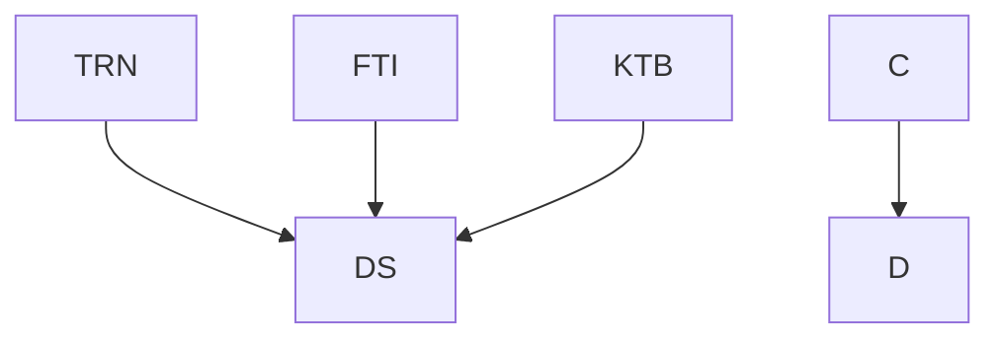

nice

DS      ... Dataset compiled from all data comming from resources {TRN,FTI,KTB}
TRN     ... data from training
FTI     ... data from garmin
KTB     ... data z kalorickych tabulek

Here is a simple flow chart:

